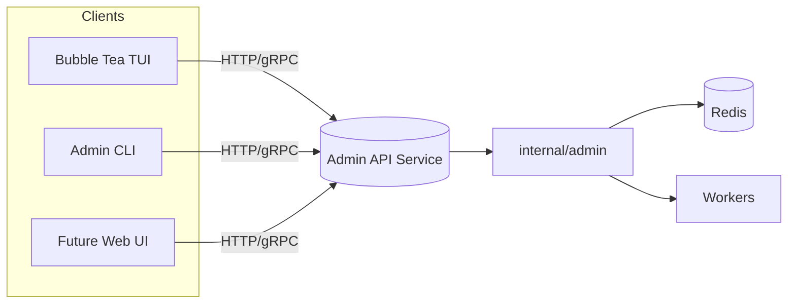
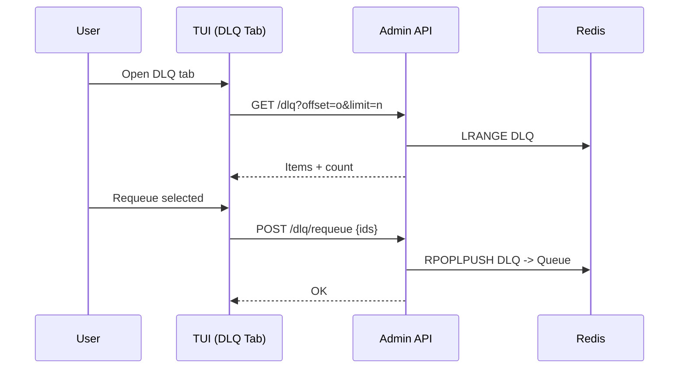
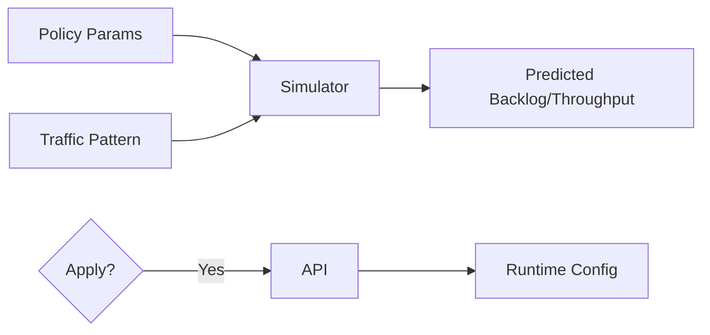

# AGENTS Notes

Quick notes for working on this repo (Go Redis Work Queue) — things I’ve learned / want to remember when iterating fast.

- TUI stack and structure
  - Bubble Tea + Lip Gloss + Bubbles (`table`, `viewport`, `spinner`, `progress`) and a custom scrim overlay (no external overlay dep now).
  - Entry point: `cmd/tui/main.go` constructs `internal/tui` model with config + redis + zap logger.
  - Core TUI files: `internal/tui/{model,init,app,view,commands,overlays}.go`.
  - Tabs: `internal/tui/tabs.go` renders "Job Queue", "Workers", "Dead Letter", "Settings" with per-tab border colors + mouse switching.
  - Data polling: periodic `stats` + `keys` via `internal/admin` helpers; charts maintain short time series per queue alias.

- Overlays and input behavior
  - Confirmation modal and Help use a full-screen scrim overlay that centers content and dims background; resilient to any terminal size.
  - ESC priority:
    1) Close confirm modal if open
    2) Exit bench inputs if focused
    3) Clear active filter
    4) Otherwise toggle Help overlay

- Current tabs
  - Job Queue: existing dashboard (Queues table + Charts + Info). Filter (`f`/`/`), peek (`p`/enter), bench (`b` then enter), progress bar.
  - Workers: placeholder summary (heartbeats, processing lists); will grow to live workers view.
  - Dead Letter: placeholder summary (DLQ key + count) with future actions (peek/purge/requeue).
  - Settings: read-only snapshot of a few config values.

- Keybindings (important)
  - `q`/`ctrl+c`: quit (asks to confirm)
  - `esc`: help toggle, or exit modal/input as above
  - `tab`/`shift+tab`: move panel focus (within Job Queue tab)
  - `j/k`, mouse wheel: scroll
  - `p`/enter on a queue: peek
  - `b`: bench form (tab cycles inputs, enter runs)
  - `f` or `/`: filter queues (fuzzy); `esc` clears
  - `D` / `A`: confirm purge DLQ / purge ALL
  - Mouse: click tabs to switch, left-click (Job Queue) peeks selected

- Redis/admin plumbing
  - Uses `internal/admin` for `Stats`, `StatsKeys`, `Peek`, `Bench`, `Purge*`.
  - Completed progress for bench is polled from `cfg.Worker.CompletedList` (keep in mind large lists can be slow to LLen).

- Config + run
  - Config path flag: `--config config/config.yaml`, refresh via `--refresh`.
  - Build: `make build` or `go build -o bin/tui ./cmd/tui`; run `./bin/tui --config config/config.yaml`.

- Observability
  - Zap logger; metrics on `:9090/metrics`; liveness `/healthz`, readiness `/readyz`.

- Guardrails
  - Purge actions gated by confirm modal (DLQ / ALL). Don’t run in prod without care.
  - Bench can generate many jobs fast; prefer test env and lower rates.

- Near-term TODOs I’m targeting
  - Charts expand-on-click (toggle 2/3 vs 1/3), precise mouse hitboxes (bubblezone), table polish (striping, thresholds, selection glyph), enqueue actions (`e`/`E`), right-click peek.

## Working Tasklist (maintain and use this from now on)

Use this checklist to track work. Keep it prioritized, update statuses, and reference it in PRs/commits. Add new items as they surface; close them when done.

- [ ] TUI: Charts expand-on-click (Charts 2/3 vs Queues 1/3; toggle back on Queues click)
- [ ] TUI: Integrate `bubblezone` for precise mouse hitboxes (tabs, table rows, future context menus)
- [ ] TUI: Table polish — colorized counts by thresholds (green/yellow/red), selection glyph, alternating row striping
- [ ] TUI: Enqueue actions — `e` enqueue 1 to selected; `E` prompt for count (inline in Info panel)
- [ ] TUI: Right-click on Queues — peek selected (later: context menu with actions)
- [ ] TUI: Keyboard shortcuts for tabs (`1`..`4` to switch)
- [ ] TUI: Persist UI state across sessions (active tab, focus panel, filter value)
- [ ] TUI: Improve tiny-terminal layout — stack panels vertically; clamp widths; hide charts if extremely narrow
- [ ] TUI: Adjustable panel split — keys (`[`/`]`) or drag on splitter (mouse) to change left/right ratio
- [ ] TUI: Bench UX — cancel with ESC; show ETA; live throughput; configurable payload size and jitter; concurrency knob
- [ ] TUI: Bench progress baseline — compute delta from initial `CompletedList` length (avoid overcount if list pre-populated)
- [ ] TUI: DLQ tab — list/paginate items; peek full payload; requeue selected; purge selected; search/filter
- [ ] TUI: Workers tab — list worker IDs, last heartbeat time, processing queue/job; sort and filter
- [ ] TUI: Settings tab — theme toggle; show config path; copy key values; open config file shortcut
- [ ] TUI: Theme system — centralize styles; dark/light + high-contrast palette via lipgloss adaptive colors
- [ ] TUI: Help overlay — expand with all shortcuts (tabs, enqueue, right-click), add mouse hints, link to README
- [ ] TUI: Mouse UX — double-click row to peek; click column header to sort if supported
- [ ] TUI: Non-blocking error toasts/status area for transient errors (top-right), with log tail in Info
- [ ] TUI: Unit tests for pure helpers (filtering, formatting, thresholds, clamp)
- [ ] Admin: Requeue-from-DLQ command with count/range support (exposed to TUI)
- [ ] Admin: Workers-list admin call (IDs, last heartbeat, active item) for Workers tab
- [ ] Metrics: Optional TUI runtime metrics (ticks, RPC latency) for debugging
- [ ] Docs: Update README TUI section with tabs, screenshots, and new keybindings
- [ ] Release: Add changelog entries for TUI tabbed layout and overlays

## WILD IDEAS — HAVE A BRAINSTORM

Capture ambitious, unconventional ideas. Some may be long-term or require new components; still worth recording for future exploration.

- TUI: Live log tail + trace drill-down — attach to worker logs, show correlated OpenTelemetry spans; press a job to open its trace waterfall.
- TUI: Visual DAG builder for multi-step workflows — drag-and-drop stages with dependencies, retries, and compensation actions; submit as a reusable pipeline.
- TUI: Anomaly radar — backlog growth, p95 latency spikes, failure-rate heatmap; SLO error budget meter with burn alerts.
- TUI: Interactive policy tuning — edit retry/backoff, rate limits, concurrency caps; preview impact with a simulator; apply with one keystroke.
- TUI: Patterned load generator — sine/burst/ramp traffic models; schedule runs; export reproducible profiles for CI.
- TUI: Multi-cluster control — tabs for multiple Redis endpoints; quick switch and side-by-side compare; propagate admin actions across clusters.
- TUI: Plugin panel system — drop-in panels (Go, WASM, or Lua) for custom org metrics, transforms, or actions; hot-reload safely.
- TUI: JSON payload studio — pretty-edit, validate, and enqueue; templates and snippets; schedule run-at/cron.
- TUI: Calendar view — visualize scheduled and recurring jobs; click to reschedule or pause a rule.
- TUI: Worker fleet controls — pause/resume/drain nodes; rolling restarts; live CPU/mem/net graphs per worker.
- TUI: Right-click context menus everywhere — requeue, purge, copy payload, copy Redis key, open trace, export sample.
- TUI: Collaborative session — multiplexed read-only share over SSH; presenter hands control with a key.
- TUI: Theme playground — high-contrast/accessible themes; auto-switch based on OS or time of day.
- Project: HTTP/gRPC admin API — first-class, versioned contract used by both TUI and a web UI; enable remote control and automation.
- Project: Kubernetes Operator — CRDs for queues/workers; reconcile deployments; autoscale by backlog and SLA targets; preemption policies.
- Project: Advanced rate limiting — token-bucket with priority fairness; global and per-tenant budgets; dynamic tuning via feedback signals.
- Project: Producer backpressure — SDK hints when queues are saturated; adaptive rate; circuit breaking by priority.
- Project: Multi-tenant isolation — quotas, per-tenant keys, encryption at rest (payload), audit logs, privacy scrubbing hooks.
- Project: DLQ remediation pipeline — automatic classifiers to cluster failures; rules to auto-retry, transform, or quarantine.
- Project: Storage backends — pluggable engines (Redis Streams, KeyDB/Dragonfly, Redis Cluster); optional Kafka outbox bridge.
- Project: Long-term archives — stream completed jobs to ClickHouse/S3; TTL retention; fast query for forensics.
- Project: Event hooks — webhooks or NATS for job state changes; Slack/PagerDuty notifications with deep links to TUI.
- Project: RBAC and tokens — signed admin commands, per-action permissions; audit trail UI.
- Project: Chaos harness — inject latency, drops, and Redis failovers; visualize recovery; automate soak/chaos scenarios.
- Project: Forecasting — simple ARIMA/Prophet on backlog/throughput; recommend scale-up/down and SLA adjustments.
- Project: Exactly-once patterns — idempotency keys, dedup sets, and transactional outbox patterns documented and optionally enforced.

## Codex's Top Picks

High‑leverage, high‑impact items to pursue first. Keep this table updated as priorities shift.

| Idea | Why | First Steps | Remarks | Difficulty | Complexity | Wow factor | Leverage Factor |
| --- | --- | --- | --- | --- | --- | --- | --- |
| HTTP/gRPC Admin API | Core enabler for TUI/web/automation/RBAC | Define API (proto/OpenAPI); wrap existing admin funcs; add basic auth | Version the API; unlocks Workers/DLQ features and remote ops | Medium | Medium‑High | Medium | High |
| DLQ Remediation UI | Reduces incident toil; fast, visible value | List/paginate DLQ; peek; requeue/purge; add filters/search | Needs admin endpoints; great demo for reliability wins | Medium | Medium | High | High |
| Trace Drill‑down + Log Tail | Deep observability; faster RCA | Ensure trace IDs; link to tracing UI; basic worker log tail with filters | Start with external trace links; mind privacy/log volume | Medium | Medium | High | Medium |
| Interactive Policy Tuning + Simulator | Prevents outages; safe “what‑if” | Read‑only preview; simple backlog/throughput model; dry‑run apply; rollback | Requires admin API to apply; start simulation offline | High | High | High | High |
| Patterned Load Generator | Validates perf; great for demos | Add sine/burst/ramp patterns; save/load profiles; chart overlay | Build on bench; add guardrails (limits/jitter) | Low | Medium | Medium | Medium |
| Anomaly Radar + SLO Budget | At‑a‑glance health; actionable signals | Compute backlog growth, p95, failure rate; thresholds; status widget | Define SLO; calibrate thresholds; integrate metrics | Medium | Medium | Medium‑High | Medium‑High |

## Appendix — Codex Ideas in Detail

Below are more detailed notes for each top pick: motivation, user stories, acceptance criteria, Fibonacci sizing (1–13), LoC estimates, and time/space/storage complexity where applicable, plus dependencies and risks. Use these to shape PRs and acceptance tests.

### 1) HTTP/gRPC Admin API

- Motivation: Create a versioned, secure API to power the TUI, CLI, web UI, and automation. Enables RBAC, remote operations, and clear contracts.
- User stories:
  - As an SRE, I can call Stats/Peek/Purge endpoints safely with auth tokens.
  - As a TUI user, my app consumes a stable v1 API regardless of internal changes.
  - As a developer, I can add an admin operation by implementing a handler and updating the spec.
  - As a security engineer, I can scope tokens/roles to specific admin actions.
- Acceptance criteria:
  - [ ] Spec: OpenAPI (HTTP+JSON) and/or gRPC proto for: Stats, StatsKeys, Peek, PurgeDLQ, PurgeAll, Bench (queued job generator).
  - [ ] Auth: token-based (bearer) middleware, deny-by-default, audit log of admin calls.
  - [ ] Versioning: prefix (`/api/v1`) and compatibility notes; 404/410 for removed endpoints.
  - [ ] Rate limit & safety: protective limits for destructive actions (e.g., purge requires `yes=true`).
  - [ ] Tests: unit tests for handlers, integration tests against ephemeral Redis.
  - [ ] Observability: request logs, basic latency metrics per endpoint.
- Sizing (Fibonacci): 8
- LoC estimate: ~450–750 Go LoC (handlers/middleware/clients) + ~150–250 spec lines (OpenAPI/proto)
- Complexity (time/space/storage): per-request O(1) controller overhead; endpoint complexity dominated by admin ops (e.g., Stats O(k) where k=#queues). Space O(response size); storage n/a.
- Dependencies: existing `internal/admin` funcs.
- Risks: security hardening, long-running handlers, accidental destructive ops (mitigated by guard flags and RBAC).

### 2) DLQ Remediation UI

- Motivation: Reduce incident toil by making DLQ triage fast and safe.
- User stories:
  - As an operator, I can list and filter DLQ items and peek payloads.
  - As an operator, I can requeue selected items and purge specific or all items with confirmations.
  - As an analyst, I can search DLQ by substring to find patterns.
- Acceptance criteria:
  - [ ] DLQ tab lists items with pagination; shows total count; supports filter/search.
  - [ ] Actions: Peek, Requeue selected, Purge selected, Purge all (confirm modal).
  - [ ] Performance: handles large DLQs (paginated calls, no full list materialization).
  - [ ] Errors surfaced non-blocking; destructive actions require confirmation.
- Sizing (Fibonacci): 5 (post‑Admin API)
- LoC estimate: ~300–500 Go LoC (TUI tab + pagination + actions) + ~120–200 Go LoC (API endpoints)
- Complexity (time/space/storage): list page O(p) where p=page size; total pagination O(N). Space O(p) client-side; storage n/a.
- Dependencies: Admin API endpoints for list/peek/requeue/purge.

### 3) Trace Drill‑down + Log Tail

- Motivation: Faster root-cause analysis by correlating jobs with traces and logs.
- User stories:
  - As an SRE, I can see a job’s trace ID and open it in my tracing backend.
  - As a developer, I can tail worker logs filtered by job ID or worker ID within the TUI.
- Acceptance criteria:
  - [ ] Display trace IDs in Peek/Info; “Open Trace” action opens external link or shows inline span summary.
  - [ ] Log tail panel: follow mode, filter (job/worker), backpressure protection (line rate cap).
  - [ ] Configurable tracing base URL and log source.
- Sizing (Fibonacci): 5
- LoC estimate: ~250–400 Go LoC (TUI panels/actions) + small glue to tracing/logs
- Complexity (time/space/storage): trace link open O(1); inline span render O(s) where s=#spans fetched. Log tail O(r) with r=lines/sec; bounded buffer space O(w) where w=window size; storage n/a.
- Dependencies: Ensure trace IDs are propagated and accessible.
- Risks: log volume overhead; privacy controls for payloads/PII.

### 4) Interactive Policy Tuning + Simulator

- Motivation: Safe “what‑if” tuning of retries, rate limits, and concurrency to improve SLOs.
- User stories:
  - As an operator, I can simulate backlog and latency given new policies before applying.
  - As an operator, I can apply changes with a confirmation and rollback if needed.
- Acceptance criteria:
  - [ ] UI to adjust retry/backoff, rate limits, concurrency caps; simulated charts of backlog/throughput/latency.
  - [ ] Model: first‑order queueing approximation (service rate, arrival patterns); display assumptions clearly.
  - [ ] Apply via Admin API with audit log and revert option.
- Sizing (Fibonacci): 13
- LoC estimate: ~500–800 Go LoC (sim model + UI + apply/rollback)
- Complexity (time/space/storage): simulation O(T·M) where T=time steps, M=queues/policies; space O(M) + O(T) for series; storage n/a.
- Dependencies: Admin API config endpoints.
- Risks: false precision in simulation; UX clarity for assumptions.

### 5) Patterned Load Generator

- Motivation: Validate performance under realistic traffic patterns and demo behaviors.
- User stories:
  - As a tester, I can run sine/burst/ramp patterns for a duration and see live charts.
  - As a user, I can save and reload load profiles and cancel a run.
- Acceptance criteria:
  - [ ] Implement patterns: sine, burst, ramp; duration and amplitude controls; guardrails (max rate, total items).
  - [ ] Visualize target vs actual enqueue rate; show errors; support cancel/stop.
  - [ ] Persist/load profiles to disk (optional).
- Sizing (Fibonacci): 3
- LoC estimate: ~200–350 Go LoC (patterns, controls, charts overlay)
- Complexity (time/space/storage): rate calc O(1)/tick; enqueue loop O(duration/step); space O(w) for chart window; storage n/a.
- Dependencies: existing bench plumbing.

### 6) Anomaly Radar + SLO Budget

- Motivation: At‑a‑glance operational health with early warnings and burn rate.
- User stories:
  - As an SRE, I can see backlog growth, error rate, and p95 latency status in one widget.
  - As a team, we define an SLO and see remaining error budget and burn alerts.
- Acceptance criteria:
  - [ ] Compute/display backlog growth rate, failure rate, and p95 latency with thresholds (green/yellow/red).
  - [ ] SLO config (YAML) and calculated error budget burn; simple alerts rendered in TUI.
  - [ ] Lightweight computation (no heavy CPU); sampling acceptable.
- Sizing (Fibonacci): 5
- LoC estimate: ~200–350 Go LoC (computations + widget + config)
- Complexity (time/space/storage): per‑tick metrics compute O(1); rolling windows O(w) memory; storage n/a.
- Dependencies: metrics exposure and sampling.
