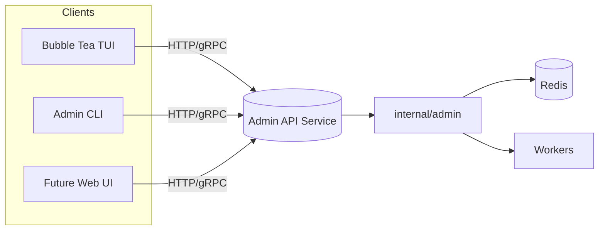
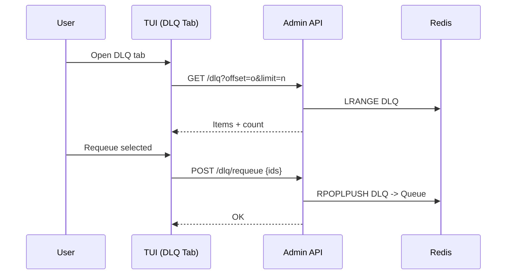
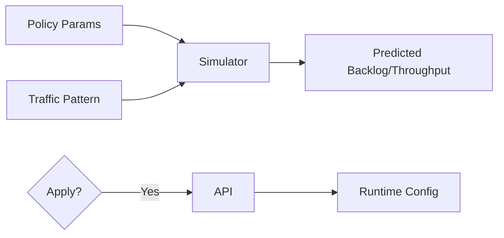

# AGENTS Notes

Quick notes for working on this repo (Go Redis Work Queue) — things I’ve learned / want to remember when iterating fast.

- TUI stack and structure
  - Bubble Tea + Lip Gloss + Bubbles (`table`, `viewport`, `spinner`, `progress`) and a custom scrim overlay (no external overlay dep now).
  - Entry point: `cmd/tui/main.go` constructs `internal/tui` model with config + redis + zap logger.
  - Core TUI files: `internal/tui/{model,init,app,view,commands,overlays}.go`.
  - Tabs: `internal/tui/tabs.go` renders "Job Queue", "Workers", "Dead Letter", "Settings" with per-tab border colors + mouse switching.
  - Data polling: periodic `stats` + `keys` via `internal/admin` helpers; charts maintain short time series per queue alias.

- Overlays and input behavior
  - Confirmation modal and Help use a full-screen scrim overlay that centers content and dims background; resilient to any terminal size.
  - ESC priority:
    1) Close confirm modal if open
    2) Exit bench inputs if focused
    3) Clear active filter
    4) Otherwise toggle Help overlay

- Current tabs
  - Job Queue: existing dashboard (Queues table + Charts + Info). Filter (`f`/`/`), peek (`p`/enter), bench (`b` then enter), progress bar.
  - Workers: placeholder summary (heartbeats, processing lists); will grow to live workers view.
  - Dead Letter: placeholder summary (DLQ key + count) with future actions (peek/purge/requeue).
  - Settings: read-only snapshot of a few config values.

- Keybindings (important)
  - `q`/`ctrl+c`: quit (asks to confirm)
  - `esc`: help toggle, or exit modal/input as above
  - `tab`/`shift+tab`: move panel focus (within Job Queue tab)
  - `j/k`, mouse wheel: scroll
  - `p`/enter on a queue: peek
  - `b`: bench form (tab cycles inputs, enter runs)
  - `f` or `/`: filter queues (fuzzy); `esc` clears
  - `D` / `A`: confirm purge DLQ / purge ALL
  - Mouse: click tabs to switch, left-click (Job Queue) peeks selected

- Redis/admin plumbing
  - Uses `internal/admin` for `Stats`, `StatsKeys`, `Peek`, `Bench`, `Purge*`.
  - Completed progress for bench is polled from `cfg.Worker.CompletedList` (keep in mind large lists can be slow to LLen).

- Config + run
  - Config path flag: `--config config/config.yaml`, refresh via `--refresh`.
  - Build: `make build` or `go build -o bin/tui ./cmd/tui`; run `./bin/tui --config config/config.yaml`.

- Observability
  - Zap logger; metrics on `:9090/metrics`; liveness `/healthz`, readiness `/readyz`.

- Guardrails
  - Purge actions gated by confirm modal (DLQ / ALL). Don’t run in prod without care.
  - Bench can generate many jobs fast; prefer test env and lower rates.

- Near-term TODOs I’m targeting
  - Charts expand-on-click (toggle 2/3 vs 1/3), precise mouse hitboxes (bubblezone), table polish (striping, thresholds, selection glyph), enqueue actions (`e`/`E`), right-click peek.

## Working Tasklist (maintain and use this from now on)

Use this checklist to track work. Keep it prioritized, update statuses, and reference it in PRs/commits. Add new items as they surface; close them when done.

- [ ] TUI: Charts expand-on-click (Charts 2/3 vs Queues 1/3; toggle back on Queues click)
- [ ] TUI: Integrate `bubblezone` for precise mouse hitboxes (tabs, table rows, future context menus)
- [ ] TUI: Table polish — colorized counts by thresholds (green/yellow/red), selection glyph, alternating row striping
- [ ] TUI: Enqueue actions — `e` enqueue 1 to selected; `E` prompt for count (inline in Info panel)
- [ ] TUI: Right-click on Queues — peek selected (later: context menu with actions)
- [ ] TUI: Keyboard shortcuts for tabs (`1`..`4` to switch)
- [ ] TUI: Persist UI state across sessions (active tab, focus panel, filter value)
- [ ] TUI: Improve tiny-terminal layout — stack panels vertically; clamp widths; hide charts if extremely narrow
- [ ] TUI: Adjustable panel split — keys (`[`/`]`) or drag on splitter (mouse) to change left/right ratio
- [ ] TUI: Bench UX — cancel with ESC; show ETA; live throughput; configurable payload size and jitter; concurrency knob
- [ ] TUI: Bench progress baseline — compute delta from initial `CompletedList` length (avoid overcount if list pre-populated)
- [ ] TUI: DLQ tab — list/paginate items; peek full payload; requeue selected; purge selected; search/filter
- [ ] TUI: Workers tab — list worker IDs, last heartbeat time, processing queue/job; sort and filter
- [ ] TUI: Settings tab — theme toggle; show config path; copy key values; open config file shortcut
- [ ] TUI: Theme system — centralize styles; dark/light + high-contrast palette via lipgloss adaptive colors
- [ ] TUI: Help overlay — expand with all shortcuts (tabs, enqueue, right-click), add mouse hints, link to README
- [ ] TUI: Mouse UX — double-click row to peek; click column header to sort if supported
- [ ] TUI: Non-blocking error toasts/status area for transient errors (top-right), with log tail in Info
- [ ] TUI: Unit tests for pure helpers (filtering, formatting, thresholds, clamp)
- [ ] Admin: Requeue-from-DLQ command with count/range support (exposed to TUI)
- [ ] Admin: Workers-list admin call (IDs, last heartbeat, active item) for Workers tab
- [ ] Metrics: Optional TUI runtime metrics (ticks, RPC latency) for debugging
- [ ] Docs: Update README TUI section with tabs, screenshots, and new keybindings
- [ ] Release: Add changelog entries for TUI tabbed layout and overlays

## WILD IDEAS — HAVE A BRAINSTORM

Capture ambitious, unconventional ideas. Some may be long-term or require new components; still worth recording for future exploration.

- TUI: Live log tail + trace drill-down — attach to worker logs, show correlated OpenTelemetry spans; press a job to open its trace waterfall.
- TUI: Visual DAG builder for multi-step workflows — drag-and-drop stages with dependencies, retries, and compensation actions; submit as a reusable pipeline.
- TUI: Anomaly radar — backlog growth, p95 latency spikes, failure-rate heatmap; SLO error budget meter with burn alerts.
- TUI: Interactive policy tuning — edit retry/backoff, rate limits, concurrency caps; preview impact with a simulator; apply with one keystroke.
- TUI: Patterned load generator — sine/burst/ramp traffic models; schedule runs; export reproducible profiles for CI.
- TUI: Multi-cluster control — tabs for multiple Redis endpoints; quick switch and side-by-side compare; propagate admin actions across clusters.
- TUI: Plugin panel system — drop-in panels (Go, WASM, or Lua) for custom org metrics, transforms, or actions; hot-reload safely.
- TUI: JSON payload studio — pretty-edit, validate, and enqueue; templates and snippets; schedule run-at/cron.
- TUI: Calendar view — visualize scheduled and recurring jobs; click to reschedule or pause a rule.
- TUI: Worker fleet controls — pause/resume/drain nodes; rolling restarts; live CPU/mem/net graphs per worker.
- TUI: Right-click context menus everywhere — requeue, purge, copy payload, copy Redis key, open trace, export sample.
- TUI: Collaborative session — multiplexed read-only share over SSH; presenter hands control with a key.
- TUI: Theme playground — high-contrast/accessible themes; auto-switch based on OS or time of day.
- Project: HTTP/gRPC admin API — first-class, versioned contract used by both TUI and a web UI; enable remote control and automation.
- Project: Kubernetes Operator — CRDs for queues/workers; reconcile deployments; autoscale by backlog and SLA targets; preemption policies.
- Project: Advanced rate limiting — token-bucket with priority fairness; global and per-tenant budgets; dynamic tuning via feedback signals.
- Project: Producer backpressure — SDK hints when queues are saturated; adaptive rate; circuit breaking by priority.
- Project: Multi-tenant isolation — quotas, per-tenant keys, encryption at rest (payload), audit logs, privacy scrubbing hooks.
- Project: DLQ remediation pipeline — automatic classifiers to cluster failures; rules to auto-retry, transform, or quarantine.
- Project: Storage backends — pluggable engines (Redis Streams, KeyDB/Dragonfly, Redis Cluster); optional Kafka outbox bridge.
- Project: Long-term archives — stream completed jobs to ClickHouse/S3; TTL retention; fast query for forensics.
- Project: Event hooks — webhooks or NATS for job state changes; Slack/PagerDuty notifications with deep links to TUI.
- Project: RBAC and tokens — signed admin commands, per-action permissions; audit trail UI.
- Project: Chaos harness — inject latency, drops, and Redis failovers; visualize recovery; automate soak/chaos scenarios.
- Project: Forecasting — simple ARIMA/Prophet on backlog/throughput; recommend scale-up/down and SLA adjustments.
- Project: Exactly-once patterns — idempotency keys, dedup sets, and transactional outbox patterns documented and optionally enforced.

## Codex's Top Picks

High‑leverage, high‑impact items to pursue first. Keep this table updated as priorities shift.

| Idea                                  | Why                                        | First Steps                                                                 | Remarks                                                      | Difficulty | Complexity  | Wow factor  | Leverage Factor |
| ------------------------------------- | ------------------------------------------ | --------------------------------------------------------------------------- | ------------------------------------------------------------ | ---------- | ----------- | ----------- | --------------- |
| HTTP/gRPC Admin API                   | Core enabler for TUI/web/automation/RBAC   | Define API (proto/OpenAPI); wrap existing admin funcs; add basic auth       | Version the API; unlocks Workers/DLQ features and remote ops | Medium     | Medium‑High | Medium      | High            |
| DLQ Remediation UI                    | Reduces incident toil; fast, visible value | List/paginate DLQ; peek; requeue/purge; add filters/search                  | Needs admin endpoints; great demo for reliability wins       | Medium     | Medium      | High        | High            |
| Trace Drill‑down + Log Tail           | Deep observability; faster RCA             | Ensure trace IDs; link to tracing UI; basic worker log tail with filters    | Start with external trace links; mind privacy/log volume     | Medium     | Medium      | High        | Medium          |
| Interactive Policy Tuning + Simulator | Prevents outages; safe “what‑if”           | Read‑only preview; simple backlog/throughput model; dry‑run apply; rollback | Requires admin API to apply; start simulation offline        | High       | High        | High        | High            |
| Patterned Load Generator              | Validates perf; great for demos            | Add sine/burst/ramp patterns; save/load profiles; chart overlay             | Build on bench; add guardrails (limits/jitter)               | Low        | Medium      | Medium      | Medium          |
| Anomaly Radar + SLO Budget            | At‑a‑glance health; actionable signals     | Compute backlog growth, p95, failure rate; thresholds; status widget        | Define SLO; calibrate thresholds; integrate metrics          | Medium     | Medium      | Medium‑High | Medium‑High     |

## Appendix — Codex Ideas in Detail

Below are detailed briefs for each top pick: each begins with a summary table, followed by Executive Summary, Motivation, Tech Plan, User Stories with Acceptance Criteria, Definition of Done, Test Plan, and a Task List.

### 1) HTTP/gRPC Admin API

| Priority | Domain | Dependencies | Risks | LoC Estimate | Complexity | Effort | Impact |
| --- | --- | --- | --- | --- | --- | --- | --- |
| High | API/Platform | `internal/admin`, auth middleware | Security hardening, destructive ops, compat drift | ~600–1000 (Go+spec) | Med‑High (per‑req O(1); Stats O(k)) | 8 (Fib) | High |

**Executive Summary**
- Define a versioned, secure Admin API (HTTP/gRPC) that fronts existing admin functions, enabling TUI/web/automation with RBAC and observability.

**Motivation**
- Create a stable contract for admin operations, allow remote control, and unlock future UI features while enforcing safety and auditability.

**Tech Plan**
- Choose transport: HTTP+JSON (OpenAPI) with optional gRPC; generate clients where useful.
- Implement middleware: auth (bearer), rate limiting, request logging, correlation IDs.
- Map handlers to `internal/admin` functions; add pagination/validation.
- Versioning: `/api/v1`; document compat policy; structured errors.
- Observability: metrics (per-endpoint latency/error), audit logs for destructive ops.
- Ship minimal clients for TUI/CLI; integration tests with ephemeral Redis.

**User Stories + Acceptance Criteria**
- As an SRE, I can call Stats/Peek/Purge endpoints with auth tokens.
- As a TUI user, I consume a stable v1 API regardless of internal changes.
- As a security engineer, I can scope tokens/roles to admin actions.
- Acceptance:
  - [ ] Spec published (OpenAPI and/or proto) for Stats, StatsKeys, Peek, PurgeDLQ, PurgeAll, Bench.
  - [ ] Auth with deny‑by‑default; tokens verified; audit log persisted for destructive calls.
  - [ ] Rate limits and explicit confirmation flags for destructive actions.
  - [ ] Versioned paths; compat notes; structured error schema.
  - [ ] Handler unit tests and integration tests pass in CI.

**Definition of Done**
- Docs for endpoints, auth, rate limits, and versioning; CI green with tests; TUI switched to the API for at least one op (Stats).

**Test Plan**
- Unit: middleware (auth/rate/log) and handlers; fuzz path/query parsing.
- Integration: dockerized Redis; golden responses; auth failure/expiry cases.
- Security: basic token leakage and privilege tests.

**Task List**
- [ ] Draft OpenAPI/proto; agree on schemas
- [ ] Auth middleware + config
- [ ] Implement Stats/StatsKeys
- [ ] Implement Peek
- [ ] Implement PurgeDLQ/PurgeAll with confirmations
- [ ] Implement Bench
- [ ] Add metrics + audit logs
- [ ] Write unit/integration tests
- [ ] Wire TUI Stats to API

### 2) DLQ Remediation UI

| Priority | Domain | Dependencies | Risks | LoC Estimate | Complexity | Effort | Impact |
| --- | --- | --- | --- | --- | --- | --- | --- |
| High | Ops UX / TUI | Admin API (list/peek/requeue/purge) | Large DLQ perf, destructive ops | ~420–700 (TUI+API) | Medium (page O(p), total O(N)) | 5 (Fib) | High |

**Executive Summary**
- A focused DLQ tab to list, search, peek, requeue, and purge items safely with confirmations.

**Motivation**
- Reduce incident toil; provide a fast remediation loop within the TUI.

**Tech Plan**
- API: add DLQ list with pagination, peek by index/ID, requeue selected, purge endpoints.
- TUI: DLQ tab with pager, filter, selection; action bar; confirmations.
- Performance: server-side pagination; cap payload sizes; streaming where feasible.

**User Stories + Acceptance Criteria**
- As an operator, I can list and filter DLQ items and peek payloads.
- As an operator, I can requeue or purge selected items with confirmation.
- Acceptance:
  - [ ] DLQ list is paginated with total count and filter.
  - [ ] Peek shows pretty JSON and metadata.
  - [ ] Requeue/Purge actions exist for selected items; purge all gated by confirm.
  - [ ] Handles large DLQs without freezing the UI.

**Definition of Done**
- Usable DLQ tab with list/peek/requeue/purge; README and keybindings updated; basic load test run.

**Test Plan**
- API: pagination correctness; requeue idempotency; purge limits.
- TUI: interaction tests (manual + scripted); large list navigation.

**Task List**
- [ ] API: list + count with filters
- [ ] API: peek item by ID/index
- [ ] API: requeue selected
- [ ] API: purge selected/all
- [ ] TUI: DLQ tab UI + pager + actions
- [ ] Docs + screenshots

### 3) Trace Drill‑down + Log Tail

| Priority | Domain | Dependencies | Risks | LoC Estimate | Complexity | Effort | Impact |
| --- | --- | --- | --- | --- | --- | --- | --- |
| Med‑High | Observability / TUI | Trace propagation; log source | Log volume, PII | ~250–400 | Medium | 5 (Fib) | High |

**Executive Summary**
- Surface trace IDs in the TUI and provide a log tail pane with filters to accelerate RCA.

**Motivation**
- Tighten the feedback loop from failing jobs to actionable traces/logs.

**Tech Plan**
- Ensure trace IDs captured in payload/metadata; configurable tracing base URL.
- Add “Open Trace” action (external link or inline spans summary).
- Implement lightweight log tailer with rate cap and filters by job/worker.

**User Stories + Acceptance Criteria**
- As an SRE, I can open a job’s trace from the TUI.
- As a developer, I can tail logs filtered by job or worker.
- Acceptance:
  - [ ] Trace IDs visible in Peek/Info; action to open.
  - [ ] Log tail pane with follow mode, filters, and backpressure protection.
  - [ ] Configurable endpoints for tracing and logs.

**Definition of Done**
- Trace link + log tail pane shipped; docs include setup; basic perf validation under load.

**Test Plan**
- Unit: parsing/extraction of IDs; log throttling logic.
- Manual: links open correct trace; tailing with filters; behavior under bursty logs.

**Task List**
- [ ] Capture/propagate trace IDs
- [ ] Add Open Trace action
- [ ] Implement log tail pane with filters
- [ ] Docs and examples

### 4) Interactive Policy Tuning + Simulator

| Priority | Domain | Dependencies | Risks | LoC Estimate | Complexity | Effort | Impact |
| --- | --- | --- | --- | --- | --- | --- | --- |
| Medium | Control Plane / TUI | Admin API config endpoints | False precision, misuse | ~500–800 | High (Sim O(T·M)) | 13 (Fib) | High |

**Executive Summary**
- A “what‑if” simulator to preview the impact of policy changes (retry/backoff, rate limits, concurrency) before applying.

**Motivation**
- Prevent outages and tune SLOs by testing changes safely.

**Tech Plan**
- Build a first‑order queueing model; configurable traffic patterns; show predicted backlog/throughput/latency.
- Integrate apply/rollback via Admin API; include audit trail.

**User Stories + Acceptance Criteria**
- As an operator, I can simulate and apply policy changes with confidence.
- Acceptance:
  - [ ] UI sliders/inputs for core policies; charts update with predictions.
  - [ ] Clear assumptions and limitations documented inline.
  - [ ] Apply/rollback via Admin API with audit log.

**Definition of Done**
- Simulator usable for core policies; documented; apply/rollback tested end‑to‑end.

**Test Plan**
- Unit: math/model validation; boundary cases.
- Integration: dry‑run vs live; rollback correctness.

**Task List**
- [ ] Implement core sim model
- [ ] UI: controls + charts
- [ ] Admin API: apply/rollback endpoints
- [ ] Docs + inline assumptions

### 5) Patterned Load Generator

| Priority | Domain | Dependencies | Risks | LoC Estimate | Complexity | Effort | Impact |
| --- | --- | --- | --- | --- | --- | --- | --- |
| Medium | Bench/Load | Existing bench plumbing | Overloading env, noisy graphs | ~200–350 | Medium (per tick O(1)) | 3 (Fib) | Medium |

**Executive Summary**
- Extend the bench tool to support sine/burst/ramp patterns, with guardrails and live visualization.

**Motivation**
- Validate behavior under realistic traffic and create great demos.

**Tech Plan**
- Implement pattern generators; controls for duration/amplitude; guardrails (max rate/total).
- Overlay target vs actual enqueue rate on charts; profile persistence optional.

**User Stories + Acceptance Criteria**
- As a tester, I can run predefined patterns and see accurate live charts.
- Acceptance:
  - [ ] Sine, burst, ramp patterns; cancel/stop supported.
  - [ ] Guardrails prevent runaway load.
  - [ ] Saved profiles can be reloaded.

**Definition of Done**
- Patterns implemented with charts; docs include examples and cautions.

**Test Plan**
- Unit: pattern math; guardrails.
- Manual: visualize and compare patterns; cancellation behavior.

**Task List**
- [ ] Implement sine/burst/ramp
- [ ] Add controls + guardrails
- [ ] Chart overlay target vs actual
- [ ] Save/load profiles

### 6) Anomaly Radar + SLO Budget

| Priority | Domain | Dependencies | Risks | LoC Estimate | Complexity | Effort | Impact |
| --- | --- | --- | --- | --- | --- | --- | --- |
| Medium | Observability | Metrics exposure/sampling | Threshold tuning, noise | ~200–350 | Medium (per tick O(1)) | 5 (Fib) | Med‑High |

**Executive Summary**
- A compact widget showing backlog growth, error rate, and p95 with SLO budget and burn alerts.

**Motivation**
- Provide immediate health signals and guide operational action.

**Tech Plan**
- Compute rolling rates and percentiles with light sampling; thresholds for colorization.
- Configurable SLO target and window; simple burn rate calculation.

**User Stories + Acceptance Criteria**
- As an SRE, I can see whether we’re inside SLO and how fast we’re burning budget.
- Acceptance:
  - [ ] Backlog growth, failure rate, and p95 displayed with thresholds.
  - [ ] SLO config and budget burn shown; alert when burning too fast.
  - [ ] Lightweight CPU/memory footprint.

**Definition of Done**
- Widget integrated; configs documented; behavior validated under synthetic load.

**Test Plan**
- Unit: rolling window calcs; thresholding logic.
- Manual: verify color transitions and alerting conditions.

**Task List**
- [ ] Implement rolling metrics
- [ ] Add SLO config + budget calc
- [ ] Integrate widget + thresholds
- [ ] Document usage and tuning
