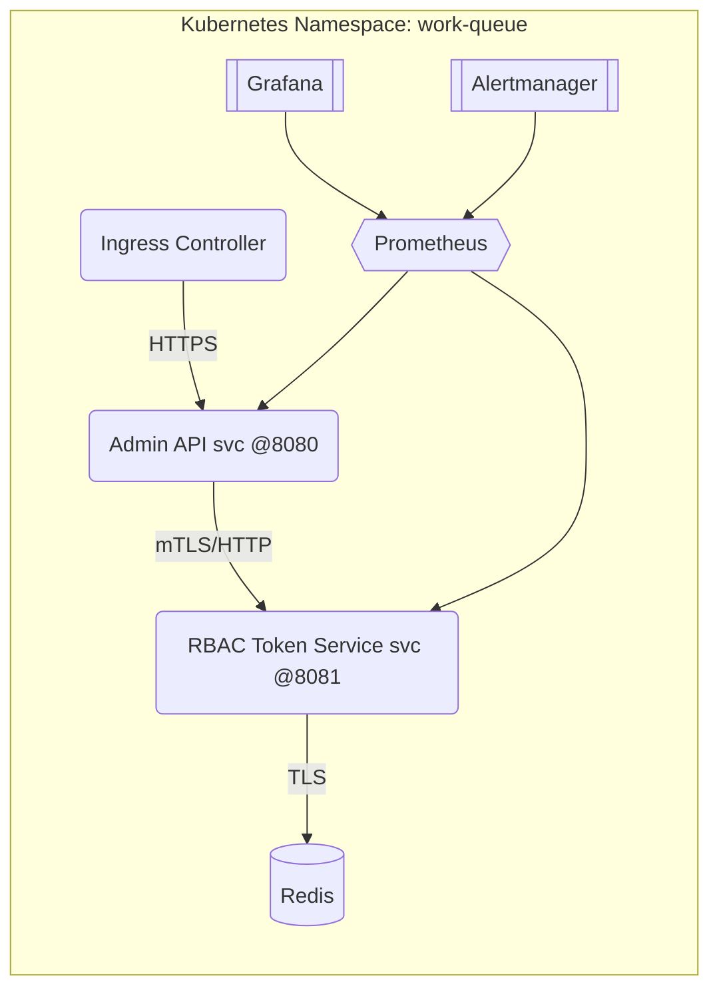

# RBAC Token Service Deployment Guide

This guide covers the deployment of the RBAC Token Service to staging and production environments.

## Overview

The RBAC Token Service provides role-based access control and JWT/PASETO token management for the Redis Work Queue system. It includes:

- **Token Management**: JWT/PASETO token generation and validation
- **Role-Based Access Control**: Hierarchical roles with inheritance
- **Audit Logging**: Comprehensive security event logging
- **Key Rotation**: Automatic key rotation with grace periods
- **Rate Limiting**: Protection against abuse
- **Monitoring**: Prometheus metrics and Grafana dashboards

## Architecture

### Network Topology
- **Namespace:** `work-queue`; all control-plane workloads run in this namespace.
- **Ingress → Admin API:** HTTPS ingress terminates TLS and forwards to the `admin-api` service (`ClusterIP`, port 8080).
- **Admin API ↔ RBAC Token Service:** Admin API calls the token service over the cluster network (`ClusterIP`, port 8081) for policy decisions and token minting.
- **RBAC Token Service ↔ Redis:** The service connects to the Redis state store (`StatefulSet` or managed instance) on port 6379 using a dedicated Redis user/ACL.
- **Observability Stack:** Prometheus scrapes both admin API and token service via `ServiceMonitor`s; Grafana and Alertmanager sit behind an internal NetworkPolicy‑guarded namespace.



### Security Boundaries
- **Network Policies:** Token service accepts traffic only from the admin API and Prometheus scrape jobs; outbound access limited to Redis and metrics endpoints.
- **Secrets:** JWT signing keys, Redis credentials, and encryption keys are stored in `rbac-secrets` (Kubernetes `Secret`) or Docker secrets; mounted read-only in pods.
- **Service Accounts & RBAC:** Dedicated service account `rbac-token-service` with least-privilege RBAC (configmap/secret read, metrics write).
- **TLS:** External ingress terminates TLS; internal service-to-service communication uses cluster certificates or mTLS depending on environment.

### Data Flow
1. Client request hits the ingress and reaches the admin API.
2. Admin API validates existing tokens with the RBAC token service.
3. Token service looks up roles/resources in ConfigMaps, checks Redis for revocation lists, and emits audit logs.
4. Responses return to the client; metrics and audit events flow to Prometheus and persistent storage respectively.

### Port Reference
| Component            | Service Port | Protocol | Notes                              |
|--------------------- |-------------:|----------|------------------------------------|
| Admin API            | 8080         | HTTP/TLS | Exposed via ingress                |
| RBAC Token Service   | 8081         | HTTP     | Internal only (ClusterIP)          |
| Redis                | 6379         | TCP/TLS  | ACL-protected connection           |
| Prometheus           | 9090         | HTTP     | Metrics UI (cluster internal)      |
| Grafana              | 3000         | HTTP/TLS | Optional ingress for dashboards    |
| Alertmanager         | 9093         | HTTP/TLS | Optional ingress for alerts        |

### Service Dependencies & Startup Order
1. **Redis** with required ACLs and secrets in place.
2. **RBAC Token Service** (requires Redis and secrets/config maps).
3. **Admin API** (requires token service healthy).
4. **Observability stack** (Prometheus → Grafana/Alertmanager) can start in parallel once core services are registered.

## Components

### Docker Components
- **Dockerfile.rbac-token-service**: Multi-stage build with security hardening
- **docker-compose.yaml**: Updated with RBAC service and environment variables
- **Configuration files**: roles.yaml, resources.yaml, token-service.yaml

### Kubernetes Components
- **Namespace**: work-queue
- **Deployment**: rbac-token-service with 2+ replicas
- **Service**: ClusterIP service for internal communication
- **ConfigMap**: RBAC configuration (roles, resources, token settings)
- **Secret**: Secure keys and passwords
- **PersistentVolumeClaims**: For keys and audit logs
- **ServiceAccount & RBAC**: Kubernetes cluster permissions
- **Ingress**: External access with TLS
- **HPA**: Auto-scaling based on CPU/memory
- **PDB**: Pod disruption budget for availability

### Monitoring Components
- **ServiceMonitor**: Prometheus scraping configuration
- **PrometheusRule**: Alert rules for security and performance
- **Grafana Dashboard**: Real-time metrics visualization

## Deployment Scripts

### 1. deploy-rbac-staging.sh
Primary deployment script for staging environment.

**Features:**
- Prerequisites checking (kubectl, docker, cluster connectivity)
- Secure secret generation (256-bit keys, random passwords)
- Docker image building and tagging
- Kubernetes resource deployment
- Health checks and validation
- Deployment status reporting

**Usage:**
```bash
./deployments/scripts/deploy-rbac-staging.sh
```

### 2. health-check-rbac.sh
Comprehensive health checking script.

**Features:**
- Deployment and pod status verification
- HTTP endpoint testing (health, metrics)
- Configuration validation
- Resource usage monitoring
- Recent log analysis
- Detailed reporting

**Usage:**
```bash
./deployments/scripts/health-check-rbac.sh
```

**Options:**
- `-n, --namespace`: Target namespace (default: work-queue)
- `-s, --service`: Service name (default: rbac-token-service)
- `-t, --timeout`: HTTP timeout (default: 30s)

### 3. setup-monitoring.sh
Monitoring and alerting setup script.

**Features:**
- ServiceMonitor deployment
- Prometheus rules deployment
- Grafana dashboard creation
- AlertManager configuration
- Monitoring validation

**Usage:**
```bash
./deployments/scripts/setup-monitoring.sh
```

### 4. test-staging-deployment.sh
Comprehensive staging deployment testing.

**Features:**
- End-to-end testing suite
- HTTP endpoint validation
- RBAC functionality testing
- Resource constraint verification
- Monitoring setup validation
- Detailed test reporting

**Usage:**
```bash
./deployments/scripts/test-staging-deployment.sh
```

## Configuration

### Environment Variables

The RBAC Token Service uses the following environment variables:

| Variable | Description | Default |
|----------|-------------|---------|
| `REDIS_HOST` | Redis server hostname | localhost |
| `REDIS_PORT` | Redis server port | 6379 |
| `REDIS_PASSWORD` | Redis password | (from secret) |
| `RBAC_SIGNING_KEY` | JWT signing key | (from secret) |
| `RBAC_ENCRYPTION_KEY` | Encryption key | (from secret) |
| `LOG_LEVEL` | Logging level | info |

### Configuration Files

#### roles.yaml
Defines user roles and their permissions:
- **viewer**: Read-only access
- **operator**: Basic operations + job enqueuing
- **maintainer**: Advanced operations + DLQ management
- **admin**: Full administrative access

#### resources.yaml
Defines resources and actions:
- Resource patterns (queues, environments, schedules)
- Action definitions with risk levels
- Rate limits and constraints
- API endpoint mappings

#### token-service.yaml
Service configuration:
- Server settings (timeouts, limits)
- Token configuration (format, TTL, issuer)
- Key management settings
- Audit and security options

## Security Features

### Token Security
- **Multiple formats**: JWT and PASETO support
- **Key rotation**: Automatic rotation with grace periods
- **Secure algorithms**: HS256, ES256, EdDSA support
- **TTL management**: Configurable token lifetimes

### Access Control
- **Role inheritance**: Hierarchical permission model
- **Resource constraints**: Fine-grained resource access
- **Rate limiting**: Protection against abuse
- **Audit logging**: Comprehensive security events

### Infrastructure Security
- **Non-root containers**: Security hardened containers
- **Secret management**: Kubernetes secrets for sensitive data
- **Network policies**: Optional network isolation
- **TLS encryption**: End-to-end encryption

## Monitoring and Alerts

### Metrics
The service exposes Prometheus metrics including:
- HTTP request rates and latencies
- Token validation metrics
- Security event counters
- Resource usage statistics
- Business logic metrics

### Alert Rules
Configured alerts for:
- **Critical**: Service down, high error rates, security breaches
- **Warning**: High latency, resource usage, maintenance needs
- **Info**: Admin activity spikes, system events

### Grafana Dashboard
Real-time dashboard showing:
- Service availability and health
- Request rates and response times
- Token operations and errors
- Security events and threats
- Resource usage trends

## Deployment Process

### Staging Deployment

1. **Preparation**
   ```bash
   # Verify cluster access
   kubectl cluster-info

   # Check/create namespace
   kubectl get namespace work-queue || kubectl create namespace work-queue
   ```

2. **Deploy to Staging**
   ```bash
   # Run main deployment script
   ./deployments/scripts/deploy-rbac-staging.sh

   # Setup monitoring
   ./deployments/scripts/setup-monitoring.sh
   ```

3. **Validate Deployment**
   ```bash
   # Run health checks
   ./deployments/scripts/health-check-rbac.sh

   # Run comprehensive tests
   ./deployments/scripts/test-staging-deployment.sh
   ```

4. **Access Service**
   ```bash
   # Port forward for testing
   kubectl port-forward service/rbac-token-service 8081:80 -n work-queue

   # Test endpoints
   curl http://localhost:8081/health
   curl http://localhost:8081/metrics
   ```

### Production Deployment

**Important**: This task is configured to STOP at staging deployment. Production deployment requires additional approvals and procedures.

For production deployment, consider:
- **Blue-green deployment**: Zero-downtime deployment strategy
- **Database migrations**: Handle schema changes carefully
- **Load testing**: Verify performance under production load
- **Monitoring validation**: Ensure all alerts are properly configured
- **Backup verification**: Test backup and recovery procedures
- **Security review**: Final security assessment

## Troubleshooting

### Common Issues

1. **Pod Not Starting**
   ```bash
   kubectl describe pod <pod-name> -n work-queue
   kubectl logs <pod-name> -n work-queue
   ```

2. **Service Not Accessible**
   ```bash
   kubectl get svc rbac-token-service -n work-queue
   kubectl get endpoints rbac-token-service -n work-queue
   ```

3. **Configuration Issues**
   ```bash
   kubectl get configmap rbac-config -n work-queue -o yaml
   kubectl get secret rbac-secrets -n work-queue
   ```

4. **Storage Issues**
   ```bash
   kubectl get pvc -n work-queue
   kubectl describe pvc rbac-keys-pvc -n work-queue
   ```

### Log Analysis

The service provides structured JSON logs. Key log categories:

- **Access logs**: HTTP requests and responses
- **Security logs**: Authentication and authorization events
- **Audit logs**: Administrative actions and security events
- **Error logs**: Application errors and failures

### Performance Tuning

Monitor these metrics for performance optimization:

- **Response times**: Target p95 < 100ms for token operations
- **Throughput**: Monitor requests per second capacity
- **Memory usage**: Watch for memory leaks or excessive usage
- **CPU usage**: Optimize for consistent low CPU usage

## Security Best Practices

### Key Management
- Rotate signing keys every 30 days
- Use strong random keys (256-bit minimum)
- Store keys securely in Kubernetes secrets
- Implement key versioning for zero-downtime rotation

### Access Control
- Follow principle of least privilege
- Regularly review and audit user permissions
- Monitor for unusual access patterns
- Implement IP whitelisting where appropriate

### Monitoring
- Set up alerts for security events
- Monitor for brute force attacks
- Track privilege escalations
- Regular security assessment

## Maintenance

### Regular Tasks
- **Weekly**: Review audit logs and security alerts
- **Monthly**: Rotate signing keys and review permissions
- **Quarterly**: Security assessment and penetration testing
- **Annually**: Complete architecture and configuration review

### Updates
- Monitor for security patches and updates
- Test updates in staging before production
- Maintain rollback procedures
- Document all changes

## Support and Documentation

For additional support:
- Review application logs for error details
- Check Kubernetes events for cluster issues
- Use health check script for system status
- Consult monitoring dashboards for performance metrics

## Task Completion Summary

This deployment package includes:

✅ **Docker configurations** - Multi-stage builds with security hardening
✅ **Kubernetes manifests** - Complete K8s resources with security best practices
✅ **Deployment scripts** - Automated deployment with validation
✅ **Health checks** - Comprehensive testing and monitoring
✅ **Monitoring setup** - Prometheus metrics, Grafana dashboards, AlertManager rules
✅ **Staging validation** - End-to-end testing suite

The RBAC Token Service is now ready for staging deployment with comprehensive monitoring, security, and operational procedures.
