# TUI Design and Layout

This document describes the intended user experience and layout for the Bubble Tea TUI. It includes color-coded SVG mockups of each screen to help visualize the structure and resizing behavior.

- Top to bottom structure:
  - Tab Bar
  - Header (title), Subheader (live stats)
  - Body (flexbox layout)
  - Status Bar

The Body is composed with a flexbox-like grid (stickers/flexbox) that stretches and squishes with the terminal size. Borders are applied at the cell level, and content width/height are sized to the cell’s inner dimensions to avoid clipping.

## How to build/run TUI

From the repository root you can build and launch the interface with the dedicated Makefile target:

```bash
make run-tui
```

The target builds `bin/tui` and starts it with the sample configuration so you can verify layouts quickly. All referenced SVG mockups live in `docs/TUI/images/` if you want to inspect or regenerate them.

## Job Queue — Balanced

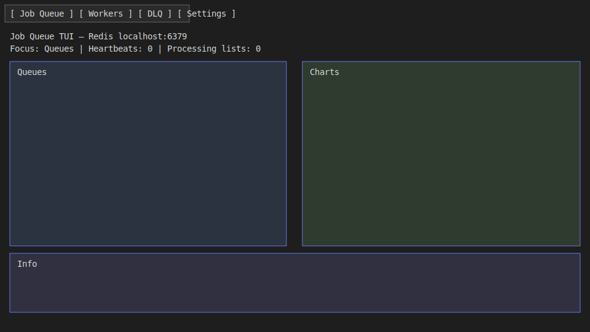

- Left: Queues table (with optional filter row)
- Right: Charts (time-series per key)
- Bottom: Info panel (summaries, peek results, bench form, progress)

> [!note]- **CLAUDE'S THOUGHTS**
> This flexbox approach is genius - it's responsive design for terminals! The balanced layout gives equal importance to data (table) and visualization (charts). Consider adding sparklines directly in the table rows for at-a-glance trends. Also, the Info panel could use tabs or accordion sections when there's lots to show (peek results + bench results + stats all competing for space).

## Job Queue — Charts Expanded

Clicking in the right (Charts) region animates the top row split via a spring easing (Harmonica), expanding Charts from 1:1 to roughly 1:2. Clicking the left side returns to balanced.

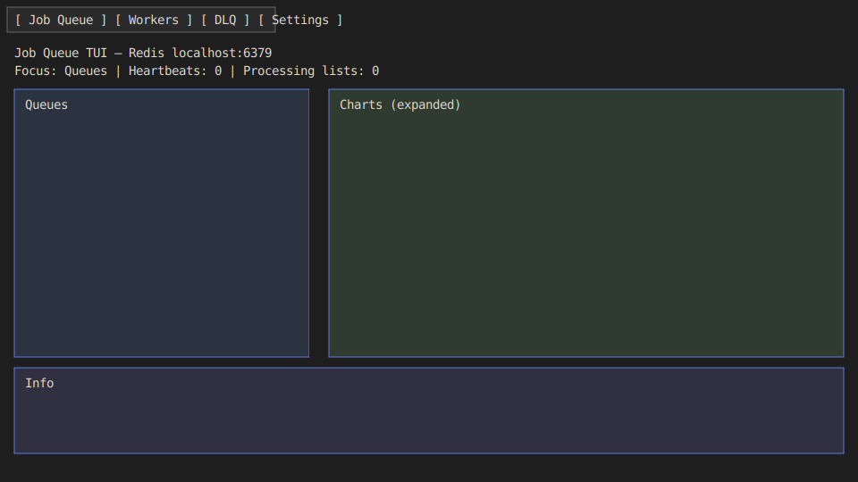

> [!note]- **CLAUDE'S THOUGHTS**
> The spring animation touch is beautiful - this is the kind of polish that makes a TUI feel alive! The click-to-expand is intuitive. Consider adding a "focus mode" where double-clicking any panel makes it go full-screen temporarily (ESC to exit). Also, keyboard shortcuts for quick panel focus switching (maybe vim-style ctrl+w,h/j/k/l for navigating between panels?).

## Workers

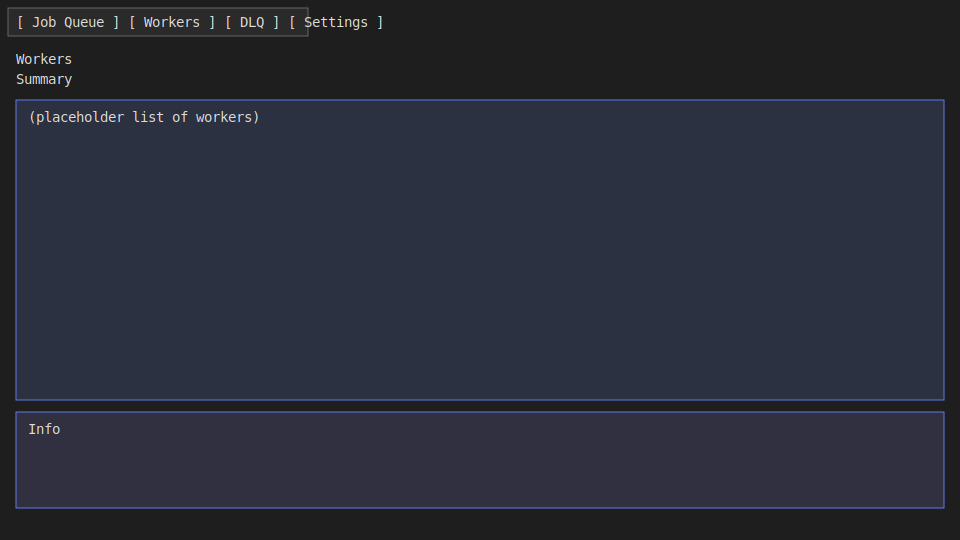

- Placeholder for now: summary of heartbeats and processing lists; later a table of workers with sort/filter, and details pane.

> [!note]- **CLAUDE'S THOUGHTS**
> The Workers tab needs to be information-dense but scannable. Consider a "health bar" visualization for each worker showing CPU/memory if you can get it. Color-coding by state (idle=gray, busy=green, struggling=yellow, dead=red) would help quick scanning. A mini activity graph per worker showing jobs/minute over the last 10 minutes would be killer. Also, grouping workers by host/pod would help in Kubernetes environments.

## Dead Letter Queue (DLQ)

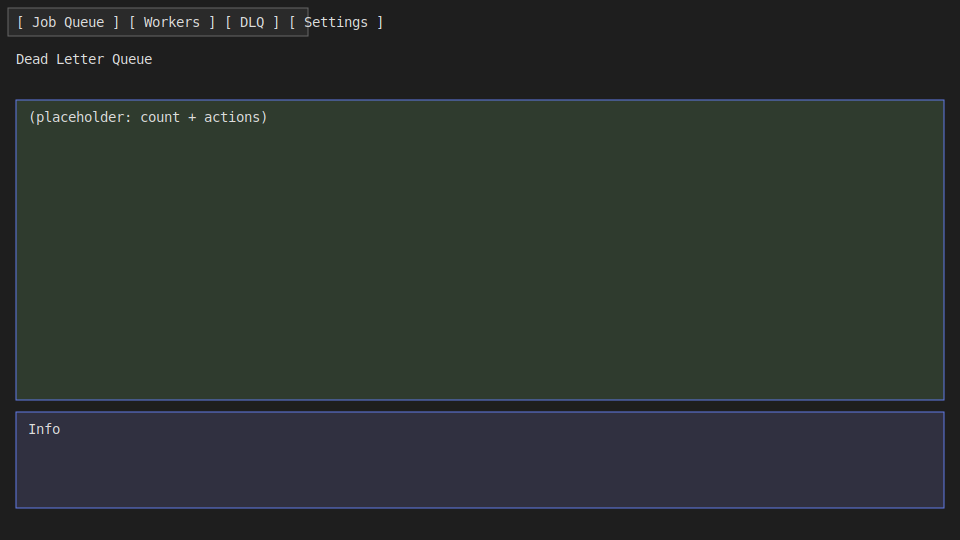

- Placeholder for now: count and key; later a paginated list with actions (peek/requeue/purge) and search.

> [!note]- **CLAUDE'S THOUGHTS**
> The DLQ is where heroes are made during incidents! This needs bulk operations - "requeue all matching X" with a preview. Consider a "failure pattern analyzer" that groups similar failures together (same error message, same job type). Time-based histogram showing when failures spiked would help identify patterns. Also, a "quick fix" mode where you can edit a job's payload before requeuing would be clutch for fixing bad data.

## Settings

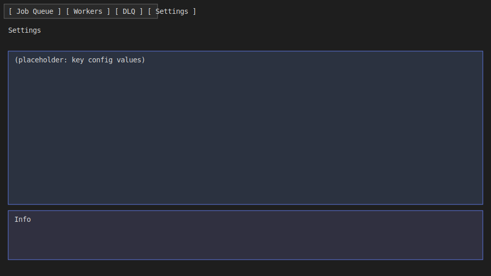

- Read-only snapshot of key configuration values (Redis, queues, defaults). Future: theme toggle and shortcuts.

> [!note]- **CLAUDE'S THOUGHTS**
> Settings could be so much more! Add a "Performance Tuning" section with live recommendations based on current metrics. A "Theme Studio" where users can create custom color schemes would be fun. Consider adding keyboard shortcut customization with a visual mapper. Also, an "Export Config" button that generates a shareable YAML would help teams standardize settings.

## Overlays — Confirm

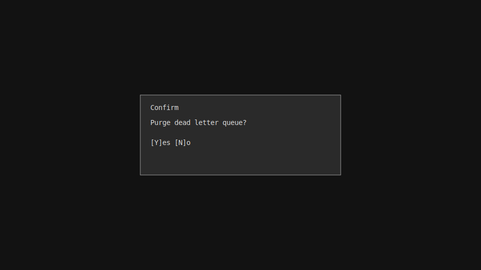

- Full-screen scrim dims background; confirm modal centered. ESC cancels; Y/Enter confirms.

> [!note]- **CLAUDE'S THOUGHTS**
> The scrim approach is perfect - clear focus on what matters. Consider adding a "danger level" to confirmations (yellow for caution, red for destructive) with appropriate border colors. For really dangerous operations, require typing a word like "DESTROY" instead of just Y. Also, showing a preview of what will be affected ("This will purge 1,234 jobs") adds confidence.

## Overlays — Help

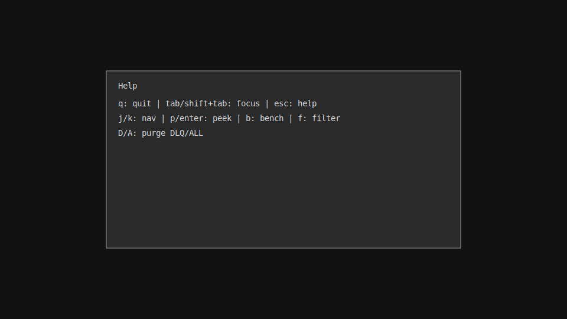

- Full-screen scrim dims background; help centered; ESC closes.

> [!note]- **CLAUDE'S THOUGHTS**
> Help overlay is good, but consider making it context-sensitive - show different help based on which tab/panel has focus. A "command palette" mode (like VSCode's Cmd+Shift+P) would be amazing - fuzzy search through all available commands. Also, interactive tutorials that highlight UI elements while explaining them would help onboarding. Maybe even a "tip of the day" that shows advanced features users might not discover.

---

## Layout Notes

- Flex ratios (top row): left:right transitions between 1:1 (balanced) and 1:2 (expanded).
- Gutters: a fixed-width gutter separates left and right panels for readability.
- Borders are applied to the flex cells; content (table, charts, info viewport) is sized to the cell's inner width/height to avoid clipped corners/edges.
- Tiny terminals: panels clamp to minimum inner widths/heights; filter row and other content may reduce available table height; we compute table height dynamically as (inner cell height − title − filter lines).

> [!note]- **CLAUDE'S THOUGHTS**
> The responsive design thinking here is top-notch! The dynamic height calculation shows attention to detail. Consider adding a "zen mode" that hides everything except the current focus area for maximum screen real estate. Also, detecting terminal capabilities (256 color vs true color) and gracefully degrading would ensure it looks good everywhere. For ultra-wide monitors, maybe a 3-column layout option?

## Tab Bar

- Four tabs: Job Queue, Workers, Dead Letter, Settings.
- Click to switch; numbers 1–4 (future) will also switch.
- Styling kept compact to preserve horizontal space; we avoid heavy borders on the tab bar.

> [!note]- **CLAUDE'S THOUGHTS**
> The tab bar is clean, but consider adding badge notifications - a red dot with count on DLQ when new failures arrive, or a yellow warning on Workers if any are unhealthy. Alt+1-4 in addition to just 1-4 would prevent accidental switches. Also, a "pin tab" feature where you can keep certain tabs from closing/moving would be nice for monitoring scenarios.

## Future Enhancements

- Bubblezone for precise mouse hitboxes (tabs, panels, rows)
- Keyboard toggle for expand (e.g., `c`)
- Small terminal fallback: stack panels vertically when the width drops below a threshold; hide Charts if extremely narrow.

> [!note]- **CLAUDE'S THOUGHTS**
> Great future thinking! Additional ideas to consider:
> - **Split view**: Show two tabs side-by-side for comparison (e.g., Jobs and Workers simultaneously)
> - **Detachable panels**: Pop out a panel into a separate terminal window
> - **Recording mode**: Capture TUI interactions for demos/debugging (output as GIF or asciicast)
> - **Customizable dashboard**: Let users arrange their preferred panels/widgets
> - **Mini-map**: A zoomed-out view of the entire queue state for navigation
> - **Breadcrumb navigation**: Show where you are in the hierarchy (Queue > High Priority > Job Details)
> - **Smart alerts**: Flash the terminal title or send desktop notifications for critical events
> - **Vim mode**: Full vim keybindings for navigation (/, ?, gg, G, etc.)
> - **Data export**: Quick export of current view to CSV/JSON from any table

---

## Information Density Improvements

### Sparklines in Table Rows

Add a tiny trend line per queue row (last N intervals) to convey backlog direction at a glance. Implemented using precomputed short time series (already present for charts) rendered into a compact unicode/ASCII sparkline column.

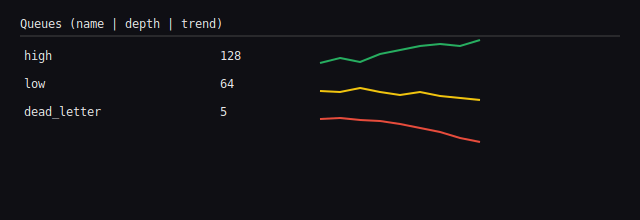

Behavior
- Use adaptive color by threshold (green/amber/red) based on current growth and error rate.
- Collapse on narrow terminals; tooltip-like detail on hover/right-click.

### Color‑coded Worker States

- Idle: gray; Busy: green; Degraded: yellow (high retries/latency); Dead: red (stale heartbeat). Applies in Workers table and inline badges next to queue rows showing active workers per priority.

### Tab Badge Notifications

Show small count badges for notable events (e.g., DLQ new failures, Workers unhealthy). Counts are rate-limited and cleared when the tab is viewed.

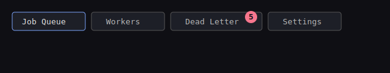

---

## Power User Features

### Command Palette

Fuzzy-searchable action runner (Cmd/Ctrl+Shift+P). Lists commands with context-aware scopes (current tab/selection) and previews effects. Keyboard-first, with hint of keybindings.

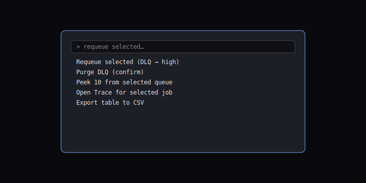

### Vim Navigation Between Panels

Use Ctrl+W,h/j/k/l to hop focus between Queues, Charts, and Info; gg/G to jump to top/bottom; / filter focus. Non-intrusive and discoverable via Help.

### Split View

Optional split to view two tabs side-by-side (e.g., Jobs + Workers, or Jobs + DLQ). Mouse drag or keys to resize; persists per session.

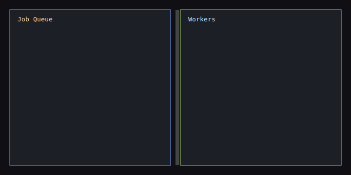

### Context‑sensitive Help

Help overlay adapts to current tab/panel, highlighting relevant commands and tips. Press ? to toggle; includes quick links to actions in the command palette.

---

## Incident Response Tools

### Bulk Operations with Preview (DLQ)

Select many items (or filter) and stage actions (requeue/purge) with a preview of counts, destinations, and rate caps before confirmation.

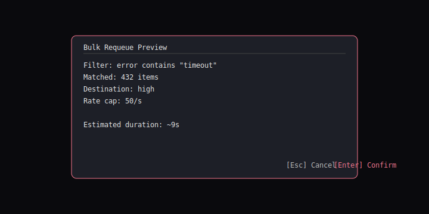

### Failure Pattern Analyzer

Clusters failures by error signature/job type and shows top groups. Suggests next steps (retry after X, transform field Y). Links to recent traces.

### Time‑based Failure Histograms

Visual histogram of failures over time to spot spikes and correlate with deploys or incidents.

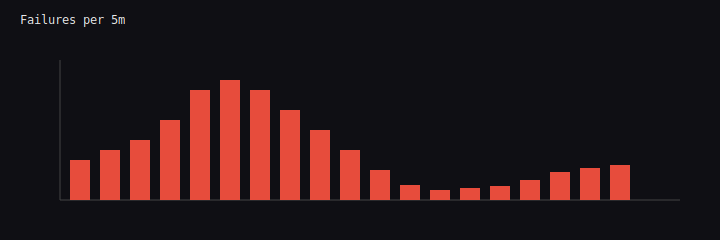

### “Quick Fix” Mode

Inline JSON editor to patch payloads for selected DLQ items prior to requeue, with schema validation and diff preview.

---

## Quality of Life

### Zen Mode

Hide chrome (tab bar, status bar, non-focused panels) and maximize the active panel; toggle with `z`.

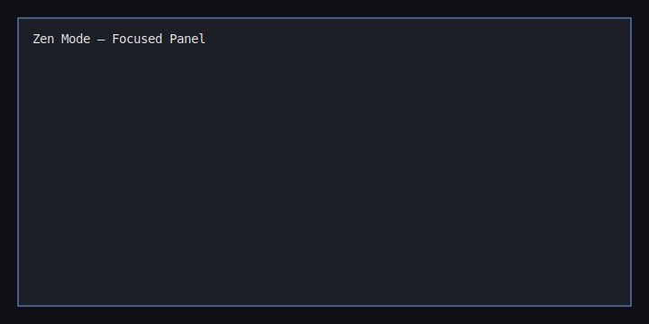

### Recording Mode

Optimized rendering cadence and high-contrast theme for clean asciicasts/GIFs. Optional watermark and keystroke overlay.

### Smart Terminal Capability Detection

Detect truecolor/256-color, mouse support, and unicode width quirks; adjust styles and fallbacks automatically.

### Data Export from Any Table

Export current table view (filters/sort applied) to CSV/JSON with a keystroke; copy-to-clipboard for small selections.

---

## The Killer Feature — Mini‑map Navigation

A zoomed-out overview of the queue system showing relative backlogs, throughput, and hotspots. The current viewport is highlighted; clicking the mini‑map navigates to the corresponding queue/section.

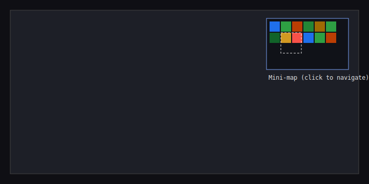

Design Notes
- Aggregates per-queue metrics into a grid heatmap; colors indicate backlog growth and error rates.
- Keyboard toggle `m` opens/closes; arrow keys pan focus; Enter to drill in.
