# F002: Comprehensive TUI Redesign - Mobile-First Queue Interface

## Executive Summary

This document presents a complete redesign of the Redis Work Queue TUI, implementing a **mobile-first responsive design philosophy** for terminal interfaces. The redesign incorporates all 32+ features from the ideas directory while addressing the core challenges of information density, navigation efficiency, and cross-device usability in terminal environments.

### Key Innovation: Terminal Breakpoints

Just like responsive web design, this TUI adapts to terminal size with defined breakpoints:

- **Mobile (≤40 cols)**: Stack panels vertically, minimal chrome
- **Tablet (41-80 cols)**: Two-column layouts, compact headers
- **Desktop (81-120 cols)**: Multi-panel layouts, full feature set
- **Ultrawide (121+ cols)**: Side-by-side multi-view, dashboard mode

## Design Philosophy

### 1. Information Density Gradients
Information complexity scales with available space - more room means more detail, less room means focused essentials.

### 2. Progressive Enhancement
Features are layered based on terminal capabilities and space:
- Base: Core functionality works everywhere
- Enhanced: Rich visuals for capable terminals
- Premium: Advanced features for desktop-class terminals

### 3. Gesture-First Navigation
Mouse, keyboard, and (future) voice commands all feel natural:
- Click/tap for selection
- Swipe gestures in mobile mode
- Keyboard shortcuts scale with available space
- Voice commands for accessibility

## System Architecture

### Responsive Layout Engine

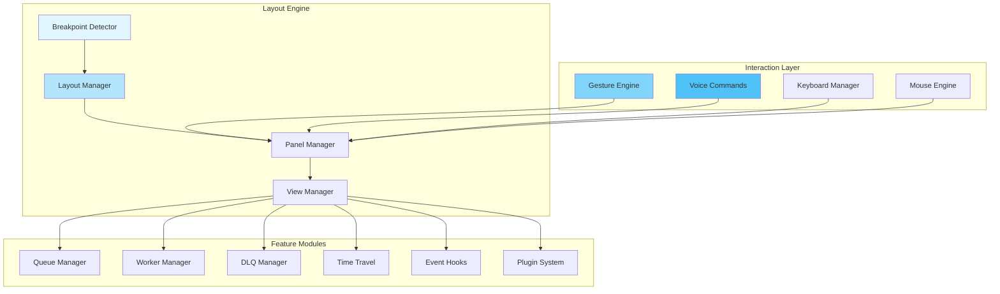

## Breakpoint System

### Mobile Mode (≤40 cols)
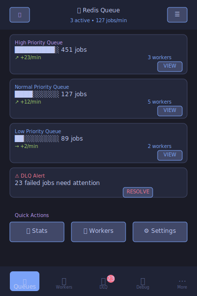

**Design Principles:**
- Single column, card-based UI
- Swipe navigation between sections
- Essential information only
- Large touch targets (3+ character buttons)
- Collapsible sections with expand/collapse

**Features:**
- Queue overview cards
- Worker status summary
- Critical DLQ alerts only
- Voice command prominent (accessibility)

### Tablet Mode (41-80 cols)
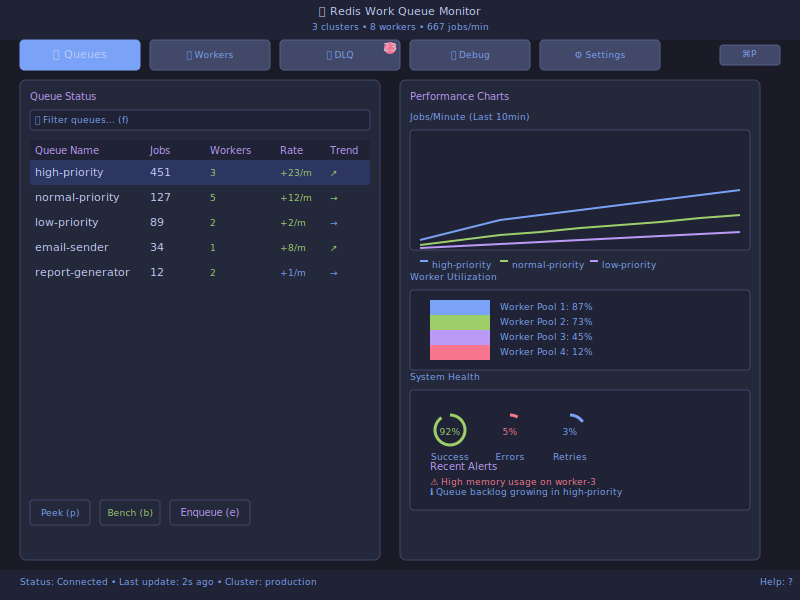

**Design Principles:**
- Two-column layouts
- Tabbed navigation
- Medium information density
- Mixed mouse/keyboard interaction

**Features:**
- Queue table + basic charts
- Worker list with status
- DLQ with actions
- Simplified settings

### Desktop Mode (81-120 cols)

**Design Principles:**
- Multi-panel dashboard
- Rich data visualization
- Full feature access
- Power user shortcuts

**Features:**
- Full dashboard experience
- Advanced charts and metrics
- Complete DLQ remediation
- Time travel debugging
- Plugin panels

### Ultrawide Mode (121+ cols)

**Design Principles:**
- Side-by-side multi-view
- Comparative analysis
- Mission control feel
- Professional monitoring

**Features:**
- Multi-cluster comparison
- Split screen views
- Advanced analytics
- Real-time monitoring grids

## Core Navigation System

### Adaptive Tab Bar

The tab system scales with available space:

**Mobile:** Bottom navigation with icons
**Tablet:** Top tabs with labels
**Desktop:** Full tab bar with badges
**Ultrawide:** Sidebar navigation with groups

### Universal Command Palette

Accessible via `Ctrl+P` or voice command "Command":

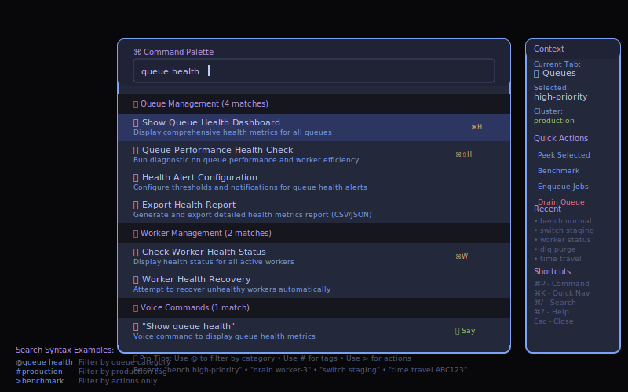

**Features:**
- Fuzzy search all actions
- Context-aware suggestions
- Keyboard shortcuts shown
- Voice command integration
- Recent actions history

## Feature Integration

### Time Travel Debugger

**Mobile:** Timeline scrubber, job state viewer
**Tablet:** Split timeline + details
**Desktop:** Full debugging interface with code view
**Ultrawide:** Multi-job comparison view

**Features:**
- Scrub through job execution timeline
- Step debugging with breakpoints
- State diff visualization
- Event replay with speed control
- Share debug sessions via URL

### Multi-Cluster Control

**Mobile:** Cluster selector + focused view
**Tablet:** Side-by-side comparison (2 clusters)
**Desktop:** Grid view (up to 4 clusters)
**Ultrawide:** Full monitoring wall (8+ clusters)

**Features:**
- Unified cluster switching
- Comparative metrics dashboards
- Synchronized actions across clusters
- Health monitoring and alerting
- Configuration drift detection

### DLQ Remediation Suite

**Mobile:** Essential failure info + quick actions
**Tablet:** Failure list + basic remediation
**Desktop:** Full analysis + bulk operations
**Ultrawide:** Pattern analysis + automated remediation

**Features:**
- Failure pattern recognition
- Bulk requeue with preview
- Payload editing and validation
- Automated remediation rules
- Failure trend analysis

### Visual DAG Builder

**Mobile:** Linear workflow view (steps as cards)
**Tablet:** Simple node-link diagrams
**Desktop:** Full visual editor with toolbox
**Ultrawide:** Split design + execution view

**Features:**
- Drag-and-drop workflow creation
- Visual dependency management
- Real-time execution visualization
- Template library
- Version control integration

### Plugin System
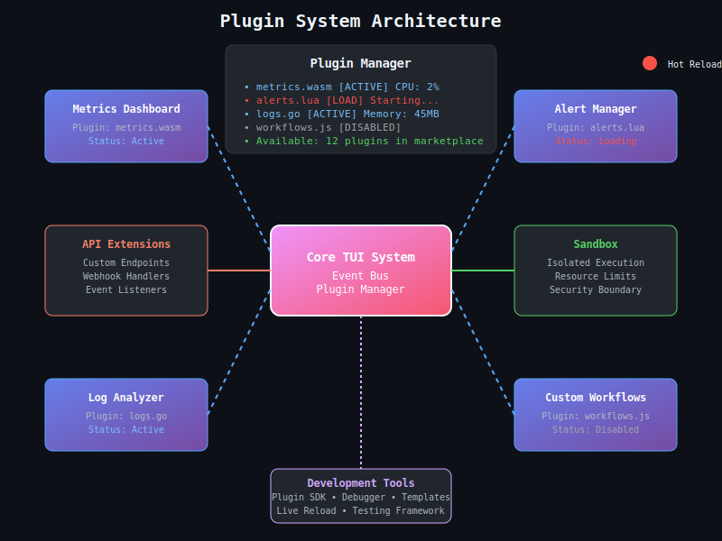

**Mobile:** Plugin cards with basic info
**Tablet:** Plugin manager + simple configs
**Desktop:** Full plugin development environment
**Ultrawide:** Multi-plugin dashboard + metrics

**Features:**
- Hot-loadable plugins (Go, WASM, Lua)
- Plugin marketplace integration
- Custom panel creation
- API extension points
- Sandboxed execution environment

### Worker Fleet Management

**Mobile:** Worker health summary + alerts
**Tablet:** Worker list + basic controls
**Desktop:** Full fleet dashboard + orchestration
**Ultrawide:** Multi-environment fleet view

**Features:**
- Real-time worker health monitoring
- Graceful drain and deployment
- Auto-scaling recommendations
- Performance analytics
- Resource utilization tracking

## Advanced UX Features

### Gesture System
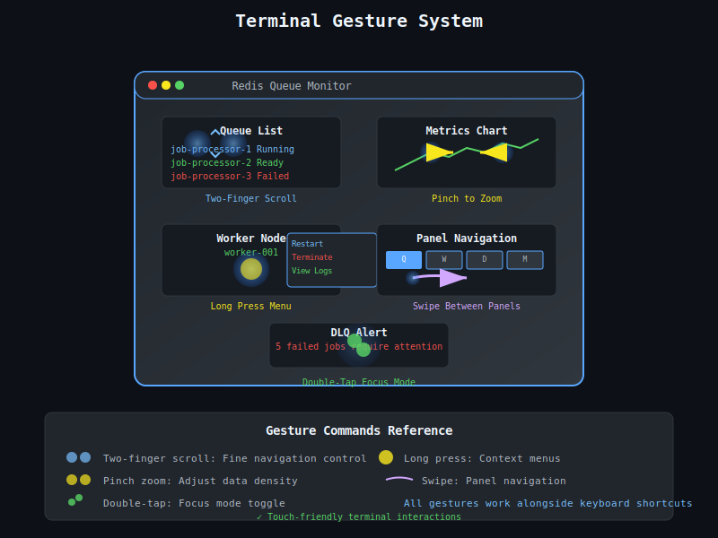

**Touch-inspired terminal interactions:**
- Two-finger scroll for fine navigation
- Pinch-to-zoom for data density
- Long-press for context menus
- Swipe between panels (mobile)
- Double-tap for focus mode

### Voice Command Integration
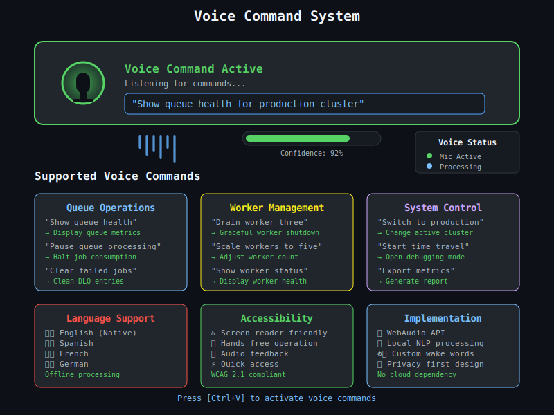

**Natural language processing for accessibility:**
- "Show queue health"
- "Drain worker 3"
- "Requeue failed jobs from last hour"
- "Switch to production cluster"
- "Start time travel session for job ABC123"

**Multilingual support and offline processing**

### Theme Playground
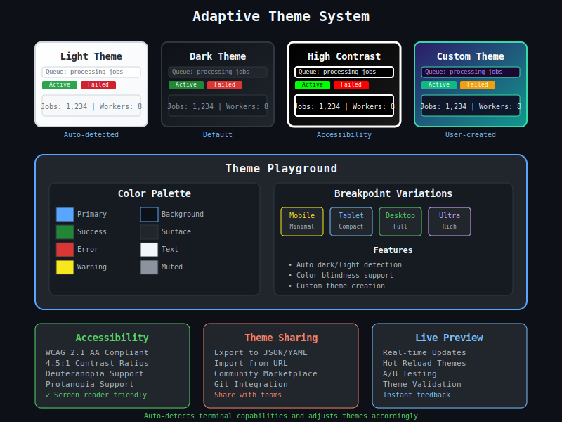

**Adaptive theming system:**
- Auto dark/light based on terminal
- High contrast mode for accessibility
- Color blindness friendly palettes
- Custom theme creation
- Per-breakpoint theme variants

### Smart Notifications
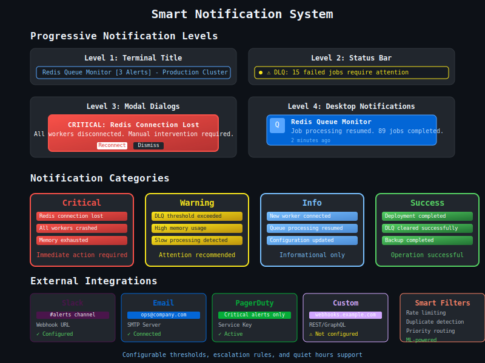

**Progressive notification levels:**
- Terminal title updates
- Status bar alerts
- Modal dialogs for critical issues
- Desktop notifications (when supported)
- Email/Slack integration via webhooks

## Performance Architecture

### Rendering Pipeline
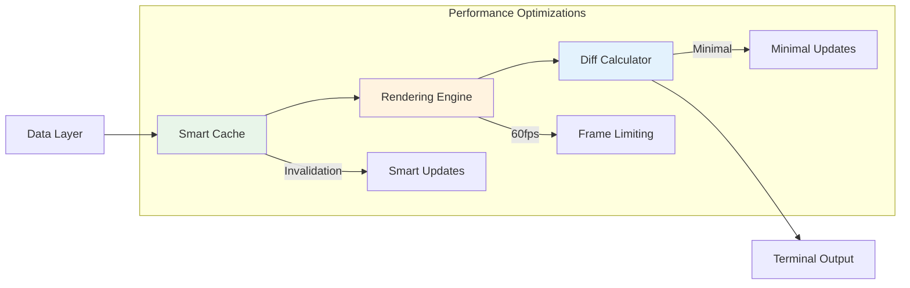

### Adaptive Polling
- **Mobile:** 10-second intervals, minimal data
- **Tablet:** 5-second intervals, moderate data
- **Desktop:** 2-second intervals, full data
- **Ultrawide:** 1-second intervals, streaming data

### Memory Management
- **Circular buffers** for time series data
- **LRU caches** for frequently accessed information
- **Lazy loading** for expensive operations
- **Data compression** for large payloads

## Security Model

### Authentication Tiers
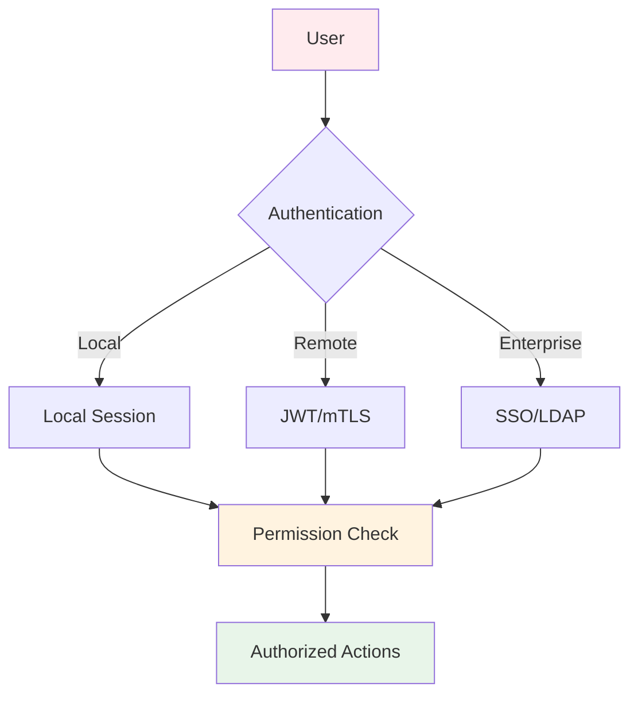

### RBAC Integration
- **Read-only** users: View all, change nothing
- **Operator** users: Standard operations, no destructive actions
- **Admin** users: Full access including dangerous operations
- **Audit** logs: All actions tracked with user attribution

## Testing Strategy

### Visual Regression Testing
- **Screenshot diffs** for each breakpoint
- **ASCII art comparison** for layout validation
- **Color accuracy** testing across terminal types

### Interaction Testing
- **Gesture simulation** for mobile mode
- **Keyboard navigation** validation
- **Mouse interaction** accuracy testing
- **Voice command** recognition testing

### Performance Testing
- **Frame rate** measurements at each breakpoint
- **Memory usage** profiling under load
- **Network efficiency** for remote operations
- **Battery impact** testing (for laptop users)

## Migration Strategy

### Phase 1: Foundation (Month 1)
- [ ] Implement responsive layout engine
- [ ] Create breakpoint system
- [ ] Build adaptive navigation
- [ ] Add basic gesture support

### Phase 2: Core Features (Month 2)
- [ ] Time Travel Debugger (MVP)
- [ ] Enhanced DLQ Remediation
- [ ] Multi-cluster foundation
- [ ] Plugin system architecture

### Phase 3: Advanced UX (Month 3)
- [ ] Visual DAG Builder
- [ ] Voice command integration
- [ ] Theme playground
- [ ] Advanced gestures

### Phase 4: Enterprise Features (Month 4)
- [ ] RBAC implementation
- [ ] Audit logging
- [ ] Performance monitoring
- [ ] Security hardening

### Phase 5: Ecosystem (Month 5-6)
- [ ] Plugin marketplace
- [ ] Advanced analytics
- [ ] Multi-tenant support
- [ ] Cloud integration

## Success Metrics

### User Experience
- **Time to insight**: How quickly users find key information
- **Navigation efficiency**: Clicks/keystrokes to complete tasks
- **Error recovery**: Time to resolve issues using TUI
- **User satisfaction**: Net Promoter Score from terminal users

### Technical Performance
- **Frame rate**: Consistent 60fps across all breakpoints
- **Memory usage**: <100MB baseline, <500MB peak
- **Network efficiency**: <10KB/s for normal operations
- **Battery life**: Minimal impact on laptop battery

### Feature Adoption
- **Voice commands**: 30% of users try within first week
- **Time travel**: 60% of debugging sessions use time travel
- **Multi-cluster**: 80% of enterprise users use comparison features
- **Plugins**: Community creates 10+ plugins within 6 months

## Implementation Roadmap

### Technical Foundation
1. **Responsive Layout System**: Breakpoint-aware component rendering
2. **Gesture Engine**: Touch-inspired terminal interactions
3. **Performance Pipeline**: 60fps rendering with smart caching
4. **Plugin Architecture**: Hot-loadable extension system

### User Experience
1. **Progressive Enhancement**: Feature layers based on capabilities
2. **Accessibility First**: Voice commands, high contrast, screen readers
3. **Mobile Patterns**: Card layouts, swipe navigation, touch targets
4. **Power User Tools**: Command palette, keyboard shortcuts, automation

### Enterprise Integration
1. **Multi-cluster Management**: Unified control across environments
2. **RBAC & Audit**: Enterprise security and compliance
3. **Advanced Analytics**: Performance monitoring and capacity planning
4. **Integration APIs**: Webhook, REST, and GraphQL endpoints

## Appendix: Feature Matrix

| Feature | Mobile | Tablet | Desktop | Ultrawide | Voice | Plugin |
|---------|--------|--------|---------|-----------|-------|---------|
| Queue Monitoring | ✓ Basic | ✓ Enhanced | ✓ Full | ✓ Advanced | ✓ | ✓ |
| Worker Management | ✓ Status | ✓ Control | ✓ Full | ✓ Fleet | ✓ | ✓ |
| DLQ Remediation | ✓ View | ✓ Actions | ✓ Bulk | ✓ Auto | ✓ | ✓ |
| Time Travel Debug | ✗ | ✓ Basic | ✓ Full | ✓ Compare | ✓ | ✓ |
| Multi-cluster | ✗ | ✓ 2-way | ✓ 4-way | ✓ 8+ way | ✓ | ✓ |
| DAG Builder | ✗ | ✗ | ✓ | ✓ Split | ✗ | ✓ |
| Plugin System | ✗ | ✓ Basic | ✓ Full | ✓ Multi | ✓ | N/A |
| Voice Commands | ✓ | ✓ | ✓ | ✓ | N/A | ✓ |

---

*This comprehensive redesign transforms the Redis Work Queue TUI from a simple monitoring tool into a full-featured workflow platform that adapts gracefully to any terminal environment while maintaining the power and efficiency that makes terminal interfaces superior for professional use.*