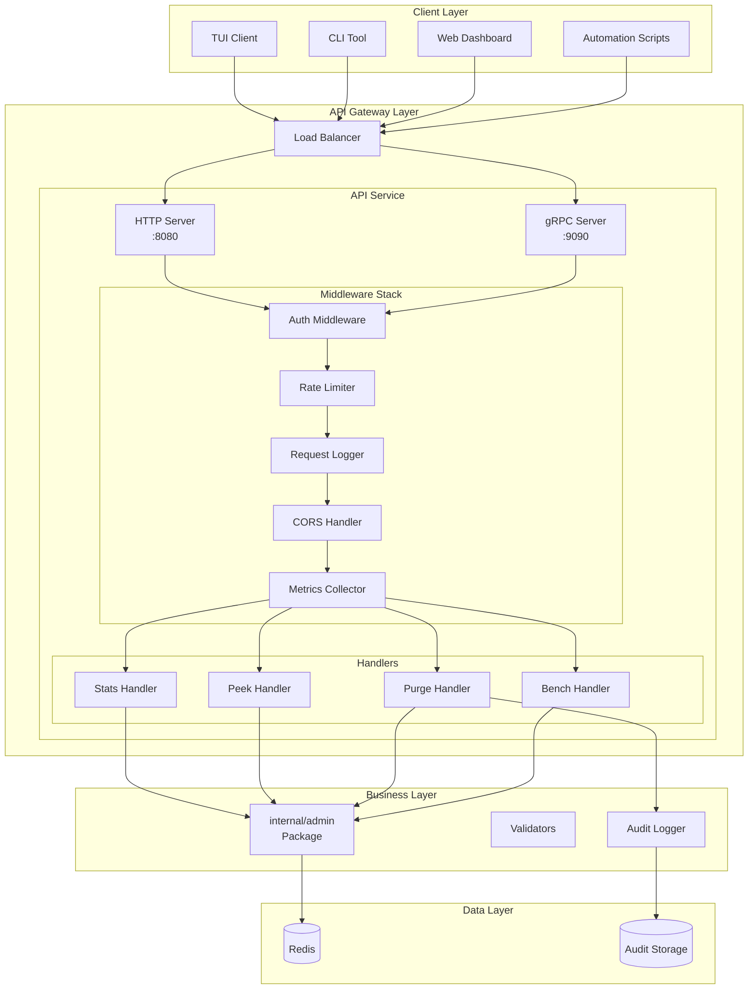
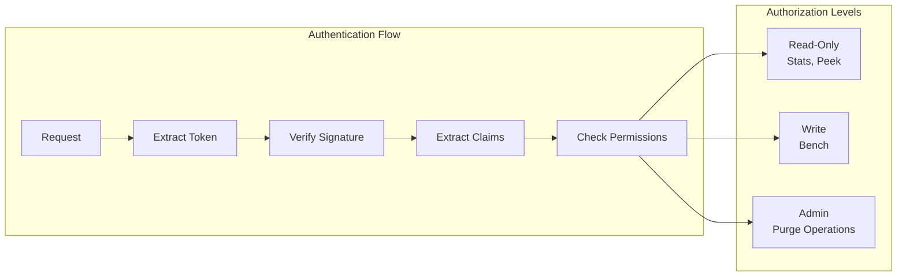
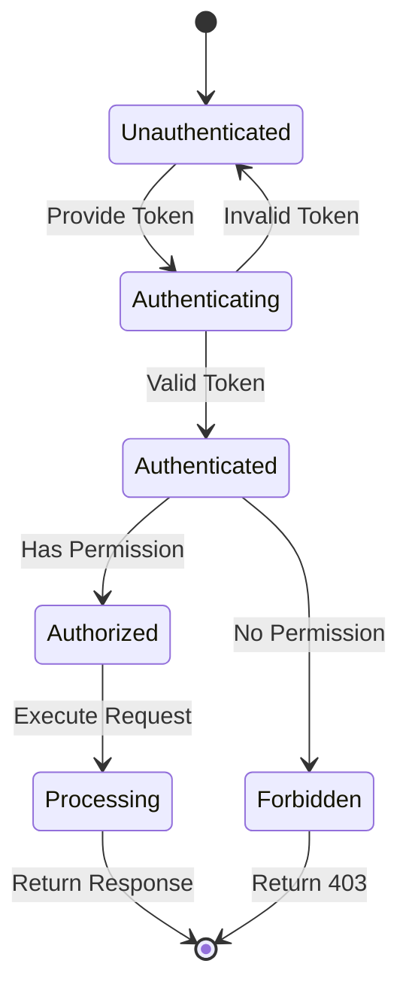
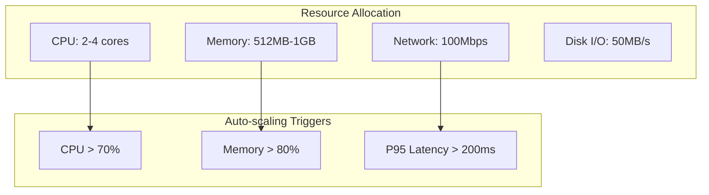
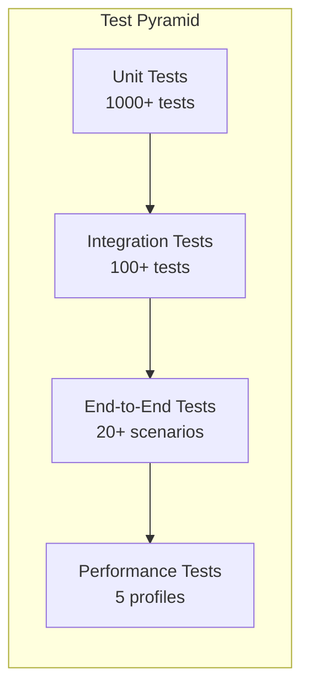
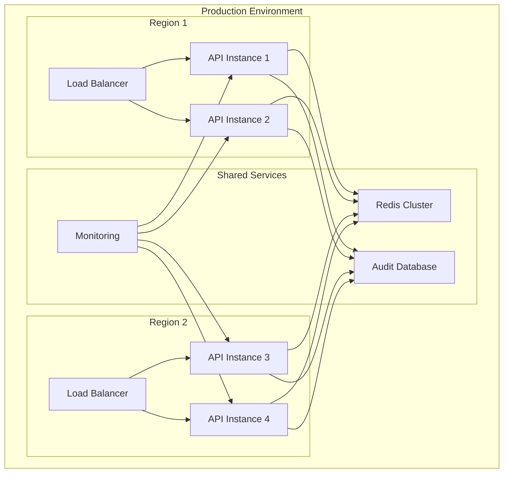
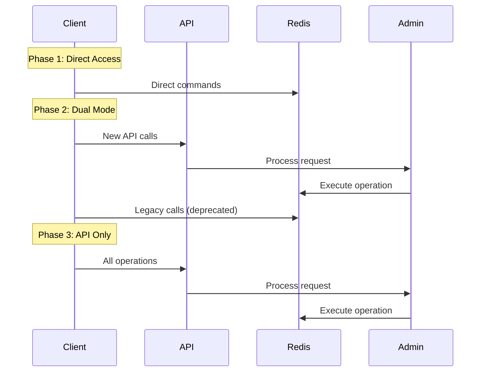

# Admin API Design Document

## Executive Summary

This document defines the architecture and design for a secure, versioned Admin API that exposes administrative operations for the go-redis-work-queue system. The API provides HTTP REST endpoints with optional gRPC support, implementing authentication, authorization, rate limiting, and comprehensive audit logging for all administrative operations.

## System Architecture

### Overview

The Admin API acts as a secure gateway to administrative functions, providing a stable contract for remote operations while enforcing security policies and maintaining audit trails.



### Component Descriptions

#### API Gateway Layer
- **Load Balancer**: Distributes requests across multiple API instances
- **HTTP Server**: RESTful API on port 8080, handles JSON requests/responses
- **gRPC Server**: Optional gRPC interface on port 9090 for high-performance clients

#### Middleware Stack
- **Auth Middleware**: Validates bearer tokens, enforces RBAC policies
- **Rate Limiter**: Prevents abuse with configurable limits per endpoint
- **Request Logger**: Logs all requests with correlation IDs
- **CORS Handler**: Manages cross-origin requests for web clients
- **Metrics Collector**: Tracks latency, errors, and throughput per endpoint

#### Handler Layer
- **Stats Handler**: Queue statistics and system health
- **Peek Handler**: Non-destructive queue inspection
- **Purge Handler**: Destructive operations with confirmation
- **Bench Handler**: Performance testing endpoints

### Security Architecture



## API Specification

### Base Configuration

- **Base URL**: `https://api.example.com/api/v1`
- **Authentication**: Bearer token in Authorization header
- **Content Type**: `application/json`
- **API Version**: v1 (in path)

### Endpoint Overview

| Method | Path | Description | Auth Level | Rate Limit |
|--------|------|-------------|------------|------------|
| GET | /stats | Get queue statistics | Read | 100/min |
| GET | /stats/keys | Get Redis key statistics | Read | 100/min |
| GET | /peek/{queue} | Peek at queue items | Read | 50/min |
| POST | /bench | Run benchmark test | Write | 10/min |
| DELETE | /queues/dlq | Purge dead letter queue | Admin | 5/min |
| DELETE | /queues/all | Purge all queues | Admin | 1/min |

### Versioning Strategy

```mermaid
graph LR
    V1[/api/v1] --> STABLE[Stable for 12 months]
    V2[/api/v2] --> PREVIEW[6 month preview]
    V2 --> STABLE
    V1 --> DEPRECATED[6 month deprecation]
    DEPRECATED --> REMOVED[Removed]
```

## Data Models

### Core Response Structure

All API responses follow this structure:

```json
{
  "data": {},
  "meta": {
    "request_id": "uuid",
    "timestamp": "2025-01-14T10:00:00Z",
    "version": "v1"
  },
  "error": null
}
```

### Error Response Structure

```json
{
  "data": null,
  "meta": {
    "request_id": "uuid",
    "timestamp": "2025-01-14T10:00:00Z",
    "version": "v1"
  },
  "error": {
    "code": "RATE_LIMIT_EXCEEDED",
    "message": "Rate limit exceeded",
    "details": {
      "limit": 100,
      "window": "1m",
      "retry_after": "2025-01-14T10:01:00Z"
    }
  }
}
```

### Queue Statistics Model

```json
{
  "queues": {
    "high": {
      "length": 1234,
      "key": "jobqueue:high"
    },
    "low": {
      "length": 5678,
      "key": "jobqueue:low"
    },
    "completed": {
      "length": 9012,
      "key": "jobqueue:completed"
    },
    "dead_letter": {
      "length": 3,
      "key": "jobqueue:dead_letter"
    }
  },
  "processing": {
    "lists": 12,
    "items": 45
  },
  "workers": {
    "active": 8,
    "heartbeats": 8
  }
}
```

## Security Model

### Authentication & Authorization



### Threat Model

| Threat | Risk Level | Mitigation |
|--------|------------|------------|
| Token theft | High | Short TTL, refresh tokens, IP binding |
| Brute force | Medium | Rate limiting, account lockout |
| Data tampering | High | Request signing, audit logs |
| Privilege escalation | High | Strict RBAC, least privilege |
| DoS attacks | Medium | Rate limiting, circuit breakers |
| Audit tampering | High | Immutable audit logs, separate storage |

### Security Controls

1. **Authentication**
   - JWT tokens with RS256 signatures
   - 15-minute access token TTL
   - Refresh token rotation

2. **Authorization**
   - Role-based access control (RBAC)
   - Granular permissions per endpoint
   - Deny-by-default policy

3. **Rate Limiting**
   - Per-user and per-IP limits
   - Sliding window algorithm
   - Exponential backoff for violations

4. **Audit Logging**
   - All destructive operations logged
   - Immutable audit trail
   - Separate audit database

## Performance Requirements

### Response Time SLAs

| Endpoint | P50 | P95 | P99 |
|----------|-----|-----|-----|
| GET /stats | 50ms | 100ms | 200ms |
| GET /stats/keys | 100ms | 200ms | 500ms |
| GET /peek | 30ms | 60ms | 100ms |
| POST /bench | 1s | 5s | 10s |
| DELETE /queues/* | 100ms | 200ms | 500ms |

### Throughput Requirements

- Sustained: 1000 req/sec across all endpoints
- Peak: 5000 req/sec for 1 minute bursts
- Concurrent connections: 10,000

### Resource Limits



## Testing Strategy

### Test Coverage Requirements

- Unit tests: 80% code coverage minimum
- Integration tests: All endpoints
- Security tests: All auth flows
- Performance tests: Load and stress testing

### Test Categories



### Test Scenarios

#### Unit Tests
- Middleware logic (auth, rate limiting)
- Request validation
- Response serialization
- Error handling

#### Integration Tests
- Database interactions
- Redis operations
- Multi-component flows
- Circuit breaker behavior

#### Security Tests
- Token validation
- Permission enforcement
- SQL injection attempts
- Rate limit enforcement

#### Performance Tests
- Load testing (1000 req/sec)
- Stress testing (10000 req/sec)
- Endurance testing (24 hours)
- Spike testing (0 to 5000 req/sec)

## Deployment Plan

### Deployment Architecture



### Rollout Strategy

1. **Phase 1**: Deploy to staging environment
2. **Phase 2**: Canary deployment (5% traffic)
3. **Phase 3**: Progressive rollout (25%, 50%, 75%)
4. **Phase 4**: Full production deployment
5. **Phase 5**: Deprecate legacy interfaces

### Monitoring & Observability

- **Metrics**: Prometheus + Grafana dashboards
- **Logging**: Structured JSON logs to ELK stack
- **Tracing**: OpenTelemetry with Jaeger
- **Alerting**: PagerDuty integration

## Migration Path

### From Direct Redis Access to API



## Appendix

### Error Codes

| Code | Description | HTTP Status |
|------|-------------|-------------|
| AUTH_REQUIRED | Authentication required | 401 |
| AUTH_INVALID | Invalid credentials | 401 |
| PERMISSION_DENIED | Insufficient permissions | 403 |
| RATE_LIMIT_EXCEEDED | Too many requests | 429 |
| QUEUE_NOT_FOUND | Queue does not exist | 404 |
| INVALID_REQUEST | Malformed request | 400 |
| INTERNAL_ERROR | Server error | 500 |
| SERVICE_UNAVAILABLE | Temporary outage | 503 |

### Rate Limit Tiers

| Tier | Requests/Minute | Target Users |
|------|----------------|--------------|
| Basic | 60 | Default for all users |
| Standard | 300 | Regular automation |
| Premium | 1000 | High-volume operations |
| Unlimited | ∞ | Internal services |

### Audit Log Schema

```json
{
  "timestamp": "2025-01-14T10:00:00Z",
  "request_id": "550e8400-e29b-41d4-a716-446655440000",
  "user_id": "user123",
  "action": "PURGE_DLQ",
  "resource": "/api/v1/queues/dlq",
  "method": "DELETE",
  "ip_address": "192.168.1.1",
  "user_agent": "admin-cli/1.0.0",
  "status": "SUCCESS",
  "duration_ms": 45,
  "metadata": {
    "items_purged": 1234,
    "confirmation_token": "abc123"
  }
}
```