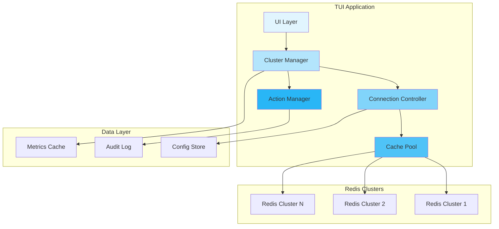
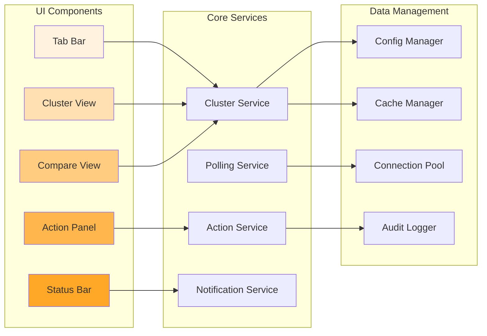
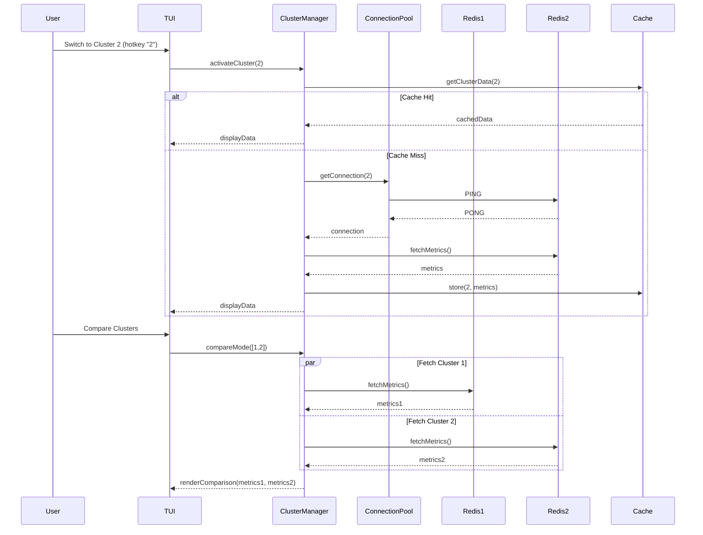
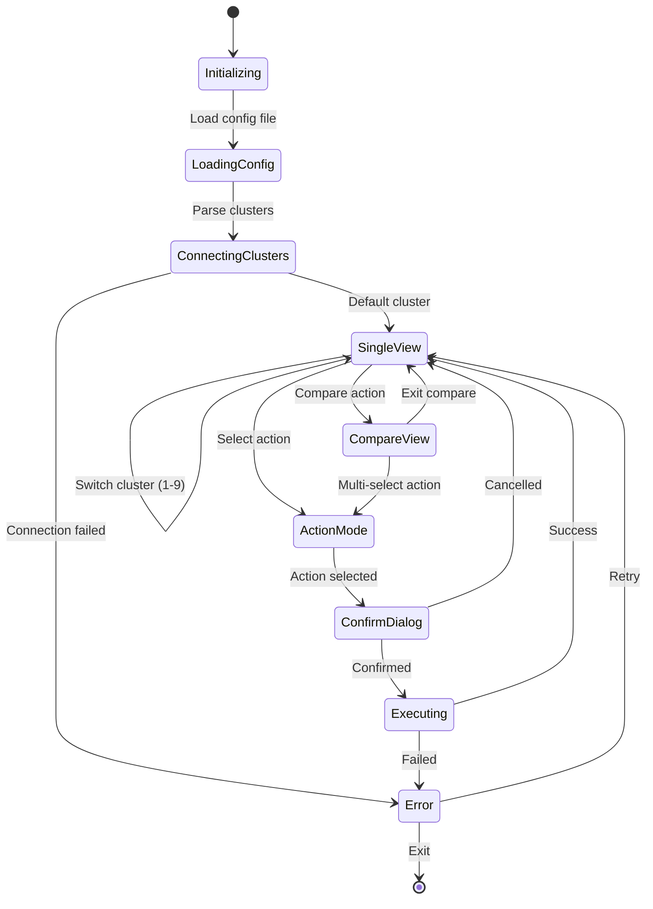
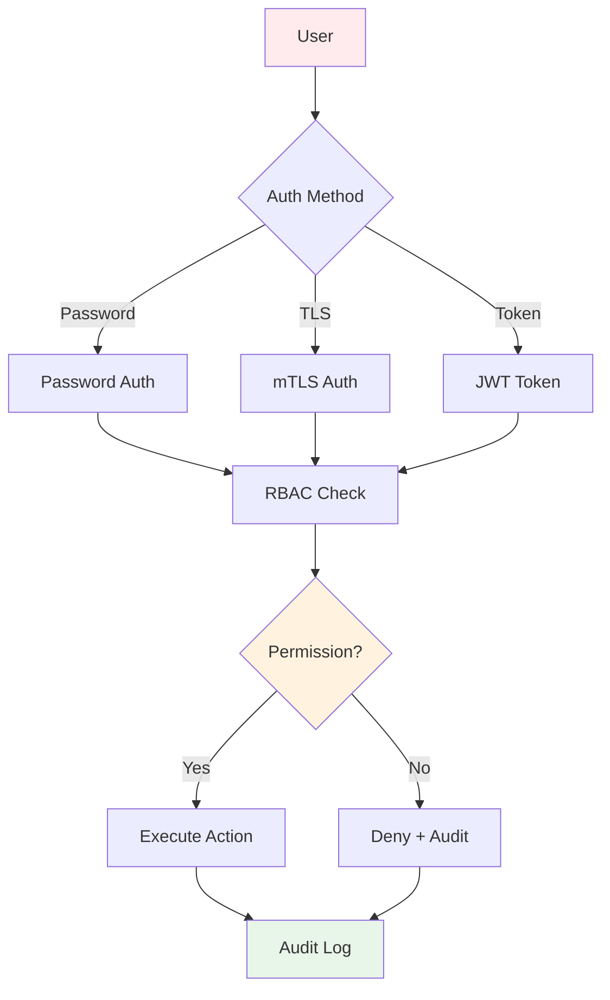
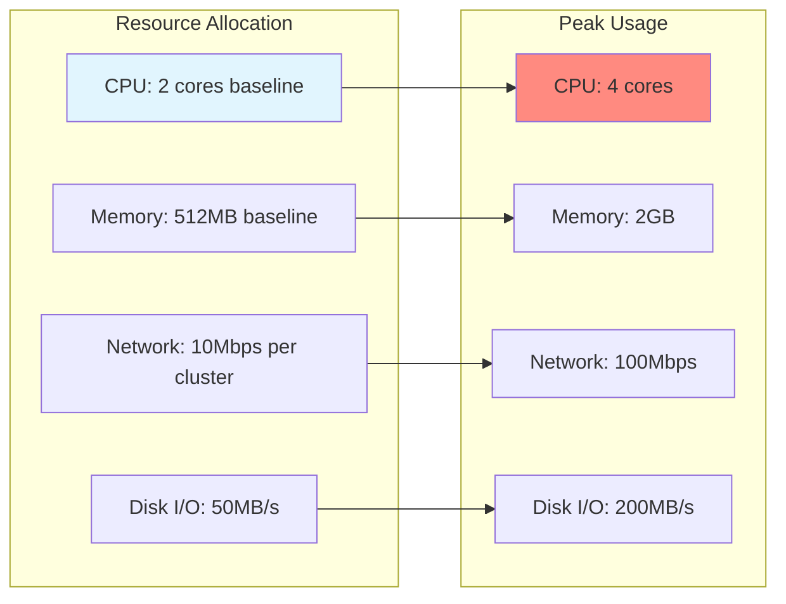
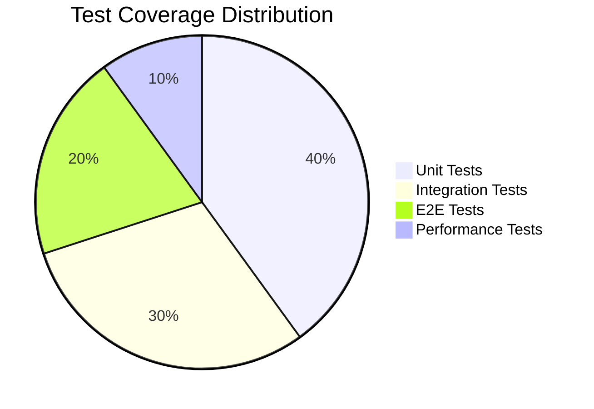
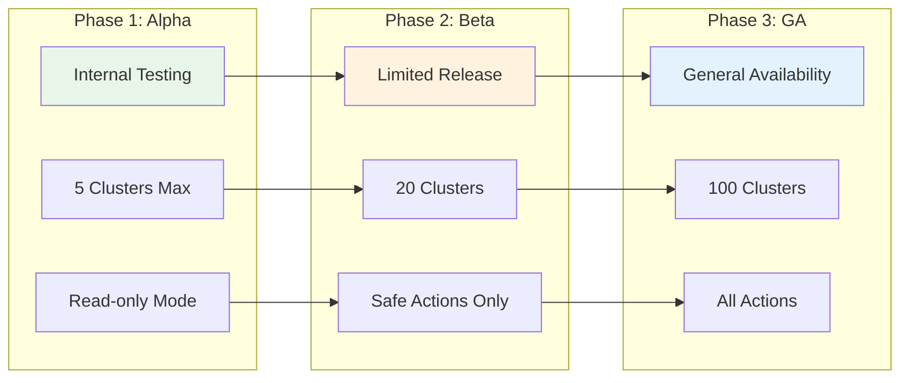

# Multi-Cluster Control Design Document

## Executive Summary

The Multi-Cluster Control feature enables management of multiple Redis clusters from a single Terminal User Interface (TUI), providing unified monitoring, comparison views, and coordinated administrative actions across distributed Redis deployments. This design addresses the operational complexity of managing multiple Redis instances in production environments where teams need to monitor, compare, and maintain consistency across clusters.

### Key Capabilities
- **Unified Management**: Single interface for multiple Redis endpoints with instant switching
- **Comparative Analysis**: Side-by-side views for identifying discrepancies and patterns
- **Coordinated Actions**: Safe, confirmed propagation of administrative operations
- **Performance Optimization**: Efficient caching and polling strategies for responsive UI

## System Architecture

### High-Level Architecture



### Component Architecture



### Data Flow



### State Management



## API Specification

### Cluster Management Endpoints

| Endpoint | Method | Description |
|----------|--------|-------------|
| `/clusters` | GET | List all configured clusters |
| `/clusters/{id}` | GET | Get cluster details and status |
| `/clusters/{id}/metrics` | GET | Fetch cluster metrics |
| `/clusters/{id}/health` | GET | Health check endpoint |
| `/clusters/compare` | POST | Compare multiple clusters |

### Action Endpoints

| Endpoint | Method | Description |
|----------|--------|-------------|
| `/actions` | GET | List available actions |
| `/actions/execute` | POST | Execute action on selected clusters |
| `/actions/{id}/status` | GET | Check action execution status |
| `/actions/history` | GET | Get action history with audit trail |

### Configuration Endpoints

| Endpoint | Method | Description |
|----------|--------|-------------|
| `/config` | GET | Get current configuration |
| `/config/clusters` | POST | Add new cluster |
| `/config/clusters/{id}` | PUT | Update cluster config |
| `/config/clusters/{id}` | DELETE | Remove cluster |

## Data Models

### Cluster Configuration

```json
{
  "cluster": {
    "id": "string",
    "name": "string",
    "label": "string",
    "color": "#hexcolor",
    "endpoints": {
      "primary": "redis://host:port",
      "replicas": ["redis://host:port"]
    },
    "auth": {
      "method": "password|tls|none",
      "credentials": "encrypted_string"
    },
    "polling": {
      "interval_ms": 5000,
      "timeout_ms": 2000,
      "jitter_ms": 500
    },
    "tags": ["production", "us-east-1"]
  }
}
```

### Cluster Metrics

```json
{
  "metrics": {
    "cluster_id": "string",
    "timestamp": "ISO8601",
    "queues": {
      "total": 150,
      "active": 45,
      "delayed": 20,
      "failed": 5
    },
    "workers": {
      "total": 50,
      "active": 35,
      "idle": 15
    },
    "throughput": {
      "jobs_per_second": 125.5,
      "bytes_per_second": 1048576
    },
    "memory": {
      "used_bytes": 268435456,
      "max_bytes": 1073741824,
      "fragmentation_ratio": 1.2
    },
    "connections": {
      "current": 150,
      "rejected": 0
    }
  }
}
```

### Action Request

```json
{
  "action": {
    "type": "purge_dlq|restart_workers|flush_queue|benchmark",
    "targets": ["cluster_id_1", "cluster_id_2"],
    "parameters": {
      "queue_pattern": "string",
      "force": false,
      "dry_run": true
    },
    "confirmation": {
      "user": "string",
      "timestamp": "ISO8601",
      "checksum": "sha256"
    }
  }
}
```

### Compare Result

```json
{
  "comparison": {
    "clusters": ["cluster_1", "cluster_2"],
    "timestamp": "ISO8601",
    "differences": [
      {
        "metric": "queues.failed",
        "values": {
          "cluster_1": 5,
          "cluster_2": 125
        },
        "severity": "warning",
        "delta_percent": 2400
      }
    ],
    "anomalies": [
      {
        "cluster": "cluster_2",
        "type": "high_failure_rate",
        "details": "Failed queue 25x higher than cluster average"
      }
    ]
  }
}
```

## Security Model

### Authentication & Authorization



### Threat Model

| Threat | Risk Level | Mitigation |
|--------|------------|------------|
| Credential Theft | High | Encrypted storage, key rotation, HSM integration |
| Unauthorized Actions | High | RBAC, action confirmation, audit logging |
| Data Exposure | Medium | TLS encryption, field-level encryption for sensitive data |
| Replay Attacks | Medium | Request signing, nonce validation, timestamp checks |
| Resource Exhaustion | Low | Rate limiting, connection pooling, circuit breakers |
| Configuration Tampering | Medium | Config signing, integrity checks, version control |

### Security Controls

1. **Authentication**
   - Multi-factor authentication for sensitive actions
   - Certificate-based authentication for service accounts
   - Session management with automatic timeout

2. **Authorization**
   - Role-based access control (RBAC)
   - Cluster-level permissions
   - Action-specific permissions

3. **Encryption**
   - TLS 1.3 for all network communication
   - AES-256-GCM for credential storage
   - Field-level encryption for sensitive metrics

4. **Audit & Compliance**
   - Comprehensive audit logging
   - Tamper-proof log storage
   - Regular security scanning

## Performance Requirements

### Response Time SLAs

| Operation | P50 | P95 | P99 | Max |
|-----------|-----|-----|-----|-----|
| Cluster Switch | 50ms | 100ms | 200ms | 500ms |
| Metric Fetch | 200ms | 500ms | 1s | 2s |
| Compare View | 300ms | 750ms | 1.5s | 3s |
| Action Execute | 500ms | 2s | 5s | 10s |
| Config Update | 100ms | 250ms | 500ms | 1s |

### Scalability Targets

- **Clusters**: Support up to 100 concurrent cluster connections
- **Metrics**: Handle 10,000 metrics/second ingestion rate
- **UI Updates**: 60 FPS for smooth interactions
- **Cache Size**: 100MB in-memory cache per cluster
- **Connection Pool**: 10 connections per cluster, expandable to 50

### Resource Constraints



## Testing Strategy

### Test Coverage Requirements



### Testing Phases

1. **Unit Testing**
   - Component isolation tests
   - Mock Redis connections
   - State management verification
   - Error handling validation

2. **Integration Testing**
   - Multi-cluster connection tests
   - Cache coherency validation
   - Action propagation verification
   - Configuration management

3. **End-to-End Testing**
   - User workflow scenarios
   - Cluster switching flows
   - Compare view functionality
   - Action confirmation process

4. **Performance Testing**
   - Load testing with 100 clusters
   - Stress testing connection pools
   - Memory leak detection
   - Response time validation

5. **Security Testing**
   - Penetration testing
   - Authentication bypass attempts
   - Authorization boundary testing
   - Audit log integrity verification

### Test Scenarios

| Scenario | Type | Priority | Automated |
|----------|------|----------|-----------|
| Switch between 10 clusters rapidly | Performance | High | Yes |
| Compare 5 clusters simultaneously | Functional | High | Yes |
| Execute action on 3 clusters | Functional | Critical | Yes |
| Handle cluster connection failure | Resilience | High | Yes |
| Verify action rollback | Functional | Critical | Yes |
| Test cache invalidation | Integration | Medium | Yes |
| Validate audit log completeness | Security | High | Yes |
| Test configuration hot-reload | Functional | Medium | Yes |

## Deployment Plan

### Rollout Strategy



### Migration Path

1. **Configuration Migration**
   - Auto-detect existing Redis configs
   - Import with validation
   - Backup original configuration

2. **Feature Flags**
   - `multi_cluster_enabled`: Enable multi-cluster mode
   - `compare_view_enabled`: Enable comparison features
   - `action_propagation_enabled`: Enable multi-cluster actions
   - `max_clusters`: Limit number of clusters

3. **Rollback Plan**
   - Configuration snapshot before changes
   - Single-cluster fallback mode
   - Audit log preservation
   - Zero data loss guarantee

## Appendix

### Glossary

- **Cluster**: A Redis deployment consisting of one or more nodes
- **Action**: An administrative operation that can be executed on clusters
- **Compare View**: Side-by-side display of metrics from multiple clusters
- **DLQ**: Dead Letter Queue for failed jobs
- **Jitter**: Random delay added to prevent thundering herd
- **RBAC**: Role-Based Access Control

### References

- Redis Cluster Specification
- OpenAPI 3.0 Specification
- JSON Schema Draft 2020-12
- TUI Design Guidelines
- Security Best Practices