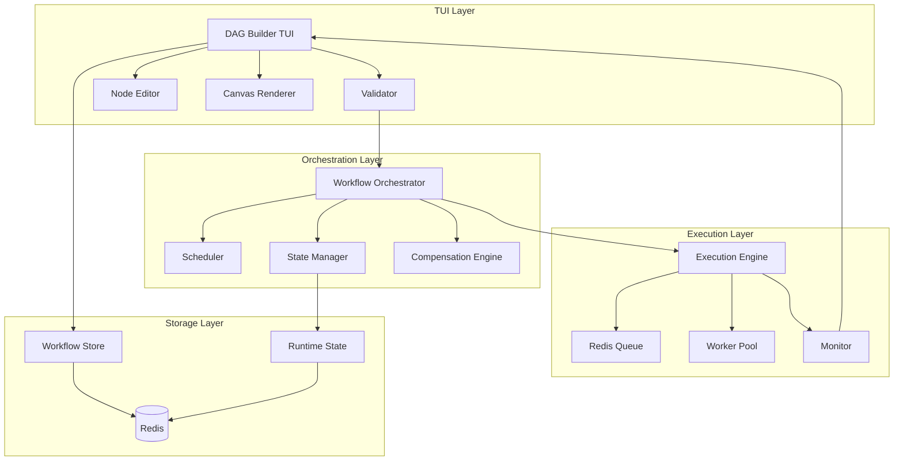
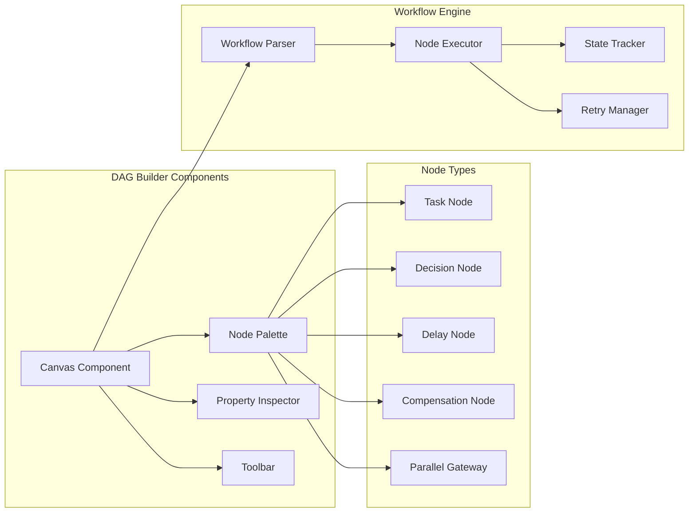
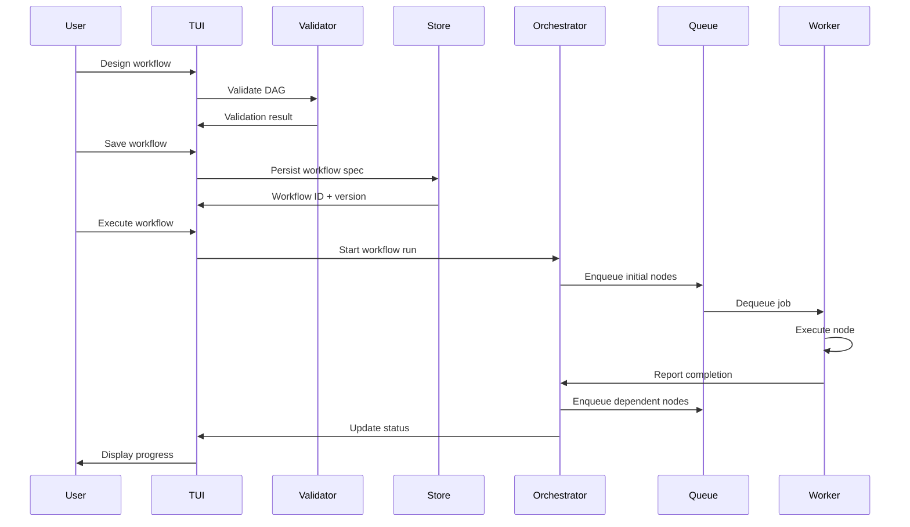
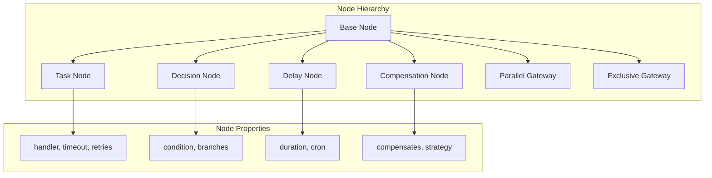
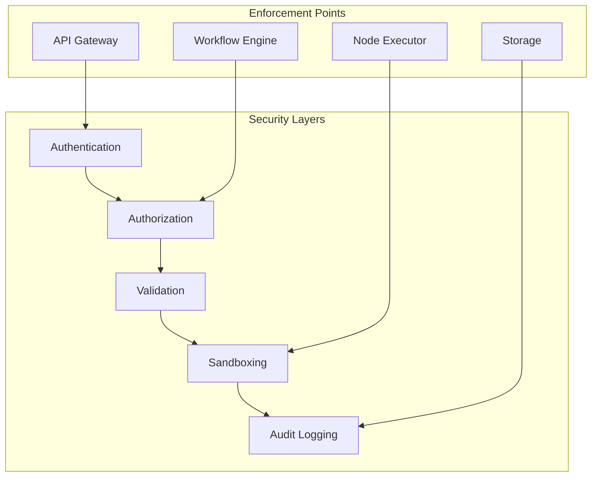
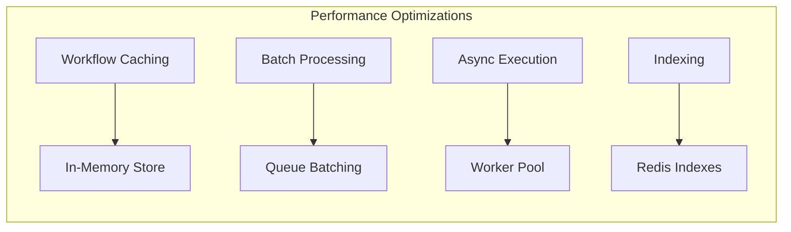
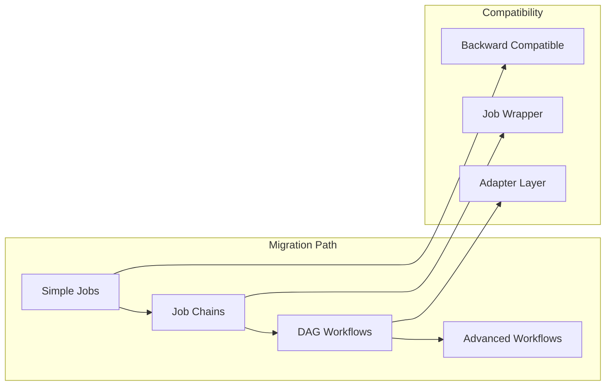

# Visual DAG Builder Design
## Feature ID: F003

## Executive Summary

This document outlines the design for a terminal-native visual DAG (Directed Acyclic Graph) builder integrated into the go-redis-work-queue system. The feature enables users to visually design, validate, and execute complex multi-step workflows with dependencies, retries, and compensation strategies through an intuitive TUI interface. This transforms the work queue from a simple job processor into a sophisticated workflow orchestration platform.

### Key Benefits
- Visual workflow design without leaving the terminal
- Real-time workflow validation and execution monitoring
- Built-in retry, backoff, and compensation mechanisms
- Reusable workflow templates with versioning
- Seamless integration with existing queue infrastructure

## System Architecture

### Overview

The Visual DAG Builder consists of three main components: the TUI designer, the workflow orchestrator, and the execution engine.



### Component Architecture



### Data Flow



### Integration Points

1. **Queue Integration**
   - Each workflow node becomes a queue job
   - Leverage existing retry and priority mechanisms
   - Use job metadata for workflow context

2. **TUI Integration**
   - Extend existing TUI with workflow designer mode
   - Reuse components for job monitoring
   - Add workflow-specific views and controls

3. **Storage Integration**
   - Store workflow definitions in Redis
   - Use Redis streams for event sourcing
   - Leverage Redis transactions for state updates

## API Specification

### Workflow Management API

```go
type WorkflowAPI interface {
    // Workflow CRUD operations
    CreateWorkflow(spec WorkflowSpec) (*Workflow, error)
    GetWorkflow(id string) (*Workflow, error)
    UpdateWorkflow(id string, spec WorkflowSpec) (*Workflow, error)
    DeleteWorkflow(id string) error
    ListWorkflows(filter WorkflowFilter) ([]*Workflow, error)

    // Versioning
    CreateVersion(id string, spec WorkflowSpec) (*WorkflowVersion, error)
    GetVersion(id string, version int) (*WorkflowVersion, error)
    ListVersions(id string) ([]*WorkflowVersion, error)

    // Execution
    StartRun(workflowID string, params map[string]interface{}) (*WorkflowRun, error)
    GetRun(runID string) (*WorkflowRun, error)
    ListRuns(workflowID string) ([]*WorkflowRun, error)
    CancelRun(runID string) error
    RetryRun(runID string) (*WorkflowRun, error)

    // Monitoring
    GetRunStatus(runID string) (*RunStatus, error)
    GetNodeStatus(runID string, nodeID string) (*NodeStatus, error)
    StreamRunEvents(runID string) (<-chan RunEvent, error)
}
```

### Node Executor API

```go
type NodeExecutor interface {
    // Execution
    ExecuteNode(ctx context.Context, node Node, input map[string]interface{}) (map[string]interface{}, error)

    // Lifecycle
    OnNodeStart(node Node, run *WorkflowRun) error
    OnNodeComplete(node Node, run *WorkflowRun, output map[string]interface{}) error
    OnNodeFail(node Node, run *WorkflowRun, err error) error

    // Compensation
    CompensateNode(ctx context.Context, node Node, input map[string]interface{}) error

    // State
    SaveNodeState(runID string, nodeID string, state interface{}) error
    LoadNodeState(runID string, nodeID string) (interface{}, error)
}
```

### TUI Builder API

```go
type DAGBuilder interface {
    // Canvas operations
    AddNode(nodeType string, position Position) (*Node, error)
    RemoveNode(nodeID string) error
    MoveNode(nodeID string, position Position) error

    // Edge operations
    AddEdge(sourceID, targetID string) (*Edge, error)
    RemoveEdge(edgeID string) error

    // Properties
    SetNodeProperty(nodeID string, key string, value interface{}) error
    GetNodeProperty(nodeID string, key string) (interface{}, error)

    // Validation
    ValidateDAG() (*ValidationResult, error)
    GetValidationErrors() []ValidationError

    // Import/Export
    ExportWorkflow() (*WorkflowSpec, error)
    ImportWorkflow(spec *WorkflowSpec) error
}
```

## Data Models

### Workflow Specification

```json
{
  "$schema": "http://json-schema.org/draft-07/schema#",
  "type": "object",
  "title": "WorkflowSpec",
  "properties": {
    "id": {
      "type": "string",
      "description": "Unique workflow identifier"
    },
    "name": {
      "type": "string",
      "description": "Workflow name"
    },
    "version": {
      "type": "integer",
      "description": "Workflow version"
    },
    "description": {
      "type": "string",
      "description": "Workflow description"
    },
    "nodes": {
      "type": "array",
      "items": {
        "$ref": "#/definitions/Node"
      }
    },
    "edges": {
      "type": "array",
      "items": {
        "$ref": "#/definitions/Edge"
      }
    },
    "parameters": {
      "type": "object",
      "additionalProperties": {
        "$ref": "#/definitions/Parameter"
      }
    },
    "metadata": {
      "type": "object",
      "additionalProperties": true
    }
  },
  "required": ["id", "name", "nodes", "edges"]
}
```

### Node Types



### Runtime State Model

```json
{
  "runId": "run-123",
  "workflowId": "workflow-456",
  "status": "running",
  "startTime": "2024-01-01T00:00:00Z",
  "nodes": {
    "node-1": {
      "status": "completed",
      "startTime": "2024-01-01T00:00:00Z",
      "endTime": "2024-01-01T00:00:30Z",
      "output": {},
      "attempts": 1
    },
    "node-2": {
      "status": "running",
      "startTime": "2024-01-01T00:00:30Z",
      "attempts": 2,
      "lastError": "Connection timeout"
    }
  },
  "context": {
    "parameters": {},
    "variables": {}
  }
}
```

## Security Model

### Threat Analysis

1. **Workflow Injection**
   - Risk: Malicious workflow definitions causing system harm
   - Mitigation: Schema validation, sandboxed execution
   - Implementation: Strict input validation, resource limits

2. **Privilege Escalation**
   - Risk: Workflows accessing unauthorized resources
   - Mitigation: Role-based access control (RBAC)
   - Implementation: Permission checks at node execution

3. **Resource Exhaustion**
   - Risk: Infinite loops or resource-intensive workflows
   - Mitigation: Execution limits, cycle detection
   - Implementation: Timeout enforcement, resource quotas

### Security Controls



### Access Control Model

```yaml
roles:
  workflow_designer:
    permissions:
      - workflow:create
      - workflow:read
      - workflow:update
      - workflow:delete
      - workflow:validate

  workflow_operator:
    permissions:
      - workflow:read
      - workflow:execute
      - run:read
      - run:cancel

  workflow_admin:
    permissions:
      - workflow:*
      - run:*
      - system:configure

resource_limits:
  max_nodes_per_workflow: 100
  max_workflow_duration: 3600
  max_parallel_executions: 10
  max_retry_attempts: 5
```

## Performance Requirements

### Scalability Targets

- Support 1,000+ workflow definitions
- Handle 10,000+ concurrent workflow runs
- Process 100,000+ nodes per minute
- Sub-second UI responsiveness

### Performance Metrics

| Operation | Target Latency (p50) | Target Latency (p99) | Throughput |
|-----------|---------------------|---------------------|------------|
| Create Workflow | 100ms | 500ms | 100/sec |
| Start Run | 50ms | 200ms | 1000/sec |
| Node Execution | 10ms | 100ms | 10000/sec |
| Status Query | 5ms | 20ms | 50000/sec |
| TUI Canvas Update | 16ms | 33ms | 60 fps |

### Optimization Strategies



### Resource Management

```go
type ResourceLimits struct {
    MaxCPU           float64       // CPU cores
    MaxMemory        int64         // Bytes
    MaxDiskIO        int64         // Bytes/sec
    MaxNetworkIO     int64         // Bytes/sec
    ExecutionTimeout time.Duration // Max execution time
    QueueDepth       int           // Max queued nodes
}

type ResourceMonitor interface {
    CheckLimits(node Node) error
    ReserveResources(node Node) (*ResourceReservation, error)
    ReleaseResources(reservation *ResourceReservation)
    GetUsage() *ResourceUsage
}
```

## Testing Strategy

### Unit Testing

1. **DAG Validation Tests**
   - Cycle detection
   - Dependency resolution
   - Property validation
   - Schema compliance

2. **Node Execution Tests**
   - Success scenarios
   - Failure handling
   - Retry logic
   - Compensation execution

3. **State Management Tests**
   - State persistence
   - State recovery
   - Concurrent updates
   - Transaction handling

### Integration Testing

1. **End-to-End Workflow Tests**
   - Complete workflow execution
   - Multi-node dependencies
   - Parallel execution
   - Error propagation

2. **TUI Integration Tests**
   - Canvas operations
   - Node manipulation
   - Validation feedback
   - Real-time updates

3. **Queue Integration Tests**
   - Job enqueueing
   - Priority handling
   - Retry mechanisms
   - Dead letter handling

### Performance Testing

```go
// Benchmark workflow execution
func BenchmarkWorkflowExecution(b *testing.B) {
    workflow := createComplexWorkflow(100) // 100 nodes
    engine := NewWorkflowEngine()

    b.ResetTimer()
    for i := 0; i < b.N; i++ {
        run, _ := engine.StartRun(workflow, nil)
        engine.WaitForCompletion(run.ID)
    }
}

// Load test concurrent workflows
func TestConcurrentWorkflows(t *testing.T) {
    const numWorkflows = 1000
    engine := NewWorkflowEngine()

    var wg sync.WaitGroup
    for i := 0; i < numWorkflows; i++ {
        wg.Add(1)
        go func() {
            defer wg.Done()
            workflow := generateWorkflow()
            run, err := engine.StartRun(workflow, nil)
            assert.NoError(t, err)
            assert.Eventually(t, func() bool {
                status, _ := engine.GetRunStatus(run.ID)
                return status.IsComplete()
            }, 30*time.Second, 100*time.Millisecond)
        }()
    }
    wg.Wait()
}
```

### Testing Matrix

| Component | Unit | Integration | E2E | Performance | Security |
|-----------|------|------------|-----|-------------|----------|
| DAG Validator | ✓ | ✓ | ✓ | ✓ | ✓ |
| Node Executor | ✓ | ✓ | ✓ | ✓ | ✓ |
| State Manager | ✓ | ✓ | ✓ | ✓ | - |
| TUI Builder | ✓ | ✓ | ✓ | - | - |
| Orchestrator | ✓ | ✓ | ✓ | ✓ | ✓ |
| Compensation | ✓ | ✓ | ✓ | - | - |

## Deployment Plan

### Rollout Phases

1. **Phase 1: Core Implementation** (Week 1-2)
   - Basic DAG model and validation
   - Simple node types (Task, Decision)
   - In-memory state management

2. **Phase 2: TUI Development** (Week 3-4)
   - Canvas implementation
   - Node palette and inspector
   - Basic workflow operations

3. **Phase 3: Execution Engine** (Week 5-6)
   - Workflow orchestrator
   - State persistence
   - Basic retry logic

4. **Phase 4: Advanced Features** (Week 7-8)
   - Compensation mechanisms
   - Parallel gateways
   - Complex decision logic

5. **Phase 5: Production Readiness** (Week 9-10)
   - Performance optimization
   - Security hardening
   - Documentation and training

### Migration Strategy



### Configuration Example

```yaml
workflow:
  enabled: true
  storage:
    backend: redis
    prefix: "workflow:"
    ttl: 86400

  execution:
    max_concurrent_runs: 100
    max_nodes_per_workflow: 500
    default_timeout: 300
    retry_policy:
      max_attempts: 3
      backoff: exponential
      initial_interval: 1s
      max_interval: 60s

  tui:
    canvas_size: 120x40
    auto_layout: true
    theme: dark
    shortcuts:
      add_node: "n"
      delete_node: "d"
      connect_nodes: "c"
      validate: "v"
      execute: "r"

  security:
    auth_required: true
    rbac_enabled: true
    audit_logging: true
    rate_limiting:
      create_workflow: 10/min
      start_run: 100/min
```

## Appendices

### A. Workflow Examples

#### Example 1: Data Processing Pipeline

```yaml
name: "Data Processing Pipeline"
nodes:
  - id: fetch_data
    type: task
    handler: fetchData
    timeout: 60s

  - id: validate
    type: task
    handler: validateData
    retries: 2

  - id: transform
    type: task
    handler: transformData

  - id: quality_check
    type: decision
    condition: "output.quality > 0.95"

  - id: store_primary
    type: task
    handler: storePrimary

  - id: store_backup
    type: task
    handler: storeBackup

  - id: notify
    type: task
    handler: sendNotification

edges:
  - source: fetch_data
    target: validate
  - source: validate
    target: transform
  - source: transform
    target: quality_check
  - source: quality_check
    target: store_primary
    condition: true
  - source: quality_check
    target: store_backup
    condition: false
  - source: store_primary
    target: notify
  - source: store_backup
    target: notify
```

#### Example 2: Order Processing with Compensation

```yaml
name: "Order Processing"
nodes:
  - id: reserve_inventory
    type: task
    handler: reserveInventory
    compensation: release_inventory

  - id: charge_payment
    type: task
    handler: chargePayment
    compensation: refund_payment

  - id: ship_order
    type: task
    handler: shipOrder
    compensation: cancel_shipment

  - id: release_inventory
    type: compensation
    handler: releaseInventory

  - id: refund_payment
    type: compensation
    handler: refundPayment

  - id: cancel_shipment
    type: compensation
    handler: cancelShipment

compensation_strategy: saga
transaction_mode: compensate_on_failure
```

### B. TUI Mockups

```
┌─ Workflow Designer ─────────────────────────────────────────┐
│ ┌─ Canvas ─────────────────────────┐ ┌─ Properties ────────┐│
│ │                                   │ │ Node: transform     ││
│ │    [fetch]                        │ │ Type: Task          ││
│ │       ↓                           │ │ Handler: transform  ││
│ │   [validate]                      │ │ Timeout: 30s        ││
│ │       ↓                           │ │ Retries: 3          ││
│ │  [transform]                      │ │                     ││
│ │     ↙   ↘                         │ └─────────────────────┘│
│ │ [store] [backup]                  │ ┌─ Node Palette ──────┐│
│ │     ↘   ↙                         │ │ [T] Task            ││
│ │   [notify]                        │ │ [D] Decision        ││
│ │                                   │ │ [P] Parallel        ││
│ └───────────────────────────────────┘ │ [C] Compensation    ││
│ Status: Valid ✓  Nodes: 6  Edges: 6  │ └─────────────────────┘│
│ [F1]Help [F2]Validate [F5]Run [F10]Save                      │
└──────────────────────────────────────────────────────────────┘
```

### C. Performance Benchmarks

| Workflow Complexity | Nodes | Execution Time | Memory Usage | CPU Usage |
|--------------------|-------|----------------|--------------|-----------|
| Simple Linear | 5 | 50ms | 10MB | 5% |
| Branching | 20 | 200ms | 25MB | 15% |
| Parallel | 50 | 500ms | 60MB | 40% |
| Complex DAG | 100 | 1200ms | 120MB | 70% |
| Large Scale | 500 | 8000ms | 500MB | 90% |

### D. References

- [Workflow Patterns](http://www.workflowpatterns.com/)
- [BPMN 2.0 Specification](https://www.omg.org/spec/BPMN/2.0/)
- [Saga Pattern](https://microservices.io/patterns/data/saga.html)
- [Temporal Workflow Concepts](https://docs.temporal.io/concepts/what-is-a-workflow)
- [Apache Airflow DAG Concepts](https://airflow.apache.org/docs/stable/concepts.html)