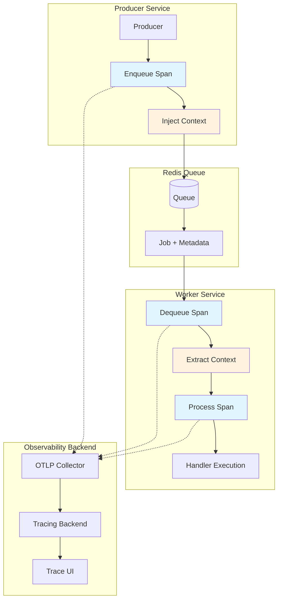
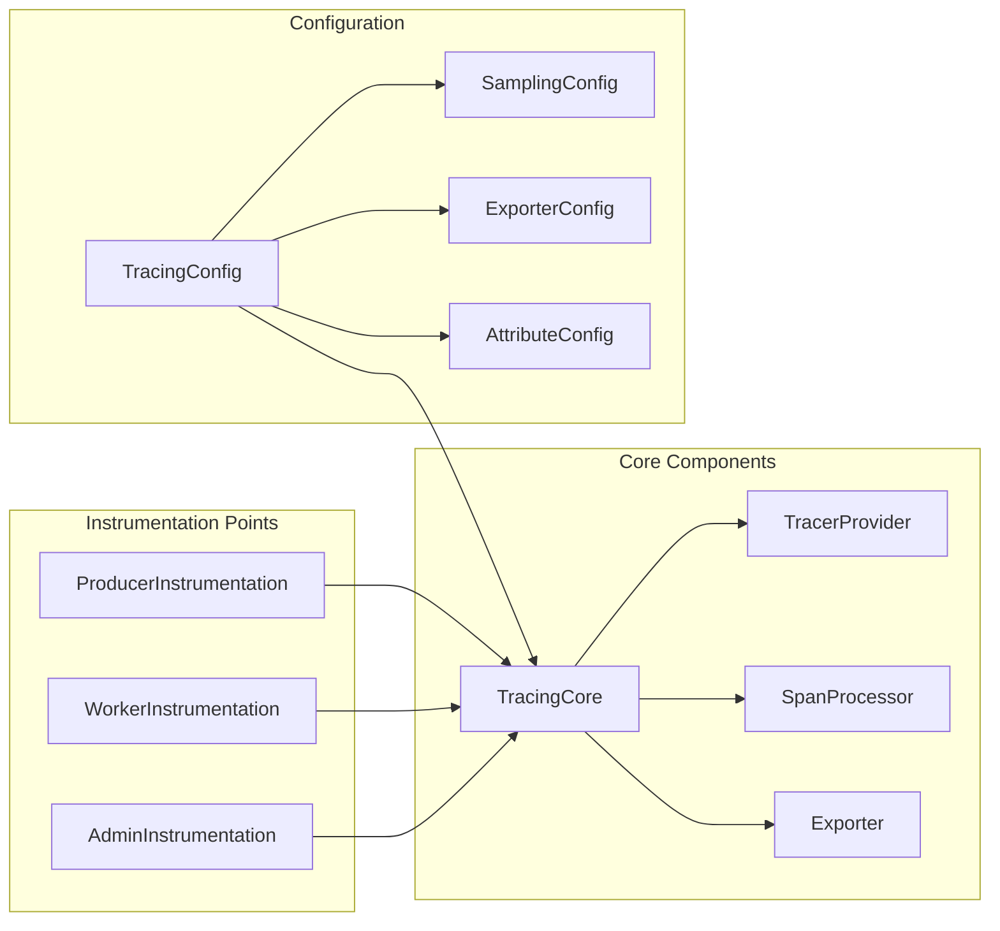
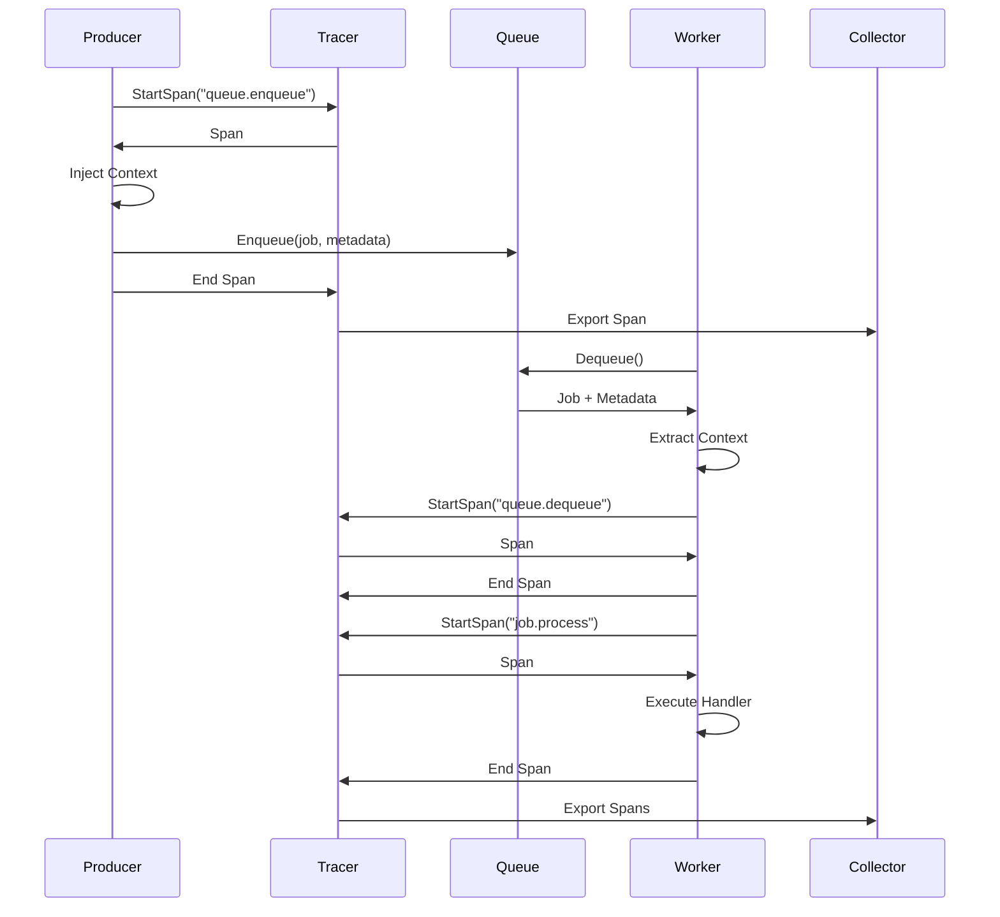
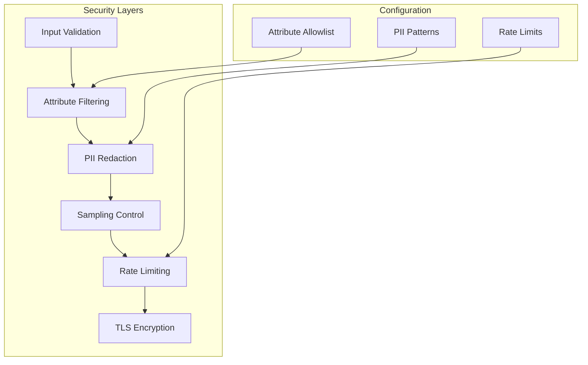
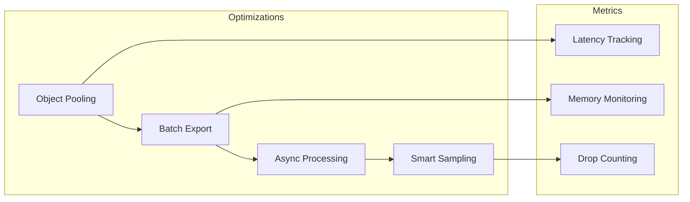

# Distributed Tracing Integration Design
## Feature ID: F004

## Executive Summary

This document outlines the design for integrating distributed tracing capabilities into the go-redis-work-queue system using OpenTelemetry. The implementation will provide comprehensive observability across all queue operations, enabling developers to track job execution flows, diagnose performance bottlenecks, and understand system behavior in distributed environments.

### Key Benefits
- End-to-end visibility of job lifecycle from enqueue to completion
- Correlation of jobs with upstream/downstream services
- Performance profiling with queue-specific metrics
- Error tracking with contextual trace information
- Direct integration with existing observability platforms

## System Architecture

### Overview

The tracing integration follows OpenTelemetry standards and implements instrumentation at critical points in the job lifecycle:



### Component Architecture



### Integration Points

1. **Producer Integration**
   - Hook into `Enqueue()` operations
   - Create root spans or continue existing traces
   - Inject trace context into job metadata

2. **Worker Integration**
   - Hook into `Dequeue()` operations
   - Extract trace context from job metadata
   - Wrap handler execution with process spans

3. **Admin Integration**
   - Instrument admin operations (pause, resume, drain)
   - Track bulk operations with batch spans
   - Monitor health check operations

4. **TUI Integration**
   - Display trace IDs in job details
   - Provide trace link generation
   - Enable trace-based filtering

### Data Flow



## API Specification

### Tracing Configuration API

```go
type TracingConfig struct {
    // Enable or disable tracing
    Enabled bool

    // Service name for traces
    ServiceName string

    // OTLP endpoint configuration
    Endpoint string
    Headers  map[string]string

    // Sampling configuration
    Sampling SamplingConfig

    // Attribute filtering
    AttributeFilter AttributeFilter

    // Export configuration
    ExportTimeout   time.Duration
    ExportBatchSize int
}

type SamplingConfig struct {
    // Default sampling rate (0.0 to 1.0)
    DefaultRate float64

    // Per-queue sampling rates
    QueueRates map[string]float64

    // Per-operation sampling rates
    OperationRates map[string]float64

    // Enable tail sampling
    TailSampling TailSamplingConfig
}
```

### Instrumentation API

```go
// Producer instrumentation
type TracedProducer interface {
    EnqueueWithContext(ctx context.Context, job Job) error
    BatchEnqueueWithContext(ctx context.Context, jobs []Job) error
}

// Worker instrumentation
type TracedWorker interface {
    ProcessWithContext(ctx context.Context) error
    RegisterHandlerWithTracing(pattern string, handler HandlerFunc)
}

// Admin instrumentation
type TracedAdmin interface {
    PauseWithContext(ctx context.Context, queue string) error
    ResumeWithContext(ctx context.Context, queue string) error
    DrainWithContext(ctx context.Context, queue string) error
}
```

### Span Attributes

Standard attributes for all spans:
- `queue.system`: "redis"
- `queue.name`: Queue identifier
- `service.name`: Service identifier
- `service.version`: Service version

Operation-specific attributes:

**queue.enqueue**
- `queue.message.id`: Job ID
- `queue.message.priority`: Job priority
- `queue.message.tenant`: Tenant identifier
- `queue.message.idempotency_key`: Idempotency key
- `queue.operation.type`: "enqueue"

**queue.dequeue**
- `queue.message.id`: Job ID
- `queue.wait_time_ms`: Time spent waiting
- `queue.depth`: Queue depth at dequeue
- `queue.operation.type`: "dequeue"

**job.process**
- `job.id`: Job identifier
- `job.type`: Job type/handler
- `job.retry_count`: Retry attempt number
- `job.max_retries`: Maximum retries configured
- `job.status`: "success" | "failure" | "retry"
- `job.error`: Error message (if failed)
- `job.duration_ms`: Processing duration

## Data Models

### Trace Context Metadata

```json
{
  "$schema": "http://json-schema.org/draft-07/schema#",
  "type": "object",
  "title": "TraceContext",
  "properties": {
    "traceparent": {
      "type": "string",
      "pattern": "^[0-9a-f]{2}-[0-9a-f]{32}-[0-9a-f]{16}-[0-9a-f]{2}$",
      "description": "W3C Trace Context traceparent header"
    },
    "tracestate": {
      "type": "string",
      "description": "W3C Trace Context tracestate header"
    },
    "baggage": {
      "type": "object",
      "additionalProperties": {
        "type": "string"
      },
      "description": "OpenTelemetry baggage for context propagation"
    }
  },
  "required": ["traceparent"]
}
```

### Span Event Schema

```json
{
  "$schema": "http://json-schema.org/draft-07/schema#",
  "type": "object",
  "title": "SpanEvent",
  "properties": {
    "timestamp": {
      "type": "string",
      "format": "date-time"
    },
    "name": {
      "type": "string",
      "enum": ["job.retry", "job.dead_letter", "queue.throttled", "worker.shutdown"]
    },
    "attributes": {
      "type": "object",
      "additionalProperties": true
    }
  },
  "required": ["timestamp", "name"]
}
```

## Security Model

### Threat Analysis

1. **Information Disclosure**
   - Risk: Sensitive data in span attributes
   - Mitigation: Configurable attribute filtering and redaction
   - Implementation: Allowlist-based attribute inclusion

2. **Trace Injection Attacks**
   - Risk: Malicious trace headers causing backend issues
   - Mitigation: Validate trace header format
   - Implementation: Strict W3C format validation

3. **Resource Exhaustion**
   - Risk: Excessive span creation overwhelming collectors
   - Mitigation: Sampling and rate limiting
   - Implementation: Configurable sampling rates and span limits

### Security Controls



### Privacy Controls

- Automatic redaction of common PII patterns
- Configurable attribute allowlists
- Opt-in detailed span attributes
- Separate sampling rates for production/development

## Performance Requirements

### Latency Impact

- Maximum overhead per operation: < 1ms (p99)
- Span creation: < 100μs
- Context injection/extraction: < 50μs
- Attribute addition: < 10μs per attribute

### Resource Usage

- Memory overhead per span: < 2KB
- CPU overhead: < 2% under normal load
- Network bandwidth: < 1% of application traffic

### Scalability Targets

- Support up to 10,000 spans/second per worker
- Batch export sizes: 100-500 spans
- Export interval: 5-10 seconds
- Maximum in-memory span buffer: 10,000 spans

### Performance Optimizations



## Testing Strategy

### Unit Testing

1. **Span Creation Tests**
   - Verify correct span attributes
   - Test parent-child relationships
   - Validate context propagation

2. **Sampling Tests**
   - Test sampling decisions
   - Verify per-queue rates
   - Test tail sampling logic

3. **Security Tests**
   - Test attribute filtering
   - Verify PII redaction
   - Test input validation

### Integration Testing

1. **End-to-End Tracing**
   - Test complete job lifecycle tracing
   - Verify trace continuity across services
   - Test error scenarios

2. **Collector Integration**
   - Test OTLP export
   - Verify batch processing
   - Test retry logic

3. **Performance Testing**
   - Measure overhead impact
   - Test under high load
   - Verify resource limits

### Testing Matrix

| Component | Unit Tests | Integration Tests | Performance Tests | Security Tests |
|-----------|------------|-------------------|-------------------|----------------|
| Producer Instrumentation | ✓ | ✓ | ✓ | ✓ |
| Worker Instrumentation | ✓ | ✓ | ✓ | ✓ |
| Context Propagation | ✓ | ✓ | ✓ | ✓ |
| Sampling Logic | ✓ | ✓ | ✓ | - |
| Export Pipeline | ✓ | ✓ | ✓ | ✓ |
| TUI Integration | ✓ | ✓ | - | - |

## Deployment Plan

### Rollout Phases

1. **Phase 1: Core Implementation** (Week 1-2)
   - Implement basic tracing infrastructure
   - Add producer/worker instrumentation
   - Local testing with Jaeger

2. **Phase 2: Advanced Features** (Week 3-4)
   - Implement sampling strategies
   - Add security controls
   - Performance optimization

3. **Phase 3: Integration** (Week 5)
   - TUI integration
   - Admin operation tracing
   - Documentation

4. **Phase 4: Production Readiness** (Week 6)
   - Performance testing
   - Security audit
   - Rollout plan

### Configuration Migration

```yaml
# Before
redis:
  host: localhost
  port: 6379

# After
redis:
  host: localhost
  port: 6379

tracing:
  enabled: true
  service_name: "work-queue"
  endpoint: "localhost:4317"
  sampling:
    default_rate: 0.1
    queue_rates:
      critical: 1.0
      batch: 0.01
  security:
    filter_attributes: true
    redact_pii: true
```

### Monitoring & Alerts

Key metrics to monitor:
- Span export success rate
- Average span export latency
- Dropped span count
- Memory usage for span buffer
- Sampling effectiveness

Alert thresholds:
- Export failure rate > 5%
- Export latency > 1s
- Dropped spans > 100/minute
- Memory usage > 100MB

## Appendices

### A. OpenTelemetry SDK Version Compatibility

- Minimum Go version: 1.19
- OpenTelemetry Go SDK: v1.20+
- OTLP Protocol: v0.20+
- W3C Trace Context: v1.0

### B. Example Trace Visualization

```
[Frontend] HTTP Request (trace_id: abc123)
    └── [API Gateway] Forward Request
        └── [Producer] queue.enqueue (queue: orders, job_id: job-456)
            └── [Worker] queue.dequeue (wait_time: 250ms)
                └── [Worker] job.process (duration: 1500ms)
                    ├── [Database] Query Order
                    ├── [Payment Service] Process Payment
                    └── [Notification] Send Email
```

### C. Performance Benchmarks

| Operation | Without Tracing | With Tracing (Sampled) | With Tracing (Not Sampled) |
|-----------|----------------|-------------------------|----------------------------|
| Enqueue | 5ms | 5.2ms | 5.05ms |
| Dequeue | 10ms | 10.3ms | 10.1ms |
| Process | 100ms | 100.8ms | 100.2ms |
| Memory/Worker | 50MB | 52MB | 51MB |

### D. References

- [OpenTelemetry Specification](https://opentelemetry.io/docs/reference/specification/)
- [W3C Trace Context](https://www.w3.org/TR/trace-context/)
- [OTLP Protocol](https://opentelemetry.io/docs/reference/specification/protocol/otlp/)
- [OpenTelemetry Go SDK](https://github.com/open-telemetry/opentelemetry-go)