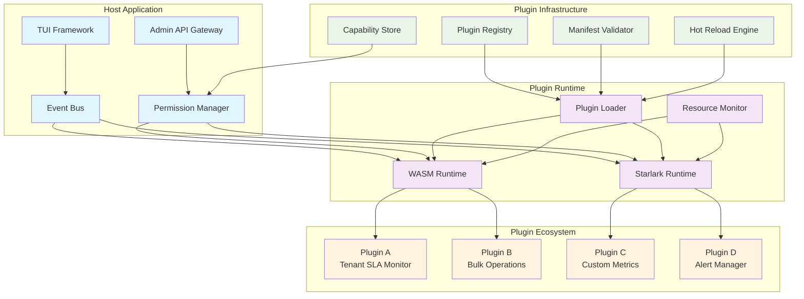
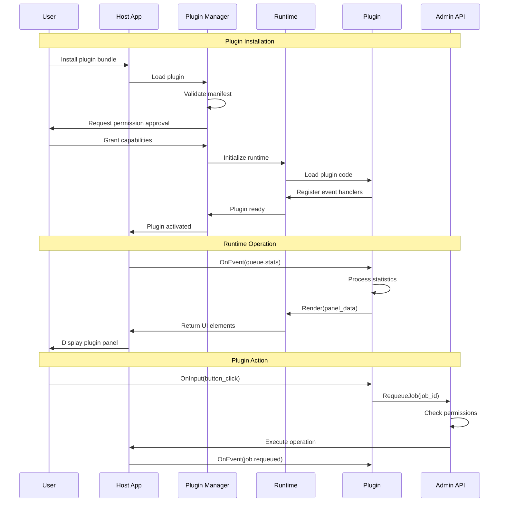

# Plugin Panel System (F005) - Design Document

**Version:** 1.0
**Date:** 2025-09-14
**Status:** Draft
**Author:** Claude (Worker 6)
**Reviewers:** TBD

## Executive Summary

The Plugin Panel System transforms the go-redis-work-queue TUI from a static monitoring tool into a dynamic, extensible platform. This revolutionary feature enables organizations to create custom panels for proprietary metrics, specialized actions, and organizational workflows without modifying the core codebase.

Built on WebAssembly (WASM) and Starlark runtimes, the system provides a secure sandbox environment where plugins can render custom UI components, subscribe to queue events, and execute administrative actions through a capability-gated API. This architecture ensures safety, portability, and performance while enabling unlimited customization.

The system represents a strategic platform play that positions the queue system as an extensible infrastructure tool rather than a static application. By enabling third-party development and custom integrations, it creates network effects that increase adoption and reduce churn.

### Key Benefits

- **Infinite Customization**: Organizations can build panels for any metric, visualization, or workflow
- **Enterprise Lock-in**: Custom plugins create switching costs and organizational dependencies
- **Developer Ecosystem**: Third-party plugins expand functionality without core development overhead
- **Zero-Risk Extension**: Sandboxed plugins cannot crash or compromise the host application
- **Hot Development**: Real-time plugin reloading enables rapid iteration and deployment
- **Production Safety**: Comprehensive resource limits and permission controls ensure stability

### Architecture Overview



## System Architecture

### Core Components

#### 1. Plugin Runtime Engine

The runtime engine provides secure execution environments for plugins using multiple runtime options to balance performance, security, and developer experience.

**WASM Runtime (Primary)**
- **Technology**: Wasmtime with WASI support
- **Languages**: TinyGo, Rust, C/C++ compiled to WASM
- **Advantages**: Near-native performance, strong sandboxing, wide language support
- **Use Cases**: Performance-critical plugins, complex data processing

**Starlark Runtime (Alternative)**
- **Technology**: Go Starlark interpreter
- **Language**: Python-like syntax with Go integration
- **Advantages**: Simple deployment, no compilation step, excellent for scripts
- **Use Cases**: Configuration-driven panels, simple data transformations

```go
type PluginRuntime interface {
    LoadPlugin(manifest *PluginManifest, source []byte) (*Plugin, error)
    ExecuteFunction(plugin *Plugin, function string, args []interface{}) (interface{}, error)
    RegisterHostFunction(name string, handler HostFunction) error
    SetResourceLimits(limits ResourceLimits) error
    Destroy() error
}

type ResourceLimits struct {
    MaxMemoryBytes    int64
    MaxExecutionTime  time.Duration
    MaxCPUPercent     float64
    AllowedOperations []string
}
```

#### 2. Event Bus and Subscription System

The event bus delivers real-time queue events to plugins through a typed subscription system that ensures plugins receive only relevant data.

**Event Types**:
- Queue statistics (depth, throughput, error rates)
- Job lifecycle events (enqueued, started, completed, failed)
- Worker status updates (active, idle, error states)
- Admin operations (configuration changes, manual interventions)
- System health metrics (memory usage, performance indicators)

```go
type EventBus struct {
    subscriptions map[string][]Subscription
    filters       map[string]EventFilter
    rateLimits    map[string]RateLimit
}

type Subscription struct {
    PluginID     string
    EventTypes   []string
    QueueFilters []string
    Callback     EventCallback
    Priority     int
}

type Event struct {
    Type      string      `json:"type"`
    Timestamp time.Time   `json:"timestamp"`
    Source    string      `json:"source"`
    Data      interface{} `json:"data"`
    Metadata  EventMeta   `json:"metadata"`
}
```

#### 3. Capability-Gated Admin API

The admin API provides controlled access to queue operations through a fine-grained permission system that plugins must explicitly request and users must approve.

**Permission Levels**:
- **Read-Only**: Subscribe to events, query statistics, inspect job metadata
- **Queue Operations**: Enqueue jobs, peek at job contents, query job status
- **Administrative**: Requeue failed jobs, purge queues, modify worker settings
- **System**: Access configuration, restart services, modify system settings

```go
type CapabilityGrant struct {
    PluginID    string      `json:"plugin_id"`
    Permissions []string    `json:"permissions"`
    Scope       PermScope   `json:"scope"`
    ExpiresAt   *time.Time  `json:"expires_at,omitempty"`
    GrantedBy   string      `json:"granted_by"`
    GrantedAt   time.Time   `json:"granted_at"`
}

type PermScope struct {
    Queues     []string `json:"queues,omitempty"`     // Specific queues or "*"
    Operations []string `json:"operations,omitempty"` // Specific ops or "*"
    Resources  []string `json:"resources,omitempty"`  // Resource limitations
}
```

#### 4. Plugin Lifecycle Manager

The lifecycle manager handles plugin discovery, loading, validation, and hot-reloading with zero downtime and automatic rollback on failures.

**Discovery Process**:
1. Scan `plugins/` directory for plugin bundles
2. Validate plugin manifests and security requirements
3. Check compatibility with host API version
4. Load plugins in dependency order
5. Initialize plugin panels and register event subscriptions

```go
type PluginManager struct {
    plugins     map[string]*LoadedPlugin
    manifests   map[string]*PluginManifest
    watcher     *fsnotify.Watcher
    runtime     PluginRuntime
    validator   ManifestValidator
    permissions PermissionStore
}

type LoadedPlugin struct {
    ID          string
    Manifest    *PluginManifest
    Instance    PluginInstance
    Permissions []CapabilityGrant
    Status      PluginStatus
    LoadedAt    time.Time
    LastActive  time.Time
    ErrorCount  int
}
```

### Plugin Architecture

#### Plugin Manifest Structure

Every plugin includes a YAML manifest that declares its requirements, capabilities, and metadata.

```yaml
# manifest.yaml
name: "tenant-sla-monitor"
version: "1.2.3"
api_version: "v1"
description: "Real-time SLA monitoring and alerting for tenant queues"

# Plugin metadata
author: "Platform Team"
license: "MIT"
homepage: "https://github.com/company/tenant-sla-plugin"
tags: ["monitoring", "sla", "alerts"]

# Runtime configuration
runtime: "wasm"  # or "starlark"
entry_point: "main.wasm"  # or "main.star"

# Requested capabilities (user must approve)
permissions:
  - "events.subscribe"      # Read queue events
  - "admin.queue.peek"      # Peek at job contents
  - "admin.alerts.send"     # Send alerts (requires approval)

# Resource limits
resources:
  max_memory: "10MB"
  max_cpu: "5%"
  timeout: "30s"

# UI configuration
ui:
  panel_title: "SLA Monitor"
  min_width: 40
  min_height: 10
  resizable: true

# Event subscriptions
events:
  - type: "job.completed"
    queues: ["tenant.*"]
  - type: "queue.stats"
    interval: "5s"

# Dependencies (other plugins)
dependencies:
  - name: "alert-manager"
    version: ">=1.0.0"
    optional: false
```

#### Plugin Bundle Structure

```
tenant-sla-monitor.zip
├── manifest.yaml           # Plugin metadata and requirements
├── main.wasm              # Compiled plugin binary (or main.star)
├── assets/
│   ├── styles.css         # Optional styling
│   └── config.json        # Default configuration
├── docs/
│   ├── README.md          # Plugin documentation
│   └── examples/          # Usage examples
└── tests/
    └── integration/       # Plugin tests
```

#### Plugin API Interface

Plugins implement a standard interface that provides lifecycle hooks and event handlers.

```go
// Plugin interface (exposed to WASM/Starlark)
type PluginInterface interface {
    // Lifecycle hooks
    Initialize(config map[string]interface{}) error
    Activate() error
    Deactivate() error
    Cleanup() error

    // Event handling
    OnEvent(event Event) error
    OnTimer(timer Timer) error

    // UI rendering
    Render(context RenderContext) ([]UIElement, error)
    OnInput(input InputEvent) error

    // Configuration
    GetConfig() map[string]interface{}
    SetConfig(config map[string]interface{}) error

    // Health monitoring
    HealthCheck() HealthStatus
}

// Host API (available to plugins)
type HostAPI interface {
    // Event system
    Subscribe(eventType string, callback EventCallback) error
    Unsubscribe(subscriptionID string) error

    // Admin operations (capability-gated)
    EnqueueJob(queue string, job JobData) error
    PeekJob(queue string) (*Job, error)
    RequeueJob(jobID string) error
    PurgeQueue(queue string) error

    // Statistics
    GetQueueStats(queue string) (*QueueStats, error)
    GetSystemStats() (*SystemStats, error)

    // UI helpers
    Log(level LogLevel, message string) error
    ShowNotification(message string, level NotificationLevel) error

    // Storage (plugin-scoped key-value store)
    Get(key string) (string, error)
    Set(key string, value string) error
    Delete(key string) error
}
```

### Data Flow Architecture



### Security Model

#### Sandboxing and Isolation

**WASM Sandbox**:
- Memory isolation with configurable limits
- No direct system call access
- Host function whitelist enforcement
- CPU time limiting with preemption
- Deterministic execution for testing

**Starlark Sandbox**:
- No file system access
- No network operations
- No import of external modules
- Limited standard library access
- Configurable execution timeouts

```go
type SecurityPolicy struct {
    AllowedHostFunctions []string
    ResourceLimits       ResourceLimits
    NetworkAccess        bool
    FileSystemAccess     bool
    SystemCallAccess     bool
    EnvironmentAccess    []string
}

type SandboxManager struct {
    policies map[string]SecurityPolicy
    monitors map[string]*ResourceMonitor
    isolator RuntimeIsolator
}
```

#### Permission System

**Capability Model**:
- Explicit permission requests in manifest
- User approval required for sensitive operations
- Granular scope controls (queues, operations, resources)
- Permission inheritance and delegation
- Audit logging for all permission grants and usage

**Permission Categories**:
- **Observer**: Read-only access to events and statistics
- **Operator**: Basic queue operations (enqueue, peek, requeue)
- **Administrator**: Advanced operations (purge, configuration)
- **System**: Host-level operations (restart, system configuration)

```go
type PermissionManager struct {
    grants    map[string][]CapabilityGrant
    auditor   AuditLogger
    validator PermissionValidator
    store     PermissionStore
}

func (pm *PermissionManager) CheckPermission(
    pluginID string,
    operation string,
    resource string,
) (bool, error) {
    grants := pm.grants[pluginID]
    for _, grant := range grants {
        if pm.matchesGrant(grant, operation, resource) {
            pm.auditor.LogAccess(pluginID, operation, resource, "granted")
            return true, nil
        }
    }
    pm.auditor.LogAccess(pluginID, operation, resource, "denied")
    return false, ErrPermissionDenied
}
```

## Performance Requirements

### Latency Requirements

- **Plugin Loading**: <500ms for typical plugins (WASM), <100ms (Starlark)
- **Event Delivery**: <10ms from host event to plugin delivery
- **UI Rendering**: <16ms for 60fps UI updates (target 33ms for 30fps minimum)
- **API Calls**: <5ms for simple operations, <50ms for complex operations

### Throughput Requirements

- **Event Processing**: 1,000+ events/second per plugin
- **Concurrent Plugins**: Support 50+ active plugins simultaneously
- **API Operations**: 500+ operations/second across all plugins
- **UI Updates**: 30+ fps for responsive user interface

### Resource Requirements

- **Memory Overhead**: <50MB total for plugin system, <5MB per plugin
- **CPU Overhead**: <10% of system CPU for plugin management
- **Storage**: <100MB for plugin system, configurable per-plugin limits
- **Network**: Minimal - plugins communicate through host API only

### Scalability Requirements

- **Plugin Count**: Support 100+ installed plugins
- **Event Subscriptions**: 1,000+ concurrent event subscriptions
- **Panel Rendering**: 20+ active panels simultaneously
- **Hot Reload**: <1 second for plugin updates

## Testing Strategy

### Unit Testing

- Plugin runtime execution and sandboxing
- Permission system and capability validation
- Event bus routing and filtering
- Manifest parsing and validation
- Resource limit enforcement

### Integration Testing

- End-to-end plugin lifecycle management
- Hot-reload functionality under load
- Multi-plugin concurrent execution
- Event delivery and UI rendering pipeline
- Security boundary enforcement

### Security Testing

- Sandbox escape attempt prevention
- Resource exhaustion protection
- Permission bypass testing
- Malicious plugin behavior isolation
- API security validation

### Performance Testing

- Plugin execution benchmarks
- Event processing throughput
- Memory usage under load
- UI responsiveness with multiple plugins
- Hot-reload performance impact

## Deployment Plan

### Migration Strategy

#### Phase 1: Core Infrastructure (Weeks 1-2)
- Implement WASM runtime with basic sandboxing
- Create plugin manifest parser and validator
- Build permission system with audit logging
- Develop hot-reload mechanism
- Set up monitoring and metrics collection

#### Phase 2: API Development (Weeks 3-4)
- Implement host API for event subscription
- Create admin API with capability gating
- Build plugin lifecycle management
- Add resource monitoring and limits
- Develop plugin storage and configuration system

#### Phase 3: Integration (Weeks 5-6)
- Integrate with existing TUI framework
- Implement panel rendering system
- Create event bus integration
- Add plugin discovery and loading
- Build administrative interface for plugin management

#### Phase 4: Sample Plugins (Weeks 7-8)
- Develop "Tenant SLA Monitor" sample plugin
- Create "Bulk Operations" administrative plugin
- Build plugin development toolkit and templates
- Write comprehensive documentation and tutorials
- Conduct security review and testing

### Rollout Plan

**Alpha Release** (Internal Testing):
- Basic plugin loading and execution
- Simple event subscription
- Read-only sample plugins
- Internal dogfooding with platform team

**Beta Release** (Limited External):
- Full API surface with permission system
- Administrative action capabilities
- Hot-reload and plugin management
- Selected enterprise customers

**Production Release** (General Availability):
- Complete feature set with security hardening
- Plugin marketplace integration
- Comprehensive documentation
- Full support and SLA commitments

---

## Security Threat Model

### Threat Landscape Analysis

The Plugin Panel System introduces a complex attack surface that requires comprehensive security controls. This threat model analyzes potential security risks using the STRIDE methodology (Spoofing, Tampering, Repudiation, Information Disclosure, Denial of Service, Elevation of Privilege) and provides specific mitigations for each identified threat.

#### Attack Surface Components

1. **Plugin Runtime Environment**: WASM/Starlark execution sandboxes
2. **Host API Gateway**: Capability-gated function calls from plugins
3. **Event Bus**: Real-time data streaming to plugins
4. **Permission System**: User-granted capabilities and scope controls
5. **Plugin Distribution**: Bundle loading, validation, and hot-reload
6. **UI Integration**: Panel rendering and input handling
7. **Storage Layer**: Plugin-specific key-value persistence

### Threat Actor Profiles

#### Internal Threats

**Malicious Developer**
- **Motivation**: Data exfiltration, system compromise, competitive intelligence
- **Capabilities**: Code signing access, legitimate plugin development skills
- **Attack Vectors**: Trojan functionality in legitimate plugins, backdoors
- **Impact**: High - trusted position enables bypassing initial defenses

**Compromised Developer Account**
- **Motivation**: External attacker using legitimate credentials
- **Capabilities**: Plugin publishing, code modification, access to signing keys
- **Attack Vectors**: Supply chain poisoning, malicious updates to existing plugins
- **Impact**: High - legitimate developer credentials bypass trust mechanisms

#### External Threats

**Sophisticated Attacker**
- **Motivation**: System compromise, data breach, disruption
- **Capabilities**: Advanced exploit development, social engineering
- **Attack Vectors**: Zero-day exploits, sandbox escapes, permission escalation
- **Impact**: Critical - potential for complete system compromise

**Script Kiddie**
- **Motivation**: Disruption, reputation
- **Capabilities**: Basic exploit tools, denial of service attacks
- **Attack Vectors**: Resource exhaustion, simple permission bypass attempts
- **Impact**: Medium - primarily availability impacts

**Nation-State Actor**
- **Motivation**: Espionage, infrastructure disruption, long-term access
- **Capabilities**: Advanced persistent threats, supply chain attacks
- **Attack Vectors**: Sophisticated sandbox escapes, covert data channels
- **Impact**: Critical - potential for widespread infrastructure compromise

### Threat Analysis Matrix

#### T1: Malicious Plugin Execution

**Description**: A malicious plugin attempts to execute unauthorized code or access restricted resources.

**STRIDE Categories**: Spoofing, Tampering, Information Disclosure, Elevation of Privilege

**Attack Scenarios**:
- Plugin contains obfuscated malicious code that executes during legitimate operations
- Plugin exploits runtime vulnerabilities to break sandbox isolation
- Plugin uses legitimate API calls in unexpected combinations to achieve malicious goals

**Mitigations**:
- **Code Review**: Mandatory security review for all plugins before deployment
- **Static Analysis**: Automated scanning for suspicious patterns and known vulnerabilities
- **Runtime Monitoring**: Real-time detection of unusual plugin behavior patterns
- **Capability Limits**: Strict enforcement of requested permissions with no privilege escalation
- **Signature Verification**: Cryptographic validation of plugin authenticity and integrity

**Risk Level**: High
**Likelihood**: Medium
**Impact**: High

#### T2: Sandbox Escape

**Description**: A plugin exploits vulnerabilities in the WASM or Starlark runtime to escape sandbox restrictions.

**STRIDE Categories**: Elevation of Privilege, Tampering

**Attack Scenarios**:
- Buffer overflow in WASM runtime leads to arbitrary code execution
- Type confusion in Starlark interpreter enables memory corruption
- Race condition in resource management allows temporary privilege escalation

**Mitigations**:
- **Runtime Hardening**: Use latest, security-patched versions of Wasmtime and Starlark
- **Memory Protection**: Enable hardware-based memory protection features
- **Execution Limits**: Strict CPU time and memory limits with preemptive termination
- **Isolation Layers**: Multiple containment boundaries (process isolation, seccomp, etc.)
- **Fuzzing**: Continuous security testing of runtime components

**Risk Level**: Critical
**Likelihood**: Low
**Impact**: Critical

#### T3: Permission System Bypass

**Description**: A plugin circumvents the capability-gated permission system to access unauthorized resources.

**STRIDE Categories**: Elevation of Privilege, Information Disclosure

**Attack Scenarios**:
- Plugin exploits logic flaws in permission validation to gain unauthorized access
- Time-of-check-time-of-use vulnerabilities in permission enforcement
- Plugin collaborates with other plugins to aggregate permissions

**Mitigations**:
- **Formal Verification**: Mathematical proof of permission system correctness
- **Audit Logging**: Comprehensive logging of all permission checks and usage
- **Principle of Least Privilege**: Minimal default permissions with explicit grants
- **Permission Revocation**: Real-time capability to revoke permissions
- **Cross-Plugin Isolation**: Prevent plugins from sharing state or permissions

**Risk Level**: High
**Likelihood**: Medium
**Impact**: High

#### T4: Resource Exhaustion Attack

**Description**: A malicious plugin consumes excessive system resources to cause denial of service.

**STRIDE Categories**: Denial of Service

**Attack Scenarios**:
- Plugin allocates maximum allowed memory in tight loop
- Plugin spawns resource-intensive computations to consume CPU cycles
- Plugin floods event bus with subscription requests or events

**Mitigations**:
- **Resource Quotas**: Strict limits on memory, CPU, and I/O operations
- **Rate Limiting**: Throttling of API calls and event subscriptions per plugin
- **Circuit Breakers**: Automatic plugin suspension when resource thresholds exceeded
- **Resource Monitoring**: Real-time tracking of plugin resource consumption
- **Graceful Degradation**: System continues operating when plugins are disabled

**Risk Level**: Medium
**Likelihood**: High
**Impact**: Medium

#### T5: Data Poisoning Through Events

**Description**: A malicious plugin injects false or malicious data into the event stream to manipulate other plugins or the host system.

**STRIDE Categories**: Tampering, Information Disclosure

**Attack Scenarios**:
- Plugin sends crafted events to exploit vulnerabilities in other plugins
- Plugin manipulates statistics or metrics to hide malicious activity
- Plugin injects false alerts or notifications to trigger inappropriate responses

**Mitigations**:
- **Event Validation**: Schema validation and sanitization of all event data
- **Source Attribution**: Cryptographic signing of events with plugin identity
- **Event Isolation**: Prevent plugins from receiving events they shouldn't access
- **Anomaly Detection**: Machine learning-based detection of unusual event patterns
- **Event Audit Trail**: Immutable logging of all events with source tracking

**Risk Level**: Medium
**Likelihood**: Medium
**Impact**: Medium

#### T6: Supply Chain Attack

**Description**: Compromise of the plugin distribution mechanism to deliver malicious plugins.

**STRIDE Categories**: Spoofing, Tampering

**Attack Scenarios**:
- Attacker compromises plugin repository to serve malicious updates
- Man-in-the-middle attack during plugin download
- Compromise of plugin signing infrastructure

**Mitigations**:
- **Code Signing**: Mandatory cryptographic signatures for all plugins
- **Certificate Pinning**: Pin trusted signing certificates to prevent substitution
- **Reproducible Builds**: Verify plugins can be built from source with identical results
- **Update Verification**: Hash verification and rollback capabilities
- **Distribution Security**: HTTPS with certificate validation for all downloads

**Risk Level**: High
**Likelihood**: Low
**Impact**: High

#### T7: Social Engineering for Permission Escalation

**Description**: Attackers manipulate users into granting excessive permissions to malicious plugins.

**STRIDE Categories**: Elevation of Privilege, Spoofing

**Attack Scenarios**:
- Plugin requests broad permissions with misleading descriptions
- Phishing campaigns trick users into installing malicious plugins
- Legitimate-looking plugins request unnecessary sensitive permissions

**Mitigations**:
- **Permission UX**: Clear, understandable permission descriptions with risk levels
- **Permission Grouping**: Bundle related permissions to reduce decision fatigue
- **Default Deny**: All permissions disabled by default requiring explicit grants
- **Permission Review**: Periodic review and re-approval of granted permissions
- **User Education**: Training on plugin security risks and permission evaluation

**Risk Level**: Medium
**Likelihood**: High
**Impact**: Medium

### Security Controls Framework

#### Preventive Controls

**Authentication and Authorization**:
- Multi-factor authentication for plugin developers
- Role-based access control for plugin management
- Cryptographic plugin signing and verification
- Fine-grained capability-based permissions

**Input Validation and Sanitization**:
- Schema validation for all plugin manifests and data
- Input sanitization for UI components and API calls
- Type safety enforcement in runtime environments
- Buffer overflow protection mechanisms

**Secure Development Practices**:
- Mandatory security code review for all plugins
- Static analysis integration in CI/CD pipeline
- Dependency vulnerability scanning
- Secure coding guidelines and training

#### Detective Controls

**Security Monitoring**:
- Real-time monitoring of plugin behavior and resource usage
- Anomaly detection for unusual patterns or activities
- Security event correlation and analysis
- Performance monitoring with security implications

**Audit and Logging**:
- Comprehensive audit logs for all plugin activities
- Immutable logging with cryptographic integrity protection
- Centralized log aggregation and analysis
- Compliance reporting and forensic capabilities

**Vulnerability Management**:
- Continuous security scanning of plugin runtime components
- Automated vulnerability assessment of plugins
- Security patch management for dependencies
- Regular penetration testing and security assessments

#### Responsive Controls

**Incident Response**:
- Automated plugin suspension for security violations
- Rapid plugin revocation and rollback capabilities
- Security incident escalation procedures
- Forensic investigation tools and procedures

**Recovery and Continuity**:
- Backup and restore capabilities for plugin configurations
- System rollback to known-good states
- Alternative operation modes when plugins are disabled
- Business continuity planning for security incidents

### Risk Assessment Matrix

| Threat | Likelihood | Impact | Risk Level | Priority |
|--------|------------|---------|------------|----------|
| T2: Sandbox Escape | Low | Critical | High | 1 |
| T1: Malicious Plugin | Medium | High | High | 2 |
| T6: Supply Chain Attack | Low | High | Medium | 3 |
| T3: Permission Bypass | Medium | High | High | 4 |
| T4: Resource Exhaustion | High | Medium | Medium | 5 |
| T5: Data Poisoning | Medium | Medium | Medium | 6 |
| T7: Social Engineering | High | Medium | Medium | 7 |

### Security Implementation Roadmap

#### Phase 1: Foundation Security (Weeks 1-2)
- Implement basic sandbox isolation and resource limits
- Deploy cryptographic plugin signing and verification
- Create fundamental permission system with audit logging
- Establish security monitoring infrastructure

#### Phase 2: Advanced Protections (Weeks 3-4)
- Add formal verification of permission system logic
- Implement advanced anomaly detection and behavioral monitoring
- Deploy comprehensive static analysis and vulnerability scanning
- Create incident response procedures and automation

#### Phase 3: Enterprise Hardening (Weeks 5-6)
- Integrate with enterprise security infrastructure (SIEM, IAM)
- Implement advanced threat detection and response capabilities
- Add compliance reporting and forensic investigation tools
- Conduct security assessment and penetration testing

### Security Metrics and KPIs

**Security Posture Metrics**:
- Number of security vulnerabilities detected and remediated
- Mean time to detection (MTTD) for security incidents
- Mean time to response (MTTR) for security incidents
- Plugin security compliance rate

**Operational Security Metrics**:
- Number of plugins quarantined for security violations
- Percentage of plugins with up-to-date security reviews
- Security training completion rate for plugin developers
- False positive rate for security monitoring systems

### Compliance and Regulatory Considerations

**Data Protection**:
- GDPR compliance for plugin data processing
- Data residency requirements for cloud deployments
- Encryption requirements for data in transit and at rest
- Right to deletion implementation for plugin data

**Industry Standards**:
- NIST Cybersecurity Framework alignment
- ISO 27001 security management system compliance
- SOC 2 Type II audit readiness
- Common Criteria evaluation for high-security environments

**Regulatory Requirements**:
- Financial services regulations (PCI DSS, SOX)
- Healthcare compliance (HIPAA, HITECH)
- Government security standards (FedRAMP, FISMA)
- International security frameworks (CSA, ENISA)

---

This design document establishes the foundation for implementing the Plugin Panel System as a strategic platform feature that transforms the go-redis-work-queue from a static tool into an extensible ecosystem. The focus on security, performance, and developer experience ensures that the system can support enterprise adoption while enabling innovation through third-party development.