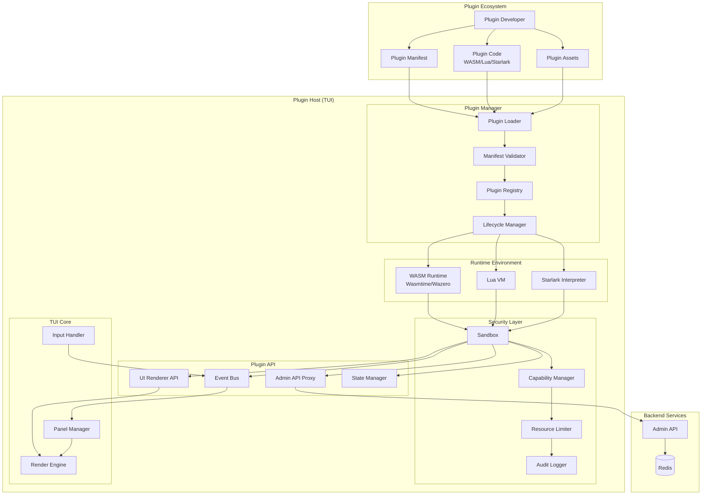
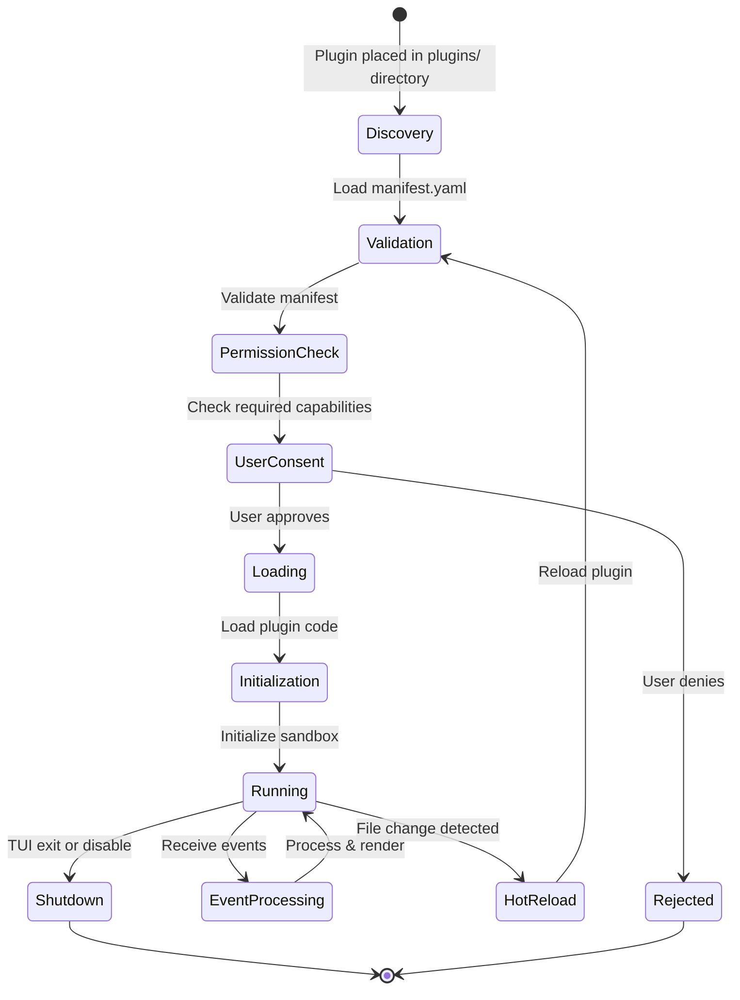
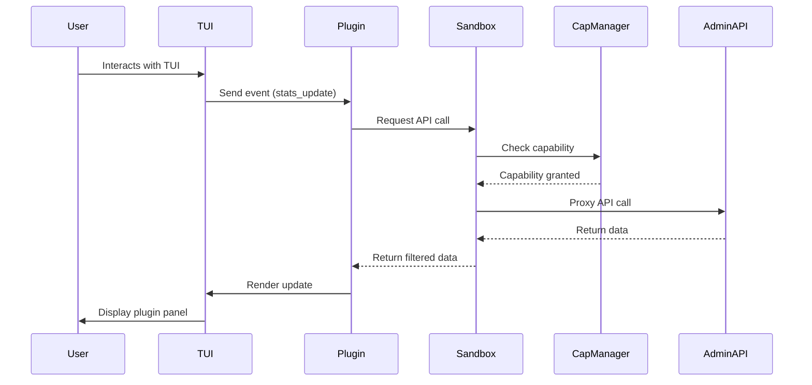
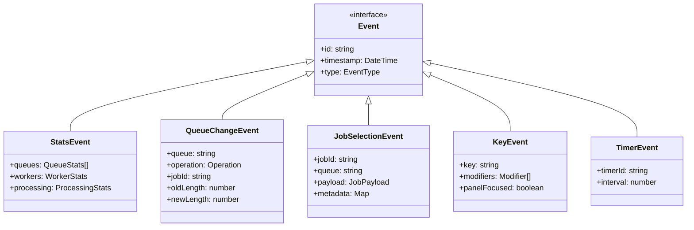
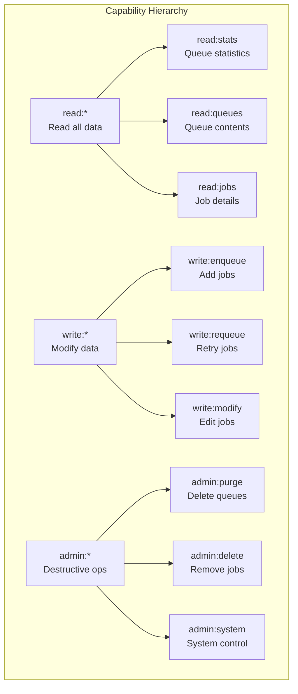
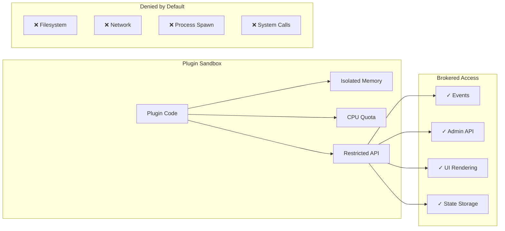
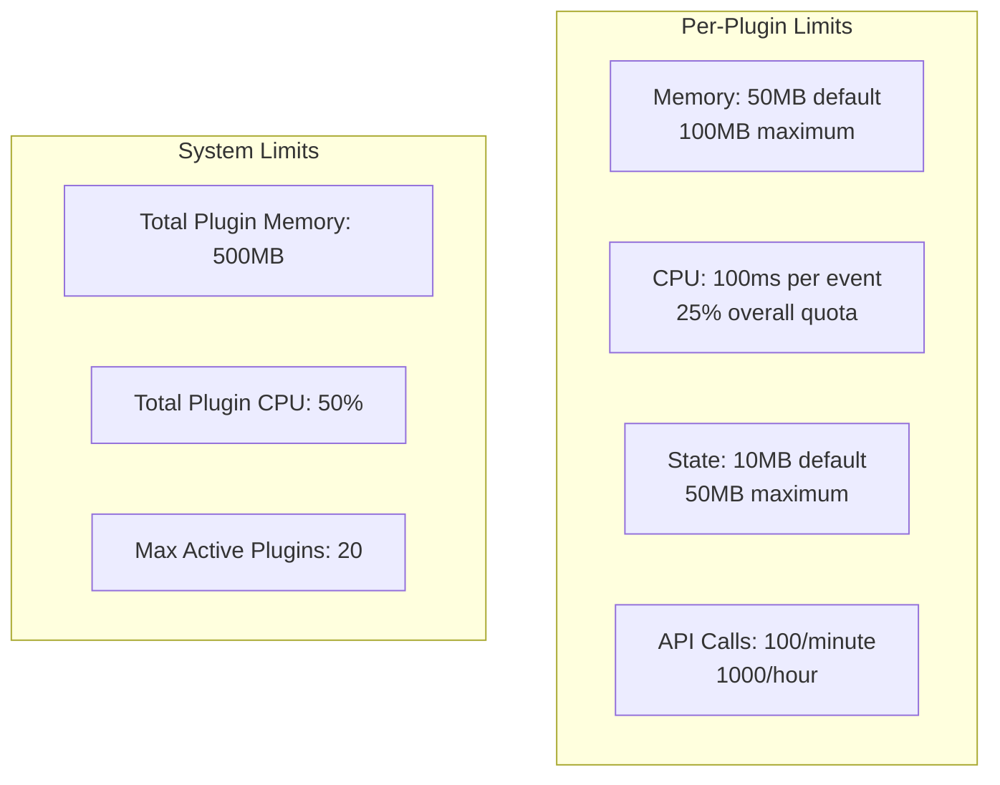
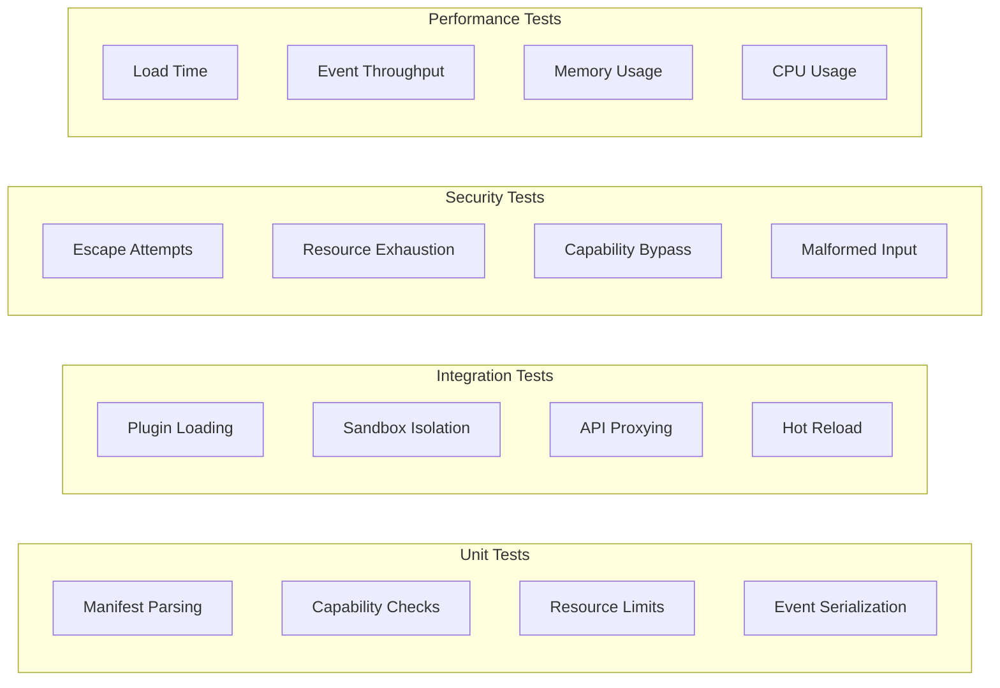
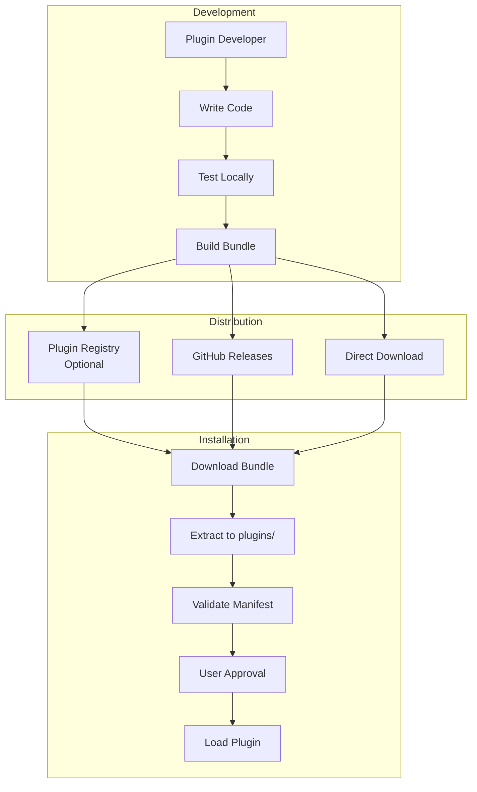

# Plugin Panel System Design Document

## Executive Summary

This document defines the architecture and design for a terminal-native plugin framework that enables custom panels within the TUI (Terminal User Interface) of the go-redis-work-queue system. The plugin system allows teams to create organization-specific dashboards, metrics visualizations, and actions while maintaining security through sandboxing and capability-based permissions.

## System Architecture

### Overview

The Plugin Panel System provides a secure, extensible framework for third-party code to run within the TUI environment, with controlled access to system resources through a capability-gated API.



### Component Descriptions

#### Plugin Manager
- **Plugin Loader**: Discovers and loads plugins from the `plugins/` directory
- **Manifest Validator**: Validates plugin manifests against schema, checks version compatibility
- **Plugin Registry**: Maintains registry of loaded plugins and their metadata
- **Lifecycle Manager**: Handles plugin initialization, hot-reload, and teardown

#### Runtime Environment
- **WASM Runtime**: Executes WebAssembly plugins using Wasmtime or Wazero
- **Lua VM**: Runs Lua scripts in isolated VMs
- **Starlark Interpreter**: Executes Starlark (Python-like) scripts

#### Security Layer
- **Sandbox**: Isolates plugin execution from host system
- **Capability Manager**: Enforces permission model based on user-granted capabilities
- **Resource Limiter**: Enforces CPU, memory, and execution time limits
- **Audit Logger**: Logs all plugin actions for security auditing

#### Plugin API
- **Event Bus**: Delivers system events to subscribed plugins
- **Admin API Proxy**: Provides capability-gated access to admin functions
- **UI Renderer API**: Allows plugins to render content in their panel zone
- **State Manager**: Manages plugin-specific persistent state

### Plugin Lifecycle



### Plugin Communication Flow



## API Specification

### Plugin Host API

The host provides these APIs to plugins:

#### Event Subscription API
```typescript
interface EventAPI {
  // Subscribe to event types
  subscribe(events: EventType[]): void;

  // Event handlers
  onStatsUpdate(handler: (stats: StatsEvent) => void): void;
  onQueueChange(handler: (change: QueueChangeEvent) => void): void;
  onJobSelection(handler: (job: JobSelectionEvent) => void): void;
  onTimer(interval: number, handler: () => void): TimerId;
  onKeyPress(handler: (key: KeyEvent) => void): void;
}
```

#### Admin Operations API (Capability-Gated)
```typescript
interface AdminAPI {
  // Read operations (requires 'read' capability)
  getStats(): Promise<StatsResult>;
  peekQueue(queue: string, limit: number): Promise<PeekResult>;
  getQueueLength(queue: string): Promise<number>;

  // Write operations (requires 'write' capability)
  enqueueJob(queue: string, payload: JobPayload): Promise<void>;
  requeueJob(jobId: string): Promise<void>;

  // Destructive operations (requires 'admin' capability)
  purgeQueue(queue: string): Promise<void>;
  deleteJob(jobId: string): Promise<void>;
}
```

#### UI Rendering API
```typescript
interface UIApi {
  // Panel management
  setPanelTitle(title: string): void;
  setPanelSize(width: number, height: number): void;

  // Content rendering
  clear(): void;
  write(text: string, style?: TextStyle): void;
  writeLine(text: string, style?: TextStyle): void;

  // Layout
  createTable(headers: string[]): TableBuilder;
  createChart(type: ChartType): ChartBuilder;
  createForm(): FormBuilder;

  // Styling
  setColor(fg: Color, bg?: Color): void;
  setBold(enabled: boolean): void;
  setUnderline(enabled: boolean): void;
}
```

#### State Management API
```typescript
interface StateAPI {
  // Persistent state (survives restarts)
  setState(key: string, value: any): Promise<void>;
  getState(key: string): Promise<any>;
  deleteState(key: string): Promise<void>;

  // Temporary state (in-memory only)
  setTemp(key: string, value: any): void;
  getTemp(key: string): any;
}
```

### Plugin Manifest Schema

```yaml
# manifest.yaml
name: tenant-sla-monitor
version: 1.0.0
description: Monitor SLA compliance for multi-tenant jobs
author: ACME Corp
license: MIT

# Plugin metadata
homepage: https://example.com/plugins/tenant-sla
repository: https://github.com/example/tenant-sla-plugin
tags: [monitoring, sla, multi-tenant]

# Runtime configuration
runtime: wasm  # wasm | lua | starlark
entry: dist/plugin.wasm  # Entry point file
hot_reload: true  # Enable hot-reload on file changes

# Required capabilities
capabilities:
  required:
    - read:stats    # Read queue statistics
    - read:queues   # Peek at queue contents
  optional:
    - write:enqueue # Enqueue new jobs
    - admin:purge   # Purge queues

# Resource limits
resources:
  max_memory_mb: 50
  max_cpu_ms: 100  # Max CPU time per event
  timeout_ms: 5000 # Max execution time per call

# UI configuration
ui:
  panel_position: right  # left | right | bottom
  default_width: 40     # Characters
  default_height: 20    # Lines
  resizable: true

# Plugin-specific configuration schema
config_schema:
  type: object
  properties:
    refresh_interval:
      type: integer
      default: 5000
      description: Stats refresh interval in milliseconds
    tenants:
      type: array
      items:
        type: string
      description: List of tenant IDs to monitor
```

## Data Models

### Core Event Types



### Plugin Capability Model



## Security Model

### Threat Model

| Threat | Risk Level | Mitigation |
|--------|------------|------------|
| Malicious plugin code | Critical | Sandbox isolation, capability model |
| Resource exhaustion | High | CPU/memory/time limits |
| Data exfiltration | High | No network/filesystem access by default |
| Plugin supply chain | High | Manifest signing, version pinning |
| Privilege escalation | High | Capability enforcement, audit logging |
| UI hijacking | Medium | Panel boundaries, input isolation |
| State tampering | Medium | Isolated state storage per plugin |
| Hot-reload attacks | Medium | File integrity checks, reload validation |

### Security Controls

#### 1. Sandboxing


#### 2. Capability-Based Permissions
- Least privilege by default
- Explicit user consent for capabilities
- Capability decisions persisted per plugin version
- Revocable at any time

#### 3. Resource Limits
- Memory: Configurable per-plugin limit (default 50MB)
- CPU: Time slice limits per event (default 100ms)
- Execution: Total timeout per call (default 5s)
- State: Storage quota per plugin (default 10MB)

#### 4. Audit Logging
All plugin actions are logged:
```json
{
  "timestamp": "2025-01-14T10:00:00Z",
  "plugin": "tenant-sla-monitor",
  "version": "1.0.0",
  "action": "admin_api_call",
  "method": "peekQueue",
  "parameters": {"queue": "high", "limit": 10},
  "capability_used": "read:queues",
  "result": "success",
  "duration_ms": 23
}
```

## Performance Requirements

### Response Time SLAs

| Operation | P50 | P95 | P99 |
|-----------|-----|-----|-----|
| Plugin load | 100ms | 500ms | 1s |
| Event dispatch | 5ms | 20ms | 50ms |
| API call (read) | 10ms | 50ms | 100ms |
| API call (write) | 20ms | 100ms | 200ms |
| UI render | 10ms | 30ms | 60ms |
| Hot reload | 200ms | 1s | 2s |

### Resource Constraints



## Testing Strategy

### Test Matrix



### Test Scenarios

#### Security Test Cases
1. **Sandbox Escape**: Attempt to access host filesystem
2. **Network Access**: Try to make HTTP requests
3. **Resource Bomb**: Infinite loops, memory allocation
4. **Capability Escalation**: Request unauthorized APIs
5. **Input Fuzzing**: Send malformed events to plugins

#### Performance Test Cases
1. **Plugin Storm**: Load 50 plugins simultaneously
2. **Event Flood**: Send 10,000 events/second to plugins
3. **Memory Pressure**: Plugins using maximum memory
4. **CPU Saturation**: Plugins using full CPU quota
5. **Hot Reload Stress**: Rapid file changes

## Deployment Plan

### Plugin Distribution



### Plugin Bundle Structure

```
tenant-sla-monitor-1.0.0/
├── manifest.yaml           # Plugin manifest
├── dist/
│   ├── plugin.wasm        # Compiled WASM module
│   └── plugin.wasm.map    # Source maps (optional)
├── assets/
│   ├── icon.png          # Plugin icon
│   └── templates/         # UI templates
├── docs/
│   ├── README.md         # Documentation
│   └── CHANGELOG.md      # Version history
├── examples/
│   └── config.yaml       # Example configuration
└── LICENSE               # License file
```

### Migration Path

#### Phase 1: Core Infrastructure (Weeks 1-2)
- Implement plugin loader and registry
- Set up WASM runtime
- Basic sandbox implementation

#### Phase 2: API Surface (Weeks 3-4)
- Event bus implementation
- Admin API proxy
- UI rendering API
- State management

#### Phase 3: Security & Permissions (Weeks 5-6)
- Capability manager
- Resource limiters
- Audit logging
- User consent UI

#### Phase 4: Developer Experience (Weeks 7-8)
- Hot reload implementation
- Plugin development SDK
- Documentation
- Sample plugins

## Sample Plugins

### 1. Tenant SLA Monitor (Read-Only)

```rust
// tenant_sla_monitor.rs (compiled to WASM)
use plugin_sdk::*;

#[plugin_main]
fn main() {
    register_handler(EventType::StatsUpdate, on_stats_update);
    register_handler(EventType::Timer(5000), on_timer);
}

fn on_stats_update(event: StatsEvent) {
    let sla_status = calculate_sla_compliance(&event);

    ui::clear();
    ui::write_line("Tenant SLA Monitor", Style::Bold);
    ui::write_line("─".repeat(40), Style::Normal);

    for tenant in sla_status {
        let color = if tenant.compliant {
            Color::Green
        } else {
            Color::Red
        };

        ui::write_line(
            format!("{}: {:.1}%", tenant.id, tenant.compliance),
            Style::Colored(color)
        );
    }
}
```

### 2. Bulk Requeue Helper (Action Panel)

```python
# bulk_requeue.star (Starlark)
load("plugin", "register", "ui", "admin", "state")

def on_key_press(event):
    if event.key == "r" and event.modifiers == ["ctrl"]:
        show_requeue_dialog()

def show_requeue_dialog():
    form = ui.create_form()
    form.add_field("queue", "Queue name:", "dead_letter")
    form.add_field("pattern", "Job pattern:", "*")
    form.add_field("limit", "Max jobs:", "100")

    if form.show():
        requeue_matching_jobs(
            form.get("queue"),
            form.get("pattern"),
            int(form.get("limit"))
        )

def requeue_matching_jobs(queue, pattern, limit):
    # Requires 'read:queues' and 'write:requeue' capabilities
    jobs = admin.peek_queue(queue, limit)
    matched = [j for j in jobs if pattern_match(pattern, j)]

    for job in matched:
        admin.requeue_job(job.id)

    ui.show_notification(f"Requeued {len(matched)} jobs")

register("on_key_press", on_key_press)
```

## Appendix

### Capability Definitions

| Capability | Description | Risk Level |
|------------|-------------|------------|
| `read:stats` | Read queue statistics | Low |
| `read:queues` | Peek at queue contents | Low |
| `read:jobs` | Read individual job details | Low |
| `write:enqueue` | Add new jobs to queues | Medium |
| `write:requeue` | Retry failed jobs | Medium |
| `write:modify` | Modify job payloads | High |
| `admin:purge` | Delete entire queues | Critical |
| `admin:delete` | Delete individual jobs | High |
| `admin:system` | System configuration changes | Critical |

### Runtime Comparison

| Runtime | Pros | Cons | Use Case |
|---------|------|------|----------|
| WASM | Fast, secure, language-agnostic | Larger binaries, complex toolchain | Performance-critical plugins |
| Lua | Small, simple, fast startup | Limited ecosystem, manual sandboxing | Simple scripting plugins |
| Starlark | Python-like, deterministic | Slower than WASM/Lua | Configuration and automation |

### Plugin Development SDK

The SDK will provide:
- Type definitions for all APIs
- Local development server
- Testing framework
- Debugging tools
- Bundle builder
- Documentation generator