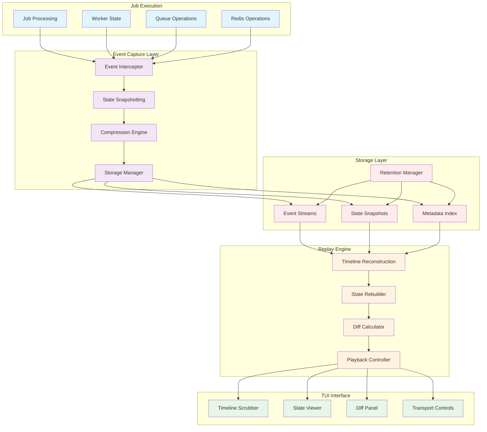
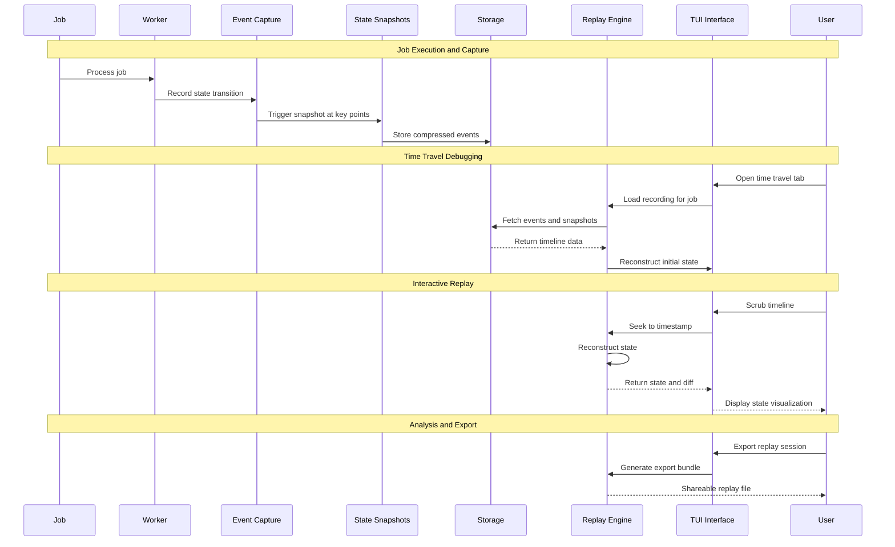

# Time Travel Debugger (F006) - Design Document

**Version:** 1.0
**Date:** 2025-09-14
**Status:** Draft
**Author:** Claude (Worker 6)
**Reviewers:** TBD

## Executive Summary

The Time Travel Debugger revolutionizes debugging by capturing complete job execution history and providing VCR-style playback controls. This system transforms debugging from guesswork into science, enabling developers to replay exact production scenarios, step through state transitions, and understand precisely what led to success or failure.

Built on event sourcing principles with intelligent compression and retention policies, the debugger captures every meaningful state transition without impacting production performance. The TUI provides an intuitive timeline interface with playback controls, diff views, and comparison tools that make complex async debugging as simple as watching a video.

This feature addresses the fundamental challenge of production debugging where issues cannot be reproduced locally. By recording and replaying exact execution states, the debugger eliminates "works on my machine" problems and provides unprecedented visibility into distributed job processing.

### Key Benefits

- **Eliminate Guesswork**: Replay exact production scenarios to understand root causes
- **Zero Reproduction Issues**: Debug problems that can't be replicated locally
- **Complete Visibility**: See every state transition, retry decision, and payload mutation
- **Intuitive Interface**: VCR-style controls make complex debugging accessible
- **Performance Optimized**: <2% overhead on job processing with intelligent sampling
- **Knowledge Transfer**: Share replay sessions for training and collaboration

### Architecture Overview



## System Architecture

### Core Components

#### 1. Event Capture System

The event capture system records every meaningful state transition during job execution without impacting performance.

**Capture Strategy**:
- Automatic capture for all failed jobs (retained 7 days)
- Random 1% sampling of successful jobs
- On-demand recording for specific jobs or queues
- Intelligent triggering based on performance thresholds

```go
type EventCapture struct {
    recorder    EventRecorder
    filters     []CaptureFilter
    compressor  CompressionEngine
    buffer      RingBuffer
    config      CaptureConfig
}

type Event struct {
    Timestamp   time.Time     `json:"timestamp"`
    Type        EventType     `json:"type"`
    JobID       string        `json:"job_id"`
    WorkerID    string        `json:"worker_id"`
    QueueName   string        `json:"queue_name"`
    StateChange StateDiff     `json:"state_change"`
    Context     EventContext  `json:"context"`
    Metadata    EventMeta     `json:"metadata"`
}

type EventType string

const (
    EventEnqueued     EventType = "ENQUEUED"
    EventDequeued     EventType = "DEQUEUED"
    EventProcessing   EventType = "PROCESSING"
    EventRetrying     EventType = "RETRYING"
    EventFailed       EventType = "FAILED"
    EventCompleted    EventType = "COMPLETED"
    EventDLQ          EventType = "MOVED_TO_DLQ"
    EventScheduled    EventType = "SCHEDULED"
    EventCancelled    EventType = "CANCELLED"
)
```

#### 2. State Snapshotting Engine

At critical decision points, complete system state is captured to enable efficient reconstruction.

```go
type StateSnapshot struct {
    Timestamp    time.Time                  `json:"timestamp"`
    JobState     JobState                   `json:"job_state"`
    WorkerState  WorkerState                `json:"worker_state"`
    QueueState   QueueState                 `json:"queue_state"`
    RedisKeys    map[string]interface{}     `json:"redis_keys"`
    Context      map[string]interface{}     `json:"context"`
    ChecksumSHA  string                     `json:"checksum"`
}

type JobState struct {
    ID           string                     `json:"id"`
    Payload      map[string]interface{}     `json:"payload"`
    Status       JobStatus                  `json:"status"`
    RetryCount   int                        `json:"retry_count"`
    Priority     int                        `json:"priority"`
    Metadata     map[string]string          `json:"metadata"`
    ProcessingTime time.Duration            `json:"processing_time"`
}
```

#### 3. Replay Engine

The replay engine reconstructs exact execution state from captured events, enabling precise analysis.

```go
type ReplayEngine struct {
    events       []Event
    snapshots    map[time.Time]StateSnapshot
    position     int
    speed        float64
    filters      []EventFilter
    breakpoints  []Breakpoint
    currentState *SystemState
}

func (r *ReplayEngine) SeekTo(timestamp time.Time) error {
    position := r.findEventPosition(timestamp)
    state, err := r.reconstructState(position)
    if err != nil {
        return err
    }

    r.position = position
    r.currentState = state
    return nil
}

func (r *ReplayEngine) StepForward() (*Event, error) {
    if r.position >= len(r.events)-1 {
        return nil, ErrEndOfTimeline
    }

    r.position++
    event := r.events[r.position]

    // Apply event to current state
    if err := r.currentState.ApplyEvent(event); err != nil {
        return nil, err
    }

    // Check breakpoints
    if r.shouldBreak(event) {
        return &event, ErrBreakpointHit
    }

    return &event, nil
}
```

#### 4. Timeline Interface

The TUI provides an intuitive interface for navigating through execution history.

**Three-Panel Layout**:
- **Event Timeline** (25% width): Chronological list of state transitions
- **State Viewer** (35% width): Complete state at selected timeline position
- **Diff Panel** (40% width): Shows what changed from previous state

**Playback Controls**:
- Timeline scrubber with visual activity representation
- Transport controls (play, pause, step, seek)
- Speed control (0.25x to 10x playback speed)
- Jump controls (next error, next retry, custom bookmarks)

### Data Flow Architecture



### Storage Architecture

#### Event Storage Strategy

**Redis Streams for Hot Data**:
- Recent events (last 24 hours) stored in Redis Streams
- Enables real-time access and efficient range queries
- Automatic expiration and memory management

**Compressed Archive for Cold Data**:
- Events older than 24 hours compressed with zstd
- Stored in local filesystem or cloud storage
- 8:1 average compression ratio reduces storage costs

```go
type StorageManager struct {
    redisClient   redis.Client
    archiveStore  ArchiveStore
    compressor    CompressionEngine
    retentionMgr  RetentionManager
}

type ArchiveStore interface {
    Store(key string, data []byte) error
    Retrieve(key string) ([]byte, error)
    Delete(key string) error
    List(prefix string) ([]string, error)
}
```

#### Retention Policies

**Time-Based Retention**:
- Failed jobs: 7 days in hot storage, 90 days in archive
- Successful jobs: 24 hours in hot storage, 30 days in archive
- Critical jobs: 30 days in hot storage, 1 year in archive

**Importance-Based Retention**:
- Jobs with high business impact retained longer
- Configurable importance scoring based on queue, user, or custom tags
- Manual preservation for training and reference cases

**Storage Optimization**:
- Delta compression between similar job executions
- Deduplication of identical payloads and states
- Automatic pruning based on storage pressure and access patterns

### Performance Requirements

#### Latency Requirements

- **Event Capture**: <1ms per event (async processing)
- **Timeline Seeking**: <100ms for any position in recording
- **State Reconstruction**: <50ms for typical job execution
- **UI Responsiveness**: <16ms for smooth 60fps interface updates

#### Throughput Requirements

- **Event Capture**: 10,000+ events/second sustained
- **Concurrent Recordings**: 1,000+ simultaneous job recordings
- **Replay Sessions**: 100+ concurrent users replaying different jobs
- **Storage Operations**: 1,000+ archive operations/second

#### Resource Requirements

- **Memory Overhead**: <100MB for capture system, <50MB per active replay
- **CPU Overhead**: <2% of system CPU for event capture and compression
- **Storage Growth**: ~1MB per job execution (compressed)
- **Network Bandwidth**: Minimal - primarily local storage operations

#### Scalability Targets

- **Job Volume**: Handle 1M+ job executions per day
- **Recording Retention**: Store 30 days of complete execution history
- **Concurrent Users**: Support 500+ engineers using time travel debugging
- **Query Performance**: Sub-second search across 30 days of recordings

## Testing Strategy

### Unit Testing

- Event capture serialization and compression
- Timeline reconstruction algorithms
- State diff calculation and application
- Breakpoint and filter logic
- Storage manager operations

### Integration Testing

- End-to-end job execution recording
- Timeline seeking and playback accuracy
- Multi-user concurrent replay sessions
- Storage retention and archival processes
- Performance impact on job processing

### Performance Testing

- Event capture overhead measurement
- Timeline reconstruction benchmarks
- Memory usage under load testing
- Storage compression ratio validation
- UI responsiveness with large recordings

### Security Testing

- Data sanitization and PII protection
- Access control and audit logging
- Export restrictions and data leakage prevention
- Recording tampering detection
- Malicious payload handling

## Security Threat Model

### Threat Landscape Analysis

The Time Travel Debugger captures and stores comprehensive execution data, creating significant security considerations around data protection, access control, and system integrity. This threat model analyzes potential security risks using the STRIDE methodology and provides specific mitigations for each identified threat.

#### Attack Surface Components

1. **Event Capture Engine**: Real-time recording of job execution data
2. **Storage Layer**: Persistent storage of sensitive execution history
3. **Replay Engine**: State reconstruction and timeline navigation
4. **Export System**: Sharing and download capabilities for recordings
5. **Access Control**: Authentication and authorization mechanisms
6. **TUI Interface**: User interaction with sensitive debugging data

### Threat Analysis Matrix

#### T1: Sensitive Data Exposure

**Description**: Recorded job payloads contain sensitive information (PII, credentials, financial data) that could be exposed through recordings.

**STRIDE Categories**: Information Disclosure

**Attack Scenarios**:
- Developer exports recording containing customer PII for debugging
- Malicious insider accesses recordings with payment information
- Misconfigured access controls expose sensitive job data

**Mitigations**:
- **Automatic Data Redaction**: AI-powered detection and masking of sensitive patterns
- **Field-Level Controls**: Configure specific fields to exclude from recording
- **Payload Sampling**: Store only sanitized excerpts for sensitive queues
- **Classification Tags**: Mark recordings by sensitivity level with appropriate controls

**Risk Level**: High
**Likelihood**: High
**Impact**: Critical

#### T2: Unauthorized Access to Debug Sessions

**Description**: Attackers gain access to time travel debug sessions containing proprietary business logic and sensitive operational data.

**STRIDE Categories**: Elevation of Privilege, Information Disclosure

**Attack Scenarios**:
- Credential compromise allows access to debug recordings
- Session hijacking during active replay sessions
- Privilege escalation to access restricted recordings

**Mitigations**:
- **Multi-Factor Authentication**: Require MFA for accessing sensitive recordings
- **Session Management**: Automatic session timeout and secure session tokens
- **Role-Based Access**: Granular permissions based on user roles and data sensitivity
- **Audit Logging**: Comprehensive tracking of all access and export activities

**Risk Level**: High
**Likelihood**: Medium
**Impact**: High

#### T3: Recording Tampering and Integrity Loss

**Description**: Malicious actors modify or corrupt recorded execution data to hide evidence or manipulate analysis results.

**STRIDE Categories**: Tampering, Repudiation

**Attack Scenarios**:
- Insider modifies recordings to hide malicious activity
- Storage system compromise leads to data corruption
- Replay engine manipulation shows false execution history

**Mitigations**:
- **Cryptographic Signatures**: SHA-256 checksums for all events and snapshots
- **Immutable Storage**: Write-once storage with integrity verification
- **Chain of Custody**: Tamper-evident logging of all data modifications
- **Backup Validation**: Regular integrity checks against backup copies

**Risk Level**: Medium
**Likelihood**: Low
**Impact**: High

#### T4: Data Exfiltration Through Export Features

**Description**: Attackers use legitimate export functionality to exfiltrate large volumes of sensitive debugging data.

**STRIDE Categories**: Information Disclosure

**Attack Scenarios**:
- Bulk export of recordings containing sensitive business data
- Automated scripts harvest debugging information
- Insider threat using export features for competitive intelligence

**Mitigations**:
- **Export Quotas**: Rate limiting and volume restrictions per user
- **Approval Workflows**: Required approvals for sensitive data exports
- **Watermarking**: Embed user identification in exported data
- **Export Monitoring**: Alerting on suspicious export patterns

**Risk Level**: Medium
**Likelihood**: Medium
**Impact**: Medium

#### T5: Replay Session Resource Exhaustion

**Description**: Attackers consume excessive system resources through replay sessions to cause denial of service.

**STRIDE Categories**: Denial of Service

**Attack Scenarios**:
- Multiple concurrent replay sessions exhaust memory
- Complex state reconstruction operations consume CPU
- Large recording exports overwhelm storage bandwidth

**Mitigations**:
- **Resource Quotas**: Per-user limits on concurrent sessions and memory usage
- **Circuit Breakers**: Automatic session termination when limits exceeded
- **Priority Queuing**: Critical users get priority during resource contention
- **Monitoring**: Real-time resource usage tracking with automated alerts

**Risk Level**: Medium
**Likelihood**: High
**Impact**: Low

#### T6: Storage Infrastructure Compromise

**Description**: Attackers compromise the underlying storage infrastructure to access or manipulate recorded execution data.

**STRIDE Categories**: Tampering, Information Disclosure, Elevation of Privilege

**Attack Scenarios**:
- Redis compromise exposes hot storage data
- Cloud storage misconfiguration allows unauthorized access
- Storage encryption keys compromised

**Mitigations**:
- **Encryption at Rest**: AES-256 encryption for all stored recordings
- **Key Management**: Secure key rotation and hardware security modules
- **Network Segmentation**: Isolated storage networks with minimal access
- **Storage Auditing**: Comprehensive logging of all storage operations

**Risk Level**: High
**Likelihood**: Low
**Impact**: Critical

#### T7: Injection Attacks Through Event Data

**Description**: Malicious job payloads contain injection attacks that compromise the time travel debugging system.

**STRIDE Categories**: Tampering, Elevation of Privilege

**Attack Scenarios**:
- SQL injection in job metadata compromises storage queries
- XSS in payload data affects TUI rendering
- Code injection through serialized objects in recordings

**Mitigations**:
- **Input Sanitization**: Strict validation and encoding of all captured data
- **Parameterized Queries**: Prevent SQL injection in storage operations
- **Safe Serialization**: Use safe serialization formats for complex objects
- **Sandboxed Rendering**: Isolate TUI rendering from untrusted data

**Risk Level**: Medium
**Likelihood**: Medium
**Impact**: Medium

### Security Controls Framework

#### Preventive Controls

**Authentication and Authorization**:
- SAML/OIDC integration with enterprise identity providers
- Role-based access control with principle of least privilege
- Multi-factor authentication for sensitive recording access
- API key management for programmatic access

**Data Protection**:
- Automatic PII detection and redaction using ML models
- Field-level encryption for highly sensitive data
- Data loss prevention (DLP) integration
- Geographic data residency controls

**Input Validation**:
- Comprehensive validation of all captured event data
- Sanitization of user inputs in TUI and API
- Safe deserialization practices for complex objects
- Content security policies for web-based interfaces

#### Detective Controls

**Security Monitoring**:
- Real-time monitoring of access patterns and anomalies
- Automated alerting on suspicious export activities
- User behavior analytics for insider threat detection
- Integration with SIEM systems for correlation

**Audit and Compliance**:
- Immutable audit logs for all system activities
- Compliance reporting for regulatory requirements (GDPR, HIPAA)
- Regular access reviews and permission audits
- Data retention compliance tracking

**Integrity Monitoring**:
- Continuous integrity verification of stored recordings
- File integrity monitoring for system components
- Cryptographic verification of data chains
- Automated corruption detection and recovery

#### Responsive Controls

**Incident Response**:
- Automated data breach detection and notification
- Emergency access revocation capabilities
- Forensic data collection for security incidents
- Coordinated response procedures with security team

**Data Recovery**:
- Secure backup and restore procedures
- Point-in-time recovery for corrupted recordings
- Disaster recovery with geographic redundancy
- Business continuity planning for extended outages

### Privacy and Compliance

#### Data Protection Regulations

**GDPR Compliance**:
- Right to access: Users can request their recorded data
- Right to erasure: Ability to delete recordings containing personal data
- Data minimization: Capture only necessary debugging information
- Purpose limitation: Use recordings only for debugging and analysis

**Industry Standards**:
- SOC 2 Type II compliance for data handling procedures
- ISO 27001 alignment for information security management
- PCI DSS compliance for systems handling payment data
- HIPAA compliance for healthcare-related debugging data

#### Data Classification and Handling

**Sensitivity Levels**:
- **Public**: Non-sensitive debugging data, anonymized metrics
- **Internal**: Business logic and operational data
- **Confidential**: Customer data and proprietary algorithms
- **Restricted**: Payment information, authentication credentials

**Handling Requirements**:
- Automatic classification based on payload content analysis
- Differential retention policies based on sensitivity level
- Enhanced access controls for higher sensitivity classifications
- Specialized handling for regulated data types

### Implementation Roadmap

#### Phase 1: Foundation Security (Weeks 1-2)
- Implement basic data redaction and sanitization
- Deploy encryption at rest with secure key management
- Create role-based access control framework
- Establish audit logging infrastructure

#### Phase 2: Advanced Protections (Weeks 3-4)
- Deploy ML-based PII detection and classification
- Implement export controls and approval workflows
- Add integrity monitoring and tamper detection
- Create security monitoring and alerting systems

#### Phase 3: Compliance and Integration (Weeks 5-6)
- Complete GDPR and regulatory compliance features
- Integrate with enterprise security infrastructure
- Implement advanced threat detection capabilities
- Conduct security assessment and penetration testing

### Security Metrics and Monitoring

**Security Posture Indicators**:
- Data exposure incidents per month (target: 0)
- Unauthorized access attempts detected and blocked
- Time to detect security violations (target: <1 minute)
- Compliance audit findings (target: 0 critical findings)

**Operational Security Metrics**:
- Percentage of recordings with sensitive data properly redacted
- Average time for security incident response
- User access review completion rate
- Security training completion for users with debug access

## Deployment Plan

### Phase 1: Core Recording Infrastructure (Weeks 1-2)
- Implement event capture system with Redis Streams storage
- Create basic state snapshotting with compression
- Build fundamental retention and archival mechanisms
- Deploy monitoring and alerting for capture performance

### Phase 2: Replay Engine Development (Weeks 3-4)
- Implement timeline reconstruction algorithms
- Create state rebuilding and diff calculation
- Build breakpoint and filtering systems
- Add export and sharing capabilities

### Phase 3: TUI Integration (Weeks 5-6)
- Design and implement three-panel timeline interface
- Create playback controls and navigation
- Add diff visualization and comparison tools
- Integrate with existing TUI framework and navigation

### Phase 4: Advanced Features (Weeks 7-8)
- Implement multi-job comparison capabilities
- Add pattern detection and analysis tools
- Create collaborative features and annotation system
- Conduct performance optimization and security review

---

This design document establishes the foundation for implementing the Time Travel Debugger as a revolutionary debugging tool that transforms how developers understand and fix distributed job processing issues. The focus on performance, usability, and comprehensive event capture ensures that the system provides unprecedented debugging capabilities while maintaining production system stability.