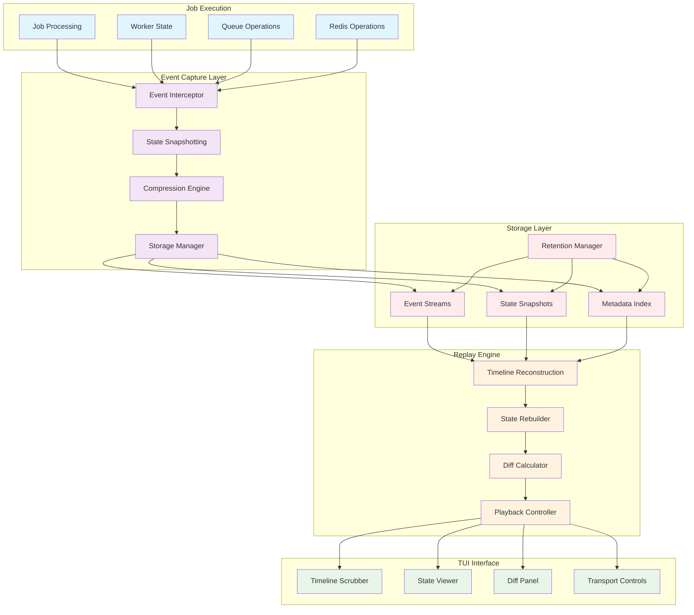
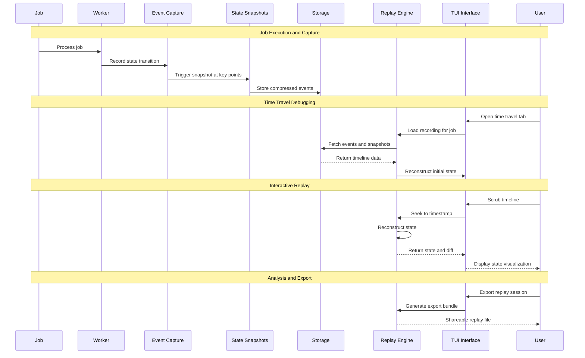

# Time Travel Debugger (F006) - Design Document

**Version:** 1.0
**Date:** 2025-09-14
**Status:** Draft
**Author:** Claude (Worker 6)
**Reviewers:** TBD

## Executive Summary

The Time Travel Debugger revolutionizes debugging by capturing complete job execution history and providing VCR-style playback controls. This system transforms debugging from guesswork into science, enabling developers to replay exact production scenarios, step through state transitions, and understand precisely what led to success or failure.

Built on event sourcing principles with intelligent compression and retention policies, the debugger captures every meaningful state transition without impacting production performance. The TUI provides an intuitive timeline interface with playback controls, diff views, and comparison tools that make complex async debugging as simple as watching a video.

This feature addresses the fundamental challenge of production debugging where issues cannot be reproduced locally. By recording and replaying exact execution states, the debugger eliminates "works on my machine" problems and provides unprecedented visibility into distributed job processing.

### Key Benefits

- **Eliminate Guesswork**: Replay exact production scenarios to understand root causes
- **Zero Reproduction Issues**: Debug problems that can't be replicated locally
- **Complete Visibility**: See every state transition, retry decision, and payload mutation
- **Intuitive Interface**: VCR-style controls make complex debugging accessible
- **Performance Optimized**: <2% overhead on job processing with intelligent sampling
- **Knowledge Transfer**: Share replay sessions for training and collaboration

### Architecture Overview



## System Architecture

### Core Components

#### 1. Event Capture System

The event capture system records every meaningful state transition during job execution without impacting performance.

**Capture Strategy**:
- Automatic capture for all failed jobs (retained 7 days)
- Random 1% sampling of successful jobs
- On-demand recording for specific jobs or queues
- Intelligent triggering based on performance thresholds

```go
type EventCapture struct {
    recorder    EventRecorder
    filters     []CaptureFilter
    compressor  CompressionEngine
    buffer      RingBuffer
    config      CaptureConfig
}

type Event struct {
    Timestamp   time.Time     `json:"timestamp"`
    Type        EventType     `json:"type"`
    JobID       string        `json:"job_id"`
    WorkerID    string        `json:"worker_id"`
    QueueName   string        `json:"queue_name"`
    StateChange StateDiff     `json:"state_change"`
    Context     EventContext  `json:"context"`
    Metadata    EventMeta     `json:"metadata"`
}

type EventType string

const (
    EventEnqueued     EventType = "ENQUEUED"
    EventDequeued     EventType = "DEQUEUED"
    EventProcessing   EventType = "PROCESSING"
    EventRetrying     EventType = "RETRYING"
    EventFailed       EventType = "FAILED"
    EventCompleted    EventType = "COMPLETED"
    EventDLQ          EventType = "MOVED_TO_DLQ"
    EventScheduled    EventType = "SCHEDULED"
    EventCancelled    EventType = "CANCELLED"
)
```

#### 2. State Snapshotting Engine

At critical decision points, complete system state is captured to enable efficient reconstruction.

```go
type StateSnapshot struct {
    Timestamp    time.Time                  `json:"timestamp"`
    JobState     JobState                   `json:"job_state"`
    WorkerState  WorkerState                `json:"worker_state"`
    QueueState   QueueState                 `json:"queue_state"`
    RedisKeys    map[string]interface{}     `json:"redis_keys"`
    Context      map[string]interface{}     `json:"context"`
    ChecksumSHA  string                     `json:"checksum"`
}

type JobState struct {
    ID           string                     `json:"id"`
    Payload      map[string]interface{}     `json:"payload"`
    Status       JobStatus                  `json:"status"`
    RetryCount   int                        `json:"retry_count"`
    Priority     int                        `json:"priority"`
    Metadata     map[string]string          `json:"metadata"`
    ProcessingTime time.Duration            `json:"processing_time"`
}
```

#### 3. Replay Engine

The replay engine reconstructs exact execution state from captured events, enabling precise analysis.

```go
type ReplayEngine struct {
    events       []Event
    snapshots    map[time.Time]StateSnapshot
    position     int
    speed        float64
    filters      []EventFilter
    breakpoints  []Breakpoint
    currentState *SystemState
}

func (r *ReplayEngine) SeekTo(timestamp time.Time) error {
    position := r.findEventPosition(timestamp)
    state, err := r.reconstructState(position)
    if err != nil {
        return err
    }

    r.position = position
    r.currentState = state
    return nil
}

func (r *ReplayEngine) StepForward() (*Event, error) {
    if r.position >= len(r.events)-1 {
        return nil, ErrEndOfTimeline
    }

    r.position++
    event := r.events[r.position]

    // Apply event to current state
    if err := r.currentState.ApplyEvent(event); err != nil {
        return nil, err
    }

    // Check breakpoints
    if r.shouldBreak(event) {
        return &event, ErrBreakpointHit
    }

    return &event, nil
}
```

#### 4. Timeline Interface

The TUI provides an intuitive interface for navigating through execution history.

**Three-Panel Layout**:
- **Event Timeline** (25% width): Chronological list of state transitions
- **State Viewer** (35% width): Complete state at selected timeline position
- **Diff Panel** (40% width): Shows what changed from previous state

**Playback Controls**:
- Timeline scrubber with visual activity representation
- Transport controls (play, pause, step, seek)
- Speed control (0.25x to 10x playback speed)
- Jump controls (next error, next retry, custom bookmarks)

### Data Flow Architecture



### Storage Architecture

#### Event Storage Strategy

**Redis Streams for Hot Data**:
- Recent events (last 24 hours) stored in Redis Streams
- Enables real-time access and efficient range queries
- Automatic expiration and memory management

**Compressed Archive for Cold Data**:
- Events older than 24 hours compressed with zstd
- Stored in local filesystem or cloud storage
- 8:1 average compression ratio reduces storage costs

```go
type StorageManager struct {
    redisClient   redis.Client
    archiveStore  ArchiveStore
    compressor    CompressionEngine
    retentionMgr  RetentionManager
}

type ArchiveStore interface {
    Store(key string, data []byte) error
    Retrieve(key string) ([]byte, error)
    Delete(key string) error
    List(prefix string) ([]string, error)
}
```

#### Retention Policies

**Time-Based Retention**:
- Failed jobs: 7 days in hot storage, 90 days in archive
- Successful jobs: 24 hours in hot storage, 30 days in archive
- Critical jobs: 30 days in hot storage, 1 year in archive

**Importance-Based Retention**:
- Jobs with high business impact retained longer
- Configurable importance scoring based on queue, user, or custom tags
- Manual preservation for training and reference cases

**Storage Optimization**:
- Delta compression between similar job executions
- Deduplication of identical payloads and states
- Automatic pruning based on storage pressure and access patterns

### Performance Requirements

#### Latency Requirements

- **Event Capture**: <1ms per event (async processing)
- **Timeline Seeking**: <100ms for any position in recording
- **State Reconstruction**: <50ms for typical job execution
- **UI Responsiveness**: <16ms for smooth 60fps interface updates

#### Throughput Requirements

- **Event Capture**: 10,000+ events/second sustained
- **Concurrent Recordings**: 1,000+ simultaneous job recordings
- **Replay Sessions**: 100+ concurrent users replaying different jobs
- **Storage Operations**: 1,000+ archive operations/second

#### Resource Requirements

- **Memory Overhead**: <100MB for capture system, <50MB per active replay
- **CPU Overhead**: <2% of system CPU for event capture and compression
- **Storage Growth**: ~1MB per job execution (compressed)
- **Network Bandwidth**: Minimal - primarily local storage operations

#### Scalability Targets

- **Job Volume**: Handle 1M+ job executions per day
- **Recording Retention**: Store 30 days of complete execution history
- **Concurrent Users**: Support 500+ engineers using time travel debugging
- **Query Performance**: Sub-second search across 30 days of recordings

## Testing Strategy

### Unit Testing

- Event capture serialization and compression
- Timeline reconstruction algorithms
- State diff calculation and application
- Breakpoint and filter logic
- Storage manager operations

### Integration Testing

- End-to-end job execution recording
- Timeline seeking and playback accuracy
- Multi-user concurrent replay sessions
- Storage retention and archival processes
- Performance impact on job processing

### Performance Testing

- Event capture overhead measurement
- Timeline reconstruction benchmarks
- Memory usage under load testing
- Storage compression ratio validation
- UI responsiveness with large recordings

### Security Testing

- Data sanitization and PII protection
- Access control and audit logging
- Export restrictions and data leakage prevention
- Recording tampering detection
- Malicious payload handling

## Deployment Plan

### Phase 1: Core Recording Infrastructure (Weeks 1-2)
- Implement event capture system with Redis Streams storage
- Create basic state snapshotting with compression
- Build fundamental retention and archival mechanisms
- Deploy monitoring and alerting for capture performance

### Phase 2: Replay Engine Development (Weeks 3-4)
- Implement timeline reconstruction algorithms
- Create state rebuilding and diff calculation
- Build breakpoint and filtering systems
- Add export and sharing capabilities

### Phase 3: TUI Integration (Weeks 5-6)
- Design and implement three-panel timeline interface
- Create playback controls and navigation
- Add diff visualization and comparison tools
- Integrate with existing TUI framework and navigation

### Phase 4: Advanced Features (Weeks 7-8)
- Implement multi-job comparison capabilities
- Add pattern detection and analysis tools
- Create collaborative features and annotation system
- Conduct performance optimization and security review

---

This design document establishes the foundation for implementing the Time Travel Debugger as a revolutionary debugging tool that transforms how developers understand and fix distributed job processing issues. The focus on performance, usability, and comprehensive event capture ensures that the system provides unprecedented debugging capabilities while maintaining production system stability.