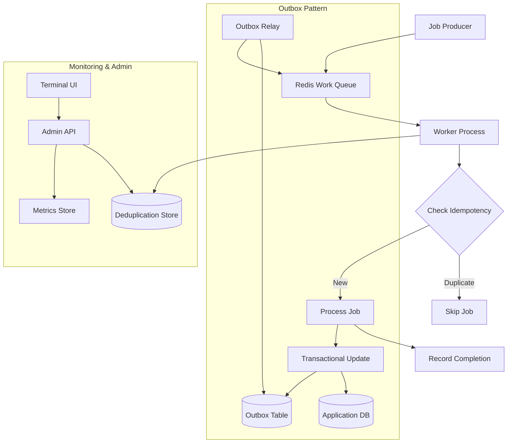
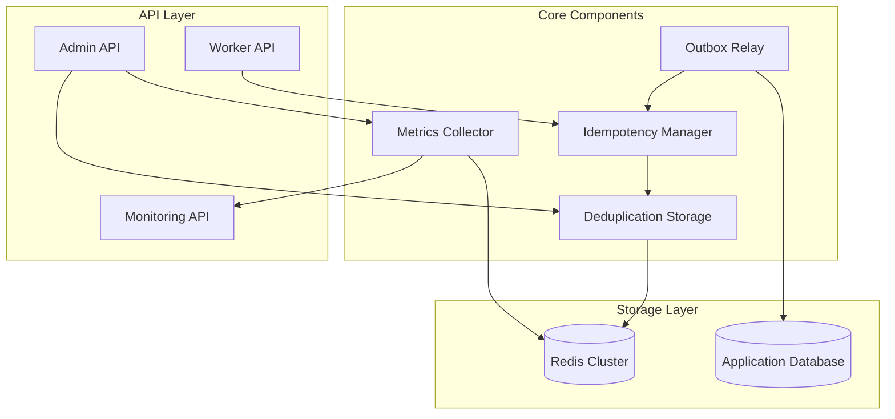
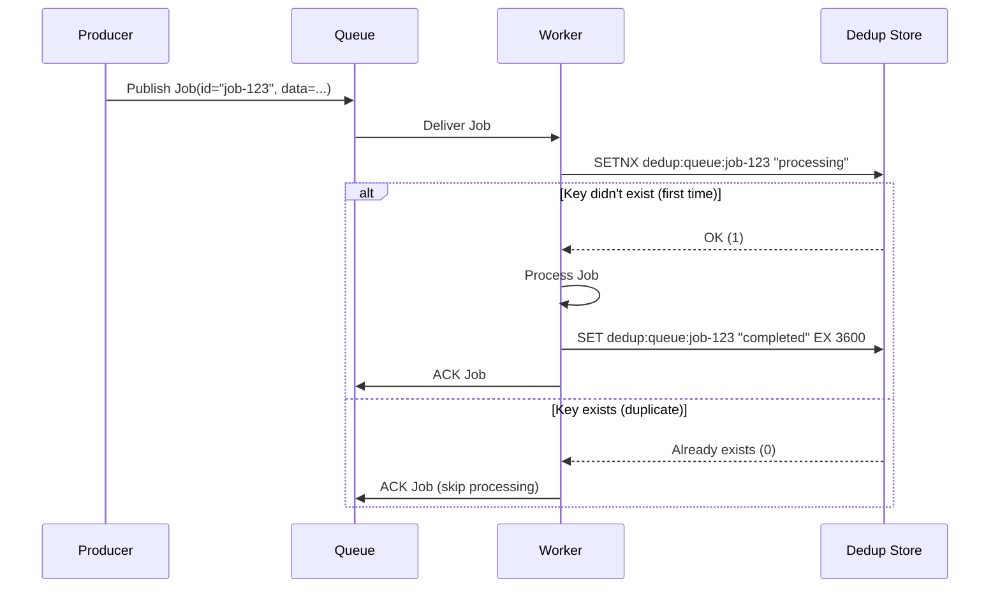
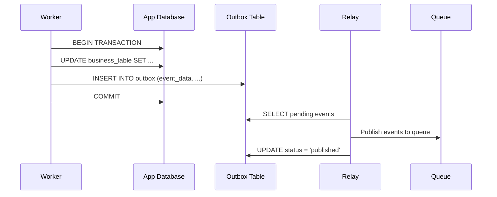

# F007: Exactly Once Patterns Design

## Executive Summary

The Exactly Once Patterns feature (F007) provides infrastructure and utilities for implementing exactly-once processing guarantees in the go-redis-work-queue system. This addresses the common challenge of ensuring job processing idempotency in distributed systems where network failures, worker crashes, or retry mechanisms can cause duplicate job execution.

The solution implements three core patterns:

1. **Idempotency Keys**: Producer-provided unique identifiers that workers use to detect and skip duplicate processing
2. **Deduplication Storage**: Redis-based storage system for tracking processed job IDs with automatic TTL management
3. **Transactional Outbox**: Library support for atomic database updates with event publishing

### Key Benefits

- **Reliability**: Eliminates duplicate processing in failure scenarios
- **Observability**: Provides metrics on deduplication rates and storage utilization
- **Developer Experience**: Simple APIs for common exactly-once patterns
- **Performance**: Redis-optimized storage with configurable TTL bounds

## System Architecture

### High-Level Architecture



### Component Architecture



### Data Flow Patterns

#### Idempotency Check Flow



#### Outbox Pattern Flow



## API Specification

### Worker Integration API

#### Idempotency Helper

```go
type IdempotencyHelper interface {
    // CheckAndLock attempts to acquire an idempotency lock
    CheckAndLock(ctx context.Context, key string, ttl time.Duration) (bool, error)

    // MarkComplete marks a job as successfully completed
    MarkComplete(ctx context.Context, key string, ttl time.Duration) error

    // IsProcessed checks if a job has been processed
    IsProcessed(ctx context.Context, key string) (bool, error)

    // GetStatus returns the processing status of a job
    GetStatus(ctx context.Context, key string) (ProcessingStatus, error)
}

type ProcessingStatus string

const (
    StatusNotSeen    ProcessingStatus = "not_seen"
    StatusProcessing ProcessingStatus = "processing"
    StatusCompleted  ProcessingStatus = "completed"
    StatusFailed     ProcessingStatus = "failed"
)
```

#### Outbox Helper

```go
type OutboxHelper interface {
    // WithTransaction executes business logic and outbox writes in a transaction
    WithTransaction(ctx context.Context, fn func(tx OutboxTx) error) error
}

type OutboxTx interface {
    // PublishEvent adds an event to the outbox for later relay
    PublishEvent(event OutboxEvent) error

    // GetDB returns the underlying database transaction
    GetDB() *sql.Tx
}

type OutboxEvent struct {
    ID          string            `json:"id"`
    EventType   string            `json:"event_type"`
    AggregateID string            `json:"aggregate_id"`
    Data        interface{}       `json:"data"`
    Metadata    map[string]string `json:"metadata"`
    CreatedAt   time.Time         `json:"created_at"`
}
```

### Admin API Endpoints

#### Deduplication Statistics

```http
GET /api/v1/dedup/stats?queue={queue_name}
```

Response:
```json
{
  "queue_name": "default",
  "total_keys": 15420,
  "hit_rate_24h": 0.023,
  "duplicate_jobs_blocked": 354,
  "storage_size_mb": 12.4,
  "ttl_distribution": {
    "0-1h": 5230,
    "1-6h": 4120,
    "6-24h": 6070
  }
}
```

#### Key Management

```http
DELETE /api/v1/dedup/keys/{key}
GET /api/v1/dedup/keys/{key}/status
```

#### Outbox Status

```http
GET /api/v1/outbox/pending
GET /api/v1/outbox/stats
```

## Data Models

### Deduplication Key Structure

Redis keys follow the pattern: `dedup:{queue}:{job_id}`

Values stored as Redis strings with status and metadata:

```json
{
  "status": "completed",
  "processed_at": "2025-09-14T19:41:47Z",
  "worker_id": "worker-001",
  "attempt_count": 1,
  "metadata": {
    "correlation_id": "req-456",
    "tenant_id": "tenant-123"
  }
}
```

### Outbox Schema

```sql
CREATE TABLE outbox_events (
    id UUID PRIMARY KEY DEFAULT gen_random_uuid(),
    event_type VARCHAR(255) NOT NULL,
    aggregate_id VARCHAR(255) NOT NULL,
    data JSONB NOT NULL,
    metadata JSONB DEFAULT '{}',
    status VARCHAR(50) DEFAULT 'pending',
    created_at TIMESTAMP DEFAULT CURRENT_TIMESTAMP,
    published_at TIMESTAMP NULL,
    retry_count INTEGER DEFAULT 0,
    last_error TEXT NULL,

    INDEX idx_outbox_status_created (status, created_at),
    INDEX idx_outbox_aggregate (aggregate_id, created_at)
);
```

### Metrics Schema

```json
{
  "namespace": "go_redis_work_queue",
  "metrics": [
    {
      "name": "idempotency_checks_total",
      "type": "counter",
      "labels": ["queue", "result"],
      "description": "Total idempotency checks performed"
    },
    {
      "name": "dedup_storage_size_bytes",
      "type": "gauge",
      "labels": ["queue"],
      "description": "Size of deduplication storage in bytes"
    },
    {
      "name": "outbox_events_pending",
      "type": "gauge",
      "description": "Number of pending outbox events"
    },
    {
      "name": "duplicate_jobs_blocked_total",
      "type": "counter",
      "labels": ["queue"],
      "description": "Number of duplicate jobs blocked"
    }
  ]
}
```

## Security Model

### Threat Analysis

1. **Deduplication Key Poisoning**
   - *Threat*: Malicious actors pre-populate dedup keys to prevent legitimate job processing
   - *Mitigation*: Authenticated job submission, key namespace isolation by tenant/queue
   - *Risk Level*: Medium

2. **Outbox Event Tampering**
   - *Threat*: Unauthorized modification of outbox events leading to data corruption
   - *Mitigation*: Database-level permissions, event signing/validation
   - *Risk Level*: High

3. **Storage Exhaustion**
   - *Threat*: Unbounded growth of deduplication storage causing Redis OOM
   - *Mitigation*: TTL enforcement, storage quotas per tenant, monitoring alerts
   - *Risk Level*: Medium

4. **Replay Attacks**
   - *Threat*: Replaying old idempotency tokens to trigger unexpected behavior
   - *Mitigation*: Time-bounded tokens, secure token generation
   - *Risk Level*: Low

### Security Controls

#### Access Control

```go
type SecurityConfig struct {
    // Require authentication for admin APIs
    RequireAuth bool `yaml:"require_auth"`

    // JWT signing key for API tokens
    JWTSigningKey string `yaml:"jwt_signing_key"`

    // Per-tenant storage quotas (MB)
    StorageQuotaMB map[string]int `yaml:"storage_quota_mb"`

    // Maximum TTL for dedup keys
    MaxTTL time.Duration `yaml:"max_ttl"`
}
```

#### Key Isolation

```go
func buildDedupKey(queue, tenant, jobID string) string {
    // Ensures tenant isolation
    return fmt.Sprintf("dedup:%s:%s:%s", queue, tenant, jobID)
}
```

## Performance Requirements

### Latency Requirements

- Idempotency check: < 5ms p99
- Dedup key write: < 10ms p99
- Outbox transaction: < 50ms p99
- Admin API responses: < 100ms p95

### Throughput Requirements

- Idempotency checks: 10,000 ops/sec per Redis instance
- Outbox event ingestion: 1,000 events/sec
- Dedup key cleanup: 100,000 expired keys/hour

### Storage Requirements

- Dedup storage: 1MB per 1,000 active keys (estimated)
- Outbox retention: 7 days of events (configurable)
- Metrics retention: 30 days

### Scalability Targets

- Support 1M+ active dedup keys per queue
- Scale to 100+ worker instances
- Handle 10+ tenant isolations per instance

### Performance Monitoring

```yaml
performance_slos:
  idempotency_check_latency_p99: 5ms
  dedup_key_write_latency_p99: 10ms
  outbox_processing_latency_p95: 50ms
  storage_utilization_threshold: 80%
  hit_rate_target: 95%
```

## Testing Strategy

### Unit Testing

#### Idempotency Helper Tests
```go
func TestIdempotencyHelper_CheckAndLock(t *testing.T) {
    tests := []struct {
        name     string
        key      string
        ttl      time.Duration
        existing bool
        want     bool
        wantErr  bool
    }{
        {"new key", "job-123", time.Hour, false, true, false},
        {"existing key", "job-456", time.Hour, true, false, false},
        {"expired key", "job-789", time.Hour, false, true, false},
    }
    // Test implementation...
}
```

#### Outbox Helper Tests
```go
func TestOutboxHelper_WithTransaction(t *testing.T) {
    // Test successful transaction commit
    // Test rollback on business logic failure
    // Test rollback on outbox write failure
    // Test concurrent transaction handling
}
```

### Integration Testing

#### Redis Integration
- Test connection failure scenarios
- Test key expiration behavior
- Test memory pressure handling
- Test cluster failover scenarios

#### Database Integration
- Test transaction isolation levels
- Test deadlock handling
- Test connection pool exhaustion
- Test schema migration compatibility

### Load Testing

#### Performance Test Scenarios
```yaml
load_tests:
  - name: "idempotency_baseline"
    duration: "5m"
    rate: "1000rps"
    payload: "standard_job"

  - name: "duplicate_detection"
    duration: "5m"
    rate: "500rps"
    duplicate_ratio: 0.20

  - name: "outbox_processing"
    duration: "10m"
    rate: "100rps"
    events_per_job: 3
```

#### Stress Test Scenarios
- Redis memory exhaustion
- Database connection saturation
- High duplicate job rates (>50%)
- TTL expiration storms

### End-to-End Testing

#### Scenario: Complete Job Lifecycle
1. Producer submits job with idempotency key
2. Worker processes job successfully
3. Duplicate job submission is blocked
4. Outbox events are published
5. Metrics are updated correctly

#### Scenario: Failure Recovery
1. Worker crashes during job processing
2. Job is redelivered to another worker
3. Idempotency check prevents duplicate processing
4. Outbox events maintain consistency

## Deployment Plan

### Rollout Strategy

#### Phase 1: Infrastructure Setup (Week 1)
- Deploy Redis cluster for deduplication storage
- Set up monitoring and alerting
- Deploy admin API endpoints

#### Phase 2: Core Library (Week 2-3)
- Release idempotency helper library
- Add basic deduplication support to workers
- Enable metrics collection

#### Phase 3: Outbox Pattern (Week 4-5)
- Deploy outbox helper library
- Set up outbox relay service
- Migrate critical workflows to outbox pattern

#### Phase 4: Full Rollout (Week 6)
- Enable exactly-once patterns for all queues
- Complete monitoring dashboard
- Conduct performance optimization

### Configuration Management

```yaml
exactly_once_config:
  enabled: true

  deduplication:
    redis_cluster: "redis://redis-cluster:6379"
    default_ttl: "1h"
    max_ttl: "24h"
    key_prefix: "dedup"

  outbox:
    enabled: true
    table_name: "outbox_events"
    batch_size: 100
    poll_interval: "5s"
    max_retries: 3

  monitoring:
    metrics_enabled: true
    prometheus_endpoint: ":9090"
    log_level: "info"

  security:
    require_auth: true
    storage_quota_mb: 100
```

### Monitoring and Alerting

#### Key Metrics to Monitor
- Deduplication hit rates by queue
- Storage utilization trends
- Processing latency distributions
- Error rates and failure modes

#### Alert Conditions
```yaml
alerts:
  - name: "high_duplicate_rate"
    condition: "duplicate_rate > 0.1"
    severity: "warning"

  - name: "storage_quota_exceeded"
    condition: "storage_utilization > 0.8"
    severity: "critical"

  - name: "outbox_processing_lag"
    condition: "outbox_lag > 5m"
    severity: "warning"
```

### Migration Strategy

#### Backward Compatibility
- All APIs maintain backward compatibility during transition
- Feature flags control exactly-once behavior per queue
- Gradual migration path for existing jobs

#### Zero-Downtime Migration
1. Deploy infrastructure components
2. Enable feature flags for new jobs only
3. Migrate existing jobs during low-traffic periods
4. Monitor and validate behavior
5. Complete rollout when confidence is high

---

*This design document serves as the architectural foundation for implementing exactly-once processing patterns in the go-redis-work-queue system. Implementation should proceed in phases with careful attention to performance, security, and operational requirements.*