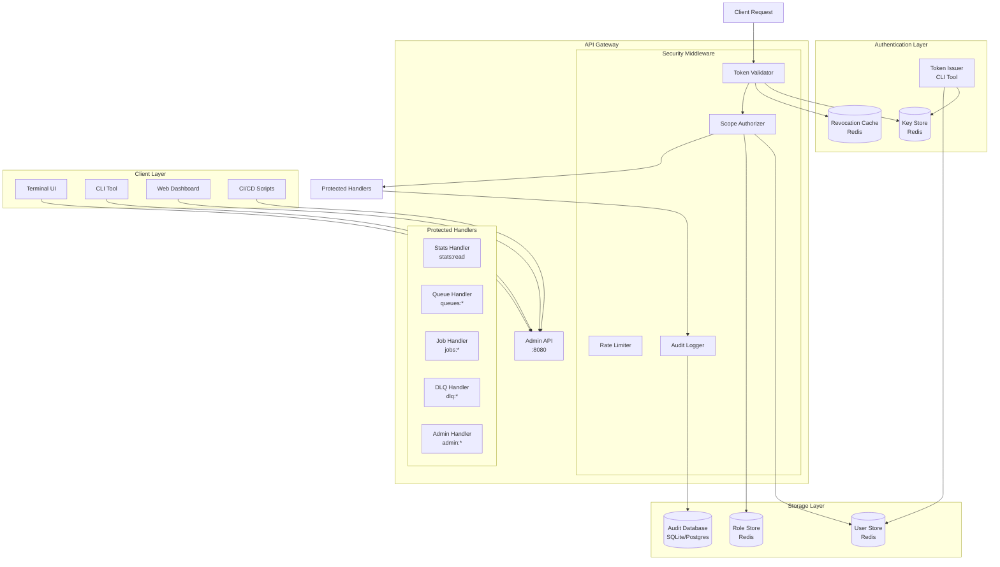
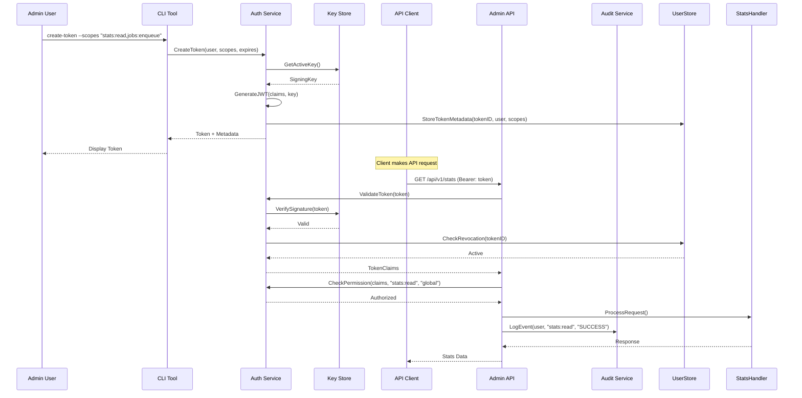
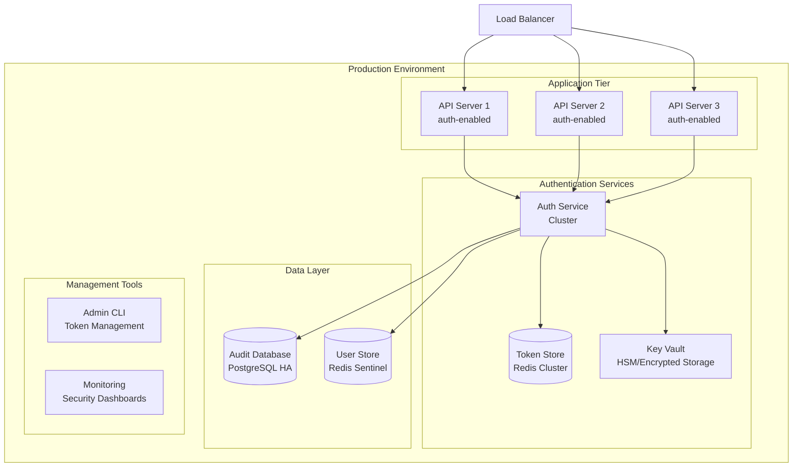

# F008: RBAC and Tokens Design

## Executive Summary

This document defines the architecture and design for implementing Role-Based Access Control (RBAC) and Token-based Authentication for the go-redis-work-queue system. The solution transforms the Admin API from a development tool into enterprise-grade infrastructure by adding fine-grained authorization, comprehensive audit logging, and secure token management.

The RBAC system implements industry-standard security patterns: JWT/PASETO tokens with hierarchical roles, scope-based permissions, comprehensive audit trails, and intuitive management interfaces. It enables safe multi-team access while maintaining the principle of least privilege throughout.

### Key Benefits

- **Security**: Deny-by-default authorization with fine-grained scopes and resource-level constraints
- **Auditability**: Comprehensive trail of all administrative actions for compliance requirements
- **Multi-tenancy**: Resource isolation enables safe multi-team deployments
- **Enterprise Ready**: Token rotation, revocation, and management suitable for production environments
- **Developer Experience**: Clear permission errors and identity panels in TUI/CLI interfaces

### Scope

This feature implements:
- Token-based authentication with JWT/PASETO support
- Hierarchical role system with additive permissions
- Fine-grained scope-based authorization
- Resource-level access constraints (per-queue, per-cluster)
- Comprehensive audit logging with query interface
- Key rotation and revocation management
- TUI/CLI integration for token management

## System Architecture

### High-Level Architecture



### Component Architecture

```mermaid
graph TB
    subgraph "Authentication Service"
        AuthService[Authentication Service]
        TokenManager[Token Manager]
        KeyManager[Key Manager]
        UserManager[User Manager]
    end

    subgraph "Authorization Service"
        AuthzService[Authorization Service]
        RoleManager[Role Manager]
        PermissionChecker[Permission Checker]
        ResourceMatcher[Resource Matcher]
    end

    subgraph "Audit Service"
        AuditService[Audit Service]
        EventCollector[Event Collector]
        QueryEngine[Query Engine]
        ReportGenerator[Report Generator]
    end

    subgraph "Storage Interfaces"
        TokenStore[Token Store Interface]
        UserStore[User Store Interface]
        RoleStore[Role Store Interface]
        AuditStore[Audit Store Interface]
    end

    subgraph "External Integrations"
        Redis[(Redis Cluster)]
        Database[(SQL Database)]
        FileSystem[(Key Files)]
    end

    AuthService --> TokenManager
    AuthService --> KeyManager
    AuthService --> UserManager
    AuthService --> TokenStore
    AuthService --> UserStore

    AuthzService --> RoleManager
    AuthzService --> PermissionChecker
    AuthzService --> ResourceMatcher
    AuthzService --> RoleStore

    AuditService --> EventCollector
    AuditService --> QueryEngine
    AuditService --> ReportGenerator
    AuditService --> AuditStore

    TokenStore --> Redis
    UserStore --> Redis
    RoleStore --> Redis
    AuditStore --> Database
    KeyManager --> FileSystem
```



### Token Lifecycle Flow



## API Specification

### Authentication Endpoints

#### Token Management

```http
POST /api/v1/auth/tokens
Content-Type: application/json
Authorization: Bearer <admin-token>

{
    "name": "ci-pipeline-token",
    "scopes": ["stats:read", "jobs:enqueue"],
    "resources": {
        "queues": "test-*,staging-*",
        "cluster": "us-east-1"
    },
    "expires_in": "30d",
    "description": "Token for CI/CD pipeline operations"
}

Response:
{
    "token_id": "tok_abc123def456",
    "token": "eyJ0eXAiOiJKV1QiLCJhbGciOiJIUzI1NiJ9...",
    "expires_at": "2024-02-15T10:30:00Z",
    "created_at": "2024-01-16T10:30:00Z",
    "scopes": ["stats:read", "jobs:enqueue"],
    "resources": {
        "queues": "test-*,staging-*",
        "cluster": "us-east-1"
    }
}
```

```http
GET /api/v1/auth/tokens
Authorization: Bearer <admin-token>

Response:
{
    "tokens": [
        {
            "token_id": "tok_abc123def456",
            "name": "ci-pipeline-token",
            "created_at": "2024-01-16T10:30:00Z",
            "expires_at": "2024-02-15T10:30:00Z",
            "last_used": "2024-01-20T14:22:00Z",
            "scopes": ["stats:read", "jobs:enqueue"],
            "status": "active"
        }
    ],
    "total": 1
}
```

```http
DELETE /api/v1/auth/tokens/{token_id}
Authorization: Bearer <admin-token>

Response:
{
    "revoked": true,
    "revoked_at": "2024-01-20T15:30:00Z"
}
```

#### User and Role Management

```http
POST /api/v1/auth/users
Content-Type: application/json
Authorization: Bearer <super-admin-token>

{
    "email": "alice@company.com",
    "name": "Alice Johnson",
    "roles": ["operator", "queue-admin"],
    "resources": {
        "queues": "payment-*,email-*"
    }
}
```

```http
PUT /api/v1/auth/users/{user_id}/roles
Content-Type: application/json
Authorization: Bearer <admin-token>

{
    "roles": ["maintainer"],
    "resources": {
        "queues": "payment-queue",
        "cluster": "prod-east"
    }
}
```

#### Audit Query Interface

```http
GET /api/v1/audit/events?start_time=2024-01-01T00:00:00Z&event_types=ACCESS_DENIED,TOKEN_CREATED&limit=100
Authorization: Bearer <admin-token>

Response:
{
    "events": [
        {
            "id": "evt_789xyz",
            "timestamp": "2024-01-20T15:45:00Z",
            "event_type": "ACCESS_DENIED",
            "actor": "alice@company.com",
            "action": "dlq:purge",
            "resource": "restricted-queue",
            "result": "denied",
            "details": {
                "reason": "insufficient_permissions",
                "required_scope": "dlq:purge",
                "user_scopes": ["stats:read", "jobs:enqueue"]
            },
            "remote_addr": "192.168.1.100",
            "user_agent": "queue-cli/1.2.0"
        }
    ],
    "total": 1,
    "has_more": false
}
```

### Protected Admin API Endpoints

All existing Admin API endpoints are protected with appropriate scopes:

| Endpoint | Required Scope | Resource Context |
|----------|----------------|------------------|
| `GET /api/v1/stats` | `stats:read` | cluster/queues |
| `POST /api/v1/queues` | `queues:create` | cluster |
| `DELETE /api/v1/queues/{name}` | `queues:delete` | specific queue |
| `POST /api/v1/jobs` | `jobs:enqueue` | target queue |
| `DELETE /api/v1/jobs/{id}` | `jobs:cancel` | job's queue |
| `POST /api/v1/dlq/requeue` | `dlq:retry` | target queue |
| `POST /api/v1/dlq/purge` | `dlq:purge` | target queue |
| `GET /api/v1/audit/events` | `admin:audit` | cluster |

## Data Models

### Token Claims Structure

```json
{
    "$schema": "http://json-schema.org/draft-07/schema#",
    "title": "TokenClaims",
    "type": "object",
    "properties": {
        "sub": {
            "type": "string",
            "description": "Subject (user identifier)"
        },
        "roles": {
            "type": "array",
            "items": {"type": "string"},
            "description": "Assigned roles"
        },
        "scopes": {
            "type": "array",
            "items": {"type": "string"},
            "description": "Explicit permissions"
        },
        "resources": {
            "type": "object",
            "properties": {
                "queues": {"type": "string"},
                "cluster": {"type": "string"},
                "environment": {"type": "string"}
            },
            "description": "Resource constraints"
        },
        "iat": {"type": "integer", "description": "Issued at timestamp"},
        "exp": {"type": "integer", "description": "Expiration timestamp"},
        "nbf": {"type": "integer", "description": "Not before timestamp"},
        "iss": {"type": "string", "description": "Token issuer"},
        "kid": {"type": "string", "description": "Key ID for rotation"},
        "jti": {"type": "string", "description": "Unique token ID"}
    },
    "required": ["sub", "iat", "exp", "iss", "kid", "jti"]
}
```

### User Model

```json
{
    "$schema": "http://json-schema.org/draft-07/schema#",
    "title": "User",
    "type": "object",
    "properties": {
        "id": {"type": "string"},
        "email": {"type": "string", "format": "email"},
        "name": {"type": "string"},
        "roles": {
            "type": "array",
            "items": {"type": "string"}
        },
        "resources": {
            "type": "object",
            "properties": {
                "queues": {"type": "string"},
                "cluster": {"type": "string"}
            }
        },
        "created_at": {"type": "string", "format": "date-time"},
        "updated_at": {"type": "string", "format": "date-time"},
        "last_login": {"type": "string", "format": "date-time"},
        "status": {
            "type": "string",
            "enum": ["active", "disabled", "pending"]
        }
    },
    "required": ["id", "email", "name", "roles", "created_at", "status"]
}
```

### Role Definition Model

```json
{
    "$schema": "http://json-schema.org/draft-07/schema#",
    "title": "Role",
    "type": "object",
    "properties": {
        "name": {"type": "string"},
        "description": {"type": "string"},
        "permissions": {
            "type": "array",
            "items": {
                "type": "object",
                "properties": {
                    "action": {"type": "string"},
                    "resources": {
                        "type": "array",
                        "items": {"type": "string"}
                    },
                    "conditions": {"type": "object"}
                }
            }
        },
        "inherits_from": {
            "type": "array",
            "items": {"type": "string"},
            "description": "Parent roles for inheritance"
        },
        "created_at": {"type": "string", "format": "date-time"},
        "updated_at": {"type": "string", "format": "date-time"}
    },
    "required": ["name", "description", "permissions", "created_at"]
}
```

### Audit Event Model

```json
{
    "$schema": "http://json-schema.org/draft-07/schema#",
    "title": "AuditEvent",
    "type": "object",
    "properties": {
        "id": {"type": "string"},
        "timestamp": {"type": "string", "format": "date-time"},
        "event_type": {
            "type": "string",
            "enum": ["TOKEN_CREATED", "TOKEN_REVOKED", "ACCESS_GRANTED", "ACCESS_DENIED", "USER_CREATED", "ROLE_ASSIGNED", "DLQ_PURGED"]
        },
        "actor": {"type": "string", "description": "User or system performing action"},
        "action": {"type": "string", "description": "Action attempted"},
        "resource": {"type": "string", "description": "Resource accessed"},
        "result": {
            "type": "string",
            "enum": ["success", "denied", "error"]
        },
        "details": {"type": "object", "description": "Context-specific information"},
        "request_id": {"type": "string"},
        "user_agent": {"type": "string"},
        "remote_addr": {"type": "string"},
        "duration": {"type": "integer", "description": "Operation duration in milliseconds"}
    },
    "required": ["id", "timestamp", "event_type", "actor", "action", "result"]
}
```

## Security Model

### Threat Model

#### Assets
- **API Tokens**: High-value credentials providing API access
- **User Accounts**: Administrative access to queue operations
- **Audit Logs**: Compliance and forensic evidence
- **Signing Keys**: Token validation and issuance keys
- **Queue Data**: Business-critical job and message data

#### Threats and Mitigations

| Threat | Impact | Likelihood | Mitigation |
|--------|---------|------------|------------|
| Token Theft/Leakage | High | Medium | Short-lived tokens, rotation, revocation API |
| Privilege Escalation | High | Low | Hierarchical roles, explicit scopes, deny-by-default |
| Replay Attacks | Medium | Medium | JTI tracking, time-based validation, rate limiting |
| Key Compromise | High | Low | Key rotation, multiple key support, secure storage |
| Audit Log Tampering | Medium | Low | Append-only storage, integrity checks, access controls |
| Brute Force | Medium | Medium | Rate limiting, account lockout, monitoring |
| Session Hijacking | Medium | Low | Token binding, secure headers, IP validation |

### Security Controls

#### Authentication Security
- **Token Format**: PASETO v2 or JWT with HMAC-SHA256
- **Token Lifetime**: Configurable, default 30 days maximum
- **Key Rotation**: Automatic every 90 days with overlap period
- **Revocation**: Immediate via blacklist with distributed cache
- **Rate Limiting**: 1000 requests/hour per token by default

#### Authorization Security
- **Default Deny**: All actions require explicit permission
- **Least Privilege**: Minimal scopes granted by default
- **Resource Isolation**: Per-queue and per-cluster constraints
- **Role Hierarchy**: Additive permissions with inheritance
- **Time-based Access**: Optional schedule-based restrictions

#### Audit Security
- **Immutable Logs**: Append-only audit storage
- **Integrity Verification**: Cryptographic event hashing
- **Retention Policy**: Configurable retention (default 2 years)
- **Access Controls**: Admin-only audit log access
- **Secure Export**: Encrypted audit exports for compliance

#### Operational Security
- **Key Storage**: Hardware security modules or encrypted files
- **Backup Strategy**: Encrypted key and configuration backups
- **Monitoring**: Real-time alerts on security events
- **Incident Response**: Automated token revocation on anomalies
- **Regular Audits**: Periodic access reviews and cleanup

### Compliance Features

- **SOX Compliance**: Complete audit trail for financial operations
- **GDPR Support**: User data retention and deletion capabilities
- **HIPAA Ready**: Encrypted storage and access logging
- **ISO 27001**: Security controls documentation and monitoring
- **PCI DSS**: Token security and key management practices

## Performance Requirements

### Token Validation Performance

| Metric | Requirement | Target |
|--------|-------------|--------|
| Token Validation Latency | < 5ms p99 | < 2ms p50 |
| Validation Throughput | > 10,000 ops/sec/core | > 25,000 ops/sec/core |
| Memory Usage | < 50KB per 1000 tokens | < 30KB per 1000 tokens |
| Cache Hit Ratio | > 95% for key lookups | > 99% for key lookups |

### Audit System Performance

| Metric | Requirement | Target |
|--------|-------------|--------|
| Audit Log Ingestion | > 5,000 events/sec | > 10,000 events/sec |
| Query Response Time | < 100ms for 10K results | < 50ms for 10K results |
| Storage Growth Rate | < 1KB per event average | < 500B per event average |
| Retention Processing | < 1 hour daily cleanup | < 15 min daily cleanup |

### Scalability Targets

- **Concurrent Users**: Support 1,000+ concurrent authenticated users
- **Token Storage**: Handle 100,000+ active tokens efficiently
- **Audit Retention**: Store 10M+ audit events with fast queries
- **Multi-cluster**: Support 100+ Redis clusters with shared auth

### Resource Usage

#### Memory Requirements
- **Base Service**: 128MB minimum, 512MB recommended
- **Token Cache**: 50KB per 1000 active tokens
- **Key Storage**: 10KB per signing key
- **Audit Buffer**: 1MB per 1000 events/second ingestion rate

#### CPU Requirements
- **Token Validation**: 0.1ms CPU time per validation
- **Audit Processing**: 0.05ms CPU time per event
- **Key Rotation**: 10ms CPU time per rotation cycle
- **Background Tasks**: 5% CPU for maintenance operations

#### Storage Requirements
- **Token Metadata**: 1KB per token in Redis
- **User Data**: 2KB per user in Redis
- **Audit Events**: 500B per event in SQL database
- **Key Storage**: 5KB per key pair on disk

#### Network Bandwidth
- **API Requests**: 50KB average request/response size
- **Audit Events**: 1KB average event size
- **Token Distribution**: 2KB token + metadata
- **Metrics Export**: 100KB per minute for monitoring

## Testing Strategy

### Unit Testing

#### Authentication Service Tests
- Token generation and validation logic
- Key rotation and expiration handling
- Signature verification and key lookup
- Error conditions and edge cases
- Time skew tolerance testing

```go
func TestTokenValidation(t *testing.T) {
    // Test valid token acceptance
    // Test expired token rejection
    // Test invalid signature rejection
    // Test revoked token rejection
    // Test time skew handling
}

func TestKeyRotation(t *testing.T) {
    // Test automatic key rotation
    // Test overlap period handling
    // Test old key retirement
    // Test key storage persistence
}
```

#### Authorization Service Tests
- Role-based permission checking
- Scope validation and matching
- Resource constraint enforcement
- Permission inheritance logic
- Deny-by-default behavior

```go
func TestScopeAuthorization(t *testing.T) {
    // Test exact scope matches
    // Test wildcard scope patterns
    // Test resource constraint filtering
    // Test hierarchical role permissions
    // Test explicit permission denial
}
```

#### Audit Service Tests
- Event collection and formatting
- Query engine with filters
- Retention policy enforcement
- Storage backend integration
- Performance under load

### Integration Testing

#### End-to-End Authentication Flow
```go
func TestE2EAuthFlow(t *testing.T) {
    // 1. Create user and assign roles
    // 2. Issue token with scopes
    // 3. Make authenticated API request
    // 4. Verify authorization success
    // 5. Check audit log entry
    // 6. Revoke token
    // 7. Verify subsequent access denied
}
```

#### Multi-User Scenario Testing
- Concurrent token validation
- Resource isolation verification
- Role permission conflicts
- Audit log correlation
- Performance under concurrent load

#### Admin API Integration
- Protected endpoint access control
- Scope enforcement across all handlers
- Audit logging for administrative actions
- Error handling and security responses
- Rate limiting behavior

### Security Testing

#### Authentication Security
```go
func TestSecurityVulnerabilities(t *testing.T) {
    // Token signature forgery attempts
    // Clock skew exploitation testing
    // Replay attack prevention
    // Brute force rate limiting
    // SQL injection in audit queries
}
```

#### Authorization Security
- Privilege escalation attempts
- Resource constraint bypass attempts
- Role inheritance exploitation
- Scope wildcard abuse
- Time-based access control bypass

#### Operational Security
- Key rotation under load
- Audit log integrity verification
- Backup and recovery procedures
- Incident response automation
- Monitoring and alerting validation

### Performance Testing

#### Load Testing Scenarios
- 10,000 concurrent token validations
- 5,000 audit events per second ingestion
- Large audit query performance (100K+ events)
- Key rotation impact on active sessions
- Memory usage under sustained load

#### Stress Testing
- Token validation at 2x normal load
- Audit system at burst traffic levels
- Key storage with 10x normal key count
- Database performance with large audit tables
- Recovery behavior after system overload

### Compliance Testing

#### Audit Trail Verification
- Complete action traceability
- Immutable log verification
- Retention policy compliance
- Export format validation
- Access control audit

#### Data Protection Testing
- Token encryption at rest
- Audit data anonymization
- Key storage security
- Backup encryption
- Secure deletion verification

## Deployment Plan

### Deployment Architecture



### Deployment Phases

#### Phase 1: Infrastructure Setup (Week 1)
- Deploy authentication service infrastructure
- Set up Redis clusters for token and user storage
- Configure audit database with proper schemas
- Establish key management and rotation procedures
- Deploy monitoring and alerting systems

#### Phase 2: Service Integration (Week 2)
- Integrate authentication middleware with Admin API
- Configure role definitions and initial user accounts
- Set up audit logging for all administrative endpoints
- Deploy CLI tools for token management
- Perform integration testing with existing systems

#### Phase 3: Security Validation (Week 3)
- Conduct security penetration testing
- Validate audit trail completeness and integrity
- Test token rotation and revocation procedures
- Perform load testing under production scenarios
- Complete compliance validation and documentation

#### Phase 4: Production Rollout (Week 4)
- Deploy to production with feature flags
- Gradual rollout to admin users with monitoring
- Full authentication enforcement activation
- Performance monitoring and optimization
- Documentation and training for operations team

### Configuration Management

#### Environment-Specific Configurations

**Development Environment**:
```yaml
auth:
  token_expiry: "1d"
  key_rotation_interval: "7d"
  audit_retention: "30d"
  rate_limiting: false
  debug_logging: true
```

**Staging Environment**:
```yaml
auth:
  token_expiry: "7d"
  key_rotation_interval: "30d"
  audit_retention: "90d"
  rate_limiting: true
  debug_logging: false
```

**Production Environment**:
```yaml
auth:
  token_expiry: "30d"
  key_rotation_interval: "90d"
  audit_retention: "2y"
  rate_limiting: true
  hsm_integration: true
  backup_encryption: true
```

### Migration Strategy

#### Existing System Migration
1. **Audit Phase**: Deploy auth system alongside existing API
2. **Dual Mode**: Support both authenticated and legacy access
3. **User Onboarding**: Gradual user migration to token-based access
4. **Enforcement**: Enable authentication requirements by endpoint
5. **Legacy Sunset**: Remove legacy access after migration completion

#### Data Migration
- Export existing user configurations to new user store
- Generate initial tokens for active administrative users
- Migrate any existing audit logs to new audit system
- Establish baseline role assignments based on current access patterns

### Monitoring and Alerting

#### Key Metrics
- Token validation success/failure rates
- Authentication latency percentiles
- Audit event ingestion rates
- Key rotation success indicators
- Security event frequencies

#### Critical Alerts
- Failed token validations exceeding threshold
- Audit database connectivity issues
- Key rotation failures
- Suspicious access pattern detection
- System resource exhaustion warnings

#### Security Dashboards
- Real-time authentication activity
- User permission usage patterns
- Audit event timeline and filtering
- Token lifecycle management status
- System security health indicators

### Backup and Disaster Recovery

#### Backup Strategy
- **Key Material**: Encrypted daily backups to secure storage
- **User Data**: Real-time Redis replication with daily snapshots
- **Audit Logs**: Continuous replication to secondary database
- **Configuration**: Version-controlled configuration management

#### Recovery Procedures
- **Key Compromise**: Emergency key rotation with token revocation
- **Database Failure**: Automatic failover to secondary audit database
- **Service Outage**: Load balancer failover to backup authentication service
- **Complete System Recovery**: Restore from backups with integrity verification

### Performance Optimization

#### Caching Strategy
- Token validation result caching (5-minute TTL)
- Role permission caching with invalidation
- User session data caching in Redis
- Audit query result caching for common patterns

#### Database Optimization
- Audit table partitioning by timestamp
- Index optimization for common query patterns
- Connection pooling and query optimization
- Automated statistics collection and maintenance

#### Scaling Considerations
- Horizontal scaling of authentication services
- Redis cluster scaling for token storage
- Read replicas for audit database queries
- CDN integration for static authentication assets

---

This design document provides the foundation for implementing enterprise-grade RBAC and token authentication for the go-redis-work-queue system. The solution balances security requirements with operational simplicity, providing a scalable foundation for multi-team and multi-tenant deployments.
