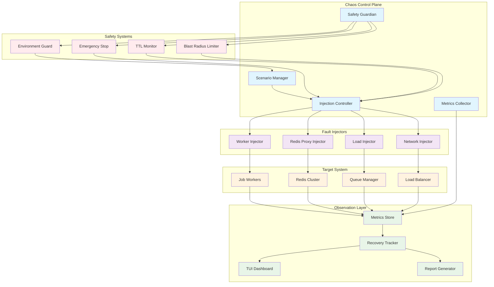
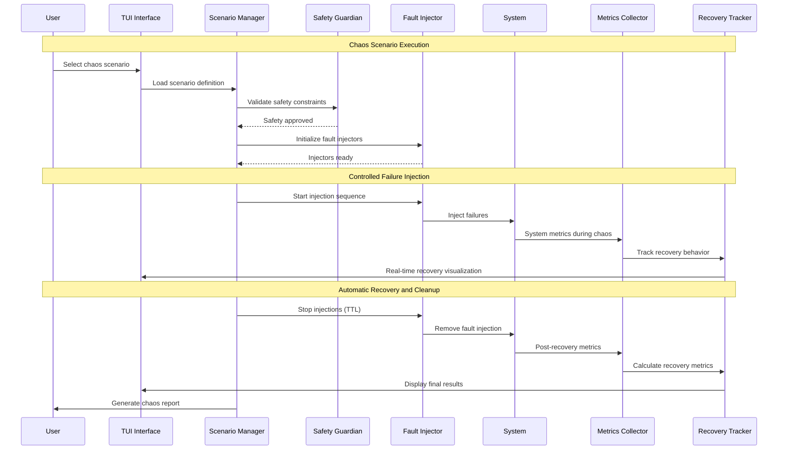

# Chaos Harness (F009) - Design Document

**Version:** 1.0
**Date:** 2025-09-14
**Status:** Draft
**Author:** Claude (Worker 6)
**Reviewers:** TBD

## Executive Summary

The Chaos Harness brings enterprise-grade reliability testing directly into the go-redis-work-queue system, enabling controlled failure injection and automated recovery validation. This system transforms reliability testing from guesswork into a scientific process by providing controlled chaos experiments with real-time visualization and comprehensive metrics collection.

Built on proven chaos engineering principles popularized by Netflix's Chaos Monkey, the harness provides a safe and controlled environment for validating system resilience under various failure conditions. The integration with the TUI provides immediate visual feedback on system recovery, making reliability testing accessible to all team members, not just SREs.

The system addresses the critical need for proactive reliability testing in distributed job processing systems where failures are inevitable and understanding recovery behavior is essential for maintaining production SLOs. By automating chaos scenarios with built-in guardrails, teams can build confidence in their systems' resilience while identifying weaknesses before they impact users.

### Key Benefits

- **Scientific Reliability Testing**: Transform chaos testing from ad-hoc experiments to repeatable science
- **Visual Recovery Feedback**: Real-time TUI visualization of system recovery behavior
- **Automated Guardrails**: Built-in safety mechanisms prevent uncontrolled chaos
- **Comprehensive Metrics**: Detailed measurement of recovery times and impact patterns
- **Game Day Ready**: Structured scenarios for team exercises and confidence building
- **Production Safe**: TTL-based injections and environment controls prevent accidents

### Architecture Overview



## System Architecture

### Core Components

#### 1. Scenario Manager

The Scenario Manager orchestrates chaos experiments by defining failure patterns, durations, and recovery expectations.

```go
type ScenarioManager struct {
    scenarios     map[string]*ChaosScenario
    activeRuns    map[string]*ScenarioRun
    scheduler     *ScenarioScheduler
    validator     *ScenarioValidator
    safetyGuard   *SafetyGuardian
}

type ChaosScenario struct {
    ID              string                 `json:"id"`
    Name            string                 `json:"name"`
    Description     string                 `json:"description"`
    Duration        time.Duration          `json:"duration"`
    InjectionSteps  []InjectionStep        `json:"injection_steps"`
    ExpectedMetrics ExpectedRecoveryMetrics `json:"expected_metrics"`
    SafetyLimits    SafetyLimits           `json:"safety_limits"`
    Environment     []string               `json:"environment"`
}

type InjectionStep struct {
    StartOffset  time.Duration     `json:"start_offset"`
    Duration     time.Duration     `json:"duration"`
    InjectorType InjectorType      `json:"injector_type"`
    Parameters   map[string]interface{} `json:"parameters"`
    TargetScope  TargetScope       `json:"target_scope"`
}
```

#### 2. Fault Injection Engine

The fault injection engine provides controlled failure injection across multiple system layers.

**Worker Injector**:
- Processing delays with configurable latency distributions
- Random failure injection at specified rates
- Worker panic/restart simulation
- Partial processing failures (half-completed jobs)

**Redis Proxy Injector**:
- Network latency injection between workers and Redis
- Connection drops and timeouts
- Sentinel/cluster failover simulation
- Memory pressure simulation

**Load Injector**:
- Traffic spike generation
- Sustained load patterns
- Burst load with gradual ramp-down
- Queue flooding scenarios

```go
type FaultInjector interface {
    Inject(ctx context.Context, params InjectionParams) error
    Stop(ctx context.Context) error
    Status() InjectionStatus
    Metrics() InjectionMetrics
}

type WorkerInjector struct {
    targetWorkers []string
    failureRate   float64
    latencyConfig LatencyConfig
    activeInjections map[string]*ActiveInjection
}

type LatencyConfig struct {
    Distribution DistributionType `json:"distribution"`
    Min          time.Duration    `json:"min"`
    Max          time.Duration    `json:"max"`
    Mean         time.Duration    `json:"mean"`
    StdDev       time.Duration    `json:"std_dev"`
}
```

#### 3. Safety Guardian

The Safety Guardian provides multiple layers of protection to prevent chaos experiments from causing uncontrolled damage.

```go
type SafetyGuardian struct {
    environmentGuard   *EnvironmentGuard
    blastRadiusLimiter *BlastRadiusLimiter
    emergencyStop     *EmergencyStop
    ttlMonitor        *TTLMonitor
    auditLogger       *AuditLogger
}

type EnvironmentGuard struct {
    allowedEnvironments []string
    productionLock      bool
    requiresApproval    map[string]bool
}

type BlastRadiusLimiter struct {
    maxAffectedWorkers   int
    maxAffectedQueues    int
    maxFailureRate       float64
    concurrentScenarios  int
}
```

#### 4. Metrics Collection and Analysis

Comprehensive metrics collection enables quantitative analysis of system resilience and recovery behavior.

```go
type RecoveryMetrics struct {
    RecoveryTime        time.Duration     `json:"recovery_time"`
    BacklogDrainTime    time.Duration     `json:"backlog_drain_time"`
    ErrorRate           float64           `json:"error_rate"`
    ThroughputImpact    float64           `json:"throughput_impact"`
    DLQJobCount         int               `json:"dlq_job_count"`
    WorkerHealthScore   float64           `json:"worker_health_score"`
    SystemStabilityTime time.Duration     `json:"system_stability_time"`
}

type ChaosMetrics struct {
    ScenarioID      string          `json:"scenario_id"`
    StartTime       time.Time       `json:"start_time"`
    EndTime         time.Time       `json:"end_time"`
    InjectionPhases []PhaseMetrics  `json:"injection_phases"`
    RecoveryMetrics RecoveryMetrics `json:"recovery_metrics"`
    SystemBehavior  SystemBehavior  `json:"system_behavior"`
}
```

### Data Flow Architecture



### TUI Integration

#### Chaos Dashboard Design

**Scenario Selection Panel**:
- Categorized scenario library (load testing, failure injection, recovery validation)
- Quick-start templates for common reliability tests
- Custom scenario builder with guided wizard
- Environment-specific scenario filtering

**Real-Time Monitoring Panel**:
- Live system health visualization during chaos
- Recovery progress indicators and timelines
- Visual markers showing injection start/stop points
- Side-by-side comparison with baseline metrics

**Chaos Control Panel**:
- Emergency stop button with instant injection termination
- TTL countdown timers for active injections
- Safety status indicators and constraint validation
- Real-time blast radius monitoring

```go
type ChaosUI struct {
    scenarioPanel   *ScenarioPanel
    monitoringPanel *MonitoringPanel
    controlPanel    *ControlPanel
    metricsPanel    *MetricsPanel
}

type ScenarioPanel struct {
    scenarioLibrary   *ScenarioLibrary
    customBuilder     *ScenarioBuilder
    environmentFilter *EnvironmentFilter
    safetyValidator   *SafetyValidator
}
```

### Scenario Library

#### Pre-built Chaos Scenarios

**Basic Resilience Tests**:
- Worker Overload: Simulate worker saturation with high latency
- Redis Latency: Inject network delays to Redis cluster
- Partial Failures: Random job processing failures at 10% rate
- Queue Flooding: Burst traffic 5x normal load for 2 minutes

**Advanced Chaos Scenarios**:
- Cascading Failures: Multiple injection points with staggered timing
- Split Brain: Simulate network partitions between worker groups
- Resource Exhaustion: Memory pressure leading to worker restarts
- Circuit Breaker: Test backpressure and recovery behavior

**Game Day Scenarios**:
- Black Friday Load: Sustained 10x traffic with periodic spikes
- Database Failover: Simulate primary Redis failure with sentinel failover
- Deployment Chaos: Rolling restart of workers during peak load
- Multi-Zone Failure: Simulate entire availability zone outage

```go
type ScenarioLibrary struct {
    BasicScenarios     []ChaosScenario
    AdvancedScenarios  []ChaosScenario
    GameDayScenarios   []ChaosScenario
    CustomScenarios    []ChaosScenario
}

func (sl *ScenarioLibrary) GetScenario(id string) (*ChaosScenario, error) {
    for _, scenarios := range [][]ChaosScenario{
        sl.BasicScenarios,
        sl.AdvancedScenarios,
        sl.GameDayScenarios,
        sl.CustomScenarios,
    } {
        for _, scenario := range scenarios {
            if scenario.ID == id {
                return &scenario, nil
            }
        }
    }
    return nil, ErrScenarioNotFound
}
```

### Performance Requirements

#### Latency Requirements

- **Scenario Launch**: <5 seconds from selection to first injection
- **Real-time Updates**: <100ms latency for TUI metric updates
- **Emergency Stop**: <1 second to halt all active injections
- **Metrics Collection**: <10ms overhead per metric data point

#### Throughput Requirements

- **Concurrent Scenarios**: Support 5+ simultaneous chaos experiments
- **Metrics Throughput**: Handle 1,000+ metrics updates per second
- **Injection Rate**: Execute 100+ fault injections per second
- **Recovery Tracking**: Monitor 1,000+ workers during chaos

#### Resource Requirements

- **Memory Overhead**: <200MB for chaos harness components
- **CPU Overhead**: <5% additional CPU during active scenarios
- **Storage Growth**: <10MB per completed scenario (including metrics)
- **Network Overhead**: <1% additional network traffic for injection coordination

#### Scalability Targets

- **System Scale**: Support chaos testing on 10,000+ worker systems
- **Scenario Complexity**: Handle scenarios with 50+ injection steps
- **Historical Data**: Store 1 year of chaos experiment results
- **Concurrent Users**: Support 20+ engineers running chaos experiments

## Testing Strategy

### Unit Testing

- Fault injector activation and deactivation
- Safety guardian constraint validation
- Scenario definition parsing and validation
- Metrics calculation and aggregation algorithms
- TTL-based automatic cleanup mechanisms

### Integration Testing

- End-to-end chaos scenario execution
- Multi-injector coordination and timing
- Safety system integration and emergency stops
- TUI real-time update accuracy
- Cross-environment scenario portability

### Chaos Testing (Self-Testing)

- Chaos harness resilience under system load
- Recovery behavior when chaos system fails
- Safety system activation under edge conditions
- Metrics accuracy during extreme scenarios
- Emergency stop effectiveness validation

### Performance Testing

- Overhead measurement during various injection types
- Metrics collection performance under load
- TUI responsiveness during intensive scenarios
- Memory usage growth patterns over long scenarios
- Network impact of distributed fault injection

## Security Threat Model

### Threat Analysis Matrix

#### T1: Unauthorized Chaos Execution

**Description**: Attackers gain access to chaos controls and execute destructive scenarios in production environments.

**STRIDE Categories**: Elevation of Privilege, Denial of Service

**Attack Scenarios**:
- Malicious insider launches chaos in production during business hours
- Compromised credentials used to execute destructive scenarios
- API exploitation bypasses safety constraints

**Mitigations**:
- **Strong Authentication**: Multi-factor authentication for chaos access
- **Role-Based Permissions**: Granular access controls per environment
- **Approval Workflows**: Required approvals for production-adjacent scenarios
- **Audit Logging**: Complete tracking of all chaos activities

**Risk Level**: High
**Likelihood**: Medium
**Impact**: Critical

#### T2: Safety System Bypass

**Description**: Attackers circumvent safety guardrails to execute uncontrolled chaos that exceeds intended blast radius.

**STRIDE Categories**: Tampering, Denial of Service

**Attack Scenarios**:
- Direct manipulation of safety configuration
- TTL bypass allowing indefinite chaos injection
- Blast radius limits circumvented through multiple scenarios

**Mitigations**:
- **Immutable Safety Config**: Safety parameters enforced at system level
- **Hardware Kill Switch**: Physical emergency stop independent of software
- **Distributed Safety Checks**: Multiple independent safety validators
- **Automatic Rollback**: Failed safety checks trigger immediate cleanup

**Risk Level**: High
**Likelihood**: Low
**Impact**: Critical

#### T3: Chaos Data Exfiltration

**Description**: Sensitive system behavior data collected during chaos experiments is exposed or exfiltrated.

**STRIDE Categories**: Information Disclosure

**Attack Scenarios**:
- Chaos reports contain sensitive operational data
- Metrics databases compromised exposing system vulnerabilities
- Scenario definitions reveal security weaknesses

**Mitigations**:
- **Data Sanitization**: Remove sensitive information from chaos reports
- **Access Controls**: Encrypt and restrict access to chaos metrics
- **Retention Policies**: Automatic purging of detailed chaos data
- **Anonymization**: Remove identifying information from exported data

**Risk Level**: Medium
**Likelihood**: Medium
**Impact**: Medium

### Security Controls Framework

#### Preventive Controls

**Environment Protection**:
- Production environment lockout with policy enforcement
- Staging-only execution with explicit production blocks
- Environment validation before scenario execution
- Compliance integration for regulated environments

**Access Control**:
- Role-based access with principle of least privilege
- Time-limited access tokens for chaos operations
- Approval workflows for high-impact scenarios
- Audit trails for all chaos-related actions

#### Detective Controls

**Monitoring and Alerting**:
- Real-time monitoring of chaos experiment scope
- Automated alerting on safety constraint violations
- Anomaly detection for unusual chaos patterns
- Integration with security incident response systems

#### Responsive Controls

**Emergency Response**:
- Instant kill switch for all active chaos experiments
- Automatic rollback of system changes
- Incident escalation for safety violations
- Post-chaos security assessment procedures

## Deployment Plan

### Phase 1: Core Infrastructure (Weeks 1-2)
- Implement basic fault injectors for workers and Redis
- Create scenario definition framework and validation
- Build safety guardian with environment protection
- Deploy basic TUI integration for scenario selection

### Phase 2: Advanced Injections (Weeks 3-4)
- Add network and load injection capabilities
- Implement comprehensive metrics collection system
- Create scenario library with pre-built chaos tests
- Build real-time recovery tracking and visualization

### Phase 3: Safety and Polish (Weeks 5-6)
- Complete safety system integration and testing
- Add advanced TUI features and emergency controls
- Implement chaos reporting and historical analysis
- Conduct security review and penetration testing

### Phase 4: Game Day Features (Weeks 7-8)
- Create advanced scenario composition tools
- Add team collaboration features for game days
- Implement chaos experiment scheduling and automation
- Build integration with existing monitoring and alerting systems

---

This design document establishes the foundation for implementing the Chaos Harness as a comprehensive reliability testing platform that brings enterprise-grade chaos engineering capabilities directly into the go-redis-work-queue ecosystem. The focus on safety, observability, and ease of use ensures that teams can build confidence in their systems' resilience while maintaining production safety standards.