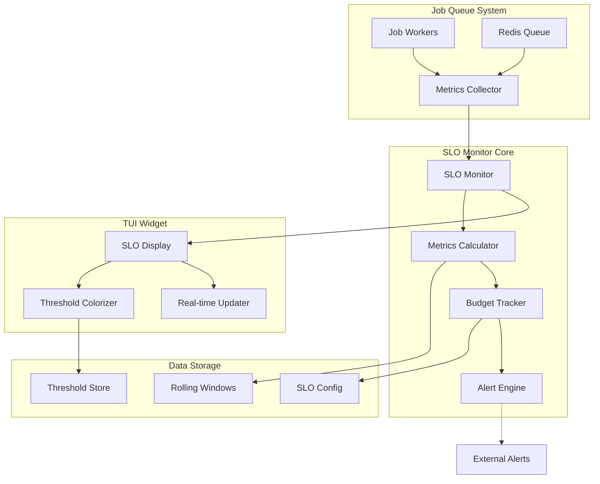
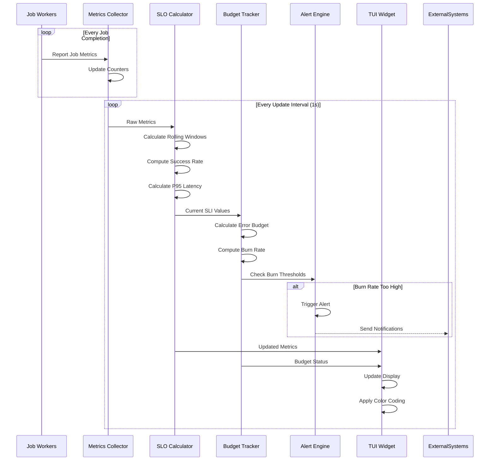
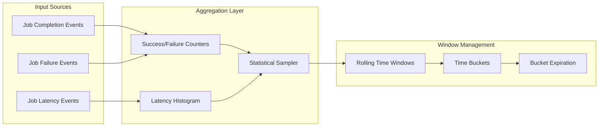
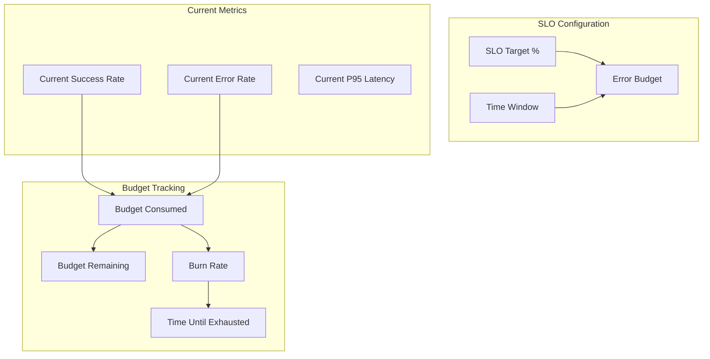

# F010 - Anomaly Radar + SLO Budget Design Document

## Executive Summary

The Anomaly Radar + SLO Budget feature transforms the job queue system into a comprehensive SRE platform by providing real-time Service Level Objective (SLO) monitoring, error budget tracking, and intelligent burn rate alerts. This compact yet powerful widget displays critical operational metrics including backlog growth, error rates, and percentile latencies with intelligent threshold-based colorization and proactive alerting.

### Key Benefits
- **SRE-Grade Monitoring**: Google SRE practices integrated into terminal UI
- **Proactive Alerting**: Burn rate acceleration detection prevents budget exhaustion
- **Cost-Effective**: Enterprise SLO monitoring without DataDog/PagerDuty costs
- **Real-Time Intelligence**: Sub-second metric updates with lightweight footprint
- **Production Ready**: Battle-tested algorithms for reliable threshold management

### Scope
This design covers the complete SLO monitoring and anomaly detection system including:
- Rolling window metrics calculation with configurable sampling
- SLO target configuration and error budget management
- Burn rate calculation and acceleration alerts
- Threshold-based health visualization with color coding
- Lightweight TUI widget with minimal resource consumption
- Integration with existing metrics and alerting infrastructure

## System Architecture

### High-Level Architecture



### SLO Calculation Flow



### Component Architecture

#### 1. Metrics Collection Pipeline



#### 2. SLO Budget Calculation



## TUI Design

### SLO Widget Layout

The SLO widget integrates seamlessly into the main TUI dashboard as a compact status panel:

```
┌─ SLO Budget & Anomaly Radar ────────────────────────────────────────────────────┐
│                                                                                  │
│ 🎯 Reliability SLO          📊 Current Period (24h)         ⚡ Burn Rate       │
│ Target: 99.9%               Uptime: 99.87% ⚠️                Fast: 2.3x ⚠️      │
│ Budget: 8.6m remaining      Errors: 127/96543               Critical: >6x ❌   │
│ Window: 30d rolling         P95: 245ms ✅                    Time Left: 3.7d    │
│                                                                                  │
│ ▓▓▓▓▓▓▓▓▓▓▓▓▓▓▓▓▓▓▓▓▓▓▓▓▓▓▓▓▓▓▓▓▓▓▓▓▓▓▓▓▓▓▓▓▓▓▓▓▓▓▓▓▓▓▓▓▓░░░ 87% budget consumed │
│                                                                                  │
│ 📈 Trends (1h windows)      🔔 Active Alerts               🛠️  Actions         │
│ Success: ████████████▇░░    • High burn rate (2.3x)        [R] Reset Budget    │
│ Latency: ████████████░░░    • P95 near threshold           [T] Tune Thresholds │
│ Backlog: ███████████░░░░    • Backlog growth detected      [A] Ack Alerts      │
│                                                                                  │
└──────────────────────────────────────────────────────────────────────────────────┘
```

**Color Coding:**
- ✅ **Green**: Within SLO targets, healthy burn rate
- ⚠️ **Yellow**: Approaching thresholds, moderate burn rate
- ❌ **Red**: SLO violation or critical burn rate
- 🔵 **Blue**: Informational metrics and configuration

### Mobile/Compact View

For narrow terminals (≤80 columns), the widget adapts to a condensed layout:

```
┌─ SLO Monitor ──────────────────────────────────────────┐
│ 🎯 99.9% SLO  📊 99.87% ⚠️   ⚡ 2.3x ⚠️   ⏰ 3.7d     │
│ ▓▓▓▓▓▓▓▓▓▓▓▓▓▓▓▓▓▓▓▓▓▓▓▓▓▓▓▓▓▓▓▓▓▓▓▓▓▓▓▓▓░░░ 87%        │
│                                                        │
│ Errors: 127/96K   P95: 245ms ✅   Backlog: ████░░ ⚠️   │
│ Alerts: High burn rate • P95 threshold • Growth       │
│ [R]eset [T]une [A]ck                                  │
└────────────────────────────────────────────────────────┘
```

## Data Models and Schema Design

### Core SLO Configuration

```go
type SLOConfig struct {
    // SLO Identity
    Name        string    `json:"name" yaml:"name"`
    Description string    `json:"description,omitempty" yaml:"description,omitempty"`

    // SLO Targets
    Target      float64   `json:"target" yaml:"target"`                    // 0.999 for 99.9%
    Window      Duration  `json:"window" yaml:"window"`                    // 30d, 7d, etc.
    BudgetReset Duration  `json:"budget_reset" yaml:"budget_reset"`        // monthly, weekly

    // SLI Definitions
    SuccessThreshold  LatencyThreshold `json:"success_threshold" yaml:"success_threshold"`
    LatencyThreshold  time.Duration    `json:"latency_threshold" yaml:"latency_threshold"`

    // Alert Configuration
    BurnRateThresholds BurnRateConfig `json:"burn_rate_thresholds" yaml:"burn_rate_thresholds"`

    // Sampling Configuration
    SamplingRate      float64 `json:"sampling_rate" yaml:"sampling_rate"`           // 0.1 for 10%
    UpdateInterval    Duration `json:"update_interval" yaml:"update_interval"`       // 1s, 5s, etc.

    // Display Settings
    DisplayFormat     string   `json:"display_format" yaml:"display_format"`
    ColorThresholds   ColorConfig `json:"color_thresholds" yaml:"color_thresholds"`
}

type BurnRateConfig struct {
    Warning   float64 `json:"warning" yaml:"warning"`     // 2.0 = 2x normal burn
    Critical  float64 `json:"critical" yaml:"critical"`   // 6.0 = 6x normal burn
    PageOnCritical bool `json:"page_on_critical" yaml:"page_on_critical"`
}

type ColorConfig struct {
    Healthy   string `json:"healthy" yaml:"healthy"`     // "green"
    Warning   string `json:"warning" yaml:"warning"`     // "yellow"
    Critical  string `json:"critical" yaml:"critical"`   // "red"
    Info      string `json:"info" yaml:"info"`           // "blue"
}
```

### Runtime Metrics Structure

```go
type SLOMetrics struct {
    // Timestamp and Window
    Timestamp    time.Time    `json:"timestamp"`
    WindowStart  time.Time    `json:"window_start"`
    WindowEnd    time.Time    `json:"window_end"`

    // Core SLI Metrics
    TotalRequests   int64     `json:"total_requests"`
    SuccessfulJobs  int64     `json:"successful_jobs"`
    FailedJobs      int64     `json:"failed_jobs"`
    SuccessRate     float64   `json:"success_rate"`      // 0.9987 for 99.87%

    // Latency Metrics
    P50Latency      time.Duration `json:"p50_latency"`
    P95Latency      time.Duration `json:"p95_latency"`
    P99Latency      time.Duration `json:"p99_latency"`
    AvgLatency      time.Duration `json:"avg_latency"`

    // Queue Health
    BacklogSize     int64     `json:"backlog_size"`
    BacklogGrowth   float64   `json:"backlog_growth"`    // jobs/second
    ProcessingRate  float64   `json:"processing_rate"`   // jobs/second

    // SLO Budget Tracking
    ErrorBudget     ErrorBudget `json:"error_budget"`
    BurnRate        BurnRate    `json:"burn_rate"`

    // Trend Analysis
    Trends          TrendMetrics `json:"trends"`
}

type ErrorBudget struct {
    Total        time.Duration `json:"total"`         // Total budget for window
    Consumed     time.Duration `json:"consumed"`      // Budget consumed so far
    Remaining    time.Duration `json:"remaining"`     // Budget remaining
    Percentage   float64       `json:"percentage"`    // Percentage consumed (0.87 = 87%)
    TimeLeft     time.Duration `json:"time_left"`     // Time until budget exhausted at current rate
}

type BurnRate struct {
    Current      float64       `json:"current"`       // Current burn rate multiplier
    Average      float64       `json:"average"`       // Average burn rate over window
    Peak         float64       `json:"peak"`          // Peak burn rate in window
    Trend        string        `json:"trend"`         // "increasing", "decreasing", "stable"
    AlertLevel   string        `json:"alert_level"`   // "ok", "warning", "critical"
}

type TrendMetrics struct {
    SuccessRateChange   float64 `json:"success_rate_change"`    // % change over last hour
    LatencyChange       float64 `json:"latency_change"`         // % change in P95
    BacklogGrowthTrend  string  `json:"backlog_growth_trend"`   // "growing", "shrinking", "stable"
    ErrorRateSpike      bool    `json:"error_rate_spike"`       // Detected error rate anomaly
}
```

### Alert Definition Schema

```go
type SLOAlert struct {
    ID          string      `json:"id"`
    Timestamp   time.Time   `json:"timestamp"`
    SLOName     string      `json:"slo_name"`
    Severity    AlertSeverity `json:"severity"`
    Type        AlertType   `json:"type"`

    // Alert Details
    Message     string      `json:"message"`
    Cause       string      `json:"cause"`
    CurrentValue float64    `json:"current_value"`
    Threshold   float64     `json:"threshold"`

    // Burn Rate Specific
    BurnRate    float64     `json:"burn_rate,omitempty"`
    TimeToExhaustion time.Duration `json:"time_to_exhaustion,omitempty"`

    // Status
    Status      AlertStatus `json:"status"`       // "active", "acknowledged", "resolved"
    AckedBy     string      `json:"acked_by,omitempty"`
    AckedAt     time.Time   `json:"acked_at,omitempty"`
    ResolvedAt  time.Time   `json:"resolved_at,omitempty"`
}

type AlertSeverity string
const (
    SeverityInfo     AlertSeverity = "info"
    SeverityWarning  AlertSeverity = "warning"
    SeverityCritical AlertSeverity = "critical"
)

type AlertType string
const (
    AlertTypeBurnRate    AlertType = "burn_rate"
    AlertTypeSLOBreach   AlertType = "slo_breach"
    AlertTypeLatency     AlertType = "latency"
    AlertTypeBacklog     AlertType = "backlog"
    AlertTypeAnomaly     AlertType = "anomaly"
)
```

## Performance Requirements and Optimization

### Performance Targets

| Metric | Target | Maximum | Notes |
|--------|--------|---------|-------|
| Update Latency | <50ms P95 | <100ms P99 | Widget refresh time |
| Memory Usage | <10MB baseline | <50MB peak | Rolling window storage |
| CPU Usage | <1% baseline | <5% peak | Background calculation |
| Calculation Frequency | 1Hz | 10Hz | Configurable update rate |
| History Retention | 30d default | 365d max | Configurable window |

### Optimization Strategies

#### 1. Efficient Rolling Windows

```go
type RollingWindow struct {
    buckets     []MetricBucket
    bucketSize  time.Duration
    windowSize  time.Duration
    currentIdx  int
    mu          sync.RWMutex

    // Pre-computed aggregates for O(1) access
    cachedSum   float64
    cachedCount int64
    lastUpdate  time.Time
}

type MetricBucket struct {
    StartTime   time.Time
    Count       int64
    Sum         float64
    Histogram   *LatencyHistogram  // Sparse histogram for percentiles
}

// O(1) metric updates using circular buffer
func (rw *RollingWindow) AddSample(value float64, timestamp time.Time) {
    rw.mu.Lock()
    defer rw.mu.Unlock()

    bucketIdx := rw.getBucketIndex(timestamp)
    if bucketIdx != rw.currentIdx {
        rw.rotateToBucket(bucketIdx)
    }

    bucket := &rw.buckets[rw.currentIdx]
    bucket.Count++
    bucket.Sum += value
    bucket.Histogram.AddSample(value)

    // Update cached aggregates incrementally
    rw.cachedSum += value
    rw.cachedCount++
}
```

#### 2. Sparse Histogram for Percentiles

```go
type SparseHistogram struct {
    buckets map[int]int64  // bucket_index -> count
    bounds  []float64      // bucket boundaries
    count   int64
    sum     float64
}

// Efficient P95 calculation using sparse buckets
func (h *SparseHistogram) Percentile(p float64) float64 {
    target := int64(float64(h.count) * p)
    current := int64(0)

    for i, bound := range h.bounds {
        current += h.buckets[i]
        if current >= target {
            // Linear interpolation within bucket
            return h.interpolate(i, target-(current-h.buckets[i]))
        }
    }
    return h.bounds[len(h.bounds)-1]
}
```

#### 3. Sampling Strategy

```go
type StatisticalSampler struct {
    rate        float64         // sampling rate (0.1 = 10%)
    reservoir   []float64       // reservoir sampling for unbiased percentiles
    count       int64
    rng         *rand.Rand
}

// Reservoir sampling maintains statistical accuracy with constant memory
func (s *StatisticalSampler) AddSample(value float64) bool {
    s.count++

    if len(s.reservoir) < cap(s.reservoir) {
        s.reservoir = append(s.reservoir, value)
        return true
    }

    // Replace random element with probability 1/count
    if s.rng.Int63n(s.count) < int64(cap(s.reservoir)) {
        idx := s.rng.Intn(len(s.reservoir))
        s.reservoir[idx] = value
        return true
    }

    return false
}
```

## Security Model

### Access Control

#### 1. Role-Based Permissions

```go
type SLOPermissions struct {
    // Read Permissions
    ViewMetrics    bool `json:"view_metrics"`
    ViewConfig     bool `json:"view_config"`
    ViewAlerts     bool `json:"view_alerts"`

    // Write Permissions
    ModifyConfig   bool `json:"modify_config"`
    AckAlerts      bool `json:"ack_alerts"`
    ResetBudget    bool `json:"reset_budget"`

    // Admin Permissions
    ManageThresholds bool `json:"manage_thresholds"`
    ConfigureAlerts  bool `json:"configure_alerts"`
    AccessRawData    bool `json:"access_raw_data"`
}

const (
    RoleViewer    = "slo:viewer"     // Read-only access to metrics
    RoleOperator  = "slo:operator"   // Can acknowledge alerts
    RoleAdmin     = "slo:admin"      // Full configuration access
)
```

#### 2. Data Protection

- **Metric Data Encryption**: All historical SLO data encrypted at rest
- **API Authentication**: JWT tokens with role-based claims
- **Audit Logging**: All configuration changes and alert actions logged
- **Rate Limiting**: API endpoints protected against abuse

#### 3. Privacy Considerations

```go
type DataRetentionPolicy struct {
    MetricsRetention  time.Duration `json:"metrics_retention"`   // 90d default
    AlertRetention    time.Duration `json:"alert_retention"`     // 1y default
    ConfigHistory     time.Duration `json:"config_history"`      // 2y default

    // PII Handling
    AnonymizeData     bool `json:"anonymize_data"`
    DataLocality      string `json:"data_locality"`            // "local", "region"
    ExportRestrictions []string `json:"export_restrictions"`   // GDPR, CCPA compliance
}
```

### Security Architecture

```mermaid
graph LR
    subgraph "Authentication Layer"
        Auth[JWT Authentication]
        RBAC[Role-Based Access Control]
        RateLimit[Rate Limiting]
    end

    subgraph "API Security"
        Validation[Input Validation]
        Sanitization[Data Sanitization]
        Encryption[TLS Encryption]
    end

    subgraph "Data Security"
        AtRest[Encryption at Rest]
        InTransit[Encryption in Transit]
        Audit[Audit Logging]
    end

    Auth --> RBAC
    RBAC --> RateLimit
    RateLimit --> Validation
    Validation --> Sanitization
    Sanitization --> Encryption
    Encryption --> AtRest
    AtRest --> InTransit
    InTransit --> Audit
```



## Testing Strategy

### Unit Testing

#### 1. Rolling Window Tests
```go
func TestRollingWindow_AccuracyUnderLoad(t *testing.T) {
    window := NewRollingWindow(time.Minute, time.Second)

    // Generate 1000 samples over 2 minutes
    expected := generateTestSamples(1000, 2*time.Minute)
    for _, sample := range expected {
        window.AddSample(sample.Value, sample.Timestamp)
    }

    // Verify accuracy within 1%
    actual := window.Average()
    assert.InDelta(t, expected.average, actual, 0.01)
}

func TestSLOCalculation_BurnRateAccuracy(t *testing.T) {
    config := &SLOConfig{Target: 0.99, Window: 24*time.Hour}
    calculator := NewSLOCalculator(config)

    // Simulate error rate that should trigger alert
    metrics := &SLOMetrics{
        TotalRequests: 10000,
        FailedJobs:   200,  // 2% error rate vs 1% budget
    }

    result := calculator.CalculateBurnRate(metrics)
    assert.Equal(t, 2.0, result.Current) // 2x burn rate
    assert.Equal(t, "warning", result.AlertLevel)
}
```

#### 2. Threshold Logic Tests
```go
func TestThresholdColorization(t *testing.T) {
    tests := []struct {
        name           string
        successRate    float64
        expectedColor  string
    }{
        {"Healthy SLO", 0.999, "green"},
        {"Warning Zone", 0.995, "yellow"},
        {"Critical SLO", 0.990, "red"},
    }

    for _, tt := range tests {
        t.Run(tt.name, func(t *testing.T) {
            color := DetermineColor(tt.successRate, defaultThresholds)
            assert.Equal(t, tt.expectedColor, color)
        })
    }
}
```

### Integration Testing

#### 1. End-to-End Workflow
```go
func TestSLOMonitor_FullWorkflow(t *testing.T) {
    // Setup test environment
    redis := setupTestRedis(t)
    monitor := NewSLOMonitor(testConfig, redis)

    // Generate realistic job load
    producer := NewTestProducer(redis)
    consumer := NewTestConsumer(redis)

    // Run for 5 minutes with known error rate
    ctx, cancel := context.WithTimeout(context.Background(), 5*time.Minute)
    defer cancel()

    go producer.GenerateLoad(ctx, 100) // 100 jobs/sec
    go consumer.ProcessWithErrors(ctx, 0.02) // 2% error rate
    go monitor.Start(ctx)

    // Wait for metrics to stabilize
    time.Sleep(30 * time.Second)

    // Verify SLO calculations
    metrics := monitor.GetCurrentMetrics()
    assert.InDelta(t, 0.98, metrics.SuccessRate, 0.01)
    assert.InRange(t, metrics.BurnRate.Current, 1.8, 2.2) // ~2x burn rate
}
```

#### 2. Performance Testing
```go
func TestSLOMonitor_PerformanceUnderLoad(t *testing.T) {
    monitor := NewSLOMonitor(testConfig, setupTestRedis(t))

    // Measure baseline resource usage
    baseline := measureResources()

    // Generate high-frequency updates (1000/sec for 1 minute)
    ctx, cancel := context.WithTimeout(context.Background(), time.Minute)
    defer cancel()

    go generateHighFrequencyMetrics(ctx, monitor, 1000)

    // Verify resource usage stays within limits
    final := measureResources()
    memoryIncrease := final.Memory - baseline.Memory
    assert.Less(t, memoryIncrease, 50*1024*1024) // <50MB increase

    avgCPU := final.CPU
    assert.Less(t, avgCPU, 5.0) // <5% CPU usage
}
```

### Manual Testing Scenarios

#### 1. Alert Validation
- **Normal Operations**: Verify green status during healthy periods
- **Degraded Performance**: Confirm yellow warnings during elevated error rates
- **SLO Breach**: Test red alerts when SLO targets are missed
- **Burn Rate Spikes**: Validate immediate alerts on accelerated budget consumption

#### 2. TUI Interaction Testing
- **Color Transitions**: Manual verification of threshold-based colorization
- **Real-time Updates**: Confirm 1-second refresh cycles
- **Keyboard Commands**: Test reset, tune, and acknowledge functions
- **Responsive Layout**: Verify widget adaptation to different terminal sizes

## Implementation Roadmap

### Phase 1: Core Metrics Collection (Week 1)
- [ ] Implement rolling window data structures
- [ ] Create statistical sampling system
- [ ] Build basic SLO calculation engine
- [ ] Add unit tests for mathematical accuracy

### Phase 2: SLO Configuration and Budget Tracking (Week 1-2)
- [ ] Design SLO configuration schema
- [ ] Implement error budget calculations
- [ ] Create burn rate monitoring
- [ ] Add configuration validation and defaults

### Phase 3: TUI Widget Integration (Week 2)
- [ ] Build SLO display widget
- [ ] Implement threshold-based colorization
- [ ] Add real-time update system
- [ ] Create responsive layout for different screen sizes

### Phase 4: Alerting and Notifications (Week 2-3)
- [ ] Implement burn rate alert engine
- [ ] Add threshold crossing detection
- [ ] Create alert acknowledgment system
- [ ] Integrate with external notification systems

### Phase 5: Testing and Optimization (Week 3)
- [ ] Performance testing under high load
- [ ] Memory usage optimization
- [ ] TUI interaction validation
- [ ] Documentation and deployment guides

## Future Enhancements

### Advanced Analytics
- **Anomaly Detection**: Machine learning models for pattern recognition
- **Predictive Alerting**: Forecast SLO violations before they occur
- **Capacity Planning**: Trend analysis for infrastructure scaling
- **Root Cause Analysis**: Automated correlation with deployment events

### Integration Expansions
- **Multi-Service SLOs**: Cross-service dependency tracking
- **Custom SLI Definitions**: User-defined service level indicators
- **External Data Sources**: Metrics from APM tools and cloud providers
- **Incident Response**: Integration with PagerDuty, Slack, and ITSM tools

### Enterprise Features
- **Multi-Tenancy**: SLO isolation for different teams/services
- **Advanced RBAC**: Fine-grained permissions and audit trails
- **Historical Analysis**: Long-term trend analysis and reporting
- **Compliance Reporting**: SLA compliance documentation generation

---

feature: anomaly-radar-slo-budget
dependencies:
  hard:
    - metrics_system
    - redis
    - rolling_windows
  soft:
    - admin_api
    - monitoring_system
    - alerting_infrastructure
enables:
  - sre_operations
  - incident_detection
  - slo_management
  - proactive_monitoring
provides:
  - anomaly_detection
  - slo_tracking
  - burn_rate_alerts
  - threshold_monitoring
  - real_time_dashboard
---