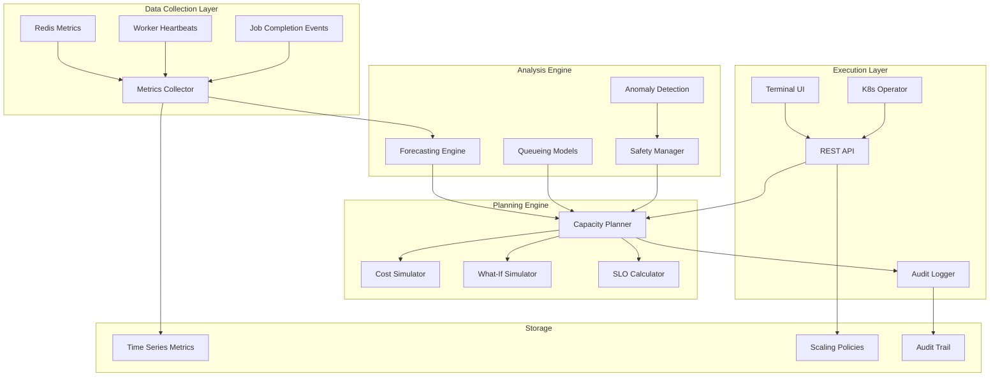
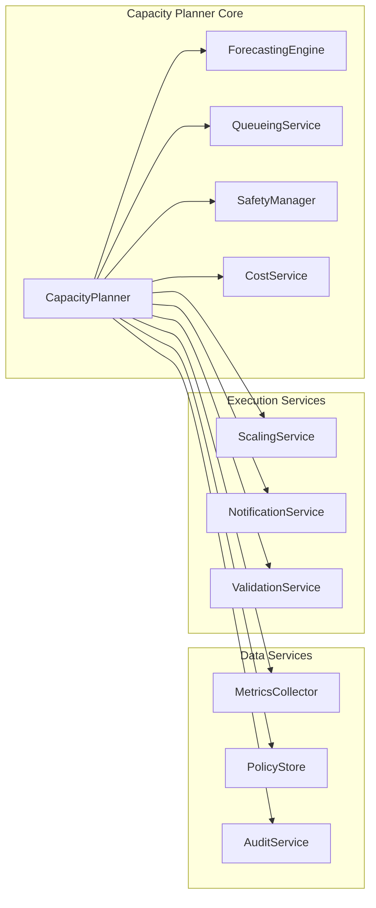
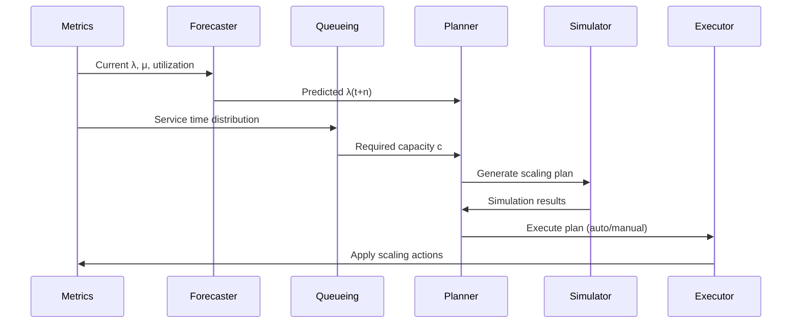

# F011: Automatic Capacity Planning - Design Document

## Executive Summary

The Automatic Capacity Planning system transforms reactive scaling into predictive optimization by leveraging queueing theory, time-series forecasting, and cost analysis. This system provides data-driven scaling recommendations that maintain SLOs while minimizing infrastructure costs, offering both manual approval workflows and fully automated scaling through Kubernetes operators.

### Key Features
- **Predictive Scaling**: Uses M/M/c and M/G/c queueing models to predict required capacity
- **Time-Series Forecasting**: EWMA and Holt-Winters models for arrival rate prediction
- **Safety Mechanisms**: Anti-flapping protection with cooldowns and hysteresis bands
- **Cost Optimization**: Economic analysis for scaling decisions
- **What-If Simulation**: Interactive scenario planning and impact analysis
- **Auto/Manual Modes**: Full automation or operator-approved scaling

## System Architecture

### High-Level Architecture



### Component Architecture



### Data Flow



## API Specification

### Core Endpoints

#### Planning Operations
- `GET /api/v1/capacity/plan` - Generate capacity recommendation
- `POST /api/v1/capacity/plan` - Create new capacity plan
- `GET /api/v1/capacity/plan/{id}` - Get specific plan
- `POST /api/v1/capacity/plan/{id}/apply` - Apply scaling plan
- `DELETE /api/v1/capacity/plan/{id}` - Cancel plan

#### Simulation Operations
- `POST /api/v1/capacity/simulate` - Run what-if simulation
- `GET /api/v1/capacity/simulate/{id}` - Get simulation results
- `POST /api/v1/capacity/simulate/{id}/compare` - Compare scenarios

#### Policy Management
- `GET /api/v1/capacity/policies` - List scaling policies
- `POST /api/v1/capacity/policies` - Create scaling policy
- `GET /api/v1/capacity/policies/{id}` - Get policy details
- `PUT /api/v1/capacity/policies/{id}` - Update policy
- `DELETE /api/v1/capacity/policies/{id}` - Delete policy

#### Metrics and Monitoring
- `GET /api/v1/capacity/metrics` - Current capacity metrics
- `GET /api/v1/capacity/metrics/history` - Historical metrics
- `GET /api/v1/capacity/health` - System health status
- `GET /api/v1/capacity/forecast` - Demand forecast

### Request/Response Models

```yaml
CapacityPlan:
  type: object
  properties:
    id: {type: string}
    created_at: {type: string, format: date-time}
    current_workers: {type: integer}
    target_workers: {type: integer}
    steps: {type: array, items: {$ref: '#/ScalingStep'}}
    confidence: {type: number, minimum: 0, maximum: 1}
    cost_impact: {$ref: '#/CostAnalysis'}
    slo_achievable: {type: boolean}
    rationale: {type: string}

ScalingStep:
  type: object
  properties:
    timestamp: {type: string, format: date-time}
    from_workers: {type: integer}
    to_workers: {type: integer}
    reason: {type: string}
    confidence: {type: number}
    estimated_duration: {type: string, format: duration}

ScalingPolicy:
  type: object
  properties:
    id: {type: string}
    name: {type: string}
    enabled: {type: boolean}
    mode: {type: string, enum: [auto, manual, advisory]}
    slo: {$ref: '#/SLOTarget'}
    scaling: {$ref: '#/ScalingConfig'}
    forecast: {$ref: '#/ForecastConfig'}
    cost: {$ref: '#/CostConfig'}
```

## Data Models

### Core Data Structures

#### Capacity Metrics
```json
{
  "timestamp": "2025-09-14T19:00:00Z",
  "arrival_rate": 150.5,
  "service_rate": 12.3,
  "service_time_p50": "2.1s",
  "service_time_p95": "8.7s",
  "current_workers": 24,
  "utilization": 0.82,
  "backlog": 45,
  "error_rate": 0.002,
  "cost_per_hour": 12.00
}
```

#### Scaling Plan
```json
{
  "id": "plan-2025-09-14-001",
  "created_at": "2025-09-14T19:00:00Z",
  "policy_id": "auto-scaling-policy",
  "current_state": {
    "workers": 24,
    "utilization": 0.82,
    "backlog": 45
  },
  "target_state": {
    "workers": 32,
    "projected_utilization": 0.65,
    "projected_backlog": 0
  },
  "steps": [
    {
      "timestamp": "2025-09-14T19:05:00Z",
      "action": "scale_up",
      "from_workers": 24,
      "to_workers": 28,
      "reason": "traffic spike predicted",
      "confidence": 0.87
    },
    {
      "timestamp": "2025-09-14T19:10:00Z",
      "action": "scale_up",
      "from_workers": 28,
      "to_workers": 32,
      "reason": "backlog reduction needed",
      "confidence": 0.91
    }
  ],
  "forecast": {
    "window": "60m",
    "predicted_lambda": [150.5, 165.2, 180.1, 175.8],
    "confidence_bands": {
      "upper": [160.5, 175.2, 190.1, 185.8],
      "lower": [140.5, 155.2, 170.1, 165.8]
    }
  },
  "simulation": {
    "slo_achievement": 0.96,
    "max_backlog": 15,
    "p95_latency": "4.2s",
    "cost_impact": {
      "additional_cost": 24.00,
      "violation_savings": 150.00,
      "net_savings": 126.00
    }
  }
}
```

#### SLO Configuration
```json
{
  "p95_latency": "5s",
  "max_backlog": 100,
  "error_budget": 0.01,
  "availability": 0.999,
  "drain_time": "300s"
}
```

### Queueing Models

#### M/M/c Implementation
```go
type MMcModel struct {
    arrivalRate  float64 // λ
    serviceRate  float64 // μ
    servers      int     // c
}

func (m *MMcModel) CalculateMetrics() QueueMetrics {
    rho := m.arrivalRate / (float64(m.servers) * m.serviceRate)
    if rho >= 1.0 {
        return QueueMetrics{Stable: false}
    }

    // Calculate P0 (probability of empty system)
    p0 := m.calculateP0()

    // Queue length (Lq)
    lq := (p0 * math.Pow(m.arrivalRate/m.serviceRate, float64(m.servers)) * rho) /
          (factorial(m.servers) * math.Pow(1-rho, 2))

    // Wait time in queue (Wq)
    wq := lq / m.arrivalRate

    return QueueMetrics{
        Stable:          true,
        QueueLength:     lq,
        WaitTime:        time.Duration(wq * float64(time.Second)),
        Utilization:     rho,
        ResponseTime:    time.Duration((wq + 1/m.serviceRate) * float64(time.Second)),
    }
}
```

#### Forecasting Models
```go
type HoltWintersForecaster struct {
    alpha      float64 // level smoothing
    beta       float64 // trend smoothing
    gamma      float64 // seasonal smoothing
    seasonLength int   // seasonal period
    history    []float64
}

func (hw *HoltWintersForecaster) Forecast(steps int) []float64 {
    level, trend, seasonal := hw.decompose()

    forecasts := make([]float64, steps)
    for i := 0; i < steps; i++ {
        seasonIndex := (len(hw.history) + i) % hw.seasonLength
        forecasts[i] = (level + float64(i+1)*trend) * seasonal[seasonIndex]
    }

    return forecasts
}
```

## Security Model

### Authentication and Authorization

#### API Security
- **Authentication**: JWT tokens with 24-hour expiration
- **Authorization**: RBAC with roles: viewer, operator, admin
- **Rate Limiting**: 100 requests/minute per user
- **Input Validation**: JSON schema validation on all endpoints

#### Permission Model
```yaml
roles:
  capacity_viewer:
    permissions:
      - capacity:read
      - metrics:read
      - plans:read

  capacity_operator:
    permissions:
      - capacity:read
      - capacity:plan
      - capacity:simulate
      - plans:apply_manual

  capacity_admin:
    permissions:
      - capacity:*
      - policies:*
      - plans:*
      - auto_scaling:enable
```

### Data Protection

#### Sensitive Data Handling
- **Metrics**: Aggregated only, no raw job payloads
- **Audit Logs**: Encrypted at rest, 90-day retention
- **Cost Data**: Access restricted to finance role
- **Forecasts**: Cached with 15-minute TTL

#### Compliance Requirements
- **SOX Compliance**: All scaling decisions audited
- **GDPR**: No personal data in metrics or logs
- **PCI**: Separate scaling policies for payment queues

### Threat Model

#### Identified Threats
1. **Malicious Scaling**: Unauthorized capacity changes
   - Mitigation: Multi-factor approval for large changes
2. **Data Poisoning**: Fake metrics to trigger scaling
   - Mitigation: Anomaly detection and source validation
3. **Cost Attacks**: Excessive scaling to increase bills
   - Mitigation: Hard caps and budget alerts
4. **Information Disclosure**: Capacity data reveals business patterns
   - Mitigation: Role-based access and data aggregation

#### Security Controls
```go
type SecurityManager struct {
    auditLogger    AuditLogger
    rateLimiter    RateLimiter
    anomalyDetector AnomalyDetector
    costGuards     CostGuardian
}

func (sm *SecurityManager) ValidateScalingRequest(req ScalingRequest) error {
    // Check authentication
    if !sm.isAuthenticated(req.UserID) {
        return ErrUnauthorized
    }

    // Check authorization
    if !sm.hasPermission(req.UserID, "capacity:plan") {
        return ErrForbidden
    }

    // Check for anomalies
    if sm.anomalyDetector.IsAnomaly(req) {
        return ErrSuspiciousActivity
    }

    // Check cost limits
    if req.CostImpact > sm.costGuards.GetLimit(req.UserID) {
        return ErrCostLimitExceeded
    }

    // Audit the request
    sm.auditLogger.LogScalingRequest(req)

    return nil
}
```

## Performance Requirements

### Throughput Targets
- **Plan Generation**: < 500ms for standard plans
- **Simulation**: < 2s for 24-hour horizon
- **API Response**: < 100ms for read operations
- **Metrics Collection**: 1000 data points/second
- **Concurrent Users**: 50 simultaneous operators

### Scalability Limits
- **Worker Pools**: Up to 1000 pools per cluster
- **Historical Data**: 90 days of metrics (10GB)
- **Concurrent Plans**: 100 active plans
- **Forecast Horizon**: Up to 7 days ahead

### Resource Requirements
```yaml
capacity_planner:
  cpu:
    requests: 1 core
    limits: 4 cores
  memory:
    requests: 2Gi
    limits: 8Gi
  storage:
    metrics_cache: 50Gi
    audit_logs: 20Gi

redis:
  cpu:
    requests: 2 cores
    limits: 4 cores
  memory:
    requests: 4Gi
    limits: 16Gi
```

### Performance Monitoring
```go
// Prometheus metrics
capacity_planner_plan_generation_duration_seconds{percentile="50|95|99"}
capacity_planner_simulation_duration_seconds{horizon="1h|6h|24h"}
capacity_planner_api_request_duration_seconds{endpoint, method}
capacity_planner_concurrent_users_total
capacity_planner_memory_usage_bytes
capacity_planner_cpu_usage_percent
```

## Testing Strategy

### Unit Testing
- **Queueing Models**: Verify mathematical accuracy against known results
- **Forecasting**: Test with synthetic time series data
- **Safety Logic**: Validate cooldown and hysteresis behavior
- **Cost Calculations**: Ensure accurate pricing models

### Integration Testing
- **End-to-End Flows**: Complete planning and execution cycles
- **API Testing**: All endpoints with various scenarios
- **Database Integration**: Redis operations and data consistency
- **External Services**: Kubernetes API and metrics collection

### Load Testing
- **Stress Testing**: 1000 concurrent plan generations
- **Endurance Testing**: 24-hour continuous operation
- **Chaos Testing**: Failure injection during scaling events
- **Performance Testing**: Response time under various loads

### Simulation Testing
```go
func TestCapacityPlanningAccuracy(t *testing.T) {
    // Historical trace replay
    traces := loadHistoricalTraces("production-2024.json")

    for _, trace := range traces {
        // Generate plan using historical data
        plan := planner.GeneratePlan(trace.Metrics, trace.SLO)

        // Simulate execution
        result := simulator.Execute(plan, trace.ActualWorkload)

        // Verify SLO achievement
        assert.True(t, result.AchievedSLO)
        assert.LessOrEqual(t, result.CostVariance, 0.1) // Within 10%
        assert.LessOrEqual(t, result.LatencyP95, trace.SLO.P95Latency)
    }
}

func TestScalingStability(t *testing.T) {
    // Test anti-flapping protection
    scenario := &ScalingScenario{
        InitialWorkers: 10,
        TrafficPattern: SinusoidalPattern{Amplitude: 2.0, Period: "10m"},
        Duration:       "2h",
    }

    events := simulator.RunScenario(scenario)

    // Should not scale more than once per cooldown period
    scalingEvents := filterScalingEvents(events)
    for i := 1; i < len(scalingEvents); i++ {
        timeDiff := scalingEvents[i].Timestamp.Sub(scalingEvents[i-1].Timestamp)
        assert.GreaterOrEqual(t, timeDiff, 5*time.Minute)
    }
}
```

### Validation Framework
```go
type ValidationSuite struct {
    realWorldScenarios []Scenario
    syntheticWorkloads []Workload
    edgeCases         []EdgeCase
}

func (vs *ValidationSuite) ValidateAgainstProduction() ValidationResult {
    results := make([]TestResult, 0)

    // Test against production scenarios
    for _, scenario := range vs.realWorldScenarios {
        result := vs.runScenario(scenario)
        results = append(results, result)
    }

    // Analyze accuracy metrics
    accuracy := vs.calculateAccuracy(results)
    stability := vs.calculateStability(results)
    efficiency := vs.calculateEfficiency(results)

    return ValidationResult{
        OverallScore: (accuracy + stability + efficiency) / 3,
        Accuracy:    accuracy,
        Stability:   stability,
        Efficiency:  efficiency,
        Details:     results,
    }
}
```

## Deployment Plan

### Infrastructure Requirements

#### Kubernetes Deployment
```yaml
apiVersion: apps/v1
kind: Deployment
metadata:
  name: capacity-planner
spec:
  replicas: 3
  selector:
    matchLabels:
      app: capacity-planner
  template:
    metadata:
      labels:
        app: capacity-planner
    spec:
      containers:
      - name: capacity-planner
        image: queue/capacity-planner:v1.0.0
        ports:
        - containerPort: 8080
        env:
        - name: REDIS_URL
          valueFrom:
            secretKeyRef:
              name: redis-credentials
              key: url
        - name: LOG_LEVEL
          value: "info"
        resources:
          requests:
            cpu: 1
            memory: 2Gi
          limits:
            cpu: 4
            memory: 8Gi
        livenessProbe:
          httpGet:
            path: /health
            port: 8080
          initialDelaySeconds: 30
          periodSeconds: 10
        readinessProbe:
          httpGet:
            path: /ready
            port: 8080
          initialDelaySeconds: 5
          periodSeconds: 5
```

#### Redis Configuration
```yaml
apiVersion: v1
kind: ConfigMap
metadata:
  name: redis-config
data:
  redis.conf: |
    maxmemory 8gb
    maxmemory-policy allkeys-lru
    save 900 1
    save 300 10
    save 60 10000
    appendonly yes
    appendfsync everysec
```

### Rollout Strategy

#### Phase 1: Read-Only Deployment (Week 1)
- Deploy capacity planner in monitoring mode
- Collect metrics and generate plans without execution
- Validate plan accuracy against manual decisions
- Test TUI and API endpoints

#### Phase 2: Manual Mode (Week 2-3)
- Enable manual plan approval and execution
- Train operators on new interface
- Compare automated vs manual decisions
- Collect feedback and refine algorithms

#### Phase 3: Advisory Mode (Week 4-5)
- Enable automatic plan generation with notifications
- Operators can review and approve via TUI
- Monitor system behavior and stability
- Adjust safety parameters based on results

#### Phase 4: Full Automation (Week 6+)
- Enable auto-apply for low-risk scenarios
- Implement graduated automation (start small)
- Monitor SLO achievement and cost impact
- Expand automation scope based on confidence

### Monitoring and Alerting

#### Key Metrics
```yaml
alerts:
  - name: CapacityPlannerDown
    expr: up{job="capacity-planner"} == 0
    for: 1m
    severity: critical

  - name: PlanGenerationSlow
    expr: capacity_planner_plan_generation_duration_seconds{percentile="95"} > 2
    for: 5m
    severity: warning

  - name: SLOAchievementLow
    expr: capacity_planner_slo_achievement_rate < 0.95
    for: 10m
    severity: critical

  - name: CostVarianceHigh
    expr: capacity_planner_cost_variance_percent > 20
    for: 15m
    severity: warning

  - name: AnomalyDetected
    expr: capacity_planner_anomalies_detected_total > 0
    for: 1m
    severity: warning
```

#### Dashboards
- **Executive Dashboard**: SLO achievement, cost savings, automation rate
- **Operator Dashboard**: Current plans, pending approvals, system health
- **Technical Dashboard**: Performance metrics, error rates, resource usage
- **Audit Dashboard**: Scaling history, user actions, compliance reports

This design document provides a comprehensive foundation for implementing the Automatic Capacity Planning system, covering all technical aspects from mathematical models to deployment strategies while ensuring security, performance, and reliability requirements are met.