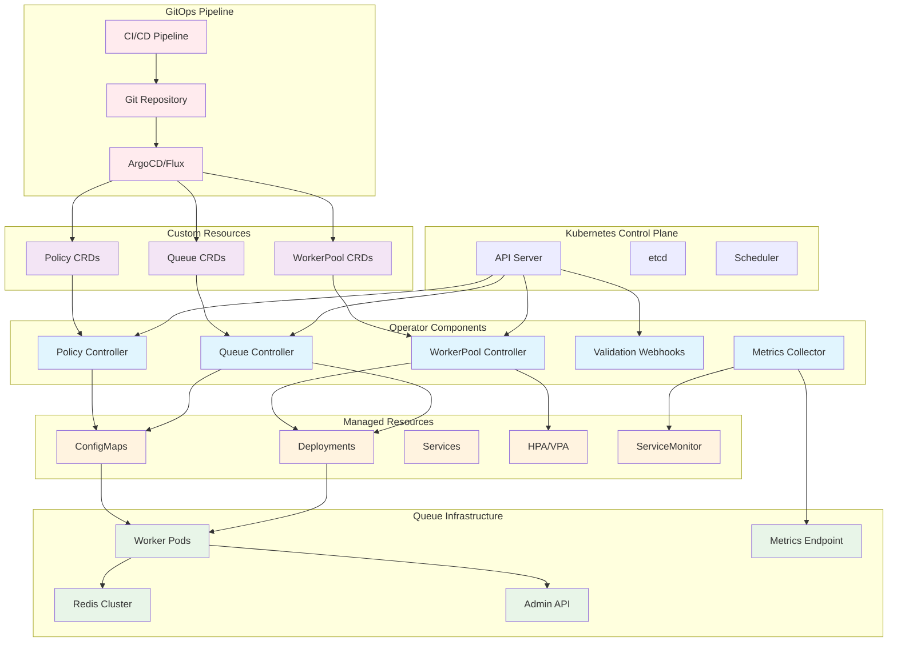
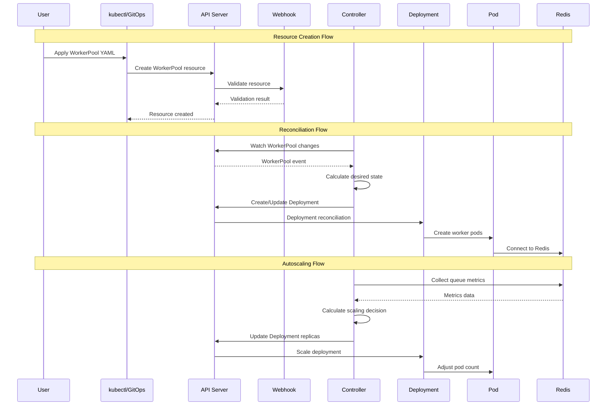

# Kubernetes Operator (F012) - Design Document

**Version:** 1.0
**Date:** 2025-09-14
**Status:** Draft
**Author:** Claude (Worker 6)
**Reviewers:** TBD

## Executive Summary

The Kubernetes Operator transforms the go-redis-work-queue from a standalone application into a cloud-native, Kubernetes-first platform. This operator enables declarative queue and worker management through Custom Resource Definitions (CRDs), providing GitOps-friendly operations, intelligent autoscaling, and production-ready lifecycle management.

Built on the proven controller-runtime framework, the operator reconciles desired state from YAML manifests, automatically scales workers based on queue metrics and SLA targets, and orchestrates safe rolling deployments with zero downtime. This approach aligns with modern cloud-native practices while providing enterprise-grade operational capabilities.

The operator addresses the critical need for standardized, repeatable, and version-controlled infrastructure management in Kubernetes environments. By providing native Kubernetes resources for queue operations, teams can leverage existing GitOps workflows, RBAC controls, and monitoring infrastructure while gaining queue-aware autoscaling capabilities not available in generic solutions.

### Key Benefits

- **Kubernetes-Native Operations**: First-class CRDs integrate seamlessly with existing K8s tooling
- **Intelligent Autoscaling**: Queue-aware scaling based on backlog depth and latency SLOs
- **GitOps Ready**: Declarative configuration enables version-controlled infrastructure
- **Zero-Downtime Deployments**: Sophisticated drain and readiness hooks ensure safe updates
- **Enterprise Security**: Comprehensive RBAC, validation webhooks, and namespace isolation
- **Operational Excellence**: Rich observability with conditions, events, and Prometheus metrics

### Architecture Overview



## System Architecture

### Core Components

#### 1. Custom Resource Definitions (CRDs)

The operator defines three primary CRDs that represent the queue system's domain model in Kubernetes.

**Queue CRD**: Defines queue configuration, behavior, and policies.

```yaml
apiVersion: apiextensions.k8s.io/v1
kind: CustomResourceDefinition
metadata:
  name: queues.redis-queue.io
spec:
  group: redis-queue.io
  versions:
  - name: v1
    schema:
      openAPIV3Schema:
        type: object
        properties:
          spec:
            type: object
            properties:
              name:
                type: string
                pattern: "^[a-z0-9-]+$"
              priorities:
                type: array
                items:
                  type: integer
                  minimum: 1
                  maximum: 10
              rateLimits:
                type: object
                properties:
                  maxJobsPerSecond:
                    type: integer
                    minimum: 1
                  burstCapacity:
                    type: integer
                    minimum: 1
              dlqPolicy:
                type: object
                properties:
                  enabled:
                    type: boolean
                  maxRetries:
                    type: integer
                    minimum: 0
                  retentionDays:
                    type: integer
                    minimum: 1
              retention:
                type: object
                properties:
                  completedJobs:
                    type: string
                    pattern: "^[0-9]+[hdm]$"
                  failedJobs:
                    type: string
                    pattern: "^[0-9]+[hdm]$"
```

**WorkerPool CRD**: Defines worker deployment configuration and scaling policies.

```yaml
apiVersion: apiextensions.k8s.io/v1
kind: CustomResourceDefinition
metadata:
  name: workerpools.redis-queue.io
spec:
  group: redis-queue.io
  versions:
  - name: v1
    schema:
      openAPIV3Schema:
        type: object
        properties:
          spec:
            type: object
            properties:
              image:
                type: string
              version:
                type: string
              queues:
                type: array
                items:
                  type: string
              concurrency:
                type: integer
                minimum: 1
                maximum: 1000
              resources:
                type: object
                properties:
                  requests:
                    type: object
                  limits:
                    type: object
              autoscaling:
                type: object
                properties:
                  enabled:
                    type: boolean
                  minReplicas:
                    type: integer
                    minimum: 0
                  maxReplicas:
                    type: integer
                    minimum: 1
                  targetMetrics:
                    type: object
                    properties:
                      queueDepth:
                        type: integer
                      latencyP95:
                        type: string
                        pattern: "^[0-9]+[ms]$"
              drainPolicy:
                type: object
                properties:
                  gracePeriod:
                    type: string
                    pattern: "^[0-9]+[smh]$"
                  maxDrainTime:
                    type: string
                    pattern: "^[0-9]+[smh]$"
```

#### 2. Controller Architecture

The operator implements multiple controllers using the controller-runtime framework, each responsible for a specific CRD.

```go
type QueueController struct {
    client.Client
    Scheme    *runtime.Scheme
    Recorder  record.EventRecorder
    Redis     RedisClient
    AdminAPI  AdminAPIClient
}

func (r *QueueController) Reconcile(ctx context.Context, req ctrl.Request) (ctrl.Result, error) {
    queue := &redisqueuev1.Queue{}
    if err := r.Get(ctx, req.NamespacedName, queue); err != nil {
        return ctrl.Result{}, client.IgnoreNotFound(err)
    }

    // Apply queue configuration to Redis
    if err := r.reconcileQueueConfig(ctx, queue); err != nil {
        return ctrl.Result{}, err
    }

    // Update status
    return r.updateQueueStatus(ctx, queue)
}

type WorkerPoolController struct {
    client.Client
    Scheme   *runtime.Scheme
    Recorder record.EventRecorder
    Metrics  MetricsCollector
}

func (r *WorkerPoolController) Reconcile(ctx context.Context, req ctrl.Request) (ctrl.Result, error) {
    workerPool := &redisqueuev1.WorkerPool{}
    if err := r.Get(ctx, req.NamespacedName, workerPool); err != nil {
        return ctrl.Result{}, client.IgnoreNotFound(err)
    }

    // Reconcile Deployment
    if err := r.reconcileDeployment(ctx, workerPool); err != nil {
        return ctrl.Result{}, err
    }

    // Handle autoscaling
    if workerPool.Spec.Autoscaling.Enabled {
        if err := r.reconcileAutoscaling(ctx, workerPool); err != nil {
            return ctrl.Result{}, err
        }
    }

    return r.updateWorkerPoolStatus(ctx, workerPool)
}
```

#### 3. Intelligent Autoscaling Engine

The autoscaling engine monitors queue metrics and adjusts worker replicas based on configurable SLA targets.

```go
type AutoscalingEngine struct {
    metricsCollector MetricsCollector
    calculator       ScalingCalculator
    safetyLimits     SafetyLimits
}

type QueueMetrics struct {
    QueueDepth        int64         `json:"queue_depth"`
    ProcessingRate    float64       `json:"processing_rate"`
    LatencyP50        time.Duration `json:"latency_p50"`
    LatencyP95        time.Duration `json:"latency_p95"`
    LatencyP99        time.Duration `json:"latency_p99"`
    ErrorRate         float64       `json:"error_rate"`
    LastUpdated       time.Time     `json:"last_updated"`
}

type ScalingDecision struct {
    CurrentReplicas   int32     `json:"current_replicas"`
    DesiredReplicas   int32     `json:"desired_replicas"`
    ScalingReason     string    `json:"scaling_reason"`
    Confidence        float64   `json:"confidence"`
    CooldownUntil     time.Time `json:"cooldown_until"`
    SafetyLimitHit    bool      `json:"safety_limit_hit"`
}

func (e *AutoscalingEngine) CalculateDesiredReplicas(
    ctx context.Context,
    workerPool *redisqueuev1.WorkerPool,
    metrics *QueueMetrics,
) (*ScalingDecision, error) {
    currentReplicas := workerPool.Status.ReadyReplicas

    // Calculate target replicas based on queue theory
    targetReplicas := e.calculator.CalculateOptimalReplicas(
        metrics.QueueDepth,
        metrics.ProcessingRate,
        workerPool.Spec.Autoscaling.TargetMetrics,
    )

    // Apply safety limits and cooldown
    decision := e.applySafetyLimits(currentReplicas, targetReplicas, workerPool)

    return decision, nil
}
```

#### 4. Validation Webhooks

Admission webhooks provide validation, defaulting, and mutation capabilities for CRDs.

```go
type QueueValidator struct {
    Client  client.Client
    decoder *admission.Decoder
}

func (v *QueueValidator) Handle(ctx context.Context, req admission.Request) admission.Response {
    queue := &redisqueuev1.Queue{}
    if err := v.decoder.Decode(req, queue); err != nil {
        return admission.Errored(http.StatusBadRequest, err)
    }

    // Validate queue name uniqueness
    if err := v.validateQueueName(ctx, queue); err != nil {
        return admission.Denied(err.Error())
    }

    // Validate rate limits
    if err := v.validateRateLimits(queue.Spec.RateLimits); err != nil {
        return admission.Denied(err.Error())
    }

    // Apply defaults
    v.applyDefaults(queue)

    return admission.Allowed("")
}
```

### Data Flow Architecture



### Performance Requirements

#### Latency Requirements

- **Reconciliation Latency**: <30 seconds for resource changes to take effect
- **Autoscaling Response**: <60 seconds from metric change to scaling action
- **Webhook Validation**: <100ms for admission webhook processing
- **Status Updates**: <10 seconds for status condition updates

#### Throughput Requirements

- **Resource Reconciliation**: 100+ resources reconciled per minute
- **Metric Collection**: 1,000+ metrics points collected per minute
- **Webhook Processing**: 500+ admission requests per minute
- **Event Generation**: 10,000+ Kubernetes events per hour

#### Resource Requirements

- **Controller Memory**: <500MB base, +10MB per 100 managed resources
- **Controller CPU**: <100m base, +50m during active reconciliation
- **Webhook Memory**: <100MB for validation webhook
- **Storage**: <1MB per managed resource for status and configuration

#### Scalability Targets

- **Managed Resources**: Support 1,000+ Queue and WorkerPool resources per cluster
- **Concurrent Reconciliations**: Handle 50+ simultaneous reconciliation loops
- **Multi-Tenancy**: Support 100+ namespaces with isolated resource management
- **Cluster Scale**: Function effectively in clusters with 1,000+ nodes

## Testing Strategy

### Unit Testing

- Controller reconciliation logic with fake Kubernetes clients
- Autoscaling calculator algorithms with various queue scenarios
- Validation webhook logic with valid and invalid resource definitions
- Metrics collection and processing with mock data sources
- Resource generation and template rendering

### Integration Testing

- End-to-end resource lifecycle testing with real Kubernetes API
- Controller integration with live Redis clusters
- Webhook integration with Kubernetes admission controllers
- Metrics collection integration with Prometheus endpoints
- RBAC and security policy validation

### End-to-End Testing

- Complete operator deployment in kind/minikube clusters
- GitOps workflow testing with ArgoCD integration
- Autoscaling behavior under simulated load patterns
- Rolling update scenarios with drain and readiness validation
- Multi-namespace isolation and security boundary testing

### Performance Testing

- Controller performance under high resource churn
- Autoscaling responsiveness with rapid queue depth changes
- Webhook latency under concurrent admission requests
- Memory usage growth patterns with increasing resource counts
- Reconciliation loop efficiency and resource utilization

## Security Model

### Security Principles

The Kubernetes Operator follows defense-in-depth security principles with multiple layers of protection:

- **Principle of Least Privilege**: RBAC permissions are granted minimally and scoped to necessary operations
- **Zero Trust Architecture**: All communication is authenticated and authorized
- **Secure by Default**: Security controls are enabled by default with opt-out where appropriate
- **Audit and Observability**: All security-relevant events are logged and monitored

### STRIDE Threat Analysis

| **Threat** | **Impact** | **Likelihood** | **Mitigation** | **Risk Level** |
|------------|------------|----------------|----------------|----------------|
| **Spoofing** | | | | |
| Malicious actor impersonates operator | High | Medium | ServiceAccount tokens, mTLS, RBAC validation | Medium |
| Fake worker pods consuming resources | Medium | Low | Pod Security Standards, resource quotas | Low |
| **Tampering** | | | | |
| CRD modification by unauthorized user | High | Medium | RBAC, admission webhooks, immutable fields | Medium |
| Worker pod configuration corruption | High | Low | ConfigMap checksums, admission controllers | Low |
| Redis data tampering | Critical | Low | TLS encryption, Redis AUTH, network policies | Medium |
| **Repudiation** | | | | |
| Operator actions without audit trail | Medium | Low | Kubernetes events, structured logging, metrics | Low |
| Configuration changes lack attribution | Medium | Medium | GitOps workflows, RBAC audit logs | Low |
| **Information Disclosure** | | | | |
| Redis credentials exposed in logs | High | Medium | Secret references, log sanitization | Medium |
| Sensitive env vars in pod specs | High | Medium | Secret/ConfigMap refs, field encryption | Medium |
| Internal network topology exposure | Medium | Low | Network policies, service mesh | Low |
| **Denial of Service** | | | | |
| Resource exhaustion via CRD spam | High | Medium | Resource quotas, rate limiting, validation | Medium |
| Operator overwhelmed by reconciliation | Medium | Medium | Work queues, exponential backoff, circuit breakers | Low |
| Worker pods consume all cluster resources | Critical | Low | ResourceQuotas, LimitRanges, PodDisruptionBudgets | Low |
| **Elevation of Privilege** | | | | |
| Container escape to node | Critical | Low | Pod Security Standards, AppArmor/SELinux | Low |
| Operator gains cluster-admin rights | Critical | Very Low | Scoped RBAC, principle of least privilege | Low |
| Worker accesses other namespaces | High | Low | Network policies, RBAC, namespace isolation | Low |

### RBAC Model

#### Operator Service Account Permissions

```yaml
# Cluster-scoped permissions (optional)
apiVersion: rbac.authorization.k8s.io/v1
kind: ClusterRole
metadata:
  name: queue-operator-cluster
rules:
  - apiGroups: ["workqueue.io"]
    resources: ["queues", "workerpools", "policies"]
    verbs: ["get", "list", "watch", "create", "update", "patch", "delete"]
  - apiGroups: [""]
    resources: ["events"]
    verbs: ["create", "patch"]
  - apiGroups: ["apps"]
    resources: ["deployments", "replicasets"]
    verbs: ["get", "list", "watch", "create", "update", "patch", "delete"]
  - apiGroups: [""]
    resources: ["pods", "services", "configmaps", "secrets"]
    verbs: ["get", "list", "watch"]

# Namespace-scoped permissions (default)
apiVersion: rbac.authorization.k8s.io/v1
kind: Role
metadata:
  name: queue-operator
  namespace: workqueue-system
rules:
  - apiGroups: ["workqueue.io"]
    resources: ["*"]
    verbs: ["*"]
  - apiGroups: ["apps"]
    resources: ["deployments"]
    verbs: ["get", "list", "watch", "create", "update", "patch", "delete"]
  - apiGroups: [""]
    resources: ["pods", "services", "configmaps"]
    verbs: ["get", "list", "watch", "create", "update", "patch"]
  - apiGroups: [""]
    resources: ["secrets"]
    verbs: ["get", "list", "watch"]
    resourceNames: ["redis-credentials", "tls-certs"]
```

#### Worker Service Account Permissions

```yaml
apiVersion: rbac.authorization.k8s.io/v1
kind: Role
metadata:
  name: queue-worker
rules:
  - apiGroups: [""]
    resources: ["configmaps"]
    verbs: ["get", "list", "watch"]
  - apiGroups: [""]
    resources: ["secrets"]
    verbs: ["get"]
    resourceNames: ["redis-credentials"]
  - apiGroups: ["workqueue.io"]
    resources: ["queues"]
    verbs: ["get", "list", "watch"]
```

### Pod Security Standards

All worker pods must comply with **Restricted** Pod Security Standards:

```yaml
apiVersion: v1
kind: Namespace
metadata:
  name: workqueue-workers
  labels:
    pod-security.kubernetes.io/enforce: restricted
    pod-security.kubernetes.io/audit: restricted
    pod-security.kubernetes.io/warn: restricted
spec:
  securityContext:
    runAsNonRoot: true
    runAsUser: 1000
    runAsGroup: 1000
    fsGroup: 2000
    seccompProfile:
      type: RuntimeDefault
    capabilities:
      drop:
        - ALL
    allowPrivilegeEscalation: false
    readOnlyRootFilesystem: true
```

### Network Security

#### Network Policies

```yaml
apiVersion: networking.k8s.io/v1
kind: NetworkPolicy
metadata:
  name: queue-operator-netpol
spec:
  podSelector:
    matchLabels:
      app: queue-operator
  policyTypes:
    - Ingress
    - Egress
  ingress:
    - from:
        - podSelector:
            matchLabels:
              app: prometheus
      ports:
        - protocol: TCP
          port: 8080  # Metrics
    - from:
        - namespaceSelector:
            matchLabels:
              name: kube-system
      ports:
        - protocol: TCP
          port: 9443  # Webhooks
  egress:
    - to:
        - namespaceSelector: {}
      ports:
        - protocol: TCP
          port: 6443  # Kubernetes API
    - to: []  # Redis (external)
      ports:
        - protocol: TCP
          port: 6379
        - protocol: TCP
          port: 6380  # Redis TLS
```

#### TLS Configuration

- **Webhook TLS**: Generated certificates with short TTL (24h), auto-rotation
- **Redis TLS**: Optional TLS encryption with certificate validation
- **Metrics TLS**: Optional TLS for Prometheus metrics endpoint

### Admission Control

#### Validating Webhooks

```yaml
apiVersion: admissionregistration.k8s.io/v1
kind: ValidatingAdmissionWebhook
metadata:
  name: queue-validator
webhooks:
  - name: validate.queue.workqueue.io
    clientConfig:
      service:
        name: queue-operator-webhook
        path: /validate/queue
    rules:
      - operations: ["CREATE", "UPDATE"]
        apiGroups: ["workqueue.io"]
        apiVersions: ["v1"]
        resources: ["queues"]
    failurePolicy: Fail
    sideEffects: None
```

**Validation Rules:**
- Queue names must be unique within namespace
- Rate limits cannot exceed cluster policies
- Resource requests must be within namespace quotas
- Redis connection strings must not contain credentials (use secretRef)
- Priority values must be within allowed range

#### Mutating Webhooks

```yaml
apiVersion: admissionregistration.k8s.io/v1
kind: MutatingAdmissionWebhook
metadata:
  name: queue-defaulter
webhooks:
  - name: default.workerpool.workqueue.io
    clientConfig:
      service:
        name: queue-operator-webhook
        path: /mutate/workerpool
    rules:
      - operations: ["CREATE"]
        apiGroups: ["workqueue.io"]
        resources: ["workerpools"]
```

**Default Mutations:**
- Add required security context if missing
- Set resource limits based on cluster policies
- Inject monitoring sidecar if enabled
- Add required labels and annotations

### Secret Management

#### Redis Credentials

```yaml
apiVersion: v1
kind: Secret
metadata:
  name: redis-credentials
  namespace: workqueue-system
type: Opaque
data:
  redis-url: <base64-encoded-connection-string>
  redis-password: <base64-encoded-password>
  redis-username: <base64-encoded-username>
```

#### TLS Certificates

```yaml
apiVersion: v1
kind: Secret
metadata:
  name: redis-tls-certs
type: kubernetes.io/tls
data:
  tls.crt: <base64-encoded-cert>
  tls.key: <base64-encoded-key>
  ca.crt: <base64-encoded-ca>
```

### Runtime Security

#### Security Monitoring

- **Falco Rules**: Monitor for suspicious container activity
- **OPA Gatekeeper**: Enforce cluster-wide security policies
- **Pod Security Admission**: Prevent privileged pod creation

#### Audit Logging

```yaml
apiVersion: audit.k8s.io/v1
kind: Policy
rules:
  - level: Metadata
    namespaces: ["workqueue-system"]
    resources:
      - group: "workqueue.io"
        resources: ["*"]
  - level: Request
    verbs: ["create", "update", "patch", "delete"]
    resources:
      - group: "workqueue.io"
        resources: ["queues", "workerpools", "policies"]
```

### Compliance and Governance

#### Security Policies

- **Resource Quotas**: Prevent resource exhaustion attacks
- **Limit Ranges**: Enforce minimum/maximum resource allocations
- **Pod Disruption Budgets**: Maintain availability during updates
- **Network Policies**: Micro-segmentation and traffic control

#### Vulnerability Management

- **Container Scanning**: Automated CVE scanning in CI/CD
- **Admission Controllers**: Block vulnerable images
- **Runtime Monitoring**: Detect exploitation attempts
- **Update Policies**: Automated security patch deployment

### Incident Response

#### Security Event Detection

1. **Anomaly Detection**: Unusual API access patterns
2. **Resource Monitoring**: Unexpected resource consumption
3. **Network Monitoring**: Suspicious network connections
4. **Audit Analysis**: Privilege escalation attempts

#### Response Procedures

1. **Immediate**: Isolate affected resources using network policies
2. **Investigation**: Analyze audit logs and metrics
3. **Remediation**: Apply security patches, rotate credentials
4. **Recovery**: Restore from known-good configurations

## Deployment Plan

### Phase 1: Core CRDs and Controllers (Weeks 1-2)
- Implement Queue and WorkerPool CRDs with basic validation
- Develop core reconciliation controllers for resource management
- Create deployment manifests and RBAC configurations
- Build basic validation webhooks for resource integrity

### Phase 2: Autoscaling and Metrics (Weeks 3-4)
- Implement intelligent autoscaling engine with SLA-based scaling
- Integrate with Prometheus for metrics collection and alerting
- Add Policy CRD for global configuration management
- Create comprehensive monitoring and observability features

### Phase 3: Production Hardening (Weeks 5-6)
- Implement advanced validation webhooks with security policies
- Add support for rolling updates with drain and readiness hooks
- Create comprehensive RBAC configurations and security boundaries
- Build disaster recovery and backup/restore capabilities

### Phase 4: Ecosystem Integration (Weeks 7-8)
- Create Helm charts and Kustomize bases for easy deployment
- Build ArgoCD/Flux integration examples and documentation
- Implement advanced features like multi-cluster support
- Conduct security review and penetration testing

---

This design document establishes the foundation for implementing the Kubernetes Operator as a cloud-native platform that transforms queue management into a declarative, GitOps-friendly experience. The focus on intelligent autoscaling, comprehensive security, and operational excellence ensures that the operator meets enterprise requirements while providing a superior developer experience.