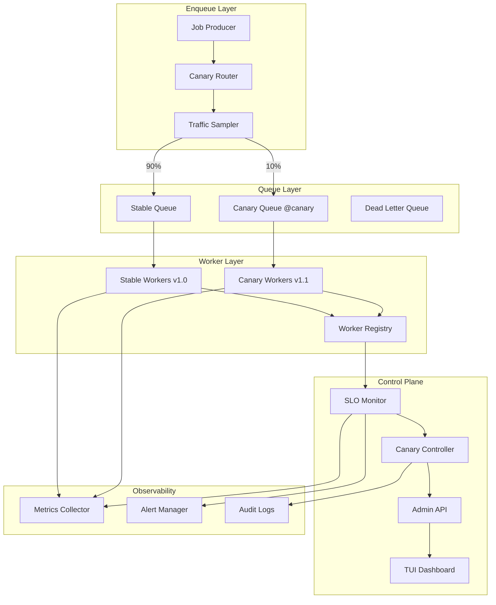
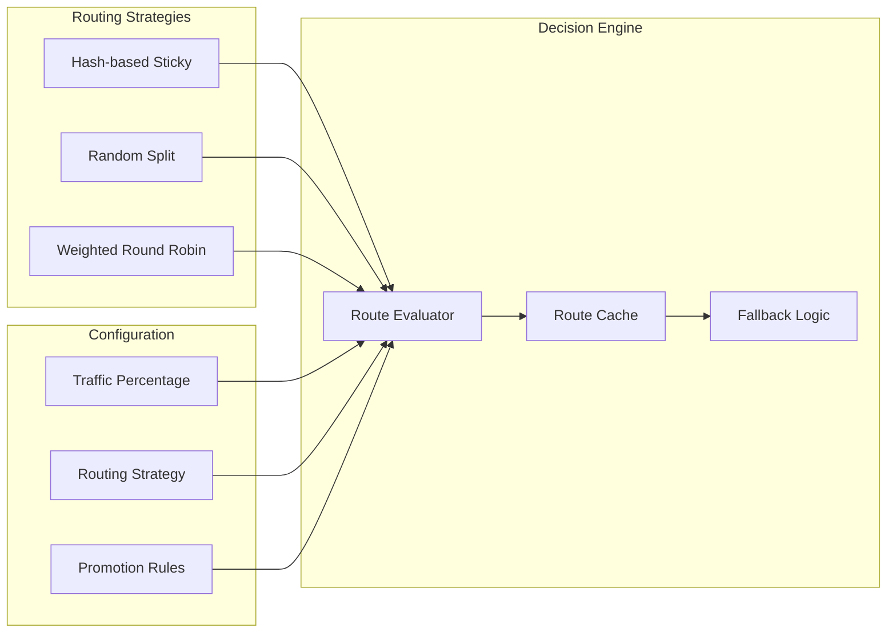
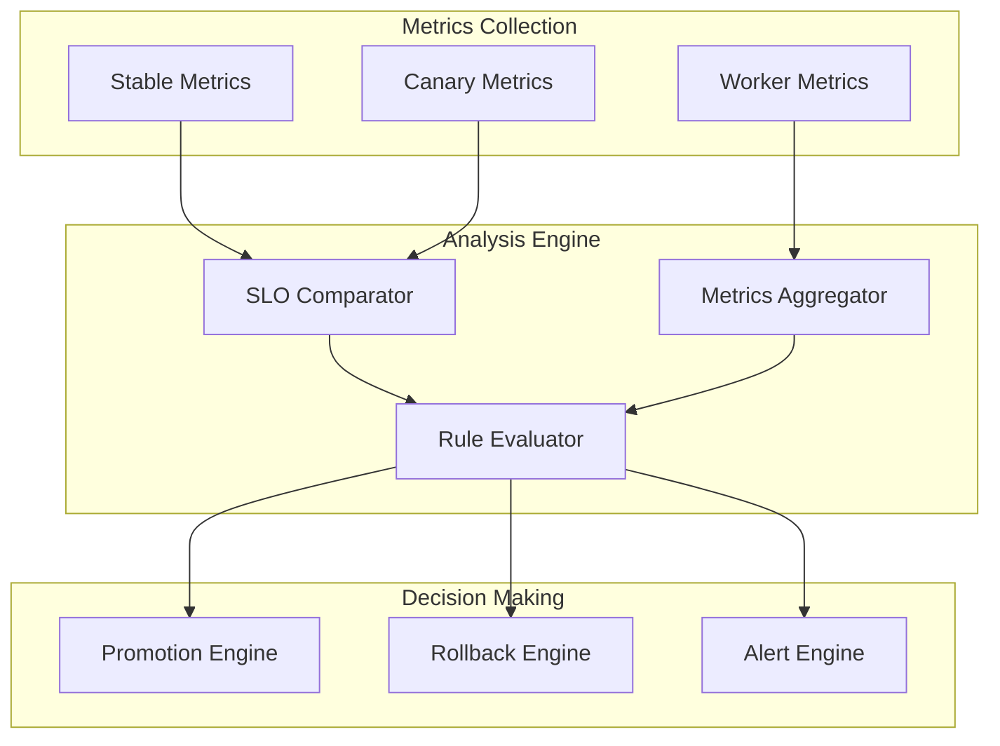
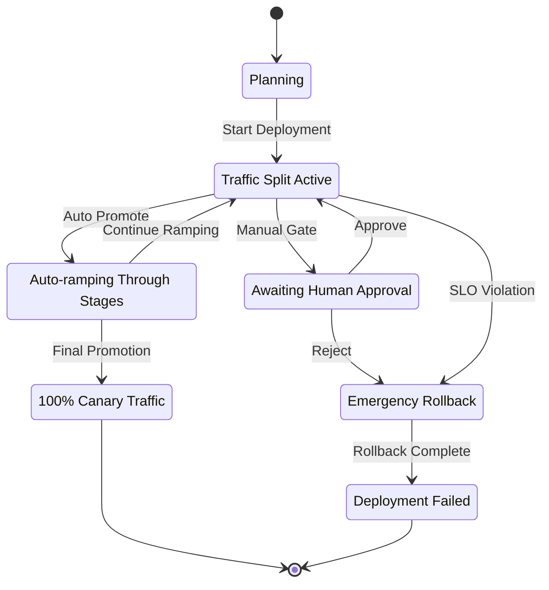
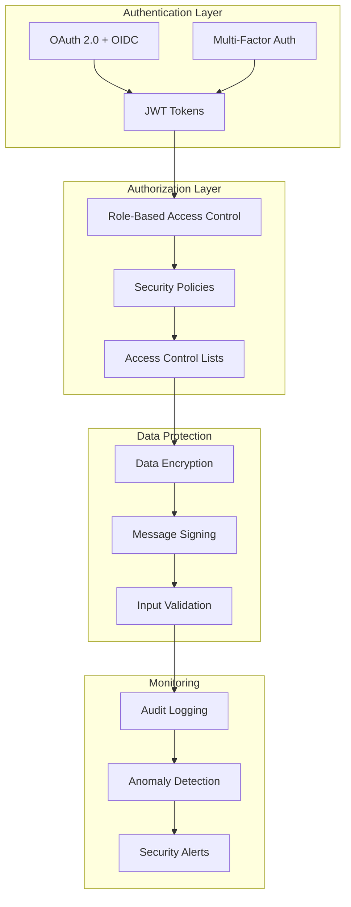

# F013 - Canary Deployments Design Document

## Executive Summary

Canary Deployments bring enterprise-grade deployment safety to job queue workers by intelligently routing a percentage of jobs to new worker versions while monitoring key metrics. This feature enables teams to validate changes in production with minimal risk through automated promotion rules and emergency rollback capabilities.

### Key Benefits
- **Risk Reduction**: Validate changes in production with configurable traffic percentages
- **Automated Decisions**: Data-driven promotion based on SLO metrics
- **Fast Recovery**: Emergency rollback capabilities with job draining
- **Operational Confidence**: Deployment anxiety transformed into data-driven confidence

### Scope
This design covers the complete canary deployment system including:
- Traffic splitting strategies (queue-based and stream-based)
- Metrics collection and SLO monitoring
- Automated promotion and rollback mechanisms
- TUI integration and administrative controls
- Security considerations and performance optimizations

## System Architecture

### High-Level Architecture



### Component Architecture

#### 1. Canary Router

The Canary Router is responsible for intelligent traffic distribution based on configuration rules and deployment status.



#### 2. SLO Monitoring System



#### 3. Deployment State Machine



## Traffic Splitting Strategies

### 1. Queue-Based Strategy (Primary)

**Implementation**: Separate Redis keys for stable and canary traffic

```go
type QueueSplitStrategy struct {
    BaseQueue    string
    CanaryQueue  string  // BaseQueue + "@canary"
    Percentage   int     // 0-100
    StickyHash   bool    // Use job ID for consistency
}

func (qs *QueueSplitStrategy) RouteJob(job *Job) string {
    if qs.StickyHash {
        hash := fnv.New32a()
        hash.Write([]byte(job.ID))
        if int(hash.Sum32()%100) < qs.Percentage {
            return qs.CanaryQueue
        }
        return qs.BaseQueue
    }

    if rand.Intn(100) < qs.Percentage {
        return qs.CanaryQueue
    }
    return qs.BaseQueue
}
```

**Advantages**:
- Clean separation of workloads
- Easy to implement with Redis Lists
- Clear queue depth visibility
- Simple worker configuration

**Trade-offs**:
- Requires queue duplication
- Potential for uneven load distribution

### 2. Stream Groups Strategy (Advanced)

**Implementation**: Single stream with weighted consumer groups

```go
type StreamGroupStrategy struct {
    StreamKey     string
    StableGroup   string
    CanaryGroup   string
    CanaryWeight  float64  // 0.0-1.0
}

func (sgs *StreamGroupStrategy) ConfigureGroups() error {
    // Adjust claiming behavior based on weight
    stableTimeout := time.Duration(float64(baseTimeout) * (1.0 - sgs.CanaryWeight))
    canaryTimeout := time.Duration(float64(baseTimeout) * sgs.CanaryWeight)

    return sgs.updateGroupTimeouts(stableTimeout, canaryTimeout)
}
```

**Advantages**:
- Single message stream
- Maintains message ordering
- Dynamic weight adjustment
- Built-in Redis Streams features

**Trade-offs**:
- More complex implementation
- Requires Redis Streams support

### 3. Consistent Hashing Strategy

**Implementation**: Hash ring for sticky job routing

```go
type ConsistentHashStrategy struct {
    hashRing    *consistent.Map
    stableNodes []string
    canaryNodes []string
}

func (chs *ConsistentHashStrategy) RouteJob(job *Job) string {
    node, err := chs.hashRing.Get(job.ID)
    if err != nil {
        return chs.stableNodes[0] // Fallback
    }
    return node
}

func (chs *ConsistentHashStrategy) UpdateCanaryWeight(percentage int) {
    chs.hashRing.Reset()

    // Add nodes based on percentage
    for i := 0; i < 100-percentage; i++ {
        for _, node := range chs.stableNodes {
            chs.hashRing.Add(fmt.Sprintf("%s-%d", node, i))
        }
    }

    for i := 0; i < percentage; i++ {
        for _, node := range chs.canaryNodes {
            chs.hashRing.Add(fmt.Sprintf("%s-%d", node, i))
        }
    }
}
```

## Data Models

### Core Entities

#### CanaryDeployment

```go
type CanaryDeployment struct {
    ID              string                 `json:"id" bson:"_id"`
    QueueName       string                 `json:"queue_name" bson:"queue_name"`
    TenantID        string                 `json:"tenant_id,omitempty" bson:"tenant_id,omitempty"`

    // Version Information
    StableVersion   string                 `json:"stable_version" bson:"stable_version"`
    CanaryVersion   string                 `json:"canary_version" bson:"canary_version"`

    // Traffic Configuration
    CurrentPercent  int                    `json:"current_percent" bson:"current_percent"`
    TargetPercent   int                    `json:"target_percent" bson:"target_percent"`
    Strategy        RoutingStrategy        `json:"strategy" bson:"strategy"`

    // State Management
    Status          DeploymentStatus       `json:"status" bson:"status"`
    StartTime       time.Time              `json:"start_time" bson:"start_time"`
    LastUpdate      time.Time              `json:"last_update" bson:"last_update"`
    CompletedAt     *time.Time             `json:"completed_at,omitempty" bson:"completed_at,omitempty"`

    // Configuration
    Config          CanaryConfig           `json:"config" bson:"config"`
    Rules           []PromotionRule        `json:"rules" bson:"rules"`

    // Metrics
    StableMetrics   *MetricsSnapshot       `json:"stable_metrics,omitempty" bson:"stable_metrics,omitempty"`
    CanaryMetrics   *MetricsSnapshot       `json:"canary_metrics,omitempty" bson:"canary_metrics,omitempty"`

    // Audit Trail
    Events          []DeploymentEvent      `json:"events" bson:"events"`
    CreatedBy       string                 `json:"created_by" bson:"created_by"`
    LastModifiedBy  string                 `json:"last_modified_by" bson:"last_modified_by"`
}

type DeploymentStatus string

const (
    StatusPlanning    DeploymentStatus = "planning"
    StatusActive      DeploymentStatus = "active"
    StatusRamping     DeploymentStatus = "ramping"
    StatusManualGate  DeploymentStatus = "manual_review"
    StatusPromoting   DeploymentStatus = "promoting"
    StatusRollingBack DeploymentStatus = "rolling_back"
    StatusCompleted   DeploymentStatus = "completed"
    StatusFailed      DeploymentStatus = "failed"
    StatusPaused      DeploymentStatus = "paused"
)

type RoutingStrategy string

const (
    StrategyQueueSplit     RoutingStrategy = "queue_split"
    StrategyStreamGroup    RoutingStrategy = "stream_group"
    StrategyConsistentHash RoutingStrategy = "consistent_hash"
)
```

#### CanaryConfig

```go
type CanaryConfig struct {
    // Traffic Management
    InitialPercent     int               `json:"initial_percent" bson:"initial_percent"`
    MaxPercent         int               `json:"max_percent" bson:"max_percent"`
    StepSize           int               `json:"step_size" bson:"step_size"`
    StepDuration       time.Duration     `json:"step_duration" bson:"step_duration"`

    // Routing Behavior
    StickyRouting      bool              `json:"sticky_routing" bson:"sticky_routing"`
    RoutingStrategy    RoutingStrategy   `json:"routing_strategy" bson:"routing_strategy"`

    // Safety Settings
    MaxDuration        time.Duration     `json:"max_duration" bson:"max_duration"`
    MinDuration        time.Duration     `json:"min_duration" bson:"min_duration"`
    RequireApproval    bool              `json:"require_approval" bson:"require_approval"`
    AutoPromote        bool              `json:"auto_promote" bson:"auto_promote"`

    // Thresholds
    ErrorRateThreshold  float64          `json:"error_rate_threshold" bson:"error_rate_threshold"`
    LatencyThreshold    float64          `json:"latency_threshold" bson:"latency_threshold"`
    ThroughputThreshold float64          `json:"throughput_threshold" bson:"throughput_threshold"`

    // Advanced Configuration
    DrainTimeout        time.Duration    `json:"drain_timeout" bson:"drain_timeout"`
    MonitoringInterval  time.Duration    `json:"monitoring_interval" bson:"monitoring_interval"`
    AlertChannels       []string         `json:"alert_channels" bson:"alert_channels"`

    // Feature Flags
    EnableMetrics       bool             `json:"enable_metrics" bson:"enable_metrics"`
    EnableAlerting      bool             `json:"enable_alerting" bson:"enable_alerting"`
    EnableAutoRollback  bool             `json:"enable_auto_rollback" bson:"enable_auto_rollback"`
}
```

#### MetricsSnapshot

```go
type MetricsSnapshot struct {
    Timestamp       time.Time     `json:"timestamp" bson:"timestamp"`
    TimeWindow      time.Duration `json:"time_window" bson:"time_window"`

    // Processing Metrics
    JobsProcessed   int64         `json:"jobs_processed" bson:"jobs_processed"`
    JobsSucceeded   int64         `json:"jobs_succeeded" bson:"jobs_succeeded"`
    JobsFailed      int64         `json:"jobs_failed" bson:"jobs_failed"`
    ErrorRate       float64       `json:"error_rate" bson:"error_rate"`

    // Latency Metrics
    AvgLatency      time.Duration `json:"avg_latency" bson:"avg_latency"`
    P50Latency      time.Duration `json:"p50_latency" bson:"p50_latency"`
    P95Latency      time.Duration `json:"p95_latency" bson:"p95_latency"`
    P99Latency      time.Duration `json:"p99_latency" bson:"p99_latency"`

    // Throughput Metrics
    JobsPerSecond   float64       `json:"jobs_per_second" bson:"jobs_per_second"`

    // Resource Metrics
    ActiveWorkers   int           `json:"active_workers" bson:"active_workers"`
    QueueDepth      int           `json:"queue_depth" bson:"queue_depth"`
    MemoryUsage     int64         `json:"memory_usage" bson:"memory_usage"`
    CPUUsage        float64       `json:"cpu_usage" bson:"cpu_usage"`

    // Business Metrics (extensible)
    CustomMetrics   map[string]interface{} `json:"custom_metrics,omitempty" bson:"custom_metrics,omitempty"`
}
```

#### PromotionRule

```go
type PromotionRule struct {
    Name         string                 `json:"name" bson:"name"`
    Type         RuleType               `json:"type" bson:"type"`
    Enabled      bool                   `json:"enabled" bson:"enabled"`
    Priority     int                    `json:"priority" bson:"priority"`

    // Rule Configuration
    Conditions   []RuleCondition        `json:"conditions" bson:"conditions"`
    Actions      []RuleAction           `json:"actions" bson:"actions"`

    // Evaluation Settings
    EvaluationInterval time.Duration    `json:"evaluation_interval" bson:"evaluation_interval"`
    CooldownPeriod     time.Duration    `json:"cooldown_period" bson:"cooldown_period"`

    // Metadata
    Description  string                 `json:"description" bson:"description"`
    CreatedBy    string                 `json:"created_by" bson:"created_by"`
    CreatedAt    time.Time              `json:"created_at" bson:"created_at"`
}

type RuleType string

const (
    RuleTypeErrorRate    RuleType = "error_rate"
    RuleTypeLatency      RuleType = "latency"
    RuleTypeThroughput   RuleType = "throughput"
    RuleTypeDuration     RuleType = "duration"
    RuleTypeCustom      RuleType = "custom"
)

type RuleCondition struct {
    Metric     string      `json:"metric" bson:"metric"`
    Operator   string      `json:"operator" bson:"operator"` // "lt", "lte", "gt", "gte", "eq", "ne"
    Value      interface{} `json:"value" bson:"value"`
    Duration   time.Duration `json:"duration,omitempty" bson:"duration,omitempty"`
}

type RuleAction struct {
    Type       ActionType             `json:"type" bson:"type"`
    Parameters map[string]interface{} `json:"parameters" bson:"parameters"`
}

type ActionType string

const (
    ActionPromote    ActionType = "promote"
    ActionRollback   ActionType = "rollback"
    ActionPause      ActionType = "pause"
    ActionAlert      ActionType = "alert"
    ActionCustom     ActionType = "custom"
)
```

## Security Model

### Threat Analysis

#### 1. Unauthorized Deployment Control

**Threat**: Malicious actor gains access to canary deployment controls
**Risk Level**: High
**Impact**: Can manipulate traffic routing, cause service disruption

**Mitigations**:
- Role-based access control (RBAC) for deployment operations
- Multi-factor authentication for critical actions
- Audit logging of all deployment activities
- Rate limiting on deployment API endpoints

#### 2. Metrics Manipulation

**Threat**: Attacker manipulates metrics to trigger false promotions
**Risk Level**: Medium
**Impact**: Poor code gets promoted to production

**Mitigations**:
- Signed metrics from trusted worker sources
- Metrics validation and anomaly detection
- Multiple independent metric sources
- Tamper-evident metric storage

#### 3. Traffic Hijacking

**Threat**: Malicious routing rules redirect traffic inappropriately
**Risk Level**: Medium
**Impact**: Data exfiltration or processing manipulation

**Mitigations**:
- Cryptographic verification of routing rules
- Network segmentation between stable and canary workers
- Monitoring for unexpected traffic patterns
- Emergency circuit breakers

#### 4. Worker Impersonation

**Threat**: Fake workers register with canary version information
**Risk Level**: Medium
**Impact**: Skewed metrics, deployment decisions based on false data

**Mitigations**:
- Worker authentication and certificate validation
- Heartbeat verification with challenge/response
- Worker registration audit trails
- Automated worker health verification

### Security Architecture



### Access Control Matrix

| Role | Create Deployment | Modify Traffic | Promote/Rollback | View Metrics | Emergency Actions |
|------|------------------|----------------|------------------|--------------|-------------------|
| Developer | ❌ | ❌ | ❌ | ✅ | ❌ |
| SRE | ✅ | ✅ | ✅ | ✅ | ✅ |
| Release Manager | ✅ | ✅ | ✅ | ✅ | ✅ |
| DevOps Lead | ✅ | ✅ | ✅ | ✅ | ✅ |
| Viewer | ❌ | ❌ | ❌ | ✅ | ❌ |

## Performance Requirements

### Latency Requirements

| Operation | Target Latency | Max Latency | Notes |
|-----------|---------------|-------------|-------|
| Job Routing Decision | < 1ms | < 5ms | Per job routing overhead |
| Metrics Collection | < 100ms | < 500ms | Per collection cycle |
| Rule Evaluation | < 50ms | < 200ms | Per rule evaluation |
| Promotion/Rollback | < 2s | < 10s | State change operations |
| Emergency Rollback | < 5s | < 30s | Critical path optimization |

### Throughput Requirements

| Metric | Minimum | Target | Notes |
|--------|---------|--------|-------|
| Jobs/Second | 1,000 | 10,000 | Per queue routing capacity |
| Concurrent Deployments | 10 | 50 | Active canary deployments |
| API Requests/Second | 100 | 1,000 | Control plane operations |
| Metric Updates/Second | 50 | 200 | Real-time monitoring |

### Resource Requirements

| Component | CPU | Memory | Storage | Network |
|-----------|-----|--------|---------|---------|
| Canary Controller | 0.5 cores | 512MB | 1GB | 10Mbps |
| Metrics Collector | 0.25 cores | 256MB | 5GB | 50Mbps |
| Router Component | 0.1 cores | 128MB | 100MB | 100Mbps |
| Worker Registry | 0.25 cores | 256MB | 2GB | 10Mbps |

### Scalability Targets

- **Horizontal Scaling**: Support 10x current load through horizontal scaling
- **Geographic Distribution**: Multi-region deployment support
- **Tenant Isolation**: 1000+ isolated tenant deployments
- **Queue Scaling**: 500+ queues with active canary deployments

## Testing Strategy

### Unit Testing

**Coverage Target**: 90% code coverage

**Test Categories**:
1. **Routing Logic Tests**
   - Hash distribution verification
   - Percentage accuracy validation
   - Edge case handling (0%, 100%)
   - Sticky routing consistency

2. **Metrics Processing Tests**
   - Aggregation accuracy
   - Time window calculations
   - SLO threshold evaluation
   - Custom metrics handling

3. **State Machine Tests**
   - Valid state transitions
   - Invalid transition rejection
   - Timeout handling
   - Concurrent state changes

4. **Rule Engine Tests**
   - Rule evaluation logic
   - Condition matching
   - Action execution
   - Priority handling

### Integration Testing

**Test Scenarios**:

1. **End-to-End Canary Flow**
   ```bash
   # Setup test environment
   docker-compose -f test/canary-test.yml up -d

   # Deploy canary with 10% traffic
   curl -X POST /api/v1/deployments \
     -d '{"queue":"test-queue","canary_version":"v1.1","percentage":10}'

   # Inject test jobs and verify routing
   ./test/inject-jobs.sh --count=1000 --queue=test-queue

   # Verify metrics collection
   ./test/verify-metrics.sh --deployment-id=$DEPLOYMENT_ID

   # Test promotion
   curl -X POST /api/v1/deployments/$DEPLOYMENT_ID/promote

   # Cleanup
   docker-compose -f test/canary-test.yml down
   ```

2. **Failure Scenario Testing**
   - Worker crash during canary
   - Network partition scenarios
   - Metrics collection failures
   - Rollback under load

3. **Performance Testing**
   - Load testing with 10,000 jobs/second
   - Memory usage under sustained load
   - Latency impact measurement
   - Concurrent deployment stress testing

### System Testing

**Production-Like Testing**:

1. **Staging Environment Validation**
   - Full production topology
   - Real data volumes
   - Realistic failure injection
   - Security penetration testing

2. **Chaos Engineering**
   - Random worker termination
   - Network latency injection
   - Resource exhaustion scenarios
   - Configuration corruption

3. **Disaster Recovery Testing**
   - Control plane failover
   - Data recovery validation
   - Cross-region deployment
   - Emergency rollback procedures

### Test Automation

```yaml
# CI/CD Pipeline Integration
stages:
  - unit_tests:
      command: go test ./... -race -coverprofile=coverage.out
      coverage_threshold: 90%

  - integration_tests:
      command: make test-integration
      timeout: 30m
      requires: [redis, postgres]

  - performance_tests:
      command: make test-performance
      timeout: 60m
      only: [main, release/*]

  - security_tests:
      command: make test-security
      timeout: 30m
      requires: [security-scanner]
```

### Test Data Management

**Test Fixtures**:
- Predefined deployment configurations
- Sample metric datasets
- Worker registration data
- Rule configuration templates

**Test Environment**:
- Isolated Redis instances per test
- Configurable worker simulators
- Metric data generators
- Traffic pattern simulators

## Implementation Phases

### Phase 1: Core Infrastructure (Weeks 1-2)
- Basic canary deployment data models
- Queue-based traffic splitting
- Simple percentage-based routing
- Basic metrics collection

### Phase 2: Control Plane (Weeks 3-4)
- Admin API for deployment management
- Rule engine for automated decisions
- TUI integration for visualization
- Audit logging and security

### Phase 3: Advanced Features (Weeks 5-6)
- Stream groups strategy
- Consistent hashing routing
- Emergency rollback system
- Performance optimization

### Phase 4: Production Readiness (Weeks 7-8)
- Comprehensive testing
- Documentation completion
- Security hardening
- Performance validation

## Risk Assessment

### Technical Risks

| Risk | Probability | Impact | Mitigation |
|------|------------|--------|------------|
| Routing Performance Degradation | Medium | High | Performance testing, optimization |
| State Synchronization Issues | Low | High | Leader election, distributed locks |
| Metrics Collection Overload | Medium | Medium | Sampling, aggregation strategies |
| Complex Edge Cases | High | Medium | Comprehensive testing, fallbacks |

### Operational Risks

| Risk | Probability | Impact | Mitigation |
|------|------------|--------|------------|
| Incorrect Traffic Routing | Low | High | Extensive validation, monitoring |
| Human Error in Operations | Medium | High | UI safeguards, confirmation dialogs |
| Dependency Service Failures | Medium | Medium | Circuit breakers, graceful degradation |
| Configuration Drift | Low | Medium | Configuration validation, versioning |

## Success Metrics

### Technical Metrics
- **Routing Accuracy**: >99.9% jobs routed correctly
- **Latency Overhead**: <1ms additional latency per job
- **System Availability**: >99.95% uptime for canary system
- **Error Rate**: <0.1% failed routing decisions

### Business Metrics
- **Deployment Confidence**: 95% of deployments use canary process
- **Rollback Rate**: <5% of canary deployments require rollback
- **Detection Speed**: Issues detected within 2 minutes
- **Recovery Time**: Emergency rollbacks complete within 30 seconds

### User Experience Metrics
- **API Response Time**: <100ms for 95% of control operations
- **TUI Responsiveness**: <500ms for UI interactions
- **Documentation Coverage**: 100% of features documented
- **User Satisfaction**: >4.5/5 in user surveys

## Conclusion

This design provides a comprehensive foundation for implementing canary deployments in the job queue system. The architecture balances flexibility with safety, providing multiple routing strategies while maintaining strict SLO monitoring and emergency rollback capabilities.

The phased implementation approach allows for iterative development and validation, ensuring each component is thoroughly tested before moving to the next phase. The emphasis on security, performance, and operational excellence ensures the system will meet enterprise-grade requirements.

Key design decisions prioritize:
- **Safety First**: Multiple safety mechanisms and rollback capabilities
- **Operational Excellence**: Comprehensive monitoring and alerting
- **Developer Experience**: Intuitive APIs and TUI integration
- **Scalability**: Horizontal scaling and multi-tenant support
- **Flexibility**: Multiple routing strategies and extensible rule engine

This design serves as the blueprint for implementing a production-ready canary deployment system that will significantly improve deployment confidence and reduce production risks.