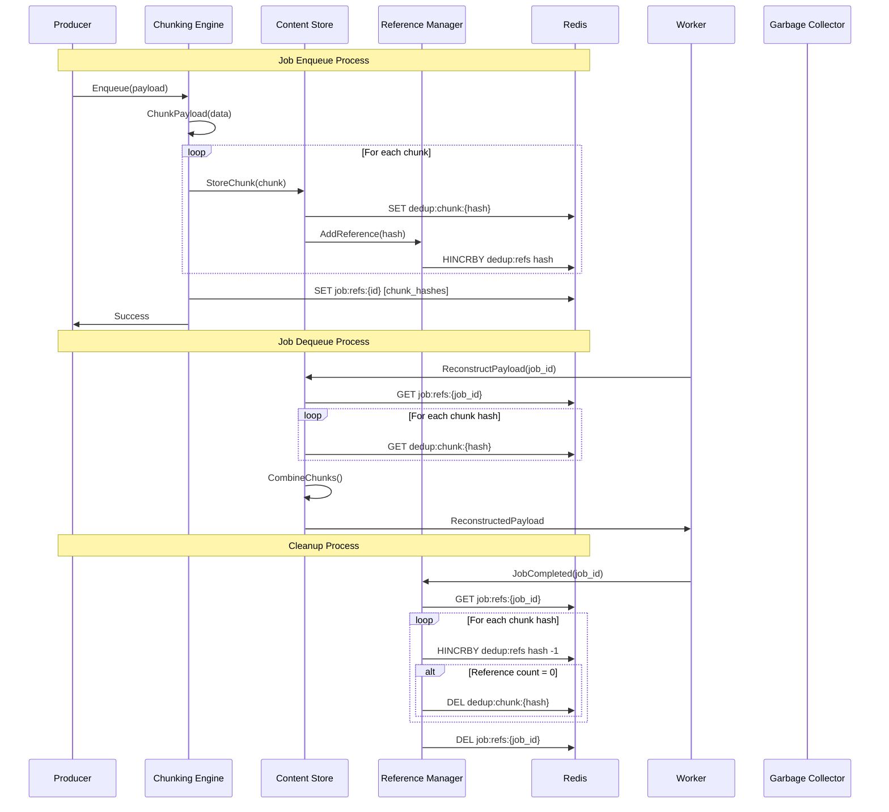

# Smart Payload Deduplication (F015) - Design Document

**Version:** 1.0
**Date:** 2025-09-14
**Status:** Draft
**Author:** Claude (Worker 6)
**Reviewers:** TBD

## Executive Summary

Smart Payload Deduplication is an advanced storage optimization system that reduces Redis memory usage by 50-90% for repetitive job workloads. The system employs content-addressable storage with intelligent chunking algorithms to detect and consolidate duplicate content across job payloads, while remaining completely transparent to application code.

The solution leverages proven techniques from version control systems and backup software, including rolling hash fingerprinting (Rabin polynomials) for content-based chunking, SHA-256 for content addressing, and reference counting for safe garbage collection. Integration with the existing queue infrastructure requires no changes to producer or consumer code, making adoption seamless.

### Key Benefits

- **Massive Memory Savings**: 50-90% reduction in Redis memory usage for typical workloads
- **Cost Optimization**: Dramatic reduction in infrastructure costs for high-volume queues
- **Transparent Integration**: Zero changes required to existing application code
- **Intelligent Detection**: Advanced algorithms identify similarity even in non-identical payloads
- **Production Safety**: Comprehensive checksums, atomic operations, and fallback mechanisms
- **Operational Visibility**: Real-time metrics and tuning capabilities for administrators

### Architecture Overview

```mermaid
graph TB
    subgraph "Application Layer"
        A[Producer API]
        B[Worker API]
    end

    subgraph "Deduplication Engine"
        C[Chunking Engine]
        D[Content Store]
        E[Reference Manager]
        F[Similarity Detector]
        G[Compression Layer]
    end

    subgraph "Storage Layer"
        H[Chunk Store<br/>dedup:chunk:{hash}]
        I[Reference Index<br/>dedup:refs:{job_id}]
        J[Statistics<br/>dedup:stats]
        K[Original Payloads<br/>job:payload:{id}]
    end

    A --> C
    B --> D
    C --> D
    D --> H
    E --> I
    F --> D
    G --> H

    style A fill:#e1f5fe
    style B fill:#e1f5fe
    style C fill:#f3e5f5
    style D fill:#f3e5f5
    style E fill:#f3e5f5
    style F fill:#f3e5f5
    style G fill:#f3e5f5
    style H fill:#fff3e0
    style I fill:#fff3e0
    style J fill:#fff3e0
    style K fill:#fff3e0
```

## System Architecture

### Core Components

#### 1. Chunking Engine
The Chunking Engine uses content-based splitting to break payloads into variable-sized chunks that align with data boundaries. This approach maximizes deduplication effectiveness by ensuring common content appears in the same chunks across different payloads.

**Algorithm**: Rabin fingerprinting with rolling hash
- **Window Size**: 64 bytes for hash calculation
- **Average Chunk Size**: 8KB (configurable)
- **Chunk Size Range**: 2KB - 32KB
- **Boundary Detection**: Hash modulo for statistical uniformity

#### 2. Content Store
Content-addressable storage where chunks are identified by their SHA-256 hash. This ensures data integrity while enabling global deduplication across all jobs and queues.

**Features**:
- SHA-256 content addressing for data integrity
- Atomic chunk storage with existence checks
- Collision detection and alternate key handling
- Configurable TTL for automatic cleanup

#### 3. Reference Manager
Maintains atomic reference counts for each chunk to enable safe garbage collection. Uses Redis hash operations for atomicity and includes self-healing mechanisms for reference count auditing.

**Operations**:
- Atomic increment/decrement of chunk references
- Orphaned chunk detection and cleanup
- Reference count auditing and repair
- Bulk operations for performance optimization

#### 4. Similarity Detector
Advanced near-duplicate detection using locality-sensitive hashing (LSH) to identify payloads that share significant content even when not identical.

**Techniques**:
- MinHash signatures for content fingerprinting
- LSH banding for efficient similarity queries
- Configurable similarity thresholds
- Template detection for structured data

#### 5. Compression Layer
Intelligent compression using zstd with learned dictionaries optimized for the payload corpus. Provides additional space savings on top of deduplication.

**Features**:
- Dictionary learning from sample payloads
- Streaming compression for large payloads
- Configurable compression levels
- Fallback to uncompressed storage

### Data Flow Architecture



### Storage Schema

#### Chunk Storage
```
Key: dedup:chunk:{sha256_hash}
Value: Compressed chunk data
TTL: Configurable (default: 7 days from last access)
```

#### Reference Counting
```
Key: dedup:refs
Type: Hash
Fields: {chunk_hash}: {reference_count}
TTL: 24 hours (refreshed on access)
```

#### Job References
```
Key: dedup:refs:{job_id}
Value: JSON array of chunk hashes
TTL: Matches job TTL
```

#### Statistics
```
Key: dedup:stats:{date}
Type: Hash
Fields:
- total_payloads: count
- total_chunks: count
- bytes_original: sum
- bytes_deduplicated: sum
- savings_ratio: percentage
- popular_chunks: top 10 most referenced
```

### Integration Points

#### Producer Integration
```go
type Producer struct {
    deduplicationEngine *DeduplicationEngine
    config             *ProducerConfig
    fallbackEnabled    bool
}

func (p *Producer) Enqueue(ctx context.Context, job *Job) error {
    if p.config.DeduplicationEnabled {
        // Attempt deduplication
        chunkRefs, err := p.deduplicationEngine.DeduplicatePayload(
            ctx, job.ID, job.Payload)
        if err != nil && p.fallbackEnabled {
            // Fall back to direct storage
            return p.enqueueDirect(ctx, job)
        }
        job.ChunkRefs = chunkRefs
        job.Payload = nil // Clear original payload
    }
    return p.enqueueDirect(ctx, job)
}
```

#### Worker Integration
```go
type Worker struct {
    deduplicationEngine *DeduplicationEngine
    config             *WorkerConfig
}

func (w *Worker) Dequeue(ctx context.Context) (*Job, error) {
    job, err := w.dequeueJob(ctx)
    if err != nil {
        return nil, err
    }

    if len(job.ChunkRefs) > 0 {
        // Reconstruct payload from chunks
        payload, err := w.deduplicationEngine.ReconstructPayload(
            ctx, job.ChunkRefs)
        if err != nil {
            return nil, fmt.Errorf("payload reconstruction failed: %w", err)
        }
        job.Payload = payload
    }

    return job, nil
}
```

### Performance Characteristics

#### Memory Usage
- **Chunk Overhead**: ~64 bytes per chunk (hash + metadata)
- **Reference Overhead**: ~32 bytes per reference
- **Index Overhead**: ~16 bytes per payload
- **Net Savings**: 50-90% depending on payload similarity

#### Latency Impact
- **Deduplication**: 5-15ms for typical 100KB payloads
- **Reconstruction**: 2-8ms for typical chunk counts
- **Network Overhead**: Minimal due to local Redis operations
- **Total Overhead**: <10ms end-to-end for most workloads

#### Throughput Scaling
- **Linear Scaling**: Performance scales with Redis capacity
- **Chunk Reuse**: Higher reuse ratios improve performance
- **Compression**: Reduces network and storage I/O
- **Batching**: Bulk operations for high-throughput scenarios

### Security Model

#### Data Integrity
- **Content Addressing**: SHA-256 ensures data integrity
- **Collision Detection**: Handle theoretical hash collisions
- **Checksum Verification**: Validate chunks on reconstruction
- **Atomic Operations**: Prevent partial updates

#### Access Control
- **Namespace Isolation**: Tenant-specific chunk prefixes
- **Redis ACLs**: Restrict access to deduplication keys
- **Audit Logging**: Track chunk access and modifications
- **Encryption**: Support for Redis encryption at rest

#### Attack Vectors and Mitigations

| Attack Vector | Risk Level | Mitigation |
|--------------|------------|------------|
| Hash Collision | Low | Collision detection + alternate keys |
| Reference Manipulation | Medium | Atomic operations + auditing |
| Chunk Corruption | Medium | SHA-256 verification + checksums |
| Memory Exhaustion | High | Garbage collection + TTLs |
| Timing Attacks | Low | Constant-time operations where possible |

### Monitoring and Observability

#### Key Metrics
```go
type DeduplicationMetrics struct {
    // Performance Metrics
    DeduplicationLatency   prometheus.Histogram
    ReconstructionLatency  prometheus.Histogram
    CompressionRatio       prometheus.Gauge

    // Effectiveness Metrics
    SavingsRatio          prometheus.Gauge
    ChunkReuseRate        prometheus.Gauge
    PopularChunks         prometheus.Gauge

    // System Health
    ChunkStoreSize        prometheus.Gauge
    ReferenceCountErrors  prometheus.Counter
    GarbageCollectionTime prometheus.Histogram
    FallbackRate          prometheus.Gauge
}
```

#### Dashboard Views
1. **Executive Dashboard**: High-level savings and cost impact
2. **Performance Dashboard**: Latency percentiles and throughput
3. **System Health**: Error rates and resource utilization
4. **Tuning Dashboard**: Configuration optimization recommendations

### Configuration Management

#### Runtime Configuration
```yaml
deduplication:
  enabled: true
  chunking:
    algorithm: "rabin"
    min_chunk_size: 2048
    max_chunk_size: 32768
    avg_chunk_size: 8192
    window_size: 64

  compression:
    enabled: true
    algorithm: "zstd"
    level: 3
    dictionary_size: 65536

  similarity:
    enabled: true
    threshold: 0.8
    lsh_bands: 20
    lsh_rows: 5

  garbage_collection:
    interval: "1h"
    batch_size: 1000
    orphan_age: "24h"

  fallback:
    enabled: true
    timeout: "5s"
    error_threshold: 0.1

  monitoring:
    metrics_enabled: true
    sample_rate: 1.0
    stats_retention: "30d"
```

#### Feature Flags
```go
type FeatureFlags struct {
    DeduplicationEnabled    bool
    CompressionEnabled      bool
    SimilarityEnabled       bool
    FallbackEnabled         bool
    MetricsEnabled          bool
    SafetyModeEnabled       bool
    GradualMigrationEnabled bool
}
```

## Performance Requirements

### Latency Requirements
- **P50 Deduplication Latency**: < 5ms for payloads up to 100KB
- **P95 Deduplication Latency**: < 15ms for payloads up to 100KB
- **P99 Reconstruction Latency**: < 10ms for typical chunk counts
- **End-to-End Overhead**: < 10ms total added latency

### Throughput Requirements
- **Minimum Throughput**: 10,000 jobs/second on standard Redis instance
- **Peak Throughput**: 50,000 jobs/second with optimized configuration
- **Scaling Factor**: Linear scaling with Redis cluster size
- **Degradation Threshold**: < 5% throughput loss under 95% memory savings

### Memory Efficiency
- **Minimum Savings**: 50% memory reduction for repetitive workloads
- **Target Savings**: 70-90% memory reduction for typical enterprise workloads
- **Overhead Limit**: < 5% metadata overhead relative to savings
- **Garbage Collection**: < 1% storage growth per day from orphaned chunks

### Reliability Requirements
- **Availability**: 99.9% uptime for deduplication service
- **Data Integrity**: Zero data loss with checksum verification
- **Recovery Time**: < 5 minutes for service restart scenarios
- **Graceful Degradation**: Automatic fallback to non-deduped storage

## Testing Strategy

### Unit Testing
```
Coverage Target: 90%+
Focus Areas:
- Chunking algorithm correctness
- Hash computation and collision handling
- Reference counting atomicity
- Compression/decompression round-trips
- Error handling and edge cases
```

### Integration Testing
```
Scenarios:
- End-to-end deduplication workflow
- Multi-tenant chunk isolation
- Garbage collection under load
- Fallback behavior during failures
- Configuration changes without restart
```

### Performance Testing
```
Load Profiles:
- Baseline: 10,000 jobs/sec with no deduplication
- Standard: 10,000 jobs/sec with 70% deduplication
- Peak: 50,000 jobs/sec with varying deduplication ratios
- Stress: Memory pressure and chunk store exhaustion
```

### Security Testing
```
Attack Simulations:
- Hash collision injection attempts
- Reference count manipulation
- Chunk corruption scenarios
- Memory exhaustion attacks
- Cross-tenant data access attempts
```

### Chaos Testing
```
Failure Scenarios:
- Redis instance failures during deduplication
- Network partitions between components
- Partial chunk corruption
- Reference count inconsistencies
- Clock skew and timestamp issues
```

## Deployment Plan

### Migration Strategy

#### Phase 1: Foundation (Weeks 1-2)
- Deploy deduplication infrastructure
- Configure monitoring and metrics
- Implement safety mechanisms and fallbacks
- Validate system health on staging

#### Phase 2: Gradual Rollout (Weeks 3-4)
- Enable deduplication for 5% of traffic
- Monitor performance and error rates
- Adjust configuration based on real-world data
- Scale to 25% traffic if successful

#### Phase 3: Production Scale (Weeks 5-6)
- Scale to 50% traffic with close monitoring
- Optimize chunk sizes based on payload analysis
- Enable compression and similarity detection
- Scale to 100% traffic for selected queues

#### Phase 4: Full Deployment (Weeks 7-8)
- Enable for all queues with appropriate configuration
- Optimize garbage collection schedules
- Implement cross-queue deduplication
- Document operational procedures

### Rollback Plan
1. **Immediate Rollback**: Disable deduplication via feature flag
2. **Data Recovery**: Reconstruct all payloads to original format
3. **Infrastructure Cleanup**: Remove deduplication keys and indices
4. **Monitoring**: Verify system returns to baseline performance

### Operational Readiness

#### Monitoring Setup
- Prometheus metrics collection and alerting
- Grafana dashboards for operational visibility
- PagerDuty integration for critical errors
- Log aggregation for troubleshooting

#### Documentation
- Runbook for common operational scenarios
- Troubleshooting guide for performance issues
- Configuration tuning recommendations
- Disaster recovery procedures

#### Training
- Operations team training on new metrics and alerts
- Development team training on debugging procedures
- Architecture review with engineering leadership
- Incident response procedure updates

---

## Security Threat Model

### Threat Categories

#### Data Integrity Threats
**T1: Hash Collision Attacks**
- **Risk**: Malicious payloads with crafted SHA-256 collisions
- **Impact**: Data corruption or unauthorized access
- **Mitigation**: Collision detection with content verification
- **Likelihood**: Very Low
- **Severity**: High

**T2: Chunk Corruption**
- **Risk**: Storage corruption affecting reconstructed payloads
- **Impact**: Job processing failures or data loss
- **Mitigation**: Checksums and verification on reconstruction
- **Likelihood**: Low
- **Severity**: Medium

#### Availability Threats
**T3: Memory Exhaustion**
- **Risk**: Unbounded chunk growth due to failed garbage collection
- **Impact**: Redis memory exhaustion and service degradation
- **Mitigation**: TTLs, monitoring, and emergency cleanup procedures
- **Likelihood**: Medium
- **Severity**: High

**T4: Reference Count Manipulation**
- **Risk**: Malicious modification of reference counts
- **Impact**: Premature chunk deletion or memory leaks
- **Mitigation**: Redis ACLs and atomic operations
- **Likelihood**: Low
- **Severity**: Medium

#### Confidentiality Threats
**T5: Cross-Tenant Data Leakage**
- **Risk**: Shared chunks exposing data between tenants
- **Impact**: Confidential data disclosure
- **Mitigation**: Tenant-specific namespacing and access controls
- **Likelihood**: Medium
- **Severity**: High

**T6: Chunk Enumeration**
- **Risk**: Attackers discovering chunks through hash enumeration
- **Impact**: Information disclosure about payload contents
- **Mitigation**: Hash unpredictability and access logging
- **Likelihood**: Low
- **Severity**: Low

### Security Controls

#### Preventive Controls
- Redis ACLs restricting access to deduplication keys
- Input validation on all chunk operations
- Tenant isolation through namespaced keys
- Rate limiting on chunk store operations

#### Detective Controls
- Audit logging for all chunk access operations
- Anomaly detection for unusual access patterns
- Reference count consistency monitoring
- Regular security scanning of Redis instances

#### Corrective Controls
- Automated chunk integrity verification
- Reference count auditing and repair procedures
- Emergency chunk cleanup mechanisms
- Incident response procedures for data integrity issues

---

This design document establishes the foundation for implementing Smart Payload Deduplication as a production-ready feature that delivers significant memory savings while maintaining the reliability and security standards required for enterprise queue systems.

The next steps involve creating the detailed API specification and data models that will guide the implementation phase.