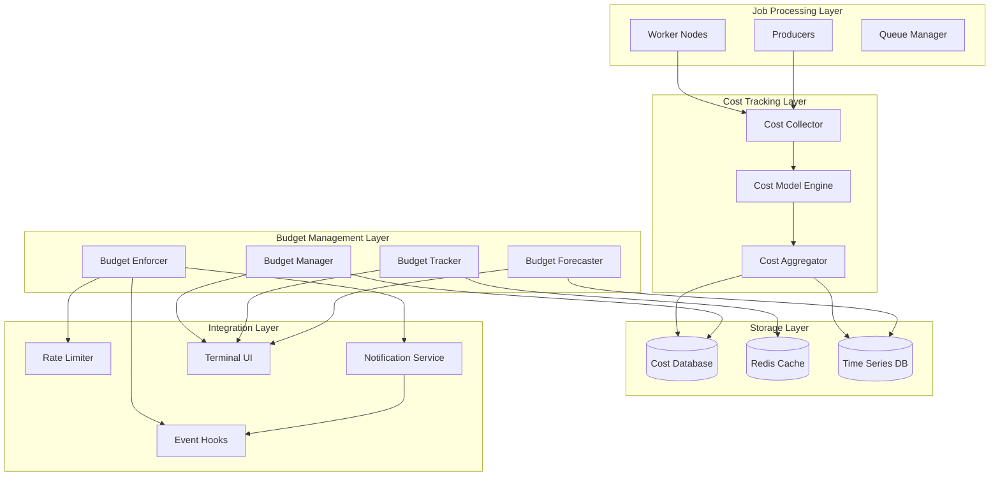
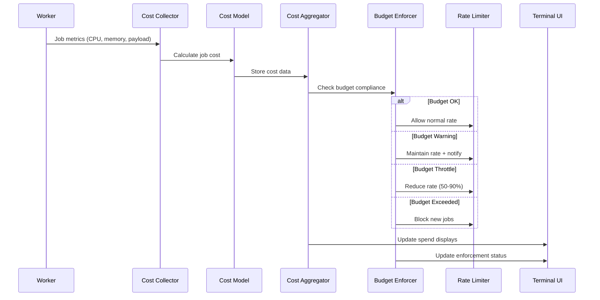
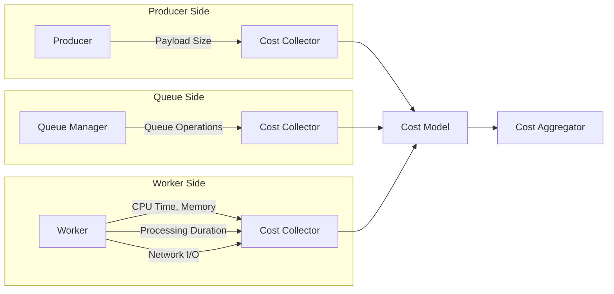
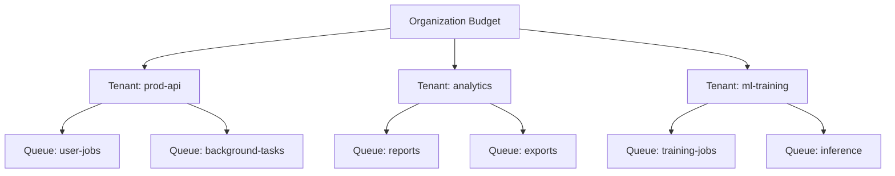
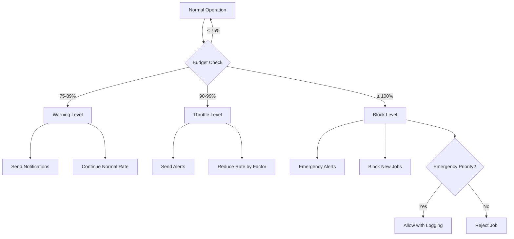
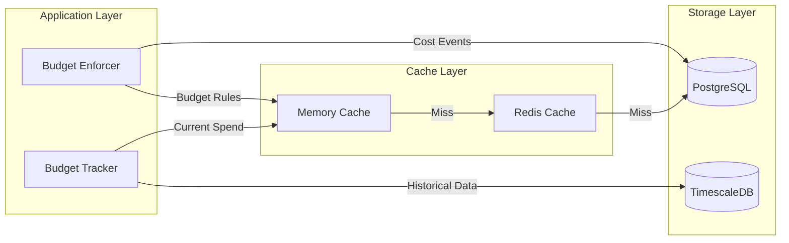
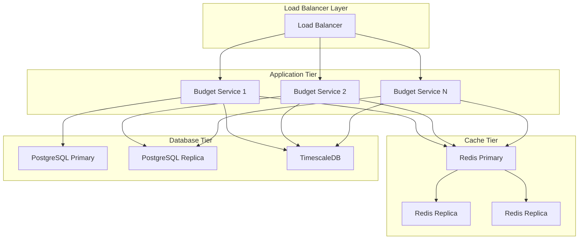
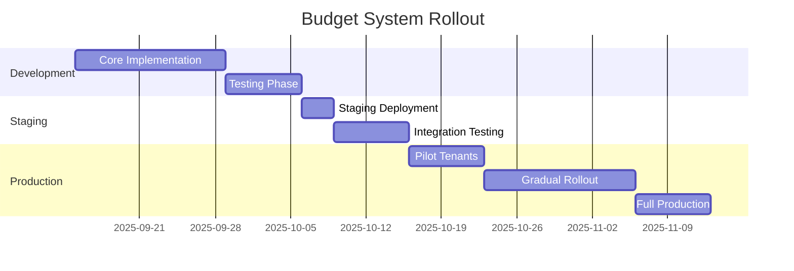

# Job Budgeting System Design

**Feature ID**: F016
**Version**: 1.0
**Date**: 2025-09-14
**Status**: Design Phase

## Executive Summary

The Job Budgeting system transforms queue cost management from reactive monitoring into proactive financial governance. By implementing real-time cost tracking, intelligent forecasting, and graduated enforcement mechanisms, this system enables organizations to control infrastructure spending while maintaining service quality.

The system calculates job costs using a weighted model based on CPU time, memory consumption, payload size, and infrastructure overhead. These costs aggregate into tenant-level and queue-level budgets with configurable thresholds that trigger warnings, throttling, or blocking through a graduated enforcement ladder.

### Key Benefits

- **Cost Transparency**: Real-time visibility into job economics with detailed cost attribution
- **Proactive Control**: Forecasting and early warning systems prevent budget surprises
- **Graduated Enforcement**: Maintain service quality while controlling costs through smart throttling
- **Financial Accountability**: Enable chargeback, showback, and informed resource prioritization

## System Architecture

### High-Level Component Diagram



### Data Flow Architecture



## Cost Model Design

### Core Cost Calculation

The cost model uses a weighted formula that captures true resource consumption:

**Cost Formula:**
```
TotalCost = (
    BaseJobCost +
    (CPUTimeSeconds × CPUTimeWeight) +
    (MemoryMBSeconds × MemoryWeight) +
    (PayloadKB × PayloadWeight) +
    (RedisOperations × RedisOpsWeight) +
    (NetworkMB × NetworkWeight)
) × EnvironmentMultiplier
```

### Cost Model Configuration

```yaml
cost_model:
  weights:
    base_job_cost: 0.001        # $0.001 per job
    cpu_time_weight: 0.01       # $0.01 per CPU second
    memory_weight: 0.0001       # $0.0001 per MB·second
    payload_weight: 0.00001     # $0.00001 per KB
    redis_ops_weight: 0.000001  # $0.000001 per operation
    network_weight: 0.0001      # $0.0001 per MB

  environment_multipliers:
    production: 1.0
    staging: 0.3
    development: 0.1

  calibration:
    benchmark_jobs: 1000
    recalibration_interval: "7d"
    drift_threshold: 0.15       # 15% model drift triggers recalibration
```

### Cost Collection Points



## Budget Management System

### Budget Hierarchy



### Budget Configuration Schema

```json
{
  "budget": {
    "id": "budget_prod_api_202509",
    "tenant_id": "prod-api",
    "queue_name": null,
    "period": {
      "type": "monthly",
      "start_date": "2025-09-01T00:00:00Z",
      "end_date": "2025-09-30T23:59:59Z"
    },
    "amount": 1200.00,
    "currency": "USD",
    "thresholds": {
      "warning": 0.75,
      "throttle": 0.90,
      "block": 1.00
    },
    "enforcement_policy": {
      "warn_only": false,
      "throttle_factor": 0.5,
      "block_new_jobs": true,
      "allow_emergency_bypass": true,
      "emergency_priorities": ["critical", "urgent"]
    },
    "notifications": [
      {
        "type": "email",
        "addresses": ["ops@company.com"],
        "events": ["warning", "throttle", "block"]
      },
      {
        "type": "slack",
        "webhook": "https://hooks.slack.com/...",
        "events": ["throttle", "block"]
      }
    ]
  }
}
```

## Enforcement Ladder Implementation

### Enforcement Levels



### Enforcement Decision Logic

```go
type EnforcementDecision struct {
    Action         EnforcementAction `json:"action"`
    ThrottleFactor float64          `json:"throttle_factor,omitempty"`
    BlockReason    string           `json:"block_reason,omitempty"`
    AllowReason    string           `json:"allow_reason,omitempty"`
    BudgetInfo     BudgetStatus     `json:"budget_info"`
}

type EnforcementAction string

const (
    ActionAllow    EnforcementAction = "allow"
    ActionWarn     EnforcementAction = "warn"
    ActionThrottle EnforcementAction = "throttle"
    ActionBlock    EnforcementAction = "block"
)

func (e *BudgetEnforcer) EvaluateEnforcement(
    tenantID string,
    queueName string,
    jobPriority Priority,
) EnforcementDecision {
    budget := e.getBudget(tenantID, queueName)
    if budget == nil {
        return EnforcementDecision{Action: ActionAllow}
    }

    currentSpend := e.getCurrentSpend(tenantID, queueName)
    utilization := currentSpend / budget.Amount

    // Emergency bypass check
    if utilization >= budget.Thresholds.Block &&
       budget.EnforcementPolicy.AllowEmergencyBypass &&
       isEmergencyPriority(jobPriority, budget.EnforcementPolicy.EmergencyPriorities) {
        return EnforcementDecision{
            Action:      ActionAllow,
            AllowReason: "Emergency priority bypass",
            BudgetInfo:  e.getBudgetStatus(budget, currentSpend),
        }
    }

    switch {
    case utilization >= budget.Thresholds.Block:
        return EnforcementDecision{
            Action:      ActionBlock,
            BlockReason: fmt.Sprintf("Budget exceeded: $%.2f/$%.2f", currentSpend, budget.Amount),
            BudgetInfo:  e.getBudgetStatus(budget, currentSpend),
        }

    case utilization >= budget.Thresholds.Throttle:
        return EnforcementDecision{
            Action:         ActionThrottle,
            ThrottleFactor: budget.EnforcementPolicy.ThrottleFactor,
            BudgetInfo:     e.getBudgetStatus(budget, currentSpend),
        }

    case utilization >= budget.Thresholds.Warning:
        return EnforcementDecision{
            Action:     ActionWarn,
            BudgetInfo: e.getBudgetStatus(budget, currentSpend),
        }

    default:
        return EnforcementDecision{
            Action:     ActionAllow,
            BudgetInfo: e.getBudgetStatus(budget, currentSpend),
        }
    }
}
```

## Forecasting Engine

### Forecasting Algorithm

The forecasting engine uses multiple techniques to predict spending patterns:

1. **Linear Trend Analysis**: Calculate daily spend rate from historical data
2. **Seasonal Adjustments**: Account for weekly and monthly patterns
3. **Variance Analysis**: Provide confidence intervals for predictions
4. **Anomaly Detection**: Identify and adjust for unusual spending spikes

### Forecasting Implementation

```go
type ForecastModel struct {
    LinearTrend    TrendComponent    `json:"linear_trend"`
    SeasonalIndex  SeasonalComponent `json:"seasonal_index"`
    Variance       float64          `json:"variance"`
    Confidence     float64          `json:"confidence_level"`
}

type TrendComponent struct {
    DailyRate    float64 `json:"daily_rate"`
    Acceleration float64 `json:"acceleration"`
    R2Score      float64 `json:"r2_score"`
}

type SeasonalComponent struct {
    WeeklyPattern  [7]float64  `json:"weekly_pattern"`
    MonthlyPattern [31]float64 `json:"monthly_pattern"`
    HolidayAdjust  float64     `json:"holiday_adjustment"`
}

func (f *Forecaster) GenerateForecast(
    tenantID string,
    budget *Budget,
    historicalDays int,
) (*Forecast, error) {
    // Gather historical data
    history := f.getSpendHistory(tenantID, historicalDays)

    // Calculate trend
    trend := f.calculateLinearTrend(history)

    // Apply seasonal adjustments
    seasonal := f.calculateSeasonalFactors(history)

    // Project to period end
    daysRemaining := int(budget.Period.EndDate.Sub(time.Now()).Hours() / 24)
    dailyRate := trend.DailyRate * f.getSeasonalFactor(seasonal, time.Now())

    projectedSpend := f.getCurrentSpend(tenantID) + (dailyRate * float64(daysRemaining))

    // Calculate confidence interval
    variance := f.calculateVariance(history, trend)
    confidenceInterval := 1.96 * math.Sqrt(variance / float64(len(history)))

    forecast := &Forecast{
        TenantID:           tenantID,
        PeriodEnd:          budget.Period.EndDate,
        CurrentSpend:       f.getCurrentSpend(tenantID),
        ProjectedSpend:     projectedSpend,
        DailyBurnRate:      dailyRate,
        BudgetUtilization:  projectedSpend / budget.Amount,
        ConfidenceInterval: confidenceInterval,
        Model:              ForecastModel{
            LinearTrend:   trend,
            SeasonalIndex: seasonal,
            Variance:      variance,
            Confidence:    0.95,
        },
    }

    // Add overrun timeline if needed
    if projectedSpend > budget.Amount {
        daysUntilOverrun := int((budget.Amount - forecast.CurrentSpend) / dailyRate)
        forecast.DaysUntilOverrun = &daysUntilOverrun
        forecast.Recommendations = f.generateRecommendations(forecast, budget)
    }

    return forecast, nil
}
```

## Data Storage Design

### Database Schema

```sql
-- Daily cost aggregations
CREATE TABLE daily_costs (
    id BIGSERIAL PRIMARY KEY,
    tenant_id VARCHAR(100) NOT NULL,
    queue_name VARCHAR(100),
    date DATE NOT NULL,

    -- Aggregate metrics
    total_jobs INTEGER NOT NULL DEFAULT 0,
    total_cost DECIMAL(12,4) NOT NULL DEFAULT 0,

    -- Cost breakdown
    cpu_cost DECIMAL(12,4) NOT NULL DEFAULT 0,
    memory_cost DECIMAL(12,4) NOT NULL DEFAULT 0,
    payload_cost DECIMAL(12,4) NOT NULL DEFAULT 0,
    redis_cost DECIMAL(12,4) NOT NULL DEFAULT 0,
    network_cost DECIMAL(12,4) NOT NULL DEFAULT 0,

    -- Statistical metrics
    avg_job_cost DECIMAL(12,4) NOT NULL DEFAULT 0,
    median_job_cost DECIMAL(12,4) NOT NULL DEFAULT 0,
    max_job_cost DECIMAL(12,4) NOT NULL DEFAULT 0,
    cost_std_dev DECIMAL(12,4) NOT NULL DEFAULT 0,

    -- Metadata
    created_at TIMESTAMP DEFAULT NOW(),
    updated_at TIMESTAMP DEFAULT NOW(),

    UNIQUE(tenant_id, queue_name, date)
);

-- Budget definitions
CREATE TABLE budgets (
    id UUID PRIMARY KEY DEFAULT gen_random_uuid(),
    tenant_id VARCHAR(100) NOT NULL,
    queue_name VARCHAR(100), -- NULL for tenant-level budgets

    -- Budget period
    period_type VARCHAR(20) NOT NULL, -- 'monthly', 'weekly', 'daily'
    period_start TIMESTAMP NOT NULL,
    period_end TIMESTAMP NOT NULL,

    -- Budget amounts and thresholds
    amount DECIMAL(12,2) NOT NULL,
    currency VARCHAR(3) NOT NULL DEFAULT 'USD',
    warning_threshold DECIMAL(4,3) NOT NULL DEFAULT 0.75,
    throttle_threshold DECIMAL(4,3) NOT NULL DEFAULT 0.90,
    block_threshold DECIMAL(4,3) NOT NULL DEFAULT 1.00,

    -- Enforcement configuration
    enforcement_policy JSONB NOT NULL,
    notification_config JSONB NOT NULL,

    -- Metadata
    created_at TIMESTAMP DEFAULT NOW(),
    updated_at TIMESTAMP DEFAULT NOW(),
    created_by VARCHAR(100),

    -- Constraints
    CONSTRAINT valid_thresholds CHECK (
        warning_threshold <= throttle_threshold AND
        throttle_threshold <= block_threshold
    ),
    CONSTRAINT valid_period CHECK (period_start < period_end)
);

-- Budget events and alerts
CREATE TABLE budget_events (
    id BIGSERIAL PRIMARY KEY,
    budget_id UUID NOT NULL REFERENCES budgets(id),
    tenant_id VARCHAR(100) NOT NULL,

    event_type VARCHAR(50) NOT NULL, -- 'warning', 'throttle', 'block', 'reset'
    current_spend DECIMAL(12,4) NOT NULL,
    budget_amount DECIMAL(12,2) NOT NULL,
    utilization DECIMAL(5,4) NOT NULL, -- 0.0000 to 1.0000+

    -- Event details
    message TEXT,
    enforcement_action VARCHAR(20), -- 'allow', 'warn', 'throttle', 'block'
    throttle_factor DECIMAL(4,3),

    -- Metadata
    timestamp TIMESTAMP DEFAULT NOW(),
    resolved_at TIMESTAMP,

    INDEX idx_budget_events_tenant_time (tenant_id, timestamp DESC),
    INDEX idx_budget_events_budget_time (budget_id, timestamp DESC)
);

-- Job cost details (for debugging and analysis)
CREATE TABLE job_costs (
    id BIGSERIAL PRIMARY KEY,
    job_id VARCHAR(100) NOT NULL,
    tenant_id VARCHAR(100) NOT NULL,
    queue_name VARCHAR(100) NOT NULL,

    -- Cost components
    cpu_time_seconds DECIMAL(10,3) NOT NULL,
    memory_mb_seconds DECIMAL(12,2) NOT NULL,
    payload_bytes INTEGER NOT NULL,
    redis_operations INTEGER NOT NULL,
    network_bytes INTEGER NOT NULL,

    -- Calculated costs
    cpu_cost DECIMAL(10,6) NOT NULL,
    memory_cost DECIMAL(10,6) NOT NULL,
    payload_cost DECIMAL(10,6) NOT NULL,
    redis_cost DECIMAL(10,6) NOT NULL,
    network_cost DECIMAL(10,6) NOT NULL,
    total_cost DECIMAL(12,6) NOT NULL,

    -- Cost model version for auditability
    cost_model_version VARCHAR(20) NOT NULL,
    environment_multiplier DECIMAL(4,2) NOT NULL,

    -- Timing
    job_started_at TIMESTAMP,
    job_completed_at TIMESTAMP,
    cost_calculated_at TIMESTAMP DEFAULT NOW(),

    INDEX idx_job_costs_tenant_time (tenant_id, cost_calculated_at DESC),
    INDEX idx_job_costs_queue_time (queue_name, cost_calculated_at DESC),
    INDEX idx_job_costs_job_id (job_id)
);

-- Performance indexes
CREATE INDEX idx_daily_costs_tenant_date ON daily_costs (tenant_id, date DESC);
CREATE INDEX idx_daily_costs_queue_date ON daily_costs (tenant_id, queue_name, date DESC);
CREATE INDEX idx_budgets_tenant_period ON budgets (tenant_id, period_start, period_end);
CREATE INDEX idx_budgets_active ON budgets (period_start, period_end) WHERE period_end >= NOW();
```

### Caching Strategy



## API Specification

### Budget Management Endpoints

```yaml
paths:
  /api/v1/budgets:
    get:
      summary: List budgets
      parameters:
        - name: tenant_id
          in: query
          schema:
            type: string
        - name: active_only
          in: query
          schema:
            type: boolean
            default: true
      responses:
        200:
          description: Budget list
          content:
            application/json:
              schema:
                type: object
                properties:
                  budgets:
                    type: array
                    items:
                      $ref: '#/components/schemas/Budget'
                  total_count:
                    type: integer

    post:
      summary: Create budget
      requestBody:
        required: true
        content:
          application/json:
            schema:
              $ref: '#/components/schemas/CreateBudgetRequest'
      responses:
        201:
          description: Budget created
          content:
            application/json:
              schema:
                $ref: '#/components/schemas/Budget'

  /api/v1/budgets/{budget_id}:
    get:
      summary: Get budget details
      responses:
        200:
          description: Budget details
          content:
            application/json:
              schema:
                $ref: '#/components/schemas/BudgetDetails'

    put:
      summary: Update budget
      requestBody:
        required: true
        content:
          application/json:
            schema:
              $ref: '#/components/schemas/UpdateBudgetRequest'
      responses:
        200:
          description: Budget updated

    delete:
      summary: Delete budget
      responses:
        204:
          description: Budget deleted

  /api/v1/budgets/{budget_id}/forecast:
    get:
      summary: Get budget forecast
      parameters:
        - name: forecast_days
          in: query
          schema:
            type: integer
            default: 30
        - name: confidence_level
          in: query
          schema:
            type: number
            default: 0.95
      responses:
        200:
          description: Budget forecast
          content:
            application/json:
              schema:
                $ref: '#/components/schemas/BudgetForecast'

  /api/v1/costs/current:
    get:
      summary: Get current spend
      parameters:
        - name: tenant_id
          in: query
          required: true
          schema:
            type: string
        - name: queue_name
          in: query
          schema:
            type: string
        - name: period_start
          in: query
          schema:
            type: string
            format: date-time
        - name: period_end
          in: query
          schema:
            type: string
            format: date-time
      responses:
        200:
          description: Current spend data
          content:
            application/json:
              schema:
                $ref: '#/components/schemas/CurrentSpend'

  /api/v1/costs/breakdown:
    get:
      summary: Get cost breakdown
      parameters:
        - name: tenant_id
          in: query
          required: true
          schema:
            type: string
        - name: group_by
          in: query
          schema:
            type: string
            enum: [queue, day, hour]
            default: queue
        - name: period_start
          in: query
          required: true
          schema:
            type: string
            format: date-time
        - name: period_end
          in: query
          required: true
          schema:
            type: string
            format: date-time
      responses:
        200:
          description: Cost breakdown
          content:
            application/json:
              schema:
                $ref: '#/components/schemas/CostBreakdown'

  /api/v1/enforcement/check:
    post:
      summary: Check budget enforcement
      requestBody:
        required: true
        content:
          application/json:
            schema:
              type: object
              properties:
                tenant_id:
                  type: string
                queue_name:
                  type: string
                job_priority:
                  type: string
                  enum: [low, normal, high, critical, urgent]
              required: [tenant_id]
      responses:
        200:
          description: Enforcement decision
          content:
            application/json:
              schema:
                $ref: '#/components/schemas/EnforcementDecision'
```

## Security Model

### Threat Analysis

| Threat | Impact | Mitigation |
|--------|--------|------------|
| **Cost Model Manipulation** | High - Incorrect billing/throttling | Audit logging, model versioning, calibration validation |
| **Budget Threshold Bypass** | Medium - Overspending | Multi-layer validation, emergency approval workflows |
| **Historical Data Tampering** | Medium - Incorrect forecasting | Immutable time-series storage, cryptographic checksums |
| **Notification Spam** | Low - Alert fatigue | Rate limiting, notification deduplication |
| **Unauthorized Budget Access** | High - Privacy/competitive info | RBAC, tenant isolation, API authentication |
| **Cost Data Leakage** | Medium - Business intelligence | Encryption at rest/transit, access auditing |

### Access Control Model

```yaml
# RBAC Configuration
roles:
  budget_admin:
    permissions:
      - budgets:create
      - budgets:update
      - budgets:delete
      - budgets:view_all
      - costs:view_all
      - enforcement:override
    scope: global

  tenant_owner:
    permissions:
      - budgets:create
      - budgets:update
      - budgets:view
      - costs:view
      - forecasts:view
    scope: tenant

  tenant_viewer:
    permissions:
      - budgets:view
      - costs:view
      - forecasts:view
    scope: tenant

  queue_manager:
    permissions:
      - budgets:view
      - costs:view
    scope: queue

# Authentication requirements
authentication:
  api_key: required
  jwt_token: required_for_admin
  tenant_isolation: strict
  audit_logging: enabled
```

## Performance Requirements

### Latency Requirements

| Operation | Target Latency | SLA |
|-----------|---------------|-----|
| Budget enforcement check | < 5ms | 99.9% |
| Cost calculation | < 10ms | 99.5% |
| Current spend lookup | < 20ms | 99% |
| Forecast generation | < 100ms | 95% |
| Budget CRUD operations | < 200ms | 95% |

### Throughput Requirements

| Metric | Target | Peak |
|--------|--------|------|
| Cost calculations/sec | 10,000 | 50,000 |
| Budget checks/sec | 50,000 | 200,000 |
| API requests/sec | 1,000 | 5,000 |
| Data ingestion rate | 1MB/sec | 10MB/sec |

### Scalability Design



## Testing Strategy

### Unit Testing

- **Cost Model Tests**: Verify calculation accuracy across different job types
- **Forecasting Tests**: Validate prediction accuracy with synthetic datasets
- **Enforcement Tests**: Test all threshold scenarios and edge cases
- **Budget CRUD Tests**: Validate all budget operations and constraints

### Integration Testing

- **End-to-End Cost Flow**: Job submission → cost calculation → budget enforcement
- **Real-time Updates**: Verify cache consistency and real-time budget updates
- **Notification Flow**: Test alert generation and delivery mechanisms
- **Rate Limiter Integration**: Validate throttling behavior under budget constraints

### Performance Testing

- **Load Testing**: Simulate peak cost calculation and budget check volumes
- **Stress Testing**: Test system behavior under extreme load conditions
- **Endurance Testing**: Verify stability over extended periods
- **Capacity Planning**: Determine resource requirements for target scale

### Chaos Testing

- **Database Failures**: Test graceful degradation when cost DB is unavailable
- **Cache Failures**: Verify fallback behavior when Redis is down
- **Network Partitions**: Test behavior during service communication failures
- **Data Corruption**: Test recovery from corrupted cost data

## Deployment Plan

### Phase 1: Foundation (Weeks 1-2)
- Cost model implementation and calibration
- Basic budget management (CRUD operations)
- Simple enforcement (warning level only)
- Core data storage and aggregation

### Phase 2: Core Features (Weeks 3-4)
- Full enforcement ladder (warn, throttle, block)
- Rate limiter integration
- Basic forecasting algorithm
- Notification system integration

### Phase 3: Advanced Features (Weeks 5-6)
- TUI integration with budget panels
- Advanced forecasting with seasonal adjustments
- Cost breakdown and analytics API
- Performance optimization and caching

### Phase 4: Production Readiness (Weeks 7-8)
- Comprehensive monitoring and alerting
- Security hardening and audit logging
- Documentation and operator training
- Load testing and performance tuning

### Rollout Strategy



### Monitoring and Observability

#### Key Metrics

```yaml
business_metrics:
  - total_spend_tracked
  - budget_compliance_rate
  - cost_savings_from_enforcement
  - forecast_accuracy_percentage

technical_metrics:
  - cost_calculation_latency_p99
  - budget_check_latency_p95
  - enforcement_decision_time
  - api_request_rate

operational_metrics:
  - budget_threshold_violations
  - notification_delivery_success_rate
  - cache_hit_ratio
  - database_query_performance
```

#### Alerting Rules

```yaml
alerts:
  - name: HighCostCalculationLatency
    expr: cost_calculation_duration_p99 > 50ms
    severity: warning

  - name: BudgetServiceDown
    expr: up{service="budget-service"} == 0
    severity: critical

  - name: CostDataIngestionFailure
    expr: rate(cost_ingestion_errors[5m]) > 0.01
    severity: warning

  - name: ForecastAccuracyDrift
    expr: forecast_accuracy < 0.80
    severity: warning
```

## Success Metrics

### Adoption Metrics
- **Budget Coverage**: % of tenants with active budgets (Target: 90% within 3 months)
- **Cost Visibility**: % of jobs with cost attribution (Target: 99%)
- **Enforcement Adoption**: % of tenants using enforcement features (Target: 70%)

### Financial Impact
- **Cost Savings**: Monthly savings from enforcement and optimization (Target: 15-25%)
- **Budget Accuracy**: Forecast accuracy within 10% of actual spend (Target: 85% accuracy)
- **Overspend Prevention**: Reduction in budget overruns (Target: 80% reduction)

### Operational Metrics
- **System Performance**: Maintain < 5ms budget check latency (Target: 99.9% SLA)
- **Data Accuracy**: Cost model accuracy within calibration bounds (Target: ±5%)
- **User Satisfaction**: TUI responsiveness and feature utility (Target: 4.5/5 rating)

## Future Enhancements

### Short-term (3-6 months)
- **Multi-cloud Integration**: Pull actual AWS/GCP costs for model calibration
- **Advanced Analytics**: Cost optimization recommendations based on job patterns
- **Budget Templates**: Pre-configured budgets for common use cases

### Medium-term (6-12 months)
- **Predictive Scaling**: Use budget forecasts to predict capacity requirements
- **Chargeback Integration**: Export cost data to accounting systems
- **Cost Anomaly Detection**: ML-powered detection of unusual spending patterns

### Long-term (12+ months)
- **Carbon Footprint Tracking**: Environmental impact calculations alongside cost
- **Multi-region Cost Allocation**: Geographic cost modeling for distributed systems
- **Smart Budget Optimization**: AI-driven budget recommendations and auto-adjustments

---

**Document Status**: Ready for Review
**Next Steps**: OpenAPI specification and JSON schema development
**Review Required**: Architecture approval before implementation begins