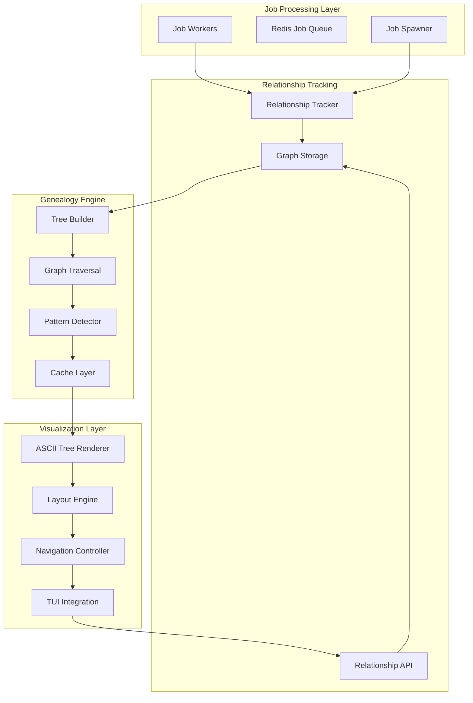
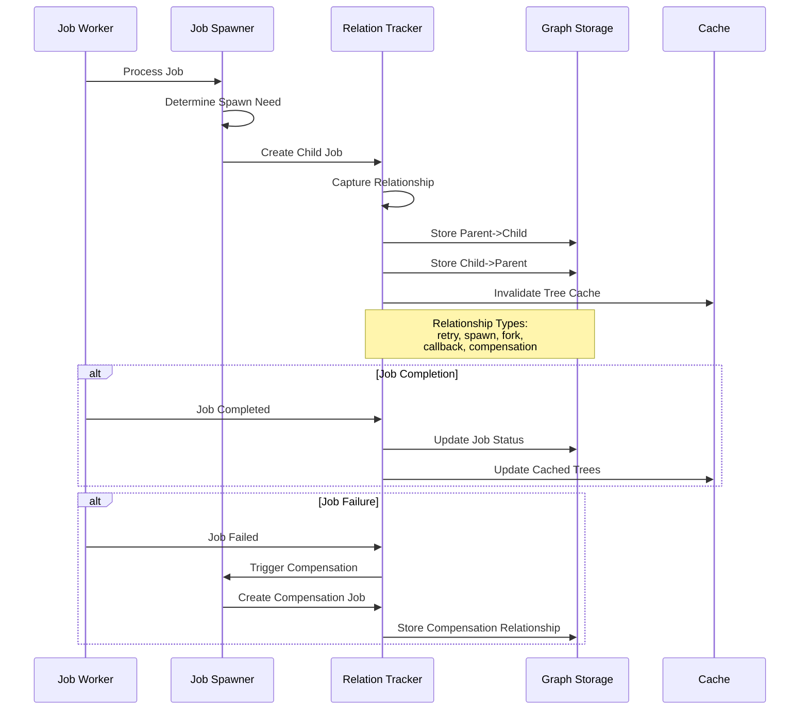

# F017 - Job Genealogy Navigator Design Document

## Executive Summary

The Job Genealogy Navigator transforms abstract job relationships into intuitive visual family trees, revolutionizing how developers and SREs understand causality in distributed job processing systems. This feature bridges the gap between individual job monitoring and system-wide workflow understanding by providing interactive ASCII art visualizations of parent-child relationships, retry chains, spawned subjobs, and failure cascades.

### Key Benefits
- **Root Cause Analysis**: Trace cascading failures to their origin through interactive genealogy trees
- **Impact Assessment**: Visualize the complete blast radius of job failures across generations
- **Pattern Recognition**: Identify recurring failure genealogies and workflow anomalies
- **Debugging Excellence**: Transform complex distributed debugging into intuitive tree navigation
- **Operational Intelligence**: Understand system behavior through job relationship patterns

### Scope
This design covers the complete job genealogy system including:
- Graph-based relationship tracking with bidirectional indexes in Redis
- Interactive ASCII art tree visualization with multiple layout algorithms
- Navigation controls with expand/collapse, focus modes, and search capabilities
- Analysis tools including blame mode, impact mode, and pattern detection
- Performance optimization for large genealogies (1000+ nodes)
- Integration with existing job processing and TUI infrastructure

## System Architecture

### High-Level Architecture



### Relationship Capture Flow



### Tree Visualization Pipeline

```mermaid
graph LR
    subgraph "Data Retrieval"
        JobID[Job ID Input]
        GraphQuery[Graph Query]
        RelationshipData[Relationship Data]
    end

    subgraph "Tree Construction"
        TreeBuilder[Tree Builder]
        GenerationMapper[Generation Mapper]
        DepthCalculator[Depth Calculator]
    end

    subgraph "Layout Engine"
        LayoutAlgorithm[Layout Algorithm]
        PositionCalculator[Position Calculator]
        CollisionDetector[Collision Detector]
    end

    subgraph "Rendering"
        ASCIIGenerator[ASCII Generator]
        ColorApplicator[Color Applicator]
        ViewportMapper[Viewport Mapper]
    end

    JobID --> GraphQuery
    GraphQuery --> RelationshipData
    RelationshipData --> TreeBuilder
    TreeBuilder --> GenerationMapper
    GenerationMapper --> DepthCalculator
    DepthCalculator --> LayoutAlgorithm
    LayoutAlgorithm --> PositionCalculator
    PositionCalculator --> CollisionDetector
    CollisionDetector --> ASCIIGenerator
    ASCIIGenerator --> ColorApplicator
    ColorApplicator --> ViewportMapper
```



## TUI Design

### Desktop View (Large Resolution)

The desktop interface provides a comprehensive three-panel layout optimized for complex genealogy exploration:

```
┌─ Job Genealogy Navigator ──────────────────────────────────────────────────────────────────────────────────┐
│ [F1] Help [F2] Layout [F3] Focus [F4] Filter [F5] Search [F6] Export [F7] Animate [F8] Config [ESC] Exit   │
├─────────────────────────────────────────┬─────────────────────────────────────────┬─────────────────────────┤
│ Tree Structure                          │ Job Details                             │ Navigation & Analysis   │
│                                         │                                         │                         │
│ ┌─ Job-001: user_signup [SUCCESS] ✅    │ ┌─ Selected Job Details ─────────────┐ │ View Mode:              │
│ ├─┬─ Job-002: send_welcome [RETRY-1] ⚠️  │ │ ID: Job-002                       │ │ ● Full Tree             │
│ │ └─── Job-003: send_welcome [SUCCESS] ✅│ │ Type: send_welcome                │ │ ○ Ancestors Only        │
│ ├─── Job-004: update_analytics [SUCCESS]│ │ Status: SUCCESS (retry-1)         │ │ ○ Descendants Only      │
│ └─┬─ Job-005: provision_account [FAILED]│ │ Parent: Job-001                   │ │ ○ Blame Mode            │
│   ├─── Job-006: rollback_user [SUCCESS] │ │ Children: 1 (Job-003)            │ │ ○ Impact Mode           │
│   └─── Job-007: alert_support [PROC] 🔄 │ │ Relationship: retry               │ │                         │
│                                         │ │ Spawn Reason: timeout_retry       │ │ Layout:                 │
│ Family Stats:                           │ │ Generation: 2                     │ │ ● Top-Down Tree         │
│ • Root Jobs: 1                          │ │ Depth: 1                         │ │ ○ Timeline View         │
│ • Total Jobs: 7                         │ │                                   │ │ ○ Radial Layout         │
│ • Generations: 3                        │ │ Timestamps:                       │ │ ○ Compact View          │
│ • Max Depth: 2                          │ │ Created: 2024-01-15 10:30:15     │ │                         │
│ • Success Rate: 71%                     │ │ Started: 2024-01-15 10:30:16     │ │ Quick Actions:          │
│                                         │ │ Completed: 2024-01-15 10:30:45   │ │ [B] Blame Analysis      │
│ Navigation:                             │ │ Duration: 29s                     │ │ [I] Impact Analysis     │
│ • ↑/↓ Navigate tree                     │ │                                   │ │ [P] Pattern Search      │
│ • ←/→ Collapse/Expand                   │ │ Payload:                          │ │ [E] Export Tree         │
│ • Enter Focus job                       │ │ user_id: "12345"                 │ │ [R] Refresh             │
│ • Tab Switch panels                     │ │ email: "user@example.com"        │ │                         │
│                                         │ │ retry_count: 1                    │ │ Filters:                │
│ Legends:                                │ │ max_retries: 3                    │ │ □ Show Success          │
│ ✅ Success  ❌ Failed                   │ │                                   │ │ ☑ Show Failed           │
│ ⚠️ Warning  🔄 Processing              │ │ Error Details:                    │ │ ☑ Show Processing       │
│ ⏸️ Queued   ⏹️ Cancelled               │ │ Previous failure: smtp_timeout    │ │ ☑ Show Queued           │
│                                         │ └───────────────────────────────────┘ │ ☑ Show Cancelled        │
└─────────────────────────────────────────┴─────────────────────────────────────────┴─────────────────────────┘
│ Status: Viewing 7 jobs in genealogy | Root: Job-001 | Selected: Job-002 | Mode: Full Tree                  │
└─────────────────────────────────────────────────────────────────────────────────────────────────────────────┘
```

### Mobile View (Small Resolution)

For narrow terminals (≤80 columns), the interface adapts to a tabbed layout:

```
┌─ Job Genealogy Navigator ──────────────────────────────────────────────┐
│ [ Tree ] [ Details ] [ Analysis ] [ Config ]          [?] Help [X] Exit │
├─────────────────────────────────────────────────────────────────────────┤
│                                                                         │
│ 📊 Job Family Tree                                                      │
│                                                                         │
│ ┌─ Job-001: user_signup [✅]                                            │
│ ├─┬─ Job-002: send_welcome [⚠️] ←─ Selected                             │
│ │ └─── Job-003: send_welcome [✅]                                       │
│ ├─── Job-004: update_analytics [✅]                                     │
│ └─┬─ Job-005: provision_account [❌]                                    │
│   ├─── Job-006: rollback_user [✅]                                     │
│   └─── Job-007: alert_support [🔄]                                     │
│                                                                         │
│ 📈 Quick Stats                                                          │
│ Total: 7 jobs | Success: 71% | Depth: 2 | Gens: 3                     │
│                                                                         │
│ 🎮 Navigation                                                           │
│ [↑/↓] Move [←/→] Expand/Collapse [Enter] Focus [Tab] Switch             │
│ [B] Blame [I] Impact [F] Filter [S] Search [E] Export                  │
│                                                                         │
│ 🔍 View Modes                                                           │
│ [1] Full [2] Ancestors [3] Descendants [4] Blame [5] Impact            │
│                                                                         │
└─────────────────────────────────────────────────────────────────────────┘
│ Job-002: Retry 1 of send_welcome | Parent: Job-001 | Children: 1        │
└─────────────────────────────────────────────────────────────────────────┘
```

### Interactive Tree Features

#### Expandable Node System

```
┌─ Job-001: user_signup [SUCCESS] ✅
├─[+] Job-002: send_welcome [2 retries] ⚠️     ← Collapsed with summary
├─── Job-004: update_analytics [SUCCESS] ✅
└─┬─ Job-005: provision_account [FAILED] ❌
  ├─── Job-006: rollback_user [SUCCESS] ✅
  └─── Job-007: alert_support [PROCESSING] 🔄

After expanding Job-002:
┌─ Job-001: user_signup [SUCCESS] ✅
├─┬─ Job-002: send_welcome [RETRY-1] ⚠️
│ ├─── Job-002-r1: send_welcome [FAILED] ❌
│ └─── Job-002-r2: send_welcome [SUCCESS] ✅
├─── Job-004: update_analytics [SUCCESS] ✅
└─┬─ Job-005: provision_account [FAILED] ❌
  ├─── Job-006: rollback_user [SUCCESS] ✅
  └─── Job-007: alert_support [PROCESSING] 🔄
```

#### Focus Modes

**Blame Mode** - Trace failure to root cause:
```
Blame Path for Job-007 alert_support:
Job-001: user_signup [SUCCESS] ✅
└─┬─ Job-005: provision_account [FAILED] ❌ ← Root Cause
  └─── Job-007: alert_support [PROCESSING] 🔄 ← Current

Blame Analysis:
• Failure originated in Job-005 (provision_account)
• Cascaded to compensation job Job-007
• Root cause: Database connection timeout in provision service
```

**Impact Mode** - Show all affected descendants:
```
Impact Analysis for Job-005 provision_account [FAILED]:
Directly Affected: 2 jobs
Cascade Effects: 3 additional jobs

┌─ Job-005: provision_account [FAILED] ❌ ← Impact Source
├─── Job-006: rollback_user [SUCCESS] ✅ ← Compensation
├─── Job-007: alert_support [PROCESSING] 🔄 ← Notification
└─── Job-008: audit_failure [QUEUED] ⏸️ ← Audit Trail

Total Impact: 4 jobs, ~45 seconds processing time, $0.03 cost
```

## Data Models and Schema Design

### Core Relationship Schema

```go
type JobRelationship struct {
    // Primary identifiers
    ParentID     string    `json:"parent_id" redis:"parent_id"`
    ChildID      string    `json:"child_id" redis:"child_id"`

    // Relationship metadata
    Type         RelationType `json:"type" redis:"type"`
    SpawnReason  string       `json:"spawn_reason" redis:"spawn_reason"`
    Timestamp    time.Time    `json:"timestamp" redis:"timestamp"`

    // Processing context
    Generation   int          `json:"generation" redis:"generation"`
    Depth        int          `json:"depth" redis:"depth"`

    // Optional metadata
    PayloadSimilarity float64           `json:"payload_similarity,omitempty" redis:"payload_similarity"`
    ProcessingContext map[string]string `json:"processing_context,omitempty" redis:"processing_context"`

    // Lifecycle tracking
    CreatedAt    time.Time    `json:"created_at" redis:"created_at"`
    TTL          time.Duration `json:"ttl,omitempty" redis:"ttl"`
}

type RelationType string
const (
    RelationRetry        RelationType = "retry"        // Job retry with same payload
    RelationSpawn        RelationType = "spawn"        // Child job spawned during processing
    RelationFork         RelationType = "fork"         // Parallel processing split
    RelationCallback     RelationType = "callback"     // Callback triggered by completion
    RelationCompensation RelationType = "compensation" // Cleanup/rollback job
    RelationContinuation RelationType = "continuation" // Sequential workflow step
    RelationBatchMember  RelationType = "batch_member" // Part of batch operation
    RelationDependency   RelationType = "dependency"   // Dependency relationship
)
```

### Genealogy Tree Structure

```go
type JobGenealogy struct {
    // Tree identification
    RootID       string    `json:"root_id"`
    QueryJobID   string    `json:"query_job_id"`
    TreeScope    TreeScope `json:"tree_scope"`

    // Tree structure
    Nodes        []GenealogyNode    `json:"nodes"`
    Edges        []GenealogyEdge    `json:"edges"`
    Generations  map[int][]string   `json:"generations"`

    // Tree metrics
    TotalNodes   int       `json:"total_nodes"`
    MaxDepth     int       `json:"max_depth"`
    MaxBreadth   int       `json:"max_breadth"`
    SuccessRate  float64   `json:"success_rate"`

    // Timing information
    TreeSpan     time.Duration `json:"tree_span"`
    OldestJob    time.Time     `json:"oldest_job"`
    NewestJob    time.Time     `json:"newest_job"`

    // Computed analysis
    CriticalPath []string      `json:"critical_path,omitempty"`
    FailureChain []string      `json:"failure_chain,omitempty"`
    ImpactRadius ImpactAnalysis `json:"impact_radius,omitempty"`

    // Cache metadata
    ComputedAt   time.Time     `json:"computed_at"`
    CacheKey     string        `json:"cache_key"`
    TTL          time.Duration `json:"ttl"`
}

type GenealogyNode struct {
    JobID        string     `json:"job_id"`
    JobType      string     `json:"job_type"`
    Status       JobStatus  `json:"status"`
    Generation   int        `json:"generation"`

    // Relationship metadata
    Parents      []string   `json:"parents"`
    Children     []string   `json:"children"`
    Siblings     []string   `json:"siblings"`

    // Job details for display
    DisplayName  string     `json:"display_name"`
    StatusEmoji  string     `json:"status_emoji"`
    Duration     time.Duration `json:"duration,omitempty"`

    // Tree positioning
    TreeX        int        `json:"tree_x"`
    TreeY        int        `json:"tree_y"`
    Collapsed    bool       `json:"collapsed"`
    Highlighted  bool       `json:"highlighted"`
}

type GenealogyEdge struct {
    FromJobID    string        `json:"from_job_id"`
    ToJobID      string        `json:"to_job_id"`
    Relationship JobRelationship `json:"relationship"`

    // Visual properties
    LineStyle    LineStyle     `json:"line_style"`
    Color        string        `json:"color"`
    Thickness    int          `json:"thickness"`
    Label        string       `json:"label,omitempty"`
}

type TreeScope string
const (
    ScopeFull        TreeScope = "full"        // Complete genealogy
    ScopeAncestors   TreeScope = "ancestors"   // Only parents and ancestors
    ScopeDescendants TreeScope = "descendants" // Only children and descendants
    ScopeBlame       TreeScope = "blame"       // Path to root cause
    ScopeImpact      TreeScope = "impact"      // Affected descendants
)
```

### Impact Analysis Schema

```go
type ImpactAnalysis struct {
    // Scope metrics
    SourceJobID      string    `json:"source_job_id"`
    DirectChildren   int       `json:"direct_children"`
    TotalDescendants int       `json:"total_descendants"`
    AffectedJobs     []string  `json:"affected_jobs"`

    // Status breakdown
    SuccessfulJobs   int       `json:"successful_jobs"`
    FailedJobs       int       `json:"failed_jobs"`
    ProcessingJobs   int       `json:"processing_jobs"`
    QueuedJobs       int       `json:"queued_jobs"`

    // Resource impact
    TotalProcessingTime time.Duration `json:"total_processing_time"`
    EstimatedCost       float64       `json:"estimated_cost"`
    ResourceUsage       ResourceUsage `json:"resource_usage"`

    // Temporal analysis
    ImpactTimeSpan      time.Duration `json:"impact_time_span"`
    CascadeDelay        time.Duration `json:"cascade_delay"`
    RecoveryEstimate    time.Duration `json:"recovery_estimate,omitempty"`

    // Pattern analysis
    SimilarIncidents    []string      `json:"similar_incidents"`
    RecurrenceScore     float64       `json:"recurrence_score"`

    ComputedAt          time.Time     `json:"computed_at"`
}

type ResourceUsage struct {
    CPUSeconds      float64 `json:"cpu_seconds"`
    MemoryMBHours   float64 `json:"memory_mb_hours"`
    NetworkMB       float64 `json:"network_mb"`
    StorageIOOps    int64   `json:"storage_io_ops"`
}
```

### Pattern Detection Schema

```go
type GenealogyPattern struct {
    PatternID       string           `json:"pattern_id"`
    PatternType     PatternType      `json:"pattern_type"`
    Frequency       int              `json:"frequency"`

    // Pattern structure
    NodePattern     []NodeTemplate   `json:"node_pattern"`
    EdgePattern     []EdgeTemplate   `json:"edge_pattern"`
    StructureHash   string           `json:"structure_hash"`

    // Occurrence tracking
    FirstSeen       time.Time        `json:"first_seen"`
    LastSeen        time.Time        `json:"last_seen"`
    Occurrences     []string         `json:"occurrences"` // Job IDs where pattern found

    // Pattern analysis
    SuccessRate     float64          `json:"success_rate"`
    AvgDuration     time.Duration    `json:"avg_duration"`
    FailureReasons  map[string]int   `json:"failure_reasons"`

    // Recommendations
    Recommendations []string         `json:"recommendations"`
    Confidence      float64          `json:"confidence"`
}

type PatternType string
const (
    PatternRetryChain    PatternType = "retry_chain"     // Multiple retry patterns
    PatternFailureFan    PatternType = "failure_fan"     // Single failure spawning many compensations
    PatternDeepNesting   PatternType = "deep_nesting"    // Unusually deep genealogy
    PatternWideSpread    PatternType = "wide_spread"     // Single job spawning many children
    PatternCycle         PatternType = "cycle"           // Circular dependencies
    PatternAnomaly       PatternType = "anomaly"         // Unusual structural pattern
)

type NodeTemplate struct {
    JobTypePattern  string    `json:"job_type_pattern"`
    StatusPattern   string    `json:"status_pattern"`
    PositionPattern string    `json:"position_pattern"` // "root", "leaf", "middle"
    Constraints     []string  `json:"constraints"`
}

type EdgeTemplate struct {
    RelationshipType RelationType `json:"relationship_type"`
    Direction        string       `json:"direction"` // "parent_to_child", "child_to_parent"
    Required         bool         `json:"required"`
    Multiplicity     string       `json:"multiplicity"` // "one", "many", "optional"
}
```

## Performance Requirements and Optimization

### Performance Targets

| Component | Target | Maximum | Notes |
|-----------|--------|---------|-------|
| Tree Construction | <100ms P95 | <500ms P99 | For trees up to 1000 nodes |
| Node Expansion | <10ms P95 | <50ms P99 | Single node expansion |
| Layout Computation | <200ms P95 | <1s P99 | Complex layouts, 500+ nodes |
| ASCII Rendering | <16ms | <50ms | 60 FPS update rate |
| Graph Traversal | <5ms P95 | <20ms P99 | Parent/child queries |
| Pattern Detection | <1s | <5s | Background computation |

### Storage Optimization

#### Redis Data Structures

```redis
# Parent-to-children index (sorted by spawn time)
genealogy:children:{parent_id} -> ZSET {child_id: timestamp}

# Child-to-parent index (for retry chains and ancestry)
genealogy:parents:{child_id} -> ZSET {parent_id: timestamp}

# Relationship metadata
genealogy:relation:{parent_id}:{child_id} -> HASH {
  type: "retry",
  reason: "timeout",
  generation: 2,
  created_at: "2024-01-15T10:30:00Z",
  metadata: "{\"attempt\": 2, \"max_retries\": 3}"
}

# Genealogy tree cache (JSON compressed)
genealogy:tree:{root_id} -> STRING (gzipped JSON)

# Pattern cache
genealogy:patterns:{structure_hash} -> HASH {
  pattern_type: "retry_chain",
  frequency: 45,
  last_seen: "2024-01-15T10:30:00Z",
  confidence: 0.95
}

# TTL tracking for cleanup
genealogy:ttl:{job_id} -> STRING "2024-01-16T10:30:00Z"
```

#### Memory-Efficient Tree Representation

```go
type CompactTreeNode struct {
    JobID     uint32    `json:"id"`      // Use integer IDs for memory efficiency
    Status    uint8     `json:"s"`       // Pack status into single byte
    ParentID  uint32    `json:"p"`       // Parent reference
    FirstChild uint32   `json:"fc"`      // First child (linked list)
    NextSibling uint32  `json:"ns"`      // Next sibling
    RelType   uint8     `json:"rt"`      // Relationship type
    Generation uint16   `json:"g"`       // Generation number
    Flags     uint8     `json:"f"`       // Collapsed/highlighted/etc
}

// String interning for job types and names
type StringInterner struct {
    strings []string
    lookup  map[string]uint32
}

// Compact edge representation
type CompactEdge struct {
    From uint32 `json:"f"`
    To   uint32 `json:"t"`
    Type uint8  `json:"ty"`
}
```

### Algorithm Optimizations

#### Efficient Tree Traversal

```go
type GenealogyGraph struct {
    // Adjacency lists for O(1) parent/child lookups
    children map[string][]string
    parents  map[string][]string

    // LRU cache for computed trees
    treeCache *lru.Cache

    // Bloom filter for relationship existence checks
    relationshipBloom *bloom.BloomFilter

    // Connection pool for Redis
    redisPool *redis.Pool
}

func (g *GenealogyGraph) GetAncestors(jobID string, maxDepth int) ([]string, error) {
    if maxDepth <= 0 {
        return nil, nil
    }

    // Check cache first
    cacheKey := fmt.Sprintf("ancestors:%s:%d", jobID, maxDepth)
    if cached, ok := g.treeCache.Get(cacheKey); ok {
        return cached.([]string), nil
    }

    // BFS traversal with depth limiting
    queue := []struct{id string; depth int}{{jobID, 0}}
    visited := make(map[string]bool)
    ancestors := make([]string, 0, 64) // Pre-allocate with reasonable size

    for len(queue) > 0 {
        current := queue[0]
        queue = queue[1:]

        if current.depth >= maxDepth || visited[current.id] {
            continue
        }

        visited[current.id] = true
        if current.depth > 0 { // Don't include self
            ancestors = append(ancestors, current.id)
        }

        // Add parents to queue
        if parents, exists := g.parents[current.id]; exists {
            for _, parent := range parents {
                queue = append(queue, struct{id string; depth int}{
                    parent, current.depth + 1,
                })
            }
        }
    }

    // Cache result
    g.treeCache.Add(cacheKey, ancestors)
    return ancestors, nil
}
```

#### Layout Algorithm Optimization

```go
type TreeLayout struct {
    nodes     map[string]*LayoutNode
    algorithm LayoutAlgorithm
    viewport  Viewport
}

type LayoutNode struct {
    X, Y      int
    Width     int
    Height    int
    Children  []*LayoutNode
    Parent    *LayoutNode
    Collapsed bool
}

// Optimized top-down tree layout with collision avoidance
func (l *TreeLayout) ComputeTopDownLayout() error {
    root := l.findRoot()
    if root == nil {
        return errors.New("no root node found")
    }

    // Two-pass algorithm:
    // Pass 1: Compute positions bottom-up (post-order)
    l.computeSubtreeWidths(root)

    // Pass 2: Assign final positions top-down (pre-order)
    l.assignPositions(root, 0, 0)

    return nil
}

func (l *TreeLayout) computeSubtreeWidths(node *LayoutNode) int {
    if node.Collapsed || len(node.Children) == 0 {
        node.Width = 1
        return 1
    }

    totalWidth := 0
    for _, child := range node.Children {
        totalWidth += l.computeSubtreeWidths(child)
    }

    node.Width = max(1, totalWidth)
    return node.Width
}

func (l *TreeLayout) assignPositions(node *LayoutNode, x, y int) {
    node.X = x + node.Width/2
    node.Y = y

    if node.Collapsed || len(node.Children) == 0 {
        return
    }

    childX := x
    for _, child := range node.Children {
        l.assignPositions(child, childX, y+2) // 2-row spacing
        childX += child.Width
    }
}
```

### Rendering Performance

#### Efficient ASCII Generation

```go
type ASCIICanvas struct {
    width   int
    height  int
    cells   [][]rune
    colors  [][]Color
    dirty   [][]bool // Track which cells need redrawing
}

func (c *ASCIICanvas) DrawTree(genealogy *JobGenealogy) {
    // Clear only dirty regions
    c.clearDirtyRegions()

    // Draw edges first (behind nodes)
    for _, edge := range genealogy.Edges {
        c.drawEdge(edge)
    }

    // Draw nodes (in front of edges)
    for _, node := range genealogy.Nodes {
        if c.isInViewport(node) {
            c.drawNode(node)
        }
    }

    // Mark all cells as clean
    c.clearDirtyFlags()
}

func (c *ASCIICanvas) drawEdge(edge *GenealogyEdge) {
    from := edge.FromNode
    to := edge.ToNode

    // Use Bresenham's line algorithm for clean ASCII lines
    if from.TreeY == to.TreeY {
        // Horizontal line
        c.drawHorizontalLine(from.TreeX, to.TreeX, from.TreeY, edge.LineStyle)
    } else {
        // Vertical or diagonal line with box-drawing characters
        c.drawConnectorLine(from, to, edge.LineStyle)
    }
}

// Box-drawing character mapping for clean tree visualization
var boxChars = map[string]rune{
    "horizontal":     '─',
    "vertical":       '│',
    "top_left":       '┌',
    "top_right":      '┐',
    "bottom_left":    '└',
    "bottom_right":   '┘',
    "cross":          '┼',
    "tee_down":       '┬',
    "tee_up":         '┴',
    "tee_left":       '┤',
    "tee_right":      '├',
}
```

#### Virtual Scrolling for Large Trees

```go
type VirtualViewport struct {
    totalHeight int
    viewHeight  int
    scrollY     int

    // Cached rendered lines
    lineCache   map[int]string
    cacheSize   int

    // Viewport bounds
    topVisible    int
    bottomVisible int
}

func (v *VirtualViewport) Render(genealogy *JobGenealogy) []string {
    v.updateVisibleBounds()

    visibleLines := make([]string, v.viewHeight)

    for i := 0; i < v.viewHeight; i++ {
        lineNum := v.topVisible + i

        // Check cache first
        if line, cached := v.lineCache[lineNum]; cached {
            visibleLines[i] = line
            continue
        }

        // Render line on demand
        line := v.renderLine(genealogy, lineNum)

        // Cache if we have space
        if len(v.lineCache) < v.cacheSize {
            v.lineCache[lineNum] = line
        }

        visibleLines[i] = line
    }

    return visibleLines
}
```

## Security Model

### Access Control

#### Role-Based Permissions

```go
type GenealogyPermissions struct {
    // Read permissions
    ViewGenealogy     bool `json:"view_genealogy"`
    ViewJobDetails    bool `json:"view_job_details"`
    ViewRelationships bool `json:"view_relationships"`

    // Navigation permissions
    NavigateTree      bool `json:"navigate_tree"`
    SearchJobs        bool `json:"search_jobs"`
    ExportData        bool `json:"export_data"`

    // Analysis permissions
    BlameAnalysis     bool `json:"blame_analysis"`
    ImpactAnalysis    bool `json:"impact_analysis"`
    PatternDetection  bool `json:"pattern_detection"`

    // Administrative permissions
    ModifyRelations   bool `json:"modify_relations"`
    DeleteGenealogy   bool `json:"delete_genealogy"`
    ConfigureSettings bool `json:"configure_settings"`
}

const (
    RoleGenealogyViewer  = "genealogy:viewer"   // Read-only tree navigation
    RoleGenealogyAnalyst = "genealogy:analyst"  // Full analysis capabilities
    RoleGenealogyAdmin   = "genealogy:admin"    // Administrative functions
)
```

#### Data Privacy and Sanitization

```go
type DataSanitizer struct {
    sanitizePayloads bool
    redactFields     []string
    hashSensitive    bool
}

func (s *DataSanitizer) SanitizeJobDetails(job *JobDetails, userRole string) *JobDetails {
    sanitized := *job

    // Always redact sensitive payload fields
    if sanitized.Payload != nil {
        sanitized.Payload = s.sanitizePayload(sanitized.Payload)
    }

    // Role-based field access
    switch userRole {
    case RoleGenealogyViewer:
        // Remove detailed error information
        sanitized.ErrorDetails = nil
        sanitized.StackTrace = ""

    case RoleGenealogyAnalyst:
        // Keep error details but sanitize sensitive data
        if sanitized.ErrorDetails != nil {
            sanitized.ErrorDetails = s.sanitizeErrorDetails(sanitized.ErrorDetails)
        }
    }

    return &sanitized
}

func (s *DataSanitizer) sanitizePayload(payload map[string]interface{}) map[string]interface{} {
    sanitized := make(map[string]interface{})

    for key, value := range payload {
        if s.isSensitiveField(key) {
            if s.hashSensitive {
                sanitized[key] = s.hashValue(value)
            } else {
                sanitized[key] = "[REDACTED]"
            }
        } else {
            sanitized[key] = value
        }
    }

    return sanitized
}
```

### Data Protection

#### Relationship Data Encryption

```go
type EncryptedRelationshipStore struct {
    encryptor *AESEncryptor
    storage   RelationshipStorage
    keyRing   *EncryptionKeyRing
}

func (e *EncryptedRelationshipStore) StoreRelationship(rel *JobRelationship) error {
    // Encrypt sensitive metadata
    if rel.ProcessingContext != nil {
        encrypted, err := e.encryptor.Encrypt(rel.ProcessingContext)
        if err != nil {
            return fmt.Errorf("failed to encrypt relationship metadata: %w", err)
        }
        rel.ProcessingContext = map[string]string{
            "encrypted_data": encrypted,
            "key_version":    e.keyRing.CurrentVersion(),
        }
    }

    return e.storage.Store(rel)
}

func (e *EncryptedRelationshipStore) GetRelationship(parentID, childID string) (*JobRelationship, error) {
    rel, err := e.storage.Get(parentID, childID)
    if err != nil {
        return nil, err
    }

    // Decrypt metadata if encrypted
    if encryptedData, exists := rel.ProcessingContext["encrypted_data"]; exists {
        keyVersion := rel.ProcessingContext["key_version"]
        decrypted, err := e.encryptor.DecryptWithVersion(encryptedData, keyVersion)
        if err != nil {
            return nil, fmt.Errorf("failed to decrypt relationship metadata: %w", err)
        }
        rel.ProcessingContext = decrypted
    }

    return rel, nil
}
```

#### Audit Trail

```go
type GenealogyAuditLogger struct {
    logger AuditLogger
}

func (g *GenealogyAuditLogger) LogTreeAccess(userID, jobID string, action GenealogyAction) {
    g.logger.Log(AuditEvent{
        Timestamp:  time.Now(),
        UserID:     userID,
        Action:     string(action),
        ResourceID: jobID,
        Details: map[string]interface{}{
            "component": "genealogy_navigator",
            "tree_root": jobID,
            "user_agent": "tui_client",
        },
    })
}

type GenealogyAction string
const (
    ActionViewTree       GenealogyAction = "view_genealogy_tree"
    ActionBlameAnalysis  GenealogyAction = "perform_blame_analysis"
    ActionImpactAnalysis GenealogyAction = "perform_impact_analysis"
    ActionExportTree     GenealogyAction = "export_genealogy_data"
    ActionSearchTree     GenealogyAction = "search_genealogy_tree"
)
```

## Testing Strategy

### Unit Testing

#### Graph Algorithm Tests

```go
func TestTreeConstruction_ComplexGenealogy(t *testing.T) {
    // Create test genealogy with multiple relationship types
    relationships := []JobRelationship{
        {ParentID: "job-001", ChildID: "job-002", Type: RelationSpawn},
        {ParentID: "job-001", ChildID: "job-003", Type: RelationSpawn},
        {ParentID: "job-002", ChildID: "job-004", Type: RelationRetry},
        {ParentID: "job-002", ChildID: "job-005", Type: RelationSpawn},
        {ParentID: "job-003", ChildID: "job-006", Type: RelationCompensation},
    }

    builder := NewTreeBuilder()
    tree, err := builder.BuildTree("job-001", relationships)

    require.NoError(t, err)
    assert.Equal(t, "job-001", tree.RootID)
    assert.Equal(t, 6, tree.TotalNodes)
    assert.Equal(t, 3, tree.MaxDepth)

    // Verify generation mapping
    assert.Contains(t, tree.Generations[0], "job-001")
    assert.Contains(t, tree.Generations[1], "job-002")
    assert.Contains(t, tree.Generations[1], "job-003")
    assert.Contains(t, tree.Generations[2], "job-004")
    assert.Contains(t, tree.Generations[2], "job-005")
    assert.Contains(t, tree.Generations[2], "job-006")
}

func TestBlameAnalysis_IdentifiesRootCause(t *testing.T) {
    relationships := []JobRelationship{
        {ParentID: "root", ChildID: "child1", Type: RelationSpawn},
        {ParentID: "child1", ChildID: "child2", Type: RelationSpawn},
        {ParentID: "child2", ChildID: "failed", Type: RelationSpawn},
    }

    jobs := map[string]JobStatus{
        "root":   StatusSuccess,
        "child1": StatusSuccess,
        "child2": StatusFailed,
        "failed": StatusFailed,
    }

    analyzer := NewBlameAnalyzer()
    path, err := analyzer.TraceBlamePath("failed", relationships, jobs)

    require.NoError(t, err)
    assert.Equal(t, []string{"failed", "child2", "child1", "root"}, path)
}
```

#### ASCII Rendering Tests

```go
func TestASCIIRenderer_SimpleTree(t *testing.T) {
    tree := &JobGenealogy{
        Nodes: []GenealogyNode{
            {JobID: "job-001", Generation: 0, TreeX: 0, TreeY: 0, DisplayName: "root", Status: StatusSuccess},
            {JobID: "job-002", Generation: 1, TreeX: 0, TreeY: 2, DisplayName: "child1", Status: StatusSuccess},
            {JobID: "job-003", Generation: 1, TreeX: 4, TreeY: 2, DisplayName: "child2", Status: StatusFailed},
        },
        Edges: []GenealogyEdge{
            {FromJobID: "job-001", ToJobID: "job-002"},
            {FromJobID: "job-001", ToJobID: "job-003"},
        },
    }

    renderer := NewASCIIRenderer()
    output := renderer.Render(tree)

    expected := []string{
        "┌─ job-001: root [SUCCESS] ✅",
        "├─── job-002: child1 [SUCCESS] ✅",
        "└─── job-003: child2 [FAILED] ❌",
    }

    assert.Equal(t, expected, output)
}

func TestVirtualScrolling_LargeTree(t *testing.T) {
    // Create tree with 1000 nodes
    tree := generateLargeTree(1000)

    viewport := &VirtualViewport{
        totalHeight: 1000,
        viewHeight:  20,
        scrollY:     500,
        lineCache:   make(map[int]string),
        cacheSize:   100,
    }

    start := time.Now()
    output := viewport.Render(tree)
    duration := time.Since(start)

    assert.Equal(t, 20, len(output))
    assert.Less(t, duration, 50*time.Millisecond) // Should render quickly
    assert.True(t, len(viewport.lineCache) > 0) // Should populate cache
}
```

### Integration Testing

#### End-to-End Genealogy Workflows

```go
func TestGenealogyNavigator_FullWorkflow(t *testing.T) {
    // Setup test environment
    redis := setupTestRedis(t)
    navigator := NewGenealogyNavigator(redis)

    // Create complex job family
    jobs := createTestJobFamily(t, redis)

    // Test tree construction
    tree, err := navigator.BuildFamilyTree(jobs.rootID)
    require.NoError(t, err)
    assert.Equal(t, 10, tree.TotalNodes)

    // Test blame analysis
    blamePath, err := navigator.TraceBlamePath(jobs.failedJobID)
    require.NoError(t, err)
    assert.NotEmpty(t, blamePath)

    // Test impact analysis
    impact, err := navigator.CalculateImpact(jobs.failedJobID)
    require.NoError(t, err)
    assert.Greater(t, impact.TotalDescendants, 0)

    // Test pattern detection
    patterns, err := navigator.DetectPatterns(tree)
    require.NoError(t, err)
    assert.NotEmpty(t, patterns)
}

func TestPerformance_LargeGenealogy(t *testing.T) {
    navigator := setupNavigator(t)

    // Create genealogy with 1000 nodes
    largeFamily := createLargeJobFamily(t, 1000)

    // Measure tree construction time
    start := time.Now()
    tree, err := navigator.BuildFamilyTree(largeFamily.rootID)
    buildTime := time.Since(start)

    require.NoError(t, err)
    assert.Less(t, buildTime, 500*time.Millisecond)
    assert.Equal(t, 1000, tree.TotalNodes)

    // Measure rendering time
    renderer := NewASCIIRenderer()
    start = time.Now()
    output := renderer.Render(tree)
    renderTime := time.Since(start)

    assert.Less(t, renderTime, 100*time.Millisecond)
    assert.NotEmpty(t, output)
}
```

### User Experience Testing

#### Navigation Pattern Validation

```go
func TestNavigationPatterns_UserWorkflows(t *testing.T) {
    navigator := setupNavigatorWithUI(t)

    // Simulate user navigation patterns
    testCases := []struct {
        name        string
        keySequence []Key
        expectFocus string
    }{
        {
            name:        "Navigate to child",
            keySequence: []Key{KeyDown, KeyEnter},
            expectFocus: "job-002",
        },
        {
            name:        "Expand and navigate",
            keySequence: []Key{KeyRight, KeyDown, KeyEnter},
            expectFocus: "job-003",
        },
        {
            name:        "Blame mode activation",
            keySequence: []Key{KeyB},
            expectFocus: "blame_mode",
        },
    }

    for _, tc := range testCases {
        t.Run(tc.name, func(t *testing.T) {
            navigator.Reset()
            for _, key := range tc.keySequence {
                navigator.HandleKey(key)
            }
            assert.Equal(t, tc.expectFocus, navigator.GetCurrentFocus())
        })
    }
}
```

## Implementation Roadmap

### Phase 1: Core Infrastructure (Week 1-2)
- [ ] Design and implement relationship tracking system
- [ ] Create Redis storage schema for genealogy data
- [ ] Build basic graph traversal algorithms
- [ ] Implement tree construction from relationship data
- [ ] Add unit tests for graph operations

### Phase 2: Visualization Engine (Week 2-3)
- [ ] Develop ASCII tree renderer with box-drawing characters
- [ ] Implement multiple layout algorithms (top-down, timeline, radial)
- [ ] Create expandable/collapsible node system
- [ ] Add color coding and status visualization
- [ ] Implement virtual scrolling for large trees

### Phase 3: Interactive Navigation (Week 3-4)
- [ ] Build keyboard navigation controls
- [ ] Implement focus modes (blame, impact, ancestors, descendants)
- [ ] Add search and filtering capabilities
- [ ] Create TUI integration with main dashboard
- [ ] Implement responsive layout for different terminal sizes

### Phase 4: Analysis Features (Week 4-5)
- [ ] Develop blame analysis for root cause tracing
- [ ] Implement impact analysis for cascade assessment
- [ ] Create pattern detection algorithms
- [ ] Add genealogy export capabilities
- [ ] Build performance monitoring and optimization

### Phase 5: Advanced Features (Week 5-6)
- [ ] Add time-lapse animation for tree growth
- [ ] Implement advanced pattern recognition
- [ ] Create genealogy comparison tools
- [ ] Add collaborative features and annotations
- [ ] Integrate with external visualization tools

## Future Enhancements

### Advanced Visualization
- **3D Tree Rendering**: WebGL-based 3D genealogy visualization for complex relationships
- **Interactive Timeline**: Scrub through genealogy evolution over time
- **Graph Overlay**: Multiple genealogies overlaid to show system-wide patterns
- **AR/VR Integration**: Immersive genealogy exploration for complex debugging sessions

### Machine Learning Integration
- **Predictive Spawning**: ML models to predict job spawn patterns and resource needs
- **Anomaly Detection**: Automated detection of unusual genealogy structures
- **Failure Prediction**: Early warning system for potential cascade failures
- **Pattern Learning**: Self-improving pattern detection based on user feedback

### Cross-System Integration
- **Multi-Queue Genealogies**: Track relationships across different queue systems
- **Distributed Tracing**: Integration with OpenTelemetry for full request tracing
- **CI/CD Integration**: Link deployments to genealogy pattern changes
- **External Export**: GraphQL API for external tooling and dashboards

### Enterprise Features
- **Genealogy Analytics**: Historical analysis and reporting on relationship patterns
- **Team Collaboration**: Shared annotations and insights on genealogies
- **Compliance Tracking**: Audit trails for genealogy access and modifications
- **Multi-Tenant Isolation**: Separate genealogy views for different teams/services

---

feature: job-genealogy-navigator
dependencies:
  hard:
    - graph_storage
    - relationship_tracking
    - tui_framework
    - redis_backend
  soft:
    - admin_api
    - distributed_tracing
    - monitoring_system
enables:
  - debugging_workflows
  - impact_analysis
  - root_cause_analysis
  - pattern_detection
provides:
  - tree_visualization
  - relationship_graph
  - blame_mode
  - ancestry_tracking
  - interactive_navigation
---