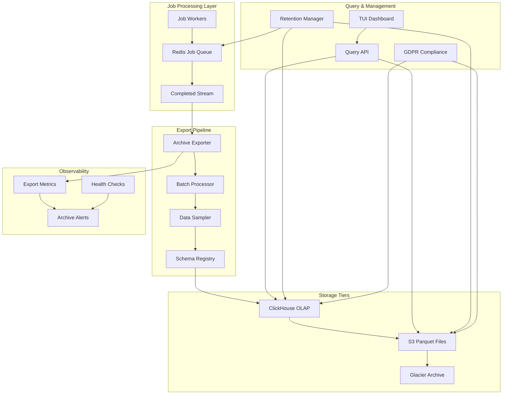
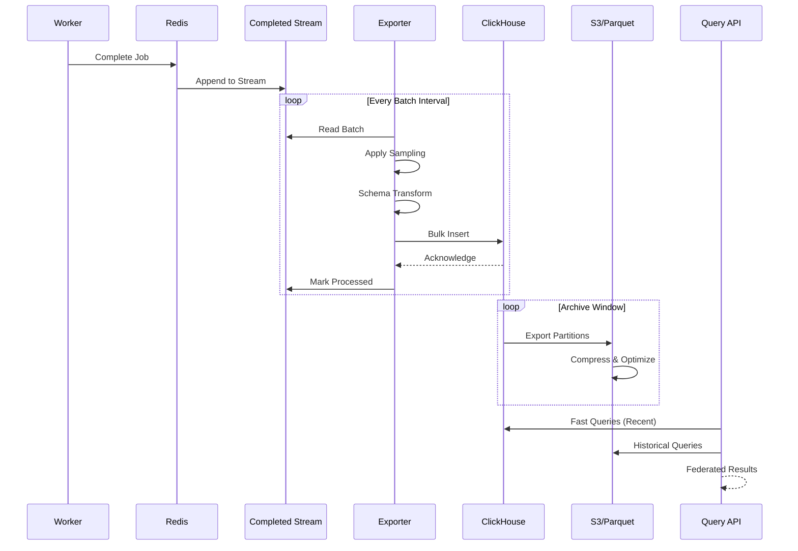
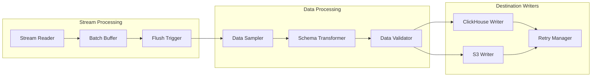
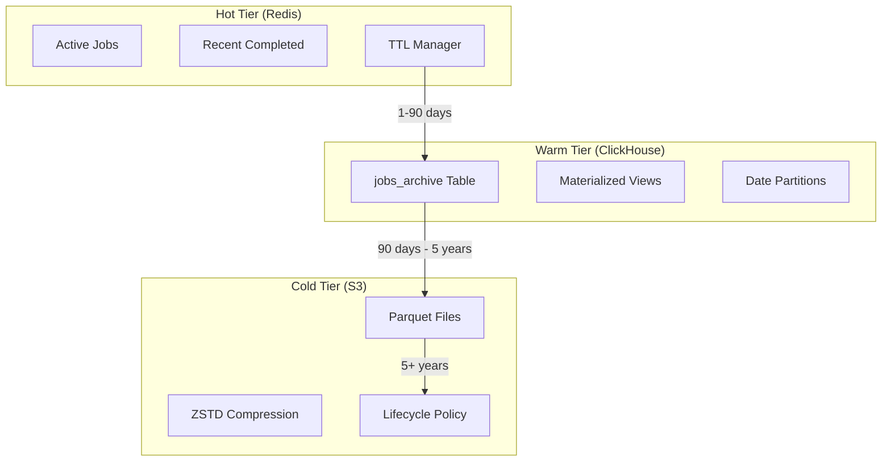
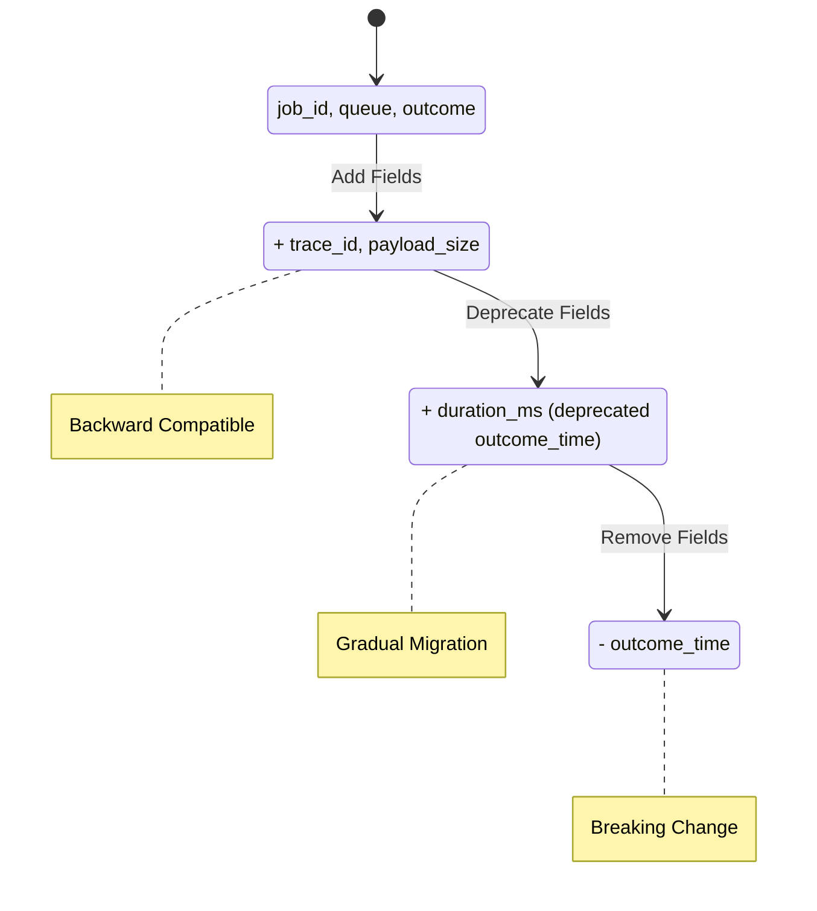
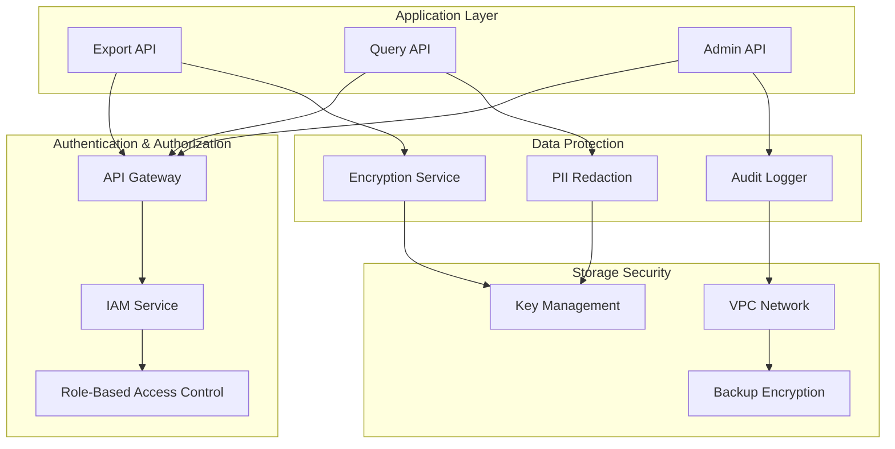

# F018 - Long Term Archives Design Document

## Executive Summary

Long Term Archives transforms the job queue system from a transient processing platform into a comprehensive data platform by streaming completed job metadata to long-term storage. This feature enables historical analysis, compliance reporting, and incident forensics while maintaining optimal Redis performance through intelligent retention management.

### Key Benefits
- **Data Platform Evolution**: Transform job queue into analytical data source
- **Cost Optimization**: Multi-tier storage strategy (hot/warm/cold)
- **Compliance Ready**: GDPR-compliant retention and deletion capabilities
- **Operational Intelligence**: Fast historical analysis and trend identification
- **Scalable Architecture**: Handle petabyte-scale job archives

### Scope
This design covers the complete long-term archival system including:
- Stream-based data export pipeline from Redis to ClickHouse/S3
- Schema evolution and backward compatibility
- Multi-tier retention policies with automated lifecycle management
- GDPR compliance with payload redaction and deletion hooks
- Query interface for historical analysis
- Performance optimization for high-throughput scenarios

## System Architecture

### High-Level Architecture



### Data Flow Architecture



### Component Architecture

#### 1. Export Pipeline



#### 2. Storage Tier Management



#### 3. Schema Evolution System



## Data Models and Schema Design

### Core Archive Record

```go
type ArchiveRecord struct {
    // Primary Identifiers
    JobID       string    `json:"job_id" ch:"job_id"`
    Queue       string    `json:"queue" ch:"queue"`
    TenantID    string    `json:"tenant_id,omitempty" ch:"tenant_id"`

    // Scheduling Information
    Priority    int8      `json:"priority" ch:"priority"`
    EnqueueTime time.Time `json:"enqueue_time" ch:"enqueue_time"`
    StartTime   *time.Time `json:"start_time,omitempty" ch:"start_time"`
    EndTime     *time.Time `json:"end_time,omitempty" ch:"end_time"`

    // Execution Results
    Outcome     JobOutcome `json:"outcome" ch:"outcome"`
    Retries     int16      `json:"retries" ch:"retries"`
    ErrorType   string     `json:"error_type,omitempty" ch:"error_type"`
    ErrorMsg    string     `json:"error_msg,omitempty" ch:"error_msg"`

    // Worker Information
    WorkerID    string    `json:"worker_id" ch:"worker_id"`
    WorkerVer   string    `json:"worker_version,omitempty" ch:"worker_version"`

    // Payload Metadata
    PayloadSize int64     `json:"payload_size" ch:"payload_size"`
    PayloadHash string    `json:"payload_hash" ch:"payload_hash"`
    PayloadSample *string `json:"payload_sample,omitempty" ch:"payload_sample"`

    // Tracing and Context
    TraceID     string    `json:"trace_id,omitempty" ch:"trace_id"`
    SpanID      string    `json:"span_id,omitempty" ch:"span_id"`
    CorrelationID string  `json:"correlation_id,omitempty" ch:"correlation_id"`

    // Metadata
    Tags        map[string]string `json:"tags,omitempty" ch:"tags"`
    CreatedDate time.Time         `json:"created_date" ch:"created_date"`

    // Schema Version
    SchemaVersion string `json:"schema_version" ch:"schema_version"`
}

type JobOutcome string

const (
    OutcomeSuccess   JobOutcome = "success"
    OutcomeFailed    JobOutcome = "failed"
    OutcomeTimeout   JobOutcome = "timeout"
    OutcomeCancelled JobOutcome = "cancelled"
    OutcomeRetry     JobOutcome = "retry"
)
```

### ClickHouse Schema Definition

```sql
-- Primary jobs archive table
CREATE TABLE jobs_archive (
    job_id String,
    queue LowCardinality(String),
    tenant_id LowCardinality(String),
    priority Int8,
    enqueue_time DateTime64(3, 'UTC'),
    start_time Nullable(DateTime64(3, 'UTC')),
    end_time Nullable(DateTime64(3, 'UTC')),
    outcome Enum8(
        'success' = 1,
        'failed' = 2,
        'timeout' = 3,
        'cancelled' = 4,
        'retry' = 5
    ),
    retries UInt16,
    error_type LowCardinality(String),
    error_msg String,
    worker_id LowCardinality(String),
    worker_version LowCardinality(String),
    payload_size UInt32,
    payload_hash String,
    payload_sample Nullable(String),
    trace_id String,
    span_id String,
    correlation_id String,
    tags Map(String, String),
    created_date Date MATERIALIZED toDate(enqueue_time),
    schema_version LowCardinality(String)
) ENGINE = MergeTree()
PARTITION BY created_date
ORDER BY (queue, enqueue_time, job_id)
TTL created_date + INTERVAL 5 YEAR
SETTINGS index_granularity = 8192;

-- Materialized view for queue metrics
CREATE MATERIALIZED VIEW queue_hourly_stats
ENGINE = SummingMergeTree()
PARTITION BY toYYYYMM(hour)
ORDER BY (queue, hour, outcome)
AS SELECT
    queue,
    toStartOfHour(enqueue_time) as hour,
    outcome,
    count(*) as job_count,
    sum(payload_size) as total_payload_size,
    avg(end_time - start_time) as avg_duration
FROM jobs_archive
WHERE start_time IS NOT NULL AND end_time IS NOT NULL
GROUP BY queue, hour, outcome;

-- Materialized view for error analysis
CREATE MATERIALIZED VIEW error_patterns
ENGINE = ReplacingMergeTree()
ORDER BY (error_hash, queue, first_seen)
AS SELECT
    cityHash64(error_type, error_msg) as error_hash,
    queue,
    error_type,
    error_msg,
    min(enqueue_time) as first_seen,
    max(enqueue_time) as last_seen,
    count(*) as occurrence_count
FROM jobs_archive
WHERE outcome = 'failed'
GROUP BY error_hash, queue, error_type, error_msg;
```

### Parquet Schema for S3

```json
{
  "type": "record",
  "name": "JobArchive",
  "namespace": "com.company.queue.archive",
  "fields": [
    {"name": "job_id", "type": "string"},
    {"name": "queue", "type": "string"},
    {"name": "tenant_id", "type": ["null", "string"], "default": null},
    {"name": "priority", "type": "int"},
    {"name": "enqueue_time", "type": {"type": "long", "logicalType": "timestamp-micros"}},
    {"name": "start_time", "type": ["null", {"type": "long", "logicalType": "timestamp-micros"}], "default": null},
    {"name": "end_time", "type": ["null", {"type": "long", "logicalType": "timestamp-micros"}], "default": null},
    {"name": "outcome", "type": {"type": "enum", "symbols": ["success", "failed", "timeout", "cancelled", "retry"]}},
    {"name": "retries", "type": "int"},
    {"name": "error_type", "type": ["null", "string"], "default": null},
    {"name": "error_msg", "type": ["null", "string"], "default": null},
    {"name": "worker_id", "type": "string"},
    {"name": "worker_version", "type": ["null", "string"], "default": null},
    {"name": "payload_size", "type": "long"},
    {"name": "payload_hash", "type": "string"},
    {"name": "payload_sample", "type": ["null", "string"], "default": null},
    {"name": "trace_id", "type": ["null", "string"], "default": null},
    {"name": "span_id", "type": ["null", "string"], "default": null},
    {"name": "correlation_id", "type": ["null", "string"], "default": null},
    {"name": "tags", "type": {"type": "map", "values": "string"}, "default": {}},
    {"name": "schema_version", "type": "string", "default": "1.0.0"}
  ]
}
```

## Retention Policy Management

### Multi-Tier Retention Strategy

#### Tier 1: Hot Data (Redis)
- **Duration**: 1-90 days (configurable)
- **Storage**: Redis with TTL
- **Content**: Full job data including payloads
- **Use Case**: Operational queries, debugging active issues
- **Cleanup**: Automatic via Redis TTL

#### Tier 2: Warm Data (ClickHouse)
- **Duration**: 90 days - 5 years
- **Storage**: ClickHouse with date partitioning
- **Content**: Structured metadata + sampled payloads
- **Use Case**: Analytics, reporting, trend analysis
- **Cleanup**: Partition-level TTL

#### Tier 3: Cold Data (S3/Parquet)
- **Duration**: 5+ years
- **Storage**: S3 with lifecycle policies
- **Content**: Compressed columnar data
- **Use Case**: Compliance, long-term analysis
- **Cleanup**: S3 lifecycle management

### Retention Configuration

```go
type RetentionPolicy struct {
    // Tier configurations
    RedisTTL         time.Duration     `yaml:"redis_ttl"`
    ClickHouseTTL    time.Duration     `yaml:"clickhouse_ttl"`
    S3ArchiveTTL     time.Duration     `yaml:"s3_archive_ttl"`

    // Data sampling
    PayloadSamplingRate  float64       `yaml:"payload_sampling_rate"`
    PayloadMaxSize       int64         `yaml:"payload_max_size"`
    PIIRedactionEnabled  bool          `yaml:"pii_redaction_enabled"`

    // Compliance settings
    GDPRComplianceEnabled bool         `yaml:"gdpr_compliance_enabled"`
    DataRetentionMaxDays  int          `yaml:"data_retention_max_days"`
    DeletionRequestTTL    time.Duration `yaml:"deletion_request_ttl"`

    // Performance tuning
    BatchSize            int           `yaml:"batch_size"`
    FlushInterval        time.Duration `yaml:"flush_interval"`
    CompressionCodec     string        `yaml:"compression_codec"`
}

func DefaultRetentionPolicy() *RetentionPolicy {
    return &RetentionPolicy{
        RedisTTL:             7 * 24 * time.Hour,    // 7 days
        ClickHouseTTL:        365 * 24 * time.Hour,  // 1 year
        S3ArchiveTTL:         7 * 365 * 24 * time.Hour, // 7 years

        PayloadSamplingRate:  0.01,                  // 1% sampling
        PayloadMaxSize:       1024 * 1024,           // 1MB max
        PIIRedactionEnabled:  true,

        GDPRComplianceEnabled: true,
        DataRetentionMaxDays:  2555,                 // ~7 years
        DeletionRequestTTL:    30 * 24 * time.Hour, // 30 days

        BatchSize:            1000,
        FlushInterval:        30 * time.Second,
        CompressionCodec:     "ZSTD",
    }
}
```

## Export Pipeline Architecture

### Stream Processing Flow

```go
type ExportPipeline struct {
    // Core components
    streamReader    *StreamReader
    batchProcessor  *BatchProcessor
    destinations    []ArchiveDestination
    retryManager    *RetryManager

    // Configuration
    config          *PipelineConfig
    schemas         *SchemaRegistry
    metrics         *MetricsCollector

    // State management
    ctx             context.Context
    cancel          context.CancelFunc
    wg              sync.WaitGroup
}

type PipelineConfig struct {
    StreamKey       string        `yaml:"stream_key"`
    ConsumerGroup   string        `yaml:"consumer_group"`
    BatchSize       int           `yaml:"batch_size"`
    FlushInterval   time.Duration `yaml:"flush_interval"`
    WorkerCount     int           `yaml:"worker_count"`
    RetryAttempts   int           `yaml:"retry_attempts"`
    RetryBackoff    time.Duration `yaml:"retry_backoff"`
}

func (ep *ExportPipeline) Start(ctx context.Context) error {
    ep.ctx, ep.cancel = context.WithCancel(ctx)

    // Start stream readers
    for i := 0; i < ep.config.WorkerCount; i++ {
        ep.wg.Add(1)
        go ep.workerLoop(i)
    }

    // Start metrics reporter
    ep.wg.Add(1)
    go ep.metricsLoop()

    return nil
}

func (ep *ExportPipeline) workerLoop(workerID int) {
    defer ep.wg.Done()

    ticker := time.NewTicker(ep.config.FlushInterval)
    defer ticker.Stop()

    batch := make([]*ArchiveRecord, 0, ep.config.BatchSize)

    for {
        select {
        case <-ep.ctx.Done():
            if len(batch) > 0 {
                ep.processBatch(batch)
            }
            return

        case <-ticker.C:
            if len(batch) > 0 {
                ep.processBatch(batch)
                batch = batch[:0]
            }

        default:
            records, err := ep.streamReader.ReadBatch(
                ep.ctx,
                ep.config.ConsumerGroup,
                ep.config.BatchSize-len(batch),
            )
            if err != nil {
                ep.metrics.RecordError("stream_read", err)
                time.Sleep(time.Second)
                continue
            }

            batch = append(batch, records...)
            if len(batch) >= ep.config.BatchSize {
                ep.processBatch(batch)
                batch = batch[:0]
            }
        }
    }
}
```

### Data Sampling and Filtering

```go
type DataSampler struct {
    samplingRate    float64
    payloadMaxSize  int64
    piiRedactor     *PIIRedactor
    hashCache       *lru.Cache
}

func (ds *DataSampler) SampleRecord(record *ArchiveRecord) *ArchiveRecord {
    // Always keep metadata
    sampled := &ArchiveRecord{
        JobID:         record.JobID,
        Queue:         record.Queue,
        TenantID:      record.TenantID,
        Priority:      record.Priority,
        EnqueueTime:   record.EnqueueTime,
        StartTime:     record.StartTime,
        EndTime:       record.EndTime,
        Outcome:       record.Outcome,
        Retries:       record.Retries,
        ErrorType:     record.ErrorType,
        WorkerID:      record.WorkerID,
        PayloadSize:   record.PayloadSize,
        PayloadHash:   record.PayloadHash,
        TraceID:       record.TraceID,
        SchemaVersion: record.SchemaVersion,
    }

    // Sample payload based on rate and size
    if record.PayloadSample != nil {
        if ds.shouldSamplePayload(record) {
            sampled.PayloadSample = ds.redactPII(*record.PayloadSample)
        }
    }

    // Redact error messages for PII
    if record.ErrorMsg != "" {
        sampled.ErrorMsg = ds.piiRedactor.Redact(record.ErrorMsg)
    }

    return sampled
}

func (ds *DataSampler) shouldSamplePayload(record *ArchiveRecord) bool {
    // Always sample failures for debugging
    if record.Outcome == OutcomeFailed {
        return true
    }

    // Check size limits
    if record.PayloadSize > ds.payloadMaxSize {
        return false
    }

    // Apply sampling rate
    return rand.Float64() < ds.samplingRate
}
```

## Schema Evolution and Versioning

### Schema Management System

```go
type SchemaRegistry struct {
    currentVersion string
    schemas        map[string]*SchemaDefinition
    migrations     map[string][]*Migration
    validator      *SchemaValidator
}

type SchemaDefinition struct {
    Version     string                 `json:"version"`
    Fields      map[string]FieldSchema `json:"fields"`
    Required    []string               `json:"required"`
    Deprecated  []string               `json:"deprecated"`
    CreatedAt   time.Time             `json:"created_at"`
}

type FieldSchema struct {
    Type        string      `json:"type"`
    Description string      `json:"description"`
    Default     interface{} `json:"default,omitempty"`
    Nullable    bool        `json:"nullable"`
    Deprecated  bool        `json:"deprecated"`
    AddedIn     string      `json:"added_in"`
    RemovedIn   string      `json:"removed_in,omitempty"`
}

type Migration struct {
    ID           string    `json:"id"`
    FromVersion  string    `json:"from_version"`
    ToVersion    string    `json:"to_version"`
    Script       string    `json:"script"`
    Rollback     string    `json:"rollback"`
    ValidatedAt  time.Time `json:"validated_at"`
}

func (sr *SchemaRegistry) ValidateRecord(record *ArchiveRecord) error {
    schema, exists := sr.schemas[record.SchemaVersion]
    if !exists {
        return fmt.Errorf("unknown schema version: %s", record.SchemaVersion)
    }

    return sr.validator.Validate(record, schema)
}

func (sr *SchemaRegistry) MigrateRecord(record *ArchiveRecord, targetVersion string) (*ArchiveRecord, error) {
    if record.SchemaVersion == targetVersion {
        return record, nil
    }

    migrations := sr.findMigrationPath(record.SchemaVersion, targetVersion)
    if migrations == nil {
        return nil, fmt.Errorf("no migration path from %s to %s",
            record.SchemaVersion, targetVersion)
    }

    current := record
    for _, migration := range migrations {
        migrated, err := sr.applyMigration(current, migration)
        if err != nil {
            return nil, fmt.Errorf("migration failed: %w", err)
        }
        current = migrated
    }

    return current, nil
}
```

### Backward Compatibility Strategy

```go
type CompatibilityChecker struct {
    registry *SchemaRegistry
}

func (cc *CompatibilityChecker) CheckCompatibility(oldSchema, newSchema *SchemaDefinition) *CompatibilityResult {
    result := &CompatibilityResult{
        Compatible: true,
        Changes:    []SchemaChange{},
        Warnings:   []string{},
        Errors:     []string{},
    }

    // Check for breaking changes
    for fieldName, oldField := range oldSchema.Fields {
        if newField, exists := newSchema.Fields[fieldName]; exists {
            // Field type changes
            if oldField.Type != newField.Type {
                result.Changes = append(result.Changes, SchemaChange{
                    Type:  "field_type_change",
                    Field: fieldName,
                    Old:   oldField.Type,
                    New:   newField.Type,
                })
                result.Compatible = false
                result.Errors = append(result.Errors,
                    fmt.Sprintf("breaking change: field %s type changed", fieldName))
            }

            // Nullable changes
            if oldField.Nullable && !newField.Nullable {
                result.Compatible = false
                result.Errors = append(result.Errors,
                    fmt.Sprintf("breaking change: field %s is no longer nullable", fieldName))
            }
        } else {
            // Field removed
            if !contains(oldSchema.Deprecated, fieldName) {
                result.Compatible = false
                result.Errors = append(result.Errors,
                    fmt.Sprintf("breaking change: field %s removed without deprecation", fieldName))
            }
        }
    }

    // Check for new required fields
    for _, requiredField := range newSchema.Required {
        if _, exists := oldSchema.Fields[requiredField]; !exists {
            if field := newSchema.Fields[requiredField]; field.Default == nil {
                result.Compatible = false
                result.Errors = append(result.Errors,
                    fmt.Sprintf("breaking change: new required field %s without default", requiredField))
            }
        }
    }

    return result
}
```

## GDPR Compliance and Data Privacy

### Privacy-First Design

```go
type PrivacyManager struct {
    piiDetector     *PIIDetector
    redactor        *DataRedactor
    deletionManager *DeletionManager
    consentManager  *ConsentManager
}

type PIIDetector struct {
    patterns map[string]*regexp.Regexp
    nlpModel *nlp.Model
}

func (pd *PIIDetector) DetectPII(text string) []PIIMatch {
    var matches []PIIMatch

    // Pattern-based detection
    for piiType, pattern := range pd.patterns {
        if locs := pattern.FindAllStringIndex(text, -1); len(locs) > 0 {
            for _, loc := range locs {
                matches = append(matches, PIIMatch{
                    Type:  piiType,
                    Start: loc[0],
                    End:   loc[1],
                    Text:  text[loc[0]:loc[1]],
                })
            }
        }
    }

    // ML-based detection for complex cases
    if pd.nlpModel != nil {
        nlpMatches := pd.nlpModel.DetectPII(text)
        matches = append(matches, nlpMatches...)
    }

    return matches
}

type DataRedactor struct {
    strategies map[string]RedactionStrategy
}

func (dr *DataRedactor) Redact(text string, piiMatches []PIIMatch) string {
    if len(piiMatches) == 0 {
        return text
    }

    // Sort matches by position (reverse order for safe replacement)
    sort.Slice(piiMatches, func(i, j int) bool {
        return piiMatches[i].Start > piiMatches[j].Start
    })

    result := text
    for _, match := range piiMatches {
        strategy := dr.strategies[match.Type]
        if strategy == nil {
            strategy = dr.strategies["default"]
        }

        redacted := strategy.Redact(match.Text)
        result = result[:match.Start] + redacted + result[match.End:]
    }

    return result
}
```

### GDPR Deletion System

```go
type DeletionManager struct {
    redis      *redis.Client
    clickhouse clickhouse.Conn
    s3Client   *s3.Client
    auditLog   *AuditLogger
}

type DeletionRequest struct {
    ID           string            `json:"id"`
    RequestedBy  string            `json:"requested_by"`
    RequestedAt  time.Time         `json:"requested_at"`
    Criteria     DeletionCriteria  `json:"criteria"`
    Status       DeletionStatus    `json:"status"`
    ProcessedAt  *time.Time        `json:"processed_at,omitempty"`
    DeletedCount int64             `json:"deleted_count"`
    Errors       []string          `json:"errors,omitempty"`
}

type DeletionCriteria struct {
    JobIDs        []string          `json:"job_ids,omitempty"`
    TraceIDs      []string          `json:"trace_ids,omitempty"`
    UserID        string            `json:"user_id,omitempty"`
    DateRange     *DateRange        `json:"date_range,omitempty"`
    PayloadHashes []string          `json:"payload_hashes,omitempty"`
}

func (dm *DeletionManager) ProcessDeletionRequest(request *DeletionRequest) error {
    dm.auditLog.LogDeletionStart(request)

    // Phase 1: Delete from Redis
    redisDeleted, err := dm.deleteFromRedis(request.Criteria)
    if err != nil {
        return fmt.Errorf("redis deletion failed: %w", err)
    }

    // Phase 2: Delete from ClickHouse
    clickhouseDeleted, err := dm.deleteFromClickHouse(request.Criteria)
    if err != nil {
        return fmt.Errorf("clickhouse deletion failed: %w", err)
    }

    // Phase 3: Mark S3 objects for deletion
    s3Deleted, err := dm.markS3ForDeletion(request.Criteria)
    if err != nil {
        return fmt.Errorf("s3 deletion marking failed: %w", err)
    }

    // Update request status
    request.Status = DeletionStatusCompleted
    request.ProcessedAt = timePtr(time.Now())
    request.DeletedCount = redisDeleted + clickhouseDeleted + s3Deleted

    dm.auditLog.LogDeletionComplete(request)
    return nil
}

func (dm *DeletionManager) deleteFromClickHouse(criteria DeletionCriteria) (int64, error) {
    query := dm.buildDeletionQuery(criteria)

    // ClickHouse doesn't support traditional DELETE, use ALTER TABLE
    alterQuery := fmt.Sprintf(`
        ALTER TABLE jobs_archive
        DELETE WHERE %s
    `, query)

    result, err := dm.clickhouse.Exec(context.Background(), alterQuery)
    if err != nil {
        return 0, err
    }

    // Get affected rows (requires separate query)
    countQuery := fmt.Sprintf(`
        SELECT count(*) FROM jobs_archive WHERE %s
    `, query)

    var count int64
    err = dm.clickhouse.QueryRow(context.Background(), countQuery).Scan(&count)
    return count, err
}
```

## Performance Requirements and Optimization

### Throughput Requirements

| Component | Target Throughput | Peak Throughput | Notes |
|-----------|------------------|-----------------|-------|
| Stream Reading | 100K records/sec | 500K records/sec | From Redis streams |
| Batch Processing | 50K records/sec | 200K records/sec | Including transformation |
| ClickHouse Inserts | 100K records/sec | 1M records/sec | Bulk inserts |
| S3 Writes | 10K records/sec | 50K records/sec | Parquet compression |
| Query Response | <100ms P95 | <500ms P99 | ClickHouse queries |

### Storage Requirements

| Tier | Storage Type | Compression | Retention | Cost/GB/Month |
|------|-------------|-------------|-----------|---------------|
| Hot (Redis) | In-memory | None | 1-90 days | $0.50 |
| Warm (ClickHouse) | SSD | ZSTD | 90 days - 5 years | $0.10 |
| Cold (S3 Standard) | Object | Parquet+GZIP | 5+ years | $0.023 |
| Archive (S3 Glacier) | Object | Parquet+GZIP | 7+ years | $0.004 |

### Performance Optimization Strategies

#### 1. Batch Processing Optimization

```go
type BatchOptimizer struct {
    targetLatency   time.Duration
    maxBatchSize    int
    minBatchSize    int
    dynamicSizing   bool
    latencyHistory  *ring.Ring
}

func (bo *BatchOptimizer) OptimalBatchSize(currentLatency time.Duration) int {
    if !bo.dynamicSizing {
        return bo.maxBatchSize
    }

    // Add current latency to history
    bo.latencyHistory.Value = currentLatency
    bo.latencyHistory = bo.latencyHistory.Next()

    // Calculate average latency
    avgLatency := bo.calculateAverageLatency()

    // Adjust batch size based on latency target
    if avgLatency > bo.targetLatency {
        // Latency too high, reduce batch size
        return max(bo.minBatchSize, bo.maxBatchSize*7/10)
    } else if avgLatency < bo.targetLatency/2 {
        // Latency very low, increase batch size
        return min(bo.maxBatchSize, bo.maxBatchSize*13/10)
    }

    return bo.maxBatchSize
}
```

#### 2. Compression Strategy

```go
type CompressionManager struct {
    codecs map[string]CompressionCodec
}

func (cm *CompressionManager) SelectCodec(dataType string, size int64) CompressionCodec {
    switch {
    case size < 1024: // Small payloads
        return cm.codecs["lz4"] // Fast compression
    case dataType == "json":
        return cm.codecs["zstd"] // Good JSON compression
    case dataType == "binary":
        return cm.codecs["gzip"] // Binary-optimized
    default:
        return cm.codecs["zstd"] // Balanced default
    }
}
```

#### 3. Query Optimization

```sql
-- Optimized query patterns for common use cases

-- 1. Recent error analysis (leverages partition pruning)
SELECT
    queue,
    error_type,
    count(*) as error_count,
    any(error_msg) as sample_error
FROM jobs_archive
WHERE created_date >= today() - 7
    AND outcome = 'failed'
GROUP BY queue, error_type
ORDER BY error_count DESC
LIMIT 100;

-- 2. Queue throughput trends (uses materialized view)
SELECT
    queue,
    hour,
    sum(job_count) as total_jobs,
    sum(total_payload_size) as total_size
FROM queue_hourly_stats
WHERE hour >= now() - interval '24 hours'
GROUP BY queue, hour
ORDER BY hour DESC, total_jobs DESC;

-- 3. Worker performance analysis
SELECT
    worker_id,
    queue,
    countIf(outcome = 'success') as success_count,
    countIf(outcome = 'failed') as failure_count,
    avg(end_time - start_time) as avg_duration
FROM jobs_archive
WHERE created_date >= today() - 1
    AND start_time IS NOT NULL
    AND end_time IS NOT NULL
GROUP BY worker_id, queue
HAVING success_count + failure_count >= 100
ORDER BY failure_count / (success_count + failure_count) DESC;
```

## Testing Strategy

### Unit Testing

```go
func TestExportPipeline_BatchProcessing(t *testing.T) {
    // Test batch size optimization
    optimizer := &BatchOptimizer{
        targetLatency: 100 * time.Millisecond,
        maxBatchSize:  1000,
        minBatchSize:  10,
        dynamicSizing: true,
    }

    // Test low latency scenario
    optimalSize := optimizer.OptimalBatchSize(50 * time.Millisecond)
    assert.True(t, optimalSize >= optimizer.maxBatchSize)

    // Test high latency scenario
    optimalSize = optimizer.OptimalBatchSize(200 * time.Millisecond)
    assert.True(t, optimalSize < optimizer.maxBatchSize)
}

func TestSchemaEvolution_BackwardCompatibility(t *testing.T) {
    registry := NewSchemaRegistry()

    // Register v1.0 schema
    v1Schema := &SchemaDefinition{
        Version: "1.0.0",
        Fields: map[string]FieldSchema{
            "job_id": {Type: "string", Nullable: false},
            "queue":  {Type: "string", Nullable: false},
        },
    }
    registry.RegisterSchema(v1Schema)

    // Register v1.1 schema (backward compatible)
    v11Schema := &SchemaDefinition{
        Version: "1.1.0",
        Fields: map[string]FieldSchema{
            "job_id":   {Type: "string", Nullable: false},
            "queue":    {Type: "string", Nullable: false},
            "trace_id": {Type: "string", Nullable: true, Default: ""},
        },
    }
    registry.RegisterSchema(v11Schema)

    // Test migration
    v1Record := &ArchiveRecord{
        JobID:         "job123",
        Queue:         "test-queue",
        SchemaVersion: "1.0.0",
    }

    migrated, err := registry.MigrateRecord(v1Record, "1.1.0")
    assert.NoError(t, err)
    assert.Equal(t, "1.1.0", migrated.SchemaVersion)
    assert.Equal(t, "", migrated.TraceID) // Default value applied
}
```

### Integration Testing

```go
func TestArchiveFlow_EndToEnd(t *testing.T) {
    // Setup test environment
    testRedis := setupTestRedis(t)
    testClickHouse := setupTestClickHouse(t)
    testS3 := setupTestS3(t)

    pipeline := &ExportPipeline{
        streamReader: NewStreamReader(testRedis),
        destinations: []ArchiveDestination{
            NewClickHouseDestination(testClickHouse),
            NewS3Destination(testS3),
        },
    }

    // Generate test data
    testJobs := generateTestJobs(1000)
    for _, job := range testJobs {
        err := testRedis.XAdd(ctx, &redis.XAddArgs{
            Stream: "completed_jobs",
            Values: job.ToMap(),
        }).Err()
        require.NoError(t, err)
    }

    // Start pipeline
    ctx, cancel := context.WithTimeout(context.Background(), 30*time.Second)
    defer cancel()

    err := pipeline.Start(ctx)
    require.NoError(t, err)

    // Wait for processing
    time.Sleep(5 * time.Second)

    // Verify ClickHouse data
    var count int64
    err = testClickHouse.QueryRow(ctx, "SELECT count(*) FROM jobs_archive").Scan(&count)
    require.NoError(t, err)
    assert.Equal(t, int64(1000), count)

    // Verify S3 data
    s3Objects := listS3Objects(testS3, "test-bucket")
    assert.True(t, len(s3Objects) > 0)
}
```

### Performance Testing

```go
func BenchmarkExportPipeline_Throughput(b *testing.B) {
    pipeline := setupBenchmarkPipeline()

    b.ResetTimer()
    b.RunParallel(func(pb *testing.PB) {
        for pb.Next() {
            record := &ArchiveRecord{
                JobID:       generateJobID(),
                Queue:       "benchmark-queue",
                EnqueueTime: time.Now(),
                Outcome:     OutcomeSuccess,
            }

            err := pipeline.ProcessRecord(record)
            if err != nil {
                b.Error(err)
            }
        }
    })
}

func TestArchiveQuery_Performance(t *testing.T) {
    clickhouse := setupTestClickHouse(t)

    // Load test data
    loadTestData(clickhouse, 1000000) // 1M records

    // Test query performance
    queries := []string{
        "SELECT count(*) FROM jobs_archive WHERE created_date = today()",
        "SELECT queue, count(*) FROM jobs_archive WHERE created_date >= today() - 7 GROUP BY queue",
        "SELECT * FROM jobs_archive WHERE job_id = 'specific-job-id'",
    }

    for _, query := range queries {
        start := time.Now()
        _, err := clickhouse.Query(context.Background(), query)
        duration := time.Since(start)

        require.NoError(t, err)
        assert.Less(t, duration, 100*time.Millisecond, "Query too slow: %s", query)
    }
}
```

## Security Model

### Threat Analysis

#### 1. Data Exfiltration
- **Threat**: Unauthorized access to archived job data
- **Risk Level**: High
- **Mitigations**:
  - Encryption at rest and in transit
  - Network segmentation between tiers
  - IAM-based access controls
  - Audit logging of all data access

#### 2. Schema Poisoning
- **Threat**: Malicious schema changes affecting data integrity
- **Risk Level**: Medium
- **Mitigations**:
  - Schema validation and approval workflows
  - Rollback capabilities for schema changes
  - Schema signing and verification
  - Separate privileges for schema management

#### 3. PII Exposure
- **Threat**: Personal information leaked through archived payloads
- **Risk Level**: High
- **Mitigations**:
  - Automatic PII detection and redaction
  - Configurable payload sampling
  - GDPR compliance with deletion capabilities
  - Encryption of sensitive fields

#### 4. Storage Cost Attack
- **Threat**: Malicious actors inflating storage costs
- **Risk Level**: Medium
- **Mitigations**:
  - Rate limiting on data ingestion
  - Payload size limits
  - Quota enforcement per tenant
  - Cost monitoring and alerting

### Security Architecture



## Implementation Phases

### Phase 1: Core Export Pipeline (Weeks 1-2)
- Basic stream reading from Redis
- ClickHouse integration with simple schema
- Batch processing with configurable sizes
- Basic error handling and retries

### Phase 2: Schema Evolution (Weeks 3-4)
- Schema registry implementation
- Backward compatibility checking
- Migration system for schema changes
- Validation framework

### Phase 3: Multi-Tier Storage (Weeks 5-6)
- S3/Parquet integration
- Lifecycle management
- Compression optimization
- Query federation between tiers

### Phase 4: GDPR and Privacy (Weeks 7-8)
- PII detection and redaction
- GDPR deletion system
- Data retention policies
- Privacy audit capabilities

### Phase 5: Production Readiness (Weeks 9-10)
- Performance optimization
- Comprehensive monitoring
- Security hardening
- Documentation and runbooks

## Risk Assessment

### Technical Risks

| Risk | Probability | Impact | Mitigation |
|------|------------|--------|------------|
| ClickHouse Performance Degradation | Medium | High | Monitoring, capacity planning, optimization |
| Schema Migration Failures | Low | High | Extensive testing, rollback procedures |
| Storage Cost Explosion | Medium | Medium | Cost monitoring, retention policies |
| Data Consistency Issues | Low | High | Idempotent processing, validation |

### Operational Risks

| Risk | Probability | Impact | Mitigation |
|------|------------|--------|------------|
| Export Pipeline Failures | Medium | Medium | Redundancy, monitoring, alerting |
| Compliance Violations | Low | High | Regular audits, automated compliance checks |
| Query Performance Issues | Medium | Medium | Query optimization, caching strategies |
| Backup and Recovery Failures | Low | High | Regular testing, multiple backup strategies |

## Success Metrics

### Technical Metrics
- **Export Throughput**: >100K records/second sustained
- **Query Performance**: <100ms P95 for analytical queries
- **Storage Efficiency**: >90% compression ratio vs. raw JSON
- **System Availability**: >99.9% uptime for export pipeline

### Business Metrics
- **Data Retention Compliance**: 100% adherence to policies
- **Query Adoption**: >80% of analytical queries use archive data
- **Cost Optimization**: <50% storage cost vs. keeping all data in Redis
- **GDPR Response Time**: <24 hours for deletion requests

### User Experience Metrics
- **Query Interface Usage**: >50 queries/day by analysts
- **Error Investigation Speed**: <5 minutes to identify patterns
- **Historical Analysis Capability**: Query 1+ years of data
- **Documentation Coverage**: 100% of features documented

## Conclusion

The Long Term Archives system transforms the job queue from a transient processing platform into a comprehensive data platform capable of supporting analytics, compliance, and operational intelligence at enterprise scale. The multi-tier storage architecture optimizes costs while maintaining query performance, and the schema evolution system ensures long-term data compatibility.

Key design decisions prioritize:
- **Scalability**: Handle petabyte-scale archives with optimal performance
- **Cost Efficiency**: Intelligent tier management minimizes storage costs
- **Compliance**: GDPR-ready with comprehensive privacy controls
- **Query Performance**: Sub-second analytics on historical data
- **Operational Excellence**: Robust monitoring and failure recovery

This design provides the foundation for advanced analytics, ML pipeline integration, and comprehensive observability while maintaining the performance and reliability expected from production systems.