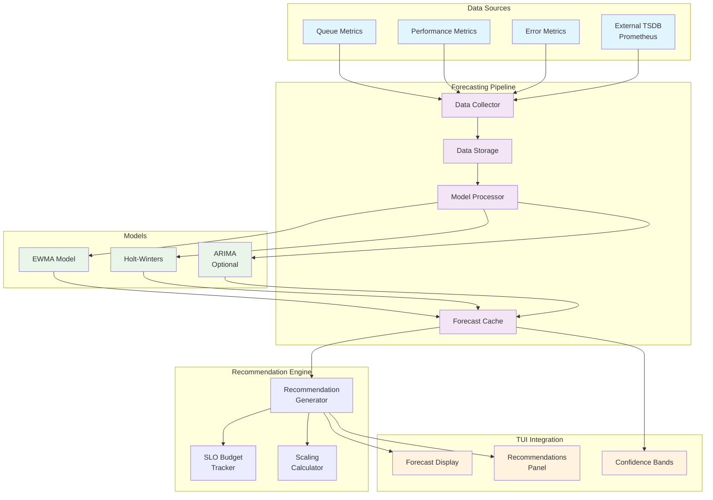
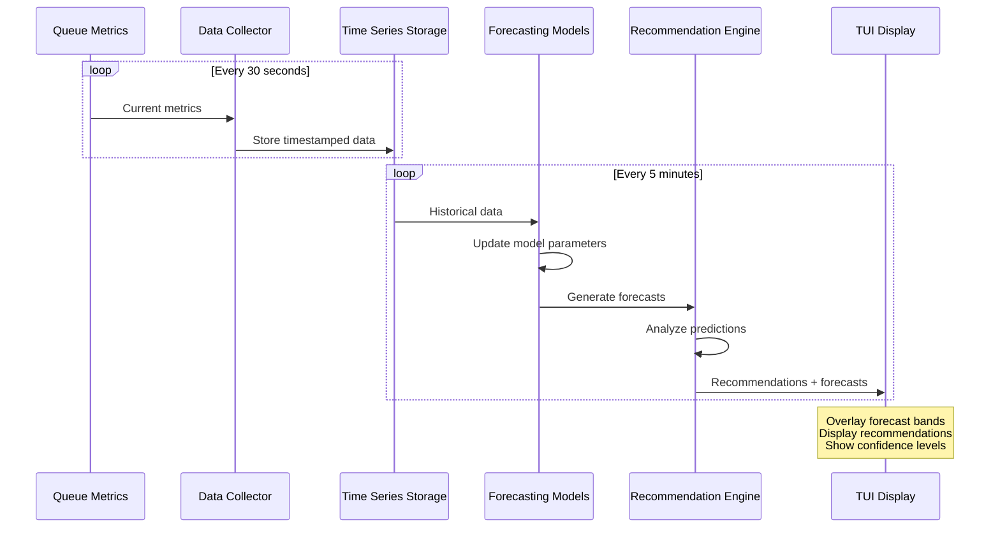
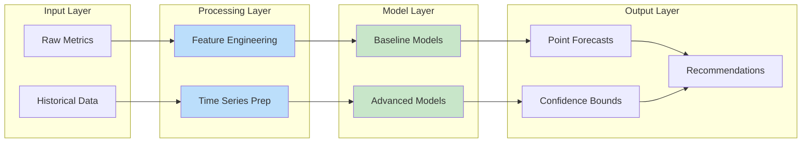

# F019 - Forecasting System Design

## Executive Summary

The Forecasting system transforms reactive queue management into proactive capacity planning by applying time-series analysis to queue metrics. It provides operators with predictive insights about future load, enabling preventive scaling actions and informed maintenance scheduling. The system combines statistical rigor with operator-friendly visualizations, turning complex mathematical models into clear, actionable recommendations.

This design delivers three core capabilities:
1. **Predictive Analytics**: Forecast backlog, throughput, and error trends using EWMA, Holt-Winters, and optional ARIMA models
2. **Actionable Recommendations**: Translate statistical forecasts into specific operator guidance with timing and confidence levels
3. **TUI Integration**: Overlay forecast bands on existing charts with dedicated recommendations panel

## System Architecture

### High-Level Architecture



### Component Interaction Flow



### Data Flow Architecture



## API Specification

### Core Forecasting Endpoints

#### Get Forecast Data

```http
GET /api/v1/forecasting/queues/{queue_name}/forecast
```

**Parameters:**
- `queue_name` (required): Queue identifier
- `horizon` (optional): Forecast horizon in minutes (default: 120)
- `model` (optional): Model type (ewma, holt-winters, arima)
- `confidence` (optional): Confidence level (default: 0.95)

**Response:**
```json
{
  "queue_name": "high-priority",
  "forecast": {
    "model_used": "holt-winters",
    "generated_at": "2025-09-14T18:47:37Z",
    "horizon_minutes": 120,
    "confidence_level": 0.95,
    "points": [150, 165, 180, 175, 160],
    "upper_bounds": [180, 200, 220, 210, 190],
    "lower_bounds": [120, 130, 140, 140, 130],
    "accuracy": {
      "mae": 12.5,
      "rmse": 18.3,
      "mape": 8.7,
      "r2_score": 0.89
    }
  }
}
```

#### Get Recommendations

```http
GET /api/v1/forecasting/recommendations
```

**Parameters:**
- `priority` (optional): Filter by priority (critical, high, medium, low)
- `category` (optional): Filter by category (scaling, slo, maintenance)
- `time_horizon` (optional): Recommendations for next N minutes

**Response:**
```json
{
  "recommendations": [
    {
      "id": "rec_001",
      "priority": "critical",
      "category": "capacity_scaling",
      "title": "HIGH PRIORITY",
      "description": "Scale workers +3 in next 25 minutes",
      "action": "kubectl scale deployment workers --replicas=8",
      "timing_minutes": 25,
      "confidence": 0.87,
      "forecast_basis": {
        "predicted_peak": 450,
        "current_capacity": 300,
        "utilization_threshold": 0.8
      }
    },
    {
      "id": "rec_002",
      "priority": "high",
      "category": "slo_management",
      "title": "SLO BUDGET",
      "description": "85% budget consumed this week",
      "action": "Review error rate trends and scaling policies",
      "timing_minutes": 60,
      "confidence": 0.92
    }
  ]
}
```

#### Update Model Configuration

```http
PUT /api/v1/forecasting/models/{model_name}/config
```

**Request Body:**
```json
{
  "model_type": "holt-winters",
  "parameters": {
    "alpha": 0.3,
    "beta": 0.1,
    "gamma": 0.05,
    "season_length": 24
  },
  "enabled": true,
  "auto_tune": false
}
```

### Model Management Endpoints

#### List Available Models

```http
GET /api/v1/forecasting/models
```

#### Get Model Status

```http
GET /api/v1/forecasting/models/{model_name}/status
```

#### Reset Model State

```http
POST /api/v1/forecasting/models/{model_name}/reset
```

## Data Models

### Core Data Structures

```json
{
  "$schema": "http://json-schema.org/draft-07/schema#",
  "definitions": {
    "ForecastResult": {
      "type": "object",
      "properties": {
        "model_used": {
          "type": "string",
          "enum": ["ewma", "holt-winters", "arima"]
        },
        "generated_at": {
          "type": "string",
          "format": "date-time"
        },
        "horizon_minutes": {
          "type": "integer",
          "minimum": 1,
          "maximum": 1440
        },
        "confidence_level": {
          "type": "number",
          "minimum": 0.5,
          "maximum": 0.99
        },
        "points": {
          "type": "array",
          "items": {"type": "number"}
        },
        "upper_bounds": {
          "type": "array",
          "items": {"type": "number"}
        },
        "lower_bounds": {
          "type": "array",
          "items": {"type": "number"}
        },
        "accuracy": {"$ref": "#/definitions/AccuracyMetrics"}
      },
      "required": ["model_used", "generated_at", "horizon_minutes", "points"]
    },

    "Recommendation": {
      "type": "object",
      "properties": {
        "id": {"type": "string"},
        "priority": {
          "type": "string",
          "enum": ["critical", "high", "medium", "low", "info"]
        },
        "category": {
          "type": "string",
          "enum": ["capacity_scaling", "slo_management", "maintenance_scheduling", "cost_optimization"]
        },
        "title": {"type": "string"},
        "description": {"type": "string"},
        "action": {"type": "string"},
        "timing_minutes": {
          "type": "integer",
          "minimum": 0
        },
        "confidence": {
          "type": "number",
          "minimum": 0,
          "maximum": 1
        },
        "forecast_basis": {"$ref": "#/definitions/ForecastBasis"}
      },
      "required": ["id", "priority", "category", "title", "description", "confidence"]
    },

    "AccuracyMetrics": {
      "type": "object",
      "properties": {
        "mae": {"type": "number"},
        "rmse": {"type": "number"},
        "mape": {"type": "number"},
        "prediction_bias": {"type": "number"},
        "r2_score": {"type": "number"},
        "last_updated": {"type": "string", "format": "date-time"}
      }
    },

    "ModelConfiguration": {
      "type": "object",
      "properties": {
        "model_type": {
          "type": "string",
          "enum": ["ewma", "holt-winters", "arima"]
        },
        "parameters": {"type": "object"},
        "enabled": {"type": "boolean"},
        "auto_tune": {"type": "boolean"},
        "update_interval_seconds": {
          "type": "integer",
          "minimum": 30,
          "maximum": 3600
        }
      },
      "required": ["model_type", "enabled"]
    }
  }
}
```

## Security Model

### Threat Analysis

| Threat | Impact | Likelihood | Mitigation |
|--------|---------|------------|------------|
| Forecast Manipulation | High | Low | Input validation, audit logging |
| Model Poisoning | Medium | Low | Anomaly detection, data validation |
| Unauthorized Access | High | Medium | RBAC, API authentication |
| Information Disclosure | Medium | Low | Rate limiting, sanitized responses |
| DoS via Complex Models | High | Medium | Resource limits, timeouts |

### Security Controls

#### Authentication & Authorization

- **API Authentication**: Bearer token or service account authentication
- **Role-Based Access**: Separate permissions for viewing vs modifying forecasts
- **Audit Logging**: All forecast requests and model changes logged

#### Input Validation

- **Parameter Validation**: Strict validation of forecast horizons and model parameters
- **Rate Limiting**: Prevent abuse of computationally expensive operations
- **Data Sanitization**: Validate all time series inputs for anomalies

#### Data Protection

- **Sensitive Data Handling**: Queue metrics may contain business-sensitive information
- **Access Controls**: Restrict forecast data based on queue access permissions
- **Retention Policies**: Automatic cleanup of historical forecast data

## Performance Requirements

### Latency Requirements

| Operation | Target | Maximum |
|-----------|---------|---------|
| Simple Forecast (EWMA) | 50ms | 100ms |
| Complex Forecast (Holt-Winters) | 200ms | 500ms |
| Recommendation Generation | 100ms | 300ms |
| TUI Chart Update | 25ms | 50ms |
| Model Parameter Update | 500ms | 2s |

### Throughput Requirements

| Metric | Target | Peak |
|--------|---------|------|
| Concurrent Forecasts | 50/sec | 100/sec |
| Model Updates | 10/sec | 20/sec |
| API Requests | 200/sec | 500/sec |
| Time Series Points | 1000/sec | 5000/sec |

### Resource Constraints

| Resource | Target | Maximum |
|----------|---------|---------|
| Memory per Model | 1MB | 5MB |
| CPU per Forecast | 10ms | 50ms |
| Storage per Queue | 10MB/day | 50MB/day |
| Cache Size | 100MB | 500MB |

### Scalability Targets

- **Queues Supported**: 1000+ concurrent queue forecasts
- **Historical Data**: 30 days retention by default
- **Model Instances**: 100+ concurrent model instances
- **Forecast Horizon**: Up to 24 hours with degraded accuracy

## Testing Strategy

### Unit Testing

#### Model Testing
- **EWMA Model**: Test smoothing parameter edge cases, forecast accuracy
- **Holt-Winters**: Test seasonal decomposition, parameter optimization
- **ARIMA**: Test model fitting, forecast generation, error handling

#### Component Testing
- **Data Collector**: Mock time series data, validate preprocessing
- **Recommendation Engine**: Test threshold logic, priority assignment
- **Cache Layer**: Test TTL behavior, memory limits, eviction policies

### Integration Testing

#### End-to-End Workflows
- **Forecast Generation**: Complete pipeline from metrics to recommendations
- **Model Switching**: Graceful fallback when models fail
- **TUI Integration**: Forecast display and user interaction

#### API Testing
- **REST Endpoints**: All API endpoints with various parameter combinations
- **Error Handling**: Invalid inputs, service unavailable scenarios
- **Rate Limiting**: Verify limits and proper error responses

### Performance Testing

#### Load Testing
- **Concurrent Forecasts**: 100+ simultaneous forecast requests
- **Model Training**: Large historical datasets (10K+ points)
- **Memory Usage**: Extended operation without memory leaks

#### Stress Testing
- **Resource Exhaustion**: Behavior under CPU/memory pressure
- **Model Complexity**: ARIMA models with large parameter spaces
- **Data Volume**: High-frequency time series (1 point/second)

### Accuracy Testing

#### Model Validation
- **Historical Backtesting**: Test against known historical data
- **Cross-Validation**: Time series split validation
- **Benchmark Comparison**: Compare against naive forecasts

#### Recommendation Testing
- **Threshold Sensitivity**: Validate recommendation triggers
- **False Positive Rate**: Measure unnecessary alerts
- **User Acceptance**: Track recommendation follow-through rates

## Deployment Plan

### Rollout Strategy

#### Phase 1: Basic EWMA (Week 1-2)
- Deploy EWMA model with basic TUI integration
- Monitor performance and accuracy metrics
- Gather user feedback on recommendation usefulness

#### Phase 2: Advanced Models (Week 3-4)
- Add Holt-Winters seasonal forecasting
- Implement confidence bands and uncertainty quantification
- Enhanced recommendation engine with SLO budget tracking

#### Phase 3: Production Optimization (Week 5-6)
- Performance tuning and cache optimization
- Advanced alerting and model health monitoring
- Optional ARIMA integration for power users

### Monitoring and Alerting

#### Key Metrics
- **Model Accuracy**: Track RMSE, MAE, MAPE over time
- **Prediction Latency**: P95/P99 forecast generation times
- **Recommendation Acceptance**: User follow-through on suggestions
- **System Health**: Memory usage, CPU utilization, error rates

#### Alert Conditions
- Model accuracy degradation (RMSE increase >20%)
- Forecast generation failures
- API response time >500ms consistently
- Memory usage >80% of allocated

### Rollback Plan

#### Graceful Degradation
- Disable forecasting while maintaining basic monitoring
- Fallback to simple moving averages if models fail
- Maintain historical data for quick re-enablement

#### Emergency Procedures
- Circuit breaker for model computation
- Immediate fallback to cached forecasts
- Manual override controls for critical situations

---

This design provides a comprehensive foundation for implementing predictive analytics in the queue system, balancing statistical sophistication with operational practicality.