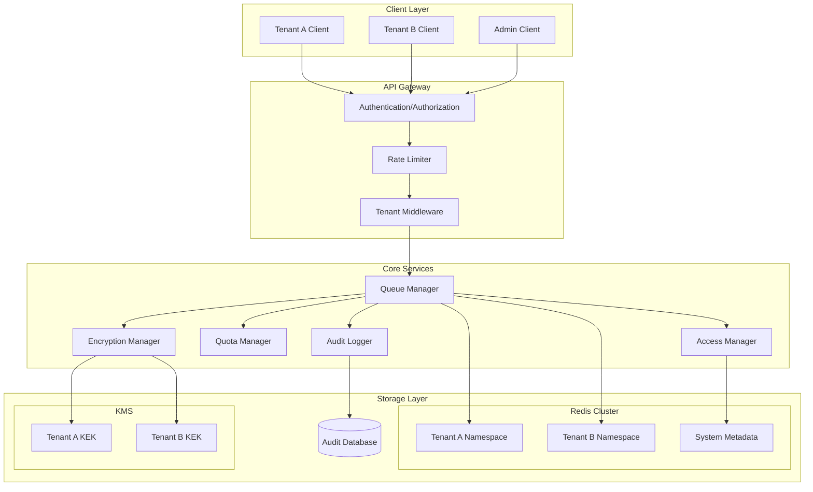
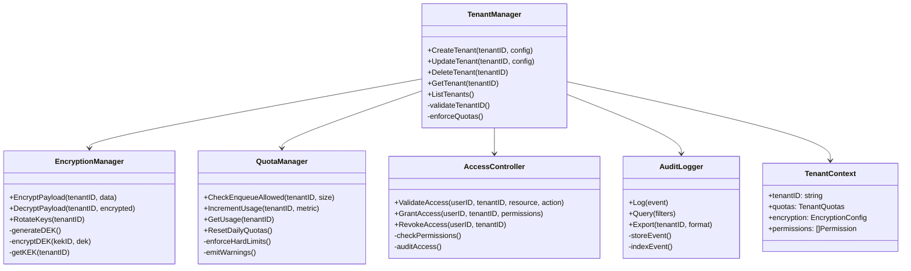
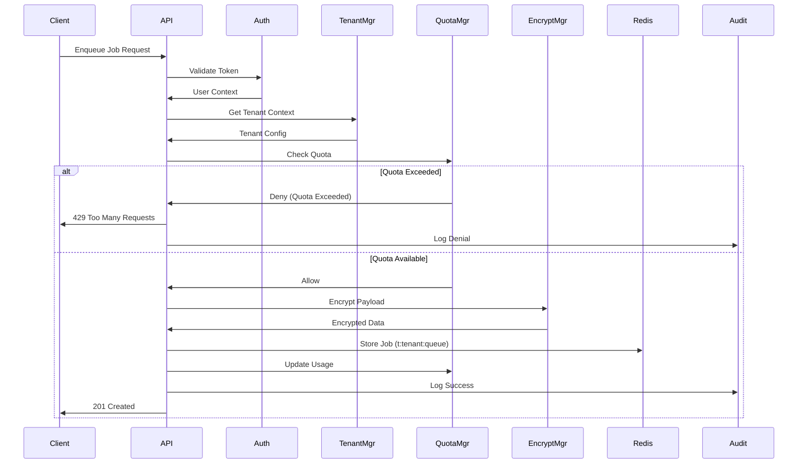
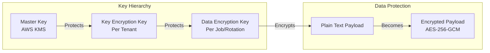
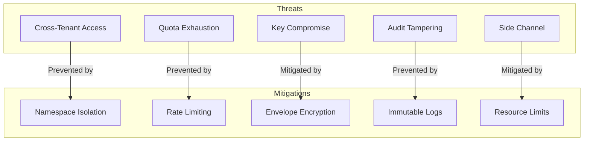
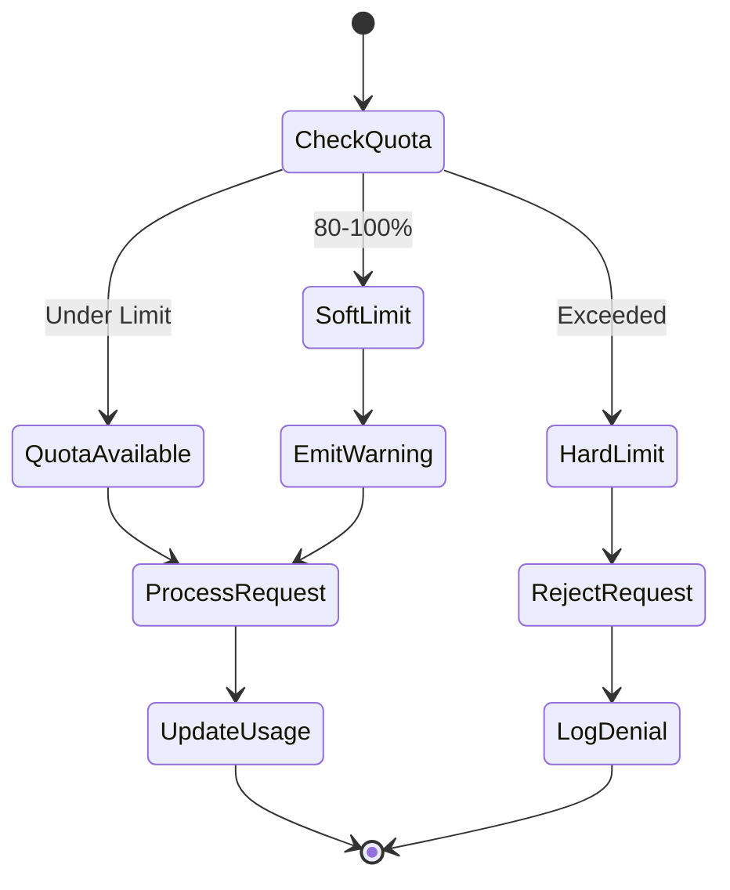
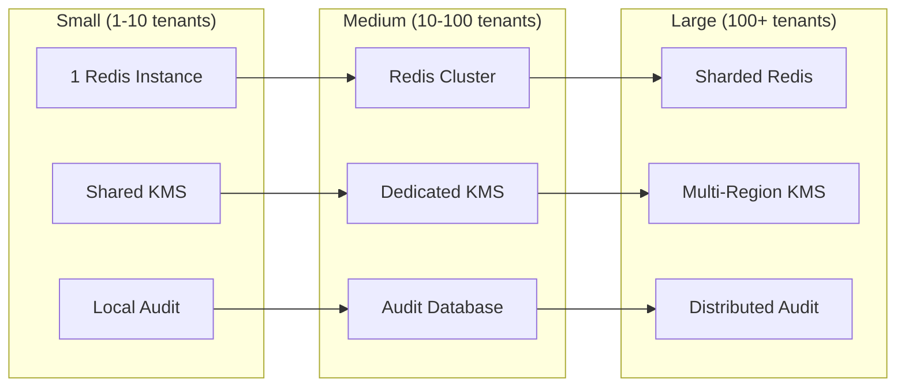
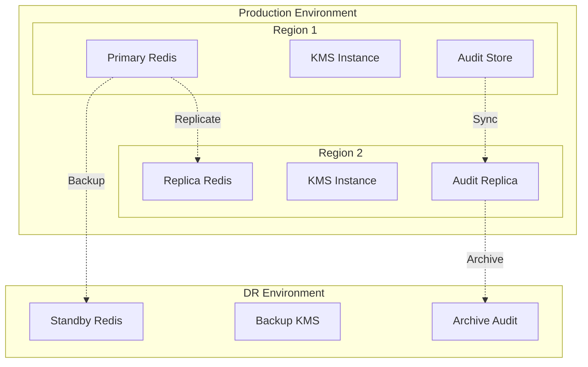

# Multi-Tenant Isolation - Architecture Design

## Executive Summary

This document describes the architecture for implementing comprehensive multi-tenant isolation in the Redis Work Queue system. The design provides cryptographic isolation, fine-grained access control, resource quotas, and complete audit visibility while maintaining high performance and operational simplicity.

## System Architecture

### Overview

The multi-tenant isolation system transforms a shared queue infrastructure into a secure, compliant platform that multiple organizations can trust with sensitive workloads. Each tenant operates in complete isolation with their own namespace, encryption keys, quotas, and access controls.

### Architecture Diagram



### Component Architecture



### Data Flow



## Key Management System

### Namespace Design

```
# Queue Resources
t:{tenant_id}:{queue_name}           # Queue metadata
t:{tenant_id}:{queue_name}:jobs      # Job list
t:{tenant_id}:{queue_name}:dlq       # Dead letter queue
t:{tenant_id}:{queue_name}:workers   # Worker registry
t:{tenant_id}:{queue_name}:metrics   # Queue metrics
t:{tenant_id}:{queue_name}:locks     # Distributed locks

# Tenant Configuration
tenant:{tenant_id}:config            # Tenant configuration
tenant:{tenant_id}:quotas           # Quota tracking
tenant:{tenant_id}:keys             # Encryption key metadata
tenant:{tenant_id}:audit            # Audit log indices
tenant:{tenant_id}:users            # User access list

# System Resources
system:tenants                      # Tenant registry
system:metrics:{tenant_id}          # Per-tenant system metrics
system:quotas:hourly:{tenant_id}    # Hourly quota counters
system:quotas:daily:{tenant_id}     # Daily quota counters
```

### Tenant ID Validation

- Length: 3-32 characters
- Format: lowercase alphanumeric with hyphens
- Pattern: `^[a-z0-9][a-z0-9-]*[a-z0-9]$`
- Reserved: system, admin, default, test

## Security Model

### Encryption Architecture



### Access Control Matrix

| Resource | Admin | Tenant Owner | Queue Manager | Worker | Viewer |
|----------|-------|--------------|---------------|--------|--------|
| Create Tenant | ✓ | - | - | - | - |
| Manage Quotas | ✓ | ✓ | - | - | - |
| Create Queue | ✓ | ✓ | ✓ | - | - |
| Enqueue Job | ✓ | ✓ | ✓ | ✓ | - |
| Dequeue Job | ✓ | ✓ | ✓ | ✓ | - |
| View Metrics | ✓ | ✓ | ✓ | ✓ | ✓ |
| View Audit Log | ✓ | ✓ | - | - | - |
| Rotate Keys | ✓ | ✓ | - | - | - |

### Threat Model



## Quota Management

### Quota Types

```yaml
tenant_quotas:
  # Job Limits
  max_jobs_per_hour: 10000
  max_jobs_per_day: 200000
  max_backlog_size: 50000
  max_job_size_bytes: 1048576  # 1MB

  # Resource Limits
  max_queues_per_tenant: 100
  max_workers_per_queue: 50
  max_storage_bytes: 10737418240  # 10GB

  # Rate Limits
  enqueue_rate_limit: 100  # per second
  dequeue_rate_limit: 200  # per second

  # Soft Limits (warnings at 80%)
  soft_limit_threshold: 0.8
```

### Quota Enforcement Flow



## Performance Requirements

### Latency Targets

| Operation | P50 | P95 | P99 | P99.9 |
|-----------|-----|-----|-----|-------|
| Tenant Validation | 1ms | 5ms | 10ms | 50ms |
| Quota Check | 2ms | 10ms | 20ms | 100ms |
| Encryption (1KB) | 5ms | 20ms | 50ms | 200ms |
| Audit Logging | 10ms | 50ms | 100ms | 500ms |
| Key Rotation | 100ms | 500ms | 1s | 5s |

### Throughput Requirements

- Tenant Operations: 1,000 ops/sec per tenant
- Quota Checks: 10,000 ops/sec globally
- Encryption: 5,000 ops/sec per tenant
- Audit Events: 50,000 events/sec globally

### Resource Scaling



## Testing Strategy

### Unit Tests

```go
// Test tenant validation
func TestTenantIDValidation(t *testing.T) {
    validIDs := []string{"acme-corp", "tenant-123", "a1b2c3"}
    invalidIDs := []string{"-invalid", "invalid-", "UPPERCASE", "too_long_tenant_id_exceeding_32_chars"}

    for _, id := range validIDs {
        assert.NoError(t, TenantID(id).Validate())
    }

    for _, id := range invalidIDs {
        assert.Error(t, TenantID(id).Validate())
    }
}

// Test quota enforcement
func TestQuotaEnforcement(t *testing.T) {
    mgr := NewQuotaManager()
    tenant := TenantID("test-tenant")

    // Set quota
    mgr.SetQuota(tenant, TenantQuotas{
        MaxJobsPerHour: 100,
    })

    // Exhaust quota
    for i := 0; i < 100; i++ {
        err := mgr.CheckEnqueueAllowed(tenant, 1024)
        assert.NoError(t, err)
    }

    // Should be rejected
    err := mgr.CheckEnqueueAllowed(tenant, 1024)
    assert.ErrorIs(t, err, ErrQuotaExceeded)
}
```

### Integration Tests

```go
// Test cross-tenant isolation
func TestCrossTenantIsolation(t *testing.T) {
    tenantA := setupTenant("tenant-a")
    tenantB := setupTenant("tenant-b")

    // Create job in tenant A
    jobID := tenantA.EnqueueJob("test-job")

    // Try to access from tenant B
    job, err := tenantB.GetJob(jobID)
    assert.ErrorIs(t, err, ErrAccessDenied)
    assert.Nil(t, job)
}

// Test encryption end-to-end
func TestEncryption(t *testing.T) {
    tenant := setupTenantWithEncryption("encrypted-tenant")
    plaintext := []byte("sensitive data")

    // Enqueue encrypted job
    jobID := tenant.EnqueueJob(plaintext)

    // Verify Redis contains encrypted data
    raw := getRedisValue(jobID)
    assert.NotEqual(t, plaintext, raw)

    // Verify decryption works
    job := tenant.GetJob(jobID)
    assert.Equal(t, plaintext, job.Payload)
}
```

### Security Tests

- Penetration testing for cross-tenant access
- Fuzzing tenant ID validation
- Key rotation under load
- Quota exhaustion attacks
- Audit trail tampering attempts

### Performance Tests

```yaml
scenarios:
  - name: "Single Tenant Load"
    tenants: 1
    workers_per_tenant: 10
    enqueue_rate: 1000
    duration: 300s

  - name: "Multi-Tenant Fair Share"
    tenants: 10
    workers_per_tenant: 5
    enqueue_rate: 100
    duration: 600s

  - name: "Quota Enforcement"
    tenants: 5
    workers_per_tenant: 10
    enqueue_rate: 10000  # Exceed quota
    duration: 60s
    expected: quota_errors

  - name: "Encryption Overhead"
    tenants: 3
    encryption: enabled
    payload_size: 10KB
    enqueue_rate: 100
    measure: latency_impact
```

## Migration Plan

### Phase 1: Foundation (Week 1-2)
- Implement tenant ID validation
- Add namespace prefixing to keys
- Create tenant configuration storage

### Phase 2: Access Control (Week 3-4)
- Integrate with RBAC system
- Add tenant context to API
- Implement permission validation

### Phase 3: Quotas (Week 5-6)
- Build quota tracking system
- Add rate limiting per tenant
- Implement soft/hard limits

### Phase 4: Encryption (Week 7-8)
- Integrate with KMS
- Implement envelope encryption
- Add key rotation mechanism

### Phase 5: Audit & Monitoring (Week 9-10)
- Deploy audit logging
- Add tenant metrics
- Build compliance reports

## Compliance Considerations

### SOC 2 Type II
- Logical access controls per tenant
- Encryption of sensitive data
- Comprehensive audit logging
- Change management procedures

### GDPR
- Data isolation by tenant
- Right to erasure (crypto-shredding)
- Data portability via export
- Processing activity records

### HIPAA
- Encryption at rest and in transit
- Access controls and audit logs
- Business Associate Agreements
- Incident response procedures

## Deployment Architecture



## Monitoring & Observability

### Key Metrics

```yaml
tenant_metrics:
  - metric: tenant.jobs.enqueued
    type: counter
    labels: [tenant_id, queue_name]

  - metric: tenant.quota.usage
    type: gauge
    labels: [tenant_id, quota_type]

  - metric: tenant.encryption.operations
    type: counter
    labels: [tenant_id, operation]

  - metric: tenant.access.denied
    type: counter
    labels: [tenant_id, resource, reason]

  - metric: tenant.audit.events
    type: counter
    labels: [tenant_id, action, result]
```

### Alerting Rules

```yaml
alerts:
  - name: TenantQuotaWarning
    condition: tenant.quota.usage > 0.8 * quota_limit
    severity: warning

  - name: TenantQuotaExceeded
    condition: tenant.quota.usage >= quota_limit
    severity: critical

  - name: CrossTenantAccessAttempt
    condition: tenant.access.denied{reason="cross_tenant"} > 0
    severity: security

  - name: EncryptionKeyRotationDue
    condition: time() - tenant.key.last_rotation > 30d
    severity: warning
```

## Success Criteria

1. **Isolation**: Zero cross-tenant data leakage in 6 months of operation
2. **Performance**: <10ms overhead for tenant operations at P95
3. **Compliance**: Pass SOC 2 Type II audit
4. **Scalability**: Support 1000+ tenants on single cluster
5. **Reliability**: 99.99% availability for tenant operations

---

*Document Version: 1.0*
*Last Updated: 2025-09-14*
*Status: DESIGN PHASE*