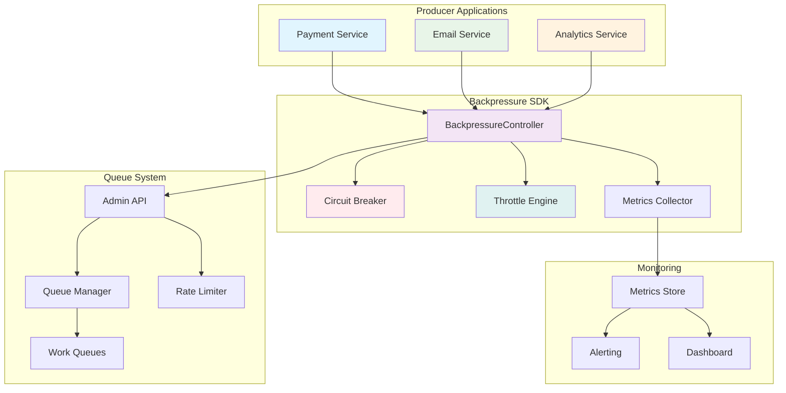
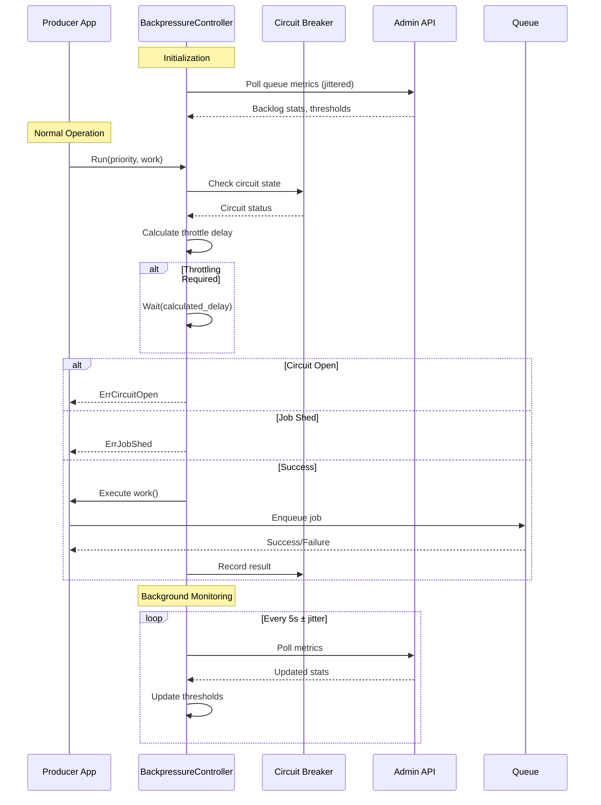
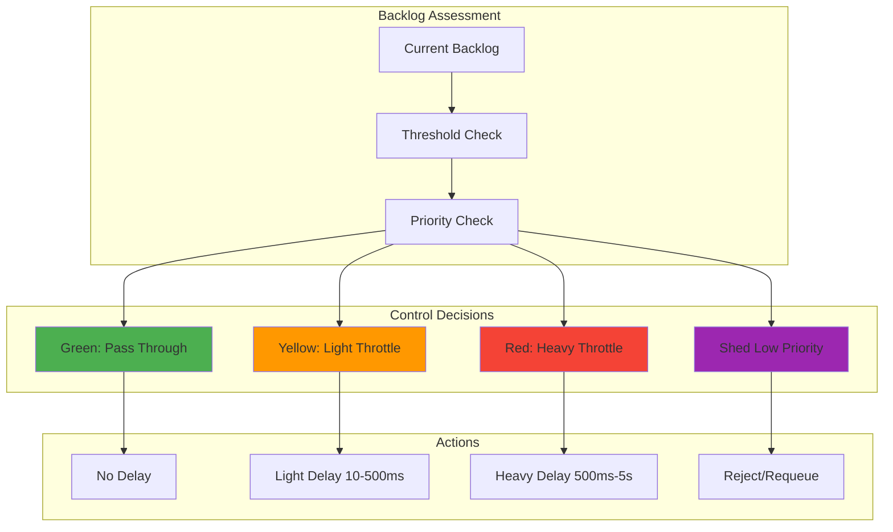
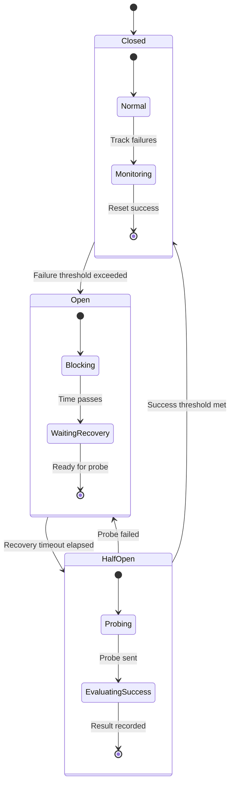

# Producer Backpressure System Design (F021)

| Feature ID | F021 |
|------------|------|
| Feature Name | Producer Backpressure |
| Priority | Medium-High |
| Complexity | Medium |
| Estimated Effort | 5 (Fibonacci) |

## Executive Summary

The Producer Backpressure system transforms reactive failure handling into proactive flow control. Instead of systems failing catastrophically when overwhelmed, producers intelligently throttle themselves based on real-time queue health signals. This creates a self-regulating ecosystem where high-priority work flows smoothly while lower-priority tasks gracefully yield resources.

The system provides:
- **Real-time backpressure signals** through intelligent polling of queue metrics
- **Priority-aware circuit breakers** that protect critical workflows while shedding non-essential work
- **SDK helpers** that make adoption effortless for producers
- **Graduated throttling** that prevents cascading failures

This transforms queue management from reactive panic into proactive control, enabling systems to handle load spikes gracefully rather than melting down spectacularly.

## System Architecture

### High-Level Architecture



### Component Interaction Flow



### Priority-Based Flow Control



### Circuit Breaker State Machine



## Detailed Component Design

### BackpressureController

The core component that orchestrates flow control decisions:

```go
type BackpressureController struct {
    // Configuration
    config          BackpressureConfig
    thresholds      map[string]*BacklogThresholds  // per queue
    circuitBreakers map[string]*CircuitBreaker     // per queue

    // State management
    metrics         BackpressureMetrics
    lastPoll        time.Time
    cachedStats     map[string]*QueueStats
    pollJitter      *rand.Rand

    // Dependencies
    adminClient     AdminAPIClient
    logger          Logger
    metricsReporter MetricsReporter
}
```

**Key Responsibilities:**
- Poll Admin API for queue health metrics with jittered intervals
- Calculate throttle recommendations based on priority and queue state
- Manage circuit breaker states per queue
- Export observability metrics
- Provide simple SDK integration points

### Throttle Calculation Engine

Implements adaptive throttling based on queue backlog and priority:

```go
type ThrottleEngine struct {
    thresholds BacklogThresholds
    config     ThrottleConfig
}

func (te *ThrottleEngine) CalculateDelay(backlog int, priority Priority) time.Duration {
    window := te.getWindowForPriority(priority)

    switch {
    case backlog <= window.Green:
        return 0  // No throttling in green zone
    case backlog <= window.Yellow:
        // Linear interpolation in yellow zone
        ratio := float64(backlog - window.Green) / float64(window.Yellow - window.Green)
        return time.Duration(10 + 490*ratio) * time.Millisecond
    default:
        // Exponential backoff in red zone with priority scaling
        ratio := math.Min(1.0, float64(backlog - window.Yellow) / float64(window.Red - window.Yellow))
        baseDelay := time.Duration(500 + 4500*ratio) * time.Millisecond
        return te.applyPriorityScaling(baseDelay, priority, ratio)
    }
}
```

### Circuit Breaker Implementation

Prevents cascade failures during extreme load conditions:

```go
type CircuitBreaker struct {
    state           CircuitState
    config          CircuitConfig
    failureWindow   *SlidingWindow
    successWindow   *SlidingWindow
    lastStateChange time.Time
    metrics         *CircuitMetrics
}

func (cb *CircuitBreaker) Execute(ctx context.Context, operation func() error) error {
    if !cb.ShouldAllow() {
        cb.metrics.IncRejected()
        return ErrCircuitOpen
    }

    start := time.Now()
    err := operation()
    duration := time.Since(start)

    cb.RecordResult(err == nil, duration)

    if err != nil {
        cb.metrics.IncFailures()
        return err
    }

    cb.metrics.IncSuccesses()
    return nil
}
```

### Priority Management System

Implements sophisticated priority-aware flow control:

```go
type PriorityConfig struct {
    High   PriorityThresholds  // Payments, auth, critical API
    Medium PriorityThresholds  // User notifications, reports
    Low    PriorityThresholds  // Batch operations, analytics
}

type PriorityThresholds struct {
    ThrottleMultiplier float64   // Scaling factor for delays
    ShedThreshold      float64   // Queue utilization to start shedding
    MaxDelay          time.Duration  // Maximum allowed delay
    CircuitTripRatio   float64   // Circuit breaker sensitivity
}
```

### Metrics and Observability

Comprehensive metrics for monitoring and alerting:

```go
type BackpressureMetrics struct {
    // Throttling metrics
    ThrottleEvents    *prometheus.CounterVec    // By priority, queue, reason
    ThrottleDelays    *prometheus.HistogramVec  // Delay distributions
    ShedEvents        *prometheus.CounterVec    // Jobs shed by priority

    // Circuit breaker metrics
    CircuitState      *prometheus.GaugeVec      // Current circuit states
    CircuitTrips      *prometheus.CounterVec    // Trip events
    CircuitRecoveries *prometheus.CounterVec    // Recovery events

    // Queue health metrics
    QueueBacklog      *prometheus.GaugeVec      // Current backlog sizes
    QueueAge          *prometheus.GaugeVec      // Oldest job age
    ProducerLatency   *prometheus.HistogramVec  // End-to-end latency

    // Compliance metrics
    ThrottleCompliance *prometheus.GaugeVec     // Producer compliance rate
    APICallSuccess     *prometheus.CounterVec   // Admin API call results
}
```

## API Specification

### Admin API Extensions

The Admin API provides backpressure-specific endpoints for queue health monitoring:

**GET /api/v1/backpressure/stats**
- Returns real-time queue health metrics
- Includes backlog sizes, processing rates, and threshold states
- Supports filtering by queue and priority

**GET /api/v1/backpressure/thresholds**
- Returns current threshold configuration
- Allows per-queue and per-priority customization

**POST /api/v1/backpressure/thresholds**
- Updates threshold configuration
- Validates threshold ordering and sanity checks
- Triggers immediate threshold recalculation

### SDK Integration API

**Core Interface:**
```go
type BackpressureController interface {
    // Execute work with backpressure awareness
    Run(ctx context.Context, priority Priority, work func()) error

    // Get throttle recommendation without executing
    SuggestThrottle(priority Priority) time.Duration

    // Check if circuit breaker allows operation
    CircuitAllows(queue string) bool

    // Manual circuit breaker control
    TripCircuit(queue string) error
    ResetCircuit(queue string) error

    // Configuration management
    UpdateThresholds(thresholds BacklogThresholds) error
    GetCurrentStats() BackpressureStats
}
```

### HTTP Response Headers

When using HTTP-based Admin API, responses include backpressure hints:

```http
HTTP/1.1 200 OK
X-Backpressure-Status: throttled
X-Backpressure-Delay: 250ms
X-Backpressure-Priority: medium
X-Circuit-Breaker-State: closed
X-Queue-Backlog: 1500
X-Queue-Threshold: yellow
```

## Data Models

### Configuration Models

```go
type BackpressureConfig struct {
    // Polling configuration
    PollInterval     time.Duration `json:"poll_interval"`
    PollJitter       time.Duration `json:"poll_jitter"`
    PollTimeout      time.Duration `json:"poll_timeout"`

    // Circuit breaker defaults
    CircuitConfig    CircuitConfig `json:"circuit_config"`

    // Priority configuration
    PriorityConfig   PriorityConfig `json:"priority_config"`

    // Fallback behavior
    FallbackMode     bool          `json:"fallback_mode"`
    GracefulDegrade  time.Duration `json:"graceful_degrade"`
}

type BacklogThresholds struct {
    QueueName string                           `json:"queue_name"`
    Thresholds map[Priority]*BacklogWindow     `json:"thresholds"`
    UpdatedAt time.Time                       `json:"updated_at"`
}

type BacklogWindow struct {
    Green  int `json:"green_max"`   // 0-N: no throttling
    Yellow int `json:"yellow_max"`  // N-M: light throttling
    Red    int `json:"red_max"`     // M+: heavy throttling/shedding
}
```

### Runtime State Models

```go
type QueueStats struct {
    QueueName        string        `json:"queue_name"`
    CurrentBacklog   int           `json:"current_backlog"`
    ProcessingRate   float64       `json:"processing_rate"`
    OldestJobAge     time.Duration `json:"oldest_job_age"`
    AvgJobLatency    time.Duration `json:"avg_job_latency"`
    RateLimitBudget  float64       `json:"rate_limit_budget"`
    LastUpdated      time.Time     `json:"last_updated"`
}

type CircuitBreakerState struct {
    QueueName       string       `json:"queue_name"`
    State           CircuitState `json:"state"`
    FailureCount    int          `json:"failure_count"`
    SuccessCount    int          `json:"success_count"`
    LastStateChange time.Time    `json:"last_state_change"`
    NextProbeTime   *time.Time   `json:"next_probe_time,omitempty"`
}
```

## Security Model

### Threat Analysis

**T1: Backpressure Signal Manipulation**
- **Risk**: Malicious actors could manipulate queue metrics to cause inappropriate throttling
- **Mitigation**: Read-only API credentials, authenticated polling, metric validation

**T2: Denial of Service via Circuit Breaking**
- **Risk**: Triggering circuit breakers to deny legitimate traffic
- **Mitigation**: Rate limiting, authentication, manual override capabilities

**T3: Information Disclosure**
- **Risk**: Queue health metrics could reveal system capacity and usage patterns
- **Mitigation**: Least-privilege access, secure credential management, audit logging

**T4: Configuration Tampering**
- **Risk**: Unauthorized threshold changes could disable protection mechanisms
- **Mitigation**: Role-based access control, configuration versioning, change auditing

### Security Controls

```go
type SecurityConfig struct {
    // Authentication
    APICredentials   SecureCredentials `json:"api_credentials"`
    CredentialRotation time.Duration  `json:"credential_rotation"`

    // Authorization
    RequiredScopes   []string         `json:"required_scopes"`
    RoleBasedAccess  bool             `json:"role_based_access"`

    // Audit and monitoring
    AuditLogging     bool             `json:"audit_logging"`
    SecurityMetrics  bool             `json:"security_metrics"`

    // Emergency controls
    ManualOverride   bool             `json:"manual_override"`
    EmergencyDisable bool             `json:"emergency_disable"`
}
```

### Credential Management

- **Principle of Least Privilege**: Backpressure polling uses read-only credentials
- **Credential Rotation**: Automatic rotation every 90 days with seamless transition
- **Secure Storage**: Credentials stored in secure credential management systems
- **Network Security**: TLS encryption for all API communications

## Performance Requirements

### Latency Requirements

| Operation | Target Latency | Maximum Latency |
|-----------|----------------|-----------------|
| Throttle decision | < 1ms | 5ms |
| Circuit breaker check | < 0.5ms | 2ms |
| Admin API poll | < 100ms | 500ms |
| Configuration update | < 10ms | 50ms |

### Throughput Requirements

| Metric | Target | Peak |
|--------|--------|------|
| Throttle decisions/sec | 10,000 | 50,000 |
| API polls/sec | 10 | 100 |
| Circuit breaker checks/sec | 50,000 | 200,000 |
| Metric updates/sec | 1,000 | 5,000 |

### Resource Requirements

| Component | Memory | CPU | Network |
|-----------|---------|-----|---------|
| BackpressureController | 50KB | 0.1% | 1KB/s |
| Circuit Breaker | 10KB | 0.05% | - |
| Metrics Collection | 100KB | 0.2% | 5KB/s |
| **Total per instance** | **160KB** | **0.35%** | **6KB/s** |

### Scalability Characteristics

- **Horizontal Scaling**: Each producer instance runs independent backpressure controller
- **Vertical Scaling**: Linear resource usage with request volume
- **Network Efficiency**: Batched API calls, intelligent caching
- **Memory Efficiency**: Sliding windows, LRU caches, bounded collections

## Testing Strategy

### Unit Testing

**Throttle Calculation Testing:**
```go
func TestThrottleCalculation(t *testing.T) {
    tests := []struct {
        name     string
        backlog  int
        priority Priority
        expected time.Duration
    }{
        {"green_zone_high_priority", 100, HighPriority, 0},
        {"yellow_zone_medium_priority", 1000, MediumPriority, 250*time.Millisecond},
        {"red_zone_low_priority", 3000, LowPriority, InfiniteDelay},
    }

    for _, tt := range tests {
        t.Run(tt.name, func(t *testing.T) {
            engine := NewThrottleEngine(defaultThresholds)
            delay := engine.CalculateDelay(tt.backlog, tt.priority)
            assert.Equal(t, tt.expected, delay)
        })
    }
}
```

**Circuit Breaker State Machine Testing:**
```go
func TestCircuitBreakerTransitions(t *testing.T) {
    cb := NewCircuitBreaker(defaultConfig)

    // Test closed -> open transition
    for i := 0; i < 5; i++ {
        cb.RecordResult(false, 100*time.Millisecond)
    }
    assert.Equal(t, CircuitStateOpen, cb.GetState())

    // Test open -> half-open transition
    time.Sleep(cb.config.RecoveryTimeout)
    assert.True(t, cb.ShouldAllow())
    assert.Equal(t, CircuitStateHalfOpen, cb.GetState())
}
```

### Integration Testing

**End-to-End Flow Testing:**
```go
func TestBackpressureIntegration(t *testing.T) {
    // Setup test environment
    testQueue := setupTestQueue(t)
    adminAPI := setupMockAdminAPI(t)
    bp := NewBackpressureController(adminAPI, defaultConfig)

    // Simulate increasing load
    for backlog := 0; backlog < 5000; backlog += 500 {
        adminAPI.SetBacklog("test-queue", backlog)

        delay := bp.SuggestThrottle(MediumPriority)

        // Verify throttling increases with backlog
        if backlog > 1000 {
            assert.True(t, delay > 0, "Expected throttling at backlog %d", backlog)
        }
    }
}
```

### Load Testing

**Performance Benchmarks:**
```go
func BenchmarkThrottleDecision(b *testing.B) {
    bp := NewBackpressureController(mockAPI, defaultConfig)

    b.ResetTimer()
    for i := 0; i < b.N; i++ {
        bp.SuggestThrottle(MediumPriority)
    }
}

func BenchmarkCircuitBreakerCheck(b *testing.B) {
    cb := NewCircuitBreaker(defaultConfig)

    b.ResetTimer()
    for i := 0; i < b.N; i++ {
        cb.ShouldAllow()
    }
}
```

**Stress Testing Scenarios:**
1. **API Unavailability**: Test behavior when Admin API is unreachable
2. **High Failure Rates**: Validate circuit breaker protection
3. **Rapid Configuration Changes**: Ensure thread safety
4. **Memory Pressure**: Verify graceful degradation under resource constraints

### Chaos Engineering

**Failure Injection Tests:**
- Random Admin API failures during polling
- Network partitions between producer and queue system
- Clock skew simulation for timing-dependent logic
- Memory pressure simulation for resource-constrained environments

## Deployment Plan

### Phased Rollout Strategy

**Phase 1: Core Infrastructure (Week 1-2)**
- Deploy Admin API extensions for backpressure metrics
- Implement basic threshold configuration
- Set up monitoring and alerting infrastructure

**Phase 2: SDK Development (Week 3-4)**
- Implement Go SDK with basic throttling
- Add circuit breaker functionality
- Create comprehensive test suite

**Phase 3: Pilot Deployment (Week 5-6)**
- Deploy to staging environment
- Enable for low-risk producer applications
- Collect performance and reliability metrics

**Phase 4: Production Rollout (Week 7-8)**
- Gradual rollout to production producers
- Monitor system behavior and tune thresholds
- Full documentation and training materials

### Configuration Management

**Default Configurations:**
```yaml
backpressure:
  poll_interval: 5s
  poll_jitter: 1s
  poll_timeout: 2s

  thresholds:
    default:
      high_priority:
        green: 1000
        yellow: 5000
        red: 10000
      medium_priority:
        green: 500
        yellow: 2000
        red: 5000
      low_priority:
        green: 100
        yellow: 500
        red: 1000

  circuit_breaker:
    failure_threshold: 5
    recovery_threshold: 3
    trip_window: 30s
    recovery_timeout: 60s
    probe_interval: 10s
```

### Monitoring Setup

**Essential Dashboards:**
1. **System Health**: Circuit breaker states, queue backlogs, throttle rates
2. **Producer Compliance**: Throttle compliance by application
3. **Performance Impact**: Latency distributions, error rates
4. **Capacity Planning**: Resource utilization, scaling recommendations

**Critical Alerts:**
1. Circuit breaker trips requiring immediate attention
2. High job shed rates indicating capacity issues
3. Admin API failures affecting backpressure decisions
4. Threshold violations requiring configuration adjustments

### Rollback Procedures

**Emergency Rollback Triggers:**
- Cascade failures despite backpressure activation
- Unacceptable latency impact on critical services
- Producer compliance below acceptable thresholds
- System instability or unexpected behavior

**Rollback Process:**
1. Disable backpressure system via feature flag
2. Reset all circuit breakers to closed state
3. Clear throttling queues and resume normal operation
4. Investigate root cause and implement fixes
5. Plan careful re-deployment with lessons learned

## Conclusion

The Producer Backpressure system represents a fundamental shift from reactive failure handling to proactive flow control. By providing real-time queue health signals, intelligent throttling, and priority-aware circuit breakers, this system transforms how applications handle load spikes and prevent cascade failures.

The design emphasizes:
- **Simplicity**: SDK helpers make adoption effortless
- **Intelligence**: Priority-aware decisions protect critical workflows
- **Reliability**: Circuit breakers prevent cascade failures
- **Observability**: Comprehensive metrics enable monitoring and optimization
- **Safety**: Multiple fallback mechanisms ensure system stability

This system will significantly improve overall system reliability, reduce late-night pages, and provide operators with powerful tools to manage system load proactively rather than reactively.

The implementation follows industry best practices from Netflix, AWS, and Google, putting this queue system in the same reliability league as major cloud platforms while maintaining the simplicity that makes it accessible to teams of all sizes.