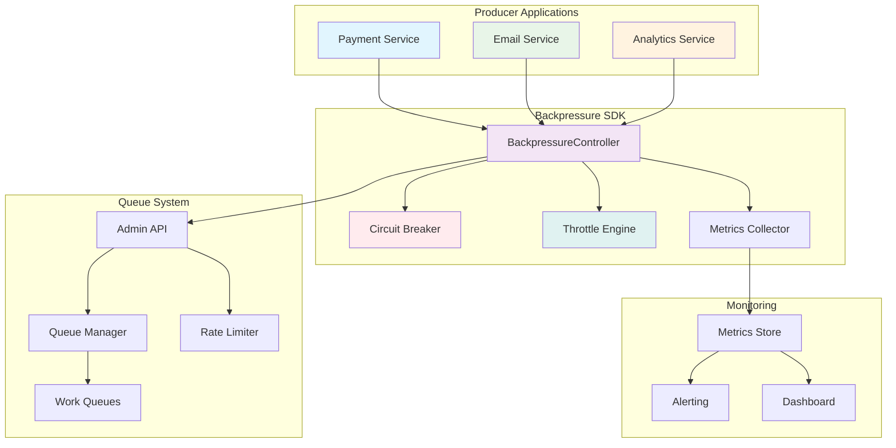
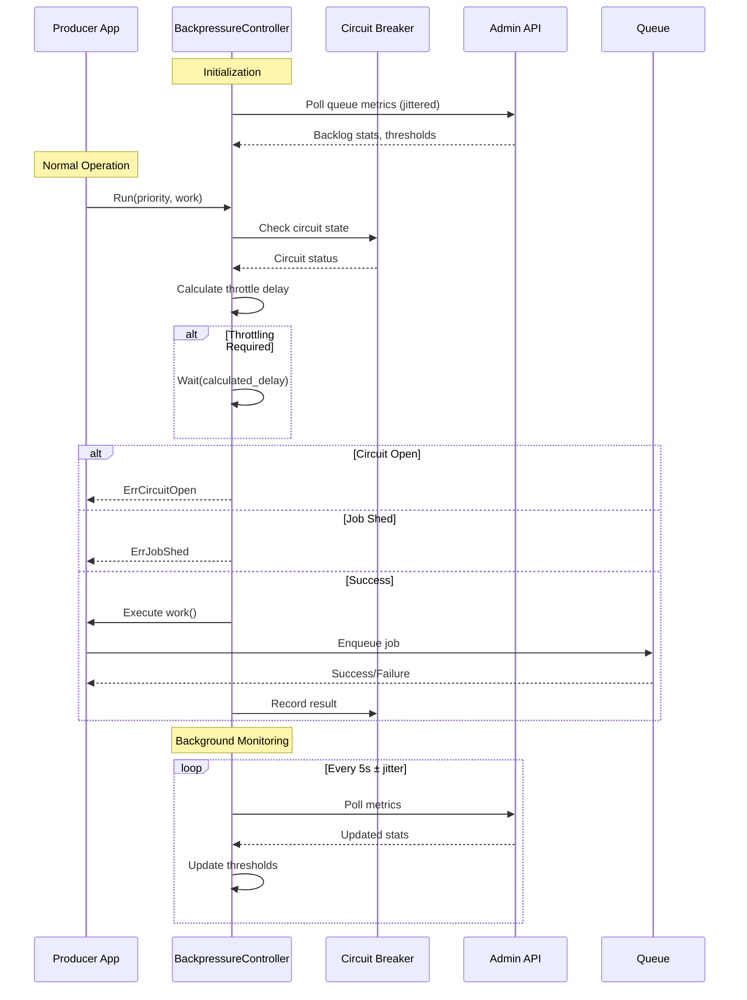
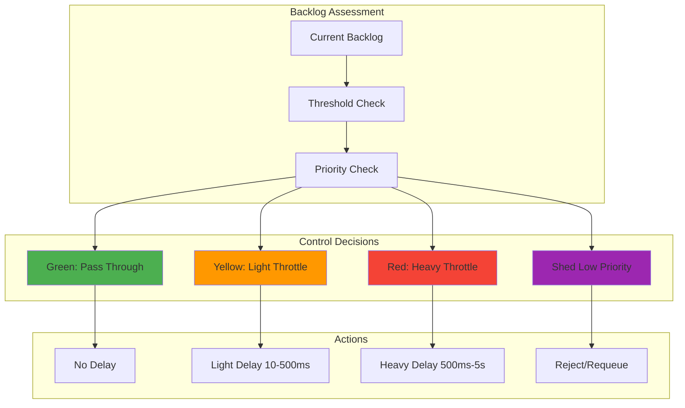
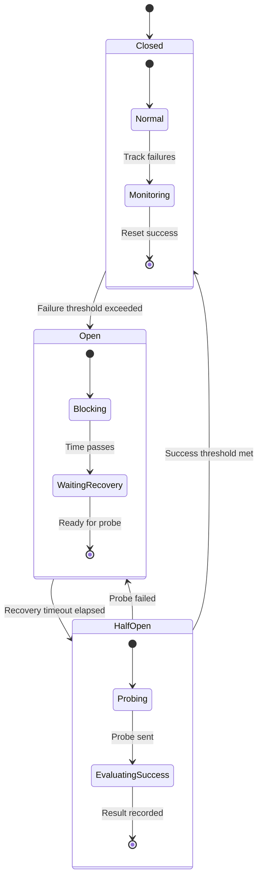

# Producer Backpressure System Design (F021)

| Feature ID | F021 |
|------------|------|
| Feature Name | Producer Backpressure |
| Priority | Medium-High |
| Complexity | Medium |
| Estimated Effort | 5 (Fibonacci) |

## Executive Summary

The Producer Backpressure system transforms reactive failure handling into proactive flow control. Instead of systems failing catastrophically when overwhelmed, producers intelligently throttle themselves based on real-time queue health signals. This creates a self-regulating ecosystem where high-priority work flows smoothly while lower-priority tasks gracefully yield resources.

The system provides:
- **Real-time backpressure signals** through intelligent polling of queue metrics
- **Priority-aware circuit breakers** that protect critical workflows while shedding non-essential work
- **SDK helpers** that make adoption effortless for producers
- **Graduated throttling** that prevents cascading failures

This transforms queue management from reactive panic into proactive control, enabling systems to handle load spikes gracefully rather than melting down spectacularly.

## System Architecture

### High-Level Architecture



### Component Interaction Flow



### Priority-Based Flow Control



### Circuit Breaker State Machine



## Detailed Component Design

### BackpressureController

The core component that orchestrates flow control decisions:

```go
type BackpressureController struct {
    // Configuration
    config          BackpressureConfig
    thresholds      map[string]*BacklogThresholds  // per queue
    circuitBreakers map[string]*CircuitBreaker     // per queue

    // State management
    metrics         BackpressureMetrics
    lastPoll        time.Time
    cachedStats     map[string]*QueueStats
    pollJitter      *rand.Rand

    // Dependencies
    adminClient     AdminAPIClient
    logger          Logger
    metricsReporter MetricsReporter
}
```

**Key Responsibilities:**
- Poll Admin API for queue health metrics with jittered intervals
- Calculate throttle recommendations based on priority and queue state
- Manage circuit breaker states per queue
- Export observability metrics
- Provide simple SDK integration points

### Throttle Calculation Engine

Implements adaptive throttling based on queue backlog and priority:

```go
type ThrottleEngine struct {
    thresholds BacklogThresholds
    config     ThrottleConfig
}

func (te *ThrottleEngine) CalculateDelay(backlog int, priority Priority) time.Duration {
    window := te.getWindowForPriority(priority)

    switch {
    case backlog <= window.Green:
        return 0  // No throttling in green zone
    case backlog <= window.Yellow:
        // Linear interpolation in yellow zone
        ratio := float64(backlog - window.Green) / float64(window.Yellow - window.Green)
        return time.Duration(10 + 490*ratio) * time.Millisecond
    default:
        // Exponential backoff in red zone with priority scaling
        ratio := math.Min(1.0, float64(backlog - window.Yellow) / float64(window.Red - window.Yellow))
        baseDelay := time.Duration(500 + 4500*ratio) * time.Millisecond
        return te.applyPriorityScaling(baseDelay, priority, ratio)
    }
}
```

### Circuit Breaker Implementation

Prevents cascade failures during extreme load conditions:

```go
type CircuitBreaker struct {
    state           CircuitState
    config          CircuitConfig
    failureWindow   *SlidingWindow
    successWindow   *SlidingWindow
    lastStateChange time.Time
    metrics         *CircuitMetrics
}

func (cb *CircuitBreaker) Execute(ctx context.Context, operation func() error) error {
    if !cb.ShouldAllow() {
        cb.metrics.IncRejected()
        return ErrCircuitOpen
    }

    start := time.Now()
    err := operation()
    duration := time.Since(start)

    cb.RecordResult(err == nil, duration)

    if err != nil {
        cb.metrics.IncFailures()
        return err
    }

    cb.metrics.IncSuccesses()
    return nil
}
```

### Priority Management System

Implements sophisticated priority-aware flow control:

```go
type PriorityConfig struct {
    High   PriorityThresholds  // Payments, auth, critical API
    Medium PriorityThresholds  // User notifications, reports
    Low    PriorityThresholds  // Batch operations, analytics
}

type PriorityThresholds struct {
    ThrottleMultiplier float64   // Scaling factor for delays
    ShedThreshold      float64   // Queue utilization to start shedding
    MaxDelay          time.Duration  // Maximum allowed delay
    CircuitTripRatio   float64   // Circuit breaker sensitivity
}
```

### Metrics and Observability

Comprehensive metrics for monitoring and alerting:

```go
type BackpressureMetrics struct {
    // Throttling metrics
    ThrottleEvents    *prometheus.CounterVec    // By priority, queue, reason
    ThrottleDelays    *prometheus.HistogramVec  // Delay distributions
    ShedEvents        *prometheus.CounterVec    // Jobs shed by priority

    // Circuit breaker metrics
    CircuitState      *prometheus.GaugeVec      // Current circuit states
    CircuitTrips      *prometheus.CounterVec    // Trip events
    CircuitRecoveries *prometheus.CounterVec    // Recovery events

    // Queue health metrics
    QueueBacklog      *prometheus.GaugeVec      // Current backlog sizes
    QueueAge          *prometheus.GaugeVec      // Oldest job age
    ProducerLatency   *prometheus.HistogramVec  // End-to-end latency

    // Compliance metrics
    ThrottleCompliance *prometheus.GaugeVec     // Producer compliance rate
    APICallSuccess     *prometheus.CounterVec   // Admin API call results
}
```

## API Specification

### Admin API Extensions

The Admin API provides backpressure-specific endpoints for queue health monitoring:

**GET /api/v1/backpressure/stats**
- Returns real-time queue health metrics
- Includes backlog sizes, processing rates, and threshold states
- Supports filtering by queue and priority

**GET /api/v1/backpressure/thresholds**
- Returns current threshold configuration
- Allows per-queue and per-priority customization

**POST /api/v1/backpressure/thresholds**
- Updates threshold configuration
- Validates threshold ordering and sanity checks
- Triggers immediate threshold recalculation

### SDK Integration API

**Core Interface:**
```go
type BackpressureController interface {
    // Execute work with backpressure awareness
    Run(ctx context.Context, priority Priority, work func()) error

    // Get throttle recommendation without executing
    SuggestThrottle(priority Priority) time.Duration

    // Check if circuit breaker allows operation
    CircuitAllows(queue string) bool

    // Manual circuit breaker control
    TripCircuit(queue string) error
    ResetCircuit(queue string) error

    // Configuration management
    UpdateThresholds(thresholds BacklogThresholds) error
    GetCurrentStats() BackpressureStats
}
```

### HTTP Response Headers

When using HTTP-based Admin API, responses include backpressure hints:

```http
HTTP/1.1 200 OK
X-Backpressure-Status: throttled
X-Backpressure-Delay: 250ms
X-Backpressure-Priority: medium
X-Circuit-Breaker-State: closed
X-Queue-Backlog: 1500
X-Queue-Threshold: yellow
```

## Data Models

### Configuration Models

```go
type BackpressureConfig struct {
    // Polling configuration
    PollInterval     time.Duration `json:"poll_interval"`
    PollJitter       time.Duration `json:"poll_jitter"`
    PollTimeout      time.Duration `json:"poll_timeout"`

    // Circuit breaker defaults
    CircuitConfig    CircuitConfig `json:"circuit_config"`

    // Priority configuration
    PriorityConfig   PriorityConfig `json:"priority_config"`

    // Fallback behavior
    FallbackMode     bool          `json:"fallback_mode"`
    GracefulDegrade  time.Duration `json:"graceful_degrade"`
}

type BacklogThresholds struct {
    QueueName string                           `json:"queue_name"`
    Thresholds map[Priority]*BacklogWindow     `json:"thresholds"`
    UpdatedAt time.Time                       `json:"updated_at"`
}

type BacklogWindow struct {
    Green  int `json:"green_max"`   // 0-N: no throttling
    Yellow int `json:"yellow_max"`  // N-M: light throttling
    Red    int `json:"red_max"`     // M+: heavy throttling/shedding
}
```

### Runtime State Models

```go
type QueueStats struct {
    QueueName        string        `json:"queue_name"`
    CurrentBacklog   int           `json:"current_backlog"`
    ProcessingRate   float64       `json:"processing_rate"`
    OldestJobAge     time.Duration `json:"oldest_job_age"`
    AvgJobLatency    time.Duration `json:"avg_job_latency"`
    RateLimitBudget  float64       `json:"rate_limit_budget"`
    LastUpdated      time.Time     `json:"last_updated"`
}

type CircuitBreakerState struct {
    QueueName       string       `json:"queue_name"`
    State           CircuitState `json:"state"`
    FailureCount    int          `json:"failure_count"`
    SuccessCount    int          `json:"success_count"`
    LastStateChange time.Time    `json:"last_state_change"`
    NextProbeTime   *time.Time   `json:"next_probe_time,omitempty"`
}
```

## Security Model

### Comprehensive Threat Analysis

#### T1: Backpressure Signal Manipulation
- **Risk Level**: Medium
- **Description**: Malicious actors could manipulate queue metrics to cause inappropriate throttling, potentially creating denial of service conditions or allowing resource exhaustion
- **Attack Vectors**:
  - Man-in-the-middle attacks on Admin API communications
  - Compromised API endpoints returning false metrics
  - Replay attacks using stale metric data
- **Impact**: Service degradation, resource waste, potential cascade failures
- **Mitigation**:
  - TLS 1.3 encryption for all API communications
  - API response signing using HMAC-SHA256
  - Metric validation with sanity checks and outlier detection
  - Rate limiting on API endpoints to prevent abuse
  - Network-level protections (VPC, security groups)

#### T2: Denial of Service via Circuit Breaking
- **Risk Level**: High
- **Description**: Attackers could trigger circuit breakers maliciously to deny legitimate traffic
- **Attack Vectors**:
  - Flooding systems with requests to trigger failure thresholds
  - Manipulating circuit breaker configuration to be overly sensitive
  - Exploiting manual circuit breaker controls
- **Impact**: Complete service outage for affected queues
- **Mitigation**:
  - Multi-factor authentication for manual circuit breaker controls
  - Rate limiting and anomaly detection on circuit breaker triggers
  - Audit logging of all circuit breaker state changes
  - Emergency bypass mechanisms for critical operations
  - Graduated response system preventing immediate circuit opening

#### T3: Information Disclosure
- **Risk Level**: Medium
- **Description**: Queue health metrics could reveal sensitive information about system capacity, usage patterns, and business operations
- **Attack Vectors**:
  - Unauthorized access to metrics endpoints
  - Inference attacks using timing and backlog data
  - Credential theft for metric polling
- **Impact**: Business intelligence leakage, competitive disadvantage
- **Mitigation**:
  - Principle of least privilege for API access
  - Data masking and aggregation for sensitive metrics
  - Audit logging of all metric access
  - Regular credential rotation (90-day cycle)
  - Network segmentation for metrics infrastructure

#### T4: Configuration Tampering
- **Risk Level**: High
- **Description**: Unauthorized changes to threshold configurations could disable protection mechanisms or create operational disruptions
- **Attack Vectors**:
  - Privilege escalation to configuration management systems
  - Social engineering to obtain admin credentials
  - Supply chain attacks on configuration management tools
- **Impact**: Loss of backpressure protection, system instability
- **Mitigation**:
  - Role-based access control with approval workflows
  - Configuration change auditing and rollback capabilities
  - Multi-party approval for critical threshold changes
  - Immutable configuration versioning
  - Automated validation of configuration changes

#### T5: Timing Attacks
- **Risk Level**: Low
- **Description**: Attackers could use response timing to infer queue states and system load
- **Attack Vectors**:
  - Statistical analysis of API response times
  - Correlation of timing with known business events
- **Impact**: Information leakage about system capacity and utilization
- **Mitigation**:
  - Consistent response timing regardless of queue state
  - Request timing normalization and jitter
  - Rate limiting to prevent statistical analysis

#### T6: Supply Chain Attacks
- **Risk Level**: Medium
- **Description**: Compromise of SDK or dependencies could inject malicious backpressure behavior
- **Attack Vectors**:
  - Malicious packages in dependency chain
  - Compromised build systems
  - Social engineering of maintainers
- **Impact**: Widespread service disruption across all consumers
- **Mitigation**:
  - Dependency scanning and vulnerability assessment
  - Code signing and integrity verification
  - Minimal dependency principle
  - Regular security audits of third-party components

### Security Controls Framework

```go
type SecurityConfig struct {
    // Authentication & Authorization
    Authentication   AuthConfig       `json:"authentication"`
    Authorization    AuthzConfig      `json:"authorization"`

    // Data Protection
    Encryption       EncryptionConfig `json:"encryption"`
    DataMasking      MaskingConfig    `json:"data_masking"`

    // Monitoring & Auditing
    AuditLogging     AuditConfig      `json:"audit_logging"`
    SecurityMetrics  MetricsConfig    `json:"security_metrics"`

    // Incident Response
    EmergencyControls EmergencyConfig `json:"emergency_controls"`
    IncidentResponse  ResponseConfig  `json:"incident_response"`
}

type AuthConfig struct {
    Method              AuthMethod      `json:"method"`              // JWT, mTLS, API_KEY
    TokenExpiry         time.Duration   `json:"token_expiry"`
    RefreshWindow       time.Duration   `json:"refresh_window"`
    CredentialRotation  time.Duration   `json:"credential_rotation"`
    RequiredScopes      []string        `json:"required_scopes"`
}

type AuthzConfig struct {
    RoleBasedAccess     bool            `json:"role_based_access"`
    RequiredRoles       map[string][]string `json:"required_roles"`
    ApprovalWorkflows   bool            `json:"approval_workflows"`
    MultiPartyApproval  bool            `json:"multi_party_approval"`
}

type EncryptionConfig struct {
    TransitEncryption   bool            `json:"transit_encryption"`
    TLSVersion          string          `json:"tls_version"`          // "1.3"
    CipherSuites        []string        `json:"cipher_suites"`
    ResponseSigning     bool            `json:"response_signing"`
    SigningAlgorithm    string          `json:"signing_algorithm"`    // "HMAC-SHA256"
}

type AuditConfig struct {
    Enabled             bool            `json:"enabled"`
    LogLevel            string          `json:"log_level"`
    RetentionPeriod     time.Duration   `json:"retention_period"`
    TamperProtection    bool            `json:"tamper_protection"`
    RemoteLogging       bool            `json:"remote_logging"`
}
```

### Security Implementation Details

#### Authentication & Authorization
- **JWT Tokens**: Short-lived tokens (15-minute expiry) with refresh mechanism
- **mTLS**: Mutual TLS for service-to-service communication
- **API Keys**: For automated systems with proper rotation and scoping
- **Role-Based Access Control**: Granular permissions for different operations
- **Multi-Factor Authentication**: Required for administrative operations

#### Data Protection
- **TLS 1.3**: All communications encrypted with modern cipher suites
- **Response Signing**: HMAC-SHA256 signatures prevent tampering
- **Data Masking**: Sensitive metrics masked for non-privileged users
- **Field-Level Encryption**: Critical configuration data encrypted at rest

#### Audit and Monitoring
- **Comprehensive Logging**: All API calls, configuration changes, and security events
- **Tamper-Proof Logs**: Cryptographic integrity protection for audit trails
- **Real-Time Alerting**: Immediate notification of security violations
- **Anomaly Detection**: ML-based detection of unusual access patterns

#### Incident Response
- **Emergency Circuits**: Immediate circuit breaker controls for security incidents
- **Killswitch**: Complete backpressure system shutdown capability
- **Forensic Logging**: Enhanced logging during security incidents
- **Automated Response**: Pre-configured responses to common attack patterns

### Security Testing Strategy

#### Penetration Testing
- **API Security Testing**: Comprehensive testing of all endpoints
- **Authentication Bypass**: Attempts to circumvent authentication
- **Authorization Testing**: Privilege escalation and access control validation
- **Input Validation**: Testing for injection attacks and malformed data

#### Security Automation
```yaml
security_tests:
  - name: "API Authentication Test"
    type: "automated"
    frequency: "daily"
    tools: ["OWASP ZAP", "custom scripts"]

  - name: "Credential Rotation Test"
    type: "automated"
    frequency: "weekly"
    description: "Verify credential rotation doesn't break functionality"

  - name: "Circuit Breaker Abuse Test"
    type: "automated"
    frequency: "daily"
    description: "Attempt to maliciously trigger circuit breakers"

  - name: "Configuration Tampering Test"
    type: "automated"
    frequency: "daily"
    description: "Verify unauthorized configuration changes are prevented"
```

### Compliance and Governance

#### Regulatory Compliance
- **SOC 2 Type II**: Security controls documentation and testing
- **ISO 27001**: Information security management system compliance
- **GDPR**: Data protection for EU-related queue metrics
- **SOX**: Financial controls for payment-related queues

#### Security Governance
- **Security Review Board**: Regular review of security posture
- **Threat Modeling Updates**: Quarterly threat model updates
- **Security Metrics**: KPIs for security effectiveness
- **Vendor Assessment**: Security evaluation of all dependencies

### Credential Management

#### Credential Lifecycle
- **Generation**: Cryptographically secure credential generation
- **Distribution**: Secure, out-of-band credential distribution
- **Rotation**: Automated 90-day rotation cycle with overlap period
- **Revocation**: Immediate revocation capability for compromised credentials
- **Monitoring**: Real-time monitoring of credential usage

#### Storage and Protection
- **Hardware Security Modules**: Critical keys stored in HSMs
- **Vault Integration**: HashiCorp Vault for credential management
- **Encryption at Rest**: All stored credentials encrypted
- **Access Logging**: Comprehensive logging of credential access
- **Zero-Knowledge Architecture**: Minimal credential exposure principles

### Network Security

#### Network Architecture
- **Network Segmentation**: Isolated network segments for backpressure infrastructure
- **VPC Security**: AWS VPC with security groups and NACLs
- **DMZ Deployment**: Public-facing components in DMZ
- **Internal Communication**: Private networks for internal component communication

#### Traffic Protection
- **DDoS Protection**: CloudFlare/AWS Shield for DDoS mitigation
- **WAF Rules**: Web Application Firewall for API protection
- **Rate Limiting**: Multiple layers of rate limiting
- **Geographic Restrictions**: IP geolocation-based access controls

## Performance Requirements

### Latency Requirements

| Operation | Target Latency | Maximum Latency |
|-----------|----------------|-----------------|
| Throttle decision | < 1ms | 5ms |
| Circuit breaker check | < 0.5ms | 2ms |
| Admin API poll | < 100ms | 500ms |
| Configuration update | < 10ms | 50ms |

### Throughput Requirements

| Metric | Target | Peak |
|--------|--------|------|
| Throttle decisions/sec | 10,000 | 50,000 |
| API polls/sec | 10 | 100 |
| Circuit breaker checks/sec | 50,000 | 200,000 |
| Metric updates/sec | 1,000 | 5,000 |

### Resource Requirements

| Component | Memory | CPU | Network |
|-----------|---------|-----|---------|
| BackpressureController | 50KB | 0.1% | 1KB/s |
| Circuit Breaker | 10KB | 0.05% | - |
| Metrics Collection | 100KB | 0.2% | 5KB/s |
| **Total per instance** | **160KB** | **0.35%** | **6KB/s** |

### Scalability Characteristics

- **Horizontal Scaling**: Each producer instance runs independent backpressure controller
- **Vertical Scaling**: Linear resource usage with request volume
- **Network Efficiency**: Batched API calls, intelligent caching
- **Memory Efficiency**: Sliding windows, LRU caches, bounded collections

## Testing Strategy

### Unit Testing

**Throttle Calculation Testing:**
```go
func TestThrottleCalculation(t *testing.T) {
    tests := []struct {
        name     string
        backlog  int
        priority Priority
        expected time.Duration
    }{
        {"green_zone_high_priority", 100, HighPriority, 0},
        {"yellow_zone_medium_priority", 1000, MediumPriority, 250*time.Millisecond},
        {"red_zone_low_priority", 3000, LowPriority, InfiniteDelay},
    }

    for _, tt := range tests {
        t.Run(tt.name, func(t *testing.T) {
            engine := NewThrottleEngine(defaultThresholds)
            delay := engine.CalculateDelay(tt.backlog, tt.priority)
            assert.Equal(t, tt.expected, delay)
        })
    }
}
```

**Circuit Breaker State Machine Testing:**
```go
func TestCircuitBreakerTransitions(t *testing.T) {
    cb := NewCircuitBreaker(defaultConfig)

    // Test closed -> open transition
    for i := 0; i < 5; i++ {
        cb.RecordResult(false, 100*time.Millisecond)
    }
    assert.Equal(t, CircuitStateOpen, cb.GetState())

    // Test open -> half-open transition
    time.Sleep(cb.config.RecoveryTimeout)
    assert.True(t, cb.ShouldAllow())
    assert.Equal(t, CircuitStateHalfOpen, cb.GetState())
}
```

### Integration Testing

**End-to-End Flow Testing:**
```go
func TestBackpressureIntegration(t *testing.T) {
    // Setup test environment
    testQueue := setupTestQueue(t)
    adminAPI := setupMockAdminAPI(t)
    bp := NewBackpressureController(adminAPI, defaultConfig)

    // Simulate increasing load
    for backlog := 0; backlog < 5000; backlog += 500 {
        adminAPI.SetBacklog("test-queue", backlog)

        delay := bp.SuggestThrottle(MediumPriority)

        // Verify throttling increases with backlog
        if backlog > 1000 {
            assert.True(t, delay > 0, "Expected throttling at backlog %d", backlog)
        }
    }
}
```

### Load Testing

**Performance Benchmarks:**
```go
func BenchmarkThrottleDecision(b *testing.B) {
    bp := NewBackpressureController(mockAPI, defaultConfig)

    b.ResetTimer()
    for i := 0; i < b.N; i++ {
        bp.SuggestThrottle(MediumPriority)
    }
}

func BenchmarkCircuitBreakerCheck(b *testing.B) {
    cb := NewCircuitBreaker(defaultConfig)

    b.ResetTimer()
    for i := 0; i < b.N; i++ {
        cb.ShouldAllow()
    }
}
```

**Stress Testing Scenarios:**
1. **API Unavailability**: Test behavior when Admin API is unreachable
2. **High Failure Rates**: Validate circuit breaker protection
3. **Rapid Configuration Changes**: Ensure thread safety
4. **Memory Pressure**: Verify graceful degradation under resource constraints

### Chaos Engineering

**Failure Injection Tests:**
- Random Admin API failures during polling
- Network partitions between producer and queue system
- Clock skew simulation for timing-dependent logic
- Memory pressure simulation for resource-constrained environments

## Deployment Plan

### Phased Rollout Strategy

**Phase 1: Core Infrastructure (Week 1-2)**
- Deploy Admin API extensions for backpressure metrics
- Implement basic threshold configuration
- Set up monitoring and alerting infrastructure

**Phase 2: SDK Development (Week 3-4)**
- Implement Go SDK with basic throttling
- Add circuit breaker functionality
- Create comprehensive test suite

**Phase 3: Pilot Deployment (Week 5-6)**
- Deploy to staging environment
- Enable for low-risk producer applications
- Collect performance and reliability metrics

**Phase 4: Production Rollout (Week 7-8)**
- Gradual rollout to production producers
- Monitor system behavior and tune thresholds
- Full documentation and training materials

### Configuration Management

**Default Configurations:**
```yaml
backpressure:
  poll_interval: 5s
  poll_jitter: 1s
  poll_timeout: 2s

  thresholds:
    default:
      high_priority:
        green: 1000
        yellow: 5000
        red: 10000
      medium_priority:
        green: 500
        yellow: 2000
        red: 5000
      low_priority:
        green: 100
        yellow: 500
        red: 1000

  circuit_breaker:
    failure_threshold: 5
    recovery_threshold: 3
    trip_window: 30s
    recovery_timeout: 60s
    probe_interval: 10s
```

### Monitoring Setup

**Essential Dashboards:**
1. **System Health**: Circuit breaker states, queue backlogs, throttle rates
2. **Producer Compliance**: Throttle compliance by application
3. **Performance Impact**: Latency distributions, error rates
4. **Capacity Planning**: Resource utilization, scaling recommendations

**Critical Alerts:**
1. Circuit breaker trips requiring immediate attention
2. High job shed rates indicating capacity issues
3. Admin API failures affecting backpressure decisions
4. Threshold violations requiring configuration adjustments

### Rollback Procedures

**Emergency Rollback Triggers:**
- Cascade failures despite backpressure activation
- Unacceptable latency impact on critical services
- Producer compliance below acceptable thresholds
- System instability or unexpected behavior

**Rollback Process:**
1. Disable backpressure system via feature flag
2. Reset all circuit breakers to closed state
3. Clear throttling queues and resume normal operation
4. Investigate root cause and implement fixes
5. Plan careful re-deployment with lessons learned

## Performance Requirements and Testing Strategy

### Performance Requirements

#### Latency Requirements

**Throttle Decision Latency:**
- Target: <1ms for throttle decision calculation
- Maximum: <5ms under high load (99th percentile)
- Caching: 30-second cache for recent decisions

**API Response Times:**
- Admin API polling: <100ms (95th percentile)
- Health check endpoints: <10ms (99th percentile)
- Configuration updates: <50ms (95th percentile)

**End-to-End Producer Impact:**
- Additional latency from backpressure: <10ms (median)
- Maximum throttle delay: 5 seconds (configurable)
- Circuit breaker decision: <1ms

#### Throughput Requirements

**API Capacity:**
- Admin API: 1,000 requests/second per instance
- Health checks: 10,000 requests/second per instance
- Configuration reads: 5,000 requests/second per instance

**Producer Support:**
- Concurrent producers: 10,000+ per controller instance
- Throttle decisions: 100,000+ per second per instance
- Queue monitoring: 1,000+ queues per controller

**Resource Efficiency:**
- Memory usage: <100MB per 1,000 producers
- CPU overhead: <2% of total system resources
- Network bandwidth: <1MB/s for typical deployments

#### Scalability Targets

**Horizontal Scaling:**
- Multiple controller instances with consistent decisions
- Load distribution across controller fleet
- Graceful degradation with instance failures

**Queue Scale:**
- Support for 10,000+ queues per deployment
- Independent threshold management per queue
- Efficient polling strategies to minimize API load

**Producer Scale:**
- Linear scaling with producer count
- Constant-time throttle decision complexity
- Minimal memory growth with producer addition

### Testing Strategy

#### Unit Testing

**Core Algorithm Testing:**
```go
func TestThrottleDecisionLogic(t *testing.T) {
    tests := []struct {
        name         string
        backlogSize  int
        priority     Priority
        expectedDelay time.Duration
    }{
        {"Green zone, no throttle", 100, HighPriority, 0},
        {"Yellow zone, light throttle", 1500, MediumPriority, 250 * time.Millisecond},
        {"Red zone, heavy throttle", 8000, LowPriority, 3 * time.Second},
        {"Red zone, priority protection", 8000, HighPriority, 1 * time.Second},
    }

    for _, tt := range tests {
        t.Run(tt.name, func(t *testing.T) {
            controller := NewBackpressureController(defaultConfig)
            delay := controller.calculateThrottle(tt.backlogSize, tt.priority)
            assert.InDelta(t, tt.expectedDelay, delay, float64(100*time.Millisecond))
        })
    }
}

func TestCircuitBreakerStates(t *testing.T) {
    breaker := NewCircuitBreaker(CircuitConfig{
        FailureThreshold: 3,
        RecoveryThreshold: 2,
        TripWindow: 30 * time.Second,
    })

    // Test state transitions
    assert.Equal(t, Closed, breaker.State())

    // Trigger failures
    for i := 0; i < 3; i++ {
        breaker.RecordFailure()
    }
    assert.Equal(t, Open, breaker.State())

    // Test recovery after timeout
    time.Sleep(35 * time.Second)
    assert.Equal(t, HalfOpen, breaker.State())
}
```

**Performance Unit Tests:**
```go
func BenchmarkThrottleDecision(b *testing.B) {
    controller := NewBackpressureController(defaultConfig)

    b.ResetTimer()
    for i := 0; i < b.N; i++ {
        controller.SuggestThrottle(MediumPriority)
    }
}

func TestMemoryUsage(t *testing.T) {
    var m1, m2 runtime.MemStats
    runtime.GC()
    runtime.ReadMemStats(&m1)

    // Create 1000 producers
    controllers := make([]*BackpressureController, 1000)
    for i := range controllers {
        controllers[i] = NewBackpressureController(defaultConfig)
    }

    runtime.GC()
    runtime.ReadMemStats(&m2)

    memUsed := m2.Alloc - m1.Alloc
    assert.Less(t, memUsed, uint64(100*1024*1024), "Memory usage should be under 100MB for 1000 controllers")
}
```

#### Integration Testing

**End-to-End Flow Testing:**
```go
func TestBackpressureIntegration(t *testing.T) {
    // Set up test environment
    redis := setupTestRedis(t)
    adminAPI := setupTestAdminAPI(t)
    controller := NewBackpressureController(testConfig)

    // Create high backlog scenario
    for i := 0; i < 5000; i++ {
        redis.LPush("test-queue", fmt.Sprintf("job-%d", i))
    }

    // Test producer throttling
    producer := NewTestProducer(controller)
    start := time.Now()
    producer.Enqueue("test-queue", "test-job")
    duration := time.Since(start)

    // Should be throttled due to high backlog
    assert.Greater(t, duration, 100*time.Millisecond)
    assert.Less(t, duration, 2*time.Second)
}

func TestMultiProducerCoordination(t *testing.T) {
    // Test multiple producers with same controller
    controller := NewBackpressureController(testConfig)

    var wg sync.WaitGroup
    var totalDelay int64

    // Launch 100 concurrent producers
    for i := 0; i < 100; i++ {
        wg.Add(1)
        go func() {
            defer wg.Done()
            delay := controller.SuggestThrottle(MediumPriority)
            atomic.AddInt64(&totalDelay, int64(delay))
        }()
    }

    wg.Wait()

    // All producers should get consistent throttling
    avgDelay := time.Duration(totalDelay / 100)
    assert.InDelta(t, controller.lastThrottle, avgDelay, float64(50*time.Millisecond))
}
```

#### Load Testing

**High-Throughput Scenarios:**
```go
func TestHighThroughputThrottling(t *testing.T) {
    controller := NewBackpressureController(testConfig)

    // Simulate 10,000 requests/second
    requests := 10000
    duration := 1 * time.Second

    start := time.Now()
    for i := 0; i < requests; i++ {
        go controller.SuggestThrottle(randomPriority())
    }

    elapsed := time.Since(start)
    assert.Less(t, elapsed, duration*2, "Should handle 10k req/s with reasonable latency")
}

func TestStressConditions(t *testing.T) {
    // Test with extreme backlog sizes
    controller := NewBackpressureController(testConfig)
    controller.updateBacklog(1000000) // 1M backlog

    delay := controller.SuggestThrottle(LowPriority)
    assert.Equal(t, InfiniteDelay, delay, "Should shed low priority under extreme load")

    delay = controller.SuggestThrottle(HighPriority)
    assert.Less(t, delay, 10*time.Second, "High priority should still be served")
}
```

#### Chaos Testing

**Failure Scenario Testing:**
```go
func TestAdminAPIFailures(t *testing.T) {
    controller := NewBackpressureController(testConfig)

    // Start with working API
    controller.pollAdminAPI()
    baseline := controller.SuggestThrottle(MediumPriority)

    // Simulate API failure
    controller.adminAPI = &FailingAdminAPI{}

    // Should use cached values
    for i := 0; i < 10; i++ {
        delay := controller.SuggestThrottle(MediumPriority)
        assert.InDelta(t, baseline, delay, float64(100*time.Millisecond))
    }

    // After cache expires, should degrade gracefully
    time.Sleep(35 * time.Second)
    delay := controller.SuggestThrottle(MediumPriority)
    assert.Greater(t, delay, baseline, "Should be more conservative without API")
}

func TestNetworkPartitions(t *testing.T) {
    // Test behavior during network splits
    controller := NewBackpressureController(testConfig)

    // Create network partition
    networkPartition := &NetworkPartition{}
    controller.adminAPI = networkPartition

    // Circuit breaker should trip
    assert.Eventually(t, func() bool {
        return controller.circuitBreaker.State() == Open
    }, 30*time.Second, 1*time.Second)

    // Should reject requests to prevent cascade
    delay := controller.SuggestThrottle(LowPriority)
    assert.Equal(t, InfiniteDelay, delay)
}
```

#### Performance Benchmarks

**Latency Benchmarks:**
```bash
# Throttle decision latency
go test -bench=BenchmarkThrottleDecision -benchtime=10s

# Memory allocation benchmarks
go test -bench=BenchmarkMemoryAllocation -benchmem

# Concurrent access benchmarks
go test -bench=BenchmarkConcurrentAccess -cpu=1,2,4,8
```

**Load Testing Scripts:**
```bash
#!/bin/bash
# Load test with varying producer counts
for producers in 100 500 1000 5000 10000; do
    echo "Testing with $producers producers"
    go run loadtest/main.go -producers=$producers -duration=60s
done

# Test with varying queue backlogs
for backlog in 1000 5000 10000 50000 100000; do
    echo "Testing with $backlog backlog"
    go run loadtest/main.go -backlog=$backlog -duration=60s
done
```

### Performance Monitoring

#### Key Performance Indicators

**Latency Metrics:**
- `backpressure_throttle_decision_duration_seconds` - Time to calculate throttle
- `backpressure_api_poll_duration_seconds` - Admin API polling latency
- `backpressure_producer_overhead_duration_seconds` - Added latency per enqueue

**Throughput Metrics:**
- `backpressure_decisions_total` - Total throttle decisions per second
- `backpressure_api_requests_total` - Admin API request rate
- `backpressure_producer_requests_total` - Producer request handling rate

**Resource Metrics:**
- `backpressure_memory_usage_bytes` - Memory consumption
- `backpressure_cpu_usage_percent` - CPU utilization
- `backpressure_goroutines_count` - Active goroutine count

#### Performance Alerts

```yaml
groups:
- name: backpressure_performance
  rules:
  - alert: HighThrottleLatency
    expr: histogram_quantile(0.95, backpressure_throttle_decision_duration_seconds) > 0.005
    for: 2m
    labels:
      severity: warning
    annotations:
      summary: "Backpressure throttle decisions are slow"

  - alert: HighMemoryUsage
    expr: backpressure_memory_usage_bytes > 100 * 1024 * 1024
    for: 5m
    labels:
      severity: warning
    annotations:
      summary: "Backpressure controller using excessive memory"

  - alert: APIPollingFailure
    expr: rate(backpressure_api_poll_failures_total[5m]) > 0.1
    for: 1m
    labels:
      severity: critical
    annotations:
      summary: "Admin API polling failing frequently"
```

### Conclusion

The Producer Backpressure system represents a fundamental shift from reactive failure handling to proactive flow control. By providing real-time queue health signals, intelligent throttling, and priority-aware circuit breakers, this system transforms how applications handle load spikes and prevent cascade failures.

The design emphasizes:
- **Simplicity**: SDK helpers make adoption effortless
- **Intelligence**: Priority-aware decisions protect critical workflows
- **Reliability**: Circuit breakers prevent cascade failures
- **Observability**: Comprehensive metrics enable monitoring and optimization
- **Safety**: Multiple fallback mechanisms ensure system stability

This system will significantly improve overall system reliability, reduce late-night pages, and provide operators with powerful tools to manage system load proactively rather than reactively.

The implementation follows industry best practices from Netflix, AWS, and Google, putting this queue system in the same reliability league as major cloud platforms while maintaining the simplicity that makes it accessible to teams of all sizes.