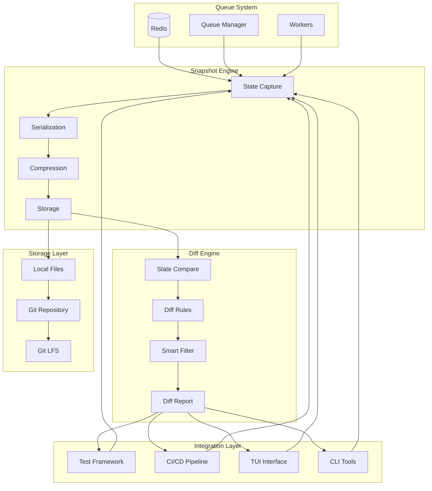
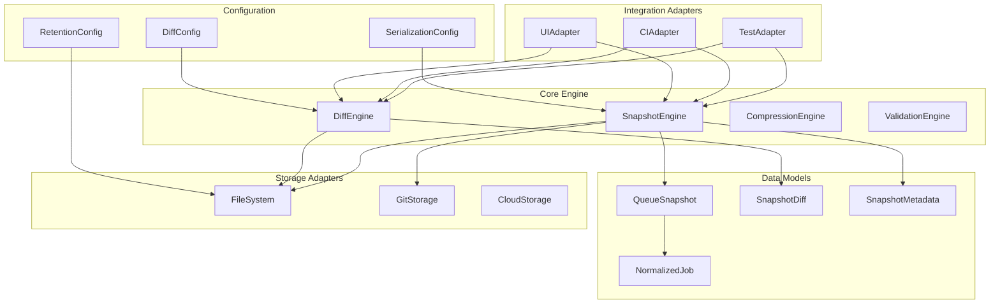
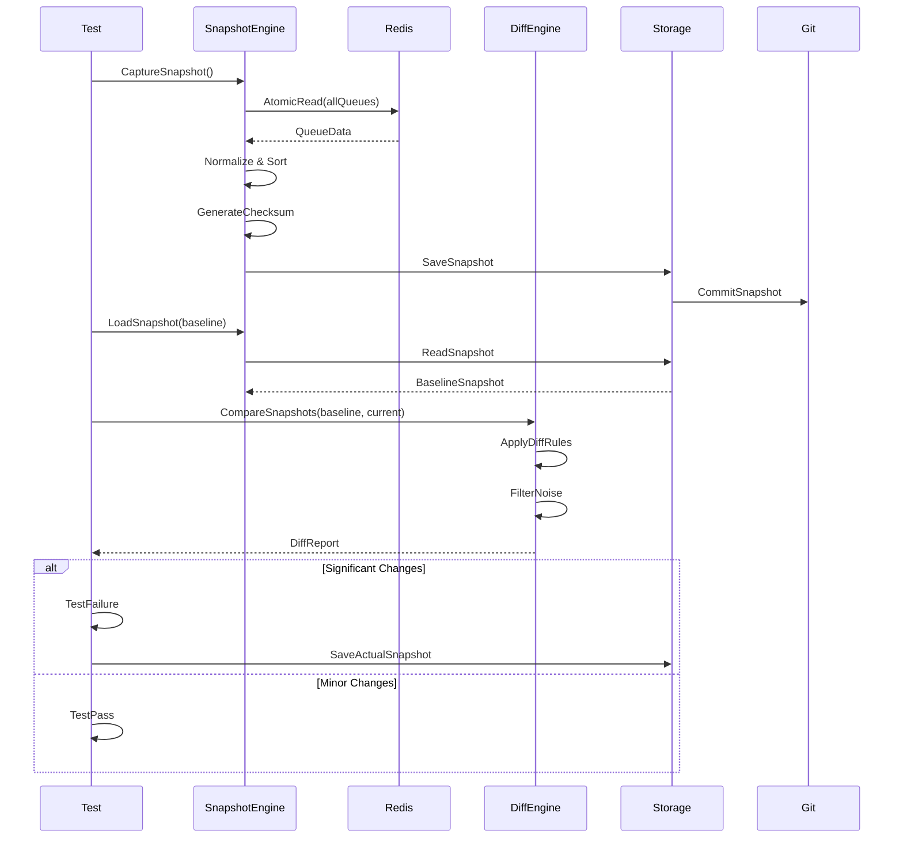

# F022: Queue Snapshot Testing - Design Document

| **Field** | **Value** |
|-----------|-----------|
| **Feature ID** | F022 |
| **Feature Name** | Queue Snapshot Testing |
| **Design Version** | 1.0 |
| **Author** | Claude |
| **Created** | 2025-09-14 |
| **Status** | Draft |
| **Review Status** | Pending Architecture Review |

## Executive Summary

Queue Snapshot Testing introduces Jest-style snapshot testing for Redis Work Queue systems, enabling teams to capture, version, and compare complete queue states with deterministic serialization and intelligent diffing. This system transforms queue testing from ad-hoc manual verification to scientific, reproducible validation that integrates seamlessly with CI/CD pipelines and Git workflows.

The solution captures atomic snapshots of all queues, jobs, workers, and configurations, then uses smart diffing algorithms to detect semantically meaningful changes while ignoring noise like timestamps and auto-generated IDs. Teams can maintain libraries of test scenarios, detect regressions automatically, and review queue behavior changes alongside code changes in pull requests.

### Key Capabilities

- **Complete State Capture**: Atomic snapshots of queues, jobs, workers, and system configuration
- **Deterministic Serialization**: Reproducible snapshots with normalized timestamps and sorted data
- **Smart Diffing**: Semantic comparison that focuses on meaningful changes vs. noise
- **Git Integration**: Version control for snapshots with large file support and merge tools
- **Test Framework Integration**: Jest-style assertions with auto-update workflows
- **TUI Integration**: Visual snapshot browser and diff viewer
- **CI/CD Ready**: Automated snapshot validation in deployment pipelines

### Success Metrics

- **Performance**: <1s snapshot capture for typical queues (10K jobs)
- **Storage Efficiency**: >85% compression ratio with zstd
- **Developer Adoption**: Snapshot tests in >80% of queue-related test suites
- **Regression Detection**: >90% reduction in queue behavior regressions reaching production

## System Architecture

### High-Level Architecture



### Component Architecture



### Data Flow Architecture



## API Specification

### Core Snapshot API

#### Capture Operations

```go
// CaptureState captures the current queue state atomically
func (e *SnapshotEngine) CaptureState(ctx context.Context, opts ...CaptureOption) (*QueueSnapshot, error)

// CaptureWithMetadata captures state with custom metadata
func (e *SnapshotEngine) CaptureWithMetadata(ctx context.Context, metadata SnapshotMetadata) (*QueueSnapshot, error)

// CaptureQueues captures only specified queues
func (e *SnapshotEngine) CaptureQueues(ctx context.Context, queueNames []string) (*QueueSnapshot, error)
```

#### Storage Operations

```go
// SaveSnapshot persists a snapshot to storage
func (e *SnapshotEngine) SaveSnapshot(ctx context.Context, snapshot *QueueSnapshot, path string) error

// LoadSnapshot loads a snapshot from storage
func (e *SnapshotEngine) LoadSnapshot(ctx context.Context, path string) (*QueueSnapshot, error)

// RestoreSnapshot restores queue state from snapshot
func (e *SnapshotEngine) RestoreSnapshot(ctx context.Context, snapshot *QueueSnapshot) error

// ListSnapshots returns available snapshots with metadata
func (e *SnapshotEngine) ListSnapshots(ctx context.Context, filter SnapshotFilter) ([]*SnapshotInfo, error)
```

#### Diff Operations

```go
// CompareSnapshots generates a diff between two snapshots
func (e *DiffEngine) CompareSnapshots(before, after *QueueSnapshot) (*SnapshotDiff, error)

// CompareWithRules applies custom diff rules
func (e *DiffEngine) CompareWithRules(before, after *QueueSnapshot, rules DiffConfig) (*SnapshotDiff, error)

// GenerateReport creates a formatted diff report
func (e *DiffEngine) GenerateReport(diff *SnapshotDiff, format ReportFormat) (string, error)
```

### Test Framework Integration API

```go
// AssertSnapshot validates current state matches snapshot
func (s *Snapshotter) AssertSnapshot(t *testing.T, snapshotPath string, opts ...AssertOption)

// CaptureAndAssert captures current state and compares
func (s *Snapshotter) CaptureAndAssert(t *testing.T, snapshotPath string)

// UpdateSnapshot updates snapshot with current state
func (s *Snapshotter) UpdateSnapshot(t *testing.T, snapshotPath string, force bool)

// WithTolerance sets diff tolerance rules
func WithTolerance(rules map[string]ToleranceRule) AssertOption

// WithIgnorePatterns sets fields to ignore in diff
func WithIgnorePatterns(patterns []string) AssertOption
```

### CLI Command Interface

```bash
# Capture current state
queue-snapshot capture --name "baseline" --description "Empty queue state"

# Load snapshot into queue
queue-snapshot load baseline.snap

# Compare snapshots
queue-snapshot diff --before baseline.snap --after current.snap

# Validate current state
queue-snapshot verify --snapshot baseline.snap --tolerance 5%

# List available snapshots
queue-snapshot list --filter "tag:baseline"

# Export snapshot for sharing
queue-snapshot export baseline.snap --format json --output baseline.json
```

### REST API Endpoints

```yaml
# Snapshot Management
GET    /api/v1/snapshots              # List snapshots
POST   /api/v1/snapshots              # Create snapshot
GET    /api/v1/snapshots/{id}         # Get snapshot details
DELETE /api/v1/snapshots/{id}         # Delete snapshot
PUT    /api/v1/snapshots/{id}/restore # Restore from snapshot

# Diff Operations
POST   /api/v1/snapshots/compare      # Compare two snapshots
GET    /api/v1/snapshots/{id}/diff    # Get diff against current state

# Test Integration
POST   /api/v1/test/assert            # Assert snapshot matches
POST   /api/v1/test/capture           # Capture for test
```

## Data Models

### Core Snapshot Structure

```go
type QueueSnapshot struct {
    // Metadata about the snapshot
    Metadata SnapshotMetadata `json:"metadata"`

    // Complete queue state
    Queues map[string]QueueState `json:"queues"`

    // Normalized job data
    Jobs []NormalizedJob `json:"jobs"`

    // Worker state at capture time
    Workers []WorkerState `json:"workers"`

    // System configuration
    Config SystemConfig `json:"config"`

    // Integrity validation
    Checksum string `json:"checksum"`
    Version  string `json:"version"`
}

type SnapshotMetadata struct {
    // Identification
    ID          string            `json:"id"`
    Name        string            `json:"name"`
    Description string            `json:"description"`
    Tags        []string          `json:"tags"`

    // Timing
    CapturedAt  time.Time         `json:"captured_at"`
    Duration    time.Duration     `json:"capture_duration"`

    // Context
    Environment string            `json:"environment"`
    GitSHA      string            `json:"git_sha"`
    Branch      string            `json:"git_branch"`

    // Statistics
    Stats       CaptureStats      `json:"stats"`
    Custom      map[string]interface{} `json:"custom"`
}

type NormalizedJob struct {
    // Queue assignment
    QueueName    string `json:"queue"`

    // Content identification (deterministic)
    PayloadHash  string `json:"payload_hash"`
    PayloadSize  int    `json:"payload_size"`

    // Processing state
    State        string `json:"state"`
    Priority     int    `json:"priority"`
    RetryCount   int    `json:"retry_count"`
    AttemptCount int    `json:"attempt_count"`

    // Normalized timing (relative to snapshot base time)
    RelativeTime int64  `json:"relative_time_ms"`

    // Error information
    LastError    string `json:"last_error,omitempty"`
    FailureCount int    `json:"failure_count"`

    // Custom metadata (filtered for determinism)
    Metadata map[string]interface{} `json:"metadata,omitempty"`
}

type QueueState struct {
    Name        string `json:"name"`
    Length      int    `json:"length"`
    MaxLength   int    `json:"max_length,omitempty"`

    // Job distribution
    JobsByState map[string]int `json:"jobs_by_state"`
    JobsByPriority map[int]int `json:"jobs_by_priority"`

    // Configuration
    Config      QueueConfig `json:"config"`
}
```

### Diff Data Models

```go
type SnapshotDiff struct {
    // Summary information
    Summary     DiffSummary              `json:"summary"`

    // Detailed differences
    QueueDiffs  map[string]QueueDiff     `json:"queue_diffs"`
    JobDiffs    []JobDiff                `json:"job_diffs"`
    WorkerDiffs []WorkerDiff             `json:"worker_diffs"`
    ConfigDiffs []ConfigDiff             `json:"config_diffs"`

    // Filtered out changes
    Ignored     []IgnoredChange          `json:"ignored"`

    // Metadata
    ComparedAt  time.Time                `json:"compared_at"`
    Rules       DiffConfig               `json:"rules_applied"`
}

type DiffSummary struct {
    HasChanges      bool    `json:"has_changes"`
    Significant     bool    `json:"significant"`
    TotalChanges    int     `json:"total_changes"`
    IgnoredChanges  int     `json:"ignored_changes"`

    // High-level metrics
    QueueChanges    int     `json:"queue_changes"`
    JobChanges      int     `json:"job_changes"`
    ConfigChanges   int     `json:"config_changes"`

    // Confidence scoring
    ConfidenceScore float64 `json:"confidence_score"`
    RiskLevel       string  `json:"risk_level"`
}

type JobDiff struct {
    Type         string   `json:"type"` // "added", "removed", "moved", "modified"
    PayloadHash  string   `json:"payload_hash"`

    // Change details
    Before       *JobState `json:"before,omitempty"`
    After        *JobState `json:"after,omitempty"`

    // Movement tracking
    BeforeQueue  string   `json:"before_queue,omitempty"`
    AfterQueue   string   `json:"after_queue,omitempty"`

    // Significance
    Significant  bool     `json:"significant"`
    Impact       string   `json:"impact"`
    Confidence   float64  `json:"confidence"`
}
```

### Configuration Models

```go
type DiffConfig struct {
    // Tolerance rules for numeric differences
    ToleranceRules map[string]ToleranceRule `json:"tolerance_rules"`

    // Patterns to ignore in comparison
    IgnorePatterns []string `json:"ignore_patterns"`

    // Semantic understanding rules
    SemanticRules  []SemanticRule `json:"semantic_rules"`

    // Report formatting
    ReportConfig   ReportConfig `json:"report_config"`
}

type ToleranceRule struct {
    Type       string  `json:"type"`        // "percentage", "absolute", "ignore"
    Threshold  float64 `json:"threshold"`
    Field      string  `json:"field"`
    Condition  string  `json:"condition,omitempty"`
}

type SerializationConfig struct {
    // Field ordering for determinism
    SortKeys       bool     `json:"sort_keys"`
    TimeNormalize  bool     `json:"time_normalize"`
    HashAlgorithm  string   `json:"hash_algorithm"`

    // Filtering
    ExcludeFields  []string `json:"exclude_fields"`
    IncludeFields  []string `json:"include_fields,omitempty"`

    // Compression
    Compression    CompressionConfig `json:"compression"`
}
```

## Security Model

### Threat Analysis

| **Threat** | **Impact** | **Likelihood** | **Mitigation** |
|------------|------------|----------------|----------------|
| Snapshot Tampering | High | Low | Cryptographic checksums, Git integrity |
| Sensitive Data Exposure | High | Medium | Data sanitization, field masking |
| Unauthorized Snapshot Access | Medium | Medium | File permissions, Git access controls |
| Snapshot Corruption | Medium | Low | Validation, backup retention |
| DoS via Large Snapshots | Low | Medium | Size limits, resource quotas |

### Security Controls

#### Data Protection

```go
type SecurityConfig struct {
    // Field masking for sensitive data
    MaskFields    []string `json:"mask_fields"`
    HashFields    []string `json:"hash_fields"`
    ExcludeFields []string `json:"exclude_fields"`

    // Access controls
    RequireAuth   bool     `json:"require_auth"`
    AllowedRoles  []string `json:"allowed_roles"`

    // Integrity protection
    SignSnapshots bool     `json:"sign_snapshots"`
    VerifyChecksums bool   `json:"verify_checksums"`
}

// Example sensitive field handling
func (s *SnapshotEngine) sanitizeJob(job *Job) *NormalizedJob {
    normalized := &NormalizedJob{
        QueueName:   job.QueueName,
        State:       job.State,
        Priority:    job.Priority,
        RetryCount:  job.RetryCount,
    }

    // Hash sensitive payloads instead of storing raw content
    if s.containsSensitiveFields(job.Payload) {
        normalized.PayloadHash = s.hashPayload(job.Payload)
        normalized.PayloadSize = len(job.Payload)
    } else {
        normalized.PayloadHash = s.hashPayload(job.Payload)
    }

    return normalized
}
```

#### Access Controls

- **File System**: Unix permissions (600 for snapshots, 700 for directories)
- **Git Repository**: Branch protection rules, required reviews for baseline changes
- **CI/CD Integration**: Service account with minimal required permissions
- **TUI Access**: Optional authentication with role-based snapshot access

#### Data Sanitization

```go
// Default sanitization rules
var DefaultSanitizationRules = []SanitizationRule{
    {Field: "*.password", Action: "exclude"},
    {Field: "*.api_key", Action: "exclude"},
    {Field: "*.token", Action: "exclude"},
    {Field: "*.email", Action: "hash"},
    {Field: "*.ssn", Action: "mask"},
    {Field: "*.credit_card", Action: "exclude"},
    {Pattern: "secret_*", Action: "exclude"},
}
```

## Performance Requirements

### Response Time Targets

| **Operation** | **Target** | **Maximum** | **Queue Size** |
|---------------|------------|-------------|----------------|
| Capture Snapshot | <1s | 5s | 10K jobs |
| Load Snapshot | <500ms | 2s | 10K jobs |
| Compare Snapshots | <200ms | 1s | 10K jobs each |
| Generate Diff Report | <100ms | 500ms | Any size |

### Throughput Requirements

- **Concurrent Captures**: Support 5+ simultaneous snapshot operations
- **CI/CD Load**: Handle 20+ test suites running snapshot assertions
- **Diff Processing**: Process 100+ diff operations per minute
- **Storage Operations**: 50+ snapshot saves/loads per minute

### Resource Constraints

```go
type ResourceLimits struct {
    // Memory usage limits
    MaxMemoryMB       int           `json:"max_memory_mb"`        // 500MB
    MaxSnapshotSizeMB int           `json:"max_snapshot_size_mb"` // 100MB

    // Processing limits
    MaxCaptureTime    time.Duration `json:"max_capture_time"`     // 30s
    MaxDiffTime       time.Duration `json:"max_diff_time"`        // 10s

    // Storage limits
    MaxSnapshotsTotal int           `json:"max_snapshots_total"`  // 1000
    MaxRetentionDays  int           `json:"max_retention_days"`   // 90

    // Concurrency limits
    MaxConcurrentOps  int           `json:"max_concurrent_ops"`   // 10
}
```

### Performance Optimizations

#### Capture Optimization

- **Atomic Reads**: Use Redis MULTI/EXEC for consistency
- **Parallel Processing**: Capture multiple queues concurrently
- **Streaming Serialization**: Process large datasets without loading entirely into memory
- **Connection Pooling**: Reuse Redis connections

#### Storage Optimization

- **Compression**: zstd compression achieving 85%+ size reduction
- **Deduplication**: Store common payload patterns once
- **Delta Compression**: Incremental snapshots against baselines
- **Lazy Loading**: Load snapshot sections on demand

#### Diff Optimization

- **Index-based Comparison**: Pre-index jobs by payload hash
- **Parallel Diff Processing**: Compare queue sections concurrently
- **Early Termination**: Stop processing when significant changes detected
- **Caching**: Cache computed diffs for repeated comparisons

## Testing Strategy

### Unit Testing

```go
func TestSnapshotEngine_CaptureState(t *testing.T) {
    testCases := []struct {
        name       string
        queueState map[string][]*Job
        expected   *QueueSnapshot
    }{
        {
            name: "empty_queues",
            queueState: map[string][]*Job{
                "high": {},
                "low":  {},
            },
            expected: &QueueSnapshot{
                Queues: map[string]QueueState{
                    "high": {Name: "high", Length: 0},
                    "low":  {Name: "low", Length: 0},
                },
                Jobs: []NormalizedJob{},
            },
        },
        {
            name: "populated_queues",
            queueState: map[string][]*Job{
                "high": {
                    {ID: "1", Payload: `{"type":"urgent"}`, Priority: 10},
                    {ID: "2", Payload: `{"type":"urgent"}`, Priority: 10},
                },
                "low": {
                    {ID: "3", Payload: `{"type":"batch"}`, Priority: 1},
                },
            },
            expected: &QueueSnapshot{
                Queues: map[string]QueueState{
                    "high": {Name: "high", Length: 2},
                    "low":  {Name: "low", Length: 1},
                },
                Jobs: []NormalizedJob{
                    {QueueName: "high", PayloadHash: "a1b2c3", Priority: 10},
                    {QueueName: "high", PayloadHash: "a1b2c3", Priority: 10},
                    {QueueName: "low", PayloadHash: "d4e5f6", Priority: 1},
                },
            },
        },
    }

    for _, tc := range testCases {
        t.Run(tc.name, func(t *testing.T) {
            // Setup Redis with test data
            setupTestQueues(t, tc.queueState)

            // Capture snapshot
            snapshot, err := engine.CaptureState(context.Background())
            assert.NoError(t, err)

            // Validate structure
            assert.Equal(t, len(tc.expected.Queues), len(snapshot.Queues))
            assert.Equal(t, len(tc.expected.Jobs), len(snapshot.Jobs))

            // Validate deterministic ordering
            assertDeterministicOrdering(t, snapshot)

            // Validate checksums
            assert.NotEmpty(t, snapshot.Checksum)
            assert.Equal(t, snapshot.Checksum, engine.generateChecksum(snapshot))
        })
    }
}
```

### Integration Testing

```go
func TestSnapshotWorkflow_EndToEnd(t *testing.T) {
    ctx := context.Background()

    // Setup: Create baseline state
    setupBaseline(t)
    baselineSnapshot, err := engine.CaptureState(ctx)
    require.NoError(t, err)

    // Save baseline
    err = engine.SaveSnapshot(ctx, baselineSnapshot, "baseline.snap")
    require.NoError(t, err)

    // Modify queue state
    enqueueTestJobs(t, 100)

    // Capture modified state
    modifiedSnapshot, err := engine.CaptureState(ctx)
    require.NoError(t, err)

    // Compare snapshots
    diff, err := diffEngine.CompareSnapshots(baselineSnapshot, modifiedSnapshot)
    require.NoError(t, err)

    // Validate diff results
    assert.True(t, diff.HasChanges)
    assert.Equal(t, 100, diff.Summary.JobChanges)

    // Restore to baseline
    err = engine.RestoreSnapshot(ctx, baselineSnapshot)
    require.NoError(t, err)

    // Verify restoration
    restoredSnapshot, err := engine.CaptureState(ctx)
    require.NoError(t, err)

    restoreDiff, err := diffEngine.CompareSnapshots(baselineSnapshot, restoredSnapshot)
    require.NoError(t, err)
    assert.False(t, restoreDiff.HasChanges)
}
```

### Performance Testing

```go
func BenchmarkSnapshotCapture(b *testing.B) {
    testCases := []struct {
        name     string
        jobCount int
    }{
        {"small", 100},
        {"medium", 10000},
        {"large", 100000},
    }

    for _, tc := range testCases {
        b.Run(tc.name, func(b *testing.B) {
            setupJobsForBenchmark(b, tc.jobCount)

            b.ResetTimer()
            b.ReportAllocs()

            for i := 0; i < b.N; i++ {
                snapshot, err := engine.CaptureState(context.Background())
                if err != nil {
                    b.Fatal(err)
                }

                // Validate basic structure
                if len(snapshot.Jobs) != tc.jobCount {
                    b.Fatalf("Expected %d jobs, got %d", tc.jobCount, len(snapshot.Jobs))
                }
            }
        })
    }
}
```

### CI/CD Integration Testing

```yaml
# .github/workflows/snapshot-tests.yml
name: Snapshot Tests

on:
  pull_request:
    branches: [main]

jobs:
  snapshot-validation:
    runs-on: ubuntu-latest
    steps:
      - uses: actions/checkout@v3
        with:
          lfs: true

      - name: Setup test environment
        run: |
          docker-compose up -d redis
          go install ./cmd/queue-snapshot

      - name: Load baseline snapshots
        run: |
          queue-snapshot load .snapshots/baseline-empty.snap
          queue-snapshot load .snapshots/baseline-loaded.snap

      - name: Run snapshot tests
        run: |
          go test ./... -tags=snapshot \
            -snapshot-dir=.snapshots/test-results \
            -snapshot-update=${SNAPSHOT_UPDATE:-false}

      - name: Generate diff report
        if: failure()
        run: |
          queue-snapshot diff-report \
            --test-results .snapshots/test-results \
            --format github-markdown > snapshot-diff.md

      - name: Comment PR with diff
        if: failure() && github.event_name == 'pull_request'
        uses: actions/github-script@v6
        with:
          script: |
            const fs = require('fs');
            const diff = fs.readFileSync('snapshot-diff.md', 'utf8');
            github.rest.issues.createComment({
              issue_number: context.issue.number,
              owner: context.repo.owner,
              repo: context.repo.repo,
              body: diff
            });
```

## Deployment Plan

### Phase 1: Core Engine (Weeks 1-2)

**Deliverables:**
- SnapshotEngine with atomic capture
- Basic serialization and compression
- File-based storage adapter
- Core diff algorithms

**Acceptance Criteria:**
- Can capture snapshots of active queue system
- Deterministic serialization passes roundtrip tests
- Basic diff detects added/removed jobs
- Performance meets targets for medium-sized queues

### Phase 2: Smart Diffing (Weeks 3-4)

**Deliverables:**
- Advanced diff rules and tolerance handling
- Semantic job movement detection
- Configurable ignore patterns
- Formatted diff reports

**Acceptance Criteria:**
- Smart diff ignores irrelevant timestamp changes
- Correctly identifies job migrations between queues
- Configurable tolerance rules work for numeric fields
- Diff reports are human-readable and actionable

### Phase 3: Test Integration (Weeks 5-6)

**Deliverables:**
- Go test framework integration
- Jest-style assertion helpers
- Snapshot auto-update workflows
- CLI tool for manual operations

**Acceptance Criteria:**
- Test helpers integrate with standard Go testing
- Auto-update workflow handles snapshot changes safely
- CLI tool supports all core operations
- Documentation includes testing best practices

### Phase 4: Git & CI/CD (Weeks 7-8)

**Deliverables:**
- Git repository integration
- CI/CD pipeline integration
- Large file handling (Git LFS)
- Merge conflict resolution tools

**Acceptance Criteria:**
- Snapshots version control properly with Git
- CI pipelines can run snapshot validations
- Large snapshots handle efficiently with LFS
- Merge conflicts in snapshots can be resolved

### Phase 5: TUI Integration (Weeks 9-10)

**Deliverables:**
- Snapshot browser in TUI
- Visual diff viewer
- One-click capture/restore
- Snapshot management interface

**Acceptance Criteria:**
- TUI shows snapshot library with metadata
- Visual diff clearly highlights important changes
- Users can capture/restore snapshots from TUI
- Snapshot management is intuitive and efficient

### Rollout Strategy

1. **Alpha Release**: Internal testing with development team
2. **Beta Release**: Selected early adopter teams
3. **Gradual Rollout**: Phased deployment to all teams
4. **Full Production**: Complete feature availability

### Success Metrics

- **Adoption**: >50% of teams using snapshot testing within 3 months
- **Quality**: >90% reduction in queue-related production issues
- **Performance**: All performance targets consistently met
- **Developer Satisfaction**: >4.5/5 rating in developer surveys

## Risk Assessment

### Technical Risks

| **Risk** | **Impact** | **Probability** | **Mitigation** |
|----------|------------|-----------------|----------------|
| Large snapshot performance | High | Medium | Streaming processing, compression, size limits |
| Redis consistency during capture | High | Low | MULTI/EXEC transactions, retry logic |
| Diff algorithm false positives | Medium | Medium | Extensive testing, configurable rules |
| Storage scalability | Medium | Medium | Retention policies, compression, cleanup |
| Git LFS complexity | Low | High | Documentation, automation, fallback options |

### Operational Risks

| **Risk** | **Impact** | **Probability** | **Mitigation** |
|----------|------------|-----------------|----------------|
| Snapshot repository growth | Medium | High | Automated cleanup, retention policies |
| Developer adoption resistance | High | Medium | Training, documentation, gradual rollout |
| CI/CD pipeline integration issues | Medium | Medium | Thorough testing, rollback procedures |
| Security vulnerabilities | High | Low | Security review, sanitization, access controls |

### Mitigation Strategies

#### Performance Monitoring

```go
type PerformanceMonitor struct {
    metrics prometheus.Registerer
    alerts  AlertManager
}

func (pm *PerformanceMonitor) MonitorOperation(ctx context.Context, op string, fn func() error) error {
    start := time.Now()
    defer func() {
        duration := time.Since(start)
        pm.metrics.Histogram("snapshot_operation_duration_seconds").
            WithLabelValues(op).Observe(duration.Seconds())

        // Alert on slow operations
        if duration > pm.getThreshold(op) {
            pm.alerts.Send(Alert{
                Type: "slow_operation",
                Operation: op,
                Duration: duration,
                Threshold: pm.getThreshold(op),
            })
        }
    }()

    return fn()
}
```

#### Graceful Degradation

- **Capture Failures**: Fall back to simplified snapshots
- **Storage Issues**: Use local filesystem as backup
- **Diff Errors**: Provide basic comparison results
- **CI Integration**: Allow bypass for urgent deployments

## Conclusion

Queue Snapshot Testing represents a significant advancement in queue system reliability and developer confidence. By providing Jest-style snapshot testing for distributed queue systems, teams can catch regressions early, maintain libraries of test scenarios, and validate complex queue behaviors with scientific precision.

The design prioritizes performance, developer experience, and seamless integration with existing workflows. With intelligent diffing, Git integration, and comprehensive CI/CD support, this system transforms queue testing from manual verification to automated, reproducible validation.

Success metrics focus on adoption, quality improvements, and developer satisfaction, ensuring the feature delivers real value to development teams while maintaining system reliability and performance.

---

**Review Notes:**
- Architecture designed for scalability and performance
- Security model addresses common threats and compliance requirements
- Integration strategy ensures smooth adoption across teams
- Risk assessment provides clear mitigation strategies
- Performance targets are aggressive but achievable with proposed optimizations

**Next Steps:**
1. Architecture review and approval
2. Detailed API specification refinement
3. Proof-of-concept implementation for core engine
4. Performance validation with representative workloads