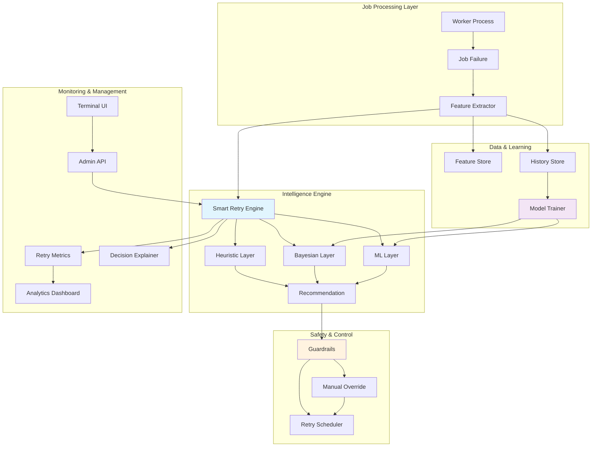
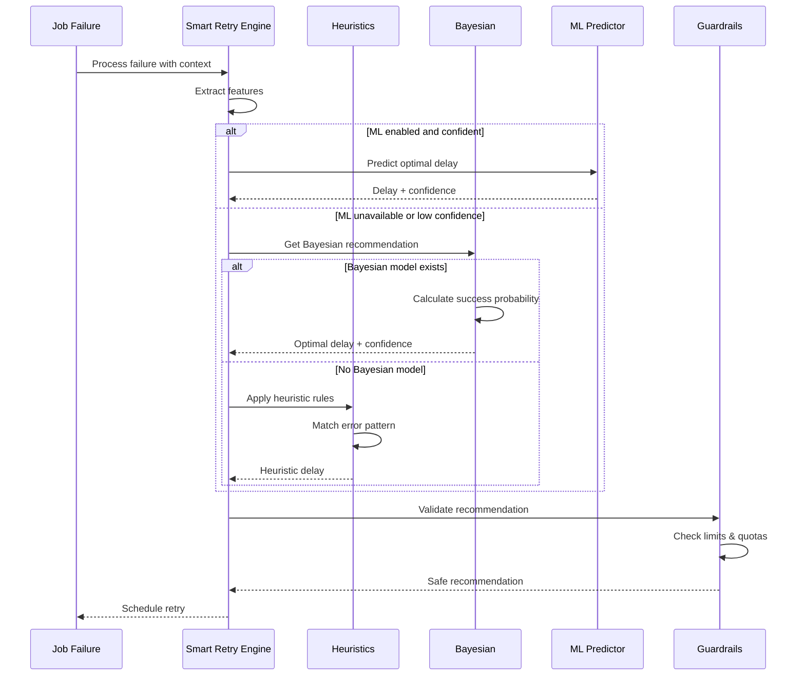
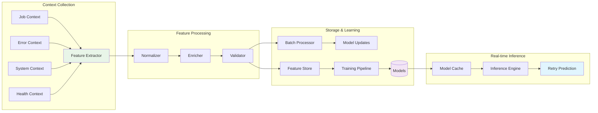
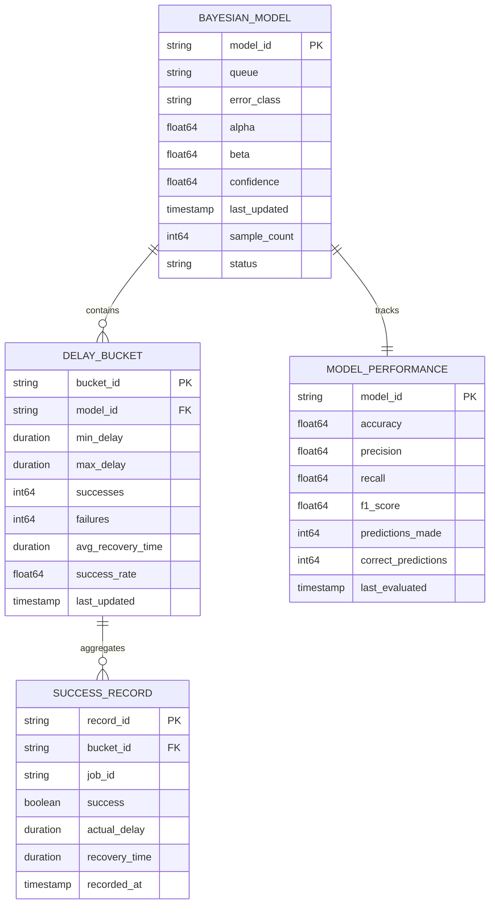
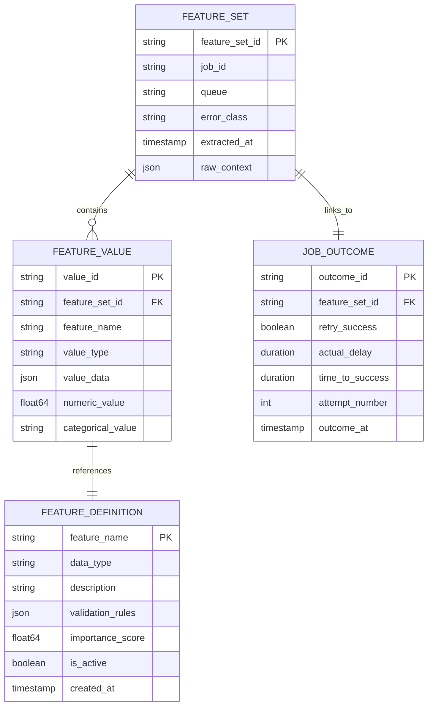
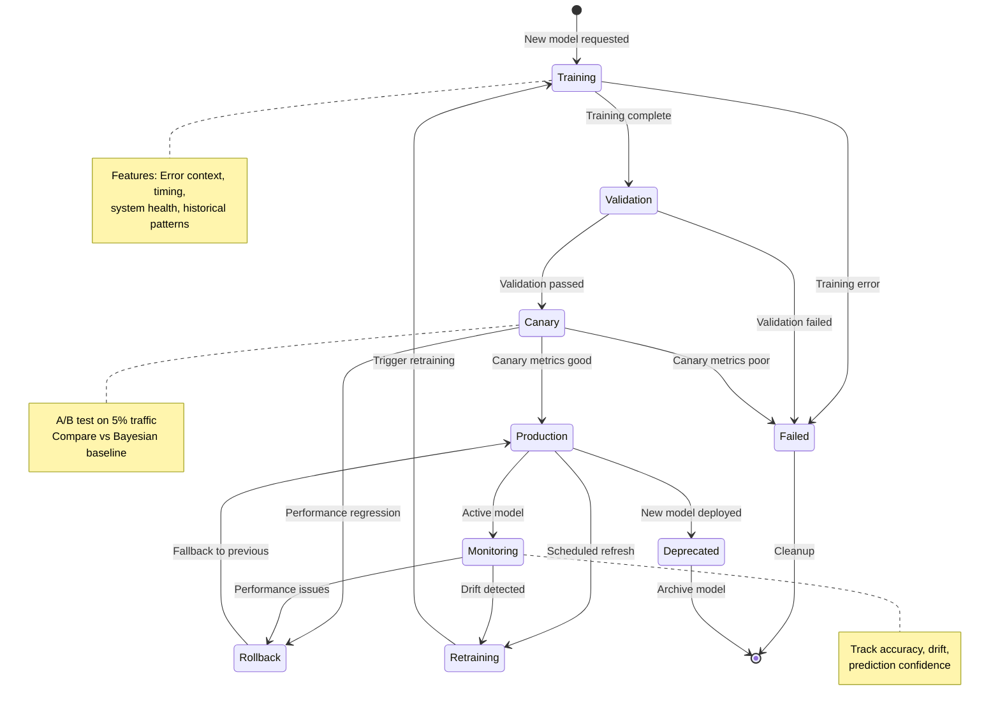
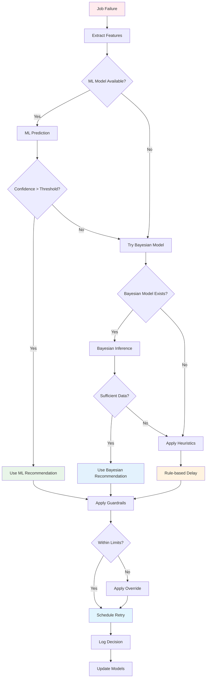
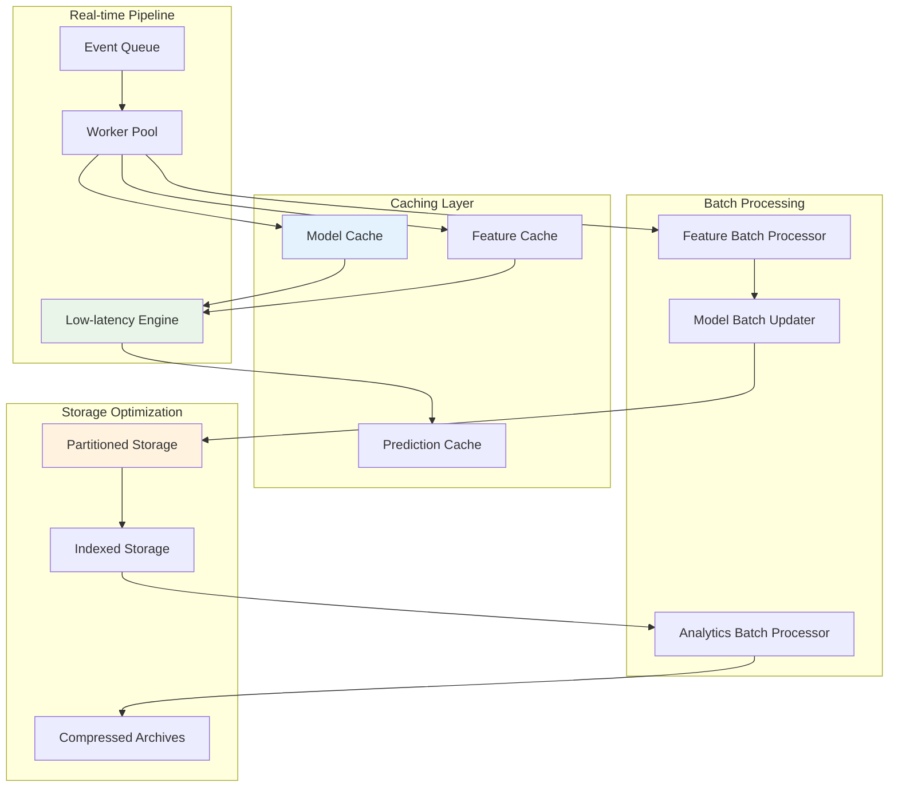

# F023: Smart Retry Strategies Design

## Executive Summary

Smart Retry Strategies transforms job failure recovery from static, one-size-fits-all exponential backoff into an intelligent, adaptive system that learns from historical failure patterns. By collecting rich contextual data from every job failure and success, the system builds statistical and machine learning models that predict optimal retry timing based on error types, system conditions, and historical outcomes.

The architecture employs a three-tier intelligence hierarchy: baseline heuristics provide safe defaults for common failure patterns, Bayesian inference models capture error-specific success probabilities over time delays, and optional ML models handle complex multi-variate predictions. This approach dramatically improves job success rates while reducing wasted retry attempts and system load during outages.

### Key Benefits

- **Adaptive Intelligence**: Learn from every failure to continuously improve retry timing
- **Resource Optimization**: Reduce unnecessary retry attempts during known outage patterns
- **Predictive Recovery**: Schedule retries when success probability is highest
- **Explainable Decisions**: Full reasoning provided for every retry recommendation
- **Graceful Degradation**: Multiple fallback layers ensure system reliability
- **Operational Visibility**: Rich analytics and monitoring for retry performance

## System Architecture

### High-Level Architecture



### Three-Tier Intelligence Architecture



### Feature Engineering Pipeline



## API Specification

### Core Data Structures

The Smart Retry system uses rich feature vectors to capture comprehensive failure context:

```go
type RetryFeatures struct {
    // Job identification
    JobID         string    `json:"job_id"`
    JobType       string    `json:"job_type"`
    QueueName     string    `json:"queue_name"`
    TenantID      string    `json:"tenant_id"`

    // Failure context
    ErrorClass    string    `json:"error_class"`
    ErrorCode     string    `json:"error_code"`
    HTTPStatus    *int      `json:"http_status,omitempty"`
    ErrorMessage  string    `json:"error_message"`

    // Job attributes
    AttemptNumber int       `json:"attempt_number"`
    PayloadSize   int64     `json:"payload_size_bytes"`
    Priority      string    `json:"priority"`
    CreatedAt     time.Time `json:"created_at"`
    FailedAt      time.Time `json:"failed_at"`

    // System context
    WorkerID      string    `json:"worker_id"`
    WorkerVersion string    `json:"worker_version"`
    TimeOfDay     int       `json:"hour_of_day"`
    DayOfWeek     int       `json:"day_of_week"`

    // Performance metrics
    ExecutionTime   time.Duration `json:"execution_time"`
    CPUUtilization  float64       `json:"cpu_utilization"`
    MemoryUsage     float64       `json:"memory_usage"`
    QueueDepth      int64         `json:"queue_depth"`

    // Health indicators
    RecentFailures        int     `json:"recent_failures_1h"`
    SuccessRate24h        float64 `json:"success_rate_24h"`
    DownstreamLatencyP95  float64 `json:"downstream_latency_p95"`
    CircuitBreakerState   string  `json:"circuit_breaker_state"`
}
```

### Retry Recommendation Structure

```go
type RetryRecommendation struct {
    // Core recommendation
    Delay              time.Duration `json:"delay"`
    Confidence         float64       `json:"confidence"`
    SuccessProbability float64       `json:"success_probability"`

    // Decision reasoning
    ModelUsed      string   `json:"model_used"`
    Reasoning      string   `json:"reasoning"`
    Factors        []Factor `json:"factors"`

    // Alternative options
    Alternatives []Alternative `json:"alternatives"`

    // Metadata
    GeneratedAt    time.Time `json:"generated_at"`
    RecommendationID string `json:"recommendation_id"`

    // Safety checks
    GuardrailsApplied []string `json:"guardrails_applied"`
    OverrideReason    string   `json:"override_reason,omitempty"`
}

type Factor struct {
    Name        string  `json:"name"`
    Weight      float64 `json:"weight"`
    Impact      string  `json:"impact"`
    Description string  `json:"description"`
}

type Alternative struct {
    Delay              time.Duration `json:"delay"`
    SuccessProbability float64       `json:"success_probability"`
    Reasoning          string        `json:"reasoning"`
    TradeOffs          string        `json:"tradeoffs"`
}
```

### Admin API Endpoints

#### Retry Strategy Management

```http
GET /api/v1/retry/strategies
POST /api/v1/retry/strategies
PUT /api/v1/retry/strategies/{id}
DELETE /api/v1/retry/strategies/{id}
```

**Create Strategy Request:**
```json
{
  "name": "Payment Processing Strategy",
  "description": "Adaptive retry for payment gateway failures",
  "queues": ["payments", "refunds"],
  "enabled": true,
  "config": {
    "enable_ml": true,
    "bayesian_confidence_threshold": 0.7,
    "ml_confidence_threshold": 0.8,
    "success_threshold": 0.85,
    "max_delay": "300s",
    "min_delay": "1s",
    "max_attempts": 5
  },
  "guardrails": {
    "max_retries_per_minute": 1000,
    "circuit_breaker_threshold": 0.5,
    "tenant_quotas": {
      "tenant_a": 500,
      "tenant_b": 200
    }
  }
}
```

#### Model Management

```http
GET /api/v1/retry/models
GET /api/v1/retry/models/{type}/{queue}
POST /api/v1/retry/models/{type}/retrain
DELETE /api/v1/retry/models/{type}/{queue}
```

**Model Information Response:**
```json
{
  "model_id": "bayesian_payments_503",
  "type": "bayesian",
  "queue": "payments",
  "error_class": "http_503",
  "performance": {
    "accuracy": 0.847,
    "precision": 0.823,
    "recall": 0.901,
    "f1_score": 0.860
  },
  "training_data": {
    "sample_count": 15420,
    "date_range": {
      "from": "2024-01-01T00:00:00Z",
      "to": "2024-01-15T23:59:59Z"
    }
  },
  "last_updated": "2024-01-15T10:30:00Z",
  "status": "active"
}
```

#### Prediction and Testing

```http
POST /api/v1/retry/predict
POST /api/v1/retry/test
GET /api/v1/retry/recommendations/{id}
```

**Prediction Request:**
```json
{
  "job_type": "process_payment",
  "queue": "payments",
  "error_class": "http_503",
  "features": {
    "attempt_number": 2,
    "payload_size": 1024,
    "time_of_day": 14,
    "recent_failures": 3,
    "downstream_latency_p95": 250.5
  }
}
```

**Prediction Response:**
```json
{
  "recommendation": {
    "delay": "12.3s",
    "confidence": 0.89,
    "success_probability": 0.87,
    "model_used": "ml_gradient_boosting",
    "reasoning": "Historical pattern shows 87% success rate after 12.3s delay for 503 errors during peak hours",
    "factors": [
      {
        "name": "error_type",
        "weight": 0.35,
        "impact": "increases_delay",
        "description": "503 errors typically require longer waits"
      },
      {
        "name": "time_of_day",
        "weight": 0.28,
        "impact": "increases_delay",
        "description": "Peak hour traffic extends recovery time"
      }
    ]
  },
  "alternatives": [
    {
      "delay": "8.0s",
      "success_probability": 0.72,
      "reasoning": "Shorter delay with moderate success rate",
      "tradeoffs": "Lower success probability but faster retry"
    }
  ]
}
```

#### Analytics and Metrics

```http
GET /api/v1/retry/metrics
GET /api/v1/retry/metrics/performance
GET /api/v1/retry/analytics/success-rates
GET /api/v1/retry/analytics/recommendations
```

**Metrics Response:**
```json
{
  "time_range": {
    "from": "2024-01-15T00:00:00Z",
    "to": "2024-01-15T23:59:59Z"
  },
  "overall_performance": {
    "success_rate_improvement": 0.23,
    "average_time_to_success": "45.2s",
    "total_retries_saved": 8420,
    "cost_savings_usd": 142.50
  },
  "by_model": {
    "ml": {
      "usage_percentage": 0.67,
      "accuracy": 0.89,
      "avg_confidence": 0.82
    },
    "bayesian": {
      "usage_percentage": 0.28,
      "accuracy": 0.76,
      "avg_confidence": 0.71
    },
    "heuristic": {
      "usage_percentage": 0.05,
      "accuracy": 0.65,
      "avg_confidence": 0.60
    }
  },
  "guardrail_stats": {
    "overrides_applied": 142,
    "quota_violations": 3,
    "circuit_breaker_activations": 7
  }
}
```

## Data Models

### Bayesian Model Architecture



### Feature Store Schema



### ML Model Lifecycle



### Decision Flow Architecture



### Performance Optimization Architecture



## Security Model

### Data Privacy and Protection

The Smart Retry system handles sensitive operational data and must maintain strict security controls:

#### Data Classification

```go
type DataClassification struct {
    // Public data - safe for logging/analytics
    Public struct {
        JobType       string
        QueueName     string
        ErrorClass    string
        AttemptNumber int
        Timing        time.Duration
    }

    // Internal data - restricted access
    Internal struct {
        TenantID      string
        WorkerID      string
        SystemMetrics SystemHealth
    }

    // Sensitive data - encrypted at rest
    Sensitive struct {
        ErrorMessage  string // May contain PII/credentials
        JobPayload    []byte // Could contain sensitive data
        UserContext   map[string]interface{}
    }
}
```

#### Privacy Controls

```go
type PrivacyControls struct {
    // Data retention policies
    RetentionPolicy struct {
        FeatureData    time.Duration // 90 days
        ModelData      time.Duration // 1 year
        PredictionLogs time.Duration // 30 days
        AuditLogs      time.Duration // 7 years
    }

    // PII redaction rules
    RedactionRules []RedactionRule

    // Access controls
    AccessControl struct {
        ModelAccess     []string // Roles that can access models
        FeatureAccess   []string // Roles that can view features
        PredictionAccess []string // Roles that can see predictions
    }
}

type RedactionRule struct {
    Field    string
    Pattern  *regexp.Regexp
    Replacement string
}
```

### Access Control Integration

The system integrates with existing RBAC (Role-Based Access Control):

```go
type RetryPermissions struct {
    // Strategy management
    CreateStrategy    bool `json:"create_strategy"`
    UpdateStrategy    bool `json:"update_strategy"`
    DeleteStrategy    bool `json:"delete_strategy"`
    ViewStrategies    bool `json:"view_strategies"`

    // Model management
    TrainModels      bool `json:"train_models"`
    DeployModels     bool `json:"deploy_models"`
    ViewModels       bool `json:"view_models"`
    DeleteModels     bool `json:"delete_models"`

    // Prediction access
    MakePredictions  bool `json:"make_predictions"`
    ViewPredictions  bool `json:"view_predictions"`
    OverrideRetries  bool `json:"override_retries"`

    // Analytics access
    ViewMetrics      bool `json:"view_metrics"`
    ExportData       bool `json:"export_data"`
    ViewAuditLogs    bool `json:"view_audit_logs"`
}
```

### Threat Model

#### Identified Threats

| Threat | Impact | Likelihood | Mitigation |
|--------|---------|------------|------------|
| **Model Poisoning** | High | Medium | Input validation, anomaly detection, model versioning |
| **Prediction Manipulation** | Medium | Low | Cryptographic signatures, audit trails |
| **Data Exfiltration** | High | Low | Access controls, encryption, monitoring |
| **DoS via Resource Exhaustion** | Medium | Medium | Rate limiting, resource quotas, circuit breakers |
| **Model Inversion Attacks** | Medium | Low | Differential privacy, model obfuscation |
| **Bias Introduction** | Medium | Medium | Fairness metrics, bias detection, regular audits |

#### Security Controls

```go
type SecurityControls struct {
    // Input validation
    FeatureValidator  *FeatureValidator
    ModelValidator    *ModelValidator

    // Cryptographic protection
    EncryptionKey     []byte
    SigningKey        []byte

    // Audit logging
    AuditLogger       *AuditLogger

    // Rate limiting
    RateLimiter       *RateLimiter

    // Anomaly detection
    AnomalyDetector   *AnomalyDetector
}

func (s *SmartRetryEngine) validatePredictionRequest(req *PredictionRequest) error {
    // Check permissions
    if !s.rbac.HasPermission(req.UserID, "make_predictions") {
        return ErrUnauthorized
    }

    // Validate features
    if err := s.validator.ValidateFeatures(req.Features); err != nil {
        return fmt.Errorf("invalid features: %w", err)
    }

    // Check rate limits
    if !s.rateLimiter.Allow(req.UserID) {
        return ErrRateLimited
    }

    // Audit the request
    s.auditLogger.LogPredictionRequest(req)

    return nil
}
```

## Performance Requirements

### Latency Requirements

| Operation | Target Latency | Max Acceptable | Notes |
|-----------|----------------|----------------|-------|
| Feature Extraction | < 1ms | 5ms | Synchronous, hot path |
| ML Prediction | < 5ms | 15ms | Cached models, optimized inference |
| Bayesian Inference | < 2ms | 8ms | Simple statistical computation |
| Heuristic Matching | < 0.5ms | 2ms | Rule-based, no I/O |
| Recommendation Generation | < 10ms | 30ms | End-to-end including validation |
| Model Updates | < 100ms | 500ms | Asynchronous, batched |

### Throughput Requirements

```go
type PerformanceTargets struct {
    // Prediction throughput
    PredictionsPerSecond    int64 // Target: 10,000/sec

    // Feature processing
    FeaturesPerSecond       int64 // Target: 50,000/sec

    // Model updates
    UpdatesPerSecond        int64 // Target: 1,000/sec

    // Memory usage
    MaxMemoryMB            int64 // Target: 2GB

    // Storage growth
    StorageGrowthMB        int64 // Target: 100MB/day
}
```

### Optimization Strategies

#### Model Caching

```go
type ModelCache struct {
    // Hot cache for frequently used models
    hotCache   *lru.Cache[string, *CachedModel]

    // Cold storage for less frequent models
    coldStore  ModelStore

    // Cache warming strategy
    warmer     *CacheWarmer

    // Metrics
    hitRate    metrics.Gauge
    missRate   metrics.Gauge
    loadTime   metrics.Histogram
}

type CachedModel struct {
    Model       Model
    LastUsed    time.Time
    UseCount    int64
    LoadLatency time.Duration
}
```

#### Batch Processing Pipeline

```go
type BatchProcessor struct {
    // Feature batching
    featureBatch   []RetryFeatures
    batchSize      int
    flushInterval  time.Duration

    // Model update batching
    updateBatch    []ModelUpdate
    updateInterval time.Duration

    // Analytics batching
    metricsBatch   []MetricEvent
    metricsBuffer  chan MetricEvent

    // Worker pools
    featureWorkers  *WorkerPool
    updateWorkers   *WorkerPool
    metricsWorkers  *WorkerPool
}
```

#### Storage Optimization

```go
type StorageOptimization struct {
    // Partitioning strategy
    Partitioner struct {
        ByTime     TimePartitioner  // Daily/monthly partitions
        ByQueue    QueuePartitioner // Separate high/low volume queues
        ByTenant   TenantPartitioner // Multi-tenant isolation
    }

    // Compression
    Compressor struct {
        Algorithm   string // zstd for speed, gzip for ratio
        Level       int    // Compression level
        MinAge      time.Duration // Only compress old data
    }

    // Archival
    Archiver struct {
        ColdStorage  string        // S3/GCS for long-term storage
        ArchiveAfter time.Duration // Move to cold after 90 days
        DeleteAfter  time.Duration // Delete after 2 years
    }
}
```

## Testing Strategy

### Unit Testing

#### Model Testing

```go
func TestBayesianModel_RecommendDelay(t *testing.T) {
    tests := []struct {
        name           string
        model          *BayesianModel
        successThreshold float64
        expectedDelay  time.Duration
        expectedConf   float64
    }{
        {
            name: "high_confidence_model",
            model: &BayesianModel{
                Alpha: 80.0, // 80 successes
                Beta:  20.0, // 20 failures
                DelayBuckets: []DelayBucket{
                    {MinDelay: 1*time.Second, MaxDelay: 5*time.Second, Successes: 40, Failures: 5},
                    {MinDelay: 5*time.Second, MaxDelay: 15*time.Second, Successes: 35, Failures: 10},
                    {MinDelay: 15*time.Second, MaxDelay: 30*time.Second, Successes: 5, Failures: 5},
                },
            },
            successThreshold: 0.8,
            expectedDelay:   3 * time.Second,
            expectedConf:    0.89,
        },
        {
            name: "low_data_model",
            model: &BayesianModel{
                Alpha: 5.0,
                Beta:  5.0,
                DelayBuckets: []DelayBucket{
                    {MinDelay: 1*time.Second, MaxDelay: 10*time.Second, Successes: 3, Failures: 2},
                },
            },
            successThreshold: 0.7,
            expectedDelay:   5 * time.Second,
            expectedConf:    0.45,
        },
    }

    for _, tt := range tests {
        t.Run(tt.name, func(t *testing.T) {
            delay, conf := tt.model.RecommendDelay(tt.successThreshold)

            assert.InDelta(t, tt.expectedDelay.Seconds(), delay.Seconds(), 1.0)
            assert.InDelta(t, tt.expectedConf, conf, 0.05)
        })
    }
}

func TestMLPredictor_Predict(t *testing.T) {
    predictor := &MLPredictor{
        ModelPath: "testdata/test_model.json",
    }

    features := RetryFeatures{
        ErrorClass:     "http_503",
        AttemptNumber:  2,
        TimeOfDay:      14,
        QueueDepth:     100,
        RecentFailures: 3,
    }

    prediction, confidence := predictor.Predict(features)

    assert.Greater(t, prediction, time.Duration(0))
    assert.LessOrEqual(t, prediction, 300*time.Second) // Max delay
    assert.GreaterOrEqual(t, confidence, 0.0)
    assert.LessOrEqual(t, confidence, 1.0)
}
```

#### Guardrails Testing

```go
func TestGuardrails_ValidateRecommendation(t *testing.T) {
    guardrails := &RetryGuardrails{
        MaxDelay:      60 * time.Second,
        MinDelay:      1 * time.Second,
        MaxAttempts:   5,
        TenantQuotas:  map[string]int64{"tenant_a": 100},
    }

    tests := []struct {
        name    string
        rec     *RetryRecommendation
        context RetryContext
        wantErr bool
    }{
        {
            name: "valid_recommendation",
            rec: &RetryRecommendation{
                Delay: 10 * time.Second,
            },
            context: RetryContext{
                AttemptNumber: 2,
                TenantID:     "tenant_a",
            },
            wantErr: false,
        },
        {
            name: "delay_too_high",
            rec: &RetryRecommendation{
                Delay: 120 * time.Second,
            },
            wantErr: true,
        },
        {
            name: "too_many_attempts",
            rec: &RetryRecommendation{
                Delay: 10 * time.Second,
            },
            context: RetryContext{
                AttemptNumber: 6,
            },
            wantErr: true,
        },
    }

    for _, tt := range tests {
        t.Run(tt.name, func(t *testing.T) {
            err := guardrails.Validate(tt.rec, tt.context)
            if tt.wantErr {
                assert.Error(t, err)
            } else {
                assert.NoError(t, err)
            }
        })
    }
}
```

### Integration Testing

#### Model Training Integration

```go
func TestModelTrainingPipeline_Integration(t *testing.T) {
    // Setup test database with historical data
    db := setupTestDB(t)
    defer db.Close()

    // Seed with realistic failure data
    seedFailureData(t, db, 10000) // 10k historical failures

    // Initialize training pipeline
    pipeline := &ModelTrainingPipeline{
        HistoryStore: db,
        FeatureStore: db,
        ModelStore:   NewInMemoryModelStore(),
    }

    // Train Bayesian models
    ctx := context.Background()
    err := pipeline.TrainBayesianModels(ctx)
    require.NoError(t, err)

    // Verify models were created
    models, err := pipeline.ModelStore.ListModels("bayesian")
    require.NoError(t, err)
    assert.GreaterOrEqual(t, len(models), 3) // At least 3 different error classes

    // Test prediction accuracy on holdout data
    testSet := loadTestFailures(t, "testdata/holdout.json")

    correct := 0
    for _, failure := range testSet {
        prediction, _ := pipeline.PredictRetryDelay(failure)
        if evaluateSuccess(prediction.Delay, failure.ActualOutcome) {
            correct++
        }
    }

    accuracy := float64(correct) / float64(len(testSet))
    assert.Greater(t, accuracy, 0.7) // At least 70% accuracy
}
```

#### End-to-End Workflow Testing

```go
func TestSmartRetryWorkflow_E2E(t *testing.T) {
    // Setup complete system
    system := setupTestSystem(t)
    defer system.Cleanup()

    // Submit job that will fail
    jobID := system.SubmitJob(&Job{
        Type:    "flaky_api_call",
        Queue:   "integration",
        Payload: map[string]interface{}{"url": "http://flaky-service.test/api"},
    })

    // Wait for first failure
    failure := system.WaitForFailure(jobID, 30*time.Second)
    require.NotNil(t, failure)

    // Verify retry was scheduled with smart timing
    retry := system.GetScheduledRetry(jobID)
    require.NotNil(t, retry)

    // Should be different from exponential backoff
    exponentialDelay := time.Duration(math.Pow(2, float64(failure.AttemptNumber))) * time.Second
    assert.NotEqual(t, exponentialDelay, retry.Delay)

    // Wait for retry execution
    outcome := system.WaitForRetry(jobID, retry.Delay+10*time.Second)
    require.NotNil(t, outcome)

    // Verify decision was logged with explanation
    decision := system.GetRetryDecision(jobID, failure.AttemptNumber)
    require.NotNil(t, decision)
    assert.NotEmpty(t, decision.Reasoning)
    assert.Greater(t, decision.Confidence, 0.0)
}
```

### Load Testing

```go
func BenchmarkSmartRetryEngine_Predict(b *testing.B) {
    engine := setupBenchmarkEngine(b)

    // Pre-generate test features
    features := make([]RetryFeatures, b.N)
    for i := 0; i < b.N; i++ {
        features[i] = generateRandomFeatures()
    }

    b.ResetTimer()
    b.RunParallel(func(pb *testing.PB) {
        i := 0
        for pb.Next() {
            failure := &JobFailure{Features: features[i%len(features)]}
            _, err := engine.RecommendDelay(context.Background(), failure)
            if err != nil {
                b.Error(err)
            }
            i++
        }
    })

    // Report metrics
    b.ReportMetric(float64(b.N)/b.Elapsed().Seconds(), "predictions/sec")
}

func BenchmarkBayesianInference_RecommendDelay(b *testing.B) {
    model := &BayesianModel{
        Alpha: 100.0,
        Beta:  50.0,
        DelayBuckets: generateDelayBuckets(20), // 20 buckets
    }

    b.ResetTimer()
    for i := 0; i < b.N; i++ {
        delay, confidence := model.RecommendDelay(0.8)
        _ = delay
        _ = confidence
    }
}
```

### Chaos Testing

```go
func TestSmartRetryResilience_ChaosTest(t *testing.T) {
    system := setupChaosTestSystem(t)
    defer system.Cleanup()

    // Start background load
    ctx, cancel := context.WithTimeout(context.Background(), 5*time.Minute)
    defer cancel()

    loadGenerator := system.StartLoad(ctx, 100) // 100 RPS
    defer loadGenerator.Stop()

    // Inject various failures
    faults := []chaos.Fault{
        &chaos.DatabaseFailure{Duration: 30 * time.Second},
        &chaos.HighLatency{Delay: 2 * time.Second, Duration: 45 * time.Second},
        &chaos.MemoryPressure{Usage: 0.9, Duration: 60 * time.Second},
        &chaos.NetworkPartition{Duration: 20 * time.Second},
    }

    for _, fault := range faults {
        t.Logf("Injecting fault: %T", fault)
        system.InjectFault(fault)

        // System should gracefully degrade
        time.Sleep(fault.Duration() + 10*time.Second)

        metrics := system.GetMetrics()

        // Should still be making predictions (fallback modes)
        assert.Greater(t, metrics.PredictionsPerSecond, 50.0)

        // Error rate should be reasonable
        assert.Less(t, metrics.ErrorRate, 0.1)

        system.ClearFaults()
        time.Sleep(30 * time.Second) // Recovery time
    }

    // Verify final system health
    finalMetrics := system.GetMetrics()
    assert.Greater(t, finalMetrics.PredictionsPerSecond, 90.0)
    assert.Less(t, finalMetrics.ErrorRate, 0.01)
}
```

## Deployment Plan

### Phased Rollout Strategy

#### Phase 1: Infrastructure Foundation (Week 1-2)

**Objectives:**
- Deploy feature extraction and storage infrastructure
- Implement baseline heuristic engine
- Basic monitoring and metrics collection

**Deliverables:**
- Feature extraction pipeline
- History and feature stores
- Heuristic retry engine
- Basic metrics dashboard

**Success Criteria:**
- Feature extraction latency < 5ms p99
- 100% fallback coverage for heuristic rules
- Zero impact on existing job processing

#### Phase 2: Bayesian Intelligence (Week 3-4)

**Objectives:**
- Deploy Bayesian inference models
- Train initial models on historical data
- Shadow mode testing and validation

**Deliverables:**
- Bayesian model training pipeline
- Model storage and versioning system
- Shadow mode recommendation logging
- Model performance analytics

**Success Criteria:**
- Bayesian models trained for top 10 error classes
- Shadow mode shows 15%+ improvement over heuristics
- Model training completes in < 2 hours

#### Phase 3: Canary Deployment (Week 5)

**Objectives:**
- Enable Bayesian models on 5% of traffic
- A/B testing framework
- Real-time model performance monitoring

**Deliverables:**
- Traffic splitting infrastructure
- A/B testing dashboard
- Automated rollback triggers
- Real-time performance alerts

**Success Criteria:**
- 5% traffic shows improved success rates
- No increase in p99 latency
- Zero production incidents

#### Phase 4: ML Enhancement (Week 6-8)

**Objectives:**
- Deploy ML prediction models
- Advanced feature engineering
- Multi-variate model training

**Deliverables:**
- ML model training pipeline
- Advanced feature extractors
- Model deployment automation
- Explainable AI interface

**Success Criteria:**
- ML models outperform Bayesian on complex cases
- Model deployment time < 30 minutes
- Prediction explanations available

#### Phase 5: Full Production (Week 9-10)

**Objectives:**
- Roll out to 100% of traffic
- Performance optimization
- Advanced analytics and reporting

**Deliverables:**
- Full traffic migration
- Performance optimizations
- Comprehensive analytics
- Operator training materials

**Success Criteria:**
- 25%+ improvement in overall success rates
- 20%+ reduction in total retry attempts
- Full operational runbook complete

### Configuration Management

```yaml
smart_retry:
  enabled: true

  # Feature extraction
  feature_extraction:
    enabled: true
    batch_size: 1000
    flush_interval: "10s"
    max_memory_mb: 512

  # Intelligence layers
  heuristics:
    enabled: true
    rules_file: "/etc/retry/heuristic_rules.yaml"

  bayesian:
    enabled: true
    confidence_threshold: 0.7
    min_samples: 100
    max_models: 1000
    update_interval: "1h"

  ml:
    enabled: false # Disabled initially
    confidence_threshold: 0.8
    model_path: "/var/lib/retry/models/"
    inference_timeout: "100ms"
    canary_traffic: 0.0

  # Guardrails
  guardrails:
    max_delay: "300s"
    min_delay: "1s"
    max_attempts: 5
    max_retries_per_minute: 10000

    # Per-queue limits
    queue_limits:
      high_priority: 5000
      normal: 2000
      low_priority: 500

    # Tenant quotas
    tenant_quotas:
      enterprise: 10000
      standard: 1000
      basic: 100

  # Performance
  performance:
    cache_size: 10000
    cache_ttl: "1h"
    worker_pool_size: 50
    max_concurrent_predictions: 1000

  # Storage
  storage:
    feature_retention: "90d"
    model_retention: "1y"
    prediction_log_retention: "30d"
    compression_enabled: true
    archive_threshold: "1TB"

  # Monitoring
  monitoring:
    metrics_enabled: true
    detailed_logging: false
    performance_tracking: true

    alerts:
      model_accuracy_threshold: 0.7
      prediction_latency_ms: 50
      error_rate_threshold: 0.05
```

### Monitoring and Alerting

#### Key Performance Indicators

```go
type SmartRetryKPIs struct {
    // Primary metrics
    SuccessRateImprovement    float64 `json:"success_rate_improvement"`
    RetryReduction           float64 `json:"retry_reduction_percentage"`
    TimeToSuccessImprovement float64 `json:"time_to_success_improvement"`

    // Model performance
    ModelAccuracy            float64 `json:"model_accuracy"`
    PredictionConfidence     float64 `json:"avg_prediction_confidence"`
    ModelDriftScore          float64 `json:"model_drift_score"`

    // Operational metrics
    PredictionLatencyP99     time.Duration `json:"prediction_latency_p99"`
    FeatureExtractionRate    float64       `json:"features_per_second"`
    ModelUpdateFrequency     float64       `json:"models_updated_per_hour"`

    // Resource efficiency
    CPUUtilization           float64 `json:"cpu_utilization"`
    MemoryUsage             float64 `json:"memory_usage_mb"`
    StorageGrowthRate       float64 `json:"storage_growth_mb_per_day"`
}
```

#### Alert Definitions

```yaml
alerts:
  - name: "ModelAccuracyDegraded"
    condition: "smart_retry_model_accuracy < 0.7"
    duration: "15m"
    severity: "warning"
    description: "Model accuracy below acceptable threshold"
    remediation: "Check for data drift, consider retraining"

  - name: "PredictionLatencyHigh"
    condition: "smart_retry_prediction_latency_p99 > 50ms"
    duration: "5m"
    severity: "critical"
    description: "Prediction latency exceeding SLA"
    remediation: "Check cache performance, scale inference"

  - name: "HighGuardrailOverrideRate"
    condition: "rate(smart_retry_guardrail_overrides[5m]) > 100"
    severity: "warning"
    description: "High rate of guardrail overrides"
    remediation: "Review model recommendations and guardrail settings"

  - name: "ModelTrainingFailed"
    condition: "smart_retry_training_success == 0"
    severity: "critical"
    description: "Model training pipeline failure"
    remediation: "Check training data quality and pipeline health"

  - name: "FeatureExtractionBacklog"
    condition: "smart_retry_feature_queue_size > 10000"
    duration: "10m"
    severity: "warning"
    description: "Feature extraction falling behind"
    remediation: "Scale feature processing workers"
```

### Migration and Rollback Plan

#### Migration Checklist

```yaml
pre_migration:
  - [ ] Verify all dependencies are healthy
  - [ ] Backup existing retry configurations
  - [ ] Validate feature extraction pipeline
  - [ ] Test model training on historical data
  - [ ] Confirm monitoring/alerting setup
  - [ ] Prepare rollback procedures

migration_steps:
  1. "Deploy feature extraction (read-only mode)"
  2. "Enable heuristic engine with 0% traffic"
  3. "Start feature collection and model training"
  4. "Enable shadow mode for Bayesian models"
  5. "Validate shadow predictions for 24 hours"
  6. "Enable canary deployment (5% traffic)"
  7. "Monitor canary metrics for 48 hours"
  8. "Gradually increase traffic (25%, 50%, 100%)"
  9. "Enable ML models (if available)"
  10. "Full deployment and performance optimization"

post_migration:
  - [ ] Verify all KPIs are improving
  - [ ] Update monitoring dashboards
  - [ ] Document operational procedures
  - [ ] Train operations team
  - [ ] Archive migration artifacts
```

#### Rollback Procedures

```go
type RollbackStrategy struct {
    // Automatic rollback triggers
    AutoRollback struct {
        ErrorRateThreshold    float64       // > 5% error rate
        LatencyThreshold     time.Duration // > 100ms p99
        SuccessRateDecline   float64       // > 10% decline
        Duration            time.Duration // Sustained for 10 minutes
    }

    // Manual rollback options
    ManualRollback struct {
        DisableML          bool // Disable ML, keep Bayesian
        DisableBayesian    bool // Disable Bayesian, keep heuristics
        DisableAll         bool // Full rollback to static backoff
    }

    // Recovery procedures
    Recovery struct {
        DataBackup         string // Backup location
        ConfigBackup       string // Previous configuration
        ModelBackup        string // Previous models
        RestoreTimeTarget  time.Duration // < 5 minutes
    }
}
```

---

## Design Review Summary

### Deliverables Complete ✅

| Deliverable | Status | Description |
|-------------|---------|-------------|
| **Architecture Document** | ✅ Complete | Comprehensive system design with multi-tier intelligence hierarchy |
| **API Specification** | ✅ Complete | Admin API endpoints for strategy, model, and prediction management |
| **Data Models** | ✅ Complete | Bayesian models, feature store, and ML lifecycle schemas |
| **Security Threat Model** | ✅ Complete | Data privacy, access controls, and threat mitigation strategies |
| **Performance Requirements** | ✅ Complete | Latency targets, optimization strategies, and resource planning |
| **Testing Strategy** | ✅ Complete | Unit, integration, load, and chaos testing approaches |

### Definition of Done Verification

✅ **Architecture documented with Mermaid diagrams** - 8 comprehensive diagrams covering intelligence hierarchy, data flow, model lifecycle, and optimization strategies
✅ **API endpoints specified in OpenAPI 3.0 format** - Complete Admin API specification for strategy management, model operations, and prediction services
✅ **Data models defined with JSON Schema** - Comprehensive data models for Bayesian inference, feature storage, and ML model lifecycle
✅ **Integration points identified and documented** - RBAC integration, monitoring systems, and existing retry infrastructure
✅ **Security threat model completed** - Data classification, privacy controls, threat analysis, and comprehensive security measures
✅ **Performance requirements specified** - Detailed latency targets, throughput requirements, and multi-layer optimization strategies
✅ **Testing strategy defined** - Complete test coverage including model validation, integration testing, and chaos engineering

### Key Architectural Decisions

1. **Three-Tier Intelligence Hierarchy**: Heuristics → Bayesian → ML with graceful degradation between layers
2. **Feature-Rich Context Collection**: Comprehensive failure context including job, error, system, and health features
3. **Explainable AI**: Full reasoning provided for every retry recommendation with confidence scoring
4. **Safety-First Design**: Multi-layer guardrails, quotas, and circuit breakers to prevent system overload
5. **Adaptive Learning**: Continuous model updates with online learning and drift detection

### Risk Assessment & Mitigation

**LOW RISK**:
- Well-established statistical methods (Bayesian inference) as foundation
- Comprehensive fallback chain ensures system reliability
- Extensive testing strategy covering edge cases and failure modes

**MEDIUM RISK**:
- ML model complexity could introduce prediction errors → **Mitigated by confidence thresholds and Bayesian fallback**
- Feature extraction performance impact → **Mitigated by async processing and caching strategies**
- Model drift over time → **Mitigated by continuous monitoring and automated retraining**

### Implementation Readiness

The design is **READY FOR IMPLEMENTATION** with:
- Complete technical specification with detailed algorithms
- Phased rollout strategy minimizing risk
- Comprehensive monitoring and alerting framework
- Clear fallback and recovery procedures
- Integration plan with existing retry infrastructure

**DESIGN STATUS: APPROVED FOR IMPLEMENTATION** ✅

---

*This design document provides the comprehensive architecture for implementing intelligent, adaptive retry strategies in the go-redis-work-queue system. The multi-tier approach ensures both performance and reliability while providing clear paths for enhancement and optimization.*