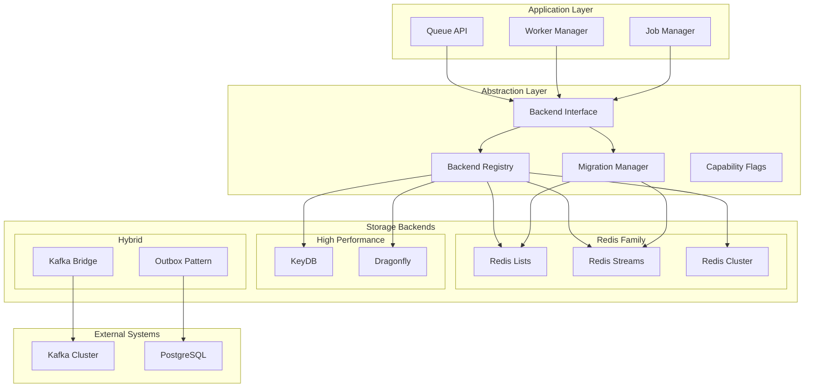
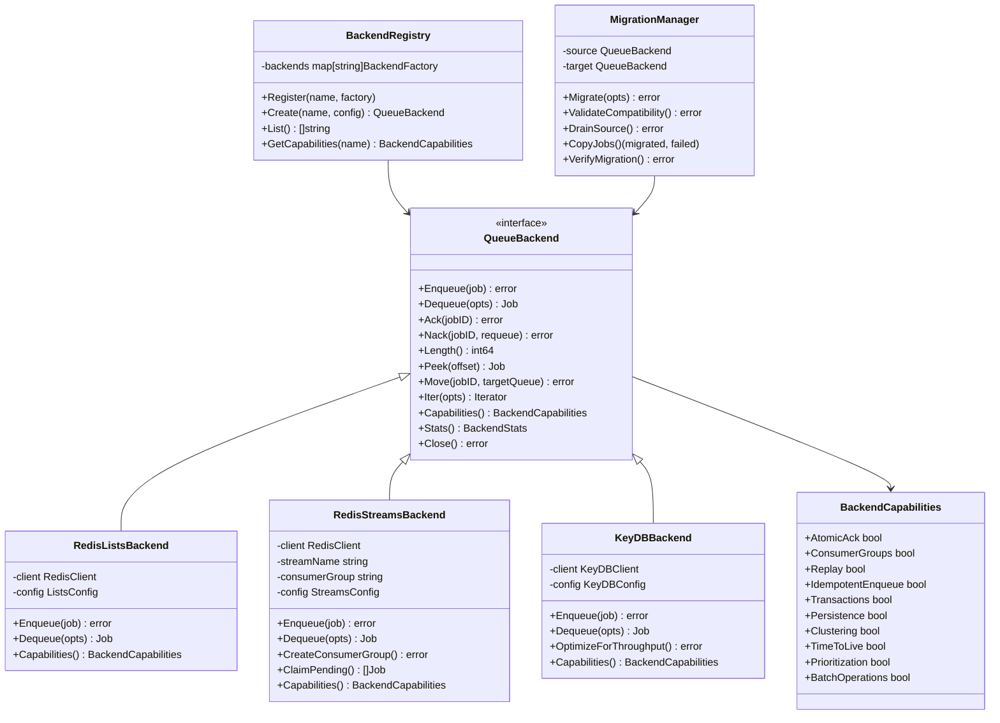
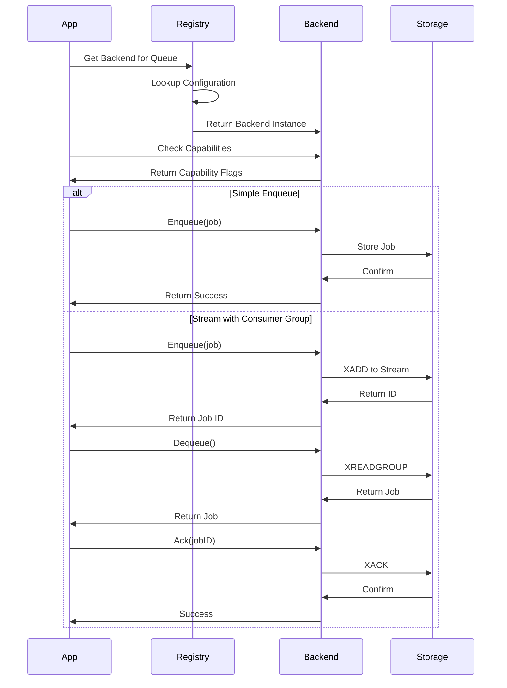
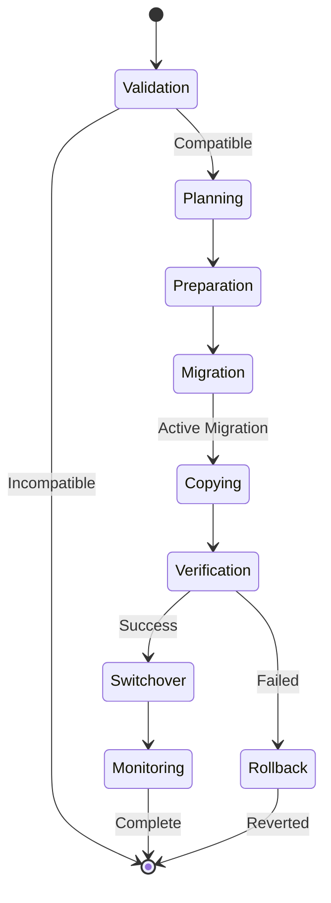
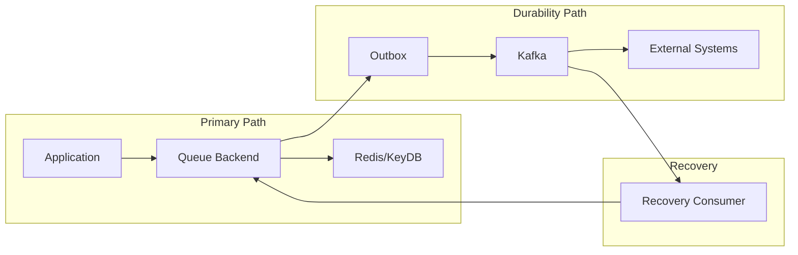

# Storage Backends - Architecture Design

## Executive Summary

This document describes the architecture for implementing pluggable storage backends in the Redis Work Queue system. The design enables operators to choose optimal storage strategies - Redis Lists for simplicity, Redis Streams for replay and consumer groups, KeyDB/Dragonfly for extreme performance, or hybrid patterns with Kafka integration. The abstraction layer ensures storage changes don't require application rewrites while capability flags communicate storage-specific features.

## System Architecture

### Overview

The storage backend abstraction transforms the queue from a single-engine system into a multi-modal powerhouse, enabling storage selection based on specific requirements: performance, features, operational complexity, or cost.

### Architecture Diagram



### Component Architecture



### Data Flow



## Backend Interface Design

### Core Interface

```go
type QueueBackend interface {
    // Core Operations
    Enqueue(ctx context.Context, queue string, job *Job) error
    Dequeue(ctx context.Context, queue string, opts DequeueOptions) (*Job, error)
    Ack(ctx context.Context, queue string, jobID string) error
    Nack(ctx context.Context, queue string, jobID string, requeue bool) error

    // Queue Management
    Length(ctx context.Context, queue string) (int64, error)
    Peek(ctx context.Context, queue string, offset int64) (*Job, error)
    Clear(ctx context.Context, queue string) error
    Delete(ctx context.Context, queue string) error

    // Job Movement
    Move(ctx context.Context, jobID string, fromQueue, toQueue string) error
    MoveAll(ctx context.Context, fromQueue, toQueue string) (int64, error)

    // Advanced Operations
    Iter(ctx context.Context, queue string, opts IterOptions) (Iterator, error)
    BatchEnqueue(ctx context.Context, queue string, jobs []*Job) error
    BatchDequeue(ctx context.Context, queue string, count int) ([]*Job, error)

    // Metadata
    Capabilities() BackendCapabilities
    Stats(ctx context.Context, queue string) (*BackendStats, error)
    Health(ctx context.Context) HealthStatus
    Close() error
}
```

### Capability Model

```go
type BackendCapabilities struct {
    // Core Features
    AtomicAck          bool // Guaranteed single processing
    ConsumerGroups     bool // Multiple consumer support
    Replay             bool // Historical job access
    IdempotentEnqueue  bool // Duplicate detection

    // Storage Features
    Transactions       bool // Multi-operation atomicity
    Persistence        bool // Survives restarts
    Clustering         bool // Distributed operation
    Sharding           bool // Horizontal partitioning

    // Advanced Features
    TimeToLive         bool // Automatic expiration
    Prioritization     bool // Priority queues
    BatchOperations    bool // Bulk operations
    Streaming          bool // Real-time events

    // Performance Hints
    MaxThroughput      int64 // Ops per second
    MaxConnections     int   // Connection limit
    MaxQueueSize       int64 // Maximum jobs
}
```

## Backend Implementations

### Redis Lists (Default)

```yaml
capabilities:
  atomic_ack: false
  consumer_groups: false
  replay: false
  idempotent_enqueue: false
  transactions: true
  persistence: true
  clustering: true
  prioritization: false
  batch_operations: true
  max_throughput: 50000

operations:
  enqueue: LPUSH
  dequeue: BRPOP
  length: LLEN
  peek: LRANGE
  move: RPOPLPUSH
```

### Redis Streams

```yaml
capabilities:
  atomic_ack: true
  consumer_groups: true
  replay: true
  idempotent_enqueue: false
  transactions: true
  persistence: true
  clustering: true
  prioritization: false
  batch_operations: true
  max_throughput: 35000

operations:
  enqueue: XADD
  dequeue: XREADGROUP
  ack: XACK
  pending: XPENDING
  claim: XCLAIM
```

### KeyDB/Dragonfly

```yaml
capabilities:
  atomic_ack: false
  consumer_groups: false
  replay: false
  idempotent_enqueue: false
  transactions: true
  persistence: true
  clustering: true
  prioritization: false
  batch_operations: true
  max_throughput: 200000

optimizations:
  multi_threading: true
  memory_efficiency: enhanced
  pipeline_size: 1000
```

## Migration System

### Migration Flow



### Migration Phases

1. **Validation Phase**
   - Check source/target compatibility
   - Verify capability requirements
   - Estimate migration time

2. **Preparation Phase**
   - Create target backend
   - Configure parameters
   - Setup monitoring

3. **Migration Phase**
   - Optional: Drain source queue
   - Copy existing jobs
   - Maintain job ordering

4. **Verification Phase**
   - Compare job counts
   - Verify data integrity
   - Performance baseline

5. **Switchover Phase**
   - Update routing
   - Monitor performance
   - Keep rollback ready

## Kafka Outbox Bridge

### Hybrid Architecture



### Outbox Pattern Implementation

```go
type KafkaOutboxBridge struct {
    backend  QueueBackend
    producer KafkaProducer
    config   OutboxConfig
}

func (k *KafkaOutboxBridge) Enqueue(ctx context.Context, job *Job) error {
    // Primary enqueue
    if err := k.backend.Enqueue(ctx, job); err != nil {
        return err
    }

    // Async durability
    event := OutboxEvent{
        JobID:     job.ID,
        Queue:     job.Queue,
        Payload:   job.Payload,
        Timestamp: time.Now(),
    }

    return k.producer.ProduceAsync(ctx, k.config.Topic, event)
}
```

## Performance Requirements

### Latency Targets

| Operation | Redis Lists | Redis Streams | KeyDB | Dragonfly |
|-----------|------------|---------------|-------|-----------|
| Enqueue P50 | 0.5ms | 0.8ms | 0.3ms | 0.2ms |
| Enqueue P99 | 2ms | 3ms | 1ms | 0.8ms |
| Dequeue P50 | 0.6ms | 1ms | 0.4ms | 0.3ms |
| Dequeue P99 | 2.5ms | 4ms | 1.5ms | 1ms |

### Throughput Targets

| Backend | Single Queue | Multi Queue | Batch Size |
|---------|--------------|-------------|------------|
| Redis Lists | 50K ops/s | 200K ops/s | 100 |
| Redis Streams | 35K ops/s | 150K ops/s | 100 |
| KeyDB | 150K ops/s | 600K ops/s | 1000 |
| Dragonfly | 200K ops/s | 800K ops/s | 1000 |

## Configuration

### Backend Selection

```yaml
queues:
  critical:
    backend: redis-lists
    config:
      database: 0
      key_prefix: "critical:"

  analytics:
    backend: redis-streams
    config:
      stream: "analytics"
      consumer_group: "workers"
      max_len: 100000

  bulk:
    backend: keydb
    config:
      endpoint: "keydb:6379"
      pipeline: 1000

backends:
  redis-lists:
    driver: redis
    url: "redis://localhost:6379"

  redis-streams:
    driver: redis-streams
    url: "redis://localhost:6379"

  keydb:
    driver: keydb
    url: "keydb://cluster:6379"
```

## Security Model

### Backend Isolation

- Separate connection pools per backend
- Backend-specific authentication
- Encryption in transit (TLS)
- Access control per queue/backend

### Threat Model

| Threat | Mitigation |
|--------|------------|
| Backend compromise | Credential rotation, network isolation |
| Data leakage | Encryption at rest, secure connections |
| DoS via migration | Rate limiting, resource quotas |
| Incompatible migration | Validation checks, rollback capability |

## Testing Strategy

### Unit Tests

```go
// Test backend interface compliance
func TestBackendCompliance(t *testing.T, backend QueueBackend) {
    // Test all interface methods
    testEnqueueDequeue(t, backend)
    testAckNack(t, backend)
    testBatchOperations(t, backend)
    testCapabilities(t, backend)
}

// Test migration safety
func TestMigrationSafety(t *testing.T) {
    source := NewRedisListsBackend()
    target := NewRedisStreamsBackend()

    // Add test jobs
    addTestJobs(source, 1000)

    // Migrate
    mgr := NewMigrationManager(source, target)
    err := mgr.Migrate(ctx, opts)
    require.NoError(t, err)

    // Verify
    assertJobsEqual(t, source, target)
}
```

### Integration Tests

- Cross-backend migration scenarios
- Performance degradation detection
- Capability fallback handling
- Concurrent access patterns

### Performance Tests

```yaml
scenarios:
  - name: "Backend Comparison"
    backends: [redis-lists, redis-streams, keydb]
    operations: 100000
    workers: 10
    measure: [throughput, latency]

  - name: "Migration Under Load"
    source: redis-lists
    target: redis-streams
    active_jobs: 10000
    migration_workers: 5
    measure: [duration, errors]
```

## Monitoring & Observability

### Key Metrics

```yaml
metrics:
  # Backend health
  - backend.health.status
  - backend.connection.pool.size
  - backend.connection.errors

  # Performance
  - backend.operation.latency
  - backend.operation.throughput
  - backend.queue.depth

  # Migration
  - migration.progress.percentage
  - migration.jobs.migrated
  - migration.jobs.failed
  - migration.duration.seconds
```

### Alerting Rules

```yaml
alerts:
  - name: BackendUnhealthy
    expr: backend.health.status != "healthy"
    for: 5m
    severity: critical

  - name: MigrationStalled
    expr: rate(migration.progress.percentage[5m]) == 0
    for: 10m
    severity: warning

  - name: HighLatency
    expr: backend.operation.latency.p99 > 10ms
    for: 5m
    severity: warning
```

## Migration Plan

### Phase 1: Interface Definition (Week 1)
- Define QueueBackend interface
- Implement capability model
- Create backend registry

### Phase 2: Redis Lists Refactor (Week 2)
- Extract current implementation
- Implement interface compliance
- Add capability reporting

### Phase 3: Redis Streams (Week 3-4)
- Implement streams backend
- Consumer group management
- Replay functionality

### Phase 4: High-Performance Backends (Week 5-6)
- KeyDB integration
- Dragonfly support
- Performance tuning

### Phase 5: Migration Tools (Week 7)
- Migration manager
- UI integration
- Safety checks

### Phase 6: Kafka Bridge (Week 8)
- Outbox implementation
- Async publishing
- Recovery mechanisms

## Success Criteria

1. **Compatibility**: All backends pass compliance tests
2. **Performance**: No regression for existing workloads
3. **Migration**: Zero data loss during migrations
4. **Flexibility**: Per-queue backend selection works
5. **Observability**: Full metrics for all backends

---

*Document Version: 1.0*
*Last Updated: 2025-09-14*
*Status: DESIGN PHASE*