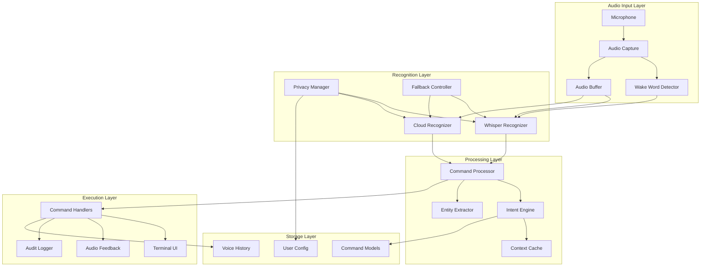
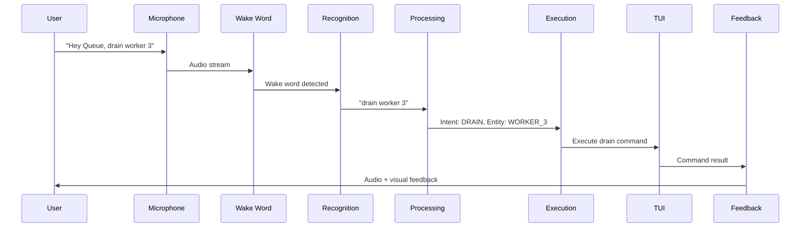
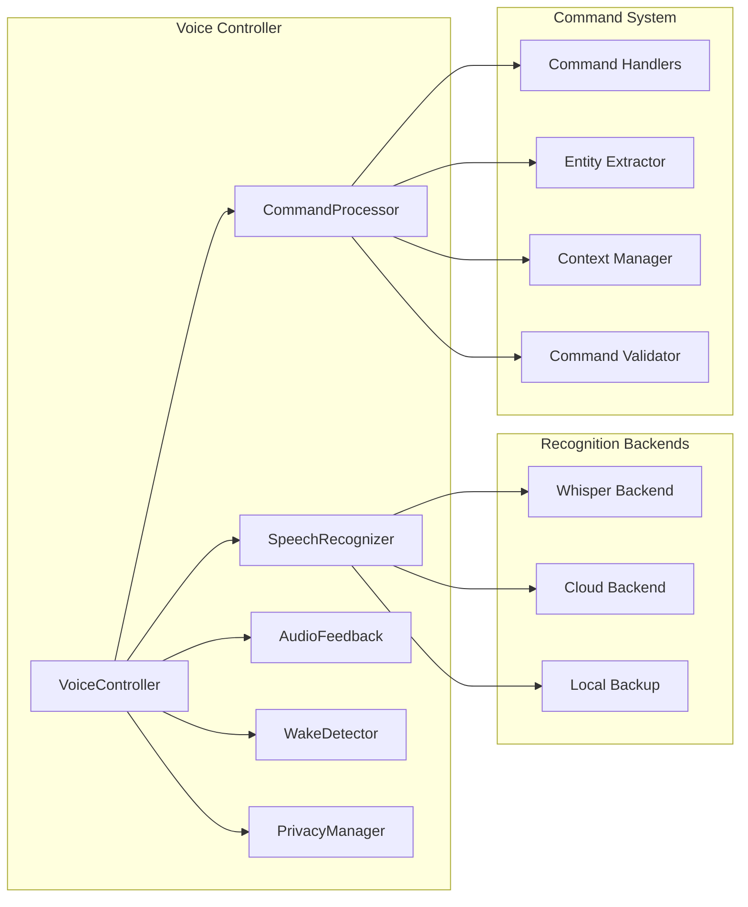

# F025: Terminal Voice Commands - Design Document

## Executive Summary

Terminal Voice Commands transforms queue management into a natural conversation, enabling hands-free operation through advanced speech recognition and intelligent command parsing. This system serves dual purposes: providing critical accessibility support for users with mobility impairments, and offering power users a faster way to execute complex operations during high-pressure situations like production incidents.

### Key Features
- **Local Speech Recognition**: Whisper.cpp for privacy-conscious environments
- **Natural Language Processing**: Intent recognition with fuzzy matching
- **Wake Word Detection**: "Hey Queue" activation with customizable phrases
- **Audio Feedback**: Text-to-speech responses and audio cues
- **Privacy-First Design**: Local processing with optional cloud backend
- **Accessibility Compliance**: Full WCAG 2.1 AA support

## System Architecture

### High-Level Architecture



### Voice Processing Pipeline



### Component Interaction



## Data Models

### Core Voice Structures

#### Voice Command
```json
{
  "id": "cmd-2025-09-14-001",
  "timestamp": "2025-09-14T19:30:00Z",
  "raw_text": "drain worker 3",
  "confidence": 0.94,
  "intent": "worker_control",
  "entities": [
    {
      "type": "worker_id",
      "value": "3",
      "start": 12,
      "end": 13,
      "confidence": 0.98
    }
  ],
  "execution_status": "completed",
  "response_time": "245ms",
  "backend_used": "whisper_local"
}
```

#### Recognition Result
```json
{
  "text": "show me the high priority queue",
  "confidence": 0.87,
  "timestamp": "2025-09-14T19:30:15Z",
  "language": "en-US",
  "processing_time": "312ms",
  "backend": "whisper",
  "audio_quality": {
    "snr": 15.2,
    "clarity": 0.91,
    "background_noise": "low"
  },
  "alternatives": [
    {
      "text": "show me the high priority cue",
      "confidence": 0.73
    }
  ]
}
```

#### Entity Definition
```json
{
  "worker_id": {
    "patterns": ["worker (\\d+)", "(\\d+)", "worker number (\\d+)"],
    "validation": "^[0-9]+$",
    "fuzzy_matching": false
  },
  "queue_name": {
    "patterns": ["(\\w+) queue", "queue (\\w+)", "(\\w+)"],
    "validation": "^[a-zA-Z_-]+$",
    "fuzzy_matching": true,
    "similarity_threshold": 0.8
  },
  "priority_level": {
    "patterns": ["(high|normal|low) priority", "(urgent|standard|background)"],
    "validation": "^(high|normal|low|urgent|standard|background)$",
    "normalization": {
      "urgent": "high",
      "standard": "normal",
      "background": "low"
    }
  }
}
```

### Command Grammar Definitions

#### Intent Patterns
```json
{
  "status_query": {
    "patterns": [
      "(?:show|display|tell) me (?:the )?(.+)",
      "(?:what|how many) (.+)",
      "(?:status|info|information) (?:of|for|about) (.+)"
    ],
    "required_entities": ["target"],
    "optional_entities": ["filter", "timeframe"],
    "examples": [
      "show me the high priority queue",
      "how many jobs are pending",
      "status of worker 3"
    ]
  },
  "worker_control": {
    "patterns": [
      "(?:drain|stop|pause|start|resume) (?:worker )?(.+)",
      "(?:shutdown|restart) (?:worker )?(.+)"
    ],
    "required_entities": ["worker_id"],
    "optional_entities": ["confirmation"],
    "examples": [
      "drain worker 3",
      "stop all workers",
      "pause worker number 5"
    ]
  },
  "queue_management": {
    "patterns": [
      "(?:requeue|retry) (?:all )?(?:failed|error) jobs",
      "(?:clear|delete|purge) (.+)",
      "(?:pause|resume|start|stop) (?:the )?(.+) queue"
    ],
    "required_entities": ["action"],
    "optional_entities": ["queue_name", "filter"],
    "examples": [
      "requeue all failed jobs",
      "clear completed jobs",
      "pause the high priority queue"
    ]
  }
}
```

### Configuration Schema

#### Voice Configuration
```json
{
  "voice": {
    "enabled": true,
    "wake_word": "hey queue",
    "custom_wake_words": ["queue assistant", "voice control"],
    "recognition": {
      "backend": "whisper_local",
      "fallback_backend": "cloud",
      "language": "en-US",
      "confidence_threshold": 0.7,
      "processing_timeout": "5s"
    },
    "audio": {
      "input_device": "default",
      "sample_rate": 16000,
      "channels": 1,
      "buffer_size": 1024,
      "noise_reduction": true
    },
    "feedback": {
      "enabled": true,
      "voice": "default",
      "speed": 1.0,
      "volume": 0.8,
      "confirmation_sounds": true,
      "error_sounds": true
    },
    "privacy": {
      "local_only": false,
      "record_audio": false,
      "log_commands": true,
      "sanitize_logs": true,
      "cloud_consent": false
    }
  }
}
```

## API Specification

### Voice Control Endpoints

#### Start Voice Session
- `POST /api/v1/voice/session/start`
- Start voice recognition session
- Returns session ID and status

#### Stop Voice Session
- `POST /api/v1/voice/session/stop`
- Stop current voice session
- Returns final session statistics

#### Voice Command
- `POST /api/v1/voice/command`
- Process single voice command
- Supports both streaming and batch processing

#### Voice Configuration
- `GET /api/v1/voice/config`
- Get current voice configuration
- `PUT /api/v1/voice/config` - Update voice settings

#### Voice Status
- `GET /api/v1/voice/status`
- Get voice system status and health

### Request/Response Models

```yaml
VoiceSession:
  type: object
  properties:
    session_id: {type: string, format: uuid}
    started_at: {type: string, format: date-time}
    status: {type: string, enum: [active, paused, stopped]}
    commands_processed: {type: integer}
    average_confidence: {type: number}
    backend_used: {type: string}

VoiceCommand:
  type: object
  properties:
    text: {type: string}
    confidence: {type: number, minimum: 0, maximum: 1}
    intent: {type: string}
    entities: {type: array, items: {$ref: '#/Entity'}}
    execution_result: {$ref: '#/CommandResult'}

Entity:
  type: object
  properties:
    type: {type: string}
    value: {type: string}
    start: {type: integer}
    end: {type: integer}
    confidence: {type: number}
    normalized_value: {type: string}

CommandResult:
  type: object
  properties:
    status: {type: string, enum: [success, error, pending]}
    message: {type: string}
    execution_time: {type: string, format: duration}
    side_effects: {type: array, items: {type: string}}
```

## Security Model

### Privacy Protection

#### Local-First Architecture
All voice processing happens locally by default to protect user privacy:

```go
type PrivacyManager struct {
    localOnly     bool
    recordAudio   bool
    logCommands   bool
    cloudConsent  bool
    sanitizer     DataSanitizer
}

func (p *PrivacyManager) ProcessVoiceInput(audio []byte) (*Recognition, error) {
    if p.localOnly {
        return p.localRecognizer.Process(audio)
    }

    if !p.cloudConsent {
        return nil, ErrCloudConsentRequired
    }

    return p.cloudRecognizer.Process(audio)
}
```

#### Data Sanitization
```go
type DataSanitizer struct {
    sensitivePatterns []SensitivePattern
}

func (s *DataSanitizer) SanitizeCommand(text string) string {
    sanitized := text

    // Remove potential passwords, tokens, API keys
    for _, pattern := range s.sensitivePatterns {
        sanitized = pattern.Regex.ReplaceAllString(sanitized, pattern.Replacement)
    }

    return sanitized
}
```

### Authentication and Authorization

#### Voice Session Security
- **Session Validation**: Voice sessions require valid user authentication
- **Command Authorization**: Each voice command checked against user permissions
- **Rate Limiting**: Maximum 100 commands per minute per user
- **Audit Logging**: All voice commands logged for security review

#### Permission Model
```yaml
voice_permissions:
  voice_user:
    - voice:start_session
    - voice:basic_commands
    - voice:status_queries

  voice_operator:
    - voice:*
    - voice:worker_control
    - voice:queue_management

  voice_admin:
    - voice:*
    - voice:system_control
    - voice:configuration
```

### Threat Model

#### Identified Threats
1. **Audio Eavesdropping**: Malicious capture of voice commands
   - Mitigation: Local processing, no persistent audio storage
2. **Command Injection**: Crafted audio to execute unauthorized commands
   - Mitigation: Intent validation, permission checking
3. **Privacy Invasion**: Recording sensitive conversations
   - Mitigation: Wake word activation, explicit recording controls
4. **Denial of Service**: Overwhelming system with voice requests
   - Mitigation: Rate limiting, session timeouts

#### Security Controls
```go
type SecurityManager struct {
    rateLimiter     RateLimiter
    permissionCheck PermissionChecker
    auditLogger     AuditLogger
    sessionManager  SessionManager
}

func (s *SecurityManager) ValidateVoiceCommand(cmd *VoiceCommand, user *User) error {
    // Check rate limits
    if !s.rateLimiter.Allow(user.ID) {
        return ErrRateLimitExceeded
    }

    // Validate permissions
    if !s.permissionCheck.HasPermission(user, cmd.Intent) {
        return ErrInsufficientPermissions
    }

    // Log for audit
    s.auditLogger.LogVoiceCommand(user, cmd)

    return nil
}
```

## Performance Requirements

### Recognition Performance
- **Local Recognition Latency**: < 500ms for Whisper-base model
- **Cloud Recognition Latency**: < 300ms plus network round-trip
- **Wake Word Detection**: < 50ms real-time processing
- **Command Processing**: < 100ms for intent recognition
- **End-to-End Response**: < 1 second from speech to action

### Resource Requirements
```yaml
whisper_local:
  cpu: 2 cores (during recognition)
  memory: 512MB (base model), 1.5GB (small model)
  disk: 150MB (base), 550MB (small)

wake_word_detector:
  cpu: 0.1 cores (continuous)
  memory: 50MB
  disk: 10MB

audio_processing:
  cpu: 0.2 cores (continuous)
  memory: 20MB
  disk: minimal
```

### Scalability Targets
- **Concurrent Sessions**: 50 simultaneous voice sessions
- **Command Throughput**: 1000 commands per minute system-wide
- **Recognition Accuracy**: >90% for common commands in quiet environment
- **Audio Quality**: Support 8kHz to 48kHz sample rates

### Performance Monitoring
```go
type VoiceMetrics struct {
    RecognitionLatency    histogram
    CommandAccuracy       gauge
    SessionsActive        gauge
    CommandsPerSecond     counter
    ErrorRate             gauge
    BackendUsage          counter
}

func (v *VoiceManager) RecordMetrics() {
    recognitionLatencyHist.Observe(v.lastRecognitionTime.Seconds())
    commandAccuracyGauge.Set(v.calculateAccuracy())
    activeSessionsGauge.Set(float64(v.activeSessions))
}
```

## Testing Strategy

### Unit Testing

#### Recognition Testing
```go
func TestWhisperRecognition(t *testing.T) {
    recognizer := NewWhisperRecognizer("models/whisper-base.bin")

    testCases := []struct {
        audioFile     string
        expectedText  string
        minConfidence float64
    }{
        {"test_data/drain_worker.wav", "drain worker 3", 0.8},
        {"test_data/queue_status.wav", "show me queue status", 0.8},
        {"test_data/requeue_jobs.wav", "requeue all failed jobs", 0.8},
    }

    for _, tc := range testCases {
        audio := loadAudioFile(tc.audioFile)
        result, err := recognizer.ProcessAudio(audio)

        assert.NoError(t, err)
        assert.GreaterOrEqual(t, result.Confidence, tc.minConfidence)
        assert.Contains(t, result.Text, tc.expectedText)
    }
}
```

#### Intent Recognition Testing
```go
func TestIntentRecognition(t *testing.T) {
    processor := NewCommandProcessor()

    testCases := []struct {
        input          string
        expectedIntent Intent
        expectedEntity string
    }{
        {"drain worker 3", IntentWorkerControl, "3"},
        {"show me the DLQ", IntentStatusQuery, "dlq"},
        {"requeue failed jobs", IntentQueueManagement, "failed"},
    }

    for _, tc := range testCases {
        cmd, err := processor.ParseCommand(tc.input)
        assert.NoError(t, err)
        assert.Equal(t, tc.expectedIntent, cmd.Intent)
    }
}
```

### Integration Testing

#### End-to-End Voice Flow
```go
func TestVoiceCommandFlow(t *testing.T) {
    // Setup test environment
    voiceManager := setupTestVoiceManager()
    tui := setupTestTUI()

    // Simulate voice input
    audioInput := loadTestAudio("drain_worker_3.wav")

    // Process through full pipeline
    recognition, err := voiceManager.ProcessAudio(audioInput)
    assert.NoError(t, err)

    cmd, err := voiceManager.ParseCommand(recognition.Text)
    assert.NoError(t, err)

    err = voiceManager.ExecuteCommand(cmd, tui)
    assert.NoError(t, err)

    // Verify worker was drained
    worker := tui.GetWorker(3)
    assert.Equal(t, "draining", worker.Status)
}
```

### Accessibility Testing

#### Screen Reader Compatibility
- Test with NVDA, JAWS, and VoiceOver
- Verify audio feedback doesn't interfere with screen readers
- Validate keyboard alternatives for all voice commands

#### Voice Quality Testing
```go
func TestAudioQualityHandling(t *testing.T) {
    testConditions := []struct {
        name       string
        audioFile  string
        noiseLevel string
        expectPass bool
    }{
        {"clear_audio", "clear_speech.wav", "none", true},
        {"background_noise", "speech_with_noise.wav", "moderate", true},
        {"heavy_distortion", "distorted_speech.wav", "heavy", false},
    }

    for _, tc := range testConditions {
        result := processAudioFile(tc.audioFile)
        if tc.expectPass {
            assert.GreaterOrEqual(t, result.Confidence, 0.7)
        }
    }
}
```

### Performance Testing

#### Recognition Latency
```go
func BenchmarkRecognitionLatency(b *testing.B) {
    recognizer := NewWhisperRecognizer("models/whisper-base.bin")
    audioSample := loadTestAudio("benchmark_sample.wav")

    b.ResetTimer()
    for i := 0; i < b.N; i++ {
        _, err := recognizer.ProcessAudio(audioSample)
        if err != nil {
            b.Fatal(err)
        }
    }
}
```

#### Concurrent Session Testing
```go
func TestConcurrentVoiceSessions(t *testing.T) {
    const numSessions = 50
    var wg sync.WaitGroup

    for i := 0; i < numSessions; i++ {
        wg.Add(1)
        go func(sessionID int) {
            defer wg.Done()

            session := startVoiceSession(sessionID)
            defer session.Close()

            // Simulate voice commands
            for j := 0; j < 10; j++ {
                cmd := generateTestCommand(j)
                err := session.ProcessCommand(cmd)
                assert.NoError(t, err)
            }
        }(i)
    }

    wg.Wait()
}
```

## Deployment Plan

### System Requirements

#### Hardware Requirements
```yaml
minimum_requirements:
  cpu: 2 cores
  memory: 2GB
  disk: 1GB (includes Whisper models)
  audio: Microphone input required

recommended_requirements:
  cpu: 4 cores
  memory: 4GB
  disk: 2GB
  audio: High-quality microphone with noise cancellation
```

#### Software Dependencies
```yaml
dependencies:
  whisper_cpp: ">=1.0.0"
  portaudio: ">=19.6.0"
  tensorflow_lite: ">=2.8.0" # For wake word detection
  opus: ">=1.3.0" # Audio codec

optional_dependencies:
  google_speech_api: "cloud backend"
  azure_speech_api: "cloud backend"
  piper_tts: "text-to-speech"
```

### Installation Process

#### Binary Distribution
```bash
# Download pre-built binary with models
curl -L https://releases.queue.io/voice-v1.0.0.tar.gz | tar xz

# Install system dependencies
sudo apt-get install portaudio19-dev opus-tools

# Run installation script
./install.sh --enable-voice --model-size=base

# Configure voice settings
queue config voice.enabled=true
queue config voice.wake_word="hey queue"
```

#### Container Deployment
```dockerfile
FROM ubuntu:22.04

# Install audio dependencies
RUN apt-get update && apt-get install -y \
    portaudio19-dev \
    opus-tools \
    pulseaudio \
    && rm -rf /var/lib/apt/lists/*

# Copy application and models
COPY queue-voice /usr/local/bin/
COPY models/ /opt/queue/models/

# Configure audio permissions
RUN usermod -a -G audio queue

EXPOSE 8080
CMD ["queue-voice", "--config=/etc/queue/voice.yaml"]
```

### Configuration Management

#### Voice Configuration File
```yaml
# /etc/queue/voice.yaml
voice:
  enabled: true

  recognition:
    backend: whisper_local
    model_path: /opt/queue/models/whisper-base.bin
    language: en-US
    confidence_threshold: 0.7

  wake_word:
    enabled: true
    phrase: "hey queue"
    model_path: /opt/queue/models/wake-word.tflite
    sensitivity: 0.8

  audio:
    input_device: default
    sample_rate: 16000
    channels: 1
    buffer_duration: 100ms

  feedback:
    tts_enabled: true
    voice: default
    confirmation_sounds: true

  privacy:
    local_only: true
    log_commands: true
    sanitize_logs: true
```

### Rollout Strategy

#### Phase 1: Core Recognition (Week 1)
- Deploy Whisper.cpp integration
- Basic command recognition for status queries
- Local-only processing
- Limited user testing with accessibility team

#### Phase 2: Full Command Set (Week 2-3)
- Complete command grammar implementation
- Worker control and queue management
- Audio feedback system
- Expanded user testing

#### Phase 3: Advanced Features (Week 4-5)
- Wake word detection
- Cloud backend integration
- Performance optimization
- Production readiness testing

#### Phase 4: General Availability (Week 6+)
- Full feature deployment
- Documentation and training
- Monitoring and alerting
- User feedback collection

### Monitoring and Observability

#### Key Metrics
```yaml
voice_metrics:
  - name: voice_recognition_latency_seconds
    type: histogram
    help: Time to process voice input
    buckets: [0.1, 0.25, 0.5, 1.0, 2.0, 5.0]

  - name: voice_command_accuracy_ratio
    type: gauge
    help: Recognition accuracy percentage

  - name: voice_sessions_active
    type: gauge
    help: Number of active voice sessions

  - name: voice_commands_total
    type: counter
    help: Total voice commands processed
    labels: [intent, status]

  - name: voice_errors_total
    type: counter
    help: Voice processing errors
    labels: [error_type, backend]
```

#### Health Checks
```go
func (v *VoiceManager) HealthCheck() *HealthStatus {
    status := &HealthStatus{
        Timestamp: time.Now(),
        Status:    "healthy",
    }

    // Check model availability
    if !v.recognizer.IsLoaded() {
        status.Status = "unhealthy"
        status.Issues = append(status.Issues, "Whisper model not loaded")
    }

    // Check audio device
    if !v.audio.IsAvailable() {
        status.Status = "degraded"
        status.Issues = append(status.Issues, "Audio input unavailable")
    }

    // Check recognition performance
    if v.metrics.AverageLatency() > 2*time.Second {
        status.Status = "degraded"
        status.Issues = append(status.Issues, "High recognition latency")
    }

    return status
}
```

This design document provides a comprehensive foundation for implementing Terminal Voice Commands, covering all aspects from speech recognition to deployment strategies while ensuring accessibility, privacy, and performance requirements are met.