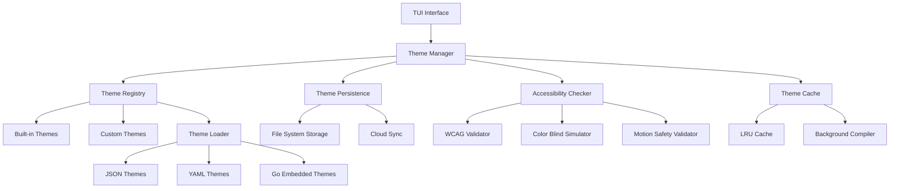
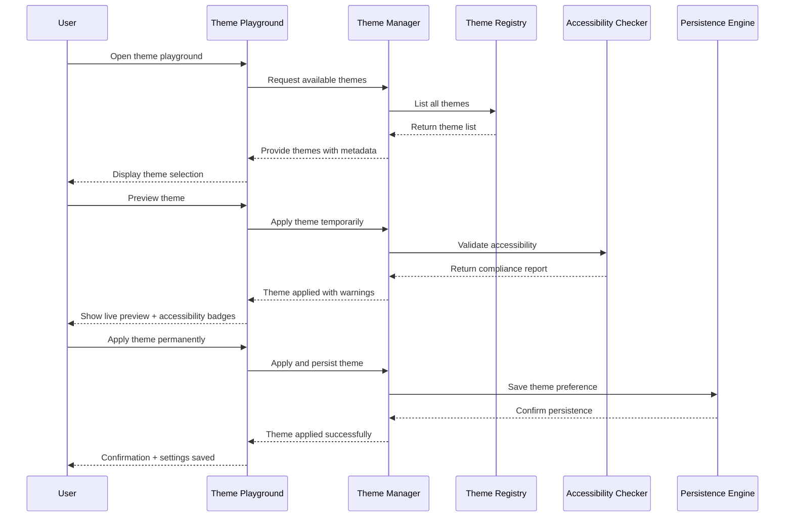

# Theme Playground Design Document
**Feature ID:** F026
**Version:** 1.0
**Last Updated:** 2024-01-15
**Author:** System Architect

## Executive Summary

The Theme Playground is a comprehensive theming system that transforms the visual customization experience from configuration file editing to an interactive, accessible, and delightful playground. This feature provides users with live theme previews, accessibility compliance checking, and persistent customization options while ensuring optimal readability across all terminal environments.

The system addresses three critical needs: visual customization for user preference, accessibility compliance for inclusive design, and maintainable styling architecture for development efficiency. By centralizing all visual styling through a theme registry and providing real-time preview capabilities, the Theme Playground elevates the user experience from functional to delightful.

### Key Benefits

- **Immediate Visual Feedback**: Live preview of theme changes across all components
- **Accessibility First**: Built-in WCAG compliance checking and high-contrast options
- **Persistent Preferences**: Seamless theme synchronization across sessions and devices
- **Developer Efficiency**: Centralized theme system simplifies style maintenance
- **User Empowerment**: Visual theme customization without configuration file editing

## System Architecture

### High-Level Architecture



### Component Interaction Flow



### Core Components

#### 1. Theme Manager

The central orchestrator that coordinates all theme-related operations:

```go
type ThemeManager struct {
    registry      *ThemeRegistry
    current       *Theme
    persistence   *ThemePersistence
    accessibility *AccessibilityChecker
    cache         *ThemeCache
    eventBus      *EventBus
    config        *ThemeConfig
}

type ThemeConfig struct {
    AutoDetectTerminal  bool `json:"auto_detect_terminal"`
    RespectNoColor      bool `json:"respect_no_color"`
    AccessibilityMode   bool `json:"accessibility_mode"`
    AnimationEnabled    bool `json:"animation_enabled"`
    CustomThemesDir     string `json:"custom_themes_dir"`
    SyncEnabled         bool `json:"sync_enabled"`
}
```

#### 2. Theme Registry

Manages the collection of available themes with lazy loading and validation:

```go
type ThemeRegistry struct {
    builtin     map[string]*Theme
    custom      map[string]*Theme
    collections map[string]*ThemeCollection
    loader      *ThemeLoader
    validator   *ThemeValidator
}

type ThemeCollection struct {
    Name        string   `json:"name"`
    Description string   `json:"description"`
    Themes      []string `json:"themes"`
    Category    ThemeCategory `json:"category"`
}

type ThemeCategory string

const (
    CategoryStandard      ThemeCategory = "standard"
    CategoryAccessibility ThemeCategory = "accessibility"
    CategorySpecialty     ThemeCategory = "specialty"
    CategoryCustom        ThemeCategory = "custom"
)
```

#### 3. Theme Structure

Comprehensive theme definition with semantic color mapping:

```go
type Theme struct {
    Metadata    ThemeMetadata    `json:"metadata"`
    Palette     ColorPalette     `json:"palette"`
    Components  ComponentStyles  `json:"components"`
    Typography  Typography       `json:"typography"`
    Animations  AnimationConfig  `json:"animations"`
    Accessibility AccessibilityInfo `json:"accessibility"`
}

type ThemeMetadata struct {
    Name        string    `json:"name"`
    Version     string    `json:"version"`
    Description string    `json:"description"`
    Author      string    `json:"author"`
    Category    ThemeCategory `json:"category"`
    CreatedAt   time.Time `json:"created_at"`
    UpdatedAt   time.Time `json:"updated_at"`
    BasedOn     string    `json:"based_on,omitempty"`
    Tags        []string  `json:"tags"`
}

type ColorPalette struct {
    // Base colors
    Background      Color `json:"background"`
    Surface         Color `json:"surface"`
    SurfaceVariant  Color `json:"surface_variant"`
    Primary         Color `json:"primary"`
    PrimaryVariant  Color `json:"primary_variant"`
    Secondary       Color `json:"secondary"`
    SecondaryVariant Color `json:"secondary_variant"`
    Accent          Color `json:"accent"`

    // Semantic colors
    Success         Color `json:"success"`
    Warning         Color `json:"warning"`
    Error           Color `json:"error"`
    Info            Color `json:"info"`

    // Text hierarchy
    TextPrimary     Color `json:"text_primary"`
    TextSecondary   Color `json:"text_secondary"`
    TextTertiary    Color `json:"text_tertiary"`
    TextDisabled    Color `json:"text_disabled"`
    TextInverse     Color `json:"text_inverse"`

    // Interactive elements
    Border          Color `json:"border"`
    BorderFocus     Color `json:"border_focus"`
    BorderError     Color `json:"border_error"`
    Divider         Color `json:"divider"`
    Shadow          Color `json:"shadow"`
    Overlay         Color `json:"overlay"`

    // Status colors
    StatusPending   Color `json:"status_pending"`
    StatusRunning   Color `json:"status_running"`
    StatusCompleted Color `json:"status_completed"`
    StatusFailed    Color `json:"status_failed"`
    StatusRetry     Color `json:"status_retry"`
}

type Color struct {
    Hex       string  `json:"hex"`
    RGB       RGB     `json:"rgb"`
    HSL       HSL     `json:"hsl"`
    Alpha     float64 `json:"alpha"`
    Adaptive  bool    `json:"adaptive"` // Adapts to terminal dark/light mode
}

type ComponentStyles struct {
    Button      ButtonStyles    `json:"button"`
    Input       InputStyles     `json:"input"`
    Table       TableStyles     `json:"table"`
    Card        CardStyles      `json:"card"`
    Modal       ModalStyles     `json:"modal"`
    Navigation  NavStyles       `json:"navigation"`
    Status      StatusStyles    `json:"status"`
    Chart       ChartStyles     `json:"chart"`
}
```

### Theme Playground Interface

#### 1. Main Playground View

The theme playground provides an immersive theme customization experience:

**Layout Structure:**
- **Left Panel (30%)**: Theme browser and customization controls
- **Right Panel (70%)**: Live preview area with all component examples
- **Bottom Bar**: Quick actions and accessibility status

**Theme Browser Features:**
- Category-based theme organization
- Search and filter capabilities
- Thumbnail previews
- Accessibility compliance badges
- User rating and popularity indicators

#### 2. Live Preview System

The preview system shows real component examples rather than abstract swatches:

**Preview Components:**
- **Queue Dashboard**: Job tables, metrics, filters
- **Worker Status**: Worker cards, health indicators, performance charts
- **Settings Interface**: Forms, buttons, modals, navigation
- **DLQ Management**: Error displays, bulk actions, confirmations
- **Admin Console**: User management, system settings, logs

**Preview Features:**
- **Real Data**: Uses actual queue data for realistic previews
- **Interactive Elements**: Buttons, inputs, and controls are functional
- **Responsive Layout**: Adapts to different terminal sizes
- **Component Isolation**: Individual component focus mode
- **Before/After Comparison**: Side-by-side theme comparison

#### 3. Accessibility Validation

Comprehensive accessibility checking integrated into the theme system:

```go
type AccessibilityChecker struct {
    wcagValidator     *WCAGValidator
    colorBlindSim     *ColorBlindnessSimulator
    motionValidator   *MotionSafetyValidator
    contrastAnalyzer  *ContrastAnalyzer
}

type AccessibilityReport struct {
    ThemeName       string              `json:"theme_name"`
    OverallScore    float64             `json:"overall_score"`
    WCAGLevel       WCAGLevel           `json:"wcag_level"`
    ColorBlindSafe  bool                `json:"color_blind_safe"`
    MotionSafe      bool                `json:"motion_safe"`
    ContrastTests   []ContrastTest      `json:"contrast_tests"`
    Recommendations []Recommendation    `json:"recommendations"`
    Warnings        []AccessibilityWarning `json:"warnings"`
}

type ContrastTest struct {
    Name            string  `json:"name"`
    Foreground      Color   `json:"foreground"`
    Background      Color   `json:"background"`
    Ratio           float64 `json:"ratio"`
    RequiredRatio   float64 `json:"required_ratio"`
    Passed          bool    `json:"passed"`
    Level           WCAGLevel `json:"level"`
    Critical        bool    `json:"critical"`
}

type WCAGLevel string

const (
    WCAGLevelA   WCAGLevel = "A"
    WCAGLevelAA  WCAGLevel = "AA"
    WCAGLevelAAA WCAGLevel = "AAA"
    WCAGLevelFail WCAGLevel = "FAIL"
)
```

### Persistence and Synchronization

#### 1. Local Storage Architecture

Theme preferences are stored in a structured, versioned format:

**Storage Location:**
- Linux/macOS: `$XDG_CONFIG_HOME/go-redis-wq/themes/`
- Windows: `%APPDATA%/go-redis-wq/themes/`
- Fallback: `~/.go-redis-wq/themes/`

**File Structure:**
```
themes/
├── config.json          # Theme preferences and settings
├── custom/              # User-created themes
│   ├── my-theme.json
│   └── work-theme.json
├── imports/             # Imported themes
│   └── community-theme.json
└── cache/              # Compiled theme cache
    ├── tokyo-night.cache
    └── github.cache
```

#### 2. Configuration Schema

```json
{
  "version": "1.0",
  "active_theme": "tokyo-night",
  "preferences": {
    "auto_detect_terminal": true,
    "respect_no_color": true,
    "sync_enabled": false,
    "accessibility_mode": false,
    "animation_enabled": true,
    "preview_mode": "live"
  },
  "accessibility": {
    "min_contrast_ratio": 4.5,
    "color_blind_mode": "none",
    "motion_reduced": false,
    "high_contrast": false
  },
  "custom_themes": {
    "my-theme": {
      "path": "custom/my-theme.json",
      "created_at": "2024-01-15T10:30:00Z",
      "last_used": "2024-01-15T14:20:00Z",
      "use_count": 15
    }
  },
  "theme_history": [
    {
      "theme": "github",
      "applied_at": "2024-01-15T09:15:00Z",
      "duration": "1h23m45s",
      "context": "morning_work"
    }
  ],
  "sync": {
    "provider": "git",
    "repository": "https://github.com/user/dotfiles.git",
    "path": "go-redis-wq/themes",
    "auto_sync": false,
    "last_sync": "2024-01-15T08:00:00Z"
  }
}
```

#### 3. Synchronization Options

**Git-based Synchronization:**
- Integrate with existing dotfiles repositories
- Automatic commit and push of theme changes
- Conflict resolution for concurrent modifications
- Branch-based environment themes (dev/staging/prod)

**Cloud Synchronization:**
- Integration with popular cloud storage services
- Encrypted theme data transmission
- Offline-first with sync when available
- Team sharing capabilities

### Performance Optimization

#### 1. Theme Compilation and Caching

```go
type ThemeCache struct {
    compiled    *lru.Cache  // Compiled Lip Gloss styles
    themes      *lru.Cache  // Parsed theme objects
    backgrounds *lru.Cache  // Background compilation
    mutex       sync.RWMutex
    stats       *CacheStats
}

type CacheStats struct {
    Hits              int64 `json:"hits"`
    Misses            int64 `json:"misses"`
    Compilations      int64 `json:"compilations"`
    EvictedEntries    int64 `json:"evicted_entries"`
    AverageHitTime    time.Duration `json:"average_hit_time"`
    AverageCompileTime time.Duration `json:"average_compile_time"`
}

func (tc *ThemeCache) GetCompiledStyle(themeKey, styleKey string) (*lipgloss.Style, bool) {
    key := fmt.Sprintf("%s:%s", themeKey, styleKey)

    tc.mutex.RLock()
    defer tc.mutex.RUnlock()

    start := time.Now()
    defer func() {
        tc.stats.AverageHitTime =
            (tc.stats.AverageHitTime + time.Since(start)) / 2
    }()

    if style, ok := tc.compiled.Get(key); ok {
        tc.stats.Hits++
        return style.(*lipgloss.Style), true
    }

    tc.stats.Misses++
    return nil, false
}
```

#### 2. Lazy Loading Strategy

- **On-Demand Loading**: Load theme data only when accessed
- **Progressive Loading**: Load theme metadata first, full definition on selection
- **Background Prefetch**: Preload popular themes in background
- **Memory Management**: Unload unused themes based on LRU policy

#### 3. Rendering Performance

- **Virtual Scrolling**: Handle large theme lists efficiently
- **Incremental Updates**: Update only changed style properties
- **Batched Operations**: Group multiple style changes
- **Frame Rate Budget**: Maintain 60fps for animations

### Security Considerations

#### 1. Theme Validation

```go
type ThemeValidator struct {
    maxFileSize    int64
    allowedPaths   []string
    sanitizer      *HTMLSanitizer
    scanner        *SecurityScanner
}

func (tv *ThemeValidator) ValidateTheme(theme *Theme) error {
    // Validate theme structure
    if err := tv.validateStructure(theme); err != nil {
        return fmt.Errorf("invalid theme structure: %w", err)
    }

    // Sanitize user inputs
    if err := tv.sanitizeContent(theme); err != nil {
        return fmt.Errorf("theme content sanitization failed: %w", err)
    }

    // Check for malicious content
    if err := tv.scanForThreats(theme); err != nil {
        return fmt.Errorf("security threat detected: %w", err)
    }

    return nil
}
```

#### 2. Sandboxing

- **Isolated Execution**: Theme rendering in isolated context
- **Resource Limits**: Prevent resource exhaustion attacks
- **Path Restrictions**: Limit file system access
- **Input Sanitization**: Clean all user-provided theme data

#### 3. Access Control

- **User Themes**: Per-user theme storage and access
- **Team Themes**: Shared themes with permission management
- **System Themes**: Protected built-in themes
- **Admin Controls**: Administrative theme management

### Integration Points

#### 1. Lip Gloss Integration

Replace direct color usage with theme-aware style builders:

```go
// Theme-aware style builder
type StyleBuilder struct {
    theme     *Theme
    component string
    variant   string
    state     string
}

func (sb *StyleBuilder) Component(name string) *StyleBuilder {
    sb.component = name
    return sb
}

func (sb *StyleBuilder) Variant(variant string) *StyleBuilder {
    sb.variant = variant
    return sb
}

func (sb *StyleBuilder) State(state string) *StyleBuilder {
    sb.state = state
    return sb
}

func (sb *StyleBuilder) Build() lipgloss.Style {
    styleKey := fmt.Sprintf("%s.%s.%s", sb.component, sb.variant, sb.state)

    if cached, ok := themeCache.GetCompiledStyle(sb.theme.Name, styleKey); ok {
        return *cached
    }

    style := sb.buildFromTheme()
    themeCache.SetCompiledStyle(sb.theme.Name, styleKey, &style)
    return style
}

// Usage examples
buttonStyle := theme.Style().Component("button").Variant("primary").Build()
errorStyle := theme.Style().Component("text").Variant("error").Build()
cardStyle := theme.Style().Component("card").Variant("elevated").Build()
```

#### 2. Configuration System

Seamless integration with existing configuration:

```yaml
# config.yaml
app:
  theme:
    active: "tokyo-night"
    auto_detect: true
    accessibility_mode: false
    sync_enabled: true
    custom_themes_dir: "~/.go-redis-wq/themes"

ui:
  animations_enabled: true
  motion_reduced: false
  high_contrast: false

accessibility:
  min_contrast_ratio: 4.5
  color_blind_assistance: false
  screen_reader_support: true
```

#### 3. Event System

Theme changes trigger events for component updates:

```go
type ThemeEvent struct {
    Type      ThemeEventType `json:"type"`
    Theme     string         `json:"theme"`
    Previous  string         `json:"previous,omitempty"`
    Timestamp time.Time      `json:"timestamp"`
    User      string         `json:"user,omitempty"`
}

type ThemeEventType string

const (
    ThemeApplied    ThemeEventType = "theme_applied"
    ThemeCreated    ThemeEventType = "theme_created"
    ThemeModified   ThemeEventType = "theme_modified"
    ThemeDeleted    ThemeEventType = "theme_deleted"
    ThemeImported   ThemeEventType = "theme_imported"
    ThemeExported   ThemeEventType = "theme_exported"
)

// Event handlers
func (tm *ThemeManager) onThemeApplied(event ThemeEvent) {
    // Notify all UI components to refresh styles
    tm.eventBus.Publish("ui.style_update", event)

    // Log theme usage for analytics
    tm.analytics.RecordThemeUsage(event.Theme)

    // Trigger accessibility validation if enabled
    if tm.config.AccessibilityMode {
        go tm.validateAccessibility(event.Theme)
    }
}
```

## API Specification

### Core Theme Management Endpoints

#### GET /api/v1/themes
Get list of available themes with metadata.

**Query Parameters:**
- `category` (optional): Filter by theme category
- `accessibility` (optional): Filter accessibility-compliant themes
- `search` (optional): Search themes by name or tags
- `limit` (optional): Number of themes to return (default: 50)
- `offset` (optional): Pagination offset

**Response:**
```json
{
  "themes": [
    {
      "name": "tokyo-night",
      "metadata": {
        "description": "Dark theme with purple accents",
        "category": "standard",
        "author": "Theme Team",
        "tags": ["dark", "purple", "popular"],
        "accessibility": {
          "wcag_level": "AA",
          "color_blind_safe": true,
          "contrast_ratio": 7.2
        }
      }
    }
  ],
  "total": 25,
  "categories": ["standard", "accessibility", "specialty", "custom"]
}
```

#### GET /api/v1/themes/{name}
Get detailed theme definition.

**Response:**
```json
{
  "theme": {
    "metadata": { /* theme metadata */ },
    "palette": { /* color palette */ },
    "components": { /* component styles */ },
    "accessibility": { /* accessibility info */ }
  }
}
```

#### POST /api/v1/themes
Create a new custom theme.

**Request Body:**
```json
{
  "name": "my-custom-theme",
  "based_on": "tokyo-night",
  "modifications": {
    "palette.accent": "#ff6b9d",
    "palette.primary": "#4ecdc4"
  },
  "metadata": {
    "description": "My personalized theme",
    "tags": ["custom", "personal"]
  }
}
```

#### PUT /api/v1/themes/{name}
Update an existing custom theme.

#### DELETE /api/v1/themes/{name}
Delete a custom theme.

### Theme Application Endpoints

#### POST /api/v1/themes/{name}/apply
Apply a theme to the current session.

**Request Body:**
```json
{
  "persist": true,
  "validate_accessibility": false
}
```

**Response:**
```json
{
  "applied": true,
  "theme": "tokyo-night",
  "accessibility_report": {
    "wcag_level": "AA",
    "warnings": [],
    "recommendations": []
  }
}
```

#### GET /api/v1/themes/current
Get currently applied theme information.

#### POST /api/v1/themes/{name}/preview
Temporarily preview a theme without applying.

### Accessibility Endpoints

#### POST /api/v1/themes/{name}/validate
Validate theme accessibility compliance.

**Response:**
```json
{
  "accessibility_report": {
    "theme_name": "tokyo-night",
    "overall_score": 8.5,
    "wcag_level": "AA",
    "color_blind_safe": true,
    "motion_safe": true,
    "contrast_tests": [
      {
        "name": "Primary text on background",
        "ratio": 7.2,
        "required_ratio": 4.5,
        "passed": true,
        "level": "AAA"
      }
    ],
    "warnings": [],
    "recommendations": [
      "Consider increasing accent color contrast for better AAA compliance"
    ]
  }
}
```

#### GET /api/v1/accessibility/requirements
Get accessibility requirements and guidelines.

### Theme Import/Export Endpoints

#### POST /api/v1/themes/import
Import theme from external source.

**Request Body:**
```json
{
  "source": "url", // "url", "file", "json"
  "data": "https://themes.example.com/tokyo-night.json",
  "validate": true
}
```

#### GET /api/v1/themes/{name}/export
Export theme in various formats.

**Query Parameters:**
- `format`: "json", "yaml", "css", "lipgloss"

### User Preferences Endpoints

#### GET /api/v1/user/theme-preferences
Get user's theme preferences and settings.

#### PUT /api/v1/user/theme-preferences
Update user's theme preferences.

**Request Body:**
```json
{
  "active_theme": "tokyo-night",
  "auto_detect_terminal": true,
  "accessibility_mode": false,
  "animation_enabled": true,
  "sync_enabled": true,
  "preferences": {
    "favorite_themes": ["tokyo-night", "github"],
    "recently_used": ["solarized-dark", "one-dark"],
    "custom_settings": {
      "accent_preference": "purple",
      "contrast_level": "standard"
    }
  }
}
```

## Data Models

### Core Theme Schema

```json
{
  "$schema": "http://json-schema.org/draft-07/schema#",
  "title": "Theme",
  "type": "object",
  "required": ["metadata", "palette", "components"],
  "properties": {
    "metadata": {
      "$ref": "#/definitions/ThemeMetadata"
    },
    "palette": {
      "$ref": "#/definitions/ColorPalette"
    },
    "components": {
      "$ref": "#/definitions/ComponentStyles"
    },
    "typography": {
      "$ref": "#/definitions/Typography"
    },
    "animations": {
      "$ref": "#/definitions/AnimationConfig"
    },
    "accessibility": {
      "$ref": "#/definitions/AccessibilityInfo"
    }
  },
  "definitions": {
    "ThemeMetadata": {
      "type": "object",
      "required": ["name", "version", "category"],
      "properties": {
        "name": {
          "type": "string",
          "pattern": "^[a-z0-9-]+$",
          "minLength": 1,
          "maxLength": 50
        },
        "version": {
          "type": "string",
          "pattern": "^\\d+\\.\\d+\\.\\d+$"
        },
        "description": {
          "type": "string",
          "maxLength": 200
        },
        "author": {
          "type": "string",
          "maxLength": 100
        },
        "category": {
          "type": "string",
          "enum": ["standard", "accessibility", "specialty", "custom"]
        },
        "created_at": {
          "type": "string",
          "format": "date-time"
        },
        "updated_at": {
          "type": "string",
          "format": "date-time"
        },
        "based_on": {
          "type": "string"
        },
        "tags": {
          "type": "array",
          "items": {
            "type": "string",
            "pattern": "^[a-z0-9-]+$"
          },
          "maxItems": 10
        }
      }
    },
    "ColorPalette": {
      "type": "object",
      "required": [
        "background", "surface", "primary", "secondary", "accent",
        "success", "warning", "error", "info",
        "text_primary", "text_secondary", "border"
      ],
      "properties": {
        "background": { "$ref": "#/definitions/Color" },
        "surface": { "$ref": "#/definitions/Color" },
        "surface_variant": { "$ref": "#/definitions/Color" },
        "primary": { "$ref": "#/definitions/Color" },
        "primary_variant": { "$ref": "#/definitions/Color" },
        "secondary": { "$ref": "#/definitions/Color" },
        "secondary_variant": { "$ref": "#/definitions/Color" },
        "accent": { "$ref": "#/definitions/Color" },
        "success": { "$ref": "#/definitions/Color" },
        "warning": { "$ref": "#/definitions/Color" },
        "error": { "$ref": "#/definitions/Color" },
        "info": { "$ref": "#/definitions/Color" },
        "text_primary": { "$ref": "#/definitions/Color" },
        "text_secondary": { "$ref": "#/definitions/Color" },
        "text_tertiary": { "$ref": "#/definitions/Color" },
        "text_disabled": { "$ref": "#/definitions/Color" },
        "text_inverse": { "$ref": "#/definitions/Color" },
        "border": { "$ref": "#/definitions/Color" },
        "border_focus": { "$ref": "#/definitions/Color" },
        "border_error": { "$ref": "#/definitions/Color" },
        "divider": { "$ref": "#/definitions/Color" },
        "shadow": { "$ref": "#/definitions/Color" },
        "overlay": { "$ref": "#/definitions/Color" },
        "status_pending": { "$ref": "#/definitions/Color" },
        "status_running": { "$ref": "#/definitions/Color" },
        "status_completed": { "$ref": "#/definitions/Color" },
        "status_failed": { "$ref": "#/definitions/Color" },
        "status_retry": { "$ref": "#/definitions/Color" }
      }
    },
    "Color": {
      "type": "object",
      "required": ["hex"],
      "properties": {
        "hex": {
          "type": "string",
          "pattern": "^#[0-9A-Fa-f]{6}$"
        },
        "rgb": {
          "type": "object",
          "properties": {
            "r": { "type": "integer", "minimum": 0, "maximum": 255 },
            "g": { "type": "integer", "minimum": 0, "maximum": 255 },
            "b": { "type": "integer", "minimum": 0, "maximum": 255 }
          },
          "required": ["r", "g", "b"]
        },
        "hsl": {
          "type": "object",
          "properties": {
            "h": { "type": "number", "minimum": 0, "maximum": 360 },
            "s": { "type": "number", "minimum": 0, "maximum": 100 },
            "l": { "type": "number", "minimum": 0, "maximum": 100 }
          },
          "required": ["h", "s", "l"]
        },
        "alpha": {
          "type": "number",
          "minimum": 0,
          "maximum": 1
        },
        "adaptive": {
          "type": "boolean"
        }
      }
    }
  }
}
```

### User Preferences Schema

```json
{
  "$schema": "http://json-schema.org/draft-07/schema#",
  "title": "UserThemePreferences",
  "type": "object",
  "properties": {
    "version": {
      "type": "string",
      "pattern": "^\\d+\\.\\d+$"
    },
    "active_theme": {
      "type": "string"
    },
    "preferences": {
      "type": "object",
      "properties": {
        "auto_detect_terminal": { "type": "boolean" },
        "respect_no_color": { "type": "boolean" },
        "sync_enabled": { "type": "boolean" },
        "accessibility_mode": { "type": "boolean" },
        "animation_enabled": { "type": "boolean" },
        "preview_mode": {
          "type": "string",
          "enum": ["live", "static", "minimal"]
        }
      }
    },
    "accessibility": {
      "type": "object",
      "properties": {
        "min_contrast_ratio": {
          "type": "number",
          "minimum": 1,
          "maximum": 21
        },
        "color_blind_mode": {
          "type": "string",
          "enum": ["none", "deuteranopia", "protanopia", "tritanopia"]
        },
        "motion_reduced": { "type": "boolean" },
        "high_contrast": { "type": "boolean" }
      }
    }
  }
}
```

## Security Model

### Threat Analysis

#### 1. Theme Injection Attacks

**Threat**: Malicious themes containing harmful content or code
**Mitigation**:
- Comprehensive input validation and sanitization
- Sandboxed theme execution environment
- Digital signature verification for imported themes
- Content Security Policy enforcement

#### 2. Resource Exhaustion

**Threat**: Themes designed to consume excessive memory or CPU
**Mitigation**:
- Resource limits on theme compilation and rendering
- Timeout mechanisms for theme operations
- Memory usage monitoring and alerts
- Circuit breakers for problematic themes

#### 3. Data Exfiltration

**Threat**: Themes attempting to access or transmit sensitive data
**Mitigation**:
- Isolated execution context for theme rendering
- Network access restrictions for theme operations
- Audit logging of all theme-related file system access
- Permission-based access control

#### 4. Configuration Tampering

**Threat**: Unauthorized modification of theme preferences or system themes
**Mitigation**:
- File system permissions and access controls
- Integrity checking for system themes
- User authentication for preference modifications
- Backup and recovery mechanisms

### Security Controls

#### 1. Input Validation

```go
type ThemeSecurityValidator struct {
    maxThemeSize     int64
    allowedMimeTypes []string
    contentScanner   *SecurityScanner
    pathValidator    *PathValidator
}

func (tsv *ThemeSecurityValidator) ValidateThemeUpload(data []byte, filename string) error {
    // Size validation
    if int64(len(data)) > tsv.maxThemeSize {
        return fmt.Errorf("theme file too large: %d bytes (max: %d)",
                         len(data), tsv.maxThemeSize)
    }

    // MIME type validation
    mimeType := http.DetectContentType(data)
    if !tsv.isAllowedMimeType(mimeType) {
        return fmt.Errorf("invalid file type: %s", mimeType)
    }

    // Content scanning
    if threats := tsv.contentScanner.ScanContent(data); len(threats) > 0 {
        return fmt.Errorf("security threats detected: %v", threats)
    }

    // Path validation
    if !tsv.pathValidator.IsValidThemePath(filename) {
        return fmt.Errorf("invalid theme filename: %s", filename)
    }

    return nil
}
```

#### 2. Access Control Matrix

| Operation | User | Admin | System |
|-----------|------|-------|---------|
| View built-in themes | ✓ | ✓ | ✓ |
| Apply themes | ✓ | ✓ | ✓ |
| Create custom themes | ✓ | ✓ | ✓ |
| Modify custom themes | ✓* | ✓ | ✓ |
| Delete custom themes | ✓* | ✓ | ✓ |
| Modify system themes | ✗ | ✓ | ✓ |
| Import themes | ✓ | ✓ | ✓ |
| Export themes | ✓ | ✓ | ✓ |
| Access theme analytics | ✗ | ✓ | ✓ |
| Manage user preferences | ✓ | ✓ | ✓ |

*Own themes only

#### 3. Audit Logging

```go
type ThemeAuditLogger struct {
    logger    *logrus.Logger
    formatter *AuditFormatter
}

type ThemeAuditEvent struct {
    Timestamp   time.Time `json:"timestamp"`
    User        string    `json:"user"`
    Action      string    `json:"action"`
    Resource    string    `json:"resource"`
    Success     bool      `json:"success"`
    Error       string    `json:"error,omitempty"`
    Metadata    map[string]interface{} `json:"metadata"`
    IPAddress   string    `json:"ip_address"`
    UserAgent   string    `json:"user_agent"`
}

func (tal *ThemeAuditLogger) LogThemeAction(user, action, resource string,
                                           success bool, metadata map[string]interface{}) {
    event := ThemeAuditEvent{
        Timestamp: time.Now(),
        User:      user,
        Action:    action,
        Resource:  resource,
        Success:   success,
        Metadata:  metadata,
    }

    tal.logger.WithFields(logrus.Fields{
        "audit_type": "theme_action",
        "event":      event,
    }).Info("Theme audit event")
}
```

## Performance Requirements

### Response Time Requirements

| Operation | Target | Maximum |
|-----------|---------|---------|
| Theme list loading | < 100ms | < 500ms |
| Theme preview | < 50ms | < 200ms |
| Theme application | < 200ms | < 1s |
| Accessibility validation | < 500ms | < 2s |
| Theme compilation | < 1s | < 5s |
| Theme export | < 2s | < 10s |

### Throughput Requirements

- **Concurrent Users**: Support 100 concurrent theme operations
- **Theme Storage**: Handle 1000+ custom themes per user
- **Cache Performance**: 95% cache hit rate for compiled themes
- **Memory Usage**: < 50MB for theme system components

### Scalability Targets

- **Theme Registry**: Scale to 10,000+ themes
- **User Preferences**: Support 100,000+ user configurations
- **Synchronization**: Handle 1,000+ sync operations per minute
- **Analytics**: Process 10,000+ theme events per hour

### Performance Monitoring

```go
type ThemePerformanceMetrics struct {
    ThemeLoadTime      prometheus.Histogram
    ThemeApplyTime     prometheus.Histogram
    CacheHitRate       prometheus.Gauge
    MemoryUsage        prometheus.Gauge
    ActiveThemes       prometheus.Gauge
    ValidationTime     prometheus.Histogram
    SyncOperations     prometheus.Counter
    ErrorRate          prometheus.Counter
}

func (tpm *ThemePerformanceMetrics) RecordThemeLoadTime(duration time.Duration) {
    tpm.ThemeLoadTime.Observe(duration.Seconds())
}

func (tpm *ThemePerformanceMetrics) UpdateCacheHitRate(hits, misses int64) {
    total := hits + misses
    if total > 0 {
        rate := float64(hits) / float64(total)
        tpm.CacheHitRate.Set(rate)
    }
}
```

## Testing Strategy

### Unit Testing

#### 1. Theme Manager Tests

```go
func TestThemeManager_ApplyTheme(t *testing.T) {
    tests := []struct {
        name      string
        themeName string
        want      error
    }{
        {
            name:      "apply valid theme",
            themeName: "tokyo-night",
            want:      nil,
        },
        {
            name:      "apply non-existent theme",
            themeName: "non-existent",
            want:      ErrThemeNotFound,
        },
        {
            name:      "apply invalid theme name",
            themeName: "",
            want:      ErrInvalidThemeName,
        },
    }

    for _, tt := range tests {
        t.Run(tt.name, func(t *testing.T) {
            tm := NewTestThemeManager()
            err := tm.ApplyTheme(tt.themeName)

            if !errors.Is(err, tt.want) {
                t.Errorf("ApplyTheme() error = %v, want %v", err, tt.want)
            }
        })
    }
}
```

#### 2. Accessibility Validator Tests

```go
func TestAccessibilityChecker_ValidateContrastRatio(t *testing.T) {
    checker := NewAccessibilityChecker()

    tests := []struct {
        name       string
        foreground Color
        background Color
        wantRatio  float64
        wantLevel  WCAGLevel
    }{
        {
            name:       "high contrast black on white",
            foreground: Color{Hex: "#000000"},
            background: Color{Hex: "#FFFFFF"},
            wantRatio:  21.0,
            wantLevel:  WCAGLevelAAA,
        },
        {
            name:       "low contrast gray on gray",
            foreground: Color{Hex: "#808080"},
            background: Color{Hex: "#C0C0C0"},
            wantRatio:  2.0,
            wantLevel:  WCAGLevelFail,
        },
    }

    for _, tt := range tests {
        t.Run(tt.name, func(t *testing.T) {
            ratio := checker.CalculateContrastRatio(tt.foreground, tt.background)
            level := checker.GetWCAGLevel(ratio)

            if math.Abs(ratio-tt.wantRatio) > 0.1 {
                t.Errorf("contrast ratio = %v, want %v", ratio, tt.wantRatio)
            }

            if level != tt.wantLevel {
                t.Errorf("WCAG level = %v, want %v", level, tt.wantLevel)
            }
        })
    }
}
```

### Integration Testing

#### 1. End-to-End Theme Application

```go
func TestE2E_ThemePlayground(t *testing.T) {
    // Setup test environment
    testApp := setupTestApp(t)
    defer testApp.Cleanup()

    // Navigate to theme playground
    screen := testApp.SendKey(tcell.KeyCtrlT)

    // Verify theme list is displayed
    assert.Contains(t, screen.String(), "tokyo-night")
    assert.Contains(t, screen.String(), "github")
    assert.Contains(t, screen.String(), "high-contrast")

    // Select a theme
    testApp.SendKey(tcell.KeyDown)
    testApp.SendKey(tcell.KeyEnter)

    // Verify theme is applied
    screen = testApp.GetScreen()
    assert.Contains(t, screen.String(), "Theme applied: tokyo-night")

    // Verify persistence
    testApp.Restart()
    screen = testApp.GetScreen()

    // Theme should still be applied after restart
    assert.Contains(t, screen.String(), "Current theme: tokyo-night")
}
```

#### 2. Accessibility Compliance Testing

```go
func TestAccessibilityCompliance(t *testing.T) {
    themes := []string{"tokyo-night", "github", "high-contrast-dark"}

    for _, themeName := range themes {
        t.Run(themeName, func(t *testing.T) {
            theme := loadTheme(themeName)
            report := validateAccessibility(theme)

            // All themes must meet AA standards
            assert.GreaterOrEqual(t, report.OverallScore, 7.0)
            assert.True(t, report.WCAGLevel >= WCAGLevelAA)

            // Critical color combinations must pass
            for _, test := range report.ContrastTests {
                if test.Critical {
                    assert.True(t, test.Passed,
                        "Critical contrast test failed: %s", test.Name)
                }
            }
        })
    }
}
```

### Performance Testing

#### 1. Load Testing

```go
func BenchmarkThemeApplication(b *testing.B) {
    tm := NewThemeManager()

    b.ResetTimer()
    for i := 0; i < b.N; i++ {
        err := tm.ApplyTheme("tokyo-night")
        if err != nil {
            b.Fatal(err)
        }
    }
}

func BenchmarkThemeCompilation(b *testing.B) {
    theme := loadTheme("tokyo-night")
    compiler := NewThemeCompiler()

    b.ResetTimer()
    for i := 0; i < b.N; i++ {
        _, err := compiler.CompileTheme(theme)
        if err != nil {
            b.Fatal(err)
        }
    }
}
```

#### 2. Memory Usage Testing

```go
func TestMemoryUsage(t *testing.T) {
    var m1, m2 runtime.MemStats
    runtime.GC()
    runtime.ReadMemStats(&m1)

    // Load and apply multiple themes
    tm := NewThemeManager()
    for i := 0; i < 100; i++ {
        tm.ApplyTheme("tokyo-night")
        tm.ApplyTheme("github")
        tm.ApplyTheme("high-contrast")
    }

    runtime.GC()
    runtime.ReadMemStats(&m2)

    memoryIncrease := m2.Alloc - m1.Alloc
    maxAllowedIncrease := uint64(50 * 1024 * 1024) // 50MB

    assert.Less(t, memoryIncrease, maxAllowedIncrease,
        "Memory usage increased by %d bytes (max allowed: %d)",
        memoryIncrease, maxAllowedIncrease)
}
```

### Manual Testing Checklist

#### Theme Playground UI
- [ ] Theme list displays correctly
- [ ] Theme search and filtering works
- [ ] Live preview updates immediately
- [ ] Accessibility badges show correctly
- [ ] Custom theme creation works
- [ ] Theme import/export functions
- [ ] Keyboard navigation works
- [ ] Responsive layout at different sizes

#### Accessibility Features
- [ ] High contrast themes provide sufficient contrast
- [ ] Color blind simulation works correctly
- [ ] Keyboard navigation is fully functional
- [ ] Screen reader compatibility
- [ ] Motion reduction settings respected
- [ ] WCAG compliance validation accurate

#### Performance and Reliability
- [ ] Theme switching is smooth and fast
- [ ] Large theme collections load efficiently
- [ ] Memory usage remains stable
- [ ] No performance degradation over time
- [ ] Graceful handling of corrupt themes
- [ ] Recovery from failed theme applications

## Deployment Plan

### Phase 1: Core Infrastructure (Week 1-2)

**Deliverables:**
- Basic theme structure and data models
- Theme manager with registry
- Simple theme application without UI
- Unit tests for core components

**Success Criteria:**
- Themes can be loaded and applied programmatically
- Basic persistence works
- All unit tests pass

### Phase 2: Theme Playground UI (Week 3-4)

**Deliverables:**
- Interactive theme playground interface
- Live preview system
- Theme browser with search and filtering
- Basic keyboard navigation

**Success Criteria:**
- Users can browse and preview themes
- Live preview updates correctly
- UI is responsive and intuitive

### Phase 3: Accessibility Features (Week 5-6)

**Deliverables:**
- WCAG compliance validation
- Color blindness simulation
- High-contrast theme variants
- Accessibility reporting

**Success Criteria:**
- All built-in themes meet AA standards
- Accessibility validation works correctly
- High-contrast themes provide sufficient contrast

### Phase 4: Advanced Features (Week 7-8)

**Deliverables:**
- Custom theme creation
- Theme import/export
- Advanced customization options
- Performance optimizations

**Success Criteria:**
- Users can create and share custom themes
- Performance targets are met
- Import/export works with external themes

### Phase 5: Integration and Polish (Week 9-10)

**Deliverables:**
- Complete integration with existing UI components
- Documentation and user guides
- Performance monitoring
- Production deployment

**Success Criteria:**
- All UI components use theme system
- Documentation is complete
- System is production-ready

### Rollout Strategy

#### Alpha Release (Internal Testing)
- Limited to development team
- Core functionality testing
- Performance baseline establishment
- Initial user feedback collection

#### Beta Release (Opt-in)
- Available to interested users via feature flag
- Expanded theme collection
- Accessibility testing with actual users
- Performance monitoring in real environments

#### General Availability
- Full rollout to all users
- Complete theme collection
- Production monitoring and alerting
- User onboarding and documentation

### Monitoring and Success Metrics

#### Usage Metrics
- Theme playground usage rate
- Most popular themes
- Custom theme creation rate
- Theme switching frequency

#### Performance Metrics
- Theme application latency
- Memory usage trends
- Cache hit rates
- Error rates

#### Accessibility Metrics
- High-contrast theme adoption
- Accessibility mode usage
- WCAG compliance scores
- User feedback on accessibility

#### Success Criteria
- 80% of users interact with theme system within first month
- 95% of theme applications complete under 200ms
- 100% of built-in themes meet WCAG AA standards
- User satisfaction score > 4.0/5.0

---

**Document Status:** Complete
**Review Required:** Architecture Team, UX Team, Accessibility Team
**Next Steps:** Proceed with Phase 1 implementation after approval