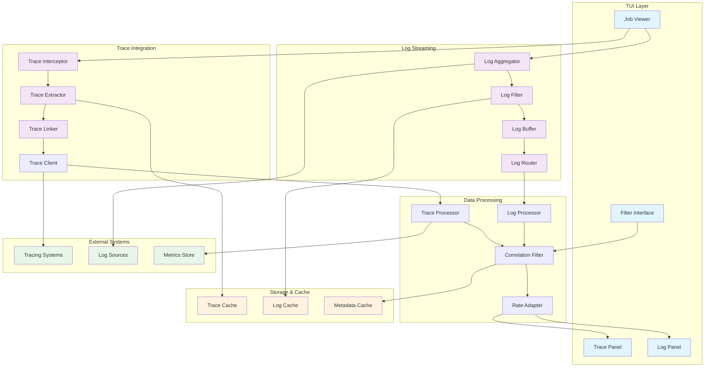
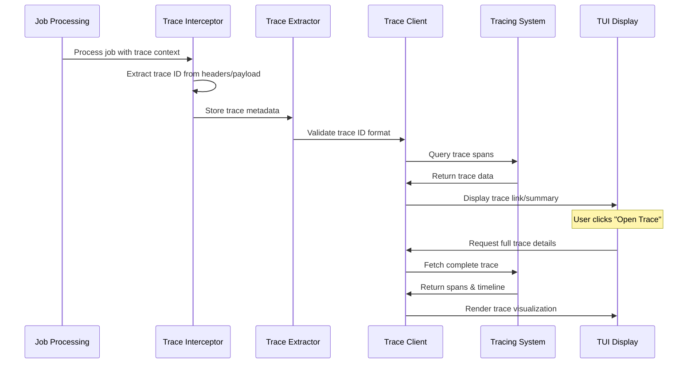
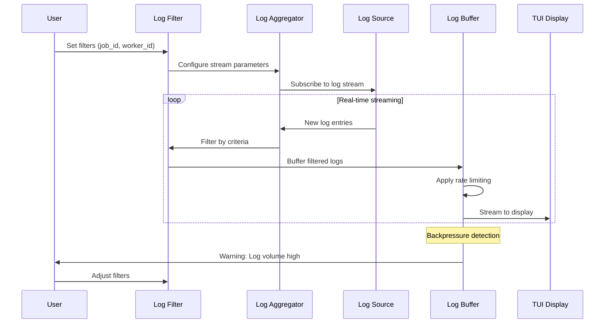
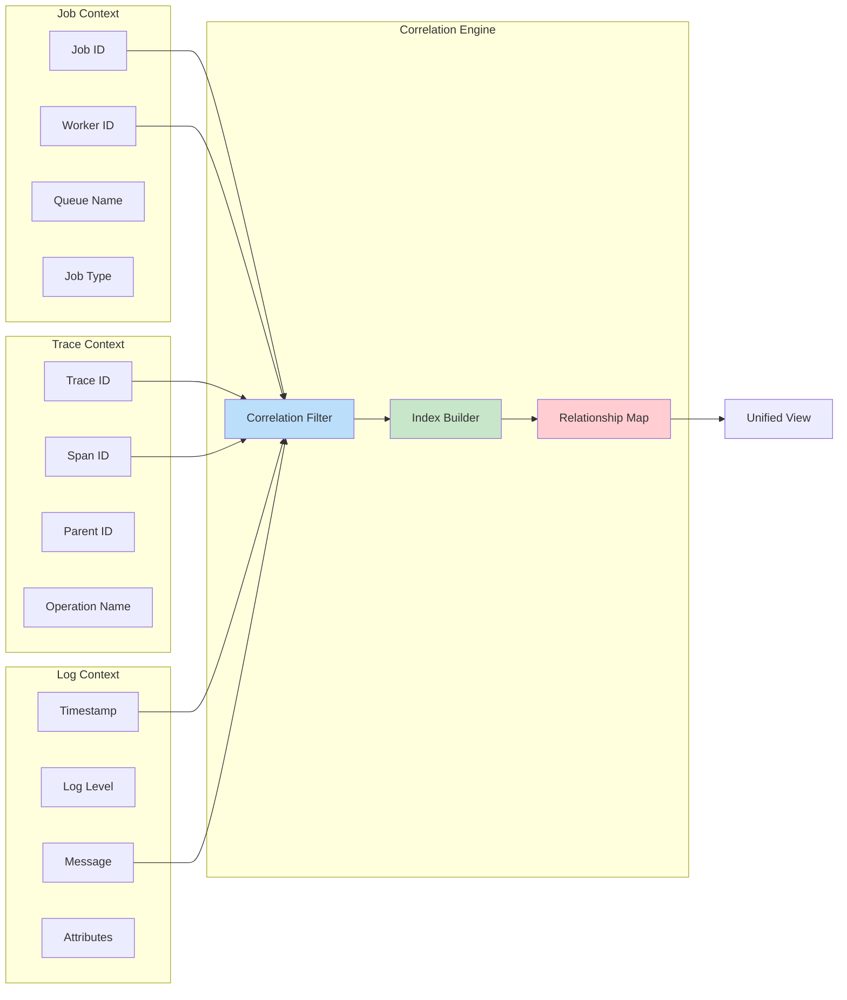

# F027 - Trace Drilldown Log Tail Design

## Executive Summary

The Trace Drilldown Log Tail feature transforms debugging from a multi-tool treasure hunt into a unified observability experience. By surfacing trace IDs directly in the TUI and providing integrated log tailing with intelligent filtering, this feature dramatically accelerates root cause analysis and incident response.

This system bridges the gap between queue monitoring and deep observability, enabling users to seamlessly transition from "job failed" to examining distributed traces and correlated logs without leaving the terminal. The integration supports both external tracing systems (Jaeger, Zipkin) and real-time log aggregation with smart rate limiting and PII protection.

Key capabilities include trace ID propagation through job payloads, one-click trace visualization, real-time log streaming with job/worker filtering, and intelligent backpressure handling to prevent log volume from overwhelming the interface.

## System Architecture

### High-Level Architecture



### Trace Integration Flow



### Log Streaming Architecture



### Data Correlation Model



## API Specification

### Trace Integration Endpoints

#### Get Job Trace Information

```http
GET /api/v1/jobs/{job_id}/trace
```

**Response:**
```json
{
  "job_id": "job_12345",
  "trace_id": "4bf92f3577b34da6a3ce929d0e0e4736",
  "span_id": "00f067aa0ba902b7",
  "parent_span_id": "00f067aa0ba902b6",
  "trace_url": "http://jaeger:16686/trace/4bf92f3577b34da6a3ce929d0e0e4736",
  "spans_count": 15,
  "duration_ms": 2340,
  "status": "completed",
  "errors": 0,
  "extracted_at": "2025-09-14T18:47:37Z"
}
```

#### Get Trace Summary

```http
GET /api/v1/traces/{trace_id}/summary
```

**Response:**
```json
{
  "trace_id": "4bf92f3577b34da6a3ce929d0e0e4736",
  "root_span": {
    "span_id": "00f067aa0ba902b7",
    "operation_name": "process_job",
    "service_name": "queue-worker",
    "start_time": "2025-09-14T18:47:37.123Z",
    "duration_ms": 2340,
    "status": "ok"
  },
  "spans": [
    {
      "span_id": "00f067aa0ba902b8",
      "parent_span_id": "00f067aa0ba902b7",
      "operation_name": "database_query",
      "service_name": "postgres",
      "duration_ms": 45,
      "tags": {
        "db.statement": "SELECT * FROM users WHERE id = $1",
        "db.type": "postgresql"
      }
    }
  ],
  "critical_path": [
    "00f067aa0ba902b7",
    "00f067aa0ba902b8"
  ],
  "error_spans": [],
  "services": ["queue-worker", "postgres", "redis"]
}
```

### Log Streaming Endpoints

#### Start Log Stream

```http
POST /api/v1/logs/streams
```

**Request Body:**
```json
{
  "filters": {
    "job_id": "job_12345",
    "worker_id": "worker_3",
    "log_level": ["error", "warn"],
    "service": "queue-worker",
    "since": "2025-09-14T18:00:00Z"
  },
  "options": {
    "follow": true,
    "tail_lines": 100,
    "rate_limit": 1000,
    "buffer_size": 10000
  }
}
```

**Response:**
```json
{
  "stream_id": "stream_001",
  "endpoint": "ws://localhost:8080/api/v1/logs/streams/stream_001",
  "filters_applied": 3,
  "estimated_rate": 50,
  "expires_at": "2025-09-14T19:47:37Z"
}
```

#### WebSocket Log Stream

```
WebSocket: /api/v1/logs/streams/{stream_id}
```

**Message Format:**
```json
{
  "timestamp": "2025-09-14T18:47:37.123Z",
  "level": "error",
  "service": "queue-worker",
  "job_id": "job_12345",
  "worker_id": "worker_3",
  "trace_id": "4bf92f3577b34da6a3ce929d0e0e4736",
  "span_id": "00f067aa0ba902b8",
  "message": "Database connection timeout",
  "attributes": {
    "duration_ms": 5000,
    "retry_count": 3,
    "error_code": "TIMEOUT"
  }
}
```

### Configuration Endpoints

#### Update Trace Configuration

```http
PUT /api/v1/config/tracing
```

**Request Body:**
```json
{
  "enabled": true,
  "jaeger_endpoint": "http://jaeger:14268/api/traces",
  "zipkin_endpoint": "http://zipkin:9411/api/v2/spans",
  "sample_rate": 0.1,
  "header_extraction": {
    "trace_id_header": "X-Trace-Id",
    "span_id_header": "X-Span-Id",
    "baggage_prefix": "X-Baggage-"
  },
  "url_template": "http://jaeger:16686/trace/{trace_id}"
}
```

#### Update Log Configuration

```http
PUT /api/v1/config/logging
```

**Request Body:**
```json
{
  "enabled": true,
  "sources": [
    {
      "name": "docker_logs",
      "type": "docker",
      "endpoint": "unix:///var/run/docker.sock",
      "filters": ["queue-worker", "redis"]
    },
    {
      "name": "file_logs",
      "type": "file",
      "path": "/var/log/app/*.log",
      "format": "json"
    }
  ],
  "rate_limiting": {
    "max_lines_per_second": 1000,
    "burst_limit": 5000,
    "backoff_strategy": "exponential"
  },
  "retention": {
    "buffer_size": 100000,
    "max_age_minutes": 60
  }
}
```

## Data Models

### Core Data Structures

```json
{
  "$schema": "http://json-schema.org/draft-07/schema#",
  "definitions": {
    "TraceContext": {
      "type": "object",
      "properties": {
        "trace_id": {
          "type": "string",
          "pattern": "^[a-f0-9]{32}$"
        },
        "span_id": {
          "type": "string",
          "pattern": "^[a-f0-9]{16}$"
        },
        "parent_span_id": {
          "type": "string",
          "pattern": "^[a-f0-9]{16}$"
        },
        "flags": {"type": "integer"},
        "baggage": {
          "type": "object",
          "additionalProperties": {"type": "string"}
        },
        "extracted_from": {
          "type": "string",
          "enum": ["headers", "payload", "metadata"]
        },
        "extraction_time": {
          "type": "string",
          "format": "date-time"
        }
      },
      "required": ["trace_id", "span_id"]
    },

    "TraceSpan": {
      "type": "object",
      "properties": {
        "trace_id": {"type": "string"},
        "span_id": {"type": "string"},
        "parent_span_id": {"type": "string"},
        "operation_name": {"type": "string"},
        "service_name": {"type": "string"},
        "start_time": {"type": "string", "format": "date-time"},
        "end_time": {"type": "string", "format": "date-time"},
        "duration_ms": {"type": "integer"},
        "status": {
          "type": "string",
          "enum": ["ok", "error", "timeout", "cancelled"]
        },
        "tags": {
          "type": "object",
          "additionalProperties": {"type": "string"}
        },
        "logs": {
          "type": "array",
          "items": {
            "type": "object",
            "properties": {
              "timestamp": {"type": "string", "format": "date-time"},
              "level": {"type": "string"},
              "message": {"type": "string"},
              "fields": {"type": "object"}
            }
          }
        }
      },
      "required": ["trace_id", "span_id", "operation_name", "start_time"]
    },

    "LogEntry": {
      "type": "object",
      "properties": {
        "timestamp": {"type": "string", "format": "date-time"},
        "level": {
          "type": "string",
          "enum": ["trace", "debug", "info", "warn", "error", "fatal"]
        },
        "service": {"type": "string"},
        "component": {"type": "string"},
        "job_id": {"type": "string"},
        "worker_id": {"type": "string"},
        "queue_name": {"type": "string"},
        "trace_id": {"type": "string"},
        "span_id": {"type": "string"},
        "message": {"type": "string"},
        "attributes": {
          "type": "object",
          "additionalProperties": true
        },
        "source": {
          "type": "object",
          "properties": {
            "host": {"type": "string"},
            "container": {"type": "string"},
            "file": {"type": "string"},
            "line": {"type": "integer"}
          }
        }
      },
      "required": ["timestamp", "level", "message"]
    },

    "LogStream": {
      "type": "object",
      "properties": {
        "stream_id": {"type": "string"},
        "user_id": {"type": "string"},
        "filters": {
          "type": "object",
          "properties": {
            "job_id": {"type": "string"},
            "worker_id": {"type": "string"},
            "queue_name": {"type": "string"},
            "log_level": {
              "type": "array",
              "items": {"type": "string"}
            },
            "service": {"type": "string"},
            "trace_id": {"type": "string"},
            "since": {"type": "string", "format": "date-time"},
            "until": {"type": "string", "format": "date-time"}
          }
        },
        "options": {
          "type": "object",
          "properties": {
            "follow": {"type": "boolean"},
            "tail_lines": {"type": "integer"},
            "rate_limit": {"type": "integer"},
            "buffer_size": {"type": "integer"}
          }
        },
        "status": {
          "type": "string",
          "enum": ["active", "paused", "rate_limited", "closed"]
        },
        "stats": {
          "type": "object",
          "properties": {
            "lines_streamed": {"type": "integer"},
            "lines_filtered": {"type": "integer"},
            "current_rate": {"type": "number"},
            "buffer_usage": {"type": "number"}
          }
        },
        "created_at": {"type": "string", "format": "date-time"},
        "expires_at": {"type": "string", "format": "date-time"}
      },
      "required": ["stream_id", "filters", "status"]
    },

    "CorrelationIndex": {
      "type": "object",
      "properties": {
        "job_id": {"type": "string"},
        "trace_contexts": {
          "type": "array",
          "items": {"$ref": "#/definitions/TraceContext"}
        },
        "log_entries": {
          "type": "array",
          "items": {"$ref": "#/definitions/LogEntry"}
        },
        "timeline": {
          "type": "array",
          "items": {
            "type": "object",
            "properties": {
              "timestamp": {"type": "string", "format": "date-time"},
              "type": {"type": "string", "enum": ["span", "log", "event"]},
              "data": {"type": "object"}
            }
          }
        },
        "relationships": {
          "type": "object",
          "properties": {
            "parent_jobs": {"type": "array", "items": {"type": "string"}},
            "child_jobs": {"type": "array", "items": {"type": "string"}},
            "related_traces": {"type": "array", "items": {"type": "string"}}
          }
        }
      },
      "required": ["job_id"]
    }
  }
}
```

## Security Model

### Threat Analysis

| Threat | Impact | Likelihood | Mitigation |
|--------|---------|------------|------------|
| PII/Sensitive Data Exposure | High | Medium | Log redaction, access controls |
| Trace Data Manipulation | Medium | Low | Read-only access, validation |
| Log Volume DoS | High | Medium | Rate limiting, backpressure |
| Unauthorized Trace Access | High | Medium | RBAC, trace ID validation |
| Cross-Job Information Leakage | High | Low | Strict filtering, access checks |
| External System Compromise | Medium | Low | Secure connections, auth tokens |

### Security Controls

#### Access Control

- **Role-Based Access**: Separate permissions for trace viewing vs log access
- **Job-Level Filtering**: Users can only access traces/logs for jobs they own
- **Trace ID Validation**: Cryptographic validation of trace ID format
- **Session Management**: Time-limited access tokens for streaming

#### Data Protection

- **PII Redaction**: Automatic detection and masking of sensitive data
- **Log Sanitization**: Remove or mask credentials, tokens, personal info
- **Trace Filtering**: Filter out sensitive span attributes
- **Secure Transmission**: TLS for all external tracing system communication

#### Rate Limiting & DoS Protection

- **Stream Rate Limiting**: Per-user limits on log streaming rates
- **Buffer Management**: Prevent memory exhaustion from log volume
- **Connection Limits**: Maximum concurrent log streams per user
- **Backpressure Handling**: Graceful degradation under high load

#### Audit & Compliance

- **Access Logging**: All trace and log access logged
- **Retention Policies**: Automatic cleanup of cached trace/log data
- **Privacy Controls**: GDPR-compliant data handling
- **External System Security**: Secure authentication with tracing systems

## Performance Requirements

### Latency Requirements

| Operation | Target | Maximum |
|-----------|---------|---------|
| Trace ID Extraction | 1ms | 5ms |
| Trace Link Generation | 10ms | 50ms |
| Log Stream Initialization | 100ms | 300ms |
| Real-time Log Delivery | 50ms | 200ms |
| Trace Summary Fetch | 200ms | 1s |
| Log Filter Application | 5ms | 20ms |

### Throughput Requirements

| Metric | Target | Peak |
|--------|---------|------|
| Trace Extractions per Second | 1000 | 5000 |
| Log Lines per Second | 10000 | 50000 |
| Concurrent Log Streams | 100 | 500 |
| Trace Queries per Minute | 1000 | 5000 |
| Filter Operations per Second | 5000 | 20000 |

### Resource Constraints

| Resource | Target | Maximum |
|----------|---------|---------|
| Memory per Log Stream | 10MB | 50MB |
| Trace Cache Size | 100MB | 500MB |
| Log Buffer per Stream | 1MB | 10MB |
| CPU per Trace Extraction | 1ms | 10ms |
| Network Bandwidth | 10MB/s | 100MB/s |

### Scalability Targets

- **Jobs with Traces**: 100K+ jobs with trace correlation
- **Log Retention**: 24 hours in-memory, 7 days searchable
- **Concurrent Users**: 1000+ users with trace/log access
- **External Systems**: 10+ tracing backends supported

## Testing Strategy

### Unit Testing

#### Trace Processing Testing
- **Trace ID Extraction**: Test various header formats, payload structures
- **Correlation Logic**: Test job-to-trace mapping accuracy
- **URL Generation**: Test template rendering with different backends

#### Log Stream Testing
- **Filter Logic**: Test complex filter combinations and edge cases
- **Rate Limiting**: Test backpressure under various load patterns
- **Buffer Management**: Test memory usage and overflow handling

#### Security Testing
- **Access Control**: Test RBAC enforcement for trace/log access
- **Data Sanitization**: Test PII detection and redaction
- **Input Validation**: Test malicious trace IDs and filter parameters

### Integration Testing

#### End-to-End Workflows
- **Trace Discovery**: Test full flow from job execution to trace visualization
- **Log Correlation**: Test job-filtered log streaming with trace context
- **Cross-System Integration**: Test with multiple tracing backends

#### External System Integration
- **Jaeger Integration**: Test trace fetching and URL generation
- **Log Source Integration**: Test various log formats and sources
- **Error Handling**: Test graceful degradation when external systems fail

### Performance Testing

#### Load Testing
- **High Trace Volume**: Test 10K+ traces per minute extraction
- **Concurrent Streams**: Test 500+ simultaneous log streams
- **Large Trace Processing**: Test traces with 1000+ spans

#### Stress Testing
- **Memory Pressure**: Test behavior under low memory conditions
- **Log Volume Spikes**: Test handling of sudden log volume increases
- **Network Latency**: Test performance with slow external systems

#### Accuracy Testing
- **Trace Correlation**: Validate accuracy of job-to-trace mapping
- **Log Filtering**: Verify filter precision and recall rates
- **Timeline Accuracy**: Test chronological ordering of events

## Deployment Plan

### Rollout Strategy

#### Phase 1: Basic Trace Integration (Week 1-2)
- Deploy trace ID extraction and basic URL generation
- Add "Open Trace" action to job viewer
- Implement basic external system connectivity

#### Phase 2: Log Streaming (Week 3-4)
- Implement real-time log streaming with WebSocket
- Add filtering capabilities and rate limiting
- Integrate log correlation with job context

#### Phase 3: Advanced Features (Week 5-6)
- Add PII redaction and security controls
- Implement advanced correlation and timeline views
- Performance optimization and caching

### Configuration Management

#### Default Configuration
```yaml
tracing:
  enabled: true
  extraction:
    headers: ["X-Trace-Id", "X-B3-TraceId"]
    payload_fields: ["trace_id", "tracing.trace_id"]
  backends:
    - name: "jaeger"
      endpoint: "http://jaeger:16686"
      url_template: "http://jaeger:16686/trace/{trace_id}"

logging:
  enabled: true
  sources:
    - type: "docker"
      endpoint: "unix:///var/run/docker.sock"
  rate_limiting:
    max_lines_per_second: 1000
    burst_limit: 5000
  retention:
    buffer_size: 100000
    max_age_minutes: 60
```

### Monitoring and Alerting

#### Key Metrics
- **Trace Extraction Rate**: Monitor successful trace ID extractions
- **Log Stream Health**: Track active streams and error rates
- **Correlation Accuracy**: Measure job-to-trace mapping success
- **System Performance**: Monitor memory usage and response times

#### Alert Conditions
- Trace extraction failure rate >5%
- Log stream error rate >10%
- Memory usage >80% of allocated
- External system connectivity failures

### Rollback Plan

#### Graceful Degradation
- Disable trace extraction while maintaining job monitoring
- Fall back to basic logging without real-time streaming
- Maintain job functionality if tracing systems are unavailable

#### Emergency Procedures
- Immediate disable of log streaming for performance issues
- Circuit breaker for external tracing system calls
- Manual override controls for rate limiting and filtering

---

This design provides a comprehensive foundation for implementing integrated observability in the queue management system, seamlessly connecting job execution with distributed tracing and log analysis for accelerated debugging and incident response.