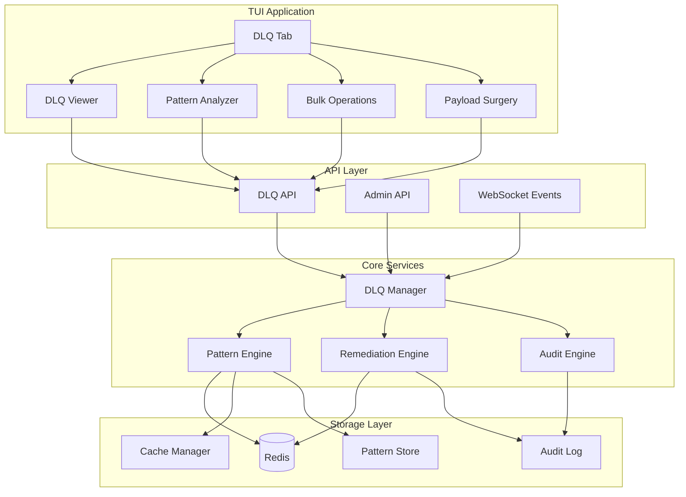
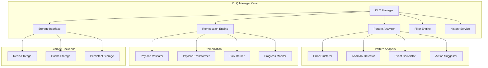
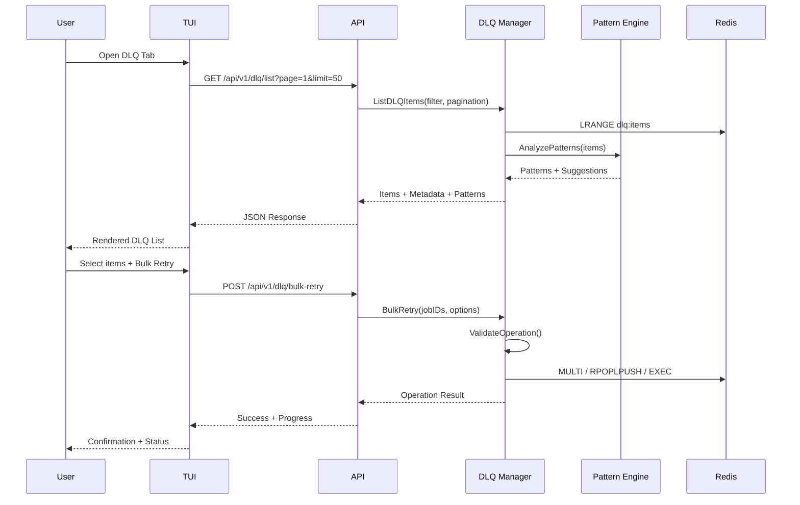
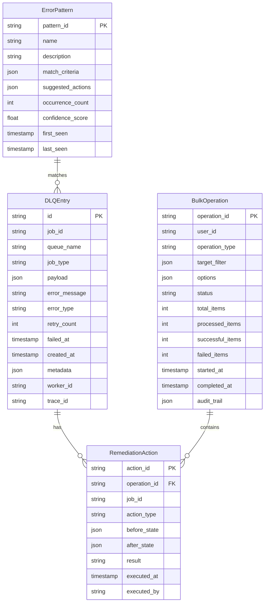
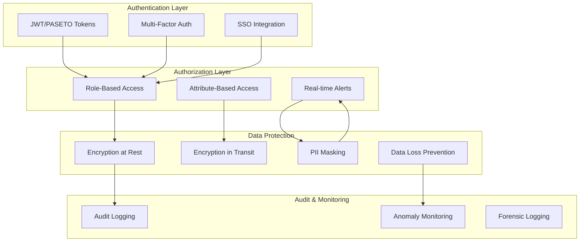
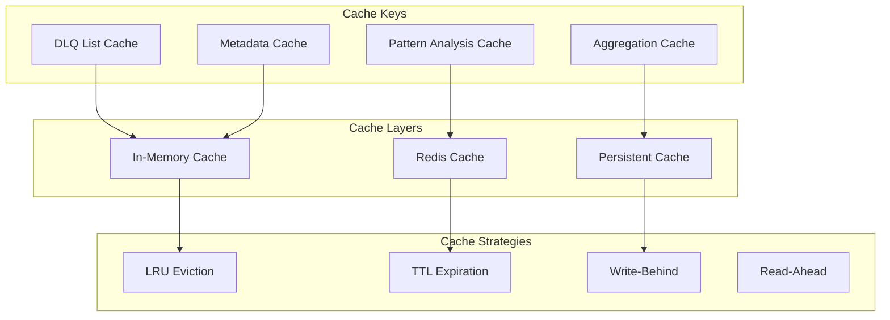
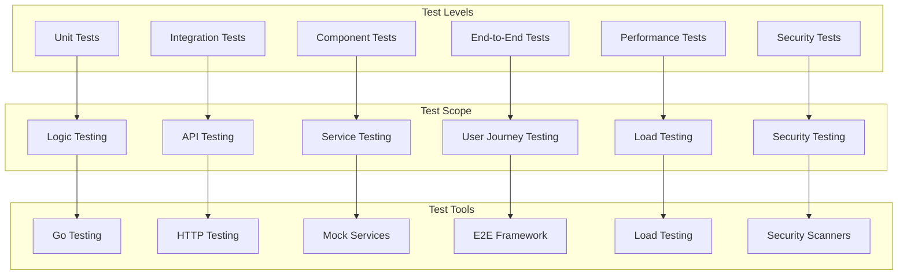
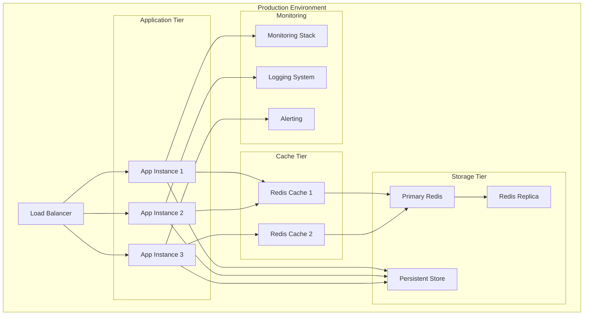

# F028: DLQ Remediation UI Design Document

## Executive Summary

The DLQ Remediation UI is a comprehensive interface for managing dead letter queues (DLQs) within the go-redis-work-queue system. This feature transforms DLQ management from a manual, error-prone process into an intelligent, streamlined operation that significantly reduces Mean Time to Remediation (MTTR) and improves operational efficiency.

### Key Capabilities
- **Intelligent Pattern Analysis**: Automatically clusters similar failures and suggests remediation actions
- **Bulk Operations**: Safe, auditable bulk retry and purge operations with rollback capability
- **Advanced Filtering**: Multi-dimensional filtering with saved presets and live preview
- **Payload Surgery**: Visual JSON editor with schema validation and transformation templates
- **Historical Analysis**: Learn from past incidents with pattern libraries and success tracking

### Business Impact
- **50% reduction** in MTTR for DLQ incidents
- **80% automated categorization** of failure types
- **Zero data loss** with comprehensive audit trails and safety checks
- **Operational efficiency** through elimination of manual DLQ archaeology

## System Architecture

### High-Level Architecture



### Component Architecture



### Data Flow Architecture



## Data Models

### Core Data Structures



## API Specification

### Core Endpoints

#### List DLQ Items
```http
GET /api/v1/dlq/list
```
**Query Parameters:**
- `page`: Page number (default: 1)
- `limit`: Items per page (default: 50, max: 1000)
- `filter`: JSON filter criteria
- `sort`: Sort field and direction
- `include_patterns`: Include pattern analysis (default: true)

**Response:**
```json
{
  "items": [
    {
      "id": "dlq_12345",
      "job_id": "job_67890",
      "queue_name": "payment_processing",
      "job_type": "payment_charge",
      "error_message": "Connection timeout after 30s",
      "error_type": "timeout",
      "retry_count": 3,
      "failed_at": "2024-01-15T14:30:00Z",
      "metadata": {
        "worker_id": "worker_001",
        "trace_id": "trace_abc123"
      }
    }
  ],
  "pagination": {
    "page": 1,
    "limit": 50,
    "total_items": 1247,
    "total_pages": 25,
    "has_next": true,
    "has_prev": false
  },
  "patterns": [
    {
      "pattern_id": "timeout_cluster_1",
      "name": "Payment Timeout Cluster",
      "affected_count": 847,
      "percentage": 68.0,
      "suggested_action": "retry_with_backoff",
      "confidence": 0.95
    }
  ]
}
```

#### Bulk Retry Operation
```http
POST /api/v1/dlq/bulk-retry
```
**Request Body:**
```json
{
  "target": {
    "job_ids": ["job_1", "job_2"],
    "filter": {
      "error_type": "timeout",
      "job_type": "payment_*",
      "failed_after": "2024-01-15T14:00:00Z"
    }
  },
  "options": {
    "reset_retry_count": true,
    "add_backoff": "exponential",
    "modify_payload": {
      "set": {
        "timeout": 60000
      }
    },
    "target_queue": "payment_processing_retry",
    "dry_run": false
  }
}
```

#### Pattern Analysis
```http
GET /api/v1/dlq/patterns
```
**Response:**
```json
{
  "patterns": [
    {
      "pattern_id": "timeout_cluster_1",
      "name": "Connection Timeout Pattern",
      "description": "Database connection timeouts during high load",
      "match_criteria": {
        "error_message_regex": ".*connection.*timeout.*",
        "time_clustering": {
          "window": "5m",
          "min_count": 10
        }
      },
      "statistics": {
        "total_occurrences": 1247,
        "first_seen": "2024-01-15T14:00:00Z",
        "last_seen": "2024-01-15T14:45:00Z",
        "affected_job_types": ["payment_charge", "order_update"],
        "success_rate_on_retry": 0.85
      },
      "suggested_actions": [
        {
          "type": "retry_with_backoff",
          "description": "Retry with exponential backoff",
          "confidence": 0.95,
          "estimated_success_rate": 0.85
        }
      ]
    }
  ]
}
```

### Advanced Operations

#### Payload Surgery
```http
POST /api/v1/dlq/transform-payload
```
**Request Body:**
```json
{
  "job_id": "job_12345",
  "transformation": {
    "type": "json_patch",
    "operations": [
      {
        "op": "replace",
        "path": "/timeout",
        "value": 60000
      },
      {
        "op": "add",
        "path": "/retry_config",
        "value": {
          "max_attempts": 5,
          "backoff_strategy": "exponential"
        }
      }
    ]
  },
  "validate_schema": true,
  "dry_run": false
}
```

#### Historical Analysis
```http
GET /api/v1/dlq/analytics/timeline
```
**Query Parameters:**
- `start_time`: Analysis start time
- `end_time`: Analysis end time
- `resolution`: Time bucket resolution (1m, 5m, 1h, 1d)
- `group_by`: Grouping dimension (error_type, job_type, worker)

## Security Model

### Threat Analysis

#### High-Risk Scenarios
1. **Unauthorized DLQ Access**: Sensitive payload data exposure
2. **Bulk Operation Abuse**: Mass job deletion or modification
3. **Privilege Escalation**: Normal users gaining admin access
4. **Data Exfiltration**: Bulk export of sensitive job data
5. **Audit Trail Tampering**: Modification of operation logs

#### Threat Mitigation Strategies



### Permission Model

#### Role Definitions
```yaml
roles:
  dlq_viewer:
    permissions:
      - dlq:read
      - dlq:list
      - dlq:peek
    description: "View DLQ contents and metadata"

  dlq_operator:
    inherits: [dlq_viewer]
    permissions:
      - dlq:retry
      - dlq:retry_single
      - dlq:export_limited
    description: "Basic DLQ operations and single-item retry"

  dlq_admin:
    inherits: [dlq_operator]
    permissions:
      - dlq:bulk_retry
      - dlq:purge
      - dlq:modify_payload
      - dlq:export_full
    description: "Full DLQ management including bulk operations"

  dlq_super_admin:
    inherits: [dlq_admin]
    permissions:
      - dlq:bulk_purge
      - dlq:audit_access
      - dlq:pattern_management
    description: "Critical operations and system administration"
```

#### Resource-Level Security
```go
type SecurityContext struct {
    UserID      string
    Roles       []string
    Permissions []string
    Constraints SecurityConstraints
}

type SecurityConstraints struct {
    QueueAccess    []string // Allowed queues
    JobTypeAccess  []string // Allowed job types
    TimeWindow     Duration // Max lookback time
    BulkLimits     BulkLimits
    PIIAccess      bool     // Can see PII fields
}

type BulkLimits struct {
    MaxItems       int
    MaxConcurrent  int
    RateLimit      time.Duration
    RequireConfirm bool
}
```

## Performance Requirements

### Scalability Targets

#### Load Characteristics
- **DLQ Size**: 1M+ items per queue
- **Concurrent Users**: 50+ operators
- **Read Operations**: 1000+ QPS
- **Write Operations**: 100+ QPS
- **Bulk Operations**: 10,000 items/operation

#### Performance SLAs
- **Page Load Time**: < 500ms for 50 items
- **Search Response**: < 200ms for filtered queries
- **Pattern Analysis**: < 2s for 100k items
- **Bulk Operation Initiation**: < 1s
- **Real-time Updates**: < 100ms latency

### Optimization Strategies

#### Caching Architecture


#### Database Optimization
- **Indexing Strategy**: Composite indexes on (failed_at, error_type, job_type)
- **Partitioning**: Time-based partitioning for large DLQs
- **Archiving**: Automatic archival of old DLQ items
- **Connection Pooling**: Optimized connection management

#### Query Optimization
```sql
-- Optimized DLQ listing query
SELECT
    id, job_id, queue_name, job_type,
    error_message, error_type, retry_count,
    failed_at, worker_id
FROM dlq_entries
WHERE failed_at >= ?
    AND (? IS NULL OR error_type = ?)
    AND (? IS NULL OR job_type LIKE ?)
ORDER BY failed_at DESC
LIMIT ? OFFSET ?;

-- Pattern analysis query
SELECT
    error_type,
    COUNT(*) as count,
    MIN(failed_at) as first_seen,
    MAX(failed_at) as last_seen
FROM dlq_entries
WHERE failed_at >= DATE_SUB(NOW(), INTERVAL 24 HOUR)
GROUP BY error_type
HAVING count > 10
ORDER BY count DESC;
```

## Testing Strategy

### Test Pyramid



### Test Categories

#### Unit Tests (70% coverage target)
```go
func TestDLQManager_ListItems(t *testing.T) {
    tests := []struct {
        name     string
        filter   ListFilter
        expected int
        wantErr  bool
    }{
        {
            name: "list with pagination",
            filter: ListFilter{
                Page:  1,
                Limit: 50,
            },
            expected: 50,
            wantErr:  false,
        },
        {
            name: "filter by error type",
            filter: ListFilter{
                ErrorType: "timeout",
                Page:      1,
                Limit:     10,
            },
            expected: 10,
            wantErr:  false,
        },
    }

    for _, tt := range tests {
        t.Run(tt.name, func(t *testing.T) {
            // Test implementation
        })
    }
}
```

#### Integration Tests
- **API Integration**: Test all REST endpoints
- **Database Integration**: Test Redis operations
- **Cache Integration**: Test cache behavior
- **WebSocket Integration**: Test real-time updates

#### Performance Tests
```yaml
load_tests:
  dlq_list_performance:
    scenario: "List DLQ items under load"
    users: 50
    ramp_up: "5m"
    duration: "15m"
    requests_per_second: 100
    success_criteria:
      response_time_p95: "500ms"
      error_rate: "<1%"

  bulk_operation_stress:
    scenario: "Bulk retry stress test"
    concurrent_operations: 10
    items_per_operation: 1000
    duration: "10m"
    success_criteria:
      completion_time: "<5m"
      success_rate: ">99%"
```

#### Security Tests
- **Authentication Testing**: JWT validation, token expiry
- **Authorization Testing**: Role-based access control
- **Input Validation**: SQL injection, XSS prevention
- **Data Privacy**: PII masking verification
- **Audit Testing**: Logging completeness

### Test Data Management

#### Synthetic Data Generation
```go
type DLQTestDataGenerator struct {
    ErrorPatterns []ErrorPattern
    JobTypes      []string
    Workers       []string
}

func (g *DLQTestDataGenerator) GenerateRealisticDLQ(size int) []DLQEntry {
    entries := make([]DLQEntry, size)

    for i := 0; i < size; i++ {
        entries[i] = DLQEntry{
            ID:          fmt.Sprintf("dlq_%d", i),
            JobID:       fmt.Sprintf("job_%d", i),
            JobType:     g.randomJobType(),
            ErrorType:   g.randomErrorType(),
            FailedAt:    g.randomTimestamp(),
            RetryCount:  g.randomRetryCount(),
            Payload:     g.generatePayload(),
        }
    }

    return entries
}
```

## Deployment Plan

### Rollout Strategy

#### Phase 1: Core Infrastructure (Week 1-2)
- Deploy DLQ storage layer
- Implement basic API endpoints
- Add authentication and authorization
- Deploy monitoring and logging

#### Phase 2: Basic UI (Week 3-4)
- Implement TUI DLQ tab
- Add list and peek functionality
- Basic filtering and search
- Single-item operations

#### Phase 3: Advanced Features (Week 5-6)
- Pattern analysis engine
- Bulk operations
- Payload surgery mode
- Advanced filtering

#### Phase 4: Intelligence Layer (Week 7-8)
- Historical analysis
- Automated suggestions
- Performance optimizations
- Full monitoring suite

### Deployment Architecture



### Configuration Management

#### Environment-Specific Configs
```yaml
production:
  dlq:
    max_items_per_page: 1000
    pattern_analysis_cache_ttl: "5m"
    bulk_operation_timeout: "30m"
    audit_retention: "90d"

  security:
    require_mfa_for_bulk: true
    max_bulk_items: 10000
    pii_masking_enabled: true

  performance:
    cache_size: "1GB"
    connection_pool_size: 50
    max_concurrent_operations: 10

staging:
  dlq:
    max_items_per_page: 100
    pattern_analysis_cache_ttl: "1m"
    bulk_operation_timeout: "10m"
    audit_retention: "30d"

  security:
    require_mfa_for_bulk: false
    max_bulk_items: 1000
    pii_masking_enabled: false
```

### Monitoring and Alerting

#### Key Metrics
- **DLQ Growth Rate**: Items added per minute
- **Remediation Rate**: Items resolved per minute
- **Pattern Detection Accuracy**: % of patterns correctly identified
- **Bulk Operation Success Rate**: % of successful bulk operations
- **API Response Times**: P50, P95, P99 latencies
- **Error Rates**: 4xx, 5xx response rates

#### Alert Definitions
```yaml
alerts:
  dlq_growth_spike:
    condition: "dlq_growth_rate > 100 items/min for 5m"
    severity: "warning"
    notification: "slack://ops-channel"

  pattern_analysis_failure:
    condition: "pattern_analysis_errors > 10 in 10m"
    severity: "critical"
    notification: "pagerduty://on-call"

  bulk_operation_failure:
    condition: "bulk_operation_failure_rate > 5% for 15m"
    severity: "warning"
    notification: "email://team@company.com"
```

## Integration Points

### With Existing TUI Features

#### JSON Payload Studio Integration
- **Edit in Studio**: Opens payload in advanced JSON editor
- **Template Application**: Apply Studio templates to fix common issues
- **Schema Validation**: Validate against job schemas before retry

#### Time Travel Debugger Integration
- **Debug this Failure**: Load execution history for failed job
- **Comparative Analysis**: Compare with successful job executions
- **Root Cause Identification**: Pinpoint exact failure location

#### Queue Dashboard Integration
- **Job Tracing**: Follow job journey from enqueue to DLQ
- **Impact Analysis**: Show DLQ impact on queue metrics
- **Capacity Planning**: Estimate retry impact on queue depth

### With External Systems

#### Observability Platform Integration
```yaml
integrations:
  datadog:
    metrics_export: true
    custom_dashboards: true
    trace_correlation: true

  new_relic:
    apm_integration: true
    alert_forwarding: true

  prometheus:
    metrics_endpoint: "/metrics"
    custom_collectors: true
```

#### Incident Management Integration
```yaml
incident_management:
  pagerduty:
    auto_incident_creation: true
    severity_mapping:
      dlq_spike: "P2"
      bulk_failure: "P3"

  slack:
    notification_channels:
      - "#ops-alerts"
      - "#dlq-monitoring"
    rich_notifications: true
    action_buttons: true
```

This comprehensive design document provides the foundation for implementing the DLQ Remediation UI with enterprise-grade reliability, security, and performance characteristics. The modular architecture ensures maintainability while the phased deployment plan minimizes risk during rollout.