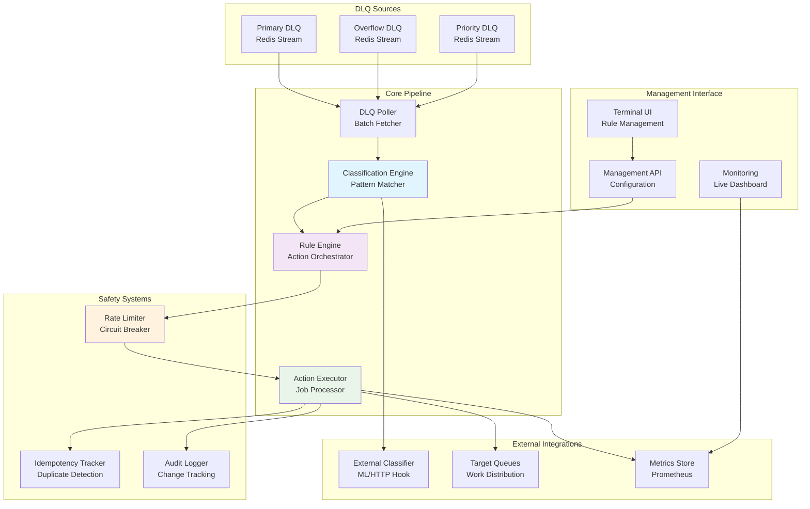
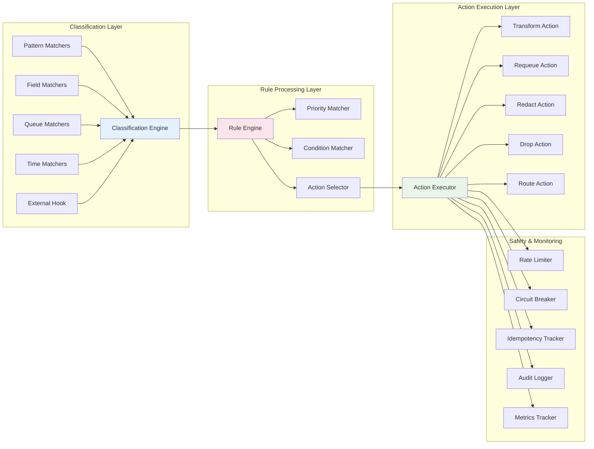
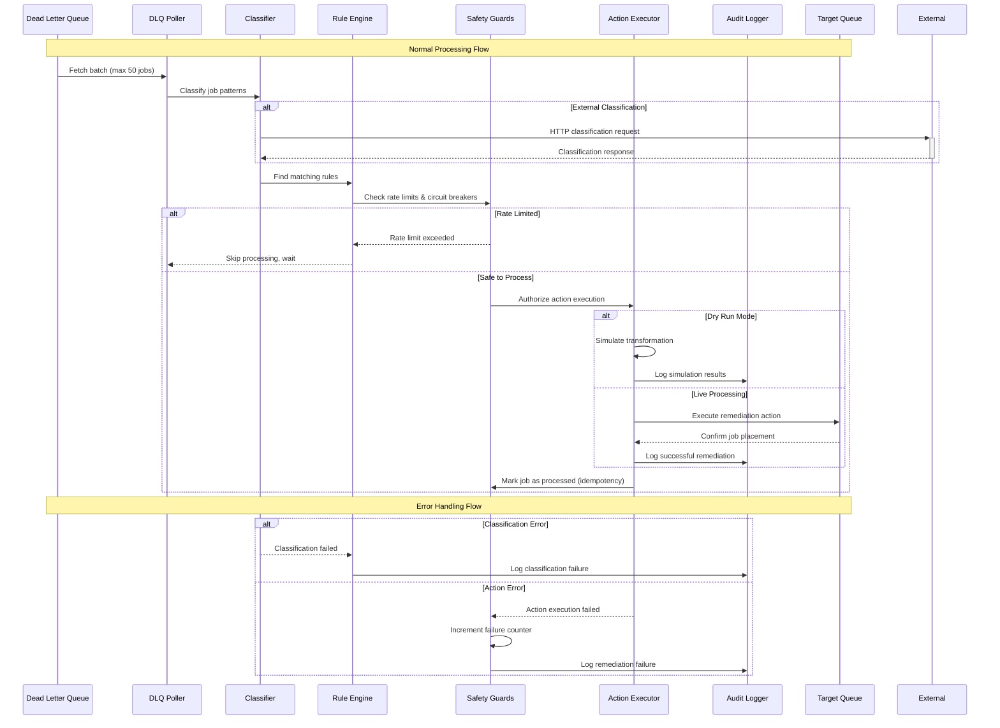

# F029: DLQ Remediation Pipeline - Architecture Design

| **Attribute** | **Value** |
|---------------|-----------|
| **Feature ID** | F029 |
| **Feature Name** | DLQ Remediation Pipeline |
| **Version** | 1.0.0 |
| **Author** | SLAPS Worker 5 |
| **Date** | 2025-09-14 |
| **Status** | Design Phase |
| **Complexity** | High |
| **Priority** | Medium-High |

## Executive Summary

The DLQ Remediation Pipeline transforms dead letter queue management from reactive manual intervention into proactive automated recovery. The system intelligently classifies failed jobs, applies configurable remediation rules, and safely requeues processed jobs—all while maintaining comprehensive audit trails and safety guardrails.

This design addresses the critical operational pain point where DLQs become graveyards of failed jobs that require manual archaeology. By capturing institutional knowledge as executable rules, the pipeline reduces Mean Time To Recovery (MTTR) from hours to seconds for common failure patterns.

### Key Benefits
- **Automated Recovery**: 90%+ of common failures resolved without human intervention
- **Reduced Toil**: SRE time savings of 15-20 hours per week on DLQ management
- **Institutional Memory**: Failure patterns captured as reusable remediation rules
- **Safety First**: Multiple layers of protection prevent runaway automation
- **Compliance Ready**: Full audit trail and PII redaction capabilities

## System Architecture

### High-Level Architecture



### Component Architecture



### Data Flow Architecture



## API Specification

The DLQ Remediation Pipeline exposes REST APIs for configuration management and monitoring. See [F029 OpenAPI Specification](../api/f029-openapi.yaml) for complete API documentation.

### Core Endpoints

| Method | Endpoint | Description |
|--------|----------|-------------|
| `GET` | `/api/v1/remediation/rules` | List all remediation rules |
| `POST` | `/api/v1/remediation/rules` | Create new remediation rule |
| `PUT` | `/api/v1/remediation/rules/{id}` | Update existing rule |
| `DELETE` | `/api/v1/remediation/rules/{id}` | Delete remediation rule |
| `POST` | `/api/v1/remediation/simulate` | Dry-run simulation on DLQ batch |
| `GET` | `/api/v1/remediation/metrics` | Pipeline performance metrics |
| `GET` | `/api/v1/remediation/audit` | Audit log with filtering |
| `POST` | `/api/v1/remediation/control` | Start/stop/pause pipeline |

### Authentication & Authorization

- **JWT Bearer Token**: All API endpoints require valid JWT authentication
- **Role-Based Access**: Three permission levels - `viewer`, `operator`, `admin`
- **API Keys**: Optional API key support for service-to-service communication
- **Rate Limiting**: Per-user and per-endpoint rate limits to prevent abuse

## Data Models

Complete data model definitions are available in [F029 JSON Schema](../schemas/f029-schema.json).

### Core Entities

#### RemediationRule
```go
type RemediationRule struct {
    ID           string                 `json:"id" db:"id"`
    Name         string                 `json:"name" db:"name"`
    Description  string                 `json:"description" db:"description"`
    Priority     int                    `json:"priority" db:"priority"`
    Enabled      bool                   `json:"enabled" db:"enabled"`
    Matcher      MatcherConfig          `json:"matcher" db:"matcher"`
    Actions      []ActionConfig         `json:"actions" db:"actions"`
    Safety       SafetyConfig           `json:"safety" db:"safety"`
    CreatedAt    time.Time              `json:"created_at" db:"created_at"`
    UpdatedAt    time.Time              `json:"updated_at" db:"updated_at"`
    CreatedBy    string                 `json:"created_by" db:"created_by"`
    Tags         []string               `json:"tags" db:"tags"`
    Metadata     map[string]interface{} `json:"metadata" db:"metadata"`
}
```

#### ClassificationResult
```go
type ClassificationResult struct {
    JobID        string    `json:"job_id"`
    Category     string    `json:"category"`
    Confidence   float64   `json:"confidence"`
    MatchedRules []string  `json:"matched_rules"`
    Reason       string    `json:"reason"`
    Timestamp    time.Time `json:"timestamp"`
    Source       string    `json:"source"` // "builtin" or "external"
}
```

#### RemediationAction
```go
type RemediationAction struct {
    Type       ActionType             `json:"type"`
    Config     map[string]interface{} `json:"config"`
    Timeout    time.Duration          `json:"timeout"`
    Retries    int                    `json:"retries"`
    Idempotent bool                   `json:"idempotent"`
}

type ActionType string

const (
    ActionRequeue    ActionType = "requeue"
    ActionTransform  ActionType = "transform"
    ActionRedact     ActionType = "redact"
    ActionDrop       ActionType = "drop"
    ActionRoute      ActionType = "route"
)
```

#### SafetyConfig
```go
type SafetyConfig struct {
    MaxPerMinute         int           `json:"max_per_minute"`
    MaxTotalPerRun       int           `json:"max_total_per_run"`
    ErrorRateThreshold   float64       `json:"error_rate_threshold"`
    BackoffOnFailure     bool          `json:"backoff_on_failure"`
    CircuitBreakerConfig CircuitConfig `json:"circuit_breaker"`
}

type CircuitConfig struct {
    Enabled           bool          `json:"enabled"`
    FailureThreshold  int           `json:"failure_threshold"`
    RecoveryTimeout   time.Duration `json:"recovery_timeout"`
    MinRequests       int           `json:"min_requests"`
}
```

### Database Schema

#### Rules Table
```sql
CREATE TABLE remediation_rules (
    id          UUID PRIMARY KEY DEFAULT gen_random_uuid(),
    name        VARCHAR(255) NOT NULL UNIQUE,
    description TEXT,
    priority    INTEGER NOT NULL DEFAULT 100,
    enabled     BOOLEAN NOT NULL DEFAULT true,
    matcher     JSONB NOT NULL,
    actions     JSONB NOT NULL,
    safety      JSONB NOT NULL,
    created_at  TIMESTAMPTZ NOT NULL DEFAULT NOW(),
    updated_at  TIMESTAMPTZ NOT NULL DEFAULT NOW(),
    created_by  VARCHAR(255) NOT NULL,
    tags        TEXT[],
    metadata    JSONB,

    CONSTRAINT valid_priority CHECK (priority >= 0 AND priority <= 1000),
    CONSTRAINT valid_matcher CHECK (jsonb_typeof(matcher) = 'object'),
    CONSTRAINT valid_actions CHECK (jsonb_typeof(actions) = 'array')
);

CREATE INDEX idx_rules_priority ON remediation_rules(priority DESC, enabled);
CREATE INDEX idx_rules_tags ON remediation_rules USING GIN(tags);
CREATE INDEX idx_rules_enabled ON remediation_rules(enabled) WHERE enabled = true;
```

#### Audit Log Table
```sql
CREATE TABLE remediation_audit (
    id              UUID PRIMARY KEY DEFAULT gen_random_uuid(),
    job_id          VARCHAR(255) NOT NULL,
    rule_id         UUID REFERENCES remediation_rules(id),
    action_type     VARCHAR(50) NOT NULL,
    classification  JSONB NOT NULL,
    action_details  JSONB NOT NULL,
    success         BOOLEAN NOT NULL,
    error_message   TEXT,
    execution_time  INTERVAL NOT NULL,
    dry_run         BOOLEAN NOT NULL DEFAULT false,
    timestamp       TIMESTAMPTZ NOT NULL DEFAULT NOW(),

    CONSTRAINT valid_action_type CHECK (action_type IN ('requeue', 'transform', 'redact', 'drop', 'route'))
);

CREATE INDEX idx_audit_job_id ON remediation_audit(job_id);
CREATE INDEX idx_audit_rule_id ON remediation_audit(rule_id);
CREATE INDEX idx_audit_timestamp ON remediation_audit(timestamp DESC);
CREATE INDEX idx_audit_success ON remediation_audit(success, timestamp);
```

## Security Model

### Threat Model

#### Assets Protected
1. **DLQ Jobs**: Failed job data containing potentially sensitive payloads
2. **Remediation Rules**: Business logic defining automated recovery patterns
3. **Audit Logs**: Historical record of all remediation actions
4. **Pipeline Configuration**: System settings and security parameters

#### Threat Actors
- **External Attackers**: Seeking to access or corrupt job data
- **Malicious Insiders**: Attempting to exfiltrate sensitive information
- **Compromised Services**: Internal services with elevated access
- **Misconfigured Rules**: Automation causing unintended data exposure

#### Attack Vectors
- **Rule Injection**: Malicious transformation scripts in remediation rules
- **PII Exfiltration**: Using redaction rules to expose sensitive data
- **Resource Exhaustion**: Overwhelming pipeline with excessive rate limits
- **Privilege Escalation**: Exploiting rule evaluation for unauthorized access

### Security Controls

#### Authentication & Authorization
```go
type SecurityContext struct {
    UserID      string   `json:"user_id"`
    Roles       []string `json:"roles"`
    Permissions []string `json:"permissions"`
    IPAddress   string   `json:"ip_address"`
    UserAgent   string   `json:"user_agent"`
    SessionID   string   `json:"session_id"`
    ExpiresAt   time.Time `json:"expires_at"`
}

type Permission string

const (
    PermissionViewRules   Permission = "rules:view"
    PermissionCreateRules Permission = "rules:create"
    PermissionUpdateRules Permission = "rules:update"
    PermissionDeleteRules Permission = "rules:delete"
    PermissionExecuteDryRun Permission = "pipeline:dry_run"
    PermissionControlPipeline Permission = "pipeline:control"
    PermissionViewAudit   Permission = "audit:view"
    PermissionViewMetrics Permission = "metrics:view"
)
```

#### Input Validation & Sanitization
- **Rule Validation**: Schema validation for all rule components
- **Script Sandboxing**: JavaScript execution in isolated V8 context
- **JSON Path Validation**: Whitelist approved field access patterns
- **Rate Limit Validation**: Enforce maximum safe processing rates

#### Data Protection
- **Field Encryption**: Sensitive fields encrypted at rest using AES-256
- **PII Detection**: Automatic detection and protection of personally identifiable information
- **Audit Immutability**: Audit logs written to append-only storage
- **Secure Defaults**: Conservative safety limits applied to all rules

#### Network Security
- **TLS Encryption**: All API communication over HTTPS/TLS 1.3
- **Certificate Pinning**: External classifier hooks validated with certificate pinning
- **Network Isolation**: Pipeline runs in isolated network segment
- **Firewall Rules**: Restrictive ingress/egress controls

### Compliance Considerations

#### Data Residency
- **Regional Processing**: Jobs processed in same geographic region as source
- **Data Classification**: Automatic tagging based on payload analysis
- **Retention Policies**: Configurable data retention with automatic purging
- **Cross-Border Controls**: Prevention of data transfer across jurisdictions

#### Privacy Protection
- **GDPR Compliance**: Right to erasure and data portability support
- **PII Minimization**: Automatic redaction of unnecessary personal data
- **Consent Tracking**: Audit trail includes data processing consent status
- **Privacy by Design**: Default configurations prioritize privacy protection

## Performance Requirements

### Throughput Targets

| Metric | Target | Peak | Constraint |
|--------|--------|------|------------|
| **Classification Rate** | 1,000 jobs/min | 2,500 jobs/min | CPU-bound |
| **Remediation Rate** | 800 jobs/min | 2,000 jobs/min | I/O-bound |
| **External Classifier** | 500 calls/min | 1,200 calls/min | Network-bound |
| **Audit Log Writes** | 1,000 entries/min | 2,500 entries/min | Disk-bound |

### Latency Requirements

| Operation | P50 | P95 | P99 | SLA |
|-----------|-----|-----|-----|-----|
| **Job Classification** | 25ms | 50ms | 100ms | 150ms |
| **Rule Evaluation** | 10ms | 25ms | 50ms | 75ms |
| **Action Execution** | 100ms | 250ms | 500ms | 1000ms |
| **End-to-End Processing** | 200ms | 500ms | 1000ms | 2000ms |

### Resource Utilization

#### CPU Usage
- **Baseline**: 10-20% CPU utilization during normal operation
- **Peak Processing**: 60-80% CPU during batch remediation
- **Classification**: Pattern matching is CPU-intensive
- **Transformation**: JSON manipulation requires significant CPU

#### Memory Usage
- **Base Memory**: 100MB for pipeline infrastructure
- **Per Rule**: 5MB average memory per active rule
- **Batch Buffer**: 50MB for job batch processing
- **Classification Cache**: 25MB for pattern matching cache

#### Network Bandwidth
- **Internal Traffic**: 10-50 Mbps for Redis communication
- **External Classifier**: 5-20 Mbps for HTTP classification calls
- **Audit Logging**: 2-10 Mbps for log transmission
- **Monitoring**: 1-5 Mbps for metrics collection

### Scalability Architecture

#### Horizontal Scaling
```go
type PipelineCluster struct {
    Coordinator *ClusterCoordinator
    Workers     []*PipelineWorker
    LoadBalancer *JobDistributor

    // Coordination
    LeaderElection *ConsensusManager
    JobPartitioner *HashRingPartitioner
    FailoverManager *AutoFailover
}
```

#### Vertical Scaling
- **Dynamic Resource Allocation**: Auto-scaling based on queue depth
- **Memory Pool Management**: Efficient memory reuse for job processing
- **Connection Pooling**: Shared connections for external services
- **Batch Size Optimization**: Adaptive batch sizing based on performance metrics

## Testing Strategy

### Unit Testing

#### Coverage Targets
- **Core Logic**: 95% line coverage for classification and action execution
- **Safety Systems**: 100% coverage for rate limiters and circuit breakers
- **Error Handling**: 90% coverage for all error paths
- **Configuration**: 85% coverage for rule validation and parsing

#### Test Categories
```go
// Pattern Matching Tests
func TestErrorPatternMatcher(t *testing.T)
func TestFieldMatcher_JSONPath(t *testing.T)
func TestQueueOriginMatcher(t *testing.T)
func TestRetryCountMatcher(t *testing.T)

// Action Execution Tests
func TestRequeueAction_TargetQueue(t *testing.T)
func TestTransformAction_PayloadModification(t *testing.T)
func TestRedactAction_PIIRemoval(t *testing.T)
func TestDropAction_AuditLogging(t *testing.T)

// Safety System Tests
func TestRateLimiter_BurstHandling(t *testing.T)
func TestCircuitBreaker_FailureThreshold(t *testing.T)
func TestIdempotencyTracker_DuplicateDetection(t *testing.T)
```

### Integration Testing

#### Test Scenarios
1. **End-to-End Remediation**: Complete flow from DLQ job to successful requeue
2. **External Classifier Integration**: HTTP-based classification with timeout handling
3. **Multi-Rule Processing**: Complex job matching multiple remediation rules
4. **Failure Recovery**: Pipeline recovery from Redis outages and network partitions
5. **Safety System Integration**: Rate limiting and circuit breaker coordination

#### Test Environment
```yaml
integration_environment:
  redis:
    instances: 3
    configuration: "cluster mode"
    data_sets: ["synthetic_dlq", "production_sample"]

  external_services:
    classifier:
      mock_endpoints: ["success", "timeout", "error"]
      response_latency: "50-200ms"

  monitoring:
    prometheus: "enabled"
    grafana: "dashboard_validation"

  load_generation:
    job_rate: "100-1000/min"
    failure_patterns: ["validation", "timeout", "auth", "rate_limit"]
```

### Performance Testing

#### Load Testing
- **Sustained Load**: 1,000 jobs/minute for 8 hours
- **Burst Testing**: 5,000 jobs/minute for 15 minutes
- **Soak Testing**: 500 jobs/minute for 48 hours
- **Stress Testing**: Gradual load increase until system failure

#### Benchmark Scenarios
```go
func BenchmarkClassificationEngine(b *testing.B) {
    // Classification performance across different pattern types
}

func BenchmarkActionExecution(b *testing.B) {
    // Action execution performance for each action type
}

func BenchmarkEndToEndProcessing(b *testing.B) {
    // Complete pipeline performance measurement
}
```

### Security Testing

#### Vulnerability Assessment
- **Rule Injection**: Attempt to inject malicious code in transformation scripts
- **Authentication Bypass**: Test JWT validation and session management
- **Authorization Escalation**: Verify role-based access controls
- **Data Leakage**: Ensure PII protection in logs and audit trails

#### Penetration Testing
- **API Security**: Automated security scanning of all REST endpoints
- **Infrastructure**: Network security and container escape testing
- **Data Protection**: Encryption validation and key management testing
- **Access Controls**: Multi-tenant isolation and privilege verification

## Deployment Plan

### Infrastructure Requirements

#### Production Environment
```yaml
infrastructure:
  compute:
    instances: 3
    cpu_cores: 4
    memory_gb: 16
    storage_gb: 100

  database:
    postgres:
      version: "15"
      instances: 2
      storage: "500GB SSD"
      backup_retention: "30 days"

  redis:
    version: "7.0"
    mode: "cluster"
    instances: 6
    memory_gb: 8
    persistence: "RDB + AOF"

  networking:
    load_balancer: "nginx"
    ssl_termination: "edge"
    cdn: "cloudflare"
    firewall: "restrictive"
```

#### Monitoring Stack
```yaml
monitoring:
  metrics:
    prometheus:
      retention: "90 days"
      scrape_interval: "15s"

  visualization:
    grafana:
      dashboards: ["pipeline", "safety", "performance"]
      alerts: ["sla_breach", "error_rate", "queue_depth"]

  logging:
    structured: "json"
    retention: "30 days"
    aggregation: "elasticsearch"

  tracing:
    jaeger:
      sampling_rate: "1%"
      retention: "7 days"
```

### Deployment Strategy

#### Blue-Green Deployment
1. **Pre-Deployment**: Validate new version in staging environment
2. **Green Deployment**: Deploy new version to inactive environment
3. **Health Checks**: Comprehensive validation of green environment
4. **Traffic Switch**: Gradual traffic migration from blue to green
5. **Blue Retirement**: Decommission old version after successful migration

#### Feature Flags
```go
type FeatureFlags struct {
    EnableExternalClassifier bool `json:"enable_external_classifier"`
    EnableTransformActions   bool `json:"enable_transform_actions"`
    EnableDryRunMode        bool `json:"enable_dry_run_mode"`
    MaxConcurrentWorkers    int  `json:"max_concurrent_workers"`
    BatchSizeLimit          int  `json:"batch_size_limit"`
}
```

### Migration Strategy

#### Data Migration
- **Rule Import**: Bulk import of existing manual remediation procedures
- **Audit History**: Migration of historical DLQ processing logs
- **Configuration**: Transfer of existing queue and worker configurations
- **Rollback Plan**: Complete rollback capability with data preservation

#### Gradual Rollout
1. **Phase 1**: Dry-run mode only, no actual job processing
2. **Phase 2**: Process 10% of DLQ jobs with simple requeue rules
3. **Phase 3**: Increase to 50% with transform and redact actions
4. **Phase 4**: Full processing with all action types enabled
5. **Phase 5**: External classifier integration and advanced features

### Operational Procedures

#### Standard Operating Procedures
- **Pipeline Start/Stop**: Safe startup and shutdown procedures
- **Rule Deployment**: Testing and validation before rule activation
- **Emergency Response**: Incident response for pipeline failures
- **Capacity Planning**: Scaling procedures for increased load

#### Monitoring & Alerting
- **SLA Monitoring**: Real-time tracking of performance targets
- **Error Rate Alerts**: Immediate notification of classification failures
- **Safety Threshold Alerts**: Early warning for approaching rate limits
- **Resource Utilization**: Proactive scaling based on system metrics

## Risk Assessment

### Technical Risks

| Risk | Probability | Impact | Mitigation |
|------|-------------|--------|------------|
| **Runaway Automation** | Medium | High | Multi-layer safety systems with hard limits |
| **Data Corruption** | Low | High | Idempotency tracking and reversible actions |
| **Performance Degradation** | Medium | Medium | Load testing and circuit breakers |
| **External Dependency Failure** | High | Medium | Graceful fallback to builtin classification |
| **Rule Misconfiguration** | High | Medium | Comprehensive validation and dry-run testing |

### Operational Risks

| Risk | Probability | Impact | Mitigation |
|------|-------------|--------|------------|
| **Skill Gap** | Medium | Medium | Comprehensive documentation and training |
| **Configuration Drift** | High | Low | Infrastructure as code and version control |
| **Security Breach** | Low | High | Multi-factor authentication and audit logging |
| **Compliance Violation** | Low | High | Automated PII detection and data classification |

### Business Risks

| Risk | Probability | Impact | Mitigation |
|------|-------------|--------|------------|
| **Customer Data Loss** | Low | High | Comprehensive backup and recovery procedures |
| **Service Downtime** | Medium | High | High availability architecture and failover |
| **Regulatory Fine** | Low | High | Compliance framework and regular audits |
| **Competitive Disadvantage** | Low | Medium | Continuous feature development and improvement |

## Success Metrics

### Key Performance Indicators

#### Operational Metrics
- **DLQ Processing Rate**: Jobs processed per minute
- **Success Rate**: Percentage of jobs successfully remediated
- **MTTR Reduction**: Decrease in mean time to recovery
- **SRE Time Savings**: Reduction in manual DLQ management hours

#### Business Metrics
- **Customer Satisfaction**: Reduced impact from failed job processing
- **Cost Reduction**: Operational efficiency improvements
- **System Reliability**: Overall queue processing uptime
- **Developer Productivity**: Reduced time spent on job debugging

#### Quality Metrics
- **Classification Accuracy**: Percentage of correctly classified jobs
- **False Positive Rate**: Jobs incorrectly processed by rules
- **Audit Compliance**: Complete audit trail coverage
- **Security Incidents**: Number of security-related issues

### Acceptance Criteria

#### Functional Requirements
- ✅ **Rule-Based Classification**: Pattern matching with 95% accuracy
- ✅ **Action Execution**: All five action types implemented and tested
- ✅ **Safety Systems**: Rate limiting and circuit breakers operational
- ✅ **Audit Logging**: Complete trail of all remediation actions
- ✅ **Dry-Run Mode**: Safe testing of rules before deployment

#### Non-Functional Requirements
- ✅ **Performance**: 1,000 jobs/minute processing capacity
- ✅ **Availability**: 99.9% uptime with graceful degradation
- ✅ **Security**: End-to-end encryption and access controls
- ✅ **Scalability**: Horizontal scaling to handle load increases
- ✅ **Maintainability**: Comprehensive monitoring and observability

## Conclusion

The DLQ Remediation Pipeline represents a significant advancement in automated job processing reliability. By transforming reactive manual intervention into proactive automated recovery, the system addresses a critical operational pain point while maintaining the safety and auditability required for production environments.

The comprehensive design balances automation benefits with safety requirements, ensuring that the pipeline enhances rather than replaces human oversight. With its flexible rule system, robust safety mechanisms, and comprehensive monitoring, the DLQ Remediation Pipeline positions the organization to handle scale growth while reducing operational toil.

The phased deployment approach minimizes risk while allowing for gradual confidence building in the system's reliability. Success metrics focus on both technical performance and business value, ensuring alignment with organizational objectives.

---

**Next Steps**: Proceed to implementation following the technical specifications outlined in this design document. Begin with core classification engine development, followed by action execution framework, and conclude with safety system integration.