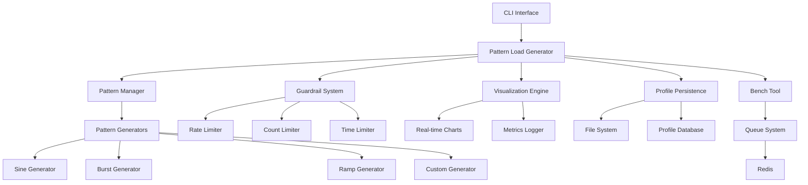
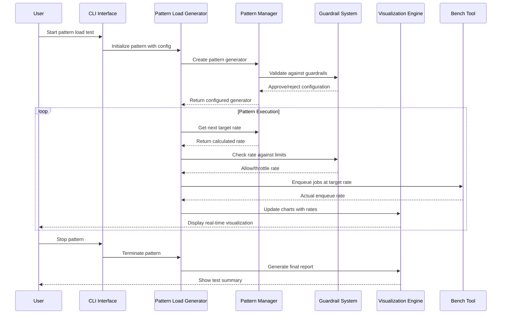

# Patterned Load Generator Design Document
**Feature ID:** F030
**Version:** 1.0
**Last Updated:** 2024-01-15
**Author:** System Architect

## Executive Summary

The Patterned Load Generator extends the existing bench tool to support sophisticated traffic patterns including sine waves, bursts, and ramps. This enhancement transforms basic load testing into realistic traffic simulation, enabling teams to validate system behavior under production-like conditions with built-in guardrails and live visualization.

The system addresses three critical testing needs: realistic traffic pattern simulation for production validation, controlled load testing with safety mechanisms, and comprehensive visualization for understanding system behavior under various load conditions. By building upon the existing bench infrastructure, this feature provides enterprise-grade load testing capabilities with minimal implementation overhead.

### Key Benefits

- **Realistic Traffic Simulation**: Model real-world traffic patterns including daily cycles, flash sales, and gradual rollouts
- **Safety-First Design**: Built-in guardrails prevent accidental system overload
- **Visual Feedback**: Real-time charts showing target vs actual load patterns
- **Profile Management**: Save and reload load test configurations for consistent testing
- **Integration Ready**: Seamless integration with existing bench tool and monitoring systems

## System Architecture

### High-Level Architecture



### Component Interaction Flow



### Core Components

#### 1. Pattern Manager

The central orchestrator for all load pattern generation:

```go
type PatternManager struct {
    activePattern  Pattern
    config         *PatternConfig
    state          *PatternState
    metrics        *PatternMetrics
    eventBus       *EventBus
    guardrails     *GuardrailSystem
}

type PatternConfig struct {
    Type           PatternType     `json:"type"`
    Duration       time.Duration   `json:"duration"`
    BaseRate       float64         `json:"base_rate"`
    MaxRate        float64         `json:"max_rate"`
    Amplitude      float64         `json:"amplitude"`
    Period         time.Duration   `json:"period,omitempty"`
    Phases         []PatternPhase  `json:"phases,omitempty"`
    Guardrails     GuardrailConfig `json:"guardrails"`
    Visualization  VisualizationConfig `json:"visualization"`
}

type PatternType string

const (
    PatternSine     PatternType = "sine"
    PatternBurst    PatternType = "burst"
    PatternRamp     PatternType = "ramp"
    PatternStaircase PatternType = "staircase"
    PatternCustom   PatternType = "custom"
    PatternChaos    PatternType = "chaos"
)
```

#### 2. Pattern Generators

Specialized generators for different traffic patterns:

```go
type Pattern interface {
    GetRate(elapsed time.Duration) float64
    GetDuration() time.Duration
    GetMetadata() PatternMetadata
    Validate() error
    Reset()
}

type SinePattern struct {
    BaseRate  float64       `json:"base_rate"`
    Amplitude float64       `json:"amplitude"`
    Period    time.Duration `json:"period"`
    Duration  time.Duration `json:"duration"`
    Phase     float64       `json:"phase"`
}

func (sp *SinePattern) GetRate(elapsed time.Duration) float64 {
    if elapsed > sp.Duration {
        return 0
    }

    // Calculate sine wave: base + amplitude * sin(2π * time / period + phase)
    t := elapsed.Seconds()
    periodSeconds := sp.Period.Seconds()
    sineValue := math.Sin(2*math.Pi*t/periodSeconds + sp.Phase)

    rate := sp.BaseRate + sp.Amplitude*sineValue
    return math.Max(0, rate) // Ensure non-negative
}

type BurstPattern struct {
    BaseRate     float64       `json:"base_rate"`
    BurstRate    float64       `json:"burst_rate"`
    BurstDuration time.Duration `json:"burst_duration"`
    BurstInterval time.Duration `json:"burst_interval"`
    Duration     time.Duration `json:"duration"`
}

func (bp *BurstPattern) GetRate(elapsed time.Duration) float64 {
    if elapsed > bp.Duration {
        return 0
    }

    // Calculate position within burst cycle
    cyclePosition := elapsed % bp.BurstInterval

    if cyclePosition < bp.BurstDuration {
        return bp.BurstRate
    }
    return bp.BaseRate
}

type RampPattern struct {
    StartRate    float64       `json:"start_rate"`
    EndRate      float64       `json:"end_rate"`
    Duration     time.Duration `json:"duration"`
    RampType     RampType      `json:"ramp_type"`
}

type RampType string

const (
    RampLinear      RampType = "linear"
    RampExponential RampType = "exponential"
    RampLogarithmic RampType = "logarithmic"
)

func (rp *RampPattern) GetRate(elapsed time.Duration) float64 {
    if elapsed > rp.Duration {
        return rp.EndRate
    }

    progress := elapsed.Seconds() / rp.Duration.Seconds()

    switch rp.RampType {
    case RampLinear:
        return rp.StartRate + (rp.EndRate-rp.StartRate)*progress
    case RampExponential:
        // Exponential interpolation
        factor := math.Pow(rp.EndRate/rp.StartRate, progress)
        return rp.StartRate * factor
    case RampLogarithmic:
        // Logarithmic interpolation
        logProgress := math.Log(1 + progress*9) / math.Log(10) // 0 to 1 mapping
        return rp.StartRate + (rp.EndRate-rp.StartRate)*logProgress
    default:
        return rp.StartRate + (rp.EndRate-rp.StartRate)*progress
    }
}
```

#### 3. Guardrail System

Safety mechanisms to prevent system overload:

```go
type GuardrailSystem struct {
    config     GuardrailConfig
    state      *GuardrailState
    violations []GuardrailViolation
    emergency  *EmergencyBreaker
}

type GuardrailConfig struct {
    MaxRate          float64       `json:"max_rate"`
    MaxTotalJobs     int64         `json:"max_total_jobs"`
    MaxDuration      time.Duration `json:"max_duration"`
    MaxMemoryMB      int64         `json:"max_memory_mb"`
    MaxCPUPercent    float64       `json:"max_cpu_percent"`
    RateLimitWindow  time.Duration `json:"rate_limit_window"`
    EmergencyStop    bool          `json:"emergency_stop"`
    WarnThresholds   WarnThresholds `json:"warn_thresholds"`
}

type WarnThresholds struct {
    RateWarning     float64 `json:"rate_warning"`     // 80% of max rate
    MemoryWarning   float64 `json:"memory_warning"`   // 80% of max memory
    CPUWarning      float64 `json:"cpu_warning"`      // 70% of max CPU
    QueueDepthWarn  int64   `json:"queue_depth_warn"` // Queue depth warning
}

func (gs *GuardrailSystem) CheckRate(targetRate float64) (allowedRate float64, violation *GuardrailViolation) {
    if targetRate <= gs.config.MaxRate {
        return targetRate, nil
    }

    violation = &GuardrailViolation{
        Type:      ViolationMaxRate,
        Requested: targetRate,
        Allowed:   gs.config.MaxRate,
        Timestamp: time.Now(),
        Severity:  SeverityError,
    }

    return gs.config.MaxRate, violation
}

type EmergencyBreaker struct {
    triggered bool
    reason    string
    timestamp time.Time
    recovery  *RecoveryConfig
}

func (eb *EmergencyBreaker) TriggerEmergencyStop(reason string) {
    eb.triggered = true
    eb.reason = reason
    eb.timestamp = time.Now()

    // Log emergency stop
    log.Errorf("EMERGENCY STOP TRIGGERED: %s", reason)

    // Notify monitoring systems
    metrics.Counter("emergency_stops_total").Inc()

    // Potentially notify external systems
    if eb.recovery.NotifyOnStop {
        eb.notifyExternalSystems(reason)
    }
}
```

#### 4. Visualization Engine

Real-time charts and metrics display:

```go
type VisualizationEngine struct {
    charts     map[string]*Chart
    metrics    *MetricsCollector
    renderer   *ChartRenderer
    config     VisualizationConfig
    buffers    map[string]*RingBuffer
}

type VisualizationConfig struct {
    UpdateInterval    time.Duration `json:"update_interval"`
    HistoryDuration   time.Duration `json:"history_duration"`
    ChartTypes        []ChartType   `json:"chart_types"`
    RealTimeEnabled   bool          `json:"real_time_enabled"`
    ExportEnabled     bool          `json:"export_enabled"`
    ResolutionWidth   int           `json:"resolution_width"`
    ResolutionHeight  int           `json:"resolution_height"`
}

type ChartType string

const (
    ChartTargetVsActual   ChartType = "target_vs_actual"
    ChartQueueDepth      ChartType = "queue_depth"
    ChartSystemMetrics   ChartType = "system_metrics"
    ChartErrorRate       ChartType = "error_rate"
    ChartLatency         ChartType = "latency"
)

type Chart struct {
    Type       ChartType              `json:"type"`
    Title      string                 `json:"title"`
    Series     map[string]*DataSeries `json:"series"`
    XAxis      AxisConfig             `json:"x_axis"`
    YAxis      AxisConfig             `json:"y_axis"`
    UpdateTime time.Time              `json:"update_time"`
}

type DataSeries struct {
    Name   string       `json:"name"`
    Color  string       `json:"color"`
    Style  LineStyle    `json:"style"`
    Points []DataPoint  `json:"points"`
}

type DataPoint struct {
    Timestamp time.Time `json:"timestamp"`
    Value     float64   `json:"value"`
}

func (ve *VisualizationEngine) UpdateCharts(metrics PatternMetrics) {
    now := time.Now()

    // Update target vs actual rate chart
    targetChart := ve.charts[string(ChartTargetVsActual)]
    targetChart.Series["target"].Points = append(
        targetChart.Series["target"].Points,
        DataPoint{Timestamp: now, Value: metrics.TargetRate},
    )
    targetChart.Series["actual"].Points = append(
        targetChart.Series["actual"].Points,
        DataPoint{Timestamp: now, Value: metrics.ActualRate},
    )

    // Update queue depth chart
    queueChart := ve.charts[string(ChartQueueDepth)]
    queueChart.Series["depth"].Points = append(
        queueChart.Series["depth"].Points,
        DataPoint{Timestamp: now, Value: float64(metrics.QueueDepth)},
    )

    // Trim old data points
    ve.trimOldData(now)

    // Trigger chart re-rendering
    ve.renderer.ScheduleUpdate()
}
```

### Profile Management System

#### 1. Profile Storage

```go
type ProfileManager struct {
    storage    ProfileStorage
    cache      *ProfileCache
    validator  *ProfileValidator
    encryptor  *ProfileEncryptor
}

type LoadTestProfile struct {
    ID          string            `json:"id"`
    Name        string            `json:"name"`
    Description string            `json:"description"`
    Version     string            `json:"version"`
    CreatedAt   time.Time         `json:"created_at"`
    UpdatedAt   time.Time         `json:"updated_at"`
    CreatedBy   string            `json:"created_by"`
    Tags        []string          `json:"tags"`
    Pattern     PatternConfig     `json:"pattern"`
    Guardrails  GuardrailConfig   `json:"guardrails"`
    JobConfig   JobConfiguration  `json:"job_config"`
    Metadata    ProfileMetadata   `json:"metadata"`
}

type JobConfiguration struct {
    Queue       string                 `json:"queue"`
    Payload     map[string]interface{} `json:"payload"`
    Priority    int                    `json:"priority"`
    Delay       time.Duration          `json:"delay"`
    Retry       RetryConfig            `json:"retry"`
    Timeout     time.Duration          `json:"timeout"`
}

type ProfileMetadata struct {
    Environment    string            `json:"environment"`
    Purpose        string            `json:"purpose"`
    ExpectedLoad   string            `json:"expected_load"`
    Dependencies   []string          `json:"dependencies"`
    Compatibility  []string          `json:"compatibility"`
    CustomFields   map[string]string `json:"custom_fields"`
}
```

#### 2. Profile Operations

```go
func (pm *ProfileManager) SaveProfile(profile *LoadTestProfile) error {
    // Validate profile
    if err := pm.validator.ValidateProfile(profile); err != nil {
        return fmt.Errorf("profile validation failed: %w", err)
    }

    // Encrypt sensitive data
    encrypted, err := pm.encryptor.EncryptProfile(profile)
    if err != nil {
        return fmt.Errorf("profile encryption failed: %w", err)
    }

    // Generate ID if not provided
    if profile.ID == "" {
        profile.ID = generateProfileID(profile.Name)
    }

    // Update timestamps
    now := time.Now()
    if profile.CreatedAt.IsZero() {
        profile.CreatedAt = now
    }
    profile.UpdatedAt = now

    // Save to storage
    if err := pm.storage.SaveProfile(encrypted); err != nil {
        return fmt.Errorf("profile storage failed: %w", err)
    }

    // Update cache
    pm.cache.SetProfile(profile.ID, profile)

    return nil
}

func (pm *ProfileManager) LoadProfile(profileID string) (*LoadTestProfile, error) {
    // Check cache first
    if cached, ok := pm.cache.GetProfile(profileID); ok {
        return cached, nil
    }

    // Load from storage
    encrypted, err := pm.storage.LoadProfile(profileID)
    if err != nil {
        return nil, fmt.Errorf("profile not found: %w", err)
    }

    // Decrypt profile
    profile, err := pm.encryptor.DecryptProfile(encrypted)
    if err != nil {
        return nil, fmt.Errorf("profile decryption failed: %w", err)
    }

    // Cache for future use
    pm.cache.SetProfile(profileID, profile)

    return profile, nil
}
```

### Integration with Existing Systems

#### 1. Bench Tool Integration

```go
type PattternBenchAdapter struct {
    benchTool      *BenchTool
    patternGen     Pattern
    guardrails     *GuardrailSystem
    metrics        *PatternMetrics
    stopChan       chan struct{}
    rateLimiter    *rate.Limiter
}

func (pba *PattternBenchAdapter) RunPattern(config PatternConfig) error {
    // Create pattern generator
    pattern, err := CreatePattern(config)
    if err != nil {
        return fmt.Errorf("failed to create pattern: %w", err)
    }

    // Initialize rate limiter
    pba.rateLimiter = rate.NewLimiter(rate.Limit(config.MaxRate), 1)

    // Start pattern execution
    ticker := time.NewTicker(100 * time.Millisecond) // 10 Hz update rate
    defer ticker.Stop()

    startTime := time.Now()

    for {
        select {
        case <-pba.stopChan:
            return nil
        case <-ticker.C:
            elapsed := time.Since(startTime)

            // Get target rate from pattern
            targetRate := pattern.GetRate(elapsed)

            // Apply guardrails
            allowedRate, violation := pba.guardrails.CheckRate(targetRate)
            if violation != nil {
                pba.handleViolation(violation)
            }

            // Update rate limiter
            pba.rateLimiter.SetLimit(rate.Limit(allowedRate))

            // Enqueue jobs at target rate
            actualRate := pba.enqueueAtRate(allowedRate)

            // Update metrics
            pba.metrics.RecordRates(targetRate, allowedRate, actualRate)

            // Check if pattern is complete
            if elapsed >= pattern.GetDuration() {
                return nil
            }
        }
    }
}

func (pba *PattternBenchAdapter) enqueueAtRate(targetRate float64) float64 {
    if targetRate <= 0 {
        return 0
    }

    // Calculate jobs to enqueue this tick
    tickDuration := 100 * time.Millisecond
    jobsThisTick := int(targetRate * tickDuration.Seconds())

    actualJobs := 0
    for i := 0; i < jobsThisTick; i++ {
        if pba.rateLimiter.Allow() {
            if err := pba.benchTool.EnqueueJob(); err == nil {
                actualJobs++
            }
        }
    }

    // Convert back to rate
    return float64(actualJobs) / tickDuration.Seconds()
}
```

#### 2. Queue System Integration

```go
type QueueIntegration struct {
    queueClient    QueueClient
    monitor        *QueueMonitor
    healthChecker  *HealthChecker
}

func (qi *QueueIntegration) MonitorQueueHealth() *QueueHealth {
    return &QueueHealth{
        QueueDepth:       qi.queueClient.GetQueueDepth(),
        ProcessingRate:   qi.monitor.GetProcessingRate(),
        ErrorRate:        qi.monitor.GetErrorRate(),
        MemoryUsage:      qi.monitor.GetMemoryUsage(),
        CPUUsage:         qi.monitor.GetCPUUsage(),
        ConnectionStatus: qi.healthChecker.IsHealthy(),
        Timestamp:        time.Now(),
    }
}
```

## API Specification

### Core Pattern Management Endpoints

#### POST /api/v1/load-test/patterns/start
Start a patterned load test.

**Request Body:**
```json
{
  "pattern": {
    "type": "sine",
    "duration": "5m",
    "base_rate": 10.0,
    "max_rate": 100.0,
    "amplitude": 50.0,
    "period": "1m"
  },
  "guardrails": {
    "max_rate": 100.0,
    "max_total_jobs": 5000,
    "max_duration": "10m"
  },
  "job_config": {
    "queue": "test-queue",
    "payload": {"test": true},
    "priority": 1
  },
  "save_profile": true,
  "profile_name": "daily-traffic-simulation"
}
```

**Response:**
```json
{
  "test_id": "test_123456",
  "status": "running",
  "pattern": {
    "type": "sine",
    "estimated_duration": "5m",
    "estimated_jobs": 1500
  },
  "websocket_url": "ws://localhost:8080/api/v1/load-test/stream/test_123456"
}
```

#### GET /api/v1/load-test/patterns/{testId}/status
Get current test status and metrics.

#### POST /api/v1/load-test/patterns/{testId}/stop
Stop a running load test.

#### GET /api/v1/load-test/patterns/{testId}/metrics
Get detailed test metrics and visualization data.

### Profile Management Endpoints

#### GET /api/v1/load-test/profiles
List available load test profiles.

#### POST /api/v1/load-test/profiles
Create a new load test profile.

#### GET /api/v1/load-test/profiles/{profileId}
Get profile details.

#### PUT /api/v1/load-test/profiles/{profileId}
Update an existing profile.

#### DELETE /api/v1/load-test/profiles/{profileId}
Delete a profile.

#### POST /api/v1/load-test/profiles/{profileId}/run
Run a load test from a saved profile.

### Real-time Streaming

#### WebSocket: /api/v1/load-test/stream/{testId}
Real-time updates for pattern execution.

**Message Types:**
- `rate_update`: Current target and actual rates
- `metrics_update`: System metrics (CPU, memory, queue depth)
- `violation`: Guardrail violations
- `completion`: Test completion status

## Data Models

### Core Pattern Schemas

```json
{
  "$schema": "http://json-schema.org/draft-07/schema#",
  "title": "Patterned Load Generator Data Models",
  "definitions": {
    "PatternConfig": {
      "type": "object",
      "required": ["type", "duration", "base_rate"],
      "properties": {
        "type": {
          "type": "string",
          "enum": ["sine", "burst", "ramp", "staircase", "custom", "chaos"]
        },
        "duration": {
          "type": "string",
          "pattern": "^\\d+[smh]$",
          "description": "Pattern duration (e.g., 5m, 1h)"
        },
        "base_rate": {
          "type": "number",
          "minimum": 0,
          "description": "Base rate in jobs per second"
        },
        "max_rate": {
          "type": "number",
          "minimum": 0,
          "description": "Maximum rate in jobs per second"
        },
        "amplitude": {
          "type": "number",
          "minimum": 0,
          "description": "Pattern amplitude for sine waves"
        },
        "period": {
          "type": "string",
          "pattern": "^\\d+[smh]$",
          "description": "Pattern period for repeating patterns"
        },
        "phases": {
          "type": "array",
          "items": {
            "$ref": "#/definitions/PatternPhase"
          },
          "description": "Custom pattern phases"
        }
      }
    },

    "GuardrailConfig": {
      "type": "object",
      "properties": {
        "max_rate": {
          "type": "number",
          "minimum": 0,
          "description": "Maximum allowed rate (jobs/sec)"
        },
        "max_total_jobs": {
          "type": "integer",
          "minimum": 0,
          "description": "Maximum total jobs to enqueue"
        },
        "max_duration": {
          "type": "string",
          "pattern": "^\\d+[smh]$",
          "description": "Maximum test duration"
        },
        "max_memory_mb": {
          "type": "integer",
          "minimum": 0,
          "description": "Maximum memory usage in MB"
        },
        "max_cpu_percent": {
          "type": "number",
          "minimum": 0,
          "maximum": 100,
          "description": "Maximum CPU usage percentage"
        },
        "emergency_stop": {
          "type": "boolean",
          "default": true,
          "description": "Enable emergency stop on violations"
        }
      }
    }
  }
}
```

## Security Model

### Threat Analysis

#### 1. Resource Exhaustion Attacks

**Threat**: Malicious patterns designed to overwhelm system resources
**Mitigation**:
- Hard-coded maximum rate limits
- CPU and memory monitoring with automatic shutoff
- Queue depth monitoring with backpressure
- Time-based circuit breakers

#### 2. Denial of Service

**Threat**: Runaway load tests affecting production systems
**Mitigation**:
- Mandatory guardrails with no override capability
- Environment-specific rate limits
- Automatic emergency stops
- Admin-only access to high-rate patterns

#### 3. Sensitive Data Exposure

**Threat**: Test profiles containing sensitive configuration data
**Mitigation**:
- Profile encryption at rest
- Secure profile sharing mechanisms
- Access control for profile management
- Audit logging of profile operations

### Security Controls

#### 1. Rate Limiting Architecture

```go
type SecurityRateLimiter struct {
    hardLimits     map[string]float64  // Environment-specific hard limits
    userLimits     map[string]float64  // Per-user rate limits
    systemLimiter  *rate.Limiter       // Global system rate limiter
    monitoring     *SecurityMonitor
}

func (srl *SecurityRateLimiter) ValidateRate(env string, user string, requestedRate float64) error {
    // Check hard environment limits (cannot be overridden)
    if hardLimit, exists := srl.hardLimits[env]; exists {
        if requestedRate > hardLimit {
            return fmt.Errorf("rate exceeds environment limit: %.2f > %.2f",
                             requestedRate, hardLimit)
        }
    }

    // Check user-specific limits
    if userLimit, exists := srl.userLimits[user]; exists {
        if requestedRate > userLimit {
            return fmt.Errorf("rate exceeds user limit: %.2f > %.2f",
                             requestedRate, userLimit)
        }
    }

    // Check system-wide rate
    if !srl.systemLimiter.Allow() {
        return fmt.Errorf("system rate limit exceeded")
    }

    return nil
}
```

#### 2. Profile Security

```go
type ProfileSecurity struct {
    encryptor     *AESEncryptor
    accessControl *RBACManager
    auditLogger   *AuditLogger
}

func (ps *ProfileSecurity) SecureProfile(profile *LoadTestProfile, user string) error {
    // Check access permissions
    if !ps.accessControl.CanCreateProfile(user) {
        return fmt.Errorf("user %s not authorized to create profiles", user)
    }

    // Encrypt sensitive fields
    if err := ps.encryptor.EncryptSensitiveFields(profile); err != nil {
        return fmt.Errorf("failed to encrypt profile: %w", err)
    }

    // Log profile creation
    ps.auditLogger.LogProfileCreation(user, profile.ID, profile.Name)

    return nil
}
```

## Performance Requirements

### Latency Requirements

| Operation | Target | Maximum |
|-----------|---------|---------|
| Pattern rate calculation | < 1ms | < 5ms |
| Guardrail validation | < 2ms | < 10ms |
| Chart update | < 50ms | < 200ms |
| Profile load/save | < 100ms | < 500ms |
| WebSocket message | < 10ms | < 50ms |

### Throughput Requirements

- **Pattern Generation**: Support up to 10,000 jobs/second target rate
- **Concurrent Tests**: Handle 10 simultaneous pattern tests
- **Profile Storage**: Store and retrieve 1,000+ profiles efficiently
- **Metrics Collection**: Process 100 metrics/second without performance degradation

### Resource Constraints

- **CPU Usage**: Pattern generation should use < 5% CPU at maximum rates
- **Memory Usage**: < 100MB for pattern execution, < 50MB for visualization
- **Network**: WebSocket updates < 1KB/message, < 100 messages/second

### Performance Monitoring

```go
type PerformanceMonitor struct {
    metrics map[string]*prometheus.HistogramVec
    alerts  *AlertManager
}

func (pm *PerformanceMonitor) RecordPatternGeneration(duration time.Duration) {
    pm.metrics["pattern_generation_duration"].WithLabelValues().Observe(duration.Seconds())

    if duration > 5*time.Millisecond {
        pm.alerts.TriggerAlert("pattern_generation_slow", map[string]string{
            "duration": duration.String(),
        })
    }
}
```

## Testing Strategy

### Unit Testing

#### 1. Pattern Generator Tests

```go
func TestSinePattern_GetRate(t *testing.T) {
    pattern := &SinePattern{
        BaseRate:  10.0,
        Amplitude: 5.0,
        Period:    time.Minute,
        Duration:  time.Minute * 5,
    }

    tests := []struct {
        elapsed  time.Duration
        expected float64
        tolerance float64
    }{
        {0, 10.0, 0.1},                    // At start, should be base rate
        {time.Second * 15, 15.0, 0.1},    // At quarter period, should be max
        {time.Second * 30, 10.0, 0.1},    // At half period, should be base
        {time.Second * 45, 5.0, 0.1},     // At three-quarter, should be min
        {time.Minute, 10.0, 0.1},         // At full period, back to base
    }

    for _, tt := range tests {
        t.Run(fmt.Sprintf("elapsed_%v", tt.elapsed), func(t *testing.T) {
            actual := pattern.GetRate(tt.elapsed)
            if math.Abs(actual-tt.expected) > tt.tolerance {
                t.Errorf("GetRate(%v) = %v, want %v±%v",
                        tt.elapsed, actual, tt.expected, tt.tolerance)
            }
        })
    }
}
```

#### 2. Guardrail Tests

```go
func TestGuardrailSystem_CheckRate(t *testing.T) {
    gs := &GuardrailSystem{
        config: GuardrailConfig{
            MaxRate:      100.0,
            MaxTotalJobs: 5000,
        },
    }

    tests := []struct {
        name         string
        requestedRate float64
        expectRate   float64
        expectViolation bool
    }{
        {"within_limit", 50.0, 50.0, false},
        {"at_limit", 100.0, 100.0, false},
        {"exceeds_limit", 150.0, 100.0, true},
    }

    for _, tt := range tests {
        t.Run(tt.name, func(t *testing.T) {
            rate, violation := gs.CheckRate(tt.requestedRate)

            assert.Equal(t, tt.expectRate, rate)
            assert.Equal(t, tt.expectViolation, violation != nil)
        })
    }
}
```

### Integration Testing

#### 1. End-to-End Pattern Execution

```go
func TestPatternExecution_E2E(t *testing.T) {
    // Setup test environment
    testServer := setupTestServer(t)
    defer testServer.Cleanup()

    // Create pattern configuration
    config := PatternConfig{
        Type:     PatternSine,
        Duration: time.Second * 10,
        BaseRate: 5.0,
        Amplitude: 2.0,
        Period:   time.Second * 4,
    }

    // Start pattern test
    response := testServer.StartPattern(config)
    assert.Equal(t, "running", response.Status)

    // Monitor execution for a few seconds
    time.Sleep(time.Second * 3)

    // Check metrics
    metrics := testServer.GetMetrics(response.TestID)
    assert.Greater(t, len(metrics.RateHistory), 20) // Should have data points
    assert.Greater(t, metrics.TotalJobsEnqueued, int64(10)) // Should have enqueued jobs

    // Stop test
    testServer.StopPattern(response.TestID)

    // Verify cleanup
    finalMetrics := testServer.GetMetrics(response.TestID)
    assert.Equal(t, "completed", finalMetrics.Status)
}
```

#### 2. Profile Persistence Testing

```go
func TestProfilePersistence(t *testing.T) {
    pm := NewProfileManager()

    // Create test profile
    profile := &LoadTestProfile{
        Name:        "test-profile",
        Description: "Test profile for integration testing",
        Pattern: PatternConfig{
            Type:     PatternBurst,
            Duration: time.Minute,
            BaseRate: 10.0,
            BurstRate: 50.0,
        },
    }

    // Save profile
    err := pm.SaveProfile(profile)
    assert.NoError(t, err)
    assert.NotEmpty(t, profile.ID)

    // Load profile
    loaded, err := pm.LoadProfile(profile.ID)
    assert.NoError(t, err)
    assert.Equal(t, profile.Name, loaded.Name)
    assert.Equal(t, profile.Pattern.Type, loaded.Pattern.Type)

    // List profiles
    profiles, err := pm.ListProfiles()
    assert.NoError(t, err)
    assert.Len(t, profiles, 1)

    // Delete profile
    err = pm.DeleteProfile(profile.ID)
    assert.NoError(t, err)

    // Verify deletion
    _, err = pm.LoadProfile(profile.ID)
    assert.Error(t, err)
}
```

### Performance Testing

#### 1. Pattern Generation Benchmarks

```go
func BenchmarkSinePattern_GetRate(b *testing.B) {
    pattern := &SinePattern{
        BaseRate:  10.0,
        Amplitude: 5.0,
        Period:    time.Minute,
        Duration:  time.Hour,
    }

    elapsed := time.Second * 30

    b.ResetTimer()
    for i := 0; i < b.N; i++ {
        _ = pattern.GetRate(elapsed)
    }
}

func BenchmarkGuardrailSystem_CheckRate(b *testing.B) {
    gs := &GuardrailSystem{
        config: GuardrailConfig{MaxRate: 100.0},
    }

    b.ResetTimer()
    for i := 0; i < b.N; i++ {
        _, _ = gs.CheckRate(50.0)
    }
}
```

#### 2. Load Testing

```go
func TestHighRatePatternExecution(t *testing.T) {
    if testing.Short() {
        t.Skip("Skipping load test in short mode")
    }

    config := PatternConfig{
        Type:     PatternRamp,
        Duration: time.Minute,
        StartRate: 100.0,
        EndRate:   1000.0,
    }

    // Monitor system resources
    resourceMonitor := NewResourceMonitor()
    resourceMonitor.Start()
    defer resourceMonitor.Stop()

    // Run high-rate pattern
    testServer := setupTestServer(t)
    response := testServer.StartPattern(config)

    // Wait for completion
    for {
        metrics := testServer.GetMetrics(response.TestID)
        if metrics.Status == "completed" {
            break
        }
        time.Sleep(time.Second)
    }

    // Verify system stayed within limits
    maxCPU := resourceMonitor.GetMaxCPU()
    maxMemory := resourceMonitor.GetMaxMemory()

    assert.Less(t, maxCPU, 80.0, "CPU usage too high during load test")
    assert.Less(t, maxMemory, 500*1024*1024, "Memory usage too high") // 500MB
}
```

### Manual Testing Checklist

#### Pattern Visualization
- [ ] Sine wave pattern displays correctly in charts
- [ ] Burst pattern shows clear spikes
- [ ] Ramp pattern shows smooth transitions
- [ ] Target vs actual rates are clearly distinguishable
- [ ] Charts update in real-time without lag

#### Guardrail Functionality
- [ ] Rate limits are enforced correctly
- [ ] Emergency stop triggers on violations
- [ ] Warning thresholds work as expected
- [ ] System recovers gracefully after limits

#### Profile Management
- [ ] Profiles save and load correctly
- [ ] Profile list displays all saved profiles
- [ ] Profile deletion works properly
- [ ] Profile sharing works across users

#### Error Handling
- [ ] Invalid patterns are rejected with clear messages
- [ ] Network failures are handled gracefully
- [ ] System overload triggers appropriate responses
- [ ] User interface remains responsive during errors

## Deployment Plan

### Phase 1: Core Pattern Engine (Week 1-2)

**Deliverables:**
- Basic pattern generators (sine, burst, ramp)
- Guardrail system with safety limits
- Integration with existing bench tool
- Unit tests for pattern mathematics

**Success Criteria:**
- Patterns generate mathematically correct rates
- Guardrails prevent system overload
- Integration works with existing bench infrastructure

### Phase 2: Visualization and UI (Week 3-4)

**Deliverables:**
- Real-time chart visualization
- WebSocket streaming for live updates
- CLI interface for pattern control
- Basic profile save/load functionality

**Success Criteria:**
- Charts display target vs actual rates accurately
- UI is responsive and intuitive
- Profiles persist correctly across sessions

### Phase 3: Advanced Features (Week 5-6)

**Deliverables:**
- Custom pattern support
- Advanced guardrail configurations
- Profile sharing and import/export
- Enhanced visualization options

**Success Criteria:**
- Users can create custom traffic patterns
- Profile management is fully functional
- Advanced features integrate seamlessly

### Phase 4: Performance and Polish (Week 7-8)

**Deliverables:**
- Performance optimizations
- Comprehensive testing suite
- Documentation and examples
- Production deployment preparation

**Success Criteria:**
- System meets all performance requirements
- All tests pass consistently
- Documentation is complete and accurate

### Rollout Strategy

#### Alpha Release (Internal Testing)
- Development team testing with synthetic patterns
- Performance baseline establishment
- Integration verification with existing systems

#### Beta Release (Limited Users)
- Controlled rollout to power users
- Real-world pattern testing
- Feedback collection and iteration

#### General Availability
- Full feature rollout
- Complete documentation
- Training materials and examples

### Monitoring and Success Metrics

#### Usage Metrics
- Number of pattern tests run per day
- Most popular pattern types
- Average test duration
- Profile creation and sharing rates

#### Performance Metrics
- Pattern generation latency
- Chart rendering performance
- WebSocket message delivery times
- System resource usage during tests

#### Quality Metrics
- Pattern accuracy (target vs actual rates)
- Guardrail effectiveness
- Error rates and recovery times
- User satisfaction scores

#### Success Criteria
- 90% of pattern tests complete successfully
- < 5% deviation between target and actual rates
- 100% guardrail effectiveness (no system overloads)
- User adoption rate > 70% within 3 months

---

**Document Status:** Complete
**Review Required:** Architecture Team, Performance Team, Security Team
**Next Steps:** Proceed with Phase 1 implementation after approval