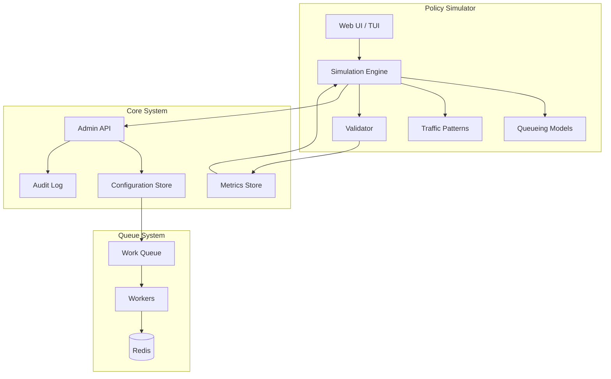
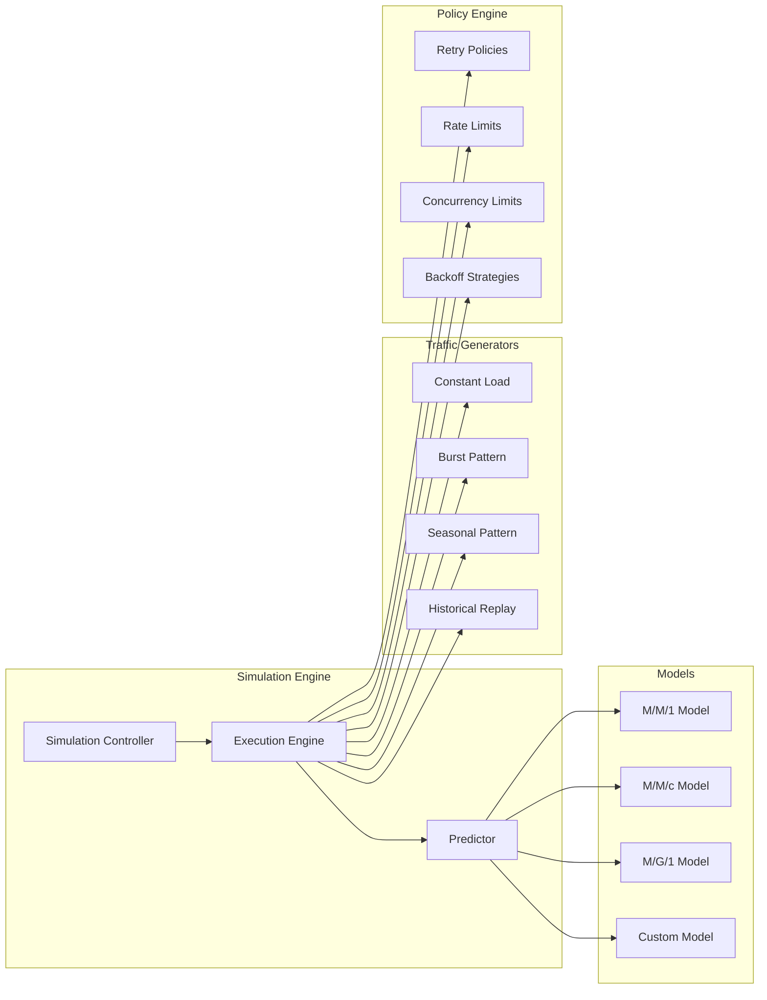
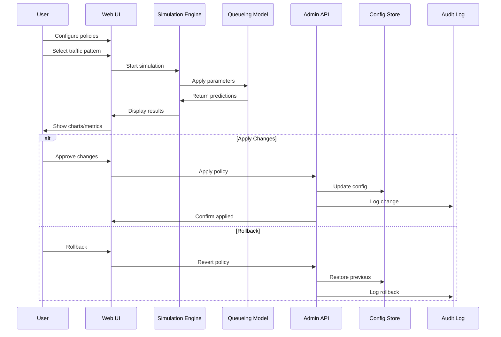

# Policy Simulator Design Document

## Executive Summary

The Policy Simulator provides a "what-if" analysis tool that allows operators to preview the impact of policy changes (retry/backoff, rate limits, concurrency) before applying them to production systems. This feature implements a first-order queueing model with configurable traffic patterns to predict backlog, throughput, and latency changes.

### Key Features
- **Interactive simulation**: Real-time policy impact visualization
- **Multiple traffic patterns**: Constant, burst, seasonal, and custom load profiles
- **Queueing theory models**: M/M/1, M/M/c, and M/G/1 implementations
- **Safe deployment**: Apply/rollback via Admin API with full audit trails
- **Risk assessment**: Confidence intervals and assumption validation
- **Integration ready**: Works with existing monitoring and alerting systems

### Business Value
- **Prevent outages**: Test risky changes before deployment
- **Optimize performance**: Fine-tune policies based on predicted outcomes
- **Reduce MTTR**: Quickly validate remediation strategies during incidents
- **Compliance**: Document change impact for audit requirements

## System Architecture

### High-Level Architecture



### Component Architecture



### Data Flow



## Queueing Theory Models

### M/M/1 Model (Single Server)

**Assumptions:**
- Poisson arrival process (λ)
- Exponential service times (μ)
- Single server
- Infinite buffer capacity
- FIFO scheduling

**Key Metrics:**
```
ρ = λ/μ (utilization)
L = ρ/(1-ρ) (average queue length)
W = 1/(μ-λ) (average wait time)
Wq = ρ/(μ-λ) (average queue wait time)
```

**Stability Condition:** λ < μ (ρ < 1)

### M/M/c Model (Multiple Servers)

**Extensions for multiple workers:**
```
ρ = λ/(c·μ) (per-server utilization)
P0 = [Σ(n=0 to c-1) (ρc)^n/n! + (ρc)^c/(c!(1-ρ))]^(-1)
Lq = P0 · (ρc)^c · ρ / (c! · (1-ρ)^2)
L = Lq + c·ρ
```

**Stability Condition:** λ < c·μ (ρ < 1)

### M/G/1 Model (General Service Times)

**For non-exponential service distributions:**
```
ρ = λ·E[S] (utilization)
Lq = λ²·E[S²] / (2(1-ρ))
L = ρ + Lq
W = L/λ
```

**Includes variance effects via Pollaczek-Khinchine formula**

## Traffic Pattern Models

### Constant Load Pattern
```go
type ConstantPattern struct {
    Rate     float64 // requests per second
    Duration time.Duration
}

func (p *ConstantPattern) Generate(t time.Time) float64 {
    return p.Rate
}
```

### Burst Pattern
```go
type BurstPattern struct {
    BaseRate    float64
    BurstRate   float64
    BurstDuration time.Duration
    BurstInterval time.Duration
}

func (p *BurstPattern) Generate(t time.Time) float64 {
    cyclePos := t.Nanoseconds() % p.BurstInterval.Nanoseconds()
    if cyclePos < p.BurstDuration.Nanoseconds() {
        return p.BurstRate
    }
    return p.BaseRate
}
```

### Seasonal Pattern
```go
type SeasonalPattern struct {
    BaseRate  float64
    Amplitude float64
    Period    time.Duration
    Phase     time.Duration
}

func (p *SeasonalPattern) Generate(t time.Time) float64 {
    phase := float64(t.Add(p.Phase).Nanoseconds()) / float64(p.Period.Nanoseconds())
    seasonal := math.Sin(2 * math.Pi * phase)
    return p.BaseRate + p.Amplitude*seasonal
}
```

### Historical Replay Pattern
```go
type ReplayPattern struct {
    Timestamps []time.Time
    Rates      []float64
    StartTime  time.Time
}

func (p *ReplayPattern) Generate(t time.Time) float64 {
    elapsed := t.Sub(p.StartTime)
    // Interpolate from historical data
    return p.interpolate(elapsed)
}
```

## Policy Configuration

### Retry Policies
```yaml
retry_policy:
  max_attempts: 3
  initial_delay: "100ms"
  max_delay: "30s"
  multiplier: 2.0
  jitter: 0.1
  retry_codes: [500, 502, 503, 504]
```

### Rate Limiting
```yaml
rate_limit:
  requests_per_second: 100
  burst_capacity: 200
  algorithm: "token_bucket"
  enforcement: "strict"
  overflow_action: "queue"
```

### Concurrency Control
```yaml
concurrency:
  max_workers: 10
  scaling_policy: "adaptive"
  scale_up_threshold: 0.8
  scale_down_threshold: 0.3
  scale_cooldown: "60s"
```

### Backoff Strategies
```yaml
backoff:
  strategy: "exponential"
  base_delay: "1s"
  max_delay: "300s"
  multiplier: 2.0
  jitter_type: "uniform"
  jitter_factor: 0.1
```

## Simulation Engine

### Core Algorithm
```
1. Initialize simulation state
2. For each time step:
   a. Generate arrival events based on traffic pattern
   b. Process service completions
   c. Apply policy constraints (rate limits, concurrency)
   d. Update queue state
   e. Record metrics
3. Analyze results and generate predictions
4. Apply confidence intervals
5. Validate against assumptions
```

### Performance Optimizations
- **Event-driven simulation**: Process only significant state changes
- **Vectorized operations**: Batch similar events for efficiency
- **Adaptive time stepping**: Increase resolution during high activity
- **Parallel execution**: Run multiple scenarios concurrently
- **Caching**: Memoize expensive calculations

### Confidence Estimation
```go
type ConfidenceInterval struct {
    Lower      float64 `json:"lower"`
    Upper      float64 `json:"upper"`
    Confidence float64 `json:"confidence"` // 0.95 for 95%
    Method     string  `json:"method"`    // "bootstrap", "analytical"
}

type Prediction struct {
    Metric     string             `json:"metric"`
    Value      float64            `json:"value"`
    Interval   ConfidenceInterval `json:"confidence_interval"`
    Timestamp  time.Time          `json:"timestamp"`
    Assumptions []string          `json:"assumptions"`
}
```

## User Interface Design

### Web UI Components

#### Policy Configuration Panel
```html
<div class="policy-config">
    <h3>Retry Policy</h3>
    <label>Max Attempts: <input type="range" min="1" max="10" value="3"></label>
    <label>Initial Delay: <input type="text" value="100ms"></label>
    <label>Max Delay: <input type="text" value="30s"></label>
    <label>Multiplier: <input type="range" min="1" max="5" step="0.1" value="2.0"></label>

    <h3>Rate Limiting</h3>
    <label>Requests/sec: <input type="range" min="1" max="1000" value="100"></label>
    <label>Burst Capacity: <input type="range" min="1" max="2000" value="200"></label>

    <h3>Concurrency</h3>
    <label>Max Workers: <input type="range" min="1" max="100" value="10"></label>
</div>
```

#### Traffic Pattern Selector
```html
<div class="traffic-pattern">
    <select name="pattern-type">
        <option value="constant">Constant Load</option>
        <option value="burst">Burst Pattern</option>
        <option value="seasonal">Seasonal</option>
        <option value="replay">Historical Replay</option>
    </select>

    <div class="pattern-config" id="constant-config">
        <label>Rate (req/s): <input type="number" value="50"></label>
        <label>Duration: <input type="text" value="1h"></label>
    </div>
</div>
```

#### Prediction Charts
```html
<div class="charts-container">
    <div class="chart" id="backlog-chart">
        <h4>Queue Backlog</h4>
        <canvas id="backlog-canvas"></canvas>
    </div>

    <div class="chart" id="throughput-chart">
        <h4>Throughput</h4>
        <canvas id="throughput-canvas"></canvas>
    </div>

    <div class="chart" id="latency-chart">
        <h4>Response Latency</h4>
        <canvas id="latency-canvas"></canvas>
    </div>

    <div class="chart" id="utilization-chart">
        <h4>Worker Utilization</h4>
        <canvas id="utilization-canvas"></canvas>
    </div>
</div>
```

### TUI Integration
```
┌─ Policy Simulator ─────────────────────────────────────────────────┐
│                                                                    │
│ ┌─ Configuration ──────┐  ┌─ Traffic Pattern ────────────────────┐ │
│ │ Retry Policy         │  │ Type: [Burst          ▼]            │ │
│ │ Max Attempts: [3    ]│  │ Base Rate: [50   ] req/s            │ │
│ │ Initial: [100ms    ] │  │ Burst Rate: [200 ] req/s            │ │
│ │ Multiplier: [2.0   ] │  │ Burst Duration: [10s]               │ │
│ │                      │  │ Burst Interval: [60s]               │ │
│ │ Rate Limiting        │  └─────────────────────────────────────┘ │
│ │ Rate: [100] req/s    │                                          │
│ │ Burst: [200]         │  ┌─ Simulation Results ─────────────────┐ │
│ │                      │  │ Queue Backlog:     ████████░░  45    │ │
│ │ Concurrency          │  │ Throughput:        ██████████  98/s  │ │
│ │ Workers: [10]        │  │ Avg Latency:       ███░░░░░░░  125ms │ │
│ └──────────────────────┘  │ Worker Util:       ██████░░░░  78%   │ │
│                           └─────────────────────────────────────┘ │
│                                                                    │
│ [Simulate] [Apply Changes] [Export Results] [Reset]               │
└────────────────────────────────────────────────────────────────────┘
```

## Integration Points

### Admin API Integration

#### Simulation Endpoints
```yaml
/api/v1/simulation:
  post:
    summary: Create new simulation
    requestBody:
      required: true
      content:
        application/json:
          schema:
            $ref: '#/components/schemas/SimulationRequest'
    responses:
      201:
        description: Simulation created
        content:
          application/json:
            schema:
              $ref: '#/components/schemas/SimulationResponse'

/api/v1/simulation/{id}:
  get:
    summary: Get simulation results
    responses:
      200:
        description: Simulation results
        content:
          application/json:
            schema:
              $ref: '#/components/schemas/SimulationResults'

/api/v1/simulation/{id}/apply:
  post:
    summary: Apply simulated policies
    responses:
      200:
        description: Policies applied successfully
```

#### Policy Management Endpoints
```yaml
/api/v1/policies:
  get:
    summary: Get current policies
    responses:
      200:
        description: Current policy configuration
        content:
          application/json:
            schema:
              $ref: '#/components/schemas/PolicyConfiguration'

  put:
    summary: Update policies
    requestBody:
      required: true
      content:
        application/json:
          schema:
            $ref: '#/components/schemas/PolicyConfiguration'
    responses:
      200:
        description: Policies updated

/api/v1/policies/rollback:
  post:
    summary: Rollback to previous policies
    requestBody:
      required: true
      content:
        application/json:
          schema:
            properties:
              rollback_id:
                type: string
    responses:
      200:
        description: Rollback completed
```

### Metrics Integration
```go
// Prometheus metrics collection
var (
    simulationDuration = prometheus.NewHistogramVec(
        prometheus.HistogramOpts{
            Name: "policy_simulation_duration_seconds",
            Help: "Time spent running policy simulations",
        },
        []string{"pattern_type", "model_type"},
    )

    predictionAccuracy = prometheus.NewGaugeVec(
        prometheus.GaugeOpts{
            Name: "policy_prediction_accuracy",
            Help: "Accuracy of simulation predictions",
        },
        []string{"metric_type"},
    )

    policyChanges = prometheus.NewCounterVec(
        prometheus.CounterOpts{
            Name: "policy_changes_total",
            Help: "Total number of policy changes applied",
        },
        []string{"change_type", "source"},
    )
)
```

### Audit Trail Integration
```go
type AuditEvent struct {
    ID          string                 `json:"id"`
    Timestamp   time.Time             `json:"timestamp"`
    UserID      string                `json:"user_id"`
    Action      string                `json:"action"`
    Resource    string                `json:"resource"`
    OldValue    map[string]interface{} `json:"old_value"`
    NewValue    map[string]interface{} `json:"new_value"`
    Simulation  *SimulationSummary    `json:"simulation,omitempty"`
    Result      string                `json:"result"`
    Error       string                `json:"error,omitempty"`
}

type SimulationSummary struct {
    ID               string  `json:"id"`
    Duration         string  `json:"duration"`
    PredictedImpact  float64 `json:"predicted_impact"`
    ConfidenceLevel  float64 `json:"confidence_level"`
    TrafficPattern   string  `json:"traffic_pattern"`
    ModelType        string  `json:"model_type"`
}
```

## Security Model

### Threat Analysis

#### Threat: Malicious Policy Changes
**Risk**: High - Could cause system outage
**Mitigation**:
- Require simulation before any policy change
- Implement approval workflow for high-impact changes
- Rate limit policy modifications
- Comprehensive audit logging

#### Threat: Simulation Resource Exhaustion
**Risk**: Medium - Could impact system performance
**Mitigation**:
- Resource quotas per user/session
- Simulation timeout limits
- Background processing with priorities
- Rate limiting on simulation requests

#### Threat: Information Disclosure
**Risk**: Medium - Simulation results may reveal system internals
**Mitigation**:
- Role-based access control
- Sanitize sensitive metrics
- Audit all simulation access
- Encryption for stored simulation data

#### Threat: Denial of Service via Complex Simulations
**Risk**: Medium - Computationally expensive simulations
**Mitigation**:
- Complexity limits on traffic patterns
- CPU/memory quotas per simulation
- Queue prioritization for simulation jobs
- Automatic termination of long-running simulations

### Access Control

#### Permission Model
```yaml
roles:
  simulator_user:
    permissions:
      - "simulation:create"
      - "simulation:read_own"
      - "policies:read"

  simulator_admin:
    permissions:
      - "simulation:create"
      - "simulation:read_all"
      - "simulation:delete"
      - "policies:read"
      - "policies:apply"

  system_admin:
    permissions:
      - "simulation:*"
      - "policies:*"
      - "audit:read"
```

#### API Authentication
```go
type AuthContext struct {
    UserID      string   `json:"user_id"`
    Roles       []string `json:"roles"`
    Permissions []string `json:"permissions"`
    SessionID   string   `json:"session_id"`
    ExpiresAt   time.Time `json:"expires_at"`
}

func RequirePermission(permission string) middleware.Func {
    return func(c *gin.Context) {
        auth := getAuthContext(c)
        if !hasPermission(auth, permission) {
            c.JSON(403, gin.H{"error": "insufficient permissions"})
            c.Abort()
            return
        }
        c.Next()
    }
}
```

### Data Protection

#### Sensitive Data Handling
```go
type SensitiveMetrics struct {
    // Public metrics - safe to display
    Throughput     float64 `json:"throughput"`
    AverageLatency float64 `json:"average_latency"`
    QueueLength    int     `json:"queue_length"`

    // Sensitive metrics - require elevated access
    ErrorRate      float64 `json:"error_rate,omitempty"`
    P99Latency     float64 `json:"p99_latency,omitempty"`
    ResourceUsage  float64 `json:"resource_usage,omitempty"`
}

func (m *SensitiveMetrics) Sanitize(permissions []string) {
    if !contains(permissions, "metrics:sensitive") {
        m.ErrorRate = 0
        m.P99Latency = 0
        m.ResourceUsage = 0
    }
}
```

## Performance Requirements

### Latency Requirements
- **Simulation startup**: < 1 second
- **Real-time updates**: < 100ms
- **Policy application**: < 5 seconds
- **Results visualization**: < 500ms

### Throughput Requirements
- **Concurrent simulations**: 50+ per server
- **Simulation requests**: 100+ per minute
- **Policy changes**: 10+ per minute
- **Chart updates**: 10Hz refresh rate

### Scalability Targets
- **Simulation duration**: Up to 24 hours simulated time
- **Data points**: 1M+ events per simulation
- **Concurrent users**: 100+ simultaneous
- **Historical data**: 1 year+ retention

### Resource Constraints
```yaml
resource_limits:
  cpu:
    per_simulation: "500m"
    total_pool: "10"
  memory:
    per_simulation: "512Mi"
    total_pool: "8Gi"
  storage:
    simulation_data: "100Gi"
    historical_data: "1Ti"

timeouts:
  simulation_max: "300s"
  api_request: "30s"
  chart_render: "5s"
```

### Performance Monitoring
```go
type PerformanceMetrics struct {
    SimulationLatency    time.Duration `json:"simulation_latency"`
    EventProcessingRate  float64       `json:"events_per_second"`
    MemoryUsage         int64         `json:"memory_bytes"`
    CPUUtilization      float64       `json:"cpu_percent"`
    CacheHitRate        float64       `json:"cache_hit_rate"`
    ConcurrentSimulations int          `json:"concurrent_simulations"`
}
```

## Testing Strategy

### Unit Testing

#### Model Validation Tests
```go
func TestMM1Model(t *testing.T) {
    tests := []struct {
        name     string
        lambda   float64  // arrival rate
        mu       float64  // service rate
        expected QueueMetrics
    }{
        {
            name:   "stable system",
            lambda: 8.0,
            mu:     10.0,
            expected: QueueMetrics{
                Utilization: 0.8,
                AvgQueueLength: 4.0,
                AvgWaitTime: 0.5,
            },
        },
        {
            name:   "high utilization",
            lambda: 9.5,
            mu:     10.0,
            expected: QueueMetrics{
                Utilization: 0.95,
                AvgQueueLength: 19.0,
                AvgWaitTime: 2.0,
            },
        },
    }

    for _, tt := range tests {
        t.Run(tt.name, func(t *testing.T) {
            model := NewMM1Model(tt.lambda, tt.mu)
            result := model.Predict(time.Hour)

            assert.InDelta(t, tt.expected.Utilization, result.Utilization, 0.01)
            assert.InDelta(t, tt.expected.AvgQueueLength, result.AvgQueueLength, 0.1)
            assert.InDelta(t, tt.expected.AvgWaitTime, result.AvgWaitTime, 0.05)
        })
    }
}
```

#### Traffic Pattern Tests
```go
func TestBurstPattern(t *testing.T) {
    pattern := &BurstPattern{
        BaseRate:      50.0,
        BurstRate:     200.0,
        BurstDuration: 10 * time.Second,
        BurstInterval: 60 * time.Second,
    }

    // Test base rate period
    baseTime := time.Unix(0, 0)
    rate := pattern.Generate(baseTime.Add(20 * time.Second))
    assert.Equal(t, 50.0, rate)

    // Test burst period
    burstTime := time.Unix(0, 0)
    rate = pattern.Generate(burstTime.Add(5 * time.Second))
    assert.Equal(t, 200.0, rate)
}
```

### Integration Testing

#### End-to-End Simulation Tests
```go
func TestSimulationPipeline(t *testing.T) {
    // Setup test environment
    simulator := NewSimulator(testConfig)

    // Create simulation request
    request := SimulationRequest{
        Policies: PolicyConfiguration{
            RetryPolicy: RetryPolicy{MaxAttempts: 3},
            RateLimit:   RateLimit{RequestsPerSecond: 100},
        },
        TrafficPattern: BurstPattern{
            BaseRate:  50,
            BurstRate: 200,
        },
        Duration: time.Hour,
    }

    // Run simulation
    result, err := simulator.Run(context.Background(), request)
    require.NoError(t, err)

    // Validate results
    assert.NotEmpty(t, result.Predictions)
    assert.NotZero(t, result.Metrics.Throughput)
    assert.NotZero(t, result.Metrics.AverageLatency)
    assert.True(t, result.Confidence > 0.8)
}
```

#### Policy Application Tests
```go
func TestPolicyApplication(t *testing.T) {
    // Create test simulation
    simulator := NewSimulator(testConfig)
    simulation := createTestSimulation(t, simulator)

    // Apply policies
    applier := NewPolicyApplier(adminAPIClient)
    err := applier.Apply(context.Background(), simulation.ID)
    require.NoError(t, err)

    // Verify policy was applied
    currentPolicies, err := adminAPIClient.GetPolicies(context.Background())
    require.NoError(t, err)

    expected := simulation.Request.Policies
    assert.Equal(t, expected.RetryPolicy.MaxAttempts, currentPolicies.RetryPolicy.MaxAttempts)
    assert.Equal(t, expected.RateLimit.RequestsPerSecond, currentPolicies.RateLimit.RequestsPerSecond)

    // Verify audit log entry
    auditEntries, err := auditClient.GetEntries(context.Background(), AuditFilter{
        Resource: "policies",
        Action:   "update",
    })
    require.NoError(t, err)
    require.NotEmpty(t, auditEntries)

    lastEntry := auditEntries[0]
    assert.Equal(t, simulation.ID, lastEntry.Simulation.ID)
}
```

### Load Testing

#### Concurrent Simulation Tests
```go
func TestConcurrentSimulations(t *testing.T) {
    const numConcurrent = 50
    const simulationDuration = 10 * time.Minute

    simulator := NewSimulator(testConfig)
    var wg sync.WaitGroup
    errors := make(chan error, numConcurrent)

    for i := 0; i < numConcurrent; i++ {
        wg.Add(1)
        go func(id int) {
            defer wg.Done()

            request := createRandomSimulationRequest(id)
            request.Duration = simulationDuration

            start := time.Now()
            result, err := simulator.Run(context.Background(), request)
            duration := time.Since(start)

            if err != nil {
                errors <- fmt.Errorf("simulation %d failed: %w", id, err)
                return
            }

            // Verify performance requirements
            if duration > 60*time.Second {
                errors <- fmt.Errorf("simulation %d too slow: %v", id, duration)
                return
            }

            if result.Confidence < 0.7 {
                errors <- fmt.Errorf("simulation %d low confidence: %f", id, result.Confidence)
                return
            }
        }(i)
    }

    wg.Wait()
    close(errors)

    var errorList []error
    for err := range errors {
        errorList = append(errorList, err)
    }

    if len(errorList) > 0 {
        t.Fatalf("Concurrent simulation failures: %v", errorList)
    }
}
```

### Validation Testing

#### Historical Data Validation
```go
func TestHistoricalValidation(t *testing.T) {
    // Load historical metrics
    historical, err := loadHistoricalData("testdata/historical_metrics.json")
    require.NoError(t, err)

    // Extract policies that were active during historical period
    policies, err := extractHistoricalPolicies(historical)
    require.NoError(t, err)

    // Extract traffic pattern from historical data
    pattern, err := extractTrafficPattern(historical)
    require.NoError(t, err)

    // Run simulation with historical inputs
    simulator := NewSimulator(testConfig)
    request := SimulationRequest{
        Policies:       policies,
        TrafficPattern: pattern,
        Duration:       historical.Duration,
    }

    result, err := simulator.Run(context.Background(), request)
    require.NoError(t, err)

    // Compare predictions with actual historical metrics
    tolerance := 0.15 // 15% tolerance

    actualThroughput := historical.AverageThroughput
    predictedThroughput := result.Metrics.Throughput
    assert.InDelta(t, actualThroughput, predictedThroughput, actualThroughput*tolerance)

    actualLatency := historical.AverageLatency
    predictedLatency := result.Metrics.AverageLatency
    assert.InDelta(t, actualLatency, predictedLatency, actualLatency*tolerance)
}
```

## Deployment Plan

### Phase 1: Core Simulation Engine (Week 1-2)
- Implement basic queueing models (M/M/1, M/M/c)
- Simple traffic patterns (constant, burst)
- Basic simulation engine
- Unit tests for mathematical models

### Phase 2: API Integration (Week 3-4)
- Admin API endpoints for simulation management
- Policy configuration interfaces
- Basic web UI for simulation control
- Integration tests

### Phase 3: Advanced Features (Week 5-6)
- Complex traffic patterns (seasonal, replay)
- Advanced queueing models (M/G/1)
- Confidence intervals and validation
- Performance optimizations

### Phase 4: Production Readiness (Week 7-8)
- Security hardening
- Audit trail integration
- Comprehensive monitoring
- Load testing and performance tuning

### Rollout Strategy

#### Development Environment
- Deploy to development cluster
- Enable for engineering team
- Collect feedback and iterate

#### Staging Environment
- Full feature deployment
- Production-like load testing
- Security penetration testing
- Documentation review

#### Production Rollout
- Feature flag controlled release
- Limited to admin users initially
- Gradual rollout to all operators
- Monitoring and alerting validation

### Monitoring and Alerting

#### Key Metrics to Monitor
```yaml
alerts:
  - name: SimulationFailureRate
    expr: rate(simulation_failures_total[5m]) > 0.1
    severity: warning
    description: "High simulation failure rate"

  - name: SimulationLatency
    expr: histogram_quantile(0.95, simulation_duration_seconds) > 60
    severity: warning
    description: "Slow simulation performance"

  - name: PolicyChangeFrequency
    expr: rate(policy_changes_total[1h]) > 10
    severity: info
    description: "High policy change frequency"

  - name: PredictionAccuracy
    expr: avg(prediction_accuracy) < 0.8
    severity: critical
    description: "Low prediction accuracy"
```

#### Dashboards
- **Simulation Performance**: Latency, throughput, success rate
- **Prediction Accuracy**: Historical comparison, confidence trends
- **Policy Changes**: Change frequency, rollback rate, impact analysis
- **Resource Usage**: CPU, memory, concurrent simulations

### Risk Mitigation

#### Technical Risks
1. **Model Accuracy**: Extensive validation against historical data
2. **Performance Impact**: Resource quotas and monitoring
3. **Security Vulnerabilities**: Comprehensive security review
4. **Data Consistency**: Atomic policy updates with rollback capability

#### Operational Risks
1. **User Confusion**: Comprehensive documentation and training
2. **Over-reliance on Predictions**: Clear assumption documentation
3. **Change Management**: Approval workflows for critical changes
4. **Incident Response**: Rapid rollback capabilities

#### Mitigation Strategies
- **Circuit Breakers**: Automatic simulation termination on resource exhaustion
- **Graceful Degradation**: Fallback to current policies if simulation fails
- **Audit Trail**: Complete change history for compliance and debugging
- **Validation Pipeline**: Mandatory simulation before policy changes

This design provides a comprehensive foundation for implementing the Policy Simulator feature while ensuring reliability, security, and performance at scale.