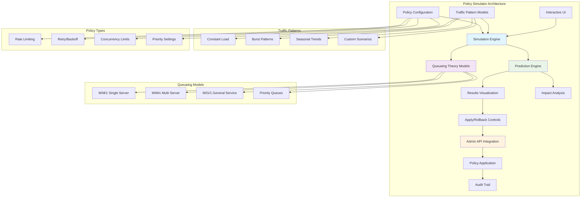
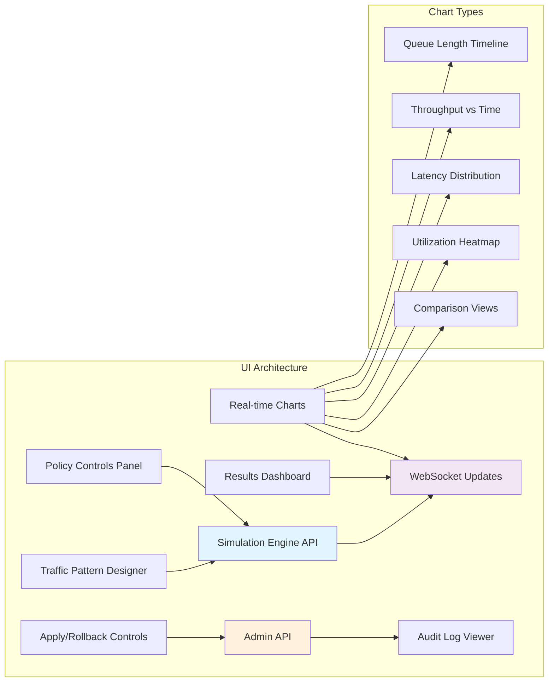
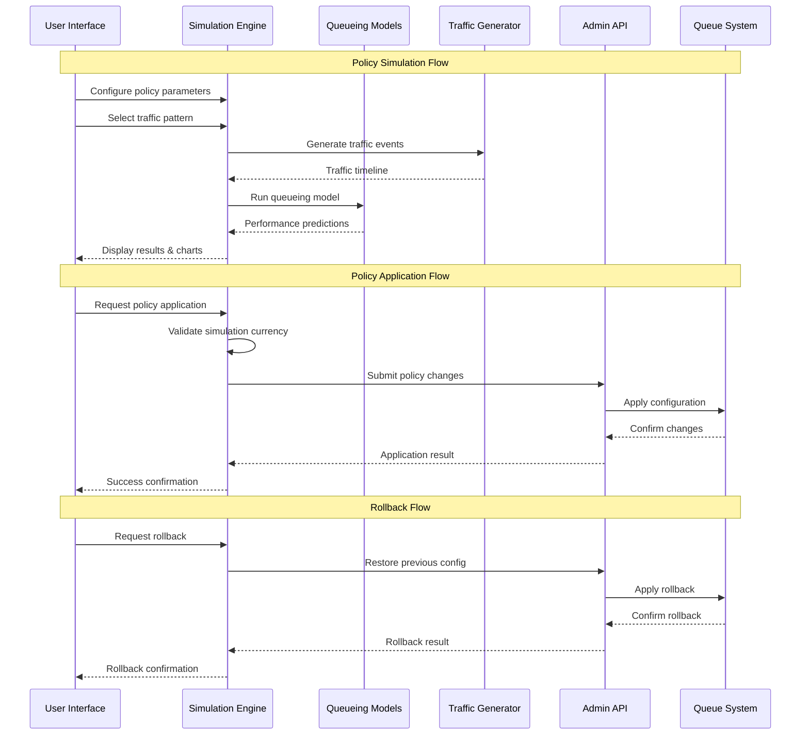

# Policy Simulator (F031) - Design Document

**Version:** 1.0
**Date:** 2025-09-14
**Status:** Draft
**Author:** Claude (Worker 6)
**Reviewers:** TBD

## Executive Summary

The Policy Simulator is an advanced "what-if" analysis tool that enables operators to preview the impact of policy changes before applying them to production systems. Built on proven queueing theory principles, it provides real-time predictions of system behavior under different configuration scenarios, eliminating the guesswork from capacity planning and policy tuning.

This system addresses the critical gap between theoretical policy changes and their real-world impact. By simulating queue backlog, throughput, and latency under various traffic patterns and policy configurations, operators can make informed decisions with confidence, preventing outages and optimizing performance before changes reach production.

The simulator combines mathematical modeling with interactive visualization, providing immediate feedback on policy adjustments through dynamic charts and metrics. Integration with the Admin API enables seamless policy application with full audit trails, creating a complete policy lifecycle management solution.

### Key Benefits

- **Risk-Free Policy Testing**: Preview changes before production impact
- **Mathematical Accuracy**: Based on proven queueing theory models (Little's Law, M/M/c)
- **Interactive Visualization**: Real-time charts and metrics for immediate feedback
- **Safe Policy Application**: Integrated apply/rollback with comprehensive audit trails
- **Traffic Pattern Modeling**: Support for constant, burst, and seasonal load patterns
- **Comprehensive Analysis**: Predict backlog, throughput, latency, and resource utilization

### Architecture Overview



## System Architecture

### Core Components

#### 1. Simulation Engine

The heart of the system, implementing sophisticated queueing theory models to predict system behavior.

```go
type SimulationEngine struct {
    models       map[string]QueueingModel
    calculator   MetricsCalculator
    validator    ConfigValidator
    cache        ResultsCache
}

type QueueingModel interface {
    Simulate(config PolicyConfig, pattern TrafficPattern, duration time.Duration) (*SimulationResult, error)
    GetModelType() ModelType
    GetAccuracyBounds() AccuracyBounds
    ValidateInputs(config PolicyConfig) error
}

type PolicyConfig struct {
    RateLimit         *RateLimitConfig         `json:"rateLimit"`
    RetryPolicy       *RetryPolicyConfig       `json:"retryPolicy"`
    ConcurrencyLimit  *ConcurrencyConfig       `json:"concurrencyLimit"`
    PrioritySettings  *PriorityConfig          `json:"prioritySettings"`
    CircuitBreaker    *CircuitBreakerConfig    `json:"circuitBreaker"`
    TimeoutSettings   *TimeoutConfig           `json:"timeoutSettings"`
}

type TrafficPattern struct {
    Type           PatternType       `json:"type"`           // constant, burst, seasonal, custom
    ArrivalRate    float64          `json:"arrivalRate"`    // jobs per second
    BurstConfig    *BurstConfig     `json:"burstConfig"`    // for burst patterns
    SeasonalConfig *SeasonalConfig  `json:"seasonalConfig"` // for seasonal patterns
    CustomPoints   []DataPoint      `json:"customPoints"`   // for custom patterns
    Duration       time.Duration    `json:"duration"`       // simulation duration
}

type SimulationResult struct {
    Timestamp      time.Time                `json:"timestamp"`
    Configuration  PolicyConfig             `json:"configuration"`
    Pattern        TrafficPattern           `json:"pattern"`
    Predictions    *PerformancePredictions  `json:"predictions"`
    ModelMetadata  *ModelMetadata           `json:"modelMetadata"`
    Confidence     ConfidenceInterval       `json:"confidence"`
    Warnings       []ValidationWarning      `json:"warnings"`
}
```

#### 2. Queueing Theory Models

Implementation of proven mathematical models for different system configurations.

**M/M/1 Single Server Model**:
```go
type MMOneModel struct {
    serviceRate float64
}

func (m *MMOneModel) calculateMetrics(arrivalRate, serviceRate float64) *QueueMetrics {
    utilization := arrivalRate / serviceRate
    if utilization >= 1.0 {
        return &QueueMetrics{
            Error: "System unstable: arrival rate exceeds service rate",
        }
    }

    avgWaitTime := utilization / (serviceRate * (1 - utilization))
    avgQueueLength := utilization * utilization / (1 - utilization)
    avgSystemTime := 1 / (serviceRate - arrivalRate)

    return &QueueMetrics{
        Utilization:      utilization,
        AvgWaitTime:      avgWaitTime,
        AvgQueueLength:   avgQueueLength,
        AvgSystemTime:    avgSystemTime,
        Throughput:       arrivalRate,
        Stability:       utilization < 0.8, // Alert if > 80% utilization
    }
}
```

**M/M/c Multi-Server Model**:
```go
type MMcModel struct {
    numServers  int
    serviceRate float64
}

func (m *MMcModel) calculateErlangC(rho float64, c int) float64 {
    // Erlang C formula for probability of waiting
    numerator := math.Pow(rho, float64(c)) / factorial(c)
    denominator := 0.0

    for k := 0; k < c; k++ {
        denominator += math.Pow(rho, float64(k)) / factorial(k)
    }
    denominator += numerator / (1 - rho/float64(c))

    return numerator / denominator
}
```

#### 3. Traffic Pattern Generator

Generates realistic traffic patterns for simulation scenarios.

```go
type TrafficGenerator struct {
    patterns map[PatternType]PatternGenerator
    random   *rand.Rand
}

type PatternGenerator interface {
    Generate(config TrafficPattern, duration time.Duration) []ArrivalEvent
    GetExpectedRate() float64
    Validate(config TrafficPattern) error
}

type BurstPatternGenerator struct {
    baseRate    float64
    burstRate   float64
    burstDuration time.Duration
    burstInterval time.Duration
}

func (g *BurstPatternGenerator) Generate(config TrafficPattern, duration time.Duration) []ArrivalEvent {
    events := make([]ArrivalEvent, 0)
    currentTime := time.Time{}

    for currentTime.Before(currentTime.Add(duration)) {
        // Determine if we're in burst or base period
        if g.isInBurstPeriod(currentTime) {
            rate := g.burstRate
            interArrival := time.Duration(float64(time.Second) / rate)
            events = append(events, ArrivalEvent{
                Timestamp: currentTime,
                JobCount:  1,
                Rate:      rate,
            })
            currentTime = currentTime.Add(interArrival)
        } else {
            rate := g.baseRate
            interArrival := time.Duration(float64(time.Second) / rate)
            events = append(events, ArrivalEvent{
                Timestamp: currentTime,
                JobCount:  1,
                Rate:      rate,
            })
            currentTime = currentTime.Add(interArrival)
        }
    }

    return events
}
```

#### 4. Interactive UI Components

Real-time visualization and control interface built with modern web technologies.



#### 5. Policy Application Engine

Safely applies validated policy changes with comprehensive rollback capabilities.

```go
type PolicyApplicator struct {
    adminClient    AdminAPIClient
    validator      PolicyValidator
    auditLogger    AuditLogger
    rollbackStack  RollbackStack
}

type PolicyChangeRequest struct {
    RequestID      string           `json:"requestId"`
    UserID         string           `json:"userId"`
    Timestamp      time.Time        `json:"timestamp"`
    SimulationID   string           `json:"simulationId"`
    Changes        []PolicyChange   `json:"changes"`
    ApplyStrategy  ApplyStrategy    `json:"applyStrategy"`
    RollbackPlan   *RollbackPlan    `json:"rollbackPlan"`
}

type PolicyChange struct {
    Target         string           `json:"target"`         // queue name or global
    PolicyType     PolicyType       `json:"policyType"`     // rate_limit, retry, etc.
    OldValue       interface{}      `json:"oldValue"`
    NewValue       interface{}      `json:"newValue"`
    ValidationHash string           `json:"validationHash"` // Ensure change matches simulation
}

func (p *PolicyApplicator) ApplyChanges(ctx context.Context, request *PolicyChangeRequest) (*ApplicationResult, error) {
    // Validate simulation hash matches current system state
    if err := p.validateSimulationCurrency(request.SimulationID); err != nil {
        return nil, fmt.Errorf("simulation outdated: %w", err)
    }

    // Create rollback point
    rollbackPoint, err := p.createRollbackPoint(request.Changes)
    if err != nil {
        return nil, fmt.Errorf("failed to create rollback point: %w", err)
    }

    // Apply changes atomically
    result, err := p.applyChangesAtomic(ctx, request.Changes)
    if err != nil {
        // Auto-rollback on failure
        if rollbackErr := p.rollback(rollbackPoint); rollbackErr != nil {
            p.auditLogger.LogCritical("Failed to rollback after apply failure", rollbackErr)
        }
        return nil, err
    }

    // Log successful application
    p.auditLogger.LogPolicyChange(request, result)

    return result, nil
}
```

### Data Flow Architecture



### Performance Requirements

#### Simulation Performance

- **Model Execution**: Complete simulation of 24-hour period in <5 seconds
- **Interactive Response**: UI updates within 100ms of parameter changes
- **Concurrent Sessions**: Support 50+ simultaneous simulation sessions
- **Memory Usage**: <1GB RAM for complex multi-server simulations

#### Accuracy Requirements

- **M/M/1 Models**: ±5% accuracy for utilization <80%
- **Multi-Server Models**: ±10% accuracy for realistic scenarios
- **Burst Pattern Prediction**: ±15% accuracy for short-term bursts
- **Long-term Trends**: ±20% accuracy for seasonal patterns

#### Scalability Targets

- **Simulation Scenarios**: Support 1000+ saved simulation configurations
- **Pattern Complexity**: Handle traffic patterns with 10,000+ data points
- **Policy Combinations**: Test 100+ policy parameter combinations simultaneously
- **Historical Data**: Maintain 90 days of simulation results for comparison

## Testing Strategy

### Model Validation Testing

- **Mathematical Verification**: Compare against analytical solutions for simple cases
- **Monte Carlo Validation**: Run stochastic simulations to verify model accuracy
- **Boundary Testing**: Validate behavior at stability limits and edge cases
- **Performance Benchmarking**: Measure simulation speed and resource usage

### Integration Testing

- **End-to-End Scenarios**: Complete simulation-to-application workflows
- **Admin API Integration**: Policy application and rollback functionality
- **Real System Validation**: Compare predictions against actual system behavior
- **Concurrent User Testing**: Multiple users running simulations simultaneously

### UI Testing

- **Interactive Response**: Real-time chart updates and parameter changes
- **Visualization Accuracy**: Ensure charts correctly represent simulation data
- **User Experience**: Intuitive policy configuration and results interpretation
- **Cross-Browser Compatibility**: Support for major browsers and devices

### Security Testing

- **Input Validation**: Malicious policy configurations and traffic patterns
- **Access Control**: Proper authorization for policy application features
- **Audit Trail Integrity**: Tamper-proof logging of all policy changes
- **Injection Prevention**: SQL/NoSQL injection in configuration parameters

## Security Model

### Threat Analysis

#### T1: Malicious Policy Simulation

**Description**: Attackers use simulator to discover system vulnerabilities or performance limits.

**Mitigations**:
- Rate limiting on simulation requests
- Input validation for all policy parameters
- Restricted access to sensitive configuration details
- Audit logging of all simulation activities

#### T2: Unauthorized Policy Application

**Description**: Unauthorized users apply harmful policy changes to production systems.

**Mitigations**:
- Multi-factor authentication for policy application
- Role-based access control with approval workflows
- Mandatory simulation validation before application
- Automatic rollback on anomaly detection

#### T3: Simulation Result Manipulation

**Description**: Tampering with simulation results to justify harmful policy changes.

**Mitigations**:
- Cryptographic signatures on simulation results
- Immutable audit trail with blockchain-style verification
- Independent re-simulation before policy application
- Time-limited simulation validity windows

### Access Control Model

```go
type AccessControl struct {
    rbac        RBACEngine
    mfa         MFAProvider
    audit       AuditLogger
    approval    ApprovalWorkflow
}

type UserPermissions struct {
    CanSimulate     bool     `json:"canSimulate"`
    CanViewResults  bool     `json:"canViewResults"`
    CanApplyPolicies bool    `json:"canApplyPolicies"`
    CanRollback     bool     `json:"canRollback"`
    ScopeTargets    []string `json:"scopeTargets"`    // queue names or "global"
    MaxSimDuration  Duration `json:"maxSimDuration"`  // simulation time limit
}

type ApprovalWorkflow struct {
    RequiredApprovers int              `json:"requiredApprovers"`
    ApproverRoles     []string         `json:"approverRoles"`
    AutoApprovalRules []ApprovalRule   `json:"autoApprovalRules"`
    EscalationPolicy  EscalationPolicy `json:"escalationPolicy"`
}
```

## Deployment Plan

### Phase 1: Core Simulation Engine (Weeks 1-3)
- Implement basic queueing models (M/M/1, M/M/c)
- Build traffic pattern generators
- Create simple CLI interface for validation
- Extensive mathematical verification and testing

### Phase 2: Interactive UI (Weeks 4-6)
- Web-based simulation interface
- Real-time charting and visualization
- Policy configuration controls
- Results comparison and analysis tools

### Phase 3: Admin API Integration (Weeks 7-8)
- Policy application endpoints
- Rollback functionality
- Audit trail implementation
- Security and access control

### Phase 4: Advanced Features (Weeks 9-10)
- Complex traffic patterns (seasonal, custom)
- Advanced queueing models (priority queues, general service)
- Performance optimization and caching
- Production monitoring and alerting

---

This design document establishes the foundation for implementing the Policy Simulator as a sophisticated yet practical tool for queue system optimization. The focus on mathematical accuracy, interactive visualization, and safe policy application ensures that operators can confidently tune their systems while minimizing risk and maximizing performance.