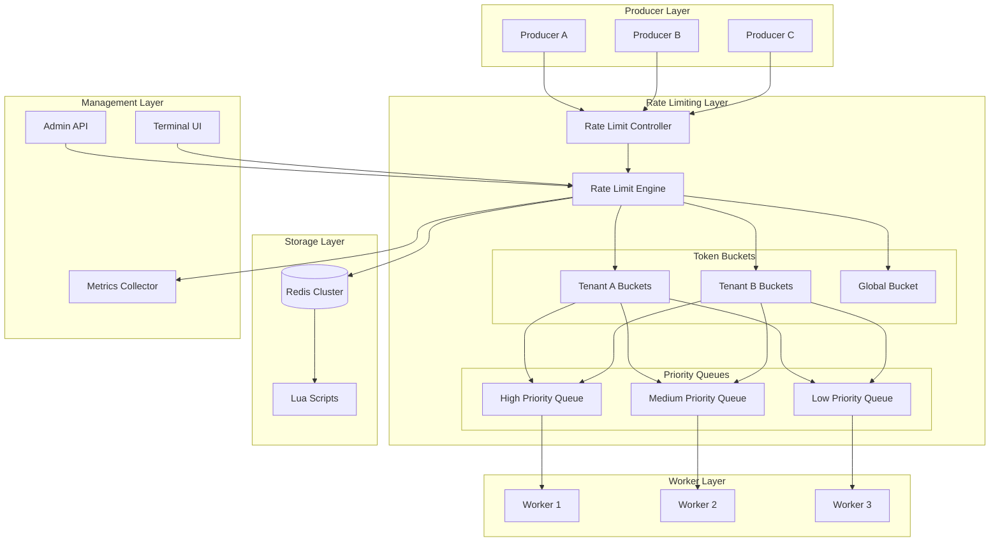
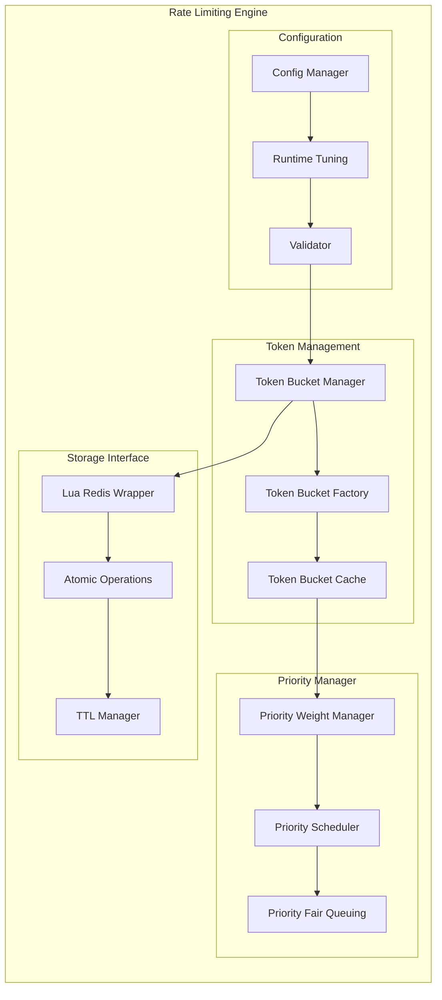
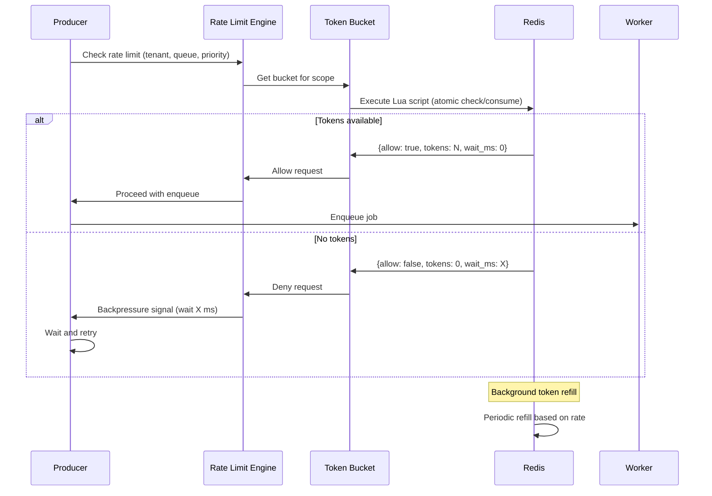
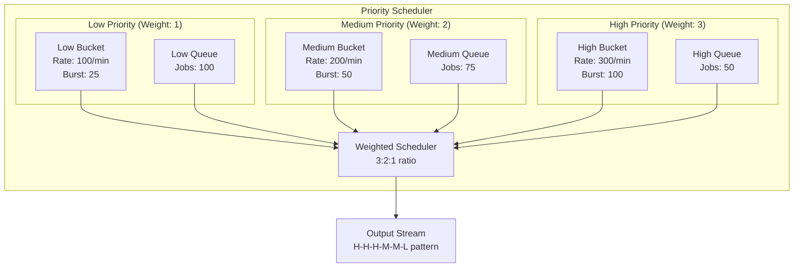
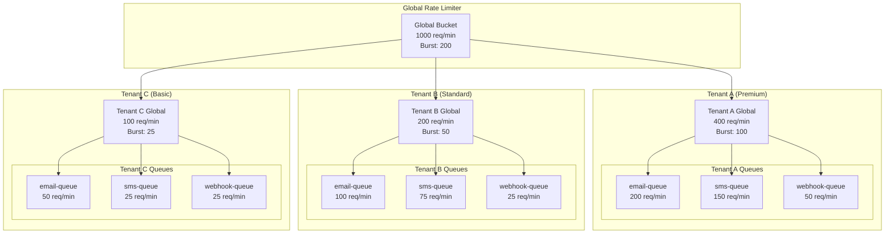

# Advanced Rate Limiting Design Specification (F032)

## Executive Summary

The Advanced Rate Limiting system implements enterprise-grade token bucket rate limiting with priority fairness, per-tenant isolation, and global capacity controls. This system provides predictable throughput guarantees for premium tenants while protecting shared infrastructure from abuse and overload.

Key features include:
- **Token Bucket Algorithm**: Industry-standard rate limiting with burst capacity
- **Priority Fairness**: Weighted fair queuing prevents starvation while prioritizing critical work
- **Per-Tenant Isolation**: Independent rate limits prevent tenant interference
- **Global Capacity Controls**: Cluster-wide limits ensure infrastructure protection
- **Dynamic Configuration**: Runtime adjustments without service interruption
- **Comprehensive Observability**: Real-time metrics and debugging capabilities

## System Architecture

### High-Level Architecture



### Component Architecture



### Token Bucket Algorithm Flow



### Priority Fair Queuing



### Multi-Tenant Rate Limiting



## Data Models

### Token Bucket Configuration

```json
{
  "buckets": {
    "global": {
      "rate_per_second": 1000,
      "burst_capacity": 200,
      "enabled": true
    },
    "tenant_defaults": {
      "premium": {
        "rate_per_second": 400,
        "burst_capacity": 100,
        "priority_weights": {
          "high": 3,
          "medium": 2,
          "low": 1
        }
      },
      "standard": {
        "rate_per_second": 200,
        "burst_capacity": 50,
        "priority_weights": {
          "high": 2,
          "medium": 1,
          "low": 1
        }
      },
      "basic": {
        "rate_per_second": 100,
        "burst_capacity": 25,
        "priority_weights": {
          "high": 1,
          "medium": 1,
          "low": 1
        }
      }
    },
    "tenant_overrides": {
      "tenant-123": {
        "rate_per_second": 500,
        "burst_capacity": 150,
        "priority_weights": {
          "high": 4,
          "medium": 2,
          "low": 1
        }
      }
    },
    "queue_overrides": {
      "tenant-123:email-queue": {
        "rate_per_second": 300,
        "burst_capacity": 75
      }
    }
  }
}
```

### Token Bucket State

```json
{
  "scope": "tenant-123:email-queue:high",
  "current_tokens": 45.7,
  "last_refill_time": "2025-09-14T19:45:30.123Z",
  "rate_per_second": 100,
  "burst_capacity": 50,
  "total_requests": 15647,
  "allowed_requests": 14892,
  "denied_requests": 755,
  "created_at": "2025-09-14T10:00:00.000Z",
  "updated_at": "2025-09-14T19:45:30.123Z",
  "ttl_seconds": 3600
}
```

### Rate Limit Decision

```json
{
  "scope": "tenant-123:email-queue:high",
  "allowed": true,
  "tokens_consumed": 1,
  "tokens_remaining": 44.7,
  "wait_time_ms": 0,
  "bucket_capacity": 50,
  "refill_rate": 100,
  "decision_time": "2025-09-14T19:45:30.125Z",
  "next_refill_at": "2025-09-14T19:45:31.000Z"
}
```

### Rate Limit Metrics

```json
{
  "timestamp": "2025-09-14T19:45:30.000Z",
  "scope": "tenant-123:email-queue",
  "metrics": {
    "requests_per_second": 85.3,
    "allowed_per_second": 82.1,
    "denied_per_second": 3.2,
    "average_tokens": 23.5,
    "bucket_utilization": 0.47,
    "wait_time_p50": 0,
    "wait_time_p95": 15,
    "wait_time_p99": 45
  },
  "priority_breakdown": {
    "high": {
      "requests": 45,
      "allowed": 45,
      "denied": 0,
      "average_wait_ms": 0
    },
    "medium": {
      "requests": 25,
      "allowed": 24,
      "denied": 1,
      "average_wait_ms": 2
    },
    "low": {
      "requests": 15,
      "allowed": 13,
      "denied": 2,
      "average_wait_ms": 8
    }
  }
}
```

## Redis Storage Schema

### Key Patterns

```
# Token bucket state
rl:bucket:{scope}              # Hash containing bucket state
rl:config:{scope}              # Hash containing bucket configuration
rl:metrics:{scope}:{timestamp} # Sorted set for time-series metrics

# Global configuration
rl:global:config               # Hash containing global settings
rl:global:defaults             # Hash containing default configurations

# Scope examples
rl:bucket:global
rl:bucket:tenant-123
rl:bucket:tenant-123:email-queue
rl:bucket:tenant-123:email-queue:high
```

### Lua Script for Atomic Operations

```lua
-- Rate limit check and consume
-- KEYS[1]: bucket key
-- KEYS[2]: config key
-- ARGV[1]: current timestamp (milliseconds)
-- ARGV[2]: tokens to consume
-- ARGV[3]: TTL for bucket

local bucket_key = KEYS[1]
local config_key = KEYS[2]
local now = tonumber(ARGV[1])
local tokens_requested = tonumber(ARGV[2])
local ttl = tonumber(ARGV[3])

-- Get bucket configuration
local config = redis.call('HMGET', config_key, 'rate_per_second', 'burst_capacity')
local rate_per_second = tonumber(config[1]) or 10
local burst_capacity = tonumber(config[2]) or 50

-- Get current bucket state
local state = redis.call('HMGET', bucket_key, 'tokens', 'last_refill')
local current_tokens = tonumber(state[1]) or burst_capacity
local last_refill = tonumber(state[2]) or now

-- Calculate tokens to add based on elapsed time
local elapsed_ms = now - last_refill
local tokens_to_add = (elapsed_ms / 1000) * rate_per_second
local new_tokens = math.min(burst_capacity, current_tokens + tokens_to_add)

-- Check if request can be satisfied
local result = {}
if new_tokens >= tokens_requested then
    -- Allow request
    new_tokens = new_tokens - tokens_requested
    result.allowed = true
    result.tokens_consumed = tokens_requested
    result.wait_time_ms = 0
else
    -- Deny request, calculate wait time
    local tokens_needed = tokens_requested - new_tokens
    local wait_time_ms = (tokens_needed / rate_per_second) * 1000
    result.allowed = false
    result.tokens_consumed = 0
    result.wait_time_ms = math.ceil(wait_time_ms)
end

-- Update bucket state
redis.call('HMSET', bucket_key,
    'tokens', new_tokens,
    'last_refill', now,
    'total_requests', redis.call('HINCRBY', bucket_key, 'total_requests', 1)
)

-- Update counters
if result.allowed then
    redis.call('HINCRBY', bucket_key, 'allowed_requests', 1)
else
    redis.call('HINCRBY', bucket_key, 'denied_requests', 1)
end

-- Set TTL
redis.call('EXPIRE', bucket_key, ttl)
redis.call('EXPIRE', config_key, ttl)

-- Return result
result.tokens_remaining = new_tokens
result.bucket_capacity = burst_capacity
result.refill_rate = rate_per_second
result.timestamp = now

return cjson.encode(result)
```

## API Specification

### Rate Limit Check Endpoint

```http
POST /api/v1/rate-limit/check
Content-Type: application/json

{
  "scope": "tenant-123:email-queue:high",
  "tokens": 1,
  "metadata": {
    "request_id": "req-456",
    "user_agent": "producer-v1.0"
  }
}
```

**Response (Allowed):**
```http
HTTP/1.1 200 OK
Content-Type: application/json

{
  "allowed": true,
  "tokens_consumed": 1,
  "tokens_remaining": 49,
  "wait_time_ms": 0,
  "bucket_capacity": 50,
  "refill_rate": 100,
  "scope": "tenant-123:email-queue:high",
  "timestamp": "2025-09-14T19:45:30.125Z"
}
```

**Response (Denied):**
```http
HTTP/1.1 429 Too Many Requests
Content-Type: application/json
Retry-After: 15

{
  "allowed": false,
  "tokens_consumed": 0,
  "tokens_remaining": 0,
  "wait_time_ms": 15000,
  "bucket_capacity": 50,
  "refill_rate": 100,
  "scope": "tenant-123:email-queue:high",
  "timestamp": "2025-09-14T19:45:30.125Z",
  "error": {
    "code": "RATE_LIMIT_EXCEEDED",
    "message": "Rate limit exceeded for scope tenant-123:email-queue:high"
  }
}
```

### Configuration Management

```http
GET /api/v1/rate-limit/config/{scope}
PUT /api/v1/rate-limit/config/{scope}
DELETE /api/v1/rate-limit/config/{scope}
```

### Metrics and Monitoring

```http
GET /api/v1/rate-limit/metrics/{scope}
GET /api/v1/rate-limit/status/{scope}
GET /api/v1/rate-limit/debug/{scope}
```

## Security Model

### Threat Analysis

#### 1. Rate Limit Bypass
**Description**: Attackers attempt to circumvent rate limits through scope manipulation or Redis direct access.
**Impact**: High - System overload and unfair resource allocation
**Mitigation**:
- Scope validation and sanitization
- Redis access control with authentication
- Audit logging of all rate limit decisions
- Secondary validation layers

#### 2. Token Bucket Exhaustion Attack
**Description**: Malicious actors rapidly consume all tokens to deny service to legitimate users.
**Impact**: High - Denial of service for affected tenants
**Mitigation**:
- Priority-based token allocation
- Separate buckets for different priorities
- Global rate limiting as circuit breaker
- Anomaly detection and alerting

#### 3. Configuration Tampering
**Description**: Unauthorized modification of rate limit configurations.
**Impact**: Medium - Service degradation or unfair resource allocation
**Mitigation**:
- Role-based access control for Admin API
- Configuration change audit logs
- Dry-run mode for configuration validation
- Configuration rollback capabilities

#### 4. Redis Performance Degradation
**Description**: Excessive rate limit checks overwhelm Redis cluster.
**Impact**: Medium - System-wide performance impact
**Mitigation**:
- Local caching of rate limit decisions
- Lua script optimization
- Redis connection pooling
- Circuit breakers for Redis operations

#### 5. Time-Based Attacks
**Description**: Clock skew or time manipulation affects token bucket calculations.
**Impact**: Low - Temporary rate limit bypass or over-restriction
**Mitigation**:
- Monotonic clock usage where possible
- Time drift detection and correction
- Maximum time window validation
- Graceful handling of clock jumps

#### 6. Memory Exhaustion
**Description**: Excessive bucket creation leads to Redis memory exhaustion.
**Impact**: Medium - System instability
**Mitigation**:
- Automatic TTL on all buckets
- Maximum bucket count limits
- Memory usage monitoring
- Bucket cleanup policies

### Security Controls

```yaml
security:
  authentication:
    - Redis AUTH with strong passwords
    - Admin API JWT tokens with short expiry
    - Rate limit check API key authentication

  authorization:
    - Scope-based access control
    - Tenant isolation enforcement
    - Admin role permissions

  auditing:
    - All configuration changes logged
    - Rate limit violations tracked
    - Admin API access logged
    - Suspicious pattern detection

  data_protection:
    - In-transit encryption (TLS)
    - Redis encryption at rest
    - Sensitive configuration masking
    - Secure key rotation
```

## Performance Requirements

### Latency Requirements

**Rate Limit Decision Latency:**
- Target: <2ms for cached decisions
- Maximum: <10ms for new bucket creation (99th percentile)
- Redis round-trip: <1ms within data center

**API Response Times:**
- Rate limit check: <5ms (95th percentile)
- Configuration read: <10ms (95th percentile)
- Configuration update: <50ms (95th percentile)

### Throughput Requirements

**Rate Limit Checks:**
- Target: 50,000 checks/second per instance
- Peak: 100,000 checks/second per instance
- Lua script execution: 10,000 ops/second per Redis instance

**Configuration Operations:**
- Config reads: 1,000 ops/second
- Config updates: 100 ops/second
- Metrics collection: 10,000 data points/second

### Scalability Targets

**Horizontal Scaling:**
- Linear scaling with Redis cluster size
- Stateless rate limit service instances
- Load balancing across multiple instances

**Data Scale:**
- Support for 1,000,000+ unique scopes
- 10,000+ tenants with independent limits
- 100+ priority levels per tenant

**Resource Efficiency:**
- Memory usage: <1MB per 1,000 active buckets
- CPU overhead: <5% for typical workloads
- Network bandwidth: <10MB/s for metrics

## Testing Strategy

### Unit Testing

**Token Bucket Logic:**
```go
func TestTokenBucketRefill(t *testing.T) {
    tests := []struct {
        name            string
        initialTokens   float64
        elapsedMs       int64
        ratePerSecond   float64
        burstCapacity   float64
        expectedTokens  float64
    }{
        {"Normal refill", 10, 1000, 100, 200, 110},
        {"Burst cap limit", 150, 2000, 100, 200, 200},
        {"Zero elapsed", 50, 0, 100, 200, 50},
        {"Partial refill", 0, 500, 100, 200, 50},
    }

    for _, tt := range tests {
        t.Run(tt.name, func(t *testing.T) {
            bucket := &TokenBucket{
                Tokens:        tt.initialTokens,
                RatePerSecond: tt.ratePerSecond,
                BurstCapacity: tt.burstCapacity,
            }

            result := bucket.refill(tt.elapsedMs)
            assert.InDelta(t, tt.expectedTokens, result, 0.1)
        })
    }
}
```

**Priority Fairness Testing:**
```go
func TestPriorityFairness(t *testing.T) {
    scheduler := NewPriorityScheduler(map[Priority]int{
        High:   3,
        Medium: 2,
        Low:    1,
    })

    // Generate requests across priorities
    requests := generatePriorityRequests(1000)
    allowed := make(map[Priority]int)

    for _, req := range requests {
        if scheduler.Allow(req.Priority) {
            allowed[req.Priority]++
        }
    }

    // Verify proportional allocation
    total := allowed[High] + allowed[Medium] + allowed[Low]
    highRatio := float64(allowed[High]) / float64(total)
    mediumRatio := float64(allowed[Medium]) / float64(total)
    lowRatio := float64(allowed[Low]) / float64(total)

    assert.InDelta(t, 0.5, highRatio, 0.1)    // 3/6 = 0.5
    assert.InDelta(t, 0.33, mediumRatio, 0.1) // 2/6 = 0.33
    assert.InDelta(t, 0.17, lowRatio, 0.1)    // 1/6 = 0.17
}
```

### Integration Testing

**End-to-End Rate Limiting:**
```go
func TestEndToEndRateLimiting(t *testing.T) {
    // Set up test environment
    redis := setupTestRedis(t)
    rateLimiter := NewRateLimiter(redis, testConfig)

    scope := "tenant-test:queue-test:high"

    // Configure bucket with low limits for testing
    config := BucketConfig{
        RatePerSecond: 10,
        BurstCapacity: 5,
    }
    rateLimiter.SetConfig(scope, config)

    // Test burst capacity
    allowed := 0
    for i := 0; i < 10; i++ {
        if decision := rateLimiter.Check(scope, 1); decision.Allowed {
            allowed++
        }
    }

    // Should allow burst capacity
    assert.Equal(t, 5, allowed)

    // Wait for refill and test steady state
    time.Sleep(1 * time.Second)

    start := time.Now()
    allowed = 0
    for time.Since(start) < 10*time.Second {
        if decision := rateLimiter.Check(scope, 1); decision.Allowed {
            allowed++
        }
        time.Sleep(50 * time.Millisecond)
    }

    // Should allow approximately 100 requests (10 req/s * 10s)
    assert.InDelta(t, 100, allowed, 10)
}
```

### Load Testing

**High-Throughput Scenarios:**
```bash
#!/bin/bash
# Rate limiting load test

echo "Starting rate limiting load test..."

# Test with varying request rates
for rate in 1000 5000 10000 50000; do
    echo "Testing with $rate requests/second"

    go run loadtest/main.go \
        -rate=$rate \
        -duration=30s \
        -tenants=100 \
        -queues=10 \
        -priorities=3

    echo "Completed $rate req/s test"
    sleep 5
done

# Test with varying tenant counts
for tenants in 100 500 1000 5000; do
    echo "Testing with $tenants tenants"

    go run loadtest/main.go \
        -rate=10000 \
        -duration=60s \
        -tenants=$tenants \
        -queues=5 \
        -priorities=3

    echo "Completed $tenants tenants test"
    sleep 5
done
```

### Performance Benchmarks

```go
func BenchmarkRateLimitDecision(b *testing.B) {
    rateLimiter := NewRateLimiter(setupBenchRedis(), benchConfig)
    scope := "tenant-bench:queue-bench:high"

    b.ResetTimer()
    b.RunParallel(func(pb *testing.PB) {
        for pb.Next() {
            rateLimiter.Check(scope, 1)
        }
    })
}

func BenchmarkLuaScriptExecution(b *testing.B) {
    redis := setupBenchRedis()
    script := loadRateLimitScript()

    b.ResetTimer()
    for i := 0; i < b.N; i++ {
        redis.EvalSha(script.Hash(),
            []string{"rl:bucket:bench", "rl:config:bench"},
            time.Now().UnixMilli(), 1, 3600)
    }
}
```

## Deployment and Operations

### Configuration Management

**Default Configuration:**
```yaml
rate_limiting:
  redis:
    addresses: ["redis-1:6379", "redis-2:6379", "redis-3:6379"]
    password: "${REDIS_PASSWORD}"
    database: 0
    pool_size: 10

  global:
    enabled: true
    rate_per_second: 10000
    burst_capacity: 2000

  defaults:
    tenant_tier_limits:
      enterprise:
        rate_per_second: 1000
        burst_capacity: 200
      pro:
        rate_per_second: 500
        burst_capacity: 100
      basic:
        rate_per_second: 100
        burst_capacity: 25

  priorities:
    weights:
      critical: 4
      high: 3
      medium: 2
      low: 1

  cache:
    decision_ttl: 30s
    config_ttl: 300s

  monitoring:
    metrics_interval: 10s
    alert_thresholds:
      denial_rate: 0.1
      latency_p99: 50ms
```

### Monitoring and Alerting

**Key Metrics:**
```yaml
metrics:
  counters:
    - rate_limit_requests_total{scope, priority, result}
    - rate_limit_tokens_consumed_total{scope, priority}
    - rate_limit_config_changes_total{scope, operation}

  histograms:
    - rate_limit_decision_duration_seconds{scope}
    - rate_limit_wait_time_seconds{scope, priority}
    - rate_limit_tokens_remaining{scope}

  gauges:
    - rate_limit_active_buckets{tenant}
    - rate_limit_bucket_utilization{scope}
    - rate_limit_redis_connections
```

**Critical Alerts:**
```yaml
alerts:
  - name: HighDenialRate
    condition: rate(rate_limit_requests_total{result="denied"}[5m]) / rate(rate_limit_requests_total[5m]) > 0.1
    severity: warning

  - name: RateLimitHighLatency
    condition: histogram_quantile(0.99, rate_limit_decision_duration_seconds) > 0.05
    severity: warning

  - name: RedisConnectionFailure
    condition: rate_limit_redis_connections == 0
    severity: critical
```

### Operational Procedures

**Capacity Planning:**
1. Monitor token bucket utilization rates
2. Analyze request patterns and burst requirements
3. Adjust rate limits based on infrastructure capacity
4. Plan Redis cluster scaling based on scope count

**Incident Response:**
1. **High Denial Rate**: Check for traffic spikes, adjust global limits
2. **High Latency**: Investigate Redis performance, scale if needed
3. **Config Corruption**: Rollback to last known good configuration
4. **Token Exhaustion**: Implement emergency rate limit adjustments

## Future Enhancements

### Advanced Features
- **Machine Learning Rate Adjustment**: Automatic rate limit tuning based on traffic patterns
- **Geographic Rate Limiting**: Different limits based on request origin
- **Cost-Based Rate Limiting**: Integration with billing systems for usage-based pricing
- **Predictive Throttling**: Proactive rate limiting based on forecasted demand

### Integration Opportunities
- **Service Mesh Integration**: Envoy/Istio rate limiting plugin
- **API Gateway Integration**: Kong/Ambassador rate limiting backend
- **Observability Integration**: OpenTelemetry tracing and metrics
- **Policy Engine Integration**: Open Policy Agent (OPA) for complex rules

## Conclusion

The Advanced Rate Limiting system provides enterprise-grade traffic management with priority fairness, multi-tenant isolation, and comprehensive observability. The token bucket algorithm with Lua-based atomic operations ensures accurate rate limiting at scale, while the priority scheduling system prevents starvation and maintains service level agreements.

Key benefits include:
- **Predictable Performance**: Token buckets provide smooth traffic shaping
- **Fair Resource Allocation**: Priority weights ensure critical work gets resources
- **Operational Excellence**: Real-time monitoring and dynamic configuration
- **Scalable Architecture**: Linear scaling with Redis cluster growth
- **Enterprise Ready**: Security, audit logging, and compliance features

This system positions the queue as an enterprise-ready platform capable of handling complex multi-tenant scenarios while maintaining the simplicity that makes it accessible to teams of all sizes.