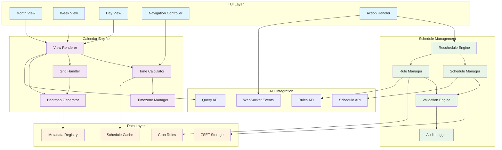
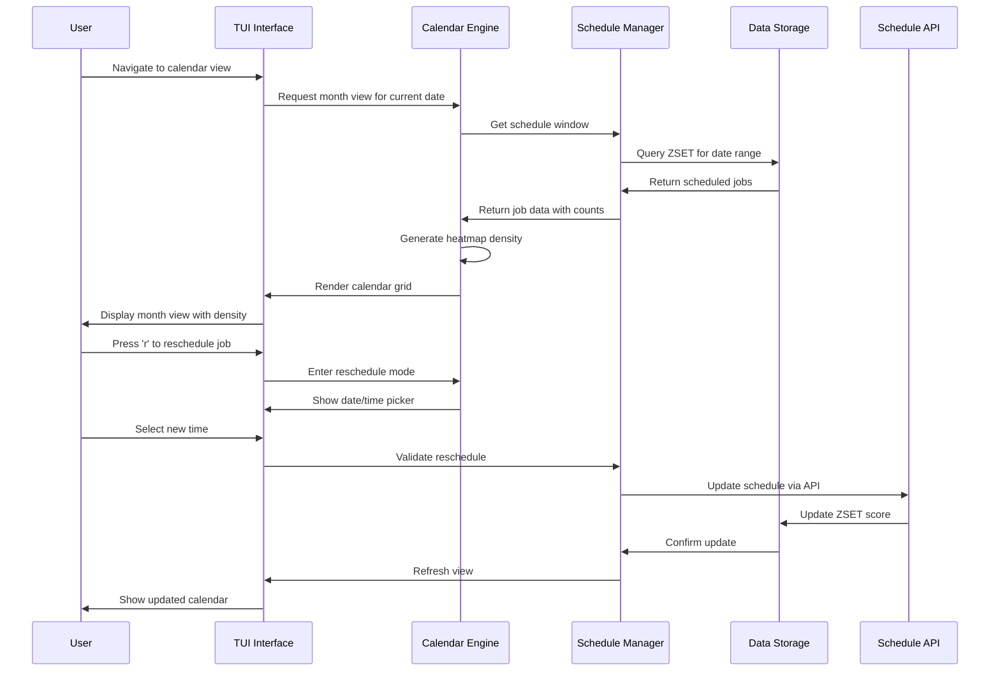
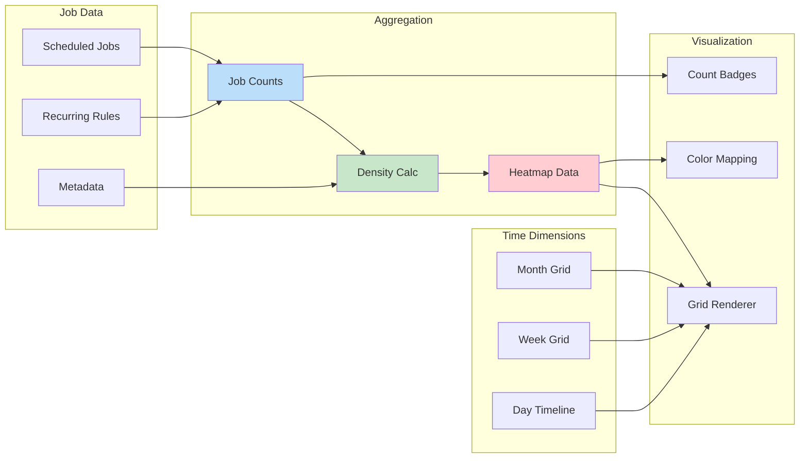

# F033 - Calendar View Design

## Executive Summary

The Calendar View feature transforms job scheduling from abstract time management into visual, intuitive calendar interfaces. By integrating month, week, and day views directly into the TUI, this feature enables operators to visualize scheduled job density, identify scheduling conflicts, and manage recurring rules with the same ease as calendar appointments.

This system bridges the gap between traditional cron-based scheduling and modern calendar interfaces, providing visual density heatmaps, drag-and-drop rescheduling, and comprehensive CRUD operations for recurring rules. The calendar interface makes temporal patterns immediately apparent, enabling better capacity planning and reducing scheduling conflicts in complex job environments.

Key capabilities include timezone-aware scheduling visualization, interactive navigation with keyboard shortcuts, real-time schedule modification, and intelligent recurring rule management with pause/resume functionality.

## System Architecture

### High-Level Architecture



### Calendar View Flow



### Data Model Flow



## API Specification

### Calendar Data Endpoints

#### Get Schedule Window

```http
GET /api/v1/schedules/window
```

**Parameters:**
- `from` (required): Start timestamp (ISO 8601)
- `till` (required): End timestamp (ISO 8601)
- `queue` (optional): Filter by queue name
- `timezone` (optional): Display timezone (default: UTC)
- `granularity` (optional): Time bucket size (hour, day, week)

**Response:**
```json
{
  "window": {
    "from": "2025-09-14T00:00:00Z",
    "till": "2025-10-14T23:59:59Z",
    "timezone": "America/New_York",
    "granularity": "day"
  },
  "buckets": [
    {
      "timestamp": "2025-09-14T00:00:00Z",
      "local_time": "2025-09-13T20:00:00-04:00",
      "job_count": 42,
      "queues": {
        "high-priority": 15,
        "normal": 20,
        "low": 7
      },
      "density_score": 0.7
    }
  ],
  "summary": {
    "total_jobs": 1250,
    "peak_day": "2025-09-20T00:00:00Z",
    "peak_count": 89,
    "avg_daily": 41.7
  }
}
```

#### Get Detailed Schedule

```http
GET /api/v1/schedules/detailed
```

**Parameters:**
- `date` (required): Specific date (YYYY-MM-DD)
- `timezone` (optional): Display timezone
- `queue` (optional): Filter by queue
- `limit` (optional): Maximum jobs to return

**Response:**
```json
{
  "date": "2025-09-14",
  "timezone": "America/New_York",
  "jobs": [
    {
      "id": "job_12345",
      "queue": "high-priority",
      "scheduled_at": "2025-09-14T09:00:00-04:00",
      "local_time": "09:00 AM",
      "job_type": "daily_report",
      "source": "recurring_rule",
      "rule_id": "rule_001",
      "estimated_duration": "5m",
      "dependencies": ["job_11111"],
      "tags": ["reporting", "daily"]
    }
  ],
  "recurring_rules": [
    {
      "id": "rule_001",
      "name": "Daily Reports",
      "cron": "0 9 * * 1-5",
      "timezone": "America/New_York",
      "next_run": "2025-09-15T09:00:00-04:00",
      "status": "active",
      "queue": "high-priority"
    }
  ]
}
```

### Schedule Management Endpoints

#### Reschedule Job

```http
POST /api/v1/schedules/{job_id}/reschedule
```

**Request Body:**
```json
{
  "new_time": "2025-09-14T14:30:00Z",
  "timezone": "America/New_York",
  "reason": "Avoiding maintenance window",
  "notify": true
}
```

**Response:**
```json
{
  "job_id": "job_12345",
  "old_time": "2025-09-14T09:00:00Z",
  "new_time": "2025-09-14T14:30:00Z",
  "local_time": "10:30 AM EDT",
  "rescheduled_at": "2025-09-14T18:47:37Z",
  "rescheduled_by": "user123",
  "audit_id": "audit_001"
}
```

#### Bulk Reschedule

```http
POST /api/v1/schedules/bulk-reschedule
```

**Request Body:**
```json
{
  "jobs": [
    {
      "job_id": "job_001",
      "new_time": "2025-09-14T10:00:00Z"
    },
    {
      "job_id": "job_002",
      "new_time": "2025-09-14T11:00:00Z"
    }
  ],
  "reason": "Load balancing",
  "timezone": "America/New_York"
}
```

### Recurring Rules Management

#### Create Recurring Rule

```http
POST /api/v1/schedules/rules
```

**Request Body:**
```json
{
  "name": "Weekly Maintenance",
  "cron": "0 2 * * 0",
  "timezone": "UTC",
  "queue": "maintenance",
  "job_template": {
    "type": "maintenance_job",
    "payload": {"action": "cleanup"},
    "priority": 5
  },
  "options": {
    "max_concurrent": 1,
    "jitter_seconds": 300,
    "retry_policy": "exponential"
  },
  "metadata": {
    "owner": "platform-team",
    "description": "Weekly system maintenance"
  }
}
```

**Response:**
```json
{
  "rule_id": "rule_002",
  "name": "Weekly Maintenance",
  "status": "active",
  "next_run": "2025-09-21T02:00:00Z",
  "created_at": "2025-09-14T18:47:37Z",
  "created_by": "user123"
}
```

#### Update Recurring Rule

```http
PUT /api/v1/schedules/rules/{rule_id}
```

#### Pause/Resume Rule

```http
POST /api/v1/schedules/rules/{rule_id}/pause
POST /api/v1/schedules/rules/{rule_id}/resume
```

**Response:**
```json
{
  "rule_id": "rule_002",
  "status": "paused",
  "paused_at": "2025-09-14T18:47:37Z",
  "paused_by": "user123",
  "next_run": null,
  "resume_after": "2025-09-15T06:00:00Z"
}
```

### Calendar Configuration

#### Get Calendar Configuration

```http
GET /api/v1/calendar/config
```

**Response:**
```json
{
  "default_timezone": "UTC",
  "supported_timezones": [
    "UTC",
    "America/New_York",
    "Europe/London",
    "Asia/Tokyo"
  ],
  "view_settings": {
    "default_view": "month",
    "week_start": "monday",
    "time_format": "24h",
    "density_colors": {
      "low": "#e8f5e8",
      "medium": "#a5d6a7",
      "high": "#66bb6a",
      "critical": "#ef5350"
    }
  },
  "limits": {
    "max_window_days": 365,
    "max_jobs_per_request": 1000,
    "max_rules_per_user": 50
  }
}
```

## Data Models

### Core Data Structures

```json
{
  "$schema": "http://json-schema.org/draft-07/schema#",
  "definitions": {
    "ScheduleWindow": {
      "type": "object",
      "title": "Schedule Window",
      "description": "Time window for calendar view with aggregated job data",
      "properties": {
        "window": {
          "type": "object",
          "properties": {
            "from": {
              "type": "string",
              "format": "date-time",
              "description": "Window start time"
            },
            "till": {
              "type": "string",
              "format": "date-time",
              "description": "Window end time"
            },
            "timezone": {
              "type": "string",
              "description": "Display timezone",
              "example": "America/New_York"
            },
            "granularity": {
              "type": "string",
              "enum": ["hour", "day", "week"],
              "description": "Time bucket granularity"
            }
          },
          "required": ["from", "till", "timezone", "granularity"]
        },
        "buckets": {
          "type": "array",
          "description": "Time buckets with job counts",
          "items": {
            "$ref": "#/definitions/TimeBucket"
          }
        },
        "summary": {
          "type": "object",
          "properties": {
            "total_jobs": {
              "type": "integer",
              "minimum": 0
            },
            "peak_day": {
              "type": "string",
              "format": "date-time"
            },
            "peak_count": {
              "type": "integer",
              "minimum": 0
            },
            "avg_daily": {
              "type": "number",
              "minimum": 0
            }
          }
        }
      },
      "required": ["window", "buckets"],
      "additionalProperties": false
    },

    "TimeBucket": {
      "type": "object",
      "title": "Time Bucket",
      "description": "Aggregated job data for a specific time period",
      "properties": {
        "timestamp": {
          "type": "string",
          "format": "date-time",
          "description": "Bucket start time in UTC"
        },
        "local_time": {
          "type": "string",
          "format": "date-time",
          "description": "Bucket start time in display timezone"
        },
        "job_count": {
          "type": "integer",
          "minimum": 0,
          "description": "Total jobs in this bucket"
        },
        "queues": {
          "type": "object",
          "description": "Job counts per queue",
          "additionalProperties": {
            "type": "integer",
            "minimum": 0
          },
          "example": {
            "high-priority": 15,
            "normal": 20,
            "low": 7
          }
        },
        "density_score": {
          "type": "number",
          "minimum": 0,
          "maximum": 1,
          "description": "Normalized density score for heatmap coloring"
        },
        "job_types": {
          "type": "object",
          "description": "Job counts by type",
          "additionalProperties": {
            "type": "integer",
            "minimum": 0
          }
        },
        "estimated_duration": {
          "type": "integer",
          "description": "Total estimated duration in seconds",
          "minimum": 0
        }
      },
      "required": ["timestamp", "local_time", "job_count", "density_score"],
      "additionalProperties": false
    },

    "ScheduledJob": {
      "type": "object",
      "title": "Scheduled Job",
      "description": "Individual scheduled job with calendar context",
      "properties": {
        "id": {
          "type": "string",
          "description": "Unique job identifier"
        },
        "queue": {
          "type": "string",
          "description": "Queue name"
        },
        "job_type": {
          "type": "string",
          "description": "Job type identifier"
        },
        "scheduled_at": {
          "type": "string",
          "format": "date-time",
          "description": "Scheduled execution time"
        },
        "local_time": {
          "type": "string",
          "description": "Human-readable local time"
        },
        "source": {
          "type": "string",
          "enum": ["manual", "recurring_rule", "api", "retry"],
          "description": "How the job was scheduled"
        },
        "rule_id": {
          "type": "string",
          "description": "Recurring rule ID if applicable"
        },
        "estimated_duration": {
          "type": "string",
          "description": "Estimated duration (e.g., '5m', '2h')"
        },
        "dependencies": {
          "type": "array",
          "description": "Job IDs this job depends on",
          "items": {
            "type": "string"
          }
        },
        "tags": {
          "type": "array",
          "description": "Job tags for filtering",
          "items": {
            "type": "string"
          }
        },
        "metadata": {
          "type": "object",
          "description": "Additional job metadata",
          "additionalProperties": true
        },
        "can_reschedule": {
          "type": "boolean",
          "description": "Whether job can be rescheduled"
        },
        "reschedule_count": {
          "type": "integer",
          "description": "Number of times job has been rescheduled",
          "minimum": 0
        }
      },
      "required": ["id", "queue", "scheduled_at", "source"],
      "additionalProperties": false
    },

    "RecurringRule": {
      "type": "object",
      "title": "Recurring Rule",
      "description": "Rule for generating recurring scheduled jobs",
      "properties": {
        "id": {
          "type": "string",
          "description": "Unique rule identifier"
        },
        "name": {
          "type": "string",
          "description": "Human-readable rule name",
          "minLength": 1,
          "maxLength": 128
        },
        "cron": {
          "type": "string",
          "description": "Cron expression for scheduling",
          "pattern": "^[0-9/*,-]+ [0-9/*,-]+ [0-9/*,-]+ [0-9/*,-]+ [0-9/*,-]+$"
        },
        "timezone": {
          "type": "string",
          "description": "Timezone for cron evaluation",
          "example": "America/New_York"
        },
        "queue": {
          "type": "string",
          "description": "Target queue for generated jobs"
        },
        "job_template": {
          "type": "object",
          "description": "Template for generated jobs",
          "properties": {
            "type": {
              "type": "string",
              "description": "Job type"
            },
            "payload": {
              "type": "object",
              "description": "Job payload template"
            },
            "priority": {
              "type": "integer",
              "minimum": 1,
              "maximum": 10
            },
            "timeout": {
              "type": "integer",
              "description": "Job timeout in seconds"
            }
          },
          "required": ["type"]
        },
        "options": {
          "type": "object",
          "description": "Rule execution options",
          "properties": {
            "max_concurrent": {
              "type": "integer",
              "minimum": 1,
              "description": "Maximum concurrent jobs from this rule"
            },
            "jitter_seconds": {
              "type": "integer",
              "minimum": 0,
              "maximum": 3600,
              "description": "Random jitter to add to schedule time"
            },
            "retry_policy": {
              "type": "string",
              "enum": ["none", "linear", "exponential"],
              "description": "Retry policy for failed jobs"
            },
            "catchup": {
              "type": "boolean",
              "description": "Whether to catch up missed executions",
              "default": false
            },
            "max_history": {
              "type": "integer",
              "minimum": 0,
              "description": "Maximum historical executions to track"
            }
          }
        },
        "status": {
          "type": "string",
          "enum": ["active", "paused", "disabled", "expired"],
          "description": "Current rule status"
        },
        "next_run": {
          "type": "string",
          "format": "date-time",
          "description": "Next scheduled execution time"
        },
        "last_run": {
          "type": "string",
          "format": "date-time",
          "description": "Last execution time"
        },
        "created_at": {
          "type": "string",
          "format": "date-time"
        },
        "created_by": {
          "type": "string",
          "description": "User who created the rule"
        },
        "paused_at": {
          "type": "string",
          "format": "date-time",
          "description": "When rule was paused"
        },
        "paused_by": {
          "type": "string",
          "description": "User who paused the rule"
        },
        "metadata": {
          "type": "object",
          "description": "Additional rule metadata",
          "properties": {
            "owner": {
              "type": "string",
              "description": "Team or user responsible for rule"
            },
            "description": {
              "type": "string",
              "description": "Rule description"
            },
            "tags": {
              "type": "array",
              "items": {
                "type": "string"
              }
            }
          }
        }
      },
      "required": ["id", "name", "cron", "timezone", "queue", "job_template", "status"],
      "additionalProperties": false
    },

    "RescheduleRequest": {
      "type": "object",
      "title": "Reschedule Request",
      "description": "Request to reschedule a job",
      "properties": {
        "new_time": {
          "type": "string",
          "format": "date-time",
          "description": "New scheduled time"
        },
        "timezone": {
          "type": "string",
          "description": "Timezone for new time interpretation",
          "default": "UTC"
        },
        "reason": {
          "type": "string",
          "description": "Reason for rescheduling",
          "maxLength": 256
        },
        "notify": {
          "type": "boolean",
          "description": "Whether to send notifications",
          "default": false
        },
        "cascade": {
          "type": "boolean",
          "description": "Whether to reschedule dependent jobs",
          "default": false
        }
      },
      "required": ["new_time"],
      "additionalProperties": false
    },

    "CalendarConfiguration": {
      "type": "object",
      "title": "Calendar Configuration",
      "description": "Configuration settings for calendar view",
      "properties": {
        "default_timezone": {
          "type": "string",
          "description": "Default timezone for display",
          "default": "UTC"
        },
        "supported_timezones": {
          "type": "array",
          "description": "List of supported timezones",
          "items": {
            "type": "string"
          }
        },
        "view_settings": {
          "type": "object",
          "properties": {
            "default_view": {
              "type": "string",
              "enum": ["month", "week", "day"],
              "default": "month"
            },
            "week_start": {
              "type": "string",
              "enum": ["sunday", "monday"],
              "default": "monday"
            },
            "time_format": {
              "type": "string",
              "enum": ["12h", "24h"],
              "default": "24h"
            },
            "density_colors": {
              "type": "object",
              "properties": {
                "low": {
                  "type": "string",
                  "pattern": "^#[0-9a-fA-F]{6}$"
                },
                "medium": {
                  "type": "string",
                  "pattern": "^#[0-9a-fA-F]{6}$"
                },
                "high": {
                  "type": "string",
                  "pattern": "^#[0-9a-fA-F]{6}$"
                },
                "critical": {
                  "type": "string",
                  "pattern": "^#[0-9a-fA-F]{6}$"
                }
              }
            }
          }
        },
        "limits": {
          "type": "object",
          "properties": {
            "max_window_days": {
              "type": "integer",
              "minimum": 1,
              "maximum": 365,
              "default": 365
            },
            "max_jobs_per_request": {
              "type": "integer",
              "minimum": 1,
              "maximum": 10000,
              "default": 1000
            },
            "max_rules_per_user": {
              "type": "integer",
              "minimum": 1,
              "maximum": 1000,
              "default": 50
            }
          }
        }
      },
      "required": ["default_timezone", "supported_timezones"],
      "additionalProperties": false
    }
  }
}
```

## Security Model

### Threat Analysis

| Threat | Impact | Likelihood | Mitigation |
|--------|---------|------------|------------|
| Unauthorized Schedule Modification | High | Medium | RBAC, audit logging, confirmation dialogs |
| Timezone Manipulation | Medium | Low | Timezone validation, explicit timezone display |
| Mass Rescheduling DoS | High | Low | Rate limiting, batch size limits |
| Recurring Rule Abuse | Medium | Medium | Rule limits per user, validation |
| Calendar Data Exposure | Medium | Low | Access controls, data filtering |
| Time-based Race Conditions | Medium | Medium | Atomic operations, optimistic locking |

### Security Controls

#### Access Control

- **Role-Based Permissions**: Separate permissions for viewing vs modifying schedules
- **Resource-Level Access**: Users can only access schedules for queues they have permissions for
- **Recurring Rule Ownership**: Users can only modify rules they created or have explicit permissions for
- **Audit Trail**: All schedule modifications logged with user, timestamp, and reason

#### Data Protection

- **Input Validation**: Strict validation of dates, cron expressions, and time zones
- **Timezone Security**: Prevent timezone confusion attacks through explicit timezone display
- **Rate Limiting**: Limits on API calls and bulk operations per user
- **Data Sanitization**: Remove sensitive information from calendar displays

#### Operational Security

- **Confirmation Requirements**: Destructive operations require explicit confirmation
- **Rollback Capability**: Ability to undo recent schedule changes
- **Emergency Controls**: Admin ability to pause all recurring rules
- **Resource Limits**: Prevent resource exhaustion through calendar complexity

## Performance Requirements

### Latency Requirements

| Operation | Target | Maximum |
|-----------|---------|---------|
| Calendar View Load | 200ms | 500ms |
| Schedule Window Query | 100ms | 300ms |
| Job Reschedule | 50ms | 150ms |
| Rule CRUD Operations | 100ms | 300ms |
| Heatmap Generation | 50ms | 200ms |
| Timezone Conversion | 5ms | 20ms |

### Throughput Requirements

| Metric | Target | Peak |
|--------|---------|------|
| Concurrent Calendar Views | 100 | 500 |
| Schedule Queries per Second | 500 | 2000 |
| Reschedule Operations per Minute | 100 | 500 |
| Rule Evaluations per Second | 1000 | 5000 |

### Resource Constraints

| Resource | Target | Maximum |
|----------|---------|---------|
| Memory per Calendar View | 10MB | 50MB |
| Cache Size for Schedule Data | 100MB | 500MB |
| Database Connections | 10 | 50 |
| CPU per Heatmap Generation | 10ms | 50ms |

### Scalability Targets

- **Schedule Window Size**: Up to 1 year of schedule data
- **Concurrent Rules**: 10,000+ active recurring rules
- **Jobs per Day**: 100,000+ scheduled jobs
- **Calendar Users**: 1,000+ concurrent users

## Testing Strategy

### Unit Testing

#### Time Calculation Testing
- **Timezone Conversion**: Test various timezone conversions and edge cases
- **Cron Parsing**: Test cron expression parsing and next run calculations
- **Density Calculation**: Test heatmap density scoring algorithms

#### Calendar Logic Testing
- **Grid Generation**: Test month/week/day grid layout algorithms
- **Navigation**: Test keyboard navigation and date jumping logic
- **Filtering**: Test job filtering by queue, type, and date ranges

#### Security Testing
- **Input Validation**: Test malicious cron expressions and date inputs
- **Access Control**: Test RBAC enforcement for schedule operations
- **Rate Limiting**: Test API rate limits and bulk operation controls

### Integration Testing

#### End-to-End Calendar Workflows
- **Complete Calendar Flow**: Test full calendar navigation and job management
- **Cross-Timezone Operations**: Test scheduling across multiple timezones
- **Rule Integration**: Test recurring rule creation and execution

#### API Integration Testing
- **Schedule Management**: Test all schedule CRUD operations
- **Real-time Updates**: Test WebSocket updates for calendar changes
- **Error Handling**: Test graceful handling of backend failures

### Performance Testing

#### Load Testing
- **High Schedule Volume**: Test calendar with 10,000+ jobs per day
- **Concurrent Users**: Test 500+ simultaneous calendar users
- **Complex Rules**: Test many recurring rules with complex cron patterns

#### Stress Testing
- **Memory Usage**: Test calendar rendering with large datasets
- **Database Load**: Test ZSET queries under high load
- **Network Latency**: Test calendar performance with slow network

#### Accuracy Testing
- **Timezone Accuracy**: Validate timezone handling across DST transitions
- **Cron Accuracy**: Verify recurring rule execution timing
- **Calendar Navigation**: Test date navigation accuracy

## Deployment Plan

### Rollout Strategy

#### Phase 1: Basic Calendar View (Week 1-2)
- Deploy month view with basic job visualization
- Implement schedule window API and basic navigation
- Add timezone support and basic heatmap rendering

#### Phase 2: Interactive Features (Week 3-4)
- Add job rescheduling with confirmation dialogs
- Implement week and day views with detailed timelines
- Add keyboard navigation and accessibility features

#### Phase 3: Advanced Management (Week 5-6)
- Deploy recurring rule CRUD operations
- Add bulk operations and advanced filtering
- Implement real-time updates and performance optimizations

### Configuration Management

#### Default Configuration
```yaml
calendar:
  enabled: true
  default_timezone: "UTC"
  default_view: "month"
  max_window_days: 365
  heatmap_colors:
    low: "#e8f5e8"
    medium: "#a5d6a7"
    high: "#66bb6a"
    critical: "#ef5350"
  navigation:
    week_start: "monday"
    time_format: "24h"
```

### Monitoring and Alerting

#### Key Metrics
- **Calendar Load Times**: Track P95/P99 calendar rendering performance
- **Schedule Query Performance**: Monitor database query response times
- **User Engagement**: Track calendar view usage and feature adoption
- **Error Rates**: Monitor reschedule failures and timezone errors

#### Alert Conditions
- Calendar load time >1 second consistently
- Schedule query failure rate >5%
- High memory usage in calendar rendering
- Timezone conversion errors

### Rollback Plan

#### Graceful Degradation
- Disable calendar view while maintaining schedule management
- Fall back to text-based schedule listing
- Maintain core scheduling functionality if calendar fails

#### Emergency Procedures
- Immediate disable of calendar features via feature flag
- Rollback to previous schedule management interface
- Manual override controls for critical scheduling operations

---

This design provides a comprehensive foundation for implementing an intuitive calendar interface for job scheduling, transforming time-based queue management into a visual, user-friendly experience that enhances operational efficiency and reduces scheduling conflicts.