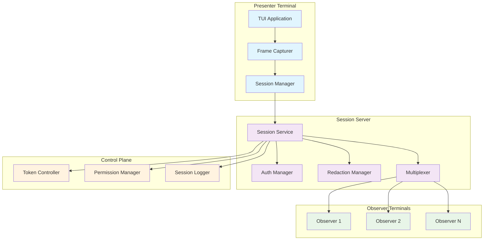
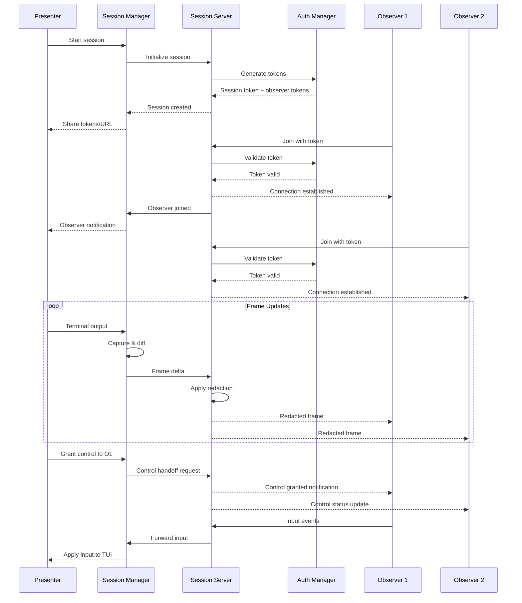
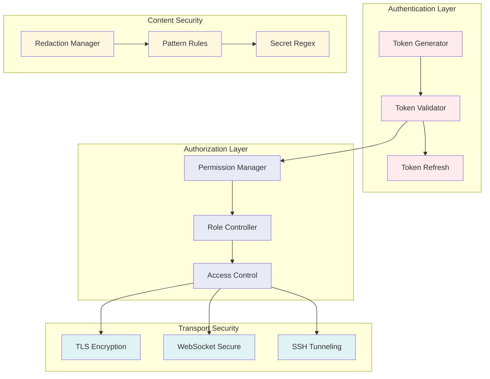

# F034: Collaborative Session Design

## Executive Summary

The Collaborative Session feature enables real-time sharing of TUI sessions over the network, allowing a presenter to invite read-only observers or temporarily grant control to participants. This system addresses critical operational needs for incident response, training, and collaborative debugging by providing a secure, low-latency alternative to traditional screen sharing.

**Key Benefits:**
- Instant incident response coordination without video call overhead
- Crisp terminal rendering preserving exact visual fidelity
- Secure token-based authentication with automatic expiry
- Granular control handoff with explicit approval flows
- Built-in redaction of sensitive information

**Core Components:**
- Session multiplexing server with WebSocket/SSH transport
- Frame differential encoding for bandwidth optimization
- Token-based authentication with role-based permissions
- Real-time control handoff mechanism
- Configurable content redaction engine

## System Architecture

### High-Level Architecture



### Component Responsibilities

#### Session Manager
- Coordinates frame capture and distribution
- Manages participant lifecycle (join/leave/handoff)
- Maintains session state and metadata
- Handles network reconnection and error recovery

#### Frame Capturer
- Efficiently captures terminal output changes
- Implements differential encoding to minimize bandwidth
- Buffers frames for late-joining observers
- Applies redaction rules before transmission

#### Auth Manager
- Validates session tokens and participant credentials
- Enforces role-based access controls
- Manages token expiration and renewal
- Provides audit logging for security events

#### Multiplexer
- Distributes frame updates to all connected observers
- Routes control input from active presenter
- Manages bandwidth throttling and QoS
- Handles participant-specific view states

### Data Flow Architecture



### Security Architecture



## API Specification

### Session Management Endpoints

#### Create Session
```http
POST /api/v1/sessions
Authorization: Bearer <api-key>
Content-Type: application/json

{
  "title": "Incident Response Session",
  "description": "Production queue debugging",
  "maxObservers": 10,
  "timeoutMinutes": 60,
  "allowControlHandoff": true,
  "redactionRules": ["password", "token", "key"]
}
```

**Response:**
```json
{
  "sessionId": "sess_abc123",
  "presenterToken": "pres_xyz789",
  "observerToken": "obs_def456",
  "wsUrl": "wss://session.example.com/sessions/sess_abc123",
  "expiresAt": "2024-01-15T16:30:00Z"
}
```

#### Join Session
```http
GET /api/v1/sessions/{sessionId}/join?token={observerToken}
Upgrade: websocket
Connection: Upgrade
```

#### Grant Control
```http
POST /api/v1/sessions/{sessionId}/control
Authorization: Bearer <presenter-token>
Content-Type: application/json

{
  "grantTo": "observer_user123",
  "timeoutSeconds": 300,
  "permissions": ["input", "navigation"]
}
```

#### Revoke Control
```http
DELETE /api/v1/sessions/{sessionId}/control
Authorization: Bearer <presenter-token>
```

### WebSocket Protocol

#### Frame Update Message
```json
{
  "type": "frame_update",
  "sessionId": "sess_abc123",
  "sequence": 1234,
  "timestamp": "2024-01-15T15:45:30Z",
  "delta": {
    "rows": [
      {"line": 5, "content": "Queue: orders (1,234 items)", "changed": true},
      {"line": 6, "content": "Status: ACTIVE", "changed": true}
    ],
    "cursor": {"row": 5, "col": 0}
  }
}
```

#### Control Grant Message
```json
{
  "type": "control_granted",
  "sessionId": "sess_abc123",
  "grantedTo": "observer_user123",
  "timeoutSeconds": 300,
  "permissions": ["input", "navigation"]
}
```

#### Input Event Message
```json
{
  "type": "input_event",
  "sessionId": "sess_abc123",
  "timestamp": "2024-01-15T15:45:31Z",
  "event": {
    "type": "key",
    "key": "ArrowDown",
    "modifiers": []
  }
}
```

## Data Models

### Session Model
```json
{
  "sessionId": "sess_abc123",
  "title": "Production Debugging",
  "description": "Investigating queue backlog",
  "presenterId": "user_123",
  "status": "active",
  "createdAt": "2024-01-15T15:00:00Z",
  "expiresAt": "2024-01-15T16:00:00Z",
  "maxObservers": 10,
  "currentObservers": 3,
  "allowControlHandoff": true,
  "redactionRules": ["password", "token", "secret"],
  "metadata": {
    "terminalSize": {"rows": 24, "cols": 80},
    "applicationName": "redis-work-queue",
    "version": "1.0.0"
  }
}
```

### Participant Model
```json
{
  "participantId": "part_xyz789",
  "sessionId": "sess_abc123",
  "userId": "user_456",
  "role": "observer",
  "joinedAt": "2024-01-15T15:05:00Z",
  "lastActivity": "2024-01-15T15:30:00Z",
  "hasControl": false,
  "permissions": ["view"],
  "clientInfo": {
    "userAgent": "TerminalClient/1.0",
    "terminalSize": {"rows": 24, "cols": 80},
    "ipAddress": "192.168.1.100"
  }
}
```

### Frame Model
```json
{
  "frameId": "frame_123456",
  "sessionId": "sess_abc123",
  "sequence": 1234,
  "timestamp": "2024-01-15T15:45:30Z",
  "delta": {
    "changedLines": [
      {"lineNumber": 5, "content": "Queue: orders (1,234 items)"},
      {"lineNumber": 6, "content": "Status: ACTIVE"}
    ],
    "cursor": {"row": 5, "col": 0},
    "attributes": {
      "colors": {"5": "green", "6": "yellow"},
      "styles": {"5": "bold"}
    }
  },
  "redacted": true,
  "byteSize": 256
}
```

### Token Model
```json
{
  "tokenId": "tok_abc123",
  "sessionId": "sess_abc123",
  "type": "observer",
  "userId": "user_456",
  "issuedAt": "2024-01-15T15:00:00Z",
  "expiresAt": "2024-01-15T16:00:00Z",
  "permissions": ["view", "input"],
  "used": true,
  "revokedAt": null,
  "metadata": {
    "issuer": "session-service",
    "clientIp": "192.168.1.100"
  }
}
```

## Security Model

### Threat Analysis

#### Authentication Threats
- **Token theft/interception**: Mitigated by short-lived tokens (1hr default) and HTTPS-only transmission
- **Session hijacking**: Prevented by binding tokens to client IP and User-Agent
- **Replay attacks**: Countered by one-time token usage and sequence numbers

#### Authorization Threats
- **Privilege escalation**: Role-based permissions with explicit grant/revoke flows
- **Unauthorized control**: Control handoff requires presenter approval and timeout enforcement
- **Session bombing**: Rate limiting and maximum observer caps

#### Content Security Threats
- **Sensitive data exposure**: Configurable redaction patterns for passwords, tokens, secrets
- **Frame injection**: Content validation and sanitization before broadcast
- **Data exfiltration**: Session logging and audit trails for compliance

### Permission Model

```yaml
roles:
  presenter:
    permissions:
      - session:create
      - session:terminate
      - control:grant
      - control:revoke
      - participants:view
      - participants:remove

  observer:
    permissions:
      - session:view
      - frames:receive

  controller:
    permissions:
      - session:view
      - frames:receive
      - input:send
      - navigation:perform
```

### Redaction Engine

The redaction system uses configurable regex patterns to identify and mask sensitive content:

```yaml
redactionRules:
  - name: "password"
    pattern: "(?i)(password|passwd|pwd)\\s*[:=]\\s*\\S+"
    replacement: "PASSWORD=[REDACTED]"

  - name: "api_key"
    pattern: "(?i)(api[_-]?key|token)\\s*[:=]\\s*[a-zA-Z0-9_-]{20,}"
    replacement: "API_KEY=[REDACTED]"

  - name: "connection_string"
    pattern: "(?i)(redis|mysql|postgres)://[^\\s]+"
    replacement: "CONNECTION=[REDACTED]"
```

## Performance Requirements

### Latency Requirements
- **Frame propagation**: <50ms from presenter to observers
- **Control handoff**: <100ms acknowledgment time
- **Session join**: <200ms from token to first frame
- **WebSocket reconnection**: <500ms automatic retry

### Throughput Requirements
- **Concurrent sessions**: 100 active sessions per server instance
- **Observers per session**: 50 maximum concurrent observers
- **Frame rate**: 30 fps sustained during high activity
- **Bandwidth per observer**: <100KB/s average, <500KB/s peak

### Scalability Targets
- **Horizontal scaling**: Stateless session servers with Redis coordination
- **Geographic distribution**: Multi-region deployment with <200ms inter-region sync
- **Auto-scaling**: CPU-based scaling from 2-20 server instances
- **Session persistence**: 1-hour default expiry, 8-hour maximum

### Resource Utilization
- **Memory per session**: <10MB for session state and frame buffer
- **CPU per session**: <5% of single core for frame processing
- **Network bandwidth**: <1Mbps per session including all observers
- **Storage**: 7-day session log retention with compression

## Testing Strategy

### Unit Testing
- **Frame differential algorithm**: Verify minimal delta generation
- **Redaction engine**: Test pattern matching and replacement accuracy
- **Token validation**: Confirm expiry, revocation, and permission enforcement
- **Input event routing**: Validate control flow and permission checks

### Integration Testing
- **Multi-observer scenarios**: Test frame consistency across observers
- **Network resilience**: Simulate disconnections and reconnections
- **Control handoff flows**: Verify permission transitions and timeouts
- **Security boundaries**: Confirm isolation between sessions

### Performance Testing
- **Load testing**: 100 concurrent sessions with 10 observers each
- **Latency measurement**: Frame propagation timing under various loads
- **Memory profiling**: Session state and frame buffer optimization
- **Bandwidth analysis**: Network utilization patterns and optimization

### Security Testing
- **Penetration testing**: Attempt unauthorized session access
- **Token security**: Test token generation, validation, and revocation
- **Content validation**: Verify redaction effectiveness
- **Audit compliance**: Confirm logging and monitoring coverage

## Deployment Plan

### Infrastructure Requirements
- **Container runtime**: Docker with Kubernetes orchestration
- **Load balancer**: NGINX with WebSocket proxy support
- **Session storage**: Redis cluster for session state persistence
- **Monitoring**: Prometheus metrics with Grafana dashboards

### Configuration Management
```yaml
sessionService:
  maxConcurrentSessions: 100
  defaultSessionTimeout: "1h"
  maxSessionTimeout: "8h"
  frameBufferSize: 1000

  transport:
    websocket:
      port: 8080
      path: "/sessions"
      compression: true

  redis:
    cluster: "redis://cluster.example.com:6379"
    keyPrefix: "collab_sessions:"

  security:
    tokenSecret: "${TOKEN_SECRET}"
    requireTLS: true
    rateLimiting:
      joinSession: "10/minute"
      createSession: "5/minute"
```

### Deployment Steps
1. **Infrastructure provisioning**: Deploy Redis cluster and load balancers
2. **Service deployment**: Roll out session service containers with health checks
3. **Client integration**: Update TUI applications with session manager SDK
4. **Monitoring setup**: Configure metrics collection and alerting
5. **Documentation**: Publish API docs and usage guides

### Rollback Strategy
- **Blue-green deployment**: Maintain parallel service versions
- **Session migration**: Graceful handoff of active sessions
- **Feature flags**: Disable collaborative features without service restart
- **Data preservation**: Session logs and audit trails retained during rollback

## Monitoring and Observability

### Key Metrics
```yaml
sessionMetrics:
  - name: "active_sessions_total"
    type: "gauge"
    description: "Number of currently active collaborative sessions"

  - name: "session_duration_seconds"
    type: "histogram"
    description: "Distribution of session durations"

  - name: "frame_latency_milliseconds"
    type: "histogram"
    description: "Frame propagation latency distribution"

  - name: "observer_count_per_session"
    type: "histogram"
    description: "Distribution of observers per session"
```

### Alerting Rules
- **High latency**: Frame propagation >100ms for 5 minutes
- **Session failures**: >5% session creation failures in 10 minutes
- **Memory usage**: Session service memory >80% for 15 minutes
- **Security events**: Failed authentication attempts >10/minute

### Logging Strategy
```json
{
  "timestamp": "2024-01-15T15:45:30Z",
  "level": "INFO",
  "service": "collaborative-session",
  "event": "session_created",
  "sessionId": "sess_abc123",
  "presenterId": "user_123",
  "metadata": {
    "title": "Production Debugging",
    "maxObservers": 10,
    "allowControlHandoff": true
  }
}
```

---

## Implementation Interfaces

### Session Manager Interface
```go
type SessionManager interface {
    // Core session lifecycle
    CreateSession(ctx context.Context, req CreateSessionRequest) (*Session, error)
    JoinSession(ctx context.Context, sessionId, token string) (*SessionConnection, error)
    TerminateSession(ctx context.Context, sessionId string) error

    // Frame management
    CaptureFrame(ctx context.Context, sessionId string, content TerminalContent) error
    GetFrameHistory(ctx context.Context, sessionId string, limit int) ([]*Frame, error)

    // Control management
    GrantControl(ctx context.Context, sessionId, grantTo string, timeout time.Duration) error
    RevokeControl(ctx context.Context, sessionId string) error
    SendInput(ctx context.Context, sessionId string, event InputEvent) error

    // Participant management
    ListParticipants(ctx context.Context, sessionId string) ([]*Participant, error)
    RemoveParticipant(ctx context.Context, sessionId, participantId string) error
}
```

### Frame Capturer Interface
```go
type FrameCapturer interface {
    // Frame capture and processing
    CaptureTerminal(ctx context.Context, terminalState TerminalState) (*RawFrame, error)
    GenerateDelta(ctx context.Context, previous, current *RawFrame) (*FrameDelta, error)
    ApplyRedaction(ctx context.Context, frame *FrameDelta, rules []RedactionRule) (*FrameDelta, error)

    // Buffer management
    BufferFrame(ctx context.Context, sessionId string, frame *FrameDelta) error
    GetBufferedFrames(ctx context.Context, sessionId string, fromSequence int64) ([]*FrameDelta, error)
}
```

### Authentication Interface
```go
type AuthManager interface {
    // Token management
    GenerateSessionToken(ctx context.Context, sessionId, userId string, role TokenRole) (*Token, error)
    ValidateToken(ctx context.Context, tokenValue string) (*TokenClaims, error)
    RevokeToken(ctx context.Context, tokenId string) error
    RefreshToken(ctx context.Context, tokenValue string) (*Token, error)

    // Permission management
    CheckPermission(ctx context.Context, userId, resource, action string) (bool, error)
    GrantPermission(ctx context.Context, userId, resource, action string) error
    RevokePermission(ctx context.Context, userId, resource, action string) error
}
```

### Transport Interface
```go
type Transport interface {
    // Connection management
    StartServer(ctx context.Context, config TransportConfig) error
    StopServer(ctx context.Context) error

    // Message handling
    BroadcastFrame(ctx context.Context, sessionId string, frame *FrameDelta) error
    SendMessage(ctx context.Context, participantId string, message Message) error
    RegisterHandler(messageType string, handler MessageHandler) error

    // Connection lifecycle
    OnConnect(handler func(conn Connection))
    OnDisconnect(handler func(conn Connection))
    OnMessage(handler func(conn Connection, message Message))
}
```

---

This design provides a comprehensive foundation for implementing the Collaborative Session feature, addressing all technical, security, and operational requirements while maintaining flexibility for future enhancements.