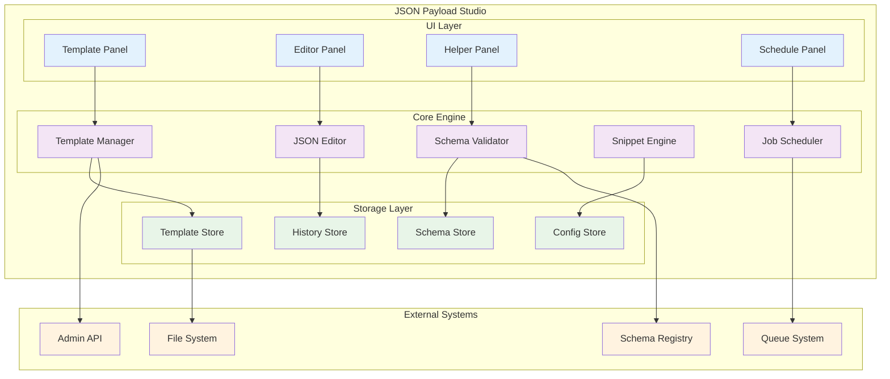
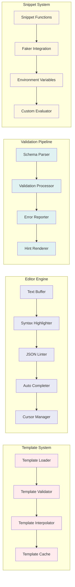
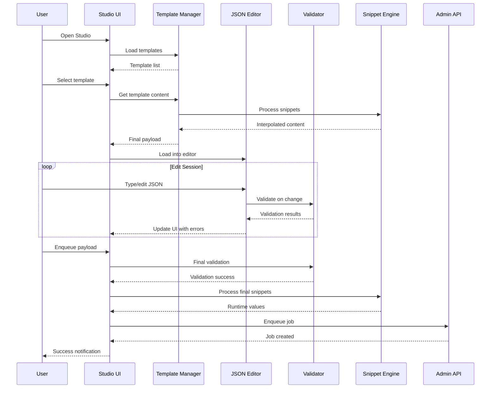
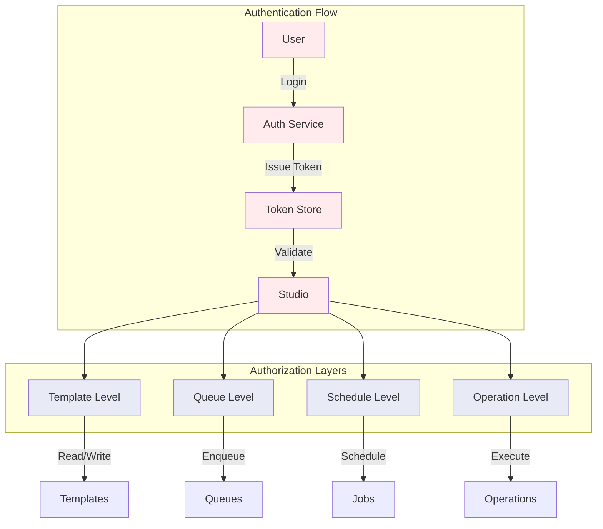

# F035: JSON Payload Studio Design

## Executive Summary

The JSON Payload Studio transforms job creation from a chore into a delightful developer experience by providing an in-TUI JSON editor with intelligent templates, real-time validation, dynamic snippets, and visual scheduling. This feature addresses the critical gap between raw job queueing and developer productivity by offering a "Postman for job queues" experience directly within the terminal interface.

**Key Benefits:**
- Eliminate context switching with integrated JSON editing and validation
- Prevent malformed payloads through schema-driven intelligence
- Accelerate development with reusable templates and dynamic snippets
- Enable safe production operations with scheduling and safety guardrails
- Provide comprehensive payload testing and debugging capabilities

**Core Components:**
- Multi-panel TUI layout with editor, templates, and validation helpers
- Smart template system with variable interpolation
- Real-time JSON schema validation with inline error reporting
- Dynamic snippet engine with Faker integration
- Visual scheduling interface for delayed and recurring jobs
- Integrated safety features and production safeguards

## System Architecture

### High-Level Architecture



### Component Architecture



### Data Flow Architecture



## API Specification

### Template Management Endpoints

#### Load Template
```http
GET /api/v1/studio/templates/{templateId}
Authorization: Bearer <token>
```

**Response:**
```json
{
  "templateId": "user_signup",
  "name": "User Signup Template",
  "category": "user",
  "description": "Standard new user registration payload",
  "schema": "schemas/user_signup.json",
  "payload": {
    "type": "user_signup",
    "user": {
      "email": "{{input:email}}",
      "name": "{{input:name}}",
      "plan": "{{select:free,pro,premium}}"
    },
    "timestamp": "{{now()}}",
    "request_id": "{{uuid()}}"
  },
  "variables": {
    "email": {
      "type": "string",
      "format": "email",
      "description": "User's email address"
    }
  },
  "defaults": {
    "priority": 5,
    "retry_count": 3
  }
}
```

#### List Templates
```http
GET /api/v1/studio/templates?category={category}&search={query}
Authorization: Bearer <token>
```

#### Save Template
```http
POST /api/v1/studio/templates
Authorization: Bearer <token>
Content-Type: application/json

{
  "name": "Custom Template",
  "category": "custom",
  "payload": { "custom": "payload" },
  "schema": "optional_schema_id"
}
```

### Validation Endpoints

#### Validate Payload
```http
POST /api/v1/studio/validate
Authorization: Bearer <token>
Content-Type: application/json

{
  "payload": { "user": { "email": "test@example.com" } },
  "schemaId": "user_signup",
  "queueName": "user_registration"
}
```

**Response:**
```json
{
  "valid": false,
  "errors": [
    {
      "path": "$.user.name",
      "message": "Required property 'name' is missing",
      "severity": "error",
      "line": 3,
      "column": 15
    }
  ],
  "warnings": [
    {
      "path": "$.user.plan",
      "message": "Consider using enum values: free, pro, premium",
      "severity": "warning"
    }
  ]
}
```

### Job Scheduling Endpoints

#### Schedule Job
```http
POST /api/v1/studio/schedule
Authorization: Bearer <token>
Content-Type: application/json

{
  "payload": { "type": "user_signup" },
  "queueName": "user_registration",
  "schedule": {
    "type": "delayed",
    "runAt": "2024-01-15T18:00:00Z"
  },
  "options": {
    "count": 1,
    "priority": 5,
    "retryCount": 3
  }
}
```

#### Batch Enqueue
```http
POST /api/v1/studio/batch
Authorization: Bearer <token>
Content-Type: application/json

{
  "template": "user_signup",
  "count": 100,
  "delayBetween": "100ms",
  "variables": {
    "counter": {"start": 1, "increment": 1}
  },
  "queueName": "user_registration"
}
```

### History and Draft Endpoints

#### Get Job History
```http
GET /api/v1/studio/history?limit=50&queue={queueName}
Authorization: Bearer <token>
```

#### Save Draft
```http
POST /api/v1/studio/drafts
Authorization: Bearer <token>
Content-Type: application/json

{
  "name": "work_in_progress",
  "payload": { "draft": "content" },
  "templateId": "user_signup"
}
```

## Data Models

### Template Model
```json
{
  "templateId": "user_signup_v2",
  "name": "User Signup Template v2",
  "category": "user",
  "description": "Enhanced user registration with validation",
  "version": "2.1.0",
  "author": "dev-team",
  "createdAt": "2024-01-15T10:00:00Z",
  "updatedAt": "2024-01-15T15:30:00Z",
  "tags": ["user", "registration", "onboarding"],
  "schema": {
    "id": "user_signup_schema",
    "version": "1.0"
  },
  "payload": {
    "type": "user_signup",
    "version": "2.1",
    "user": {
      "email": "{{input:email|required|format:email}}",
      "name": "{{input:name|required|minLength:2}}",
      "plan": "{{select:free,pro,premium|default:free}}",
      "metadata": {
        "source": "{{select:web,mobile,api|default:web}}",
        "campaign": "{{input:campaign|optional}}"
      }
    },
    "timestamp": "{{now()}}",
    "request_id": "{{uuid()}}",
    "environment": "{{env.ENVIRONMENT|default:development}}"
  },
  "variables": {
    "email": {
      "type": "string",
      "format": "email",
      "description": "User's email address",
      "validation": {
        "required": true,
        "pattern": "^[^@]+@[^@]+\\.[^@]+$"
      }
    },
    "name": {
      "type": "string",
      "description": "User's full name",
      "validation": {
        "required": true,
        "minLength": 2,
        "maxLength": 100
      }
    }
  },
  "defaults": {
    "priority": 5,
    "retry_count": 3,
    "timeout": "30s"
  },
  "safety": {
    "maxBatchSize": 1000,
    "requireConfirmation": ["production"],
    "redactFields": ["password", "secret"]
  }
}
```

### Editor State Model
```json
{
  "sessionId": "sess_editor_123",
  "payload": {
    "content": "{\n  \"type\": \"user_signup\"\n}",
    "cursorPosition": {"line": 2, "column": 25},
    "selection": {
      "start": {"line": 1, "column": 0},
      "end": {"line": 2, "column": 25}
    }
  },
  "template": {
    "id": "user_signup",
    "applied": true,
    "variables": {
      "email": "test@example.com",
      "name": "John Doe"
    }
  },
  "validation": {
    "enabled": true,
    "schemaId": "user_signup_schema",
    "lastRun": "2024-01-15T15:45:30Z",
    "status": "valid",
    "errors": [],
    "warnings": []
  },
  "history": {
    "undoStack": [
      {"action": "insert", "position": {"line": 2, "column": 20}, "text": "\"John\""}
    ],
    "redoStack": []
  },
  "metadata": {
    "created": "2024-01-15T15:40:00Z",
    "modified": "2024-01-15T15:45:30Z",
    "autoSaved": "2024-01-15T15:45:00Z"
  }
}
```

### Validation Result Model
```json
{
  "validationId": "val_123456",
  "timestamp": "2024-01-15T15:45:30Z",
  "payload": { "type": "user_signup" },
  "schema": {
    "id": "user_signup_schema",
    "version": "1.0"
  },
  "result": {
    "valid": false,
    "score": 85,
    "summary": {
      "errors": 2,
      "warnings": 1,
      "suggestions": 3
    }
  },
  "issues": [
    {
      "id": "err_001",
      "severity": "error",
      "type": "missing_required_field",
      "path": "$.user.name",
      "message": "Required property 'name' is missing",
      "position": {"line": 3, "column": 15},
      "suggestion": "Add required field 'name' to user object",
      "fixable": true,
      "autoFix": {
        "action": "insert",
        "content": "\"name\": \"{{input:name}}\","
      }
    },
    {
      "id": "warn_001",
      "severity": "warning",
      "type": "type_suggestion",
      "path": "$.user.age",
      "message": "Field 'age' should be number, not string",
      "position": {"line": 5, "column": 10},
      "suggestion": "Convert string to number"
    }
  ],
  "suggestions": [
    {
      "type": "optimization",
      "message": "Consider adding request_id for tracing",
      "template": "\"request_id\": \"{{uuid()}}\""
    }
  ]
}
```

### Job Schedule Model
```json
{
  "scheduleId": "sched_abc123",
  "type": "cron",
  "expression": "0 2 * * *",
  "timezone": "UTC",
  "nextRuns": [
    "2024-01-16T02:00:00Z",
    "2024-01-17T02:00:00Z",
    "2024-01-18T02:00:00Z"
  ],
  "job": {
    "templateId": "daily_report",
    "queueName": "report_generation",
    "payload": { "type": "daily_report" },
    "options": {
      "priority": 3,
      "retryCount": 2,
      "timeout": "300s"
    }
  },
  "safety": {
    "maxConcurrent": 1,
    "skipIfRunning": true,
    "alertOnFailure": true
  },
  "metadata": {
    "createdBy": "user_123",
    "createdAt": "2024-01-15T15:00:00Z",
    "description": "Daily user activity report"
  }
}
```

### Snippet Function Model
```json
{
  "functions": {
    "now": {
      "description": "Current timestamp",
      "syntax": "{{now([offset])}}",
      "examples": [
        "{{now()}} -> 2024-01-15T15:45:30Z",
        "{{now(+1h)}} -> 2024-01-15T16:45:30Z",
        "{{now(-30m)}} -> 2024-01-15T15:15:30Z"
      ],
      "parameters": {
        "offset": {
          "type": "string",
          "optional": true,
          "description": "Time offset (+1h, -30m, +2d)"
        }
      }
    },
    "uuid": {
      "description": "Generate UUID v4",
      "syntax": "{{uuid()}}",
      "examples": ["{{uuid()}} -> 550e8400-e29b-41d4-a716-446655440000"]
    },
    "random": {
      "description": "Random number",
      "syntax": "{{random(min, max)}}",
      "examples": [
        "{{random(1, 100)}} -> 42",
        "{{random(0, 1)}} -> 0.7531"
      ],
      "parameters": {
        "min": {"type": "number", "required": true},
        "max": {"type": "number", "required": true}
      }
    },
    "faker": {
      "description": "Faker data generation",
      "syntax": "{{faker.method([args])}}",
      "methods": {
        "name": "Full name",
        "email": "Email address",
        "phone": "Phone number",
        "company": "Company name",
        "address": "Street address",
        "lorem": "Lorem ipsum text"
      },
      "examples": [
        "{{faker.name()}} -> John Doe",
        "{{faker.email()}} -> john.doe@example.com",
        "{{faker.lorem(5)}} -> Lorem ipsum dolor sit amet"
      ]
    }
  }
}
```

## Security Model

### Authentication and Authorization



### Permission Model
```yaml
permissions:
  studio.use:
    description: "Access to JSON Payload Studio"

  studio.templates.read:
    description: "View templates"

  studio.templates.write:
    description: "Create/modify templates"

  studio.templates.share:
    description: "Share templates with team"

  studio.queues.enqueue:
    description: "Enqueue jobs to specific queues"
    scoped_by: queue_name

  studio.schedule.create:
    description: "Create scheduled jobs"

  studio.batch.create:
    description: "Create batch jobs"
    constraints:
      max_count: 1000

  studio.production.access:
    description: "Access production environments"
    requires_mfa: true
```

### Content Security

#### PII Detection Engine
```yaml
pii_patterns:
  - name: "email"
    pattern: "[a-zA-Z0-9._%+-]+@[a-zA-Z0-9.-]+\\.[a-zA-Z]{2,}"
    severity: "medium"
    action: "warn"

  - name: "ssn"
    pattern: "\\d{3}-\\d{2}-\\d{4}"
    severity: "high"
    action: "block"

  - name: "credit_card"
    pattern: "\\d{4}[\\s-]?\\d{4}[\\s-]?\\d{4}[\\s-]?\\d{4}"
    severity: "high"
    action: "block"

  - name: "api_key"
    pattern: "(?i)(api[_-]?key|token)\\s*[:=]\\s*['\"]?[a-zA-Z0-9_-]{20,}['\"]?"
    severity: "high"
    action: "redact"
```

#### Safety Checks
```go
type SafetyChecker struct {
    MaxPayloadSize   int64
    MaxBatchSize     int
    ProductionQueues []string
    PIIDetector      *PIIDetector
    RateLimiter      *RateLimiter
}

func (sc *SafetyChecker) ValidateOperation(op Operation) []SafetyIssue {
    var issues []SafetyIssue

    // Size validation
    if op.PayloadSize > sc.MaxPayloadSize {
        issues = append(issues, SafetyIssue{
            Type: "payload_too_large",
            Severity: "error",
            Message: "Payload exceeds maximum size limit",
        })
    }

    // Production validation
    if sc.isProductionQueue(op.QueueName) {
        if !op.ConfirmationReceived {
            issues = append(issues, SafetyIssue{
                Type: "production_confirmation_required",
                Severity: "block",
                Message: "Production operations require explicit confirmation",
            })
        }
    }

    // PII validation
    if piiIssues := sc.PIIDetector.Scan(op.Payload); len(piiIssues) > 0 {
        issues = append(issues, piiIssues...)
    }

    return issues
}
```

## Performance Requirements

### Response Time Targets
- **Template loading**: <100ms for cached templates
- **Syntax highlighting**: <50ms for files up to 1MB
- **Real-time validation**: <200ms for schema validation
- **Autocomplete**: <30ms for suggestions
- **Save operations**: <500ms for template saves

### Throughput Requirements
- **Concurrent users**: 50 active studio sessions per server
- **Template operations**: 1,000 template loads per minute
- **Validation requests**: 500 validations per minute
- **Job submissions**: 100 jobs per minute per user

### Resource Utilization
- **Memory per session**: <50MB including editor buffer and caches
- **CPU per operation**: <5% of single core for validation
- **Storage**: <1GB for templates, history, and cache per user
- **Network**: <10KB/s sustained for real-time features

### Scalability Targets
```yaml
performance_targets:
  editor:
    max_file_size: "10MB"
    syntax_highlighting: "<50ms"
    auto_save_interval: "30s"
    undo_history_limit: 1000

  validation:
    schema_cache_size: "100MB"
    validation_timeout: "5s"
    concurrent_validations: 10

  templates:
    cache_limit: 500
    load_timeout: "2s"
    search_response: "<100ms"

  snippets:
    evaluation_timeout: "1s"
    cache_size: "10MB"
    faker_cache_duration: "5m"
```

## Testing Strategy

### Unit Testing
```go
func TestJSONEditor(t *testing.T) {
    tests := []struct {
        name     string
        input    string
        expected EditorState
    }{
        {
            name:  "basic JSON editing",
            input: `{"user": {"name": "test"}}`,
            expected: EditorState{
                Valid: true,
                Lines: 1,
            },
        },
        {
            name:  "invalid JSON",
            input: `{"user": {"name": "test"`,
            expected: EditorState{
                Valid: false,
                Errors: []ValidationError{
                    {Line: 1, Column: 22, Message: "Unterminated string"},
                },
            },
        },
    }

    for _, tt := range tests {
        t.Run(tt.name, func(t *testing.T) {
            editor := NewJSONEditor()
            editor.SetContent(tt.input)

            state := editor.GetState()
            assert.Equal(t, tt.expected.Valid, state.Valid)
            assert.Equal(t, len(tt.expected.Errors), len(state.Errors))
        })
    }
}
```

### Integration Testing
```go
func TestStudioWorkflow(t *testing.T) {
    studio := NewStudio(t)
    defer studio.Cleanup()

    // Load template
    template, err := studio.LoadTemplate("user_signup")
    require.NoError(t, err)

    // Edit payload
    studio.Editor.SetContent(template.Payload)
    studio.Editor.InsertAt(Position{3, 15}, `"John Doe"`)

    // Validate
    result, err := studio.Validate()
    require.NoError(t, err)
    assert.True(t, result.Valid)

    // Enqueue
    jobID, err := studio.Enqueue("test_queue")
    require.NoError(t, err)
    assert.NotEmpty(t, jobID)
}
```

### Performance Testing
```go
func BenchmarkSyntaxHighlighting(b *testing.B) {
    editor := NewJSONEditor()
    payload := generateLargeJSON(1024 * 1024) // 1MB JSON

    b.ResetTimer()
    for i := 0; i < b.N; i++ {
        editor.HighlightSyntax(payload)
    }
}

func TestValidationPerformance(t *testing.T) {
    validator := NewSchemaValidator()
    schema := loadTestSchema()
    payload := generateTestPayload()

    start := time.Now()
    for i := 0; i < 1000; i++ {
        validator.Validate(payload, schema)
    }
    duration := time.Since(start)

    assert.True(t, duration < time.Second, "1000 validations should complete in <1s")
}
```

### User Experience Testing
```yaml
ux_test_scenarios:
  - name: "New user onboarding"
    steps:
      - Open studio for first time
      - Browse template gallery
      - Load simple template
      - Make basic edit
      - Validate and enqueue
    success_criteria:
      - Completes flow in <2 minutes
      - No confusion about controls
      - Validation errors are clear

  - name: "Power user workflow"
    steps:
      - Load complex template
      - Use snippets and variables
      - Batch operations with scheduling
      - Save custom template
    success_criteria:
      - Productivity gains vs external tools
      - Advanced features discoverable
      - No performance degradation
```

## Deployment Plan

### Infrastructure Requirements
```yaml
studio_service:
  containers:
    - name: "studio-api"
      image: "studio-api:latest"
      resources:
        cpu: "1000m"
        memory: "2Gi"

  storage:
    - name: "templates"
      type: "persistent"
      size: "10Gi"

    - name: "user-data"
      type: "persistent"
      size: "50Gi"

  dependencies:
    - redis-cache
    - postgres-db
    - schema-registry
```

### Configuration Management
```yaml
# config/studio.yaml
studio:
  editor:
    max_file_size: "10MB"
    auto_save_interval: "30s"
    syntax_highlighting: true
    bracket_matching: true

  templates:
    directory: "/app/templates"
    cache_size: 500
    auto_reload: true

  validation:
    schema_registry_url: "http://schema-registry:8080"
    timeout: "5s"
    cache_ttl: "5m"

  safety:
    pii_detection: true
    production_confirmation: true
    max_batch_size: 1000
    rate_limit: "100/minute"

  features:
    snippets: true
    faker_integration: true
    scheduling: true
    history: true
```

### Deployment Steps
1. **Schema Registry Setup**: Deploy schema validation service
2. **Template Migration**: Import existing job examples as templates
3. **Service Deployment**: Roll out studio API with feature flags
4. **TUI Integration**: Update terminal interface with studio components
5. **User Training**: Documentation and demo sessions
6. **Gradual Rollout**: Enable for dev environments first, then staging/prod

### Monitoring and Observability
```yaml
metrics:
  usage:
    - studio_sessions_active
    - templates_loaded_total
    - jobs_enqueued_via_studio
    - validation_errors_caught

  performance:
    - editor_operation_duration
    - validation_response_time
    - template_load_time
    - snippet_evaluation_time

  errors:
    - validation_failures_total
    - template_load_errors
    - enqueue_failures
    - snippet_evaluation_errors

alerts:
  - name: "high_validation_error_rate"
    condition: "validation_failures > 10% over 5m"

  - name: "slow_editor_performance"
    condition: "editor_operation_duration p95 > 200ms"

  - name: "template_load_failures"
    condition: "template_load_errors > 5 over 1m"
```

---

## Implementation Interfaces

### Core Studio Interface
```go
type Studio interface {
    // Session management
    CreateSession(ctx context.Context, userID string) (*Session, error)
    GetSession(ctx context.Context, sessionID string) (*Session, error)
    CloseSession(ctx context.Context, sessionID string) error

    // Template operations
    ListTemplates(ctx context.Context, filter TemplateFilter) ([]*Template, error)
    LoadTemplate(ctx context.Context, templateID string) (*Template, error)
    SaveTemplate(ctx context.Context, template *Template) error
    DeleteTemplate(ctx context.Context, templateID string) error

    // Editor operations
    SetContent(ctx context.Context, sessionID string, content string) error
    GetContent(ctx context.Context, sessionID string) (string, error)
    ValidateContent(ctx context.Context, sessionID string, schemaID string) (*ValidationResult, error)

    // Job operations
    EnqueueJob(ctx context.Context, req EnqueueRequest) (*EnqueueResult, error)
    ScheduleJob(ctx context.Context, req ScheduleRequest) (*ScheduleResult, error)
    BatchEnqueue(ctx context.Context, req BatchRequest) (*BatchResult, error)
}
```

### Template Manager Interface
```go
type TemplateManager interface {
    // Template CRUD
    Load(ctx context.Context, id string) (*Template, error)
    Save(ctx context.Context, template *Template) error
    Delete(ctx context.Context, id string) error
    List(ctx context.Context, filter TemplateFilter) ([]*Template, error)

    // Template processing
    Interpolate(ctx context.Context, template *Template, variables map[string]interface{}) (string, error)
    ValidateTemplate(ctx context.Context, template *Template) (*ValidationResult, error)

    // Template discovery
    Search(ctx context.Context, query string) ([]*Template, error)
    GetByCategory(ctx context.Context, category string) ([]*Template, error)
}
```

### JSON Editor Interface
```go
type JSONEditor interface {
    // Content management
    SetContent(content string) error
    GetContent() string
    InsertAt(pos Position, text string) error
    DeleteRange(start, end Position) error

    // Cursor and selection
    SetCursor(pos Position) error
    GetCursor() Position
    SetSelection(start, end Position) error
    GetSelection() *Selection

    // Editing features
    Undo() error
    Redo() error
    AutoIndent() error
    FormatJSON() error

    // Validation and hints
    Validate(schema *Schema) (*ValidationResult, error)
    GetCompletions(pos Position) ([]*Completion, error)
    GetHover(pos Position) (*HoverInfo, error)
}
```

### Snippet Engine Interface
```go
type SnippetEngine interface {
    // Snippet evaluation
    Evaluate(ctx context.Context, template string, variables map[string]interface{}) (string, error)
    EvaluateFunction(ctx context.Context, function string, args []interface{}) (interface{}, error)

    // Function registration
    RegisterFunction(name string, fn SnippetFunction) error
    ListFunctions() []FunctionInfo
    GetFunctionHelp(name string) (*FunctionHelp, error)

    // Custom snippets
    AddUserSnippet(name string, template string) error
    GetUserSnippets() map[string]string
    DeleteUserSnippet(name string) error
}
```

### Schema Validator Interface
```go
type SchemaValidator interface {
    // Schema management
    LoadSchema(ctx context.Context, schemaID string) (*Schema, error)
    RegisterSchema(ctx context.Context, schema *Schema) error

    // Validation
    Validate(ctx context.Context, payload interface{}, schema *Schema) (*ValidationResult, error)
    ValidateWithHints(ctx context.Context, payload interface{}, schema *Schema) (*ValidationResult, error)

    // Schema introspection
    GetCompletions(ctx context.Context, schema *Schema, path string) ([]*Completion, error)
    GetFieldInfo(ctx context.Context, schema *Schema, path string) (*FieldInfo, error)
}
```

---

This design provides a comprehensive foundation for implementing the JSON Payload Studio, addressing all technical requirements while ensuring scalability, security, and exceptional user experience. The studio will transform job queue interactions from a necessary chore into a delightful and productive developer experience.