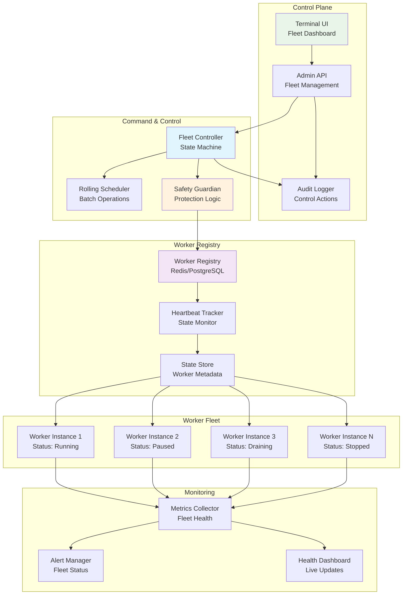
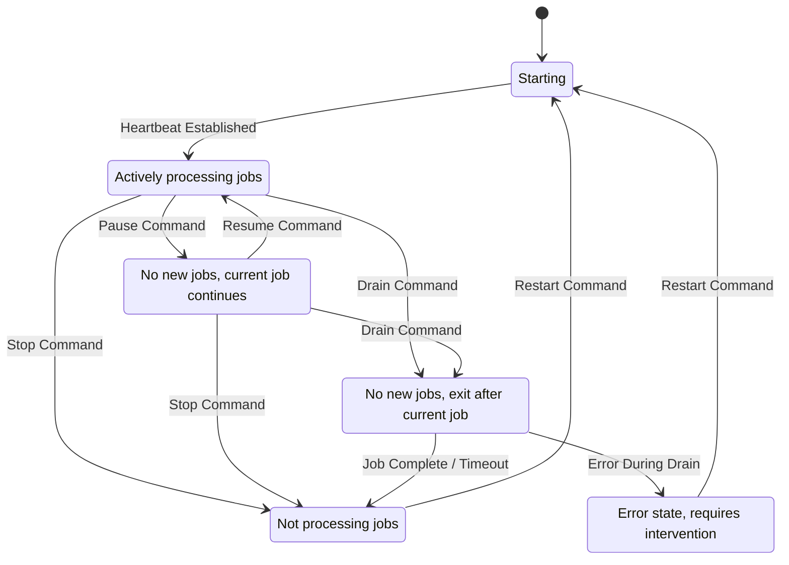
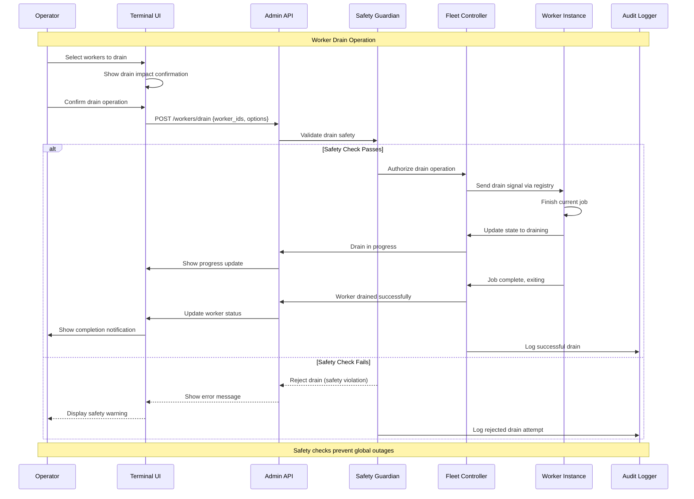

# F036: Worker Fleet Controls - Architecture Design

| **Attribute** | **Value** |
|---------------|-----------|
| **Feature ID** | F036 |
| **Feature Name** | Worker Fleet Controls |
| **Version** | 1.0.0 |
| **Author** | SLAPS Worker 5 |
| **Date** | 2025-09-14 |
| **Status** | Design Phase |
| **Complexity** | Medium |
| **Priority** | Medium-High |

## Executive Summary

Worker Fleet Controls transforms worker management from ad-hoc scripts and manual intervention into a comprehensive control plane with real-time visibility and safe operational controls. The system provides operators with precise tools to pause, resume, drain, and perform rolling restarts of worker instances—all through an intuitive Terminal UI with robust safety mechanisms and comprehensive audit trails.

This design addresses the critical operational challenge of managing distributed worker fleets during deployments, incident response, and routine maintenance. By implementing battle-tested patterns from container orchestration (like Kubernetes drain semantics), the system enables zero-downtime deployments and safe worker lifecycle management.

### Key Benefits
- **Zero-Downtime Operations**: Safe worker lifecycle management during deployments
- **Real-Time Visibility**: Live worker status, heartbeats, and active job tracking
- **Operational Safety**: Multiple confirmation layers and safety checks prevent accidents
- **Audit Compliance**: Complete audit trail of all fleet control actions
- **Deployment Automation**: Rolling restart capabilities with configurable concurrency

## System Architecture

### High-Level Architecture



### Worker State Machine



### Fleet Control Flow



## API Specification

The Worker Fleet Controls exposes REST APIs for fleet management and monitoring. See [F036 OpenAPI Specification](../api/f036-openapi.yaml) for complete API documentation.

### Core Endpoints

| Method | Endpoint | Description |
|--------|----------|-------------|
| `GET` | `/api/v1/workers` | List all workers with status and metadata |
| `POST` | `/api/v1/workers/{id}/pause` | Pause specific worker (stop accepting new jobs) |
| `POST` | `/api/v1/workers/{id}/resume` | Resume paused worker |
| `POST` | `/api/v1/workers/{id}/drain` | Drain worker (finish current job and exit) |
| `POST` | `/api/v1/workers/{id}/stop` | Force stop worker immediately |
| `POST` | `/api/v1/workers/batch` | Batch operations on multiple workers |
| `POST` | `/api/v1/fleet/rolling-restart` | Perform rolling restart with concurrency control |
| `GET` | `/api/v1/fleet/status` | Overall fleet health and statistics |
| `GET` | `/api/v1/fleet/audit` | Audit log of fleet control actions |

### Safety & Authorization

- **Multi-Factor Authorization**: Critical operations require elevated permissions
- **Confirmation Tokens**: Destructive operations require confirmation codes
- **Rate Limiting**: Protection against rapid-fire commands
- **Safety Circuits**: Automatic prevention of fleet-wide outages

## Data Models

Complete data model definitions are available in [F036 JSON Schema](../schemas/f036-schema.json).

### Core Entities

#### Worker Instance
```go
type Worker struct {
    ID           string                 `json:"id" db:"id"`
    HostID       string                 `json:"host_id" db:"host_id"`
    ProcessID    int                    `json:"process_id" db:"process_id"`
    State        WorkerState            `json:"state" db:"state"`
    LastHeartbeat time.Time              `json:"last_heartbeat" db:"last_heartbeat"`
    CurrentJob   *JobReference          `json:"current_job,omitempty" db:"current_job"`
    Metadata     WorkerMetadata         `json:"metadata" db:"metadata"`
    Configuration WorkerConfig          `json:"configuration" db:"configuration"`
    CreatedAt    time.Time              `json:"created_at" db:"created_at"`
    UpdatedAt    time.Time              `json:"updated_at" db:"updated_at"`
    Tags         []string               `json:"tags" db:"tags"`
    Version      string                 `json:"version" db:"version"`
}

type WorkerState string

const (
    WorkerStateStarting  WorkerState = "starting"
    WorkerStateRunning   WorkerState = "running"
    WorkerStatePaused    WorkerState = "paused"
    WorkerStateDraining  WorkerState = "draining"
    WorkerStateStopped   WorkerState = "stopped"
    WorkerStateFailed    WorkerState = "failed"
    WorkerStateUnknown   WorkerState = "unknown"
)
```

#### Fleet Command
```go
type FleetCommand struct {
    ID          string                 `json:"id" db:"id"`
    Type        CommandType            `json:"type" db:"type"`
    TargetIDs   []string               `json:"target_ids" db:"target_ids"`
    Parameters  map[string]interface{} `json:"parameters" db:"parameters"`
    Status      CommandStatus          `json:"status" db:"status"`
    Progress    CommandProgress        `json:"progress" db:"progress"`
    CreatedBy   string                 `json:"created_by" db:"created_by"`
    CreatedAt   time.Time              `json:"created_at" db:"created_at"`
    StartedAt   *time.Time             `json:"started_at,omitempty" db:"started_at"`
    CompletedAt *time.Time             `json:"completed_at,omitempty" db:"completed_at"`
    ErrorMsg    string                 `json:"error_message,omitempty" db:"error_message"`
    AuditTrail  []AuditEntry           `json:"audit_trail" db:"audit_trail"`
}

type CommandType string

const (
    CommandTypePause         CommandType = "pause"
    CommandTypeResume        CommandType = "resume"
    CommandTypeDrain         CommandType = "drain"
    CommandTypeStop          CommandType = "stop"
    CommandTypeRollingRestart CommandType = "rolling_restart"
    CommandTypeBatch         CommandType = "batch"
)
```

#### Worker Metadata
```go
type WorkerMetadata struct {
    Hostname        string            `json:"hostname"`
    IPAddress       string            `json:"ip_address"`
    Region          string            `json:"region"`
    AvailabilityZone string           `json:"availability_zone"`
    InstanceType    string            `json:"instance_type"`
    CPUCores        int               `json:"cpu_cores"`
    MemoryMB        int64             `json:"memory_mb"`
    QueueTypes      []string          `json:"queue_types"`
    Capabilities    []string          `json:"capabilities"`
    Environment     map[string]string `json:"environment"`
    ResourceLimits  ResourceLimits    `json:"resource_limits"`
    HealthStatus    HealthStatus      `json:"health_status"`
}

type HealthStatus struct {
    Healthy        bool      `json:"healthy"`
    LastHealthCheck time.Time `json:"last_health_check"`
    CPUUsage       float64   `json:"cpu_usage"`
    MemoryUsage    float64   `json:"memory_usage"`
    ActiveJobs     int       `json:"active_jobs"`
    JobsProcessed  int64     `json:"jobs_processed"`
    ErrorRate      float64   `json:"error_rate"`
    Uptime         int64     `json:"uptime_seconds"`
}
```

#### Rolling Restart Configuration
```go
type RollingRestartConfig struct {
    MaxUnavailable int                    `json:"max_unavailable"`
    BatchSize      int                    `json:"batch_size"`
    DrainTimeout   time.Duration          `json:"drain_timeout"`
    RestartDelay   time.Duration          `json:"restart_delay"`
    HealthCheck    HealthCheckConfig      `json:"health_check"`
    Selector       WorkerSelector         `json:"selector"`
    Strategy       RollingStrategy        `json:"strategy"`
    Rollback       RollbackConfig         `json:"rollback"`
}

type RollingStrategy string

const (
    RollingStrategyRecreate      RollingStrategy = "recreate"
    RollingStrategyRollingUpdate RollingStrategy = "rolling_update"
    RollingStrategyBlueGreen     RollingStrategy = "blue_green"
)
```

### Database Schema

#### Workers Table
```sql
CREATE TABLE workers (
    id              VARCHAR(255) PRIMARY KEY,
    host_id         VARCHAR(255) NOT NULL,
    process_id      INTEGER NOT NULL,
    state           VARCHAR(50) NOT NULL DEFAULT 'starting',
    last_heartbeat  TIMESTAMPTZ NOT NULL DEFAULT NOW(),
    current_job     JSONB,
    metadata        JSONB NOT NULL DEFAULT '{}',
    configuration   JSONB NOT NULL DEFAULT '{}',
    created_at      TIMESTAMPTZ NOT NULL DEFAULT NOW(),
    updated_at      TIMESTAMPTZ NOT NULL DEFAULT NOW(),
    tags            TEXT[],
    version         VARCHAR(50),

    CONSTRAINT valid_state CHECK (state IN ('starting', 'running', 'paused', 'draining', 'stopped', 'failed', 'unknown')),
    CONSTRAINT valid_heartbeat CHECK (last_heartbeat >= created_at)
);

CREATE INDEX idx_workers_state ON workers(state);
CREATE INDEX idx_workers_heartbeat ON workers(last_heartbeat DESC);
CREATE INDEX idx_workers_host ON workers(host_id);
CREATE INDEX idx_workers_tags ON workers USING GIN(tags);
CREATE INDEX idx_workers_updated ON workers(updated_at DESC);
```

#### Fleet Commands Table
```sql
CREATE TABLE fleet_commands (
    id              UUID PRIMARY KEY DEFAULT gen_random_uuid(),
    type            VARCHAR(50) NOT NULL,
    target_ids      TEXT[] NOT NULL,
    parameters      JSONB NOT NULL DEFAULT '{}',
    status          VARCHAR(50) NOT NULL DEFAULT 'pending',
    progress        JSONB NOT NULL DEFAULT '{}',
    created_by      VARCHAR(255) NOT NULL,
    created_at      TIMESTAMPTZ NOT NULL DEFAULT NOW(),
    started_at      TIMESTAMPTZ,
    completed_at    TIMESTAMPTZ,
    error_message   TEXT,
    audit_trail     JSONB NOT NULL DEFAULT '[]',

    CONSTRAINT valid_command_type CHECK (type IN ('pause', 'resume', 'drain', 'stop', 'rolling_restart', 'batch')),
    CONSTRAINT valid_status CHECK (status IN ('pending', 'running', 'completed', 'failed', 'cancelled')),
    CONSTRAINT valid_dates CHECK (
        started_at IS NULL OR started_at >= created_at,
        completed_at IS NULL OR completed_at >= COALESCE(started_at, created_at)
    )
);

CREATE INDEX idx_commands_status ON fleet_commands(status, created_at DESC);
CREATE INDEX idx_commands_type ON fleet_commands(type, created_at DESC);
CREATE INDEX idx_commands_user ON fleet_commands(created_by, created_at DESC);
CREATE INDEX idx_commands_targets ON fleet_commands USING GIN(target_ids);
```

#### Worker Audit Log Table
```sql
CREATE TABLE worker_audit_log (
    id              UUID PRIMARY KEY DEFAULT gen_random_uuid(),
    worker_id       VARCHAR(255) REFERENCES workers(id),
    command_id      UUID REFERENCES fleet_commands(id),
    action_type     VARCHAR(50) NOT NULL,
    old_state       VARCHAR(50),
    new_state       VARCHAR(50),
    success         BOOLEAN NOT NULL,
    error_message   TEXT,
    performed_by    VARCHAR(255) NOT NULL,
    performed_at    TIMESTAMPTZ NOT NULL DEFAULT NOW(),
    metadata        JSONB NOT NULL DEFAULT '{}',
    ip_address      INET,
    user_agent      TEXT,

    CONSTRAINT valid_action_type CHECK (action_type IN ('pause', 'resume', 'drain', 'stop', 'restart', 'heartbeat', 'status_change'))
);

CREATE INDEX idx_audit_worker ON worker_audit_log(worker_id, performed_at DESC);
CREATE INDEX idx_audit_command ON worker_audit_log(command_id);
CREATE INDEX idx_audit_user ON worker_audit_log(performed_by, performed_at DESC);
CREATE INDEX idx_audit_action ON worker_audit_log(action_type, performed_at DESC);
```

## Security Model

### Threat Model

#### Assets Protected
1. **Worker Fleet**: Distributed worker instances processing production jobs
2. **Control Commands**: Fleet management operations affecting system availability
3. **Worker Metadata**: Configuration and state information for workers
4. **Audit Logs**: Historical record of all fleet control actions

#### Threat Actors
- **External Attackers**: Seeking to disrupt production by stopping workers
- **Malicious Insiders**: Attempting to cause service outages or data access
- **Compromised Services**: Internal services with elevated fleet access
- **Accidental Operations**: Unintended commands causing fleet-wide outages

#### Attack Vectors
- **Unauthorized Control**: Gaining access to pause/drain/stop commands
- **Fleet Disruption**: Mass worker shutdown causing service outage
- **State Manipulation**: Corrupting worker state to cause inconsistencies
- **Audit Evasion**: Performing actions without proper audit trail

### Security Controls

#### Authentication & Authorization
```go
type FleetPermission string

const (
    PermissionViewWorkers     FleetPermission = "fleet:view"
    PermissionPauseWorkers    FleetPermission = "fleet:pause"
    PermissionResumeWorkers   FleetPermission = "fleet:resume"
    PermissionDrainWorkers    FleetPermission = "fleet:drain"
    PermissionStopWorkers     FleetPermission = "fleet:stop"
    PermissionRollingRestart  FleetPermission = "fleet:rolling_restart"
    PermissionFleetAdmin      FleetPermission = "fleet:admin"
    PermissionAuditView       FleetPermission = "fleet:audit"
)

type SecurityContext struct {
    UserID          string              `json:"user_id"`
    Roles           []string            `json:"roles"`
    Permissions     []FleetPermission   `json:"permissions"`
    Environment     string              `json:"environment"`
    IPAddress       string              `json:"ip_address"`
    SessionID       string              `json:"session_id"`
    MFAVerified     bool                `json:"mfa_verified"`
    ExpiresAt       time.Time           `json:"expires_at"`
}
```

#### Multi-Factor Authorization
- **Destructive Operations**: Require MFA verification for drain/stop commands
- **Production Environment**: Enhanced authorization for production fleet operations
- **Confirmation Codes**: Typed confirmation for batch operations affecting multiple workers
- **Time-Limited Tokens**: Short-lived authorization tokens for sensitive operations

#### Safety Mechanisms
```go
type SafetyCheck struct {
    Name        string    `json:"name"`
    Description string    `json:"description"`
    Enabled     bool      `json:"enabled"`
    Level       SafetyLevel `json:"level"`
    Config      SafetyConfig `json:"config"`
}

type SafetyLevel string

const (
    SafetyLevelWarn  SafetyLevel = "warn"
    SafetyLevelBlock SafetyLevel = "block"
    SafetyLevelForce SafetyLevel = "force"
)

type SafetyConfig struct {
    MinHealthyWorkers    int     `json:"min_healthy_workers"`
    MaxSimultaneousDrains int     `json:"max_simultaneous_drains"`
    FleetHealthThreshold float64 `json:"fleet_health_threshold"`
    RequireConfirmation  bool    `json:"require_confirmation"`
    ConfirmationPhrase   string  `json:"confirmation_phrase"`
}
```

### Compliance & Audit

#### Audit Requirements
- **Complete Trail**: Every fleet control action logged with full context
- **Immutable Logs**: Audit entries protected from modification or deletion
- **User Attribution**: All actions traced to specific users and sessions
- **Compliance Export**: Audit logs exportable for compliance reporting

#### Data Protection
- **Encryption at Rest**: Worker metadata and audit logs encrypted
- **Encryption in Transit**: All API communication over TLS 1.3
- **Field-Level Encryption**: Sensitive worker configuration encrypted
- **Access Logging**: All data access logged for compliance monitoring

## Performance Requirements

### Response Time Targets

| Operation | Target | P95 | P99 | Constraint |
|-----------|--------|-----|-----|------------|
| **Worker List** | 100ms | 200ms | 500ms | Database query |
| **Single Worker Control** | 200ms | 500ms | 1000ms | Network round-trip |
| **Batch Worker Control** | 500ms | 1000ms | 2000ms | Multiple operations |
| **Rolling Restart** | 2s | 5s | 10s | Orchestration complexity |

### Throughput Requirements

| Metric | Target | Peak | Constraint |
|--------|--------|------|------------|
| **Heartbeat Processing** | 10,000/min | 25,000/min | Database writes |
| **Control Commands** | 100/min | 500/min | Safety validation |
| **State Updates** | 1,000/min | 5,000/min | State consistency |
| **Audit Log Writes** | 1,000/min | 2,500/min | Log ingestion |

### Scalability Targets

#### Fleet Size
- **Current**: Support for 1,000 concurrent workers
- **Near-term**: Scale to 10,000 concurrent workers
- **Long-term**: Horizontal scaling to 100,000+ workers across regions

#### Geographic Distribution
- **Multi-Region**: Workers distributed across multiple AWS regions
- **Edge Deployments**: Support for edge and hybrid cloud deployments
- **Latency Optimization**: Regional control planes for reduced latency

## Operational Safety

### Safety Mechanisms

#### Fleet Health Protection
```go
type FleetHealthChecker struct {
    MinHealthyRatio     float64 `json:"min_healthy_ratio"`
    MinAbsoluteHealthy  int     `json:"min_absolute_healthy"`
    HealthCheckInterval time.Duration `json:"health_check_interval"`
    GracePeriod        time.Duration `json:"grace_period"`
}

type FleetProtection struct {
    PreventGlobalShutdown bool    `json:"prevent_global_shutdown"`
    MaxDrainPercentage    float64 `json:"max_drain_percentage"`
    RequireHealthyQuorum  bool    `json:"require_healthy_quorum"`
    EmergencyStopEnabled  bool    `json:"emergency_stop_enabled"`
}
```

#### Circuit Breakers
- **Command Rate Limiting**: Prevent command flooding that could destabilize fleet
- **Health-Based Blocking**: Block operations when fleet health drops below threshold
- **Automatic Recovery**: Self-healing mechanisms to restore fleet stability
- **Emergency Procedures**: Manual override capabilities for emergency situations

#### Confirmation Requirements
```go
type ConfirmationRule struct {
    Operation          CommandType `json:"operation"`
    Environment        string      `json:"environment"`
    WorkerCountMin     int         `json:"worker_count_min"`
    RequireTypedPhrase bool        `json:"require_typed_phrase"`
    ConfirmationPhrase string      `json:"confirmation_phrase"`
    TimeoutSeconds     int         `json:"timeout_seconds"`
    RequireMFA         bool        `json:"require_mfa"`
}
```

### Monitoring & Alerting

#### Key Metrics
```go
type FleetMetrics struct {
    // Fleet Health
    TotalWorkers        int     `json:"total_workers"`
    HealthyWorkers      int     `json:"healthy_workers"`
    UnhealthyWorkers    int     `json:"unhealthy_workers"`
    FleetHealthRatio    float64 `json:"fleet_health_ratio"`

    // Worker States
    RunningWorkers      int     `json:"running_workers"`
    PausedWorkers       int     `json:"paused_workers"`
    DrainingWorkers     int     `json:"draining_workers"`
    StoppedWorkers      int     `json:"stopped_workers"`

    // Operational Metrics
    CommandsPerMinute   float64 `json:"commands_per_minute"`
    AverageCommandTime  float64 `json:"average_command_time"`
    FailedCommands      int     `json:"failed_commands"`
    ActiveRollingOps    int     `json:"active_rolling_ops"`

    // Performance
    HeartbeatLatency    float64 `json:"heartbeat_latency_ms"`
    StateUpdateLatency  float64 `json:"state_update_latency_ms"`
    DatabaseConnections int     `json:"database_connections"`
}
```

#### Alert Conditions
- **Fleet Health Critical**: Less than 50% of workers healthy
- **Mass Worker Loss**: More than 10% of workers lost in 5 minutes
- **Command Failures**: Command failure rate exceeds 5%
- **Heartbeat Issues**: Worker heartbeat latency exceeds SLA
- **Security Events**: Unauthorized access attempts or privilege escalation

## Testing Strategy

### Unit Testing

#### State Machine Testing
```go
func TestWorkerStateMachine(t *testing.T) {
    // Test all valid state transitions
    // Test invalid state transitions are rejected
    // Test state persistence and recovery
}

func TestFleetCommandValidation(t *testing.T) {
    // Test command parameter validation
    // Test authorization checking
    // Test safety rule enforcement
}

func TestSafetyChecks(t *testing.T) {
    // Test fleet health protection
    // Test confirmation requirements
    // Test circuit breaker behavior
}
```

#### Coverage Targets
- **Core Logic**: 95% line coverage for state management and command processing
- **Safety Systems**: 100% coverage for safety checks and validation
- **API Endpoints**: 90% coverage for all REST endpoints
- **Error Handling**: 85% coverage for error scenarios and edge cases

### Integration Testing

#### End-to-End Scenarios
1. **Worker Lifecycle**: Complete worker registration, heartbeat, and state transitions
2. **Fleet Operations**: Batch pause/resume/drain operations with multiple workers
3. **Rolling Restart**: Full rolling restart cycle with health checking
4. **Safety Integration**: Safety checks preventing dangerous operations
5. **Audit Integration**: Complete audit trail generation and retrieval

#### Test Environment
```yaml
integration_environment:
  workers:
    count: 50
    distributions: ["running", "paused", "draining"]
    health_mix: ["healthy", "unhealthy", "unknown"]

  database:
    type: "postgresql"
    connection_pool: 20
    test_data: "synthetic_fleet"

  safety:
    enabled: true
    min_healthy: 25
    confirmation_required: false

  monitoring:
    metrics_enabled: true
    audit_enabled: true
    alerts_enabled: false
```

### Load Testing

#### Fleet Scale Testing
- **1,000 Workers**: Standard deployment load testing
- **10,000 Workers**: Large-scale deployment simulation
- **Heartbeat Load**: 10,000 heartbeats per minute sustained load
- **Command Throughput**: 100 simultaneous fleet commands

#### Stress Testing
- **Database Stress**: Heavy concurrent database operations
- **Network Partitions**: Worker connectivity issues simulation
- **Memory Pressure**: High memory usage scenarios
- **CPU Saturation**: High CPU load impact on operations

### Security Testing

#### Penetration Testing
- **Authentication Bypass**: Attempt to access fleet controls without authorization
- **Privilege Escalation**: Test role-based access control enforcement
- **Command Injection**: Validate input sanitization for fleet commands
- **Audit Evasion**: Attempt to perform actions without audit logging

#### Safety Testing
- **Mass Shutdown Prevention**: Verify protection against accidental fleet shutdown
- **Confirmation Bypass**: Test confirmation requirement enforcement
- **Rate Limit Testing**: Validate command rate limiting effectiveness
- **Circuit Breaker Testing**: Ensure safety circuits trip appropriately

## Deployment Plan

### Infrastructure Requirements

#### Production Environment
```yaml
infrastructure:
  compute:
    fleet_controller:
      instances: 3
      cpu_cores: 4
      memory_gb: 8
      storage_gb: 50

  database:
    postgresql:
      version: "15"
      instances: 2
      cpu_cores: 8
      memory_gb: 32
      storage_gb: 1000
      connection_pool: 100

  redis:
    version: "7.0"
    instances: 3
    memory_gb: 4
    persistence: "enabled"

  load_balancer:
    type: "application"
    ssl_termination: true
    health_checks: "enabled"
```

#### Monitoring Stack
```yaml
monitoring:
  metrics:
    prometheus:
      retention: "90 days"
      scrape_interval: "10s"
      fleet_metrics: "enabled"

  logging:
    structured: true
    format: "json"
    retention: "30 days"
    audit_retention: "365 days"

  alerting:
    alert_manager: "enabled"
    pagerduty: "critical_only"
    slack: "operational_alerts"

  dashboards:
    grafana:
      fleet_overview: "enabled"
      worker_details: "enabled"
      safety_monitoring: "enabled"
```

### Deployment Strategy

#### Blue-Green Deployment
1. **Pre-Deployment**: Validate new version in staging with full fleet simulation
2. **Green Environment**: Deploy new version to standby environment
3. **Health Validation**: Comprehensive health checks on green environment
4. **Traffic Migration**: Gradual migration of fleet control traffic
5. **Blue Retirement**: Decommission old version after successful migration

#### Feature Rollout
```go
type FeatureFlags struct {
    EnableFleetControls     bool `json:"enable_fleet_controls"`
    EnableRollingRestart    bool `json:"enable_rolling_restart"`
    EnableBatchOperations   bool `json:"enable_batch_operations"`
    EnableSafetyChecks      bool `json:"enable_safety_checks"`
    MaxWorkerBatchSize      int  `json:"max_worker_batch_size"`
    SafetyCheckLevel        string `json:"safety_check_level"`
}
```

### Migration Strategy

#### Phased Rollout
1. **Phase 1**: Read-only fleet visibility with worker listing
2. **Phase 2**: Single worker operations (pause/resume individual workers)
3. **Phase 3**: Batch operations with safety limits
4. **Phase 4**: Rolling restart capabilities
5. **Phase 5**: Advanced features and automation

#### Legacy Compatibility
- **Script Migration**: Migration tools for existing deployment scripts
- **API Compatibility**: Backward compatibility for existing automation
- **Gradual Transition**: Parallel operation during migration period

## Risk Assessment

### Technical Risks

| Risk | Probability | Impact | Mitigation |
|------|-------------|--------|------------|
| **Fleet-Wide Outage** | Low | Critical | Multi-layer safety checks and confirmation requirements |
| **Database Performance** | Medium | High | Connection pooling and query optimization |
| **Network Partitions** | Medium | Medium | Graceful degradation and retry mechanisms |
| **State Inconsistency** | Low | High | Atomic operations and eventual consistency |
| **Security Breach** | Low | High | Multi-factor authentication and audit trails |

### Operational Risks

| Risk | Probability | Impact | Mitigation |
|------|-------------|--------|------------|
| **Operator Error** | High | Medium | Comprehensive confirmations and safety checks |
| **Deployment Issues** | Medium | High | Blue-green deployment and rollback procedures |
| **Performance Degradation** | Medium | Medium | Load testing and performance monitoring |
| **Compliance Violations** | Low | High | Complete audit trails and access controls |

### Business Risks

| Risk | Probability | Impact | Mitigation |
|------|-------------|--------|------------|
| **Service Downtime** | Low | Critical | High availability architecture and safety systems |
| **Data Loss** | Very Low | Critical | Comprehensive backup and recovery procedures |
| **Regulatory Issues** | Low | High | Compliance framework and audit capabilities |
| **Competitive Disadvantage** | Low | Medium | Continuous improvement and feature development |

## Success Metrics

### Operational Metrics
- **Deployment Frequency**: Increase safe deployments by 50%
- **MTTR Reduction**: Decrease incident response time by 40%
- **Operator Efficiency**: Reduce manual fleet management time by 60%
- **Safety Record**: Zero accidental fleet outages

### Technical Metrics
- **Fleet Visibility**: 100% real-time worker status accuracy
- **Command Success Rate**: 99.9% successful fleet operations
- **Performance**: Sub-second response times for fleet operations
- **Availability**: 99.99% uptime for fleet control systems

### User Experience Metrics
- **User Satisfaction**: Fleet operator satisfaction scores >4.5/5
- **Training Time**: Reduce operator onboarding time by 30%
- **Error Reduction**: 80% reduction in deployment-related incidents
- **Confidence**: Operator confidence in performing fleet operations

## Conclusion

Worker Fleet Controls transforms worker management from error-prone manual processes into a sophisticated, safe, and auditable control plane. By implementing proven patterns from container orchestration and adding comprehensive safety mechanisms, the system enables confident fleet operations at scale.

The design prioritizes operational safety through multiple confirmation layers, comprehensive audit trails, and robust safety checks that prevent accidental outages. The Terminal UI provides intuitive controls while the REST API enables automation and integration with existing deployment pipelines.

This foundation enables zero-downtime deployments, confident incident response, and efficient fleet management—positioning the platform for enterprise-grade reliability and operational excellence.

---

**Next Steps**: Proceed to API specification and implementation following the technical architecture outlined in this design document.