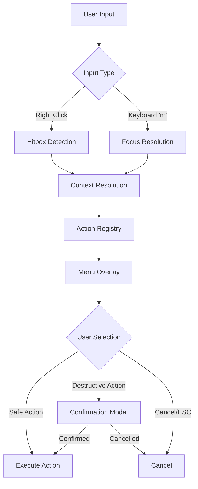
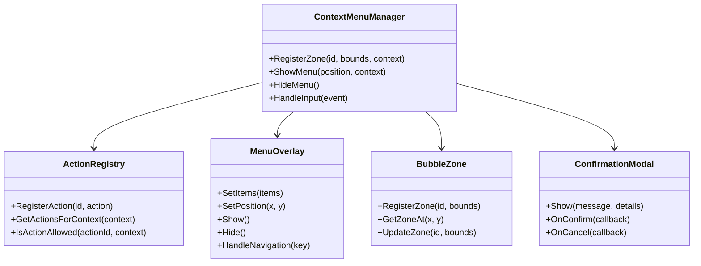
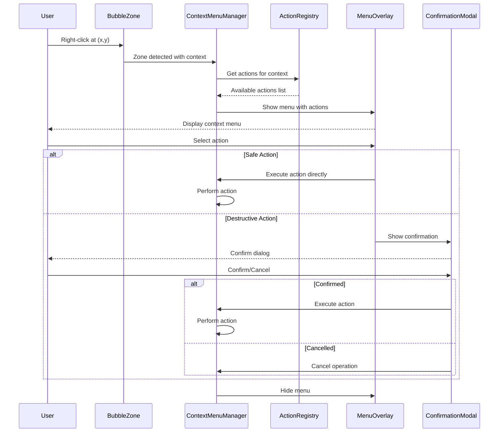

# F037: Right-Click Context Menus Design

**Version:** 1.0
**Date:** 2025-09-14
**Status:** DRAFT

## Executive Summary

This design specification outlines the implementation of right-click context menus for the TUI application. The feature will provide contextual actions accessible through mouse right-click and keyboard shortcuts, enhancing user experience by exposing relevant operations directly where users are working. The implementation leverages `bubblezone` for precise hitbox detection and includes safety mechanisms for destructive operations.

## System Architecture

### Overview

The context menu system is built around three core components:
1. **Hitbox Detection** - Uses `bubblezone` to register interactive zones
2. **Action Registry** - Maps contexts to available actions with capability checks
3. **Menu Overlay** - Lightweight UI component for displaying and handling menu interactions



### Component Architecture



### Data Flow



## API Specification

### Context Menu Manager Interface

```go
type ContextMenuManager interface {
    // Register a clickable zone with associated context
    RegisterZone(id string, bounds Rect, context MenuContext) error

    // Update the bounds of an existing zone
    UpdateZone(id string, bounds Rect) error

    // Remove a registered zone
    UnregisterZone(id string) error

    // Handle mouse/keyboard input events
    HandleInput(event InputEvent) bool

    // Show context menu at specific position
    ShowMenu(pos Position, context MenuContext) error

    // Hide any active menu
    HideMenu()

    // Check if menu is currently visible
    IsMenuVisible() bool
}
```

### Action Registry Interface

```go
type ActionRegistry interface {
    // Register a new action
    RegisterAction(action ContextAction) error

    // Get all available actions for a given context
    GetActionsForContext(context MenuContext) []ContextAction

    // Check if action is allowed in current state
    IsActionAllowed(actionID string, context MenuContext) bool

    // Execute an action with given context
    ExecuteAction(actionID string, context MenuContext) error
}
```

### Menu Overlay Interface

```go
type MenuOverlay interface {
    // Set menu items and show
    Show(items []MenuItem, position Position) error

    // Hide the menu
    Hide()

    // Handle keyboard navigation
    HandleNavigation(key KeyEvent) bool

    // Get currently selected item
    GetSelectedItem() *MenuItem

    // Set selection change callback
    OnSelectionChange(callback func(item *MenuItem))

    // Set item activation callback
    OnItemActivated(callback func(item *MenuItem))
}
```

## Data Models

### Core Types

```go
// MenuContext represents the context where menu was invoked
type MenuContext struct {
    Type        ContextType             `json:"type"`
    TargetID    string                  `json:"target_id"`
    Data        map[string]interface{}  `json:"data"`
    Position    Position                `json:"position"`
    Permissions []string                `json:"permissions"`
}

// ContextType enumeration
type ContextType string

const (
    ContextTypeQueueRow     ContextType = "queue_row"
    ContextTypeDLQItem     ContextType = "dlq_item"
    ContextTypeWorkerRow   ContextType = "worker_row"
    ContextTypeJobItem     ContextType = "job_item"
    ContextTypeClusterTab  ContextType = "cluster_tab"
    ContextTypeChart       ContextType = "chart"
    ContextTypeInfoPanel   ContextType = "info_panel"
)

// MenuItem represents a single menu item
type MenuItem struct {
    ID          string              `json:"id"`
    Label       string              `json:"label"`
    Icon        string              `json:"icon,omitempty"`
    Accelerator string              `json:"accelerator,omitempty"`
    Enabled     bool                `json:"enabled"`
    Destructive bool                `json:"destructive"`
    Separator   bool                `json:"separator"`
    SubMenu     []MenuItem          `json:"submenu,omitempty"`
    Action      string              `json:"action"`
    Data        map[string]interface{} `json:"data,omitempty"`
}

// ContextAction represents an executable action
type ContextAction struct {
    ID           string             `json:"id"`
    Label        string             `json:"label"`
    Description  string             `json:"description"`
    Icon         string             `json:"icon,omitempty"`
    Accelerator  string             `json:"accelerator,omitempty"`
    Contexts     []ContextType      `json:"contexts"`
    Permissions  []string           `json:"permissions"`
    Destructive  bool               `json:"destructive"`
    Handler      ActionHandler      `json:"-"`
}

// ActionHandler function signature
type ActionHandler func(context MenuContext) error

// Position represents screen coordinates
type Position struct {
    X int `json:"x"`
    Y int `json:"y"`
}

// Rect represents a rectangular area
type Rect struct {
    X      int `json:"x"`
    Y      int `json:"y"`
    Width  int `json:"width"`
    Height int `json:"height"`
}

// InputEvent represents user input
type InputEvent struct {
    Type     InputType `json:"type"`
    Position Position  `json:"position"`
    Key      string    `json:"key,omitempty"`
    Button   int       `json:"button,omitempty"`
    Modifiers []string `json:"modifiers,omitempty"`
}

type InputType string

const (
    InputTypeMouseClick  InputType = "mouse_click"
    InputTypeMouseMove   InputType = "mouse_move"
    InputTypeKeyPress    InputType = "key_press"
)
```

### Configuration Schema

```go
// ContextMenuConfig represents configuration for context menus
type ContextMenuConfig struct {
    Enabled             bool                        `json:"enabled"`
    KeyboardShortcut    string                      `json:"keyboard_shortcut"`
    MenuTimeout         time.Duration               `json:"menu_timeout"`
    ConfirmDestructive  bool                        `json:"confirm_destructive"`
    AnimationDuration   time.Duration               `json:"animation_duration"`
    MaxMenuWidth        int                         `json:"max_menu_width"`
    MaxMenuHeight       int                         `json:"max_menu_height"`
    Actions             map[string]ActionConfig     `json:"actions"`
    Themes              map[string]MenuTheme        `json:"themes"`
}

// ActionConfig represents action-specific configuration
type ActionConfig struct {
    Enabled         bool     `json:"enabled"`
    RequireConfirm  bool     `json:"require_confirm"`
    Permissions     []string `json:"permissions"`
    Icon            string   `json:"icon,omitempty"`
    Accelerator     string   `json:"accelerator,omitempty"`
}

// MenuTheme represents visual theming for menus
type MenuTheme struct {
    BackgroundColor string `json:"background_color"`
    BorderColor     string `json:"border_color"`
    TextColor       string `json:"text_color"`
    HighlightColor  string `json:"highlight_color"`
    DisabledColor   string `json:"disabled_color"`
    SeparatorColor  string `json:"separator_color"`
    ShadowEnabled   bool   `json:"shadow_enabled"`
}
```

## Security Model

### Threat Analysis

| Threat | Impact | Likelihood | Mitigation |
|--------|--------|------------|------------|
| Accidental destructive action | High | Medium | Confirmation modals, clear labeling |
| Permission bypass | High | Low | Action-level permission checks |
| UI spoofing | Medium | Low | Consistent styling, position validation |
| Denial of service | Medium | Low | Input rate limiting, menu timeouts |

### Security Controls

#### Permission-Based Access Control

```go
// Permission checking for context actions
type PermissionChecker interface {
    HasPermission(user string, permission string) bool
    GetUserPermissions(user string) []string
}

// Example permission checks
const (
    PermissionViewQueues    = "queues.view"
    PermissionModifyQueues  = "queues.modify"
    PermissionPurgeDLQ      = "dlq.purge"
    PermissionViewWorkers   = "workers.view"
    PermissionKillWorkers   = "workers.kill"
    PermissionViewPayloads  = "payloads.view"
    PermissionExportData    = "data.export"
)
```

#### Input Validation

1. **Position Validation**: Ensure click coordinates are within valid viewport bounds
2. **Context Validation**: Verify menu context matches actual UI state
3. **Action Validation**: Confirm requested actions are allowed for current user/context
4. **Rate Limiting**: Prevent menu spam attacks

#### Confirmation Requirements

Destructive actions require explicit confirmation with details:

```go
type ConfirmationConfig struct {
    RequireTyping    bool   `json:"require_typing"`
    ConfirmationText string `json:"confirmation_text"`
    ShowDetails      bool   `json:"show_details"`
    Timeout          int    `json:"timeout_seconds"`
}
```

## Performance Requirements

### Response Time Targets

| Operation | Target | Maximum |
|-----------|---------|---------|
| Menu show on right-click | <50ms | 100ms |
| Action execution | <200ms | 500ms |
| Menu hide/dismiss | <30ms | 50ms |
| Zone registration | <10ms | 20ms |

### Resource Constraints

- **Memory**: Menu overlay should use <1MB additional RAM
- **CPU**: Context resolution should use <5% CPU during interaction
- **Network**: No network calls required for menu operations
- **Storage**: Configuration and themes <100KB

### Scalability Considerations

- Support up to 1000 registered zones simultaneously
- Menu items limited to 50 per context to maintain usability
- Submenu depth limited to 3 levels
- Action registry supports up to 200 unique actions

## Testing Strategy

### Unit Testing

#### Component Tests
```go
func TestContextMenuManager_RegisterZone(t *testing.T)
func TestContextMenuManager_HandleRightClick(t *testing.T)
func TestActionRegistry_GetActionsForContext(t *testing.T)
func TestMenuOverlay_Navigation(t *testing.T)
func TestPermissionChecking(t *testing.T)
```

#### Mock Interfaces
- Mock BubbleZone for hitbox testing
- Mock ActionRegistry for action resolution testing
- Mock PermissionChecker for security testing

### Integration Testing

#### End-to-End Scenarios
1. **Right-click Queue Row → Show Menu → Execute Safe Action**
2. **Right-click DLQ Item → Show Menu → Execute Destructive Action → Confirm**
3. **Keyboard Shortcut → Show Menu → Navigate → Execute**
4. **Edge Cases**: Click near viewport edges, overlapping zones

#### TUI Integration
```go
func TestContextMenu_QueueRowIntegration(t *testing.T)
func TestContextMenu_DLQItemIntegration(t *testing.T)
func TestContextMenu_KeyboardNavigation(t *testing.T)
func TestContextMenu_ConfirmationFlow(t *testing.T)
```

### Performance Testing

#### Benchmarks
```go
func BenchmarkMenuShow(b *testing.B)
func BenchmarkZoneDetection(b *testing.B)
func BenchmarkActionResolution(b *testing.B)
```

#### Load Testing
- Test with maximum number of registered zones
- Rapid menu show/hide cycles
- Concurrent menu operations

### Manual Testing

#### Usability Testing
1. **Mouse Accuracy**: Verify precise hitbox detection
2. **Menu Positioning**: Test at viewport edges and corners
3. **Visual Feedback**: Confirm hover states and animations
4. **Accessibility**: Test keyboard-only navigation

#### Cross-Platform Testing
- Different terminal emulators
- Various screen resolutions
- Different mouse sensitivity settings

## Deployment Plan

### Rollout Strategy

#### Phase 1: Core Infrastructure (Week 1)
- Implement BubbleZone integration
- Basic ContextMenuManager
- Simple MenuOverlay component

#### Phase 2: Action System (Week 2)
- ActionRegistry implementation
- Permission checking
- Basic action handlers

#### Phase 3: UI Polish (Week 3)
- Menu theming and animations
- Confirmation modals
- Keyboard navigation

#### Phase 4: Integration (Week 4)
- Wire into existing TUI components
- Add context-specific actions
- Documentation and help updates

### Configuration Management

#### Default Configuration
```json
{
  "enabled": true,
  "keyboard_shortcut": "m",
  "menu_timeout": "5s",
  "confirm_destructive": true,
  "animation_duration": "150ms",
  "max_menu_width": 300,
  "max_menu_height": 400,
  "actions": {
    "queue.peek": {
      "enabled": true,
      "require_confirm": false,
      "permissions": ["queues.view"],
      "icon": "👁",
      "accelerator": "p"
    },
    "dlq.purge": {
      "enabled": true,
      "require_confirm": true,
      "permissions": ["dlq.purge"],
      "icon": "🗑",
      "accelerator": "Delete"
    }
  }
}
```

#### Environment-Specific Overrides
- Development: All actions enabled, no confirmations
- Staging: Reduced confirmations for testing
- Production: Full security controls enabled

### Monitoring and Observability

#### Metrics
```json
{
  "context_menu_shows_total": "counter",
  "context_menu_actions_total": "counter by action_id",
  "context_menu_errors_total": "counter by error_type",
  "context_menu_show_duration_ms": "histogram",
  "confirmation_modal_shows_total": "counter",
  "confirmation_modal_confirmed_total": "counter",
  "confirmation_modal_cancelled_total": "counter"
}
```

#### Logging
```json
{
  "timestamp": "2025-09-14T10:30:00Z",
  "level": "info",
  "component": "context_menu",
  "event": "menu_shown",
  "context_type": "queue_row",
  "target_id": "high_priority",
  "actions_count": 5,
  "position": {"x": 150, "y": 200},
  "user_id": "admin"
}
```

### Backward Compatibility

- Feature is additive and doesn't modify existing keyboard shortcuts
- Graceful degradation when mouse support is unavailable
- Configuration option to disable if needed
- No breaking changes to existing TUI components

### Documentation Updates

1. **User Guide**: Right-click tutorial with screenshots
2. **Developer Guide**: Action registration examples
3. **Configuration Reference**: All options and defaults
4. **API Documentation**: Interface specifications
5. **Troubleshooting Guide**: Common issues and solutions

---

## Appendices

### A. Action Catalog

#### Queue Context Actions
| Action | Description | Permission | Destructive |
|--------|-------------|------------|-------------|
| Peek | View queue contents | queues.view | No |
| Enqueue | Add new job | queues.modify | No |
| Pause | Pause queue processing | queues.modify | No |
| Resume | Resume queue processing | queues.modify | No |
| Purge | Clear all jobs | queues.purge | Yes |

#### DLQ Context Actions
| Action | Description | Permission | Destructive |
|--------|-------------|------------|-------------|
| View Details | Show job details | dlq.view | No |
| Requeue | Move back to main queue | dlq.requeue | No |
| Requeue All | Move all items back | dlq.requeue | Yes |
| Purge Item | Delete single item | dlq.purge | Yes |
| Purge All | Delete all items | dlq.purge | Yes |
| Export | Download as JSON | data.export | No |

#### Worker Context Actions
| Action | Description | Permission | Destructive |
|--------|-------------|------------|-------------|
| View Details | Show worker info | workers.view | No |
| Kill Worker | Terminate worker | workers.kill | Yes |
| View Logs | Show worker logs | workers.logs | No |

### B. Keyboard Shortcuts

| Context | Key | Action |
|---------|-----|--------|
| Any | `m` | Open context menu |
| Menu | `↑`/`↓` | Navigate items |
| Menu | `Enter` | Select item |
| Menu | `Esc` | Close menu |
| Confirmation | `Tab` | Switch focus |
| Confirmation | `Enter` | Confirm |
| Confirmation | `Esc` | Cancel |

### C. Visual Design Mockups

#### Queue Row Context Menu
```
┌─────────────────────────┐
│ 👁 Peek Queue      (p) │
│ ➕ Enqueue Job     (a) │
│ ⏸ Pause Queue     (s) │
│ ├─────────────────────  │
│ 🗑 Purge Queue         │
└─────────────────────────┘
```

#### DLQ Item Context Menu
```
┌─────────────────────────┐
│ 👁 View Details    (v) │
│ ↩️ Requeue Item     (r) │
│ 📋 Copy Job ID     (c) │
│ 💾 Export JSON     (e) │
│ ├─────────────────────  │
│ 🗑 Purge Item          │
└─────────────────────────┘
```

#### Confirmation Modal
```
┌─────────────────────────────────────┐
│ ⚠️  Confirm Destructive Action       │
├─────────────────────────────────────┤
│ Are you sure you want to purge the  │
│ DLQ "dead_letter"?                  │
│                                     │
│ This will permanently delete 123    │
│ jobs and cannot be undone.          │
│                                     │
│ Type "purge dead_letter" to confirm:│
│ [________________________]          │
│                                     │
│        [Cancel]     [Purge]         │
└─────────────────────────────────────┘
```

---

**Document Status**: Ready for Review
**Next Phase**: API Specification Development
**Estimated Implementation**: 4-8 hours