# Architecture Diagrams: Automatic Capacity Planning System

## Document Information

- **Feature ID**: F011
- **Document Type**: Architecture Diagrams
- **Version**: 1.0.0
- **Last Updated**: 2025-09-14
- **Classification**: Internal

## System Overview

### High-Level Architecture

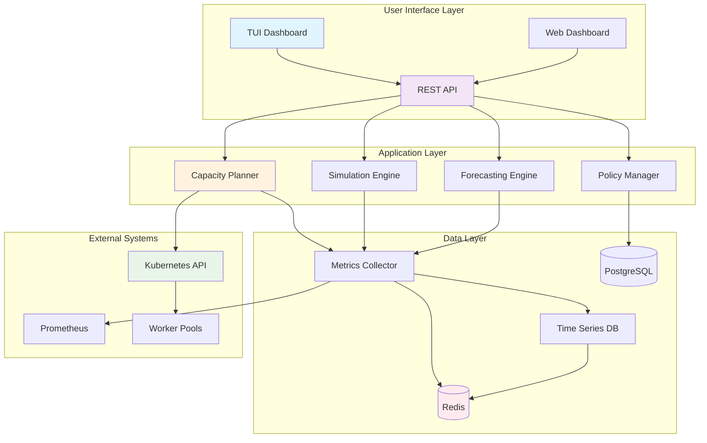

### Component Interaction Flow

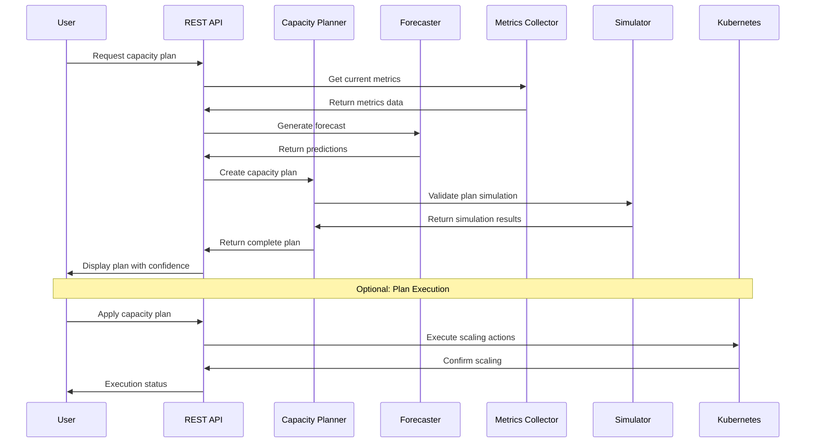

## Data Architecture

### Data Flow Diagram

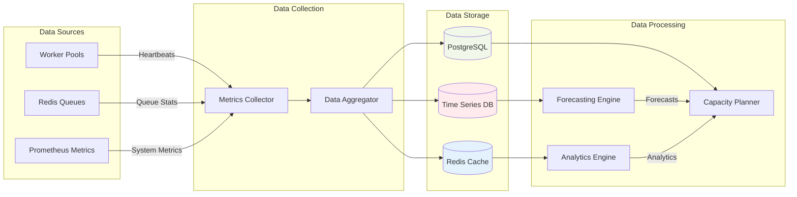

### Data Model Relationships

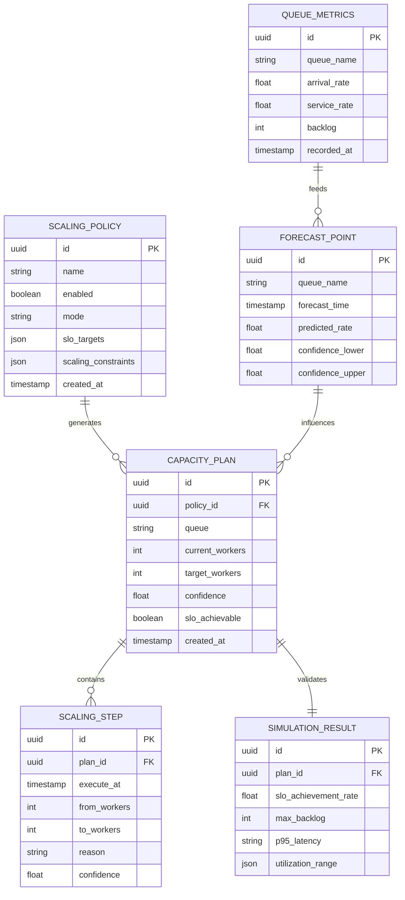

## Processing Architecture

### Capacity Planning Flow

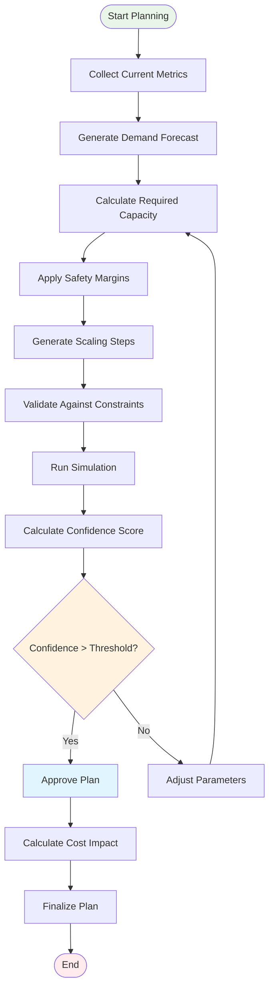

### Simulation Engine Workflow

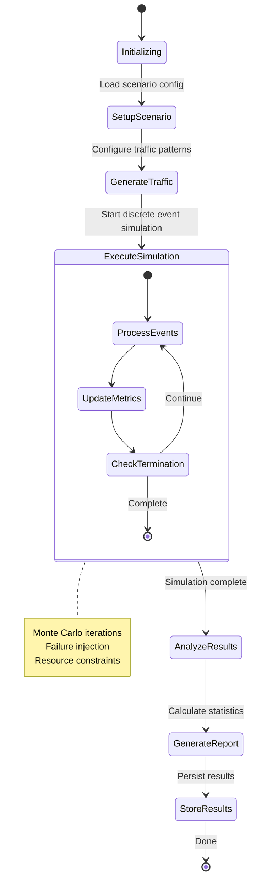

### Forecasting Pipeline

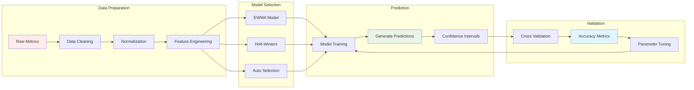

## Deployment Architecture

### Microservices Deployment

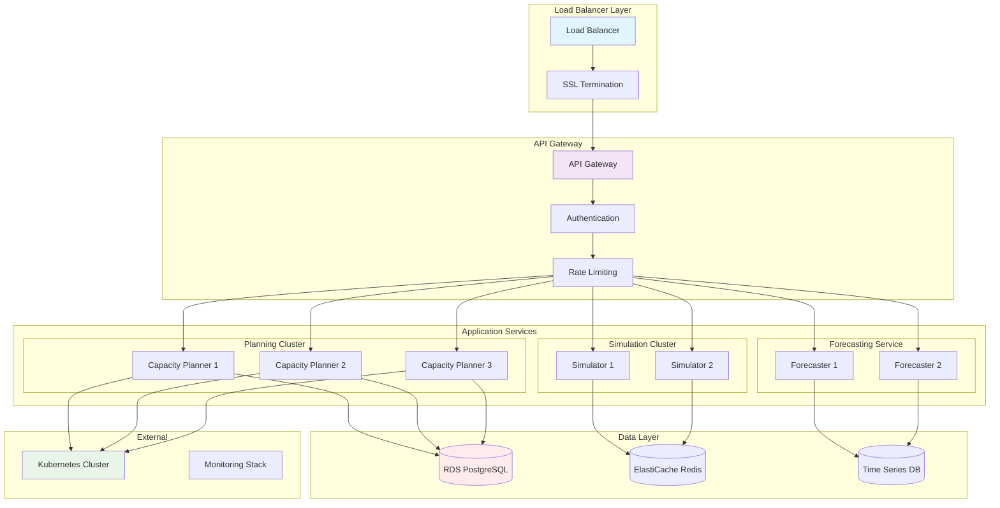

### Container Architecture

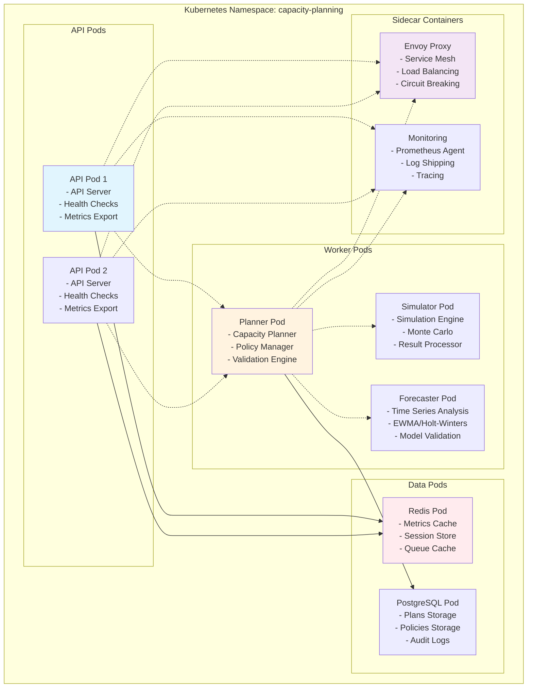

## Security Architecture

### Security Layers

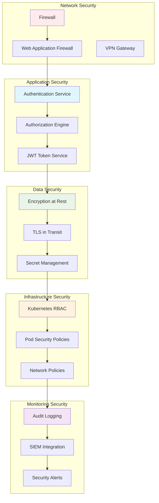

### Authentication & Authorization Flow

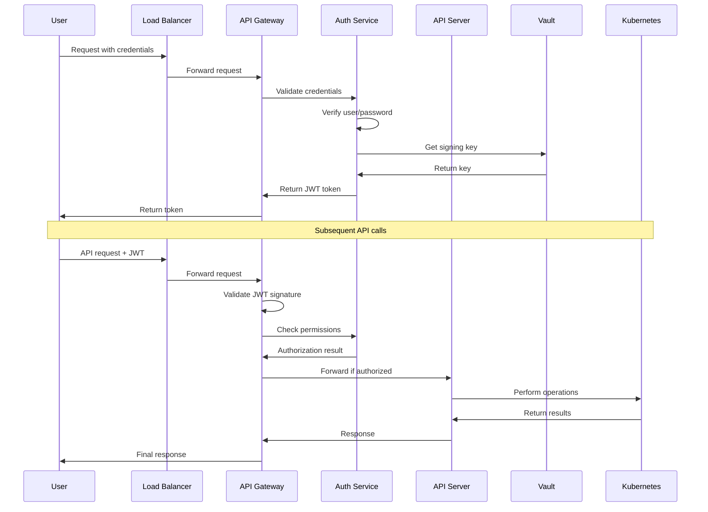

## Monitoring Architecture

### Observability Stack

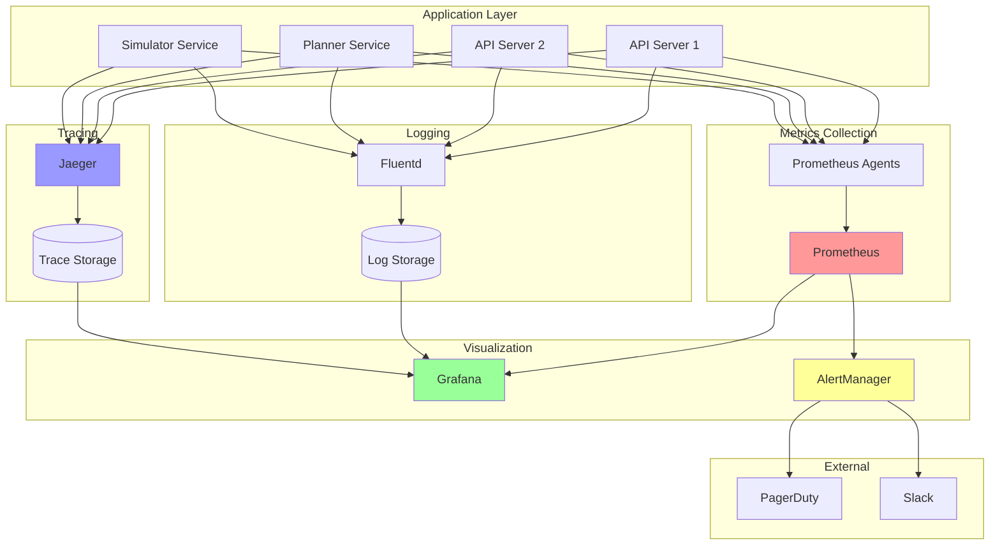

### Alert Flow

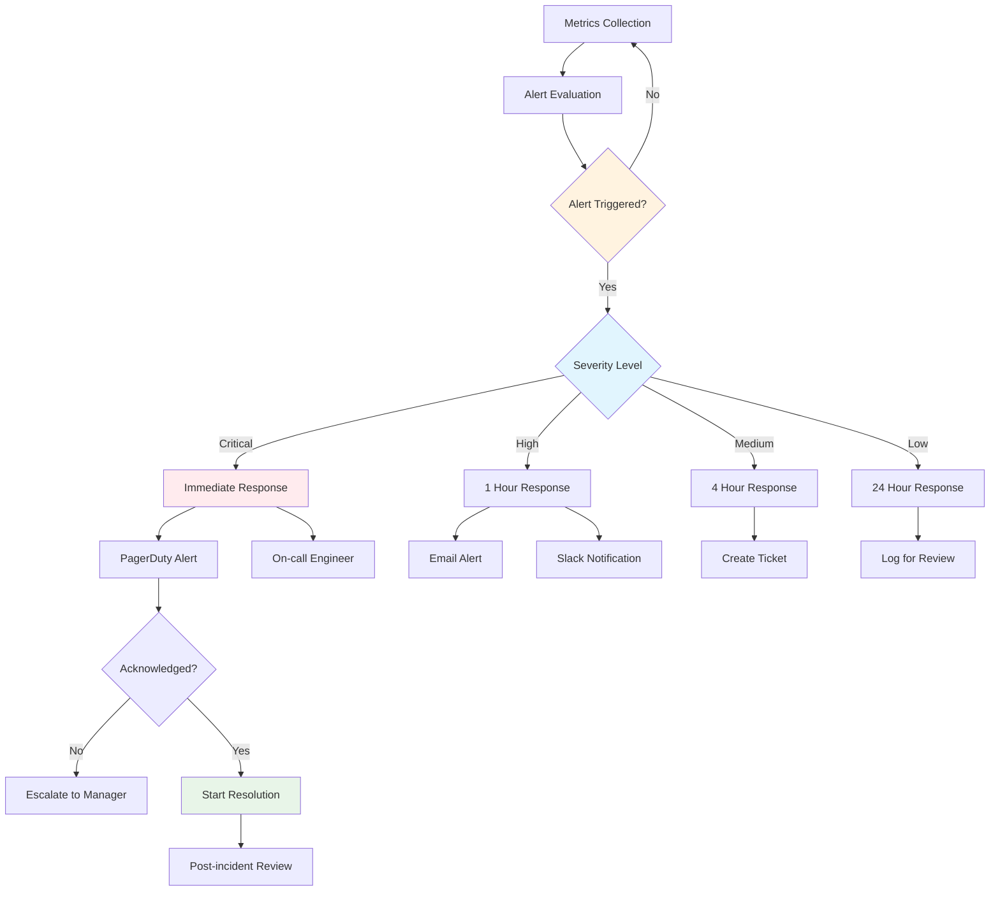

## Performance Architecture

### Caching Strategy

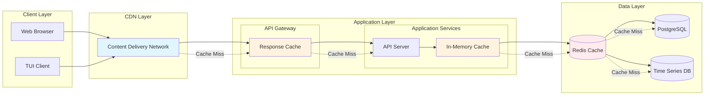

### Scaling Strategy

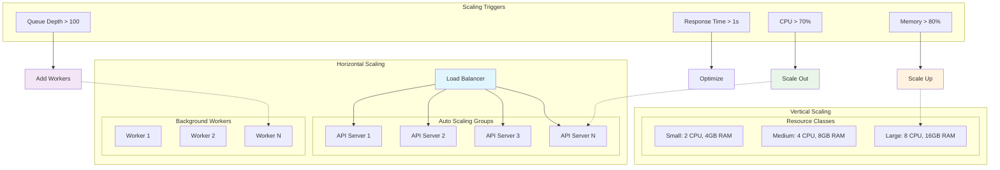

## Disaster Recovery Architecture

### Backup & Recovery Strategy

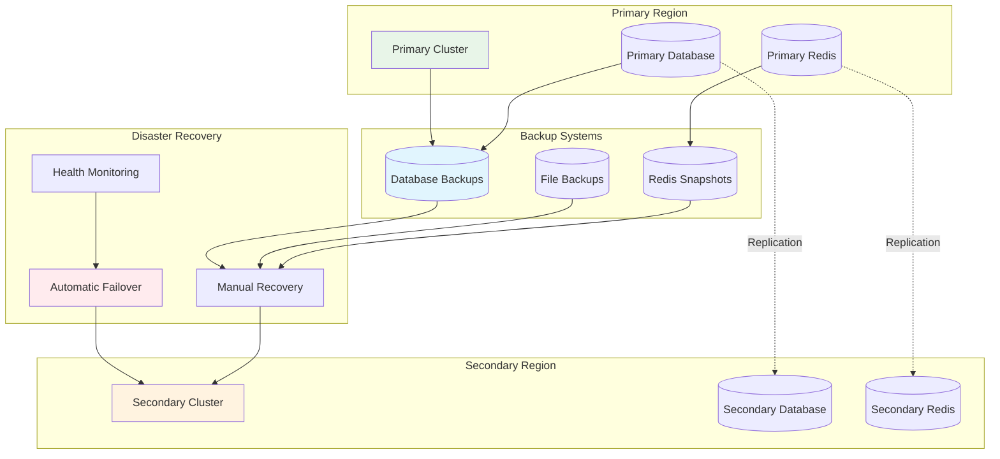

### Recovery Time Objectives

```mermaid
gantt
    title Disaster Recovery Timeline
    dateFormat X
    axisFormat %M:%S

    section Critical Systems
    API Service Recovery     :crit, 0, 300
    Database Recovery        :crit, 0, 600
    Cache Recovery          :active, 0, 180

    section Standard Systems
    Monitoring Recovery     :600, 900
    Logging Recovery        :600, 1200
    Analytics Recovery      :1200, 1800

    section Validation
    Health Checks          :300, 600
    Smoke Tests           :600, 900
    Full Validation       :900, 1500
```

## Conclusion

These architecture diagrams provide comprehensive visual documentation of the Automatic Capacity Planning system's design, covering all major aspects from high-level system architecture to detailed deployment and disaster recovery strategies.

The diagrams support:
- **System Understanding**: Clear visualization of component relationships
- **Development Planning**: Detailed service interactions and data flows
- **Deployment Strategy**: Container and infrastructure architecture
- **Operations**: Monitoring, security, and disaster recovery procedures

Regular updates to these diagrams will ensure they remain accurate as the system evolves and new requirements emerge.

---

**Document Control**
- Created: 2025-09-14
- Version: 1.0.0
- Next Review: 2025-12-14
- Owner: Solution Architecture Team
- Approval: Technical Architect Required