# Ranking Feature Ideas


## 1. **Value Axis** (What's the payoff?)

- **User Impact**: How many users affected × depth of impact
- **Revenue Potential**: Direct monetization or retention value
- **Market Differentiation**: Does this make us unique?

## 2. **Effort Axis** (What's the cost?)

- **Development Hours**: Raw engineering time
- **Maintenance Burden**: Ongoing support complexity
- **Opportunity Cost**: What else could we build instead?

## 3. **Risk Axis** (What could go wrong?)

- **Technical Risk**: Can we actually build this well?
- **Market Risk**: Will users actually want/use this?
- **Dependency Risk**: Are we betting on unstable foundations?

## 4. **Strategic Axis** (Does this build our future?)

- **Platform Effect**: Does this enable other features?
- **Lock-in/Moat**: Does this make switching costs higher?
- **Learning Value**: Will we learn something critical?

## 5. **Time Axis** (When does this matter?)

- **Urgency**: Is there a closing window?
- **Sequencing**: What must come before/after?
- **Decay Rate**: Will waiting make this harder/irrelevant?

---

## The Scoring Matrix

|Feature|Value (0-10)|Effort (0-10)|Risk (0-10)|Strategic (0-10)|Time Sensitivity|Score|
|---|---|---|---|---|---|---|
|Feature A|8|3 (low=good)|2 (low=good)|7|High|**8.5**|
|Feature B|6|7 (high=bad)|5 (medium)|9|Low|**5.2**|
|Feature C|9|9 (high=bad)|8 (high=bad)|3|Medium|**3.8**|

## The Reality Check

Here's what actually kills most feature prioritization:

1. **The Shiny Object Problem** - New ideas always seem more valuable than finishing what you started
2. **The Sunk Cost Fallacy** - "We've already built 80% of this terrible feature…"
3. **The HiPPO** (Highest Paid Person's Opinion) - When the CEO's pet feature jumps the queue
4. **The Technical Debt Denial** - Ignoring that 30% of your velocity is already lost to past shortcuts

## Claude's Formula

Use a **weighted scoring system** but be honest about the weights:

- If you're pre-product-market fit: Weight VALUE at 50%, everything else splits the rest
- If you're scaling: Weight STRATEGIC at 40%, RISK at 30%
- If you're mature: Weight EFFORT/RISK ratio highest

And here's the kicker - after all this analysis, ask yourself: **"If we could only ship ONE thing this quarter, what would move the needle most?"** That clarity often beats any scoring matrix.

## Score Radar

1. A radar chart with clear axes
2. Precise scoring criteria for each axis
3. A formula for overall score

Let me create a comprehensive feature ranking radar system with clear scoring rubrics.

### Feature Ranking Radar System


## Precise Scoring Rubrics (0-10 scale)

### 📊 **User Value** (Higher is better)

```
10 = Solves critical pain for 80%+ of users
9  = Solves critical pain for 50-79% of users
8  = Major improvement for 80%+ of users
7  = Major improvement for 50-79% of users
6  = Nice-to-have for 80%+ of users
5  = Nice-to-have for 50-79% of users
4  = Incremental improvement for most
3  = Edge case solution (< 20% users)
2  = Questionable user need
1  = No clear user value
0  = Negative user impact
```

### ⚙️ **Dev Efficiency** (Higher is better)

```
10 = < 1 day, uses existing code
9  = 1-3 days, minimal new code
8  = 1 week, well-understood problem
7  = 2 weeks, clear implementation path
6  = 1 month, some unknowns
5  = 2 months, significant complexity
4  = 3 months, major architectural changes
3  = 4-6 months, requires new expertise
2  = 6-12 months, high uncertainty
1  = > 1 year, research required
0  = Practically impossible
```

### 🛡️ **Risk Profile** (Higher is SAFER)

```
10 = Zero risk, reversible changes
9  = Minimal risk, easy rollback
8  = Low risk, contained blast radius
7  = Manageable risk, good mitigations
6  = Moderate risk, needs monitoring
5  = Notable risk, requires safeguards
4  = Significant risk, could break core features
3  = High risk, potential data loss
2  = Very high risk, security implications
1  = Extreme risk, could kill the product
0  = Guaranteed failure
```

### 🎯 **Strategic Fit** (Higher is better)

```
10 = Perfectly aligned, enables 5+ future features
9  = Core to vision, enables 3-4 features
8  = Strong alignment, platform building
7  = Good alignment, creates moat
6  = Decent fit, supports strategy
5  = Neutral, doesn't hurt or help
4  = Slight misalignment, tactical only
3  = Notable drift from strategy
2  = Contradicts strategic direction
1  = Actively harmful to strategy
0  = Destroys strategic position
```

### ⏰ **Market Timing** (Higher is better)

```
10 = Critical NOW, competitors launching
9  = Strong first-mover advantage available
8  = Market primed, high demand signals
7  = Good timing, adoption curve rising
6  = Reasonable window, 6 months viable
5  = Neutral timing, no urgency
4  = Slightly early, market not ready
3  = Too early, need education phase
2  = Too late, market saturated
1  = Missed the window entirely
0  = Market has moved on
```

## The Feature Score Card

#### **Overall Feature Score (OFS)**

```python
# Weights (must sum to 1.0)
W = {
    'user_value': 0.30,      # What users want
    'dev_efficiency': 0.20,  # What we can build
    'risk_profile': 0.15,    # What could break
    'strategic_fit': 0.25,   # Where we're going
    'market_timing': 0.10    # When it matters
}

# Calculate OFS
OFS = (
    (user_value * W['user_value']) +
    (dev_efficiency * W['dev_efficiency']) +
    (risk_profile * W['risk_profile']) +
    (strategic_fit * W['strategic_fit']) +
    (market_timing * W['market_timing'])
)

# Apply multipliers for edge cases
if risk_profile < 3:
    OFS *= 0.5  # High risk penalty
if user_value < 4:
    OFS *= 0.7  # Low value penalty
if dev_efficiency < 2:
    OFS *= 0.6  # Complexity penalty
if market_timing < 3 and market_timing > 0:
    OFS *= 0.8  # Bad timing penalty

# Bonus multipliers
if user_value >= 9 and strategic_fit >= 8:
    OFS *= 1.2  # Strategic home run bonus
if dev_efficiency >= 8 and risk_profile >= 8:
    OFS *= 1.1  # Quick win bonus
```

## Example Scoring

|Feature|User Value|Dev Efficiency|Risk Profile|Strategic Fit|Market Timing|**OFS**|
|---|---|---|---|---|---|---|
|Core API|8|7|8|9|6|**7.80**|
|Analytics|6|4|7|5|8|**5.75**|
|Mobile App|9|3|4|7|9|**6.65**|
|AI Integration|7|2|3|8|5|**4.05**|
|Social Features|5|8|9|3|4|**5.60**|

## Decision Matrix

```text
OFS >= 8.0  → BUILD NOW (Priority 1)
OFS 6.5-7.9 → BUILD SOON (Priority 2)
OFS 5.0-6.4 → CONSIDER (Priority 3)
OFS 3.5-4.9 → BACKLOG (Priority 4)
OFS < 3.5   → REJECT (Not worth it)
```

## Quick Score Card Template

```markdown
## Feature: [Name]

### Scores
- User Value:      _/10  (Weight: 30%)
- Dev Efficiency:  _/10  (Weight: 20%)
- Risk Profile:    _/10  (Weight: 15%)
- Strategic Fit:   _/10  (Weight: 25%)
- Market Timing:   _/10  (Weight: 10%)

### Overall Feature Score: ___

### Decision: [BUILD NOW / BUILD SOON / CONSIDER / BACKLOG / REJECT]
```

## Summary

Score card should include:

1. A clear radar chart example with 5 axes
2. Precise scores, 0-10, evaluation against each rubric
3. A result calculated by the weighted formula with penalties and bonuses
4. A decision matrix based on the overall score
   
---

## X-Factor Score

Reimagined ranking system to capture product's viral potential.

The first feature ranking system is very traditional/corporate and misses the intangible factors that can make products truly breakout successes. It's missing the "magic" that makes something like Wordle go viral, or why people share certain features obsessively. This redesign has more creative/viral/wow factors included.

What actually matters in today's market is whether people will lose their minds over your feature.

### The Feature Ranking Radar 2.0


## The Axes That Actually Matter

### 🤯 **Holy Shit Factor** (The Double-Take Test)

```
10 = "Wait, it can do WHAT?!" - mind completely blown
9  = Jaw drops, immediately shows someone else
8  = "That's fucking genius" reaction
7  = "Oh damn, that's clever"
6  = "Huh, that's pretty cool"
5  = "Neat" (death sentence)
4  = "Interesting…" (they're being polite)
3  = "Okay" (they don't care)
2  = "Why?" (confusion)
1  = "So?" (active disinterest)
0  = Makes people angry it exists
```

### 🐸 **Meme Potential** (The Screenshot Test)

```
10 = Will spawn its own subreddit of memes
9  = Twitter main character potential
8  = TikTok trend waiting to happen
7  = Slack emoji worthy
6  = Good for tech Twitter dunks
5  = Mild LinkedIn humble-brag
4  = Screenshot for documentation
3  = Nobody screenshots this
2  = Actively boring
1  = Meme-proof (derogatory)
0  = Becomes a meme for how bad it is
```

### 💪 **Flex Appeal** (Status Signaling)

```
10 = "I had early access" - ultimate flex
9  = Makes you look like a wizard
8  = Clear taste-maker signal
7  = Subtle insider knowledge
6  = Professional credibility
5  = Competent user vibe
4  = Basic user energy
3  = Late adopter shame
2  = Boomer tech energy
1  = Actively uncool
0  = Social suicide to admit using
```

### 😰 **FOMO Generator** (Urgency Engine)

```
10 = "Everyone has this but me" panic
9  = Waitlist with 100K+ people
8  = "Invite only" with public begging
7  = Limited time window anxiety
6  = "My competitor uses this" fear
5  = Mild curiosity if missing out
4  = Can wait energy
3  = No urgency whatsoever
2  = Proud to not need it
1  = JOMO (Joy of Missing Out)
0  = Relief it exists so you can avoid it
```

### 🎰 **Addiction Score** (The Hook)

```
10 = Check every 10 minutes
9  = First app opened in morning
8  = Phantom notification syndrome
7  = Daily habit formed
6  = 3-4 times per week usage
5  = Weekly check-in
4  = Monthly maybe
3  = Quarterly if reminded
2  = Forgot it exists
1  = Actively avoid using
0  = Uninstalled with prejudice
```

### 📤 **Shareability** (The Viral Coefficient)

```
10 = "You HAVE to try this" energy
9  = Unprompted evangelism
8  = "Check out what I made" worthy
7  = Good dinner conversation
6  = Water cooler mention
5  = Will share if asked
4  = Mild recommendation
3  = Won't mention it
2  = Embarrassed to share
1  = Warns people against it
0  = Actively hides usage
```

## The X-Factor Formula

```python
# The Virality Equation
X_FACTOR = (
    (holy_shit ** 1.5) *           # Exponential for wow
    (meme_potential * 0.8) *        # Multiplier for spread
    (flex_appeal * 0.7) *           # Status games matter
    (fomo_generator * 0.6) *        # Urgency drives action
    (addiction_score * 0.9) *       # Retention is everything
    (shareability ** 1.2)           # Viral coefficient
) ** 0.4  # Nth root to normalize

# The Reality Check
if holy_shit < 5:
    X_FACTOR *= 0.3  # Boring = dead
if meme_potential < 3:
    X_FACTOR *= 0.5  # Can't spread = won't spread
if shareability < 4:
    X_FACTOR *= 0.4  # People won't talk about it

# The Magic Bonus
if holy_shit >= 9 and meme_potential >= 8:
    X_FACTOR *= 2.0  # Lightning in a bottle
if flex_appeal >= 9 and fomo_generator >= 9:
    X_FACTOR *= 1.5  # Status game winner
```

---

## Combined Scoring System

```mermaid
graph LR
    subgraph "Traditional Score"
        T[User Value<br/>Dev Efficiency<br/>Risk Profile<br/>Strategic Fit<br/>Market Timing]
    end
    
    subgraph "X-Factor Score"
        X[Holy Shit<br/>Meme Potential<br/>Flex Appeal<br/>FOMO Generator<br/>Addiction Score<br/>Shareability]
    end
    
    T --> F[Final Score]
    X --> F
    
    F --> D{Decision}
    D -->|"High Both"| B[BUILD NOW<br/>🚀 Potential Unicorn]
    D -->|"High X, Low T"| R[BUILD ANYWAY<br/>🎰 High Risk/Reward]
    D -->|"Low X, High T"| S[BUILD SAFE<br/>😴 Boring but Solid]
    D -->|"Low Both"| K[KILL IT<br/>💀 Why Bother]
    
    style B fill:#2C5F2D,color:#fff
    style R fill:#E07B39,color:#fff
    style S fill:#6B9F7F,color:#fff
    style K fill:#BD4F36,color:#fff
```



## The Truth Matrix

|Feature Type|Traditional Score|X-Factor Score|What Happens|
|---|---|---|---|
|Wordle|4/10|9/10|🚀 NYT Acquisition|
|Flappy Bird|3/10|10/10|🚀 $50K/day|
|Enterprise Dashboard|8/10|2/10|😴 Solid B2B SaaS|
|Another Chat App|2/10|1/10|💀 Dead on arrival|
|BeReal|5/10|8/10|🚀 Viral sensation|
|Jira|7/10|1/10|😴 Everyone uses, nobody loves|

## Real Talk

**Most features optimize for Traditional Score and die in obscurity.**

The features that change the world usually:

- Make someone say "holy shit"
- Spread like wildfire through social proof
- Create FOMO or status games
- Hook users emotionally, not logically
- Give people something to talk about

Your "perfectly scored" enterprise feature with great unit economics? Nobody gives a fuck.

That stupid feature that makes people laugh and want to show their friends? That's your unicorn.
