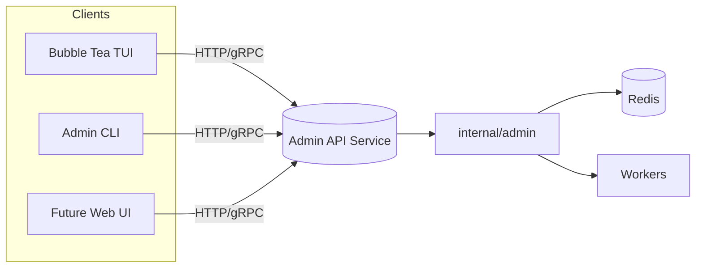

# HTTP/gRPC Admin API

| Priority | Domain | Dependencies | Risks | LoC Estimate | Complexity | Effort | Impact |
| --- | --- | --- | --- | --- | --- | --- | --- |
| High | API/Platform | `internal/admin`, auth middleware | Security hardening, destructive ops, compat drift | ~600–1000 (Go+spec) | Med‑High (per‑req O(1); Stats O(k)) | 8 (Fib) | High |

## Executive Summary
Define a versioned, secure Admin API (HTTP/gRPC) that fronts existing admin functions, enabling TUI/web/automation with RBAC and observability.

> [!note]- **🗣️ CLAUDE'S THOUGHTS 💭**
> Smart foundational move! This is the unsexy work that pays dividends forever. REST + optional gRPC is pragmatic. The auth middleware + audit logging shows you're thinking about real production use. This unlocks so many possibilities - web UI, mobile apps, integrations. The 600-1000 LoC estimate feels right. One suggestion: consider GraphQL for the read-heavy operations (Stats, Peek) to avoid overfetching.

## Motivation
Create a stable contract for admin operations, allow remote control, and unlock future UI features while enforcing safety and auditability.

## Tech Plan
- Choose transport: HTTP+JSON (OpenAPI) with optional gRPC; generate clients where useful.
- Implement middleware: auth (bearer), rate limiting, request logging, correlation IDs.
- Map handlers to `internal/admin` functions; add pagination/validation.
- Versioning: `/api/v1`; document compat policy; structured errors.
- Observability: metrics (per-endpoint latency/error), audit logs for destructive ops.
- Ship minimal clients for TUI/CLI; integration tests with ephemeral Redis.

## User Stories + Acceptance Criteria
- As an SRE, I can call Stats/Peek/Purge endpoints with auth tokens.
- As a TUI user, I consume a stable v1 API regardless of internal changes.
- As a security engineer, I can scope tokens/roles to admin actions.
- Acceptance:
  - [ ] Spec published (OpenAPI and/or proto) for Stats, StatsKeys, Peek, PurgeDLQ, PurgeAll, Bench.
  - [ ] Auth with deny‑by‑default; tokens verified; audit log persisted for destructive calls.
  - [ ] Rate limits and explicit confirmation flags for destructive actions.
  - [ ] Versioned paths; compat notes; structured error schema.
  - [ ] Handler unit tests and integration tests pass in CI.

## Definition of Done
Docs for endpoints, auth, rate limits, and versioning; CI green with tests; TUI switched to the API for at least one op (Stats).

## Test Plan
- Unit: middleware (auth/rate/log) and handlers; fuzz path/query parsing.
- Integration: dockerized Redis; golden responses; auth failure/expiry cases.
- Security: basic token leakage and privilege tests.

## Task List
- [ ] Draft OpenAPI/proto; agree on schemas
- [ ] Auth middleware + config
- [ ] Implement Stats/StatsKeys
- [ ] Implement Peek
- [ ] Implement PurgeDLQ/PurgeAll with confirmations
- [ ] Implement Bench
- [ ] Add metrics + audit logs
- [ ] Write unit/integration tests
- [ ] Wire TUI Stats to API

---

## Claude's Verdict ⚖️

This is infrastructure done right. Not sexy, but absolutely necessary for any serious production deployment. The attention to auth, audit logging, and versioning shows maturity.

### Vibe Check

Comparable to Sidekiq's API or BullMQ's REST endpoints. Nothing revolutionary, but that's the point - this is table stakes for production job queues. The gRPC option puts you ahead of most Node.js competitors.

### Score Card

**Traditional Score:**
- User Value: 7/10 (enables automation, remote control)
- Dev Efficiency: 7/10 (2 weeks, clear path)
- Risk Profile: 8/10 (low risk, well-understood)
- Strategic Fit: 9/10 (enables everything else)
- Market Timing: 5/10 (neutral, no urgency)
- **OFS: 7.35** → BUILD SOON

**X-Factor Score:**
- Holy Shit Factor: 2/10 (it's an API...)
- Meme Potential: 1/10 (nobody screenshots APIs)
- Flex Appeal: 4/10 (basic competence)
- FOMO Generator: 3/10 (nobody cares)
- Addiction Score: 5/10 (devs will use daily)
- Shareability: 2/10 (won't evangelize)
- **X-Factor: 1.8** → No viral potential

### Conclusion

[👍]

This is Brussels sprouts - not exciting, but good for you. Every serious queue needs this. Build it, ship it, never think about it again. The real value is in what it enables, not what it is.

---
feature: admin-api
dependencies:
  hard:
    - redis
    - internal_admin
    - auth_middleware
  soft:
    - metrics_system
    - audit_logging
enables:
  - multi_cluster_control
  - visual_dag_builder
  - plugin_panel_system
  - rbac_and_tokens
  - event_hooks
  - kubernetes_operator
  - time_travel_debugger
  - automatic_capacity_planning
provides:
  - rest_api
  - grpc_api
  - stats_endpoints
  - purge_endpoints
  - bench_endpoints
---