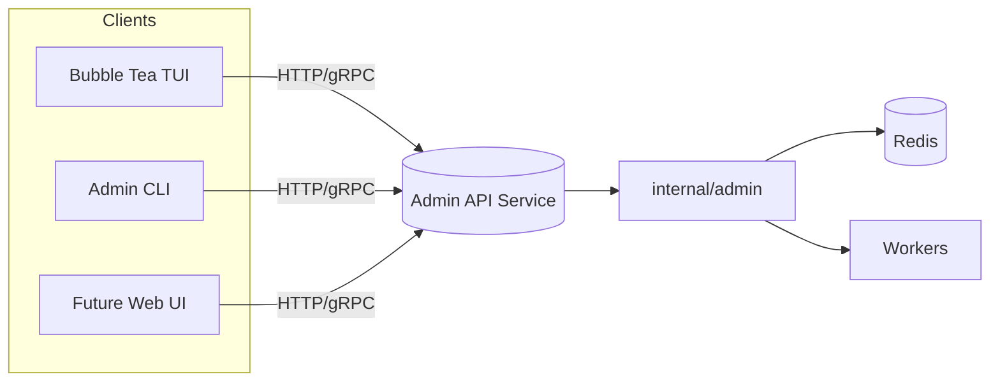

# HTTP/gRPC Admin API

| Priority | Domain | Dependencies | Risks | LoC Estimate | Complexity | Effort | Impact |
| --- | --- | --- | --- | --- | --- | --- | --- |
| High | API/Platform | `internal/admin`, auth middleware | Security hardening, destructive ops, compat drift | ~600–1000 (Go+spec) | Med‑High (per‑req O(1); Stats O(k)) | 8 (Fib) | High |

## Executive Summary
Define a versioned, secure Admin API (HTTP/gRPC) that fronts existing admin functions, enabling TUI/web/automation with RBAC and observability.

## Motivation
Create a stable contract for admin operations, allow remote control, and unlock future UI features while enforcing safety and auditability.

## Tech Plan
- Choose transport: HTTP+JSON (OpenAPI) with optional gRPC; generate clients where useful.
- Implement middleware: auth (bearer), rate limiting, request logging, correlation IDs.
- Map handlers to `internal/admin` functions; add pagination/validation.
- Versioning: `/api/v1`; document compat policy; structured errors.
- Observability: metrics (per-endpoint latency/error), audit logs for destructive ops.
- Ship minimal clients for TUI/CLI; integration tests with ephemeral Redis.

## User Stories + Acceptance Criteria
- As an SRE, I can call Stats/Peek/Purge endpoints with auth tokens.
- As a TUI user, I consume a stable v1 API regardless of internal changes.
- As a security engineer, I can scope tokens/roles to admin actions.
- Acceptance:
  - [ ] Spec published (OpenAPI and/or proto) for Stats, StatsKeys, Peek, PurgeDLQ, PurgeAll, Bench.
  - [ ] Auth with deny‑by‑default; tokens verified; audit log persisted for destructive calls.
  - [ ] Rate limits and explicit confirmation flags for destructive actions.
  - [ ] Versioned paths; compat notes; structured error schema.
  - [ ] Handler unit tests and integration tests pass in CI.

## Definition of Done
Docs for endpoints, auth, rate limits, and versioning; CI green with tests; TUI switched to the API for at least one op (Stats).

## Test Plan
- Unit: middleware (auth/rate/log) and handlers; fuzz path/query parsing.
- Integration: dockerized Redis; golden responses; auth failure/expiry cases.
- Security: basic token leakage and privilege tests.

## Task List
- [ ] Draft OpenAPI/proto; agree on schemas
- [ ] Auth middleware + config
- [ ] Implement Stats/StatsKeys
- [ ] Implement Peek
- [ ] Implement PurgeDLQ/PurgeAll with confirmations
- [ ] Implement Bench
- [ ] Add metrics + audit logs
- [ ] Write unit/integration tests
- [ ] Wire TUI Stats to API

