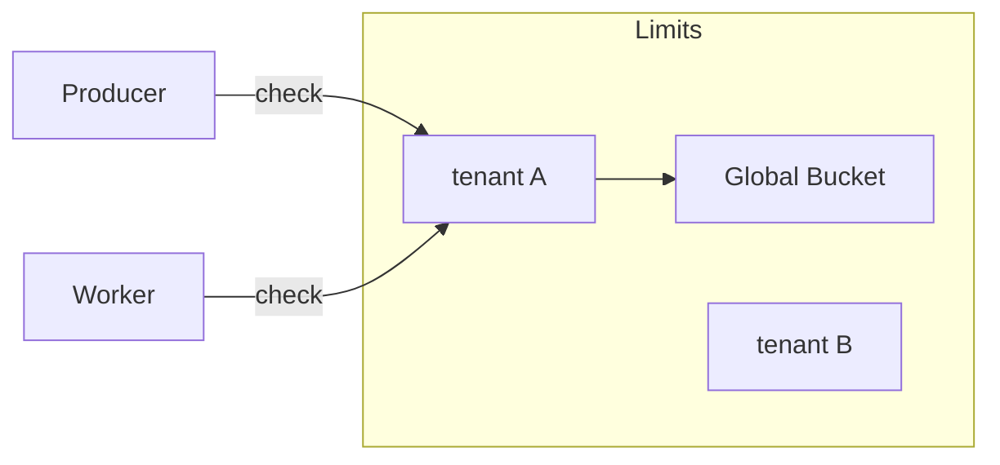

# Advanced Rate Limiting

| Priority | Domain | Dependencies | Risks | LoC Estimate | Complexity | Effort | Impact |
| --- | --- | --- | --- | --- | --- | --- | --- |
| Medium‑High | Core / Throughput | Redis Lua/atomic ops, metrics | Fairness complexity, contention | ~300–600 | Med‑High | 5 (Fib) | High |

## Executive Summary
Implement token‑bucket rate limiting with priority fairness and per‑tenant budgets. Support global and per‑queue/per‑tenant limits, dynamic tuning, and clear visibility into allowance and throttling.

> [!note]- **🗣️ CLAUDE'S THOUGHTS 💭**
> This is where you graduate from toy to enterprise. Token buckets are battle-tested (AWS API Gateway, Stripe). The Lua scripting for atomicity is crucial - no race conditions allowed. Priority fairness is the secret sauce - weighted fair queuing prevents starvation. The per-tenant isolation is $$$ for SaaS plays. Consider adding "burst credits" that accumulate during quiet periods. Also, rate limit exceptions for VIP customers is a common ask.

## Motivation
- Protect downstreams and shared infrastructure with hard, fair caps.
- Provide predictable throughput for premium or critical tenants.
- Avoid bursty overload while maintaining high utilization.

## Tech Plan
- Algorithms:
  - Token bucket per key (`tenant:queue`) with refill rate and burst capacity.
  - Priority fairness: weighted sharing between priorities (e.g., high=3, low=1) via separate buckets and proportional scheduling.
  - Global cap: aggregate bucket above tenants to ensure cluster ceiling.
- Storage & atomicity:
  - Redis Lua script to check/consume tokens atomically; returns `allow`, `wait_ms`, and remaining tokens.
  - Keys: `rl:{scope}` with TTL; metadata hash for config.
- Configuration:
  - Static config + Admin API to update rates and weights at runtime.
  - Safe bounds and validation; dry‑run mode for tuning.
- Integration points:
  - Producer side (enqueue): soft backpressure suggestions.
  - Worker pull: throttle consumption when budget depleted.
  - TUI: status widget showing budget/usage and recent throttles.
- Observability:
  - Metrics: allowed/denied, wait times, bucket fill; per scope and aggregate.
  - Debug endpoint to inspect current limits for a scope.

## User Stories + Acceptance Criteria
- As a platform owner, I can set per‑tenant caps and verify they’re enforced.
- As an SRE, I can see when throttling occurs and why.
- Acceptance:
  - [ ] Atomic token check/consume with Lua and proper TTLs.
  - [ ] Priority weights influence throughput under contention.
  - [ ] Admin API updates limits without restart; dry‑run previews impact.

## Definition of Done
Token bucket limits with fairness, runtime updates, metrics, and TUI visibility. Documentation includes examples and tuning guidance.

## Test Plan
- Unit: Lua path with table‑driven cases for edge rates; fairness under synthetic contention.
- Integration: soak tests with patterned load; verify adherence to limits and smoothness.
- Regression: persistence/TTL behavior across restarts.

## Task List
- [ ] Lua script + Go wrapper
- [ ] Config + Admin API endpoints
- [ ] Producer hints + worker integration
- [ ] TUI widget + metrics
- [ ] Docs + examples

---

## Claude's Verdict ⚖️

Enterprise-grade rate limiting that actually works. This separates serious queues from hobby projects.

### Vibe Check

Every cloud API has this. Kong, Traefik, Envoy all do token buckets. But integrated into the queue itself with per-tenant fairness? That's differentiation.

### Score Card

**Traditional Score:**
- User Value: 8/10 (critical for multi-tenant)
- Dev Efficiency: 6/10 (Lua complexity)
- Risk Profile: 7/10 (well-understood patterns)
- Strategic Fit: 8/10 (enterprise necessity)
- Market Timing: 7/10 (table stakes for SaaS)
- **OFS: 7.35** → BUILD SOON

**X-Factor Score:**
- Holy Shit Factor: 4/10 (expected in enterprise)
- Meme Potential: 2/10 (rate limiting isn't sexy)
- Flex Appeal: 7/10 ("We have Stripe-level rate limiting")
- FOMO Generator: 5/10 (competitors will copy)
- Addiction Score: 6/10 (set and forget)
- Shareability: 4/10 (mentioned in docs)
- **X-Factor: 3.8** → Low viral potential

### Conclusion

[⚖️]

Not glamorous but absolutely necessary for enterprise/SaaS. The fairness algorithm is your differentiator. Ship it and charge more.

